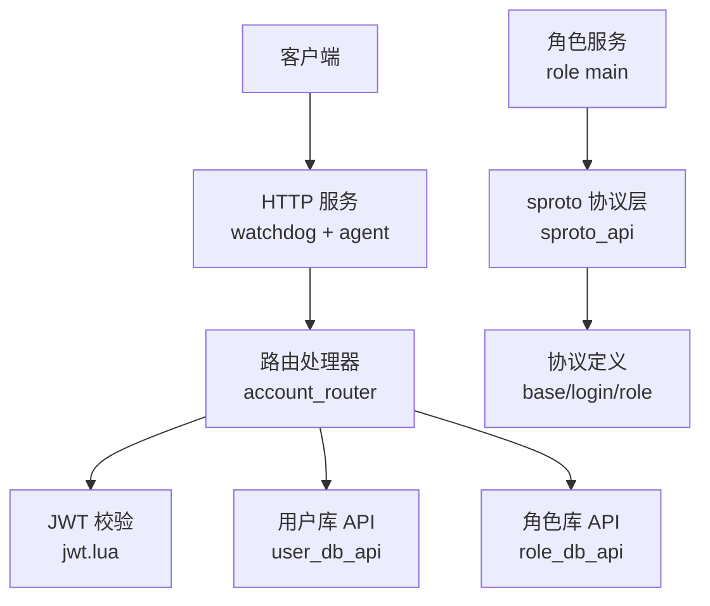
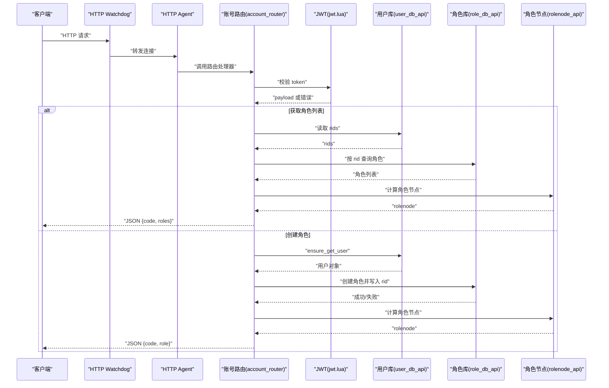
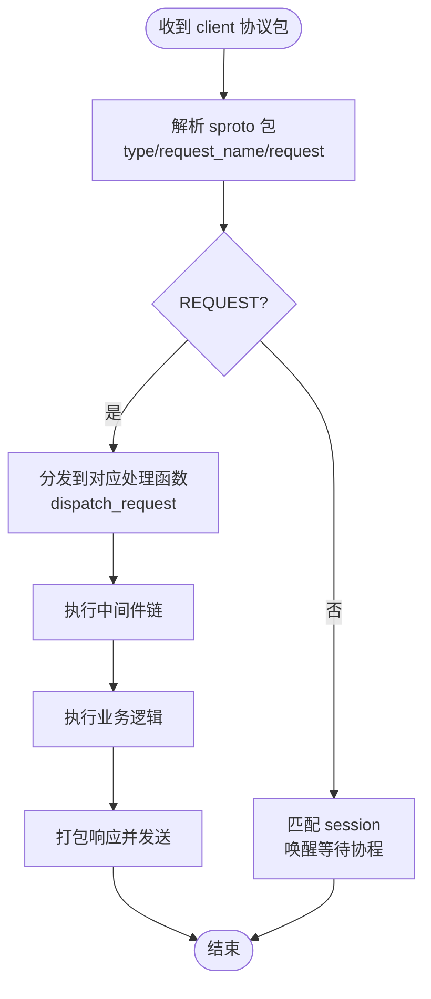
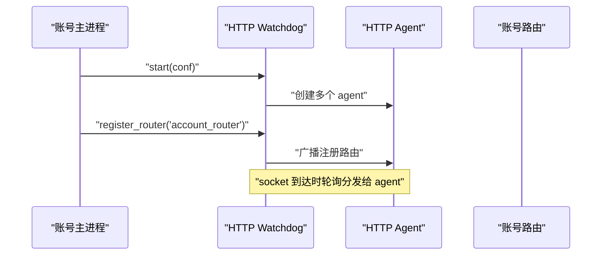
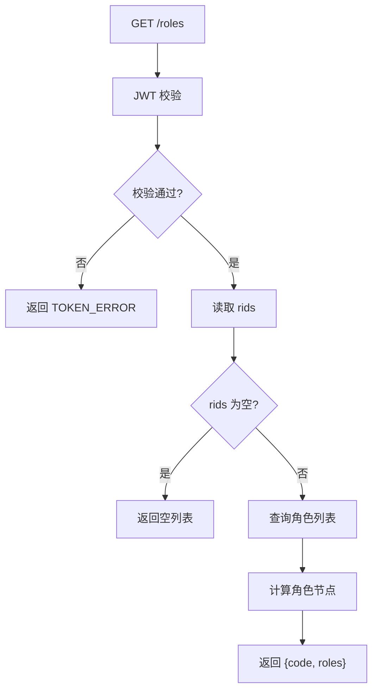
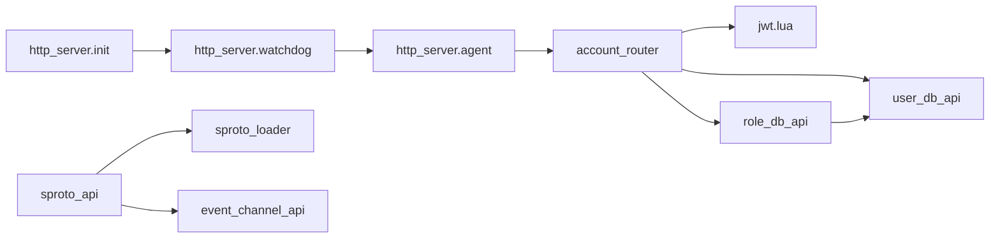

# API 参考

<cite>
**本文引用的文件**
- [README.md](file://README.md)
- [lualib/skyext.lua](file://lualib/skyext.lua)
- [lualib/http_server/init.lua](file://lualib/http_server/init.lua)
- [lualib/http_server/agent.lua](file://lualib/http_server/agent.lua)
- [lualib/http_server/watchdog.lua](file://lualib/http_server/watchdog.lua)
- [app/account/main.lua](file://app/account/main.lua)
- [app/account/lualib/account_router.lua](file://app/account/lualib/account_router.lua)
- [lualib/jwt.lua](file://lualib/jwt.lua)
- [lualib/sproto_api.lua](file://lualib/sproto_api.lua)
- [proto/base.sproto](file://proto/base.sproto)
- [proto/login.sproto](file://proto/login.sproto)
- [proto/roleagent/role.sproto](file://proto/roleagent/role.sproto)
- [app/role/main.lua](file://app/role/main.lua)
- [lualib/rolenode_api.lua](file://lualib/rolenode_api.lua)
- [lualib/user_db_api.lua](file://lualib/user_db_api.lua)
- [lualib/role_db_api.lua](file://lualib/role_db_api.lua)
- [etc/app/common.app.lua](file://etc/app/common.app.lua)
- [etc/account1.conf.lua](file://etc/account1.conf.lua)
</cite>

## 目录
1. [简介](#简介)
2. [项目结构](#项目结构)
3. [核心组件](#核心组件)
4. [架构总览](#架构总览)
5. [详细组件分析](#详细组件分析)
6. [依赖关系分析](#依赖关系分析)
7. [性能考虑](#性能考虑)
8. [故障排查指南](#故障排查指南)
9. [结论](#结论)
10. [附录](#附录)

## 简介
SkyExt 是基于 skynet 的分布式游戏服务器框架，提供账号服务（Account）、角色服务（Role）与机器人客户端（Robot）。本 API 参考文档聚焦于：
- HTTP API：账号侧提供的 RESTful 接口、认证方式、请求/响应格式与错误码。
- 二进制协议：基于 sproto 的消息格式、事件类型与实时交互模式。
- IPC/Pipe：skynet 进程间通信的数据流、消息传递与同步机制。
- 安全与速率限制：JWT 校验、跨域与安全头、请求体大小限制等。
- 调试与监控：日志系统、配置项与常见排错方法。

## 项目结构
- 应用入口
  - 账号服务：app/account/main.lua
  - 角色服务：app/role/main.lua
- HTTP 服务
  - 启动与路由注册：lualib/http_server/init.lua
  - 请求处理代理：lualib/http_server/agent.lua
  - 监听与负载均衡：lualib/http_server/watchdog.lua
- 协议与数据
  - sproto 协议定义：proto/base.sproto, proto/login.sproto, proto/roleagent/role.sproto
  - 数据库访问：lualib/user_db_api.lua, lualib/role_db_api.lua
- 配置
  - 通用配置：etc/app/common.app.lua
  - 节点配置：etc/account1.conf.lua

图表来源
- [lualib/http_server/watchdog.lua:13-39](file://lualib/http_server/watchdog.lua#L13-L39)
- [lualib/http_server/agent.lua:31-118](file://lualib/http_server/agent.lua#L31-L118)
- [app/account/lualib/account_router.lua:24-140](file://app/account/lualib/account_router.lua#L24-L140)
- [lualib/jwt.lua:18-67](file://lualib/jwt.lua#L18-L67)
- [lualib/user_db_api.lua:12-80](file://lualib/user_db_api.lua#L12-L80)
- [lualib/role_db_api.lua:12-75](file://lualib/role_db_api.lua#L12-L75)
- [lualib/sproto_api.lua:118-196](file://lualib/sproto_api.lua#L118-L196)
- [proto/base.sproto:1-7](file://proto/base.sproto#L1-L7)
- [proto/login.sproto:1-26](file://proto/login.sproto#L1-L26)
- [proto/roleagent/role.sproto:1-13](file://proto/roleagent/role.sproto#L1-L13)

章节来源
- [README.md:22-38](file://README.md#L22-L38)
- [etc/account1.conf.lua:1-4](file://etc/account1.conf.lua#L1-L4)

## 核心组件
- HTTP 服务
  - watchdog：监听端口，创建多个 http_agent，轮询分发连接。
  - agent：解析 HTTP 请求，调用路由处理器，返回 JSON 或文件。
  - init：对外暴露 start 与 register_router。
- 账号路由
  - GET /roles：查询账号下的角色列表，附带目标角色节点信息。
  - POST /create_role：创建新角色，校验数量上限与服务器映射。
- 认证
  - JWT 签发与验证：HS256/HS512，支持 nbf/iat/exp 时间校验。
- 二进制协议
  - sproto 协议加载、编解码、请求分发、call/notify 异步与超时控制。
- 数据访问
  - user_db_api：用户表增删查改，确保用户存在。
  - role_db_api：角色表查询与创建，维护 rid 集合。

章节来源
- [lualib/http_server/init.lua:8-20](file://lualib/http_server/init.lua#L8-L20)
- [lualib/http_server/watchdog.lua:13-39](file://lualib/http_server/watchdog.lua#L13-L39)
- [lualib/http_server/agent.lua:31-118](file://lualib/http_server/agent.lua#L31-L118)
- [app/account/lualib/account_router.lua:24-140](file://app/account/lualib/account_router.lua#L24-L140)
- [lualib/jwt.lua:18-100](file://lualib/jwt.lua#L18-L100)
- [lualib/sproto_api.lua:97-159](file://lualib/sproto_api.lua#L97-L159)
- [lualib/user_db_api.lua:12-80](file://lualib/user_db_api.lua#L12-L80)
- [lualib/role_db_api.lua:12-75](file://lualib/role_db_api.lua#L12-L75)

## 架构总览

图表来源
- [lualib/http_server/watchdog.lua:13-39](file://lualib/http_server/watchdog.lua#L13-L39)
- [lualib/http_server/agent.lua:31-118](file://lualib/http_server/agent.lua#L31-L118)
- [app/account/lualib/account_router.lua:24-140](file://app/account/lualib/account_router.lua#L24-L140)
- [lualib/jwt.lua:18-67](file://lualib/jwt.lua#L18-L67)
- [lualib/user_db_api.lua:60-80](file://lualib/user_db_api.lua#L60-L80)
- [lualib/role_db_api.lua:56-75](file://lualib/role_db_api.lua#L56-L75)
- [lualib/rolenode_api.lua:7-10](file://lualib/rolenode_api.lua#L7-L10)

## 详细组件分析

### HTTP API 端点
- 基础信息
  - 协议：HTTP/1.x
  - 内容类型：application/json
  - 认证：通过 query 参数中的 token（JWT），服务端使用 login_jwt_secret 校验。
  - 跨域：允许 GET/POST/OPTIONS，允许携带凭证与自定义头 x-token。
  - 请求体大小：默认 1MB，可通过配置调整。

- GET /roles
  - 描述：查询账号下所有角色，并附加目标角色节点信息。
  - 请求参数（query）
    - token: string，JWT 令牌
    - server: string，可选，过滤特定区服
  - 响应体
    - code: integer，状态码
    - roles: array，角色列表，每项包含 rid、server、name、rolenode
  - 错误处理
    - TOKEN_ERROR：token 无效或过期
    - SERVER_NOT_EXIST：server 未配置
    - DB_ERROR：数据库异常
    - OK：成功

- POST /create_role
  - 描述：为账号创建新角色，自动确保用户存在，并分配唯一 rid。
  - 请求体（JSON）
    - token: string，JWT 令牌
    - name: string，角色名
    - server: string，区服标识
  - 响应体
    - code: integer，状态码
    - role: object，新建角色信息，包含 rid、server、name、create_time、rolenode
  - 错误处理
    - TOKEN_ERROR：token 无效或过期
    - ROLE_TOO_MANY：超过最大角色数
    - SERVER_NOT_EXIST：server 未配置
    - DB_ERROR：数据库异常
    - OK：成功

- 错误码约定
  - OK：操作成功
  - TOKEN_ERROR：JWT 校验失败
  - SERVER_NOT_EXIST：服务器映射不存在
  - ROLE_TOO_MANY：超出单账号角色上限
  - DB_ERROR：数据库读写异常

- 安全与速率限制
  - 安全头：Access-Control-Allow-Origin、Methods、Headers、Credentials
  - 请求体大小限制：http_request_body_size
  - 建议：生产环境限制 CORS 来源、启用 HTTPS、对 token 进行签名与有效期控制。

章节来源
- [lualib/http_server/agent.lua:31-118](file://lualib/http_server/agent.lua#L31-L118)
- [app/account/lualib/account_router.lua:24-140](file://app/account/lualib/account_router.lua#L24-L140)
- [lualib/jwt.lua:18-67](file://lualib/jwt.lua#L18-L67)
- [etc/app/common.app.lua:90-100](file://etc/app/common.app.lua#L90-L100)

### 二进制协议（sproto）
- 协议加载与分发
  - 协议索引与路径：sproto_index、sproto_schema_path
  - 动态重载：通过事件通道订阅 schema 变更并重新加载。
  - 协议注册：client 协议 id 绑定到 sproto 分发器。

- 消息类型与交互
  - base.package：会话、类型、ud 字段
  - login 系列
    - report_remote_addr：网关上报远端地址
    - login：登录流程，返回 code、rid、rolenode
    - logout：登出
  - roleagent.role
    - login_info：获取角色登录信息

- 调用模型
  - call(fd, name, param, session, timeout)：发送请求并等待响应，支持超时。
  - notify(fd, name, param)：单向通知。
  - 中间件：可针对每个 request_name 注册拦截回调，用于鉴权、限流等。

图表来源
- [lualib/sproto_api.lua:97-159](file://lualib/sproto_api.lua#L97-L159)
- [proto/base.sproto:1-7](file://proto/base.sproto#L1-L7)
- [proto/login.sproto:1-26](file://proto/login.sproto#L1-L26)
- [proto/roleagent/role.sproto:1-13](file://proto/roleagent/role.sproto#L1-L13)

章节来源
- [lualib/sproto_api.lua:118-196](file://lualib/sproto_api.lua#L118-L196)
- [proto/base.sproto:1-7](file://proto/base.sproto#L1-L7)
- [proto/login.sproto:1-26](file://proto/login.sproto#L1-L26)
- [proto/roleagent/role.sproto:1-13](file://proto/roleagent/role.sproto#L1-L13)

### IPC/Pipe 通信（skynet）
- 服务发现与启动
  - watchdog 创建多个 http_agent，轮询分发 socket 连接。
  - 账号主进程启动后初始化 HTTP 服务并注册路由模块。
- 进程间消息
  - skynet.call/skynet.send：同步/异步调用。
  - event_channel_api：事件通道用于协议重载等广播。
- 角色节点选择
  - rolenode_api.calc_rolenode：根据 rid 计算目标角色节点（当前为占位实现）。

图表来源
- [lualib/http_server/init.lua:8-20](file://lualib/http_server/init.lua#L8-L20)
- [lualib/http_server/watchdog.lua:13-39](file://lualib/http_server/watchdog.lua#L13-L39)
- [app/account/main.lua:7-16](file://app/account/main.lua#L7-L16)

章节来源
- [lualib/http_server/watchdog.lua:13-39](file://lualib/http_server/watchdog.lua#L13-L39)
- [app/account/main.lua:7-16](file://app/account/main.lua#L7-L16)
- [lualib/rolenode_api.lua:7-10](file://lualib/rolenode_api.lua#L7-L10)

### 数据流与持久化
- 用户数据
  - ensure_get_user：若不存在则创建，并发冲突时重试读取。
  - 索引：account 唯一索引。
- 角色数据
  - get_roles：先取 rids，再按 rid 查询；单角色优化为 find_one。
  - create：插入角色并添加 rid，失败回滚 rid。
  - 索引：rid 唯一，(account, server) 复合索引。

图表来源
- [app/account/lualib/account_router.lua:24-59](file://app/account/lualib/account_router.lua#L24-L59)
- [lualib/user_db_api.lua:12-26](file://lualib/user_db_api.lua#L12-L26)
- [lualib/role_db_api.lua:12-42](file://lualib/role_db_api.lua#L12-L42)
- [lualib/rolenode_api.lua:7-10](file://lualib/rolenode_api.lua#L7-L10)

章节来源
- [lualib/user_db_api.lua:12-80](file://lualib/user_db_api.lua#L12-L80)
- [lualib/role_db_api.lua:12-75](file://lualib/role_db_api.lua#L12-L75)

## 依赖关系分析

图表来源
- [lualib/http_server/init.lua:8-20](file://lualib/http_server/init.lua#L8-L20)
- [lualib/http_server/watchdog.lua:13-39](file://lualib/http_server/watchdog.lua#L13-L39)
- [lualib/http_server/agent.lua:31-118](file://lualib/http_server/agent.lua#L31-L118)
- [app/account/lualib/account_router.lua:24-140](file://app/account/lualib/account_router.lua#L24-L140)
- [lualib/jwt.lua:18-100](file://lualib/jwt.lua#L18-L100)
- [lualib/user_db_api.lua:12-80](file://lualib/user_db_api.lua#L12-L80)
- [lualib/role_db_api.lua:12-75](file://lualib/role_db_api.lua#L12-L75)
- [lualib/sproto_api.lua:118-196](file://lualib/sproto_api.lua#L118-L196)

章节来源
- [lualib/http_server/init.lua:8-20](file://lualib/http_server/init.lua#L8-L20)
- [lualib/sproto_api.lua:118-196](file://lualib/sproto_api.lua#L118-L196)

## 性能考虑
- HTTP 并发
  - watchdog 创建多个 agent 轮询分发，提升并发处理能力。
  - 可通过 agent_count 调整并行度。
- 请求体大小
  - http_request_body_size 限制上传大小，避免内存压力。
- 数据库
  - 合理设置连接池 connections。
  - 利用索引减少查询开销。
- 协议层
  - sproto 超时默认 10 秒，可根据业务调整 sproto_timeout。
  - 中间件可用于限流与缓存。

[本节为通用指导，不直接分析具体文件]

## 故障排查指南
- 常见问题
  - JWT 校验失败：检查 login_jwt_secret 与 token 有效期。
  - 服务器映射不存在：确认 server2game 配置。
  - 角色数量超限：调整 max_role_count。
  - 数据库异常：检查 mongo 连接与索引。
- 日志与监控
  - 日志等级：log_level
  - 日志输出：file/console
  - 启动失败日志：bootfaillogpath
  - 过载队列：log_overload_mqlen
- 调试技巧
  - 开启 log_src 与 log_print_table 定位问题。
  - 使用 GM 工具或控制台命令查看服务状态。

章节来源
- [etc/app/common.app.lua:1-19](file://etc/app/common.app.lua#L1-L19)
- [app/account/lualib/account_router.lua:24-140](file://app/account/lualib/account_router.lua#L24-L140)
- [lualib/jwt.lua:18-67](file://lualib/jwt.lua#L18-L67)

## 结论
SkyExt 提供了清晰的 HTTP API 与高效的 sproto 二进制协议层，结合 skynet 的 IPC 能力实现了可扩展的分布式架构。通过 JWT 认证、合理的配置与日志体系，可满足游戏服务器的基本需求。后续可进一步完善限流、监控与治理工具。

[本节为总结性内容，不直接分析具体文件]

## 附录

### 配置要点
- 通用配置
  - etcd_config：服务发现地址
  - mongo_config：数据库连接与索引
  - sproto_index/sproto_schema_path：协议索引与路径
  - login_jwt_secret：JWT 密钥
  - server2game：区服到游戏服映射
  - http_request_body_size：HTTP 请求体大小限制
- 节点配置
  - app_config_path：应用配置文件路径
  - start：主脚本入口

章节来源
- [etc/app/common.app.lua:21-100](file://etc/app/common.app.lua#L21-L100)
- [etc/account1.conf.lua:1-4](file://etc/account1.conf.lua#L1-L4)

### 客户端实现指南
- HTTP
  - 在 query 中携带 token，或使用 header x-token（需服务端支持）。
  - 处理 JSON 响应，关注 code 字段。
- sproto
  - 使用 call/notify 与服务器交互，注意超时与 session。
  - 遵循协议定义，确保 checksum 一致。

[本节为通用指导，不直接分析具体文件]