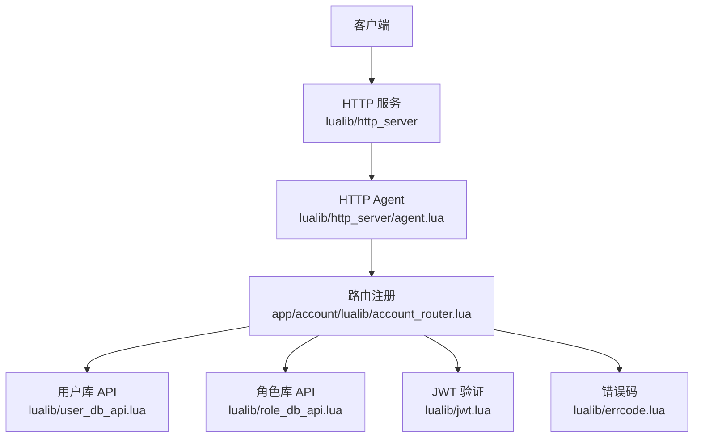
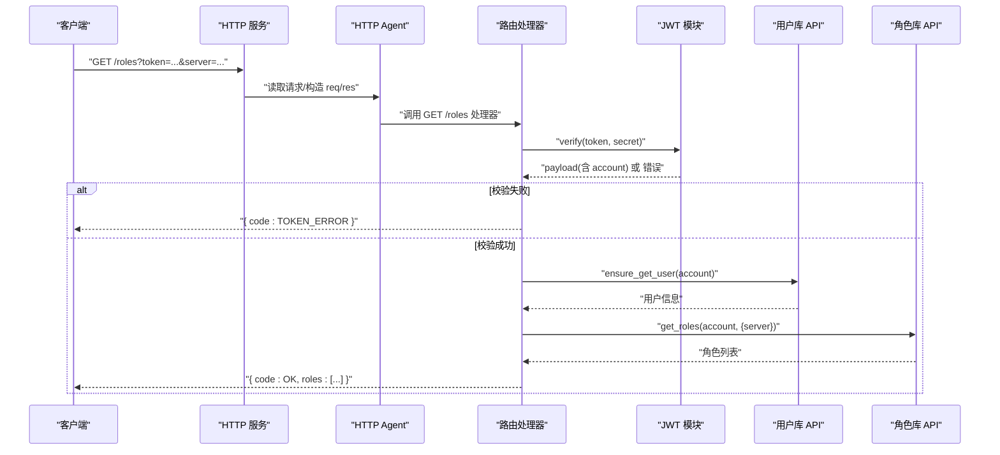
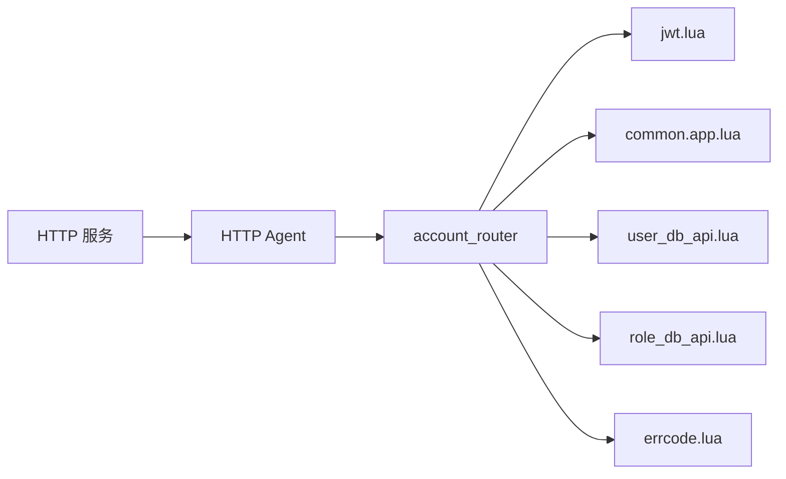

# HTTP API

<cite>
**本文引用的文件**
- [lualib/http_server/init.lua](file://lualib/http_server/init.lua)
- [lualib/http_server/agent.lua](file://lualib/http_server/agent.lua)
- [app/account/main.lua](file://app/account/main.lua)
- [app/account/lualib/account_router.lua](file://app/account/lualib/account_router.lua)
- [lualib/jwt.lua](file://lualib/jwt.lua)
- [lualib/errcode.lua](file://lualib/errcode.lua)
- [etc/app/common.app.lua](file://etc/app/common.app.lua)
- [lualib/user_db_api.lua](file://lualib/user_db_api.lua)
- [lualib/role_db_api.lua](file://lualib/role_db_api.lua)
</cite>

## 目录
1. [简介](#简介)
2. [项目结构](#项目结构)
3. [核心组件](#核心组件)
4. [架构总览](#架构总览)
5. [详细接口说明](#详细接口说明)
6. [依赖关系分析](#依赖关系分析)
7. [性能与速率限制](#性能与速率限制)
8. [安全与最佳实践](#安全与最佳实践)
9. [客户端实现指南](#客户端实现指南)
10. [调试与排错](#调试与排错)
11. [结论](#结论)

## 简介
本文件为 SkyExt 框架的 HTTP API 文档，聚焦于账号服务（Account）提供的 RESTful 接口，包括：
- GET /roles：获取当前账号的角色列表（支持按服务器过滤）
- POST /create_role：创建新角色（需携带 token、server、name）

同时说明 JWT Token 认证机制、错误码、请求/响应示例、安全与性能注意事项，以及客户端集成与调试技巧。

## 项目结构
HTTP 服务由 Account 节点启动，内部通过 http_server 模块提供 HTTP 能力，并注册路由到 account_router。请求进入后，根据方法+路径匹配处理器，进行参数校验、JWT 验证、数据库操作与结果返回。

图表来源
- [lualib/http_server/init.lua:8-20](file://lualib/http_server/init.lua#L8-L20)
- [lualib/http_server/agent.lua:20-118](file://lualib/http_server/agent.lua#L20-L118)
- [app/account/main.lua:7-16](file://app/account/main.lua#L7-L16)
- [app/account/lualib/account_router.lua:15-140](file://app/account/lualib/account_router.lua#L15-L140)

章节来源
- [lualib/http_server/init.lua:8-20](file://lualib/http_server/init.lua#L8-L20)
- [lualib/http_server/agent.lua:20-118](file://lualib/http_server/agent.lua#L20-L118)
- [app/account/main.lua:7-16](file://app/account/main.lua#L7-L16)

## 核心组件
- HTTP 服务入口：负责启动 watchdog、注册路由
- HTTP Agent：解析请求、构建 req/res、分发到路由处理器
- 路由处理器：account_router，实现业务逻辑（JWT 校验、角色查询/创建）
- JWT 模块：token 签发与校验（HS256/HS512），时间有效性检查
- 数据访问层：user_db_api、role_db_api 封装 MongoDB 操作
- 错误码：统一错误码定义

章节来源
- [lualib/http_server/init.lua:8-20](file://lualib/http_server/init.lua#L8-L20)
- [lualib/http_server/agent.lua:20-118](file://lualib/http_server/agent.lua#L20-L118)
- [app/account/lualib/account_router.lua:15-140](file://app/account/lualib/account_router.lua#L15-L140)
- [lualib/jwt.lua:17-100](file://lualib/jwt.lua#L17-L100)
- [lualib/user_db_api.lua:12-80](file://lualib/user_db_api.lua#L12-L80)
- [lualib/role_db_api.lua:12-75](file://lualib/role_db_api.lua#L12-L75)
- [lualib/errcode.lua:1-29](file://lualib/errcode.lua#L1-L29)

## 架构总览
HTTP 请求从客户端到达 Account 节点的 HTTP 服务，经 agent 解析后路由到 account_router。处理器完成 JWT 校验、参数校验、数据库读写，最终返回 JSON 响应。

图表来源
- [lualib/http_server/agent.lua:31-118](file://lualib/http_server/agent.lua#L31-L118)
- [app/account/lualib/account_router.lua:24-59](file://app/account/lualib/account_router.lua#L24-L59)
- [lualib/jwt.lua:17-67](file://lualib/jwt.lua#L17-L67)
- [lualib/user_db_api.lua:60-80](file://lualib/user_db_api.lua#L60-L80)
- [lualib/role_db_api.lua:12-42](file://lualib/role_db_api.lua#L12-L42)

## 详细接口说明

### 通用约定
- 内容类型：application/json
- 跨域：服务端已设置允许跨域及常用头
- 认证：所有接口均需要有效的 JWT Token，通过查询参数 token 传递
- 响应体：统一包含 code 字段，成功时附加业务数据

章节来源
- [lualib/http_server/agent.lua:48-56](file://lualib/http_server/agent.lua#L48-L56)
- [lualib/errcode.lua:1-29](file://lualib/errcode.lua#L1-L29)

### 获取角色列表
- 方法：GET
- URL：/roles
- 查询参数：
  - token：JWT Token（必填）
  - server：服务器标识（可选），用于过滤该服下的角色
- 成功响应：
  - code：OK
  - roles：角色数组，每个元素包含 rid、server、name 等字段，以及 rolenode（计算得到的角色节点信息）
- 失败场景：
  - token 无效或过期：code = TOKEN_ERROR
  - server 不存在：code = SERVER_NOT_EXIST
  - 数据库异常：code = DB_ERROR

请求示例
- GET /roles?token=eyJhbGciOiJIUzI1NiIsInR5cCI6IkpXVCJ9...&server=s1

响应示例（成功）
- { "code": 0, "roles": [{ "rid": "...", "server": "s1", "name": "玩家A", "rolenode": "..." }] }

响应示例（失败）
- { "code": 7 }  // TOKEN_ERROR
- { "code": 9 }  // SERVER_NOT_EXIST

章节来源
- [app/account/lualib/account_router.lua:24-59](file://app/account/lualib/account_router.lua#L24-L59)
- [lualib/role_db_api.lua:12-42](file://lualib/role_db_api.lua#L12-L42)
- [lualib/jwt.lua:17-67](file://lualib/jwt.lua#L17-L67)
- [lualib/errcode.lua:1-29](file://lualib/errcode.lua#L1-L29)

### 创建角色
- 方法：POST
- URL：/create_role
- 请求体（JSON）：
  - token：JWT Token（必填）
  - server：目标服务器标识（必填）
  - name：角色名称（必填）
- 成功响应：
  - code：OK
  - role：新建角色的详细信息，包含 rid、server、name、create_time 等，以及 rolenode
- 失败场景：
  - token 无效或过期：code = TOKEN_ERROR
  - 角色数量超过上限：code = ROLE_TOO_MANY
  - server 不存在：code = SERVER_NOT_EXIST
  - 数据库异常：code = DB_ERROR

请求示例
- POST /create_role
- Body: { "token": "eyJhbGciOiJIUzI1NiIsInR5cCI6IkpXVCJ9...", "server": "s1", "name": "玩家B" }

响应示例（成功）
- { "code": 0, "role": { "rid": "...", "server": "s1", "name": "玩家B", "create_time": 171..., "rolenode": "..." } }

响应示例（失败）
- { "code": 5 }  // ROLE_TOO_MANY
- { "code": 9 }  // SERVER_NOT_EXIST
- { "code": 7 }  // TOKEN_ERROR
- { "code": 6 }  // DB_ERROR

章节来源
- [app/account/lualib/account_router.lua:61-140](file://app/account/lualib/account_router.lua#L61-L140)
- [lualib/user_db_api.lua:60-80](file://lualib/user_db_api.lua#L60-L80)
- [lualib/role_db_api.lua:56-75](file://lualib/role_db_api.lua#L56-L75)
- [lualib/errcode.lua:1-29](file://lualib/errcode.lua#L1-L29)

### 错误码速查
- 0：OK
- 5：ROLE_TOO_MANY（角色数量超过限制）
- 6：DB_ERROR（数据库操作错误）
- 7：TOKEN_ERROR（token 错误）
- 9：SERVER_NOT_EXIST（服务器不存在）

章节来源
- [lualib/errcode.lua:1-29](file://lualib/errcode.lua#L1-L29)

## 依赖关系分析
- HTTP 服务依赖 http_server 模块与 watchdog
- 路由处理器依赖 JWT、配置、用户/角色数据库 API、错误码
- 数据库 API 依赖 mongo_conn 与配置

图表来源
- [lualib/http_server/init.lua:8-20](file://lualib/http_server/init.lua#L8-L20)
- [lualib/http_server/agent.lua:20-118](file://lualib/http_server/agent.lua#L20-L118)
- [app/account/lualib/account_router.lua:1-140](file://app/account/lualib/account_router.lua#L1-L140)
- [etc/app/common.app.lua:1-100](file://etc/app/common.app.lua#L1-L100)

章节来源
- [lualib/http_server/init.lua:8-20](file://lualib/http_server/init.lua#L8-L20)
- [lualib/http_server/agent.lua:20-118](file://lualib/http_server/agent.lua#L20-L118)
- [app/account/lualib/account_router.lua:1-140](file://app/account/lualib/account_router.lua#L1-L140)
- [etc/app/common.app.lua:1-100](file://etc/app/common.app.lua#L1-L100)

## 性能与速率限制
- 请求体大小限制：默认 1MB，可通过配置项调整
- 并发处理：HTTP Agent 基于 Skynet 事件驱动，适合高并发
- 建议：
  - 合理设置 http_request_body_size，避免过大请求导致内存压力
  - 对高频接口增加客户端侧重试退避与服务端限流策略（可在网关层或代理层实现）
  - 使用连接池与索引优化数据库查询（已在配置中声明索引）

章节来源
- [etc/app/common.app.lua:90-100](file://etc/app/common.app.lua#L90-L100)
- [lualib/http_server/agent.lua:20-21](file://lualib/http_server/agent.lua#L20-L21)

## 安全与最佳实践
- 认证机制：
  - 所有接口均需有效 JWT Token，通过查询参数 token 传递
  - 服务端使用 HS256/HS512 算法校验签名与有效期（nbf/iat/exp）
- 安全建议：
  - 生产环境务必更换默认登录密钥
  - 仅在内网或 HTTPS 网关后暴露接口，避免明文传输敏感信息
  - 对 token 进行最小化授权，避免泄露账户敏感信息
  - 记录鉴权失败的日志以便审计与告警

章节来源
- [lualib/jwt.lua:17-100](file://lualib/jwt.lua#L17-L100)
- [etc/app/common.app.lua:90-91](file://etc/app/common.app.lua#L90-L91)
- [lualib/http_server/agent.lua:48-56](file://lualib/http_server/agent.lua#L48-L56)

## 客户端实现指南
- 基础流程：
  - 先通过登录流程获取 JWT Token（Token 生成逻辑在服务端，客户端保存并使用）
  - 在后续 HTTP 请求中以查询参数 token 传递
  - 解析响应中的 code 与业务数据
- 请求示例：
  - GET /roles?token=<your_token>&server=s1
  - POST /create_role，Body: { "token": "<your_token>", "server": "s1", "name": "玩家名" }
- 错误处理：
  - 当 code 非 0 时，根据错误码提示用户或重试
  - 网络错误或超时需做指数退避重试

章节来源
- [app/account/lualib/account_router.lua:24-140](file://app/account/lualib/account_router.lua#L24-L140)
- [lualib/errcode.lua:1-29](file://lualib/errcode.lua#L1-L29)

## 调试与排错
- 常见问题：
  - 404：路径未注册或拼写错误
  - 405：不支持的 HTTP 方法
  - TOKEN_ERROR：token 格式错误、签名不匹配或已过期
  - SERVER_NOT_EXIST：server 未在配置中映射
  - ROLE_TOO_MANY：角色数超过上限
  - DB_ERROR：数据库写入失败或查询异常
- 定位步骤：
  - 检查服务端日志（HTTP 请求、JWT 校验、数据库操作）
  - 确认配置项是否正确（如 login_jwt_secret、server2game、max_role_count）
  - 使用 curl 或 Postman 复现问题，逐步缩小范围

章节来源
- [lualib/http_server/agent.lua:31-75](file://lualib/http_server/agent.lua#L31-L75)
- [app/account/lualib/account_router.lua:24-140](file://app/account/lualib/account_router.lua#L24-L140)
- [etc/app/common.app.lua:74-100](file://etc/app/common.app.lua#L74-L100)

## 结论
SkyExt 的 HTTP API 采用简洁的 RESTful 设计，结合 JWT 认证与统一的错误码体系，便于客户端集成与维护。通过合理的配置与安全策略，可支撑稳定的账号与角色管理业务。建议在网关层补充速率限制与审计，进一步提升系统的安全性与稳定性。