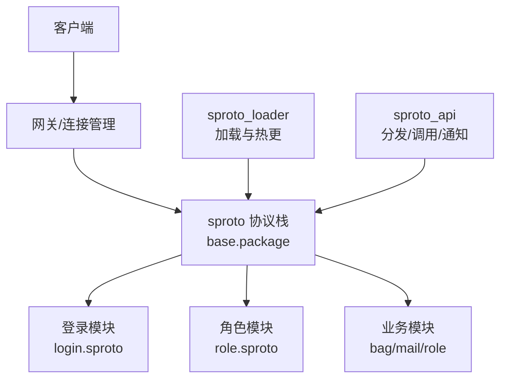
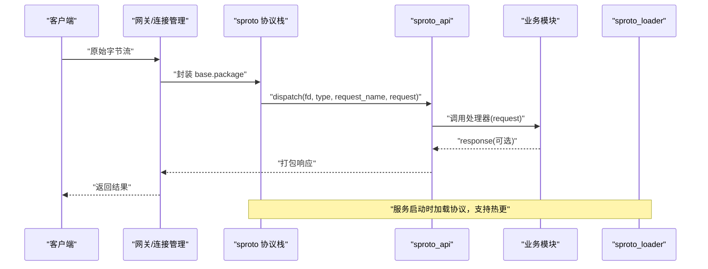
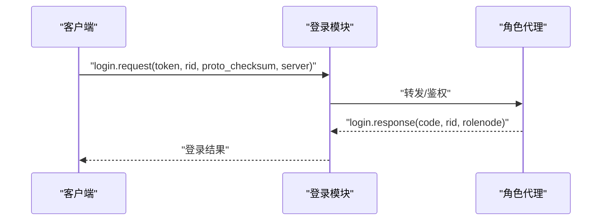
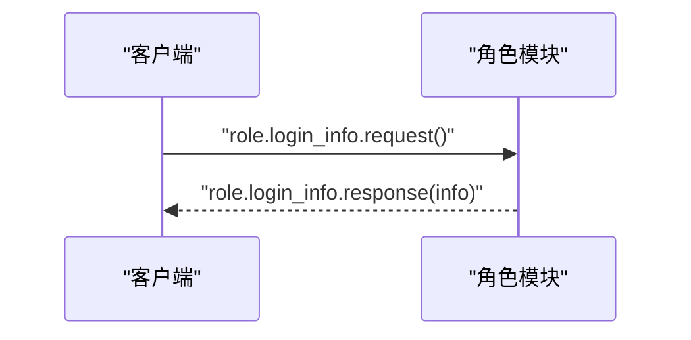
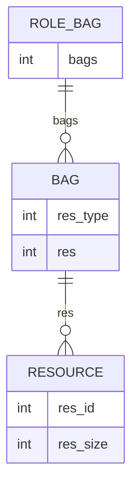
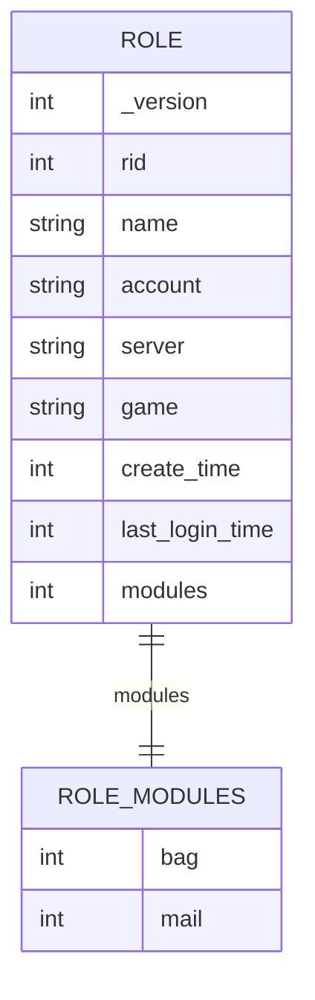
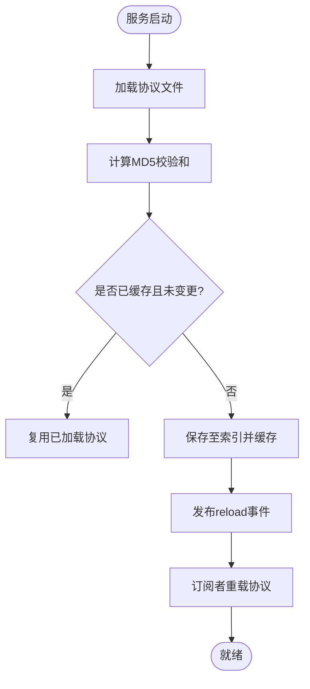
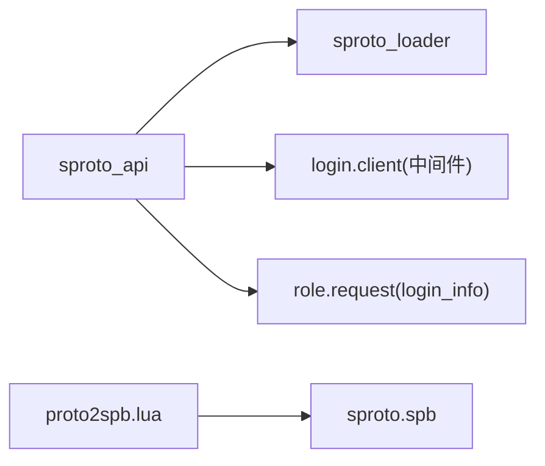

# 二进制协议

<cite>
**本文引用的文件**
- [proto/base.sproto](file://proto/base.sproto)
- [proto/login.sproto](file://proto/login.sproto)
- [proto/roleagent/role.sproto](file://proto/roleagent/role.sproto)
- [schema/bag.sproto](file://schema/bag.sproto)
- [schema/mail.sproto](file://schema/mail.sproto)
- [schema/role.sproto](file://schema/role.sproto)
- [lualib/sproto_api.lua](file://lualib/sproto_api.lua)
- [service/sproto_loader.lua](file://service/sproto_loader.lua)
- [app/role/login/client.lua](file://app/role/login/client.lua)
- [app/role/roleagent/modules/role/request.lua](file://app/role/roleagent/modules/role/request.lua)
- [tools/proto2spb.lua](file://tools/proto2spb.lua)
</cite>

## 目录
1. [简介](#简介)
2. [项目结构](#项目结构)
3. [核心组件](#核心组件)
4. [架构总览](#架构总览)
5. [详细组件分析](#详细组件分析)
6. [依赖关系分析](#依赖关系分析)
7. [性能考虑](#性能考虑)
8. [故障排查指南](#故障排查指南)
9. [结论](#结论)
10. [附录](#附录)

## 简介
本规范定义 SkyExt 框架基于 sproto 的二进制协议，覆盖消息格式、字段定义与数据类型；详细说明登录协议、角色协议、背包协议与邮件协议的完整消息结构；给出协议版本管理、向后兼容性与迁移指南；提供编解码示例（Lua 与客户端语言参考）；说明序列化/反序列化的性能优化技巧；并包含协议调试工具与监控方法。

## 项目结构
- 协议定义位于 proto 与 schema 目录：
  - proto 用于网关与服务间、服务内模块间的请求/响应协议（如登录、角色信息）。
  - schema 用于持久化数据模型（如角色、背包、邮件），供 ORM 或存储层使用。
- 运行时通过 sproto 加载器统一加载协议，并在服务启动时注册 client 协议处理。
- 配置项包括 sproto_schema_path、sproto_index、sproto_timeout 等，控制协议加载与调用超时。



**图示来源**
- [lualib/sproto_api.lua:118-130](file://lualib/sproto_api.lua#L118-L130)
- [service/sproto_loader.lua:19-59](file://service/sproto_loader.lua#L19-L59)

**章节来源**
- [proto/base.sproto:1-7](file://proto/base.sproto#L1-L7)
- [proto/login.sproto:1-26](file://proto/login.sproto#L1-L26)
- [proto/roleagent/role.sproto:1-13](file://proto/roleagent/role.sproto#L1-L13)
- [schema/bag.sproto:1-16](file://schema/bag.sproto#L1-L16)
- [schema/mail.sproto:1-37](file://schema/mail.sproto#L1-L37)
- [schema/role.sproto:1-24](file://schema/role.sproto#L1-L24)

## 核心组件
- base.package：所有消息的通用包头，包含 type、session、ud 字段，用于区分消息类型、会话标识与用户自定义数据。
- 登录协议：report_remote_addr、login、logout，负责网关到游戏侧的连接上报与角色登录/登出。
- 角色协议：role 结构与 login_info 请求/响应，返回角色基本信息。
- 数据模型：role、role_modules、role_bag、mail、mail_attach 等，描述角色及其模块的数据结构。
- sproto 运行时：sproto_api 负责协议注册、分发、调用与通知；sproto_loader 负责协议加载、校验与热更。

**章节来源**
- [proto/base.sproto:1-7](file://proto/base.sproto#L1-L7)
- [proto/login.sproto:1-26](file://proto/login.sproto#L1-L26)
- [proto/roleagent/role.sproto:1-13](file://proto/roleagent/role.sproto#L1-L13)
- [schema/role.sproto:1-24](file://schema/role.sproto#L1-L24)
- [schema/bag.sproto:1-16](file://schema/bag.sproto#L1-L16)
- [schema/mail.sproto:1-37](file://schema/mail.sproto#L1-L37)
- [lualib/sproto_api.lua:118-199](file://lualib/sproto_api.lua#L118-L199)
- [service/sproto_loader.lua:1-87](file://service/sproto_loader.lua#L1-L87)

## 架构总览
下图展示从客户端到服务端的核心流程：客户端发送消息经网关封装为 base.package，进入 sproto 协议栈后由 sproto_api 分发至对应模块处理器；模块可调用其他服务并通过 sproto call 进行同步调用，或通过 notify 推送通知。



**图示来源**
- [lualib/sproto_api.lua:118-130](file://lualib/sproto_api.lua#L118-L130)
- [service/sproto_loader.lua:19-59](file://service/sproto_loader.lua#L19-L59)

## 详细组件分析

### 基础包与通用字段
- base.package
  - type: integer，消息类型标识
  - session: integer，请求-响应对应会话号
  - ud: integer，用户自定义数据（可用于扩展）

**章节来源**
- [proto/base.sproto:1-7](file://proto/base.sproto#L1-L7)

### 登录协议
- report_remote_addr
  - request.remote_addr: string，客户端 IP
  - request.local_addr: string，本地地址
- login
  - request.token: string，JWT token（含 account）
  - request.rid: integer，直接登录的角色 ID
  - request.proto_checksum: string，协议文件校验和
  - request.server: string，区服 ID
  - response.code: integer，状态码
  - response.rid: integer，角色 ID
  - response.rolenode: string，需要连接的游戏节点
- logout
  - 无参



**图示来源**
- [proto/login.sproto:1-26](file://proto/login.sproto#L1-L26)
- [app/role/login/client.lua:55-73](file://app/role/login/client.lua#L55-L73)

**章节来源**
- [proto/login.sproto:1-26](file://proto/login.sproto#L1-L26)
- [app/role/login/client.lua:1-76](file://app/role/login/client.lua#L1-L76)

### 角色协议
- role
  - rid: integer
  - name: string
- login_info
  - request: 空
  - response.info: role



**图示来源**
- [proto/roleagent/role.sproto:1-13](file://proto/roleagent/role.sproto#L1-L13)
- [app/role/roleagent/modules/role/request.lua:7-29](file://app/role/roleagent/modules/role/request.lua#L7-L29)

**章节来源**
- [proto/roleagent/role.sproto:1-13](file://proto/roleagent/role.sproto#L1-L13)
- [app/role/roleagent/modules/role/request.lua:1-32](file://app/role/roleagent/modules/role/request.lua#L1-L32)

### 背包协议（数据模型）
- role_bag
  - bags: *bag(res_type)，背包列表
- bag
  - res_type: integer，资源分类
  - res: *resource(res_id)，资源列表
- resource
  - res_id: integer，资源 ID
  - res_size: integer，资源数量



**图示来源**
- [schema/bag.sproto:1-16](file://schema/bag.sproto#L1-L16)

**章节来源**
- [schema/bag.sproto:1-16](file://schema/bag.sproto#L1-L16)

### 邮件协议（数据模型）
- role_mail
  - _version: integer，版本字段
  - mails: *mail(mail_id)，邮件列表
- mail
  - mail_id: integer，邮件 ID
  - cfg_id: integer，邮件配置 ID
  - title: *str2str()，标题键值对
  - detail: *str2str()，内容键值对
  - send_time: integer，发送时间
  - send_role: mail_role，发送人
  - attach: mail_attach，附件
- str2str
  - key: string
  - value: string
- mail_role
  - rid: integer，玩家 ID
  - name: string，玩家名字
- mail_attach
  - res_type: integer，资源分类
  - res_id: integer，资源 ID
  - res_size: integer，资源数量

```mermaid
erDiagram
ROLE_MAIL {
int _version
int mails
}
MAIL {
int mail_id
int cfg_id
int send_time
int send_role
int attach
}
STR2STR {
string key
string value
}
MAIL_ROLE {
int rid
string name
}
MAIL_ATTACH {
int res_type
int res_id
int res_size
}
ROLE_MAIL ||--o{ MAIL : "mails"
MAIL ||--|| MAIL_ROLE : "send_role"
MAIL ||--o{ MAIL_ATTACH : "attach"
MAIL ||--* STR2STR : "title/detail"
```

**图示来源**
- [schema/mail.sproto:1-37](file://schema/mail.sproto#L1-L37)

**章节来源**
- [schema/mail.sproto:1-37](file://schema/mail.sproto#L1-L37)

### 角色数据模型（含模块）
- role
  - _version: integer
  - rid: integer
  - name: string
  - account: string
  - server: string，客户端看到的服务器
  - game: string，玩法范围（合服相关）
  - create_time: integer
  - last_login_time: integer
  - modules: role_modules，模块列表
- role_modules
  - bag: role_bag
  - mail: role_mail



**图示来源**
- [schema/role.sproto:1-24](file://schema/role.sproto#L1-L24)

**章节来源**
- [schema/role.sproto:1-24](file://schema/role.sproto#L1-L24)

### 协议加载与热更
- sproto_loader
  - 读取协议文件并计算 MD5 校验和
  - 使用 sprotoloader.save/load 缓存与加载
  - 通过事件通道发布 reload 信号，触发各服务重载
  - 提供 GM 命令重载所有已加载协议
- sproto_api
  - 初始化时获取 sproto_loader 服务并加载协议
  - 注册 client 协议，将底层消息分发给业务模块
  - 提供 call/notify/raw_dispatch 等接口



**图示来源**
- [service/sproto_loader.lua:19-59](file://service/sproto_loader.lua#L19-L59)
- [lualib/sproto_api.lua:169-199](file://lualib/sproto_api.lua#L169-L199)

**章节来源**
- [service/sproto_loader.lua:1-87](file://service/sproto_loader.lua#L1-L87)
- [lualib/sproto_api.lua:118-199](file://lualib/sproto_api.lua#L118-L199)

## 依赖关系分析
- sproto_api 依赖 sproto_loader 提供的协议加载能力，并通过 skynet.register_protocol 接入 Skynet 网络栈。
- 登录模块在 client.lua 中注册中间件，拦截未认证请求。
- 角色模块实现 login_info 处理器，返回角色信息。
- 工具脚本 proto2spb.lua 可将多个 sproto 文件合并生成 spb 产物，便于跨语言客户端使用。



**图示来源**
- [lualib/sproto_api.lua:118-199](file://lualib/sproto_api.lua#L118-L199)
- [app/role/login/client.lua:55-73](file://app/role/login/client.lua#L55-L73)
- [app/role/roleagent/modules/role/request.lua:7-29](file://app/role/roleagent/modules/role/request.lua#L7-L29)
- [tools/proto2spb.lua:1-30](file://tools/proto2spb.lua#L1-L30)

**章节来源**
- [lualib/sproto_api.lua:118-199](file://lualib/sproto_api.lua#L118-L199)
- [app/role/login/client.lua:1-76](file://app/role/login/client.lua#L1-L76)
- [app/role/roleagent/modules/role/request.lua:1-32](file://app/role/roleagent/modules/role/request.lua#L1-L32)
- [tools/proto2spb.lua:1-30](file://tools/proto2spb.lua#L1-L30)

## 性能考虑
- 协议加载与热更
  - 使用 sprotoloader 缓存与 MD5 校验避免重复解析，减少 CPU 与内存开销。
  - 通过事件通道广播 reload，确保多服务一致更新。
- 调用与超时
  - sproto_api.call 默认超时来自配置 sproto_timeout，避免阻塞协程。
  - 合理设置超时时间，降低等待成本。
- 序列化优化
  - 尽量使用整数与字符串等基础类型，减少嵌套层级。
  - 批量数据采用数组形式（如 *bag、*mail）以降低头部开销。
- 日志与监控
  - 关键路径记录 fd、request_name、session 等信息，便于定位问题。
  - 结合 GM 命令重载协议，快速验证新协议生效。

[本节为通用性能建议，不直接分析具体文件]

## 故障排查指南
- 常见问题
  - 协议不一致：客户端与服务端 sproto 版本不同导致解析失败。可通过 proto_checksum 与服务端加载的 checksum 对比定位。
  - 未认证访问：登录前调用受保护接口会被中间件拒绝，需先完成登录流程。
  - 调用超时：检查 sproto_timeout 配置与远端处理耗时。
- 调试手段
  - 使用 GM 命令重载协议，确认热更成功。
  - 查看 sproto_api 的分发日志，核对 request_name 与 fd。
  - 通过 tools/proto2spb.lua 生成 spb 文件，配合客户端调试工具比对消息结构。

**章节来源**
- [service/sproto_loader.lua:68-80](file://service/sproto_loader.lua#L68-L80)
- [app/role/login/client.lua:55-73](file://app/role/login/client.lua#L55-L73)
- [lualib/sproto_api.lua:47-79](file://lualib/sproto_api.lua#L47-L79)
- [tools/proto2spb.lua:1-30](file://tools/proto2spb.lua#L1-L30)

## 结论
SkyExt 的二进制协议以 sproto 为核心，通过 base.package 统一封装，登录、角色、背包、邮件等模块清晰分层。协议加载具备热更能力，支持版本管理与兼容性约束。通过合理的超时、日志与 GM 工具，可实现高效的开发与运维闭环。

[本节为总结性内容，不直接分析具体文件]

## 附录

### 协议版本管理与向后兼容
- 版本字段
  - role_mail._version、role._version 用于标识数据结构版本。
- 兼容原则
  - 新增字段：保持向后兼容，旧客户端忽略未知字段。
  - 删除字段：标记废弃而非直接删除，保留一段时间。
  - 类型变更：禁止直接修改字段类型，需引入新版本字段并逐步迁移。
- 迁移策略
  - 服务端同时支持新旧版本解析逻辑，逐步淘汰旧字段。
  - 客户端根据 _version 选择解析路径。

**章节来源**
- [schema/role.sproto:1-24](file://schema/role.sproto#L1-L24)
- [schema/mail.sproto:1-37](file://schema/mail.sproto#L1-L37)

### 编解码示例（Lua 与客户端语言参考）
- Lua 服务端
  - 使用 sproto_api 的 call/notify 进行请求与通知。
  - 通过 sproto_host 与 attach 生成的函数进行编解码。
- 客户端语言
  - 使用 tools/proto2spb.lua 生成 spb 文件，配合对应语言的 sproto 库进行编解码。
  - 注意 base.package 的 type/session/ud 字段映射。

**章节来源**
- [lualib/sproto_api.lua:132-159](file://lualib/sproto_api.lua#L132-L159)
- [tools/proto2spb.lua:1-30](file://tools/proto2spb.lua#L1-L30)

### 调试与监控
- 协议重载
  - 使用 GM 命令 reload_sproto_schema 重载所有协议。
- 日志记录
  - 关注 sproto_api 的分发日志与错误堆栈。
- 工具链
  - 使用 proto2spb.lua 生成 spb 文件，配合客户端抓包工具比对消息。

**章节来源**
- [service/sproto_loader.lua:68-80](file://service/sproto_loader.lua#L68-L80)
- [lualib/sproto_api.lua:47-79](file://lualib/sproto_api.lua#L47-L79)
- [tools/proto2spb.lua:1-30](file://tools/proto2spb.lua#L1-L30)