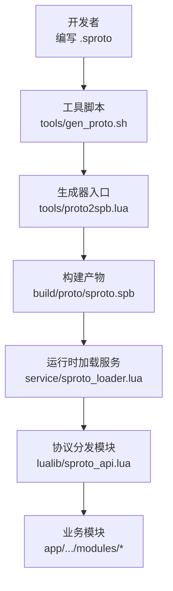
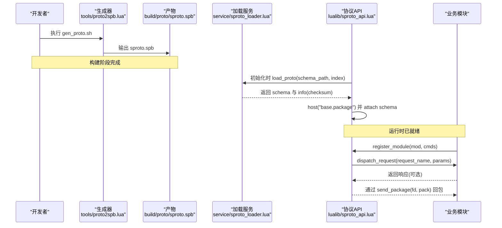
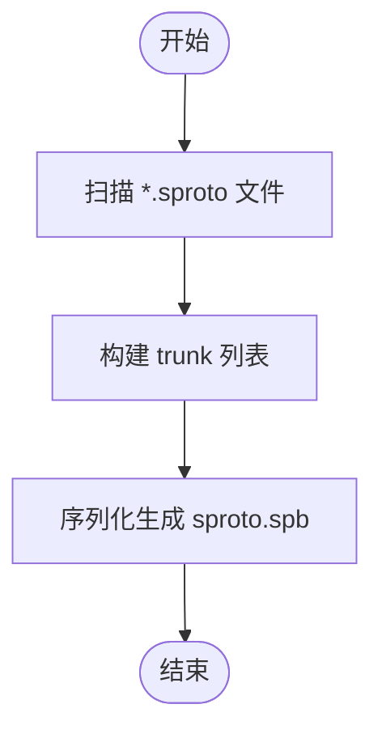
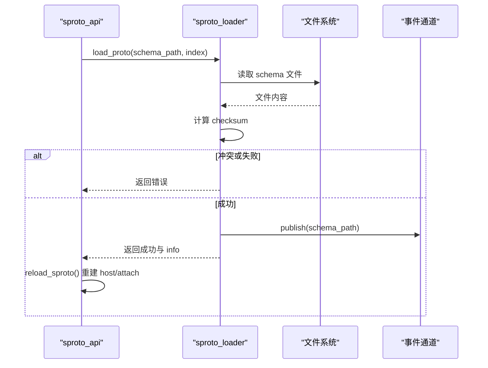
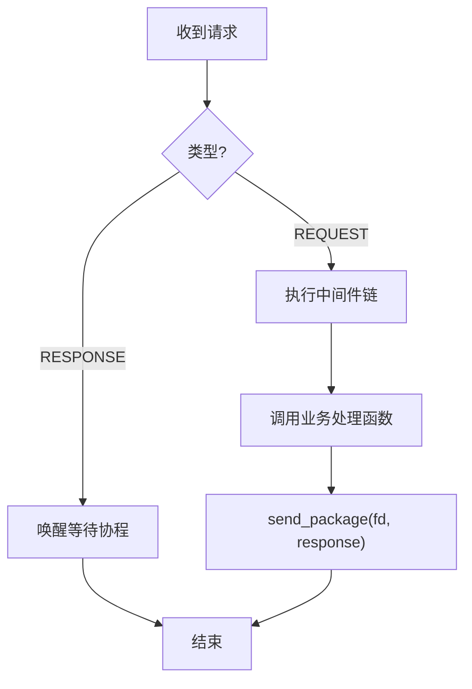
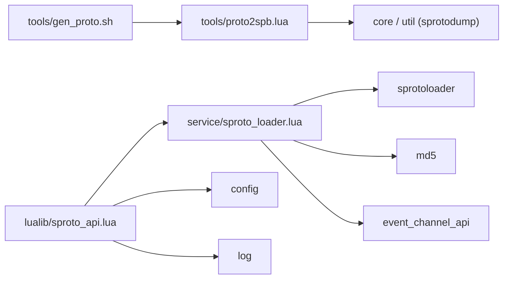

# 协议开发指南

<cite>
**本文引用的文件**
- [README.md](file://README.md)
- [base.sproto](file://proto/base.sproto)
- [login.sproto](file://proto/login.sproto)
- [role.sproto](file://proto/roleagent/role.sproto)
- [bag.sproto](file://proto/roleagent/bag.sproto)
- [sproto_api.lua](file://lualib/sproto_api.lua)
- [sproto_loader.lua](file://service/sproto_loader.lua)
- [gen_proto.sh](file://tools/gen_proto.sh)
- [proto2spb.lua](file://tools/proto2spb.lua)
- [run.lua](file://tools/run.lua)
- [client.lua](file://app/role/login/client.lua)
</cite>

## 目录
1. [简介](#简介)
2. [项目结构](#项目结构)
3. [核心组件](#核心组件)
4. [架构总览](#架构总览)
5. [详细组件分析](#详细组件分析)
6. [依赖关系分析](#依赖关系分析)
7. [性能考量](#性能考量)
8. [故障排查指南](#故障排查指南)
9. [结论](#结论)
10. [附录](#附录)

## 简介
本指南面向使用 SkyExt 框架进行 sproto 协议开发的工程师，提供从协议设计、命名与类型规范、版本管理，到代码生成、运行时加载、调试与性能分析的完整实践。文档基于仓库现有实现，聚焦以下目标：
- 明确 sproto 协议的编写规范与最佳实践（命名约定、字段类型选择、版本管理）
- 说明从 .sproto 定义到可运行 schema 的生成流程
- 给出新增协议的端到端步骤（设计、创建、生成、注册、测试）
- 解释协议版本管理与向后兼容策略
- 提供调试工具与性能分析方法
- 指导不同语言客户端如何正确编解码

## 项目结构
SkyExt 将协议定义集中在 proto 目录，通过工具链生成二进制 schema，并在服务启动时由专用服务加载并热更新。核心路径如下：
- 协议定义：proto/*.sproto、proto/*/*.sproto
- 生成产物：build/proto/sproto.spb
- 运行时加载：service/sproto_loader.lua
- 协议分发与调用封装：lualib/sproto_api.lua
- 工具脚本：tools/gen_proto.sh、tools/proto2spb.lua、tools/run.lua

**图示来源**
- [gen_proto.sh:1-8](file://tools/gen_proto.sh#L1-L8)
- [proto2spb.lua:1-31](file://tools/proto2spb.lua#L1-L31)
- [sproto_loader.lua:1-86](file://service/sproto_loader.lua#L1-L86)
- [sproto_api.lua:118-196](file://lualib/sproto_api.lua#L118-L196)

**章节来源**
- [README.md:112-130](file://README.md#L112-L130)

## 核心组件
- 协议定义层：proto 下的 .sproto 文件，描述消息结构与包格式
- 生成层：tools/gen_proto.sh + tools/proto2spb.lua，聚合多个 sproto 文件并输出统一 spb
- 加载层：service/sproto_loader.lua，负责读取、校验、保存与发布 schema 变更事件
- 运行层：lualib/sproto_api.lua，注册 skynet client 协议、分发请求、封装 call/notify、维护 session 与超时
- 业务接入层：各业务模块通过 register_module 注册请求处理函数与中间件

关键职责与交互：
- 生成阶段：将多份 .sproto 合并为 trunk，再序列化为 sproto.spb
- 运行阶段：sproto_loader 按配置路径加载 schema，计算 checksum，缓存并按 index 区分；schema 变更通过事件通道通知 sproto_api 重载
- 分发阶段：sproto_api 将网络包解析为 request_name 与参数，经中间件后路由至具体 handler
- 调用阶段：call 发送带 session 的请求，等待响应或超时；notify 用于单向通知

**章节来源**
- [sproto_api.lua:19-79](file://lualib/sproto_api.lua#L19-L79)
- [sproto_api.lua:97-159](file://lualib/sproto_api.lua#L97-L159)
- [sproto_api.lua:169-196](file://lualib/sproto_api.lua#L169-L196)
- [sproto_loader.lua:19-59](file://service/sproto_loader.lua#L19-L59)
- [proto2spb.lua:1-31](file://tools/proto2spb.lua#L1-L31)

## 架构总览
下图展示从协议定义到请求分发的完整链路，包括生成、加载、分发与调用。

**图示来源**
- [gen_proto.sh:1-8](file://tools/gen_proto.sh#L1-L8)
- [proto2spb.lua:1-31](file://tools/proto2spb.lua#L1-L31)
- [sproto_loader.lua:19-59](file://service/sproto_loader.lua#L19-L59)
- [sproto_api.lua:118-196](file://lualib/sproto_api.lua#L118-L196)

## 详细组件分析

### 协议定义与命名规范
- 包结构：在 base.sproto 中定义统一的包头字段 type/session/ud，所有消息需通过该包封装传输
- 消息命名：建议以“模块名.动作”形式组织，如 login.login、login.logout、roleagent.role.login_info
- 字段命名：采用小写下划线风格，语义清晰；避免保留字与歧义缩写
- 字段类型选择：
  - 标识类：integer（如 rid、session）
  - 文本类：string（如 token、remote_addr）
  - 复杂对象：使用嵌套结构体（如 role 结构体）
- 版本控制：
  - 通过 sproto_index 区分不同版本的 schema
  - 服务端记录每个 index 对应的 schema_path 与 checksum，冲突时拒绝加载
  - 客户端携带 proto_checksum 以便服务端校验版本一致性

示例参考：
- 包定义：[base.sproto:1-7](file://proto/base.sproto#L1-L7)
- 登录协议：[login.sproto:1-26](file://proto/login.sproto#L1-L26)
- 角色信息结构体与消息：[role.sproto:1-13](file://proto/roleagent/role.sproto#L1-L13)

**章节来源**
- [base.sproto:1-7](file://proto/base.sproto#L1-L7)
- [login.sproto:1-26](file://proto/login.sproto#L1-L26)
- [role.sproto:1-13](file://proto/roleagent/role.sproto#L1-L13)

### 代码生成流程
- 入口脚本：tools/gen_proto.sh 遍历 proto 目录下的 .sproto 文件
- 生成器：tools/proto2spb.lua 收集文件列表，调用 core.gen_trunk 构建 trunk，并通过 module.spb 输出 build/proto/sproto.spb
- 运行环境：tools/run.lua 设置 package.path/cpath，并将目标脚本作为主脚本执行

**图示来源**
- [gen_proto.sh:1-8](file://tools/gen_proto.sh#L1-L8)
- [proto2spb.lua:1-31](file://tools/proto2spb.lua#L1-L31)
- [run.lua:1-80](file://tools/run.lua#L1-L80)

**章节来源**
- [gen_proto.sh:1-8](file://tools/gen_proto.sh#L1-L8)
- [proto2spb.lua:1-31](file://tools/proto2spb.lua#L1-L31)
- [run.lua:1-80](file://tools/run.lua#L1-L80)

### 运行时加载与热更新
- 加载服务：service/sproto_loader.lua 提供 load_proto(schema_path, sproto_index)
- 版本与校验：
  - 读取 schema 文件内容并计算 md5 checksum
  - 若同一 index 对应不同 schema_path 则报错冲突
  - 若 checksum 未变化则复用已有 schema
- 事件通知：schema 变更后通过 event_channel_api.publish 通知订阅者
- 动态重载：sproto_api 订阅 schema_path 事件，触发 reload_sproto 重建 host 与 attach

**图示来源**
- [sproto_loader.lua:19-59](file://service/sproto_loader.lua#L19-L59)
- [sproto_api.lua:169-196](file://lualib/sproto_api.lua#L169-L196)

**章节来源**
- [sproto_loader.lua:19-59](file://service/sproto_loader.lua#L19-L59)
- [sproto_api.lua:169-196](file://lualib/sproto_api.lua#L169-L196)

### 请求分发与中间件机制
- 模块注册：register_module(mod_name, module, cmds) 将命令映射到处理函数，并绑定 get_obj 与 middleware_cbs
- 分发流程：raw_dispatch 根据 type 区分 REQUEST 与 RESPONSE；REQUEST 进入 dispatch_request，依次执行中间件回调，最终调用业务函数
- 中间件：可用于鉴权、限流、审计等；中间件返回 nil 表示拒绝请求
- 会话与超时：call 发送带 session 的请求，挂起协程等待响应；默认超时来自配置 sproto_timeout

**图示来源**
- [sproto_api.lua:19-79](file://lualib/sproto_api.lua#L19-L79)
- [sproto_api.lua:97-159](file://lualib/sproto_api.lua#L97-L159)

**章节来源**
- [sproto_api.lua:19-79](file://lualib/sproto_api.lua#L19-L79)
- [sproto_api.lua:97-159](file://lualib/sproto_api.lua#L97-L159)

### 新协议开发完整步骤
1. 设计协议
   - 在 proto 下新增或修改 .sproto 文件，遵循命名与类型规范
   - 如需新版本，调整 sproto_index 或在客户端携带 proto_checksum
2. 生成产物
   - 执行 tools/gen_proto.sh 生成 build/proto/sproto.spb
3. 配置加载
   - 确保配置项 sproto_schema_path 指向正确的 schema 路径
   - 服务启动时 sproto_loader 会加载 schema，变更时通过事件通道通知
4. 注册处理函数
   - 在业务模块中通过 register_module 注册命令与处理函数
   - 可选：提供 get_obj 与 middleware_cbs 实现连接级状态与拦截
5. 测试验证
   - 使用机器人或网关发起请求，检查响应与日志
   - 关注超时与错误日志，必要时调整 sproto_timeout

示例参考：
- 登录协议定义：[login.sproto:1-26](file://proto/login.sproto#L1-L26)
- 模块中间件示例（鉴权）：[client.lua:55-73](file://app/role/login/client.lua#L55-L73)

**章节来源**
- [login.sproto:1-26](file://proto/login.sproto#L1-L26)
- [client.lua:55-73](file://app/role/login/client.lua#L55-L73)

### 协议版本管理与向后兼容
- 版本隔离：通过 sproto_index 区分不同 schema；同一 index 不允许切换 schema_path，防止冲突
- 兼容性策略：
  - 新增字段：保持向后兼容，旧客户端忽略未知字段
  - 删除字段：标记废弃而非直接删除，逐步迁移
  - 类型变更：谨慎处理，必要时升级 index 并引导客户端升级
- 校验机制：客户端携带 proto_checksum，服务端可据此判断版本一致性

**章节来源**
- [sproto_loader.lua:19-59](file://service/sproto_loader.lua#L19-L59)
- [login.sproto:10-21](file://proto/login.sproto#L10-L21)

### 调试工具与性能分析
- 调试手段：
  - 日志：sproto_api 与 sproto_loader 均输出关键日志（分发、超时、加载）
  - GM 命令：sproto_loader 暴露 reload_sproto_schema 用于热重载 schema
  - 事件通道：订阅 schema_path 变更，便于定位重载时机
- 性能要点：
  - 减少不必要的 schema 重载，利用 checksum 去重
  - 合理设置 sproto_timeout，避免长耗时阻塞协程
  - 中间件尽量轻量，避免阻塞 I/O

**章节来源**
- [sproto_loader.lua:68-80](file://service/sproto_loader.lua#L68-L80)
- [sproto_api.lua:136-159](file://lualib/sproto_api.lua#L136-L159)

### 不同语言客户端的编解码实现
- 包格式：所有消息需按 base.sproto 的包结构封装（type/session/ud），并使用 sproto 提供的 host("base.package") 进行编解码
- 请求/响应：
  - 客户端构造 request_name 与参数，调用 attach 生成的发送函数
  - 服务端通过 sproto_api 的 call/notify 机制处理
- 版本校验：客户端在登录等关键消息中携带 proto_checksum，服务端据此校验版本一致性

参考：
- 包结构定义：[base.sproto:1-7](file://proto/base.sproto#L1-L7)
- 登录消息携带 proto_checksum：[login.sproto:10-21](file://proto/login.sproto#L10-L21)

**章节来源**
- [base.sproto:1-7](file://proto/base.sproto#L1-L7)
- [login.sproto:10-21](file://proto/login.sproto#L10-L21)

## 依赖关系分析
- 生成期依赖：
  - tools/gen_proto.sh 依赖 tools/proto2spb.lua
  - tools/proto2spb.lua 依赖 core 与 util（来自 sproto-orm/tools/sprotodump）
- 运行期依赖：
  - lualib/sproto_api.lua 依赖 service/sproto_loader.lua、event_channel_api、config、log
  - service/sproto_loader.lua 依赖 sprotoloader、md5、event_channel_api、cmd_api、gm_api

**图示来源**
- [gen_proto.sh:1-8](file://tools/gen_proto.sh#L1-L8)
- [proto2spb.lua:1-31](file://tools/proto2spb.lua#L1-L31)
- [sproto_api.lua:118-196](file://lualib/sproto_api.lua#L118-L196)
- [sproto_loader.lua:1-86](file://service/sproto_loader.lua#L1-L86)

**章节来源**
- [gen_proto.sh:1-8](file://tools/gen_proto.sh#L1-L8)
- [proto2spb.lua:1-31](file://tools/proto2spb.lua#L1-L31)
- [sproto_api.lua:118-196](file://lualib/sproto_api.lua#L118-L196)
- [sproto_loader.lua:1-86](file://service/sproto_loader.lua#L1-L86)

## 性能考量
- Schema 加载优化：
  - 使用 checksum 去重，避免重复加载
  - 仅在 schema 变更时触发 reload_sproto
- 请求处理优化：
  - 中间件链应短小精悍，避免阻塞
  - 合理设置 sproto_timeout，防止协程泄漏
- 网络与序列化：
  - 使用 base.package 统一封包，减少头部开销
  - 控制消息体积，避免大对象频繁传输

[本节为通用指导，不直接分析具体文件]

## 故障排查指南
常见问题与定位思路：
- 协议冲突：当同一 sproto_index 指向不同 schema_path 时会报错，需检查配置与部署一致性
- 加载失败：检查 sproto_schema_path 是否有效，以及 sprotoloader.save 是否成功
- 请求超时：确认 sproto_timeout 配置是否合理，检查服务端是否返回响应
- 鉴权失败：检查中间件逻辑是否正确放行未认证请求（如 login.login）

定位依据：
- 冲突与加载：[sproto_loader.lua:19-59](file://service/sproto_loader.lua#L19-L59)
- 超时处理：[sproto_api.lua:136-159](file://lualib/sproto_api.lua#L136-L159)
- 鉴权中间件：[client.lua:55-73](file://app/role/login/client.lua#L55-L73)

**章节来源**
- [sproto_loader.lua:19-59](file://service/sproto_loader.lua#L19-L59)
- [sproto_api.lua:136-159](file://lualib/sproto_api.lua#L136-L159)
- [client.lua:55-73](file://app/role/login/client.lua#L55-L73)

## 结论
SkyExt 的 sproto 协议体系通过“生成—加载—分发—调用”的分层设计，实现了高内聚、低耦合的协议处理能力。借助版本索引与 checksum 机制，系统支持平滑的热更新与向后兼容。按照本指南的规范与步骤，开发者可以高效地设计、生成、部署与调试协议，并确保在多语言客户端间的一致性与稳定性。

[本节为总结性内容，不直接分析具体文件]

## 附录
- 快速命令
  - 生成协议：make proto（内部调用 tools/gen_proto.sh）
  - 启动服务：./bin/skynet etc/*.conf.lua
  - 热重载 schema：通过 GM 命令 reload_sproto_schema
- 参考文件
  - 协议定义：proto/base.sproto、proto/login.sproto、proto/roleagent/role.sproto
  - 生成脚本：tools/gen_proto.sh、tools/proto2spb.lua
  - 运行时：lualib/sproto_api.lua、service/sproto_loader.lua

[本节为补充信息，不直接分析具体文件]