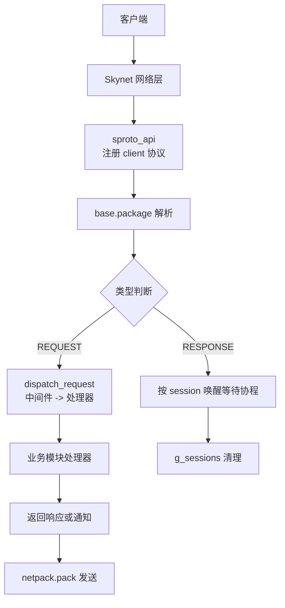
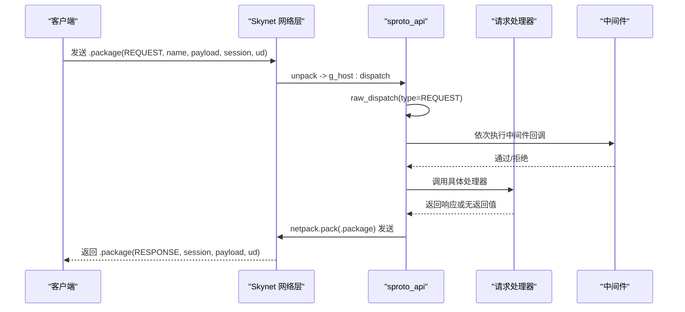
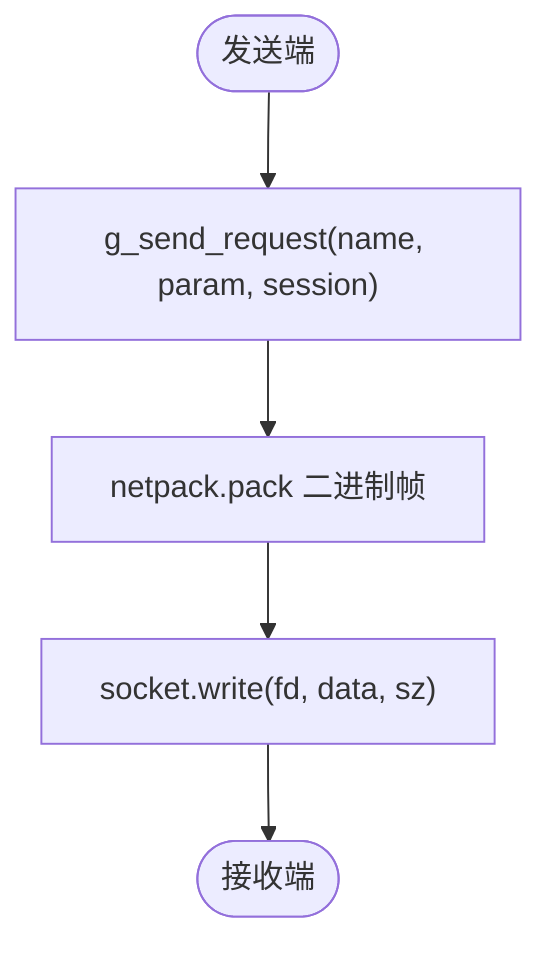
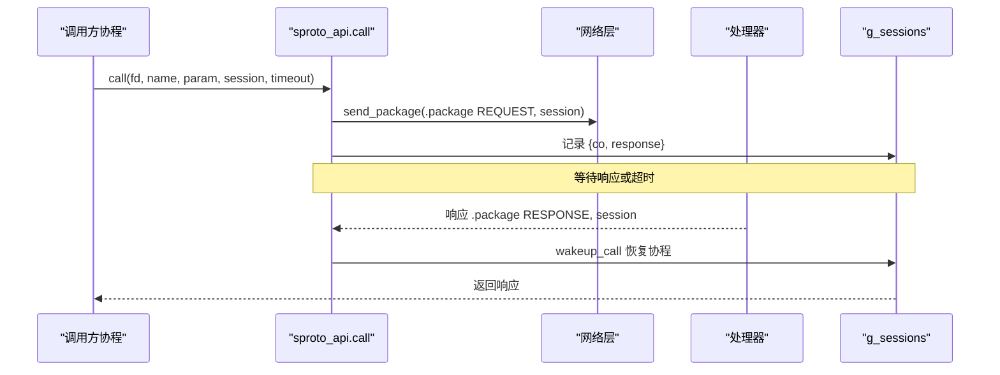
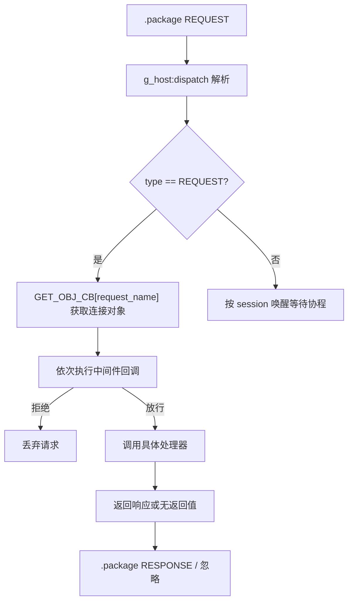
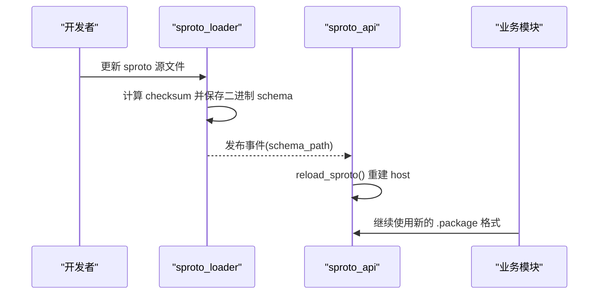
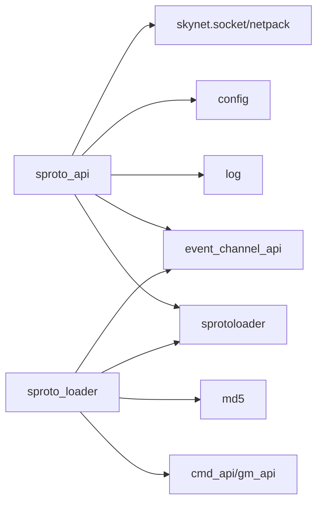

# 基础协议

<cite>
**本文引用的文件**
- [proto/base.sproto](file://proto/base.sproto)
- [lualib/sproto_api.lua](file://lualib/sproto_api.lua)
- [service/sproto_loader.lua](file://service/sproto_loader.lua)
- [proto/login.sproto](file://proto/login.sproto)
- [app/role/login/login_request.lua](file://app/role/login/login_request.lua)
- [app/role/login/client.lua](file://app/role/login/client.lua)
- [tools/proto2spb.lua](file://tools/proto2spb.lua)
</cite>

## 目录
1. [简介](#简介)
2. [项目结构](#项目结构)
3. [核心组件](#核心组件)
4. [架构总览](#架构总览)
5. [详细组件分析](#详细组件分析)
6. [依赖关系分析](#依赖关系分析)
7. [性能考量](#性能考量)
8. [故障排查指南](#故障排查指南)
9. [结论](#结论)
10. [附录](#附录)

## 简介
本文件为 SkyExt 框架的“基础协议”提供完整技术文档。重点说明 .package 消息结构的字段定义（type、session、ud）及其在通信体系中的核心作用；解释基础协议如何作为所有上层协议的包装层，承载会话管理与消息路由；给出消息格式与序列化后的二进制数据表示示例；并阐述版本兼容性与扩展机制。

## 项目结构
SkyExt 的基础协议由 sproto 描述文件定义，并通过统一的协议加载与分发机制接入 Skynet 网络栈。关键位置如下：
- 协议定义：proto/base.sproto 定义了 .package 消息结构
- 协议运行时：lualib/sproto_api.lua 负责注册 Skynet 协议、解析/封装 .package、会话管理、请求分发与中间件拦截
- 协议加载：service/sproto_loader.lua 负责加载 sproto 文件、生成二进制 schema、计算校验和并支持热重载
- 业务协议示例：proto/login.sproto 展示如何在 .package 中承载具体业务协议
- 登录流程示例：app/role/login/login_request.lua 演示业务请求处理与协议校验
- 连接与中间件：app/role/login/client.lua 展示模块注册、get_obj 与中间件回调
- 工具链：tools/proto2spb.lua 用于将 sproto 编译为二进制 schema 供运行期使用

图表来源
- [lualib/sproto_api.lua:118-130](file://lualib/sproto_api.lua#L118-L130)
- [lualib/sproto_api.lua:97-116](file://lualib/sproto_api.lua#L97-L116)
- [lualib/sproto_api.lua:132-159](file://lualib/sproto_api.lua#L132-L159)

章节来源
- [proto/base.sproto:1-7](file://proto/base.sproto#L1-L7)
- [lualib/sproto_api.lua:1-199](file://lualib/sproto_api.lua#L1-L199)
- [service/sproto_loader.lua:1-86](file://service/sproto_loader.lua#L1-L86)

## 核心组件
- .package 消息结构：定义于 proto/base.sproto，包含 type、session、ud 三个整型字段，是所有通过该协议传输的消息的统一容器。
- 协议主机与序列化：lualib/sproto_api.lua 初始化时以 base.package 为根创建 sproto host，并使用 attach 生成统一发送函数 g_send_request，用于构造 .package 消息体。
- 协议注册与分发：lualib/sproto_api.lua 注册 Skynet 的 client 协议，unpack 阶段调用 g_host:dispatch 将原始字节流解析为 .package 的 type、request_name、request、response_cb；dispatch 阶段根据 type 区分 REQUEST 与 RESPONSE，分别进入请求分发与会话唤醒流程。
- 会话管理：g_sessions 表维护 pending 调用（call）的协程与响应；call 发送请求时写入 session，并在超时后清理；收到对应 session 的响应时唤醒等待协程。
- 请求路由与中间件：register_module 将模块名与方法名组合成 request_name（如 login.login），并注册到 REQUEST_CMD；dispatch_request 在执行前依次执行中间件回调，再调用实际处理器。
- 协议加载与热更新：service/sproto_loader.lua 读取 sproto 源文件，保存为二进制 schema，计算 checksum，并通过事件通道触发 reload_sproto，使服务动态切换新 schema。

章节来源
- [proto/base.sproto:1-7](file://proto/base.sproto#L1-L7)
- [lualib/sproto_api.lua:19-41](file://lualib/sproto_api.lua#L19-L41)
- [lualib/sproto_api.lua:97-116](file://lualib/sproto_api.lua#L97-L116)
- [lualib/sproto_api.lua:132-159](file://lualib/sproto_api.lua#L132-L159)
- [service/sproto_loader.lua:19-59](file://service/sproto_loader.lua#L19-L59)

## 架构总览
基础协议在整个通信体系中的角色是“统一信封”。所有上层协议（如 login、bag、role 等）都以 .package 为载体进行传输，其中：
- type 标识消息类别（如 REQUEST、RESPONSE）
- session 用于关联请求与响应，实现异步 call/notify 语义
- ud 为用户自定义数据位，可用于携带轻量上下文（如鉴权标记、追踪 ID、路由标签等）

图表来源
- [lualib/sproto_api.lua:118-130](file://lualib/sproto_api.lua#L118-L130)
- [lualib/sproto_api.lua:97-116](file://lualib/sproto_api.lua#L97-L116)
- [lualib/sproto_api.lua:132-159](file://lualib/sproto_api.lua#L132-L159)

## 详细组件分析

### .package 消息结构与字段说明
- type：整数，标识消息类型。当前实现中用于区分 REQUEST 与 RESPONSE 两类消息。
- session：整数，唯一会话标识。用于匹配请求与响应，支撑 call 的同步等待语义。
- ud：整数，用户数据位。可承载任意轻量上下文信息，例如鉴权状态、追踪 ID、路由标签等，便于跨层传递。

章节来源
- [proto/base.sproto:1-7](file://proto/base.sproto#L1-L7)
- [lualib/sproto_api.lua:97-116](file://lualib/sproto_api.lua#L97-L116)
- [lualib/sproto_api.lua:132-159](file://lualib/sproto_api.lua#L132-L159)

### 序列化与二进制表示
- 序列化入口：lualib/sproto_api.lua 中以 g_host:attach(g_schema) 生成 g_send_request，用于构造 .package 消息体；发送时使用 netpack.pack 打包为二进制帧。
- 反序列化入口：Skynet 的 client 协议 unpack 阶段调用 g_host:dispatch(msg, sz)，将原始字节流解析为 .package 的各字段。
- 二进制 schema 生成：tools/proto2spb.lua 将多个 sproto 文件合并为 trunk，并通过 module.spb 生成 build/proto/sproto.spb，供运行期加载。

图表来源
- [lualib/sproto_api.lua:81-84](file://lualib/sproto_api.lua#L81-L84)
- [lualib/sproto_api.lua:132-138](file://lualib/sproto_api.lua#L132-L138)
- [tools/proto2spb.lua:1-30](file://tools/proto2spb.lua#L1-L30)

章节来源
- [lualib/sproto_api.lua:81-84](file://lualib/sproto_api.lua#L81-L84)
- [lualib/sproto_api.lua:118-130](file://lualib/sproto_api.lua#L118-L130)
- [tools/proto2spb.lua:1-30](file://tools/proto2spb.lua#L1-L30)

### 会话管理机制
- 发起调用：M.call(fd, name, param, session, timeout) 通过 g_send_request 发送 .package(REQUEST, name, param, session)，并将当前协程与 session 绑定至 g_sessions。
- 等待与超时：调用方启动定时器 skynet.sleep(timeout * 100, pending)，若超时仍未收到响应则清理 g_sessions 并返回 nil。
- 响应唤醒：当收到 .package(RESPONSE, session, ...) 时，raw_dispatch 根据 request_name（即 session）查找 pending，并调用 wakeup_call 恢复协程，返回响应。

图表来源
- [lualib/sproto_api.lua:132-159](file://lualib/sproto_api.lua#L132-L159)
- [lualib/sproto_api.lua:97-116](file://lualib/sproto_api.lua#L97-L116)

章节来源
- [lualib/sproto_api.lua:132-159](file://lualib/sproto_api.lua#L132-L159)
- [lualib/sproto_api.lua:97-116](file://lualib/sproto_api.lua#L97-L116)

### 消息路由原理
- 模块注册：M.register_module(mod_name, module, cmds) 遍历 cmds，将每个方法注册为 request_name = mod_name "." method，并绑定 GET_OBJ_CB 与 MIDDLEWARE_CBS。
- 请求分发：raw_dispatch 在 type=REQUEST 时调用 dispatch_request，先获取连接对象 obj（可选），再依次执行中间件回调，最后调用实际处理器。
- 中间件机制：中间件回调可拒绝请求（返回 nil），也可继续放行；常用于鉴权、限流、审计等横切逻辑。

图表来源
- [lualib/sproto_api.lua:19-41](file://lualib/sproto_api.lua#L19-L41)
- [lualib/sproto_api.lua:47-79](file://lualib/sproto_api.lua#L47-L79)
- [lualib/sproto_api.lua:97-116](file://lualib/sproto_api.lua#L97-L116)

章节来源
- [lualib/sproto_api.lua:19-41](file://lualib/sproto_api.lua#L19-L41)
- [lualib/sproto_api.lua:47-79](file://lualib/sproto_api.lua#L47-L79)
- [lualib/sproto_api.lua:97-116](file://lualib/sproto_api.lua#L97-L116)

### 基础协议作为其他协议的包装层
- 所有业务协议（如 login、bag、role）均以 .package 为载体传输。业务协议定义在各自的 .sproto 文件中，运行时被合并为统一 schema，并由 base.package 作为外层信封。
- 示例：login.sproto 定义了 login、logout、report_remote_addr 等业务接口；这些接口在运行时通过 .package 的 request_name 字段（如 "login.login"）进行路由。

章节来源
- [proto/login.sproto:1-26](file://proto/login.sproto#L1-L26)
- [lualib/sproto_api.lua:118-130](file://lualib/sproto_api.lua#L118-L130)

### 版本兼容性与扩展机制
- 协议校验：login_request.lua 在登录流程中可选择性校验客户端与服务端的协议 checksum，防止因协议不一致导致的错误。
- 热重载：service/sproto_loader.lua 在检测到 sproto 源文件变化时，重新保存二进制 schema 并触发事件通道；sproto_api.lua 订阅该事件并调用 reload_sproto，重建 g_host 与 g_send_request，实现无缝升级。
- 扩展点：
  - ud 字段：可在 .package 中携带轻量上下文，无需修改主流程即可扩展能力。
  - 中间件：通过模块的 middleware_cbs 注册横切逻辑，增强安全性与可观测性。
  - 多 schema 索引：sproto_index 支持多套 schema 并存，避免冲突。

图表来源
- [service/sproto_loader.lua:19-59](file://service/sproto_loader.lua#L19-L59)
- [lualib/sproto_api.lua:182-196](file://lualib/sproto_api.lua#L182-L196)
- [app/role/login/login_request.lua:68-85](file://app/role/login/login_request.lua#L68-L85)

章节来源
- [service/sproto_loader.lua:19-59](file://service/sproto_loader.lua#L19-L59)
- [lualib/sproto_api.lua:182-196](file://lualib/sproto_api.lua#L182-L196)
- [app/role/login/login_request.lua:68-85](file://app/role/login/login_request.lua#L68-L85)

## 依赖关系分析
- sproto_api 依赖：
  - Skynet 网络层（socket、netpack）
  - 配置模块（config）
  - 日志模块（log）
  - 事件通道（event_channel_api）
  - sprotoloader（加载二进制 schema）
- sproto_loader 依赖：
  - sprotoloader（保存二进制 schema）
  - md5（计算 checksum）
  - event_channel_api（发布 schema 变更事件）
  - cmd_api/gm_api（暴露 GM 命令）

图表来源
- [lualib/sproto_api.lua:1-199](file://lualib/sproto_api.lua#L1-L199)
- [service/sproto_loader.lua:1-86](file://service/sproto_loader.lua#L1-L86)

章节来源
- [lualib/sproto_api.lua:1-199](file://lualib/sproto_api.lua#L1-L199)
- [service/sproto_loader.lua:1-86](file://service/sproto_loader.lua#L1-L86)

## 性能考量
- 序列化开销：.package 仅含三个整型字段，序列化/反序列化成本低；业务数据位于 request/response 中，建议保持合理大小。
- 会话表规模：g_sessions 随并发 call 增长，需确保超时时间合理，避免内存泄漏。
- 中间件链：过多中间件会增加处理延迟，应精简必要逻辑。
- 协议热重载：reload_sproto 会重建 host，建议在低峰期执行或通过事件通道平滑切换。

## 故障排查指南
- 请求未找到：检查 register_module 是否正确注册了 request_name；确认模块名与方法名组合无误。
- 中间件拒绝：查看中间件回调是否返回 nil；必要时增加日志定位。
- 调用超时：检查 g_sessions 是否被正确清理；确认服务端处理器是否返回响应；调整 sproto_timeout。
- 协议不一致：启用 proto_checksum_enable 后，登录流程会校验客户端与服务端协议 checksum；请确保两端一致。
- 热重载失败：检查 sproto 源文件语法与路径；确认 sproto_loader 成功保存二进制 schema 并发布事件。

章节来源
- [lualib/sproto_api.lua:19-41](file://lualib/sproto_api.lua#L19-L41)
- [lualib/sproto_api.lua:47-79](file://lualib/sproto_api.lua#L47-L79)
- [lualib/sproto_api.lua:132-159](file://lualib/sproto_api.lua#L132-L159)
- [app/role/login/login_request.lua:68-85](file://app/role/login/login_request.lua#L68-L85)
- [service/sproto_loader.lua:19-59](file://service/sproto_loader.lua#L19-L59)

## 结论
基础协议 .package 是 SkyExt 通信体系的基石，通过统一的信封结构承载所有上层协议，结合会话管理与消息路由，实现了高内聚、低耦合的网络抽象。其设计简洁高效，具备完善的版本兼容与扩展机制，适合大规模分布式游戏服务的稳定运行。

## 附录
- 消息格式示例（概念性说明）
  - 请求：.package{type=REQUEST, session=唯一ID, ud=用户数据}, request_name="login.login", request={token, rid, server, ...}
  - 响应：.package{type=RESPONSE, session=相同ID, ud=用户数据}, response={code, rid, rolenode, ...}
- 二进制表示
  - 发送端通过 g_send_request 构造 .package，再由 netpack.pack 打包为二进制帧；接收端通过 g_host:dispatch 解析为结构化数据。
- 相关工具
  - tools/proto2spb.lua：将 sproto 文件编译为二进制 schema，供运行期加载。