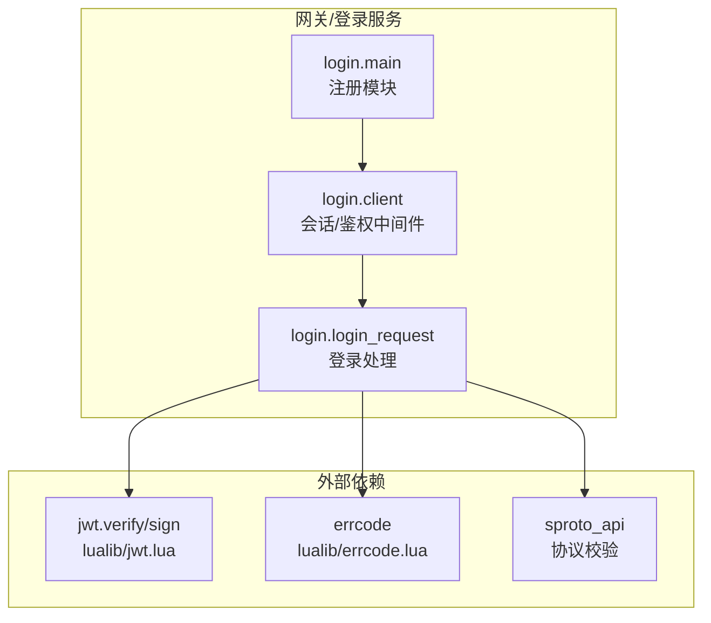
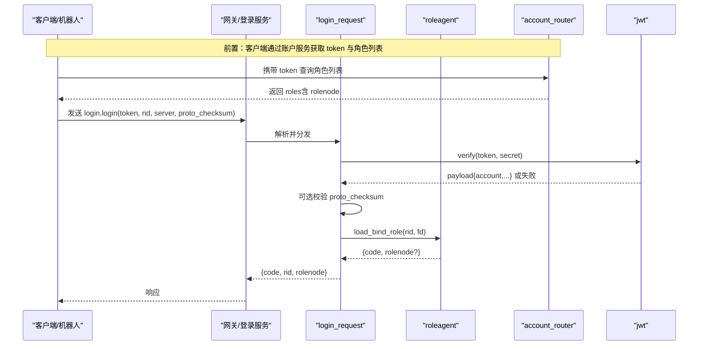
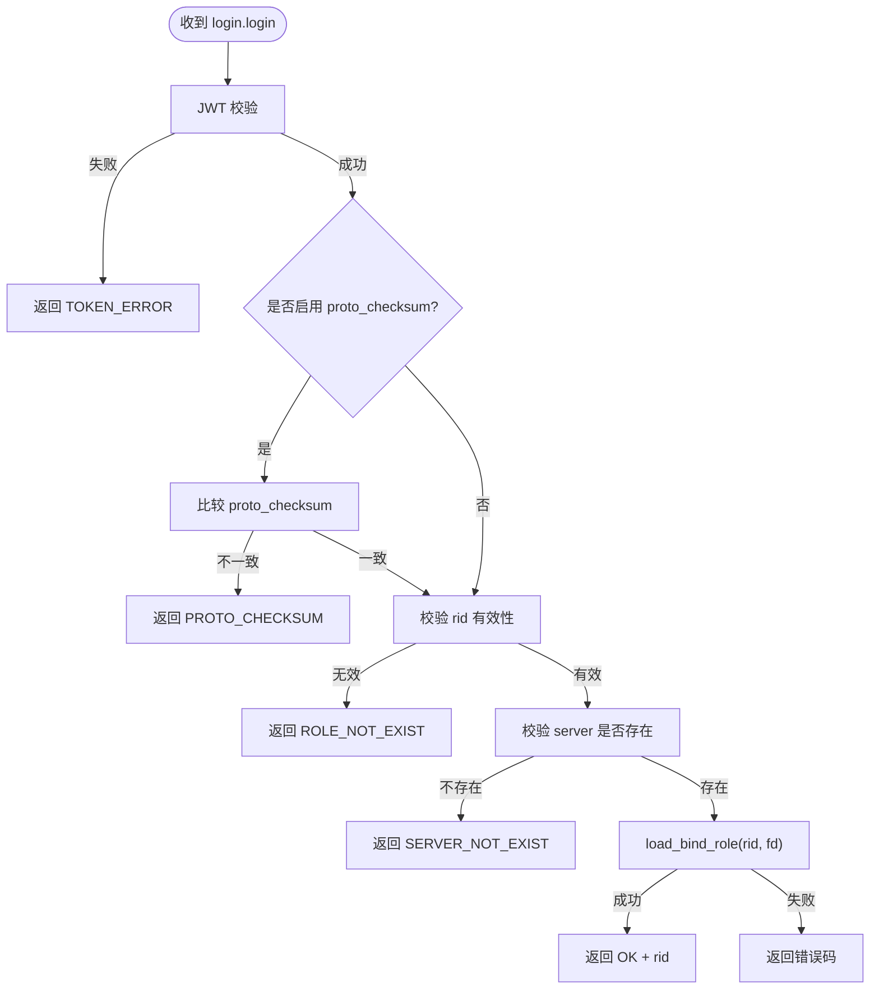
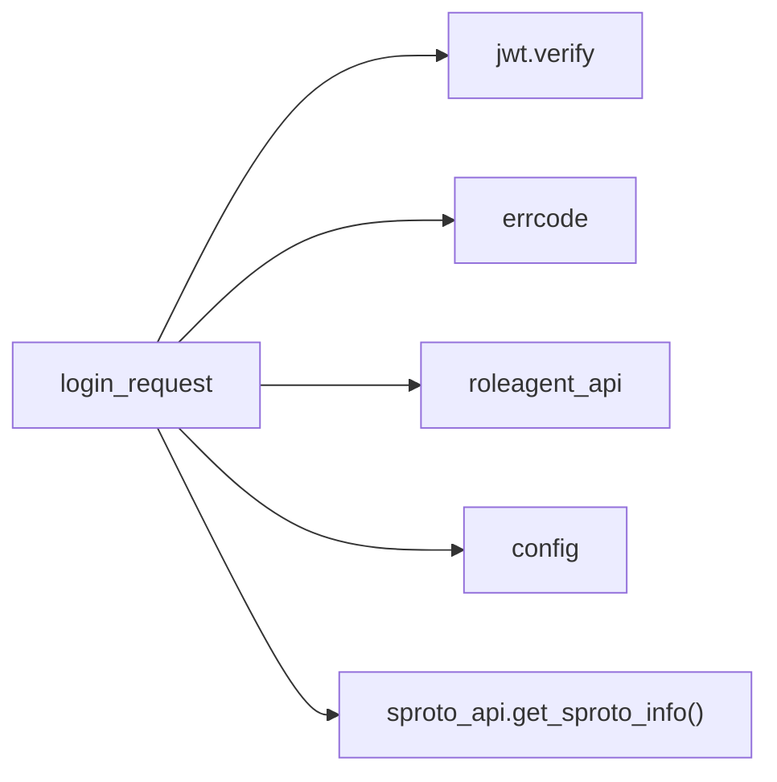

# 登录协议

<cite>
**本文引用的文件**
- [proto/login.sproto](file://proto/login.sproto)
- [app/role/login/main.lua](file://app/role/login/main.lua)
- [app/role/login/client.lua](file://app/role/login/client.lua)
- [app/role/login/login_request.lua](file://app/role/login/login_request.lua)
- [lualib/jwt.lua](file://lualib/jwt.lua)
- [lualib/errcode.lua](file://lualib/errcode.lua)
- [etc/app/role1.app.lua](file://etc/app/role1.app.lua)
- [etc/app/role2.app.lua](file://etc/app/role2.app.lua)
- [app/account/lualib/account_router.lua](file://app/account/lualib/account_router.lua)
- [app/robot/robotagent/main.lua](file://app/robot/robotagent/main.lua)
</cite>

## 目录
1. [简介](#简介)
2. [项目结构](#项目结构)
3. [核心组件](#核心组件)
4. [架构总览](#架构总览)
5. [详细组件分析](#详细组件分析)
6. [依赖关系分析](#依赖关系分析)
7. [性能与安全性](#性能与安全性)
8. [故障排查指南](#故障排查指南)
9. [结论](#结论)
10. [附录：错误码与配置项](#附录错误码与配置项)

## 简介
本规范定义 SkyExt 框架中“角色登录”的通信协议与实现细节，覆盖以下内容：
- 登录请求与响应的消息结构（token、rid、server、proto_checksum 等）
- 登录成功与失败的响应格式及错误码
- Token 生成与校验机制（JWT）
- 登录状态管理与会话保持策略（连接级鉴权、超时控制）
- 完整交互流程示例（从客户端发起登录到服务器响应）
- 安全机制（签名校验、协议版本一致性检查、超时断开）

## 项目结构
登录相关代码主要分布在以下模块：
- 协议定义：proto/login.sproto
- 登录服务入口与路由：app/role/login/main.lua
- 客户端对象与会话管理：app/role/login/client.lua
- 登录请求处理逻辑：app/role/login/login_request.lua
- JWT 工具库：lualib/jwt.lua
- 错误码定义：lualib/errcode.lua
- 应用配置（登录超时等）：etc/app/role*.app.lua
- 账户服务（用于生成 token 的角色列表接口）：app/account/lualib/account_router.lua
- 机器人测试客户端（演示登录调用）：app/robot/robotagent/main.lua

图表来源
- [app/role/login/main.lua:1-36](file://app/role/login/main.lua#L1-L36)
- [app/role/login/client.lua:1-76](file://app/role/login/client.lua#L1-L76)
- [app/role/login/login_request.lua:1-113](file://app/role/login/login_request.lua#L1-L113)
- [lualib/jwt.lua:1-103](file://lualib/jwt.lua#L1-L103)
- [lualib/errcode.lua:1-29](file://lualib/errcode.lua#L1-L29)

章节来源
- [app/role/login/main.lua:1-36](file://app/role/login/main.lua#L1-L36)
- [proto/login.sproto:1-26](file://proto/login.sproto#L1-L26)

## 核心组件
- 协议定义（login.sproto）
  - login 请求字段：token、rid、proto_checksum、server
  - login 响应字段：code、rid、rolenode
  - report_remote_addr 用于上报远端地址
  - logout 用于登出（当前为空体）
- 登录服务（main.lua）
  - 启动时注册 sproto 模块为 "login"，并绑定 client 与 login_request
  - 新连接进入后转发至 watchdog，并创建客户端对象
- 客户端与会话（client.lua）
  - 维护 fd -> 客户端对象的映射
  - 设置登录超时定时器（默认 60 秒），未认证则关闭连接
  - 中间件对非免认证请求进行鉴权拦截
- 登录处理（login_request.lua）
  - 校验 token（JWT）、可选校验 proto_checksum、校验 server、加载并绑定角色
  - 成功后解绑登录服务，后续消息转发至 roleagent
- JWT（jwt.lua）
  - 支持 HS256/HS512 签名算法
  - verify 校验签名与时间（iat/nbf/exp）
  - sign 生成 token（可带过期时间）
- 错误码（errcode.lua）
  - 统一返回 code，如 TOKEN_ERROR、PROTO_CHECKSUM、SERVER_NOT_EXIST、ROLE_NOT_EXIST 等

章节来源
- [proto/login.sproto:1-26](file://proto/login.sproto#L1-L26)
- [app/role/login/main.lua:1-36](file://app/role/login/main.lua#L1-L36)
- [app/role/login/client.lua:1-76](file://app/role/login/client.lua#L1-L76)
- [app/role/login/login_request.lua:1-113](file://app/role/login/login_request.lua#L1-L113)
- [lualib/jwt.lua:1-103](file://lualib/jwt.lua#L1-L103)
- [lualib/errcode.lua:1-29](file://lualib/errcode.lua#L1-L29)

## 架构总览
登录流程涉及网关/登录服务、角色节点、账户服务（用于获取角色列表与生成 token）。下图展示端到端交互。

图表来源
- [app/role/login/login_request.lua:58-105](file://app/role/login/login_request.lua#L58-L105)
- [app/account/lualib/account_router.lua:24-59](file://app/account/lualib/account_router.lua#L24-L59)
- [lualib/jwt.lua:17-67](file://lualib/jwt.lua#L17-L67)

## 详细组件分析

### 协议消息定义（login.sproto）
- 登录请求 login.request
  - token: string，JWT 令牌，包含 account 等信息
  - rid: integer，目标角色 ID（直接登录指定角色）
  - proto_checksum: string，客户端协议文件校验和，用于版本一致性检查
  - server: string，区服标识，需与服务端配置匹配
- 登录响应 login.response
  - code: integer，业务状态码（见错误码表）
  - rid: integer，角色 ID（成功时返回）
  - rolenode: string，需要连接的游戏节点地址（成功时返回）
- 其他消息
  - report_remote_addr：上报远端地址，便于服务端记录
  - logout：登出（当前为空体）

章节来源
- [proto/login.sproto:1-26](file://proto/login.sproto#L1-L26)

### 登录处理流程（login_request.lua）
- 步骤
  1) 使用 jwt.verify 校验 token，失败返回 TOKEN_ERROR
  2) 若启用 proto_checksum 校验，比较客户端与服务端协议 checksum，不一致返回 PROTO_CHECKSUM
  3) 校验 rid 是否有效（存在且大于 0），否则返回 ROLE_NOT_EXIST
  4) 校验 server 是否在 server2game 配置中存在，否则返回 SERVER_NOT_EXIST
  5) 调用 roleagent_api.calc_agent_addr(rid) 并执行 load_bind_role(rid, fd)
  6) 绑定成功后，解除登录服务绑定，后续消息转发至 roleagent
- 关键返回值
  - 成功：code=OK，rid=角色ID（rolenode 由上层决定）
  - 失败：对应错误码

图表来源
- [app/role/login/login_request.lua:58-105](file://app/role/login/login_request.lua#L58-L105)

章节来源
- [app/role/login/login_request.lua:1-113](file://app/role/login/login_request.lua#L1-L113)

### 会话与鉴权（client.lua）
- 新建连接时创建客户端对象，并启动登录超时定时器（默认 60 秒）
- 在定时器触发时，若仍未完成认证，则通过 watchdog 关闭连接
- 中间件 check_auth_cb
  - 允许免认证请求：login.login、login.report_remote_addr
  - 其他请求必须已认证（client_obj.auth=true），否则返回 Unauthorized
- 认证成功后，后续消息将不再经过登录服务，而是转发至 roleagent

章节来源
- [app/role/login/client.lua:1-76](file://app/role/login/client.lua#L1-L76)

### JWT 工具（jwt.lua）
- 支持的算法：HS256、HS512
- verify(token, secret)
  - 分割三段（header.payload.signature）
  - 解码 header 与 payload，校验 typ=JWT 与 alg 支持
  - 计算签名并与 signature 比对
  - 校验时间：nbf、iat、exp
- sign(payload, secret, alg, exp_secs)
  - 构造 header，注入 iat/exp
  - Base64URL 编码并签名，拼接成标准 JWT 字符串

章节来源
- [lualib/jwt.lua:1-103](file://lualib/jwt.lua#L1-L103)

### 账户服务中的角色查询（account_router.lua）
- GET /roles：根据 token 验证后，按 server 过滤并返回角色列表，附带 rolenode
- POST /create_role：校验 token、角色数量限制、server 合法性后创建角色并返回

章节来源
- [app/account/lualib/account_router.lua:24-140](file://app/account/lualib/account_router.lua#L24-L140)

### 客户端调用示例（机器人）
- 机器人通过 HTTP 获取 token 与角色列表
- 建立到 gate 的连接，发送 login.login(token, rid, server, proto_checksum)
- 接收响应并根据 code 判断是否成功

章节来源
- [app/robot/robotagent/main.lua:49-95](file://app/robot/robotagent/main.lua#L49-L95)

## 依赖关系分析
- 登录服务依赖
  - sproto_api：注册模块与协议信息（checksum）
  - jwt：Token 校验
  - errcode：统一错误码
  - roleagent_api：角色绑定与转发
  - config：读取 login_timeout_sec、login_jwt_secret、server2game、proto_checksum_enable
- 配置项
  - login_timeout_sec：登录连接超时时间（秒）
  - login_jwt_secret：JWT 密钥
  - server2game：区服到游戏节点的映射
  - proto_checksum_enable：是否启用协议版本一致性检查

图表来源
- [app/role/login/login_request.lua:1-113](file://app/role/login/login_request.lua#L1-L113)
- [lualib/jwt.lua:1-103](file://lualib/jwt.lua#L1-L103)
- [lualib/errcode.lua:1-29](file://lualib/errcode.lua#L1-L29)

章节来源
- [app/role/login/login_request.lua:1-113](file://app/role/login/login_request.lua#L1-L113)
- [etc/app/role1.app.lua:1-30](file://etc/app/role1.app.lua#L1-L30)
- [etc/app/role2.app.lua:1-30](file://etc/app/role2.app.lua#L1-L30)

## 性能与安全性
- 性能
  - 登录超时自动断连，避免空闲连接占用资源
  - 仅必要的数据库/角色节点调用（load_bind_role）
  - 协议版本校验减少兼容性问题导致的异常分支
- 安全性
  - JWT 签名校验（HS256/HS512），防止伪造 token
  - 时间窗口校验（iat/nbf/exp），防止重放与过期 token
  - 协议版本一致性检查（proto_checksum），降低协议不匹配风险
  - 登录超时保护，防止恶意长连接
  - 建议：在生产环境使用强随机密钥、合理设置 token 过期时间、开启日志审计

[本节为通用指导，不直接分析具体文件]

## 故障排查指南
- 常见错误码
  - TOKEN_ERROR：JWT 校验失败（签名错误或过期）
  - PROTO_CHECKSUM：客户端与服务端协议版本不一致
  - ROLE_NOT_EXIST：rid 无效或未找到
  - SERVER_NOT_EXIST：server 不在 server2game 配置中
  - NOT_THIS_NODE/IN_OTHER_NODE：角色在其他节点或需切换节点
  - DB_ERROR：数据库操作失败
- 排查步骤
  - 确认 token 是否由账户服务签发且未过期
  - 检查 proto_checksum 是否与服务器一致
  - 核对 server 配置与角色所在节点映射
  - 查看登录超时是否触发（默认 60 秒）
  - 检查 roleagent 绑定是否成功

章节来源
- [lualib/errcode.lua:1-29](file://lualib/errcode.lua#L1-L29)
- [app/role/login/login_request.lua:58-105](file://app/role/login/login_request.lua#L58-L105)
- [app/role/login/client.lua:33-47](file://app/role/login/client.lua#L33-L47)

## 结论
SkyExt 的登录协议以 JWT 为核心，结合协议版本一致性检查与登录超时控制，实现了安全、可控的角色登录流程。通过统一的错误码与清晰的响应结构，客户端可以可靠地处理登录结果并据此进行后续游戏逻辑。

[本节为总结性内容，不直接分析具体文件]

## 附录：错误码与配置项

### 错误码定义（errcode.lua）
- OK：0
- NOT_THIS_NODE：1
- IN_OTHER_NODE：2
- ROLE_NOT_EXIST：3
- LOCAK_FAILED：4
- ROLE_TOO_MANY：5
- DB_ERROR：6
- TOKEN_ERROR：7
- PROTO_CHECKSUM：8
- SERVER_NOT_EXIST：9
- MONGO_DUPLICATE_KEY：11000

章节来源
- [lualib/errcode.lua:1-29](file://lualib/errcode.lua#L1-L29)

### 配置项（role*.app.lua）
- login_timeout_sec：登录连接超时（秒），默认 60
- 其他：gate_port、maxclient、agent_count、log_config 等

章节来源
- [etc/app/role1.app.lua:1-30](file://etc/app/role1.app.lua#L1-L30)
- [etc/app/role2.app.lua:1-30](file://etc/app/role2.app.lua#L1-L30)