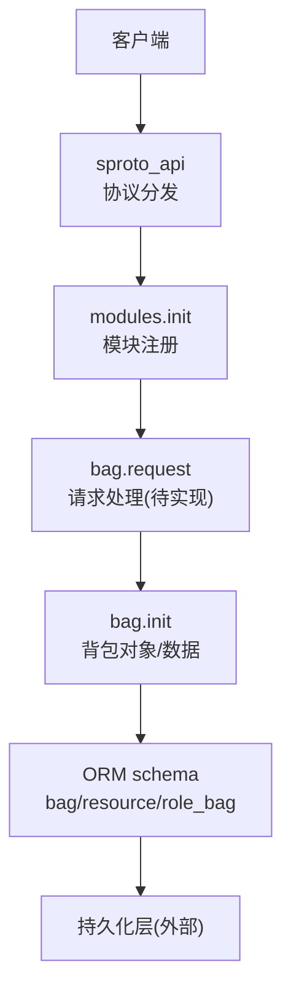
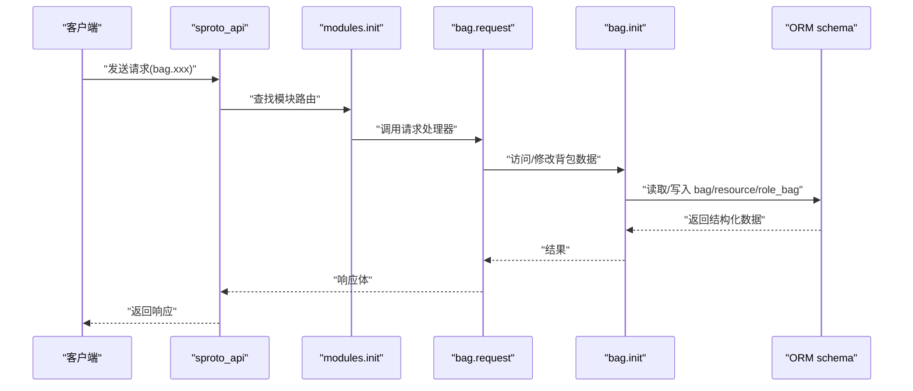
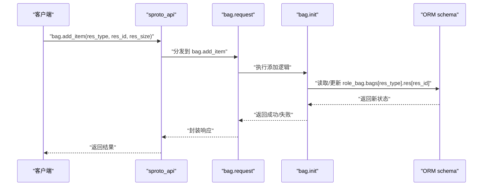

# 背包协议

<cite>
**本文引用的文件**
- [schema/bag.sproto](file://schema/bag.sproto)
- [lualib/orm/schema.lua](file://lualib/orm/schema.lua)
- [app/role/roleagent/modules/init.lua](file://app/role/roleagent/modules/init.lua)
- [app/role/roleagent/modules/bag/init.lua](file://app/role/roleagent/modules/bag/init.lua)
- [app/role/roleagent/modules/bag/request.lua](file://app/role/roleagent/modules/bag/request.lua)
- [lualib/sproto_api.lua](file://lualib/sproto_api.lua)
- [proto/base.sproto](file://proto/base.sproto)
</cite>

## 目录
1. [简介](#简介)
2. [项目结构](#项目结构)
3. [核心组件](#核心组件)
4. [架构总览](#架构总览)
5. [详细组件分析](#详细组件分析)
6. [依赖关系分析](#依赖关系分析)
7. [性能考量](#性能考量)
8. [故障排查指南](#故障排查指南)
9. [结论](#结论)
10. [附录](#附录)

## 简介
本规范基于仓库中现有的背包相关代码与数据模型，梳理 SkyExt 框架的背包协议与数据结构。当前仓库已定义背包的数据存储结构与角色模块加载机制，但尚未实现具体的背包操作请求（如添加、移除、移动、使用等）的消息接口。本文在严格依据现有源码的基础上，给出：
- 背包数据模型与字段约束
- 模块注册与消息分发机制
- 可扩展的交互流程建议（以概念性示例呈现）
- 存储结构与查询优化建议
- 事务与并发控制的设计建议

说明：由于仓库未提供具体背包操作的请求/响应定义，本节不虚构任何协议字段或行为；所有“交互示例”均为概念性流程示意，便于后续扩展时对齐整体架构。

## 项目结构
围绕背包功能的相关文件组织如下：
- 数据模式定义：schema/bag.sproto
- ORM 类型映射：lualib/orm/schema.lua
- 模块注册与加载：app/role/roleagent/modules/init.lua
- 背包模块实例化：app/role/roleagent/modules/bag/init.lua
- 背包请求入口（待实现）：app/role/roleagent/modules/bag/request.lua
- 协议分发与调用：lualib/sproto_api.lua
- 基础包格式：proto/base.sproto

图表来源
- [lualib/sproto_api.lua:31-79](file://lualib/sproto_api.lua#L31-L79)
- [app/role/roleagent/modules/init.lua:12-16](file://app/role/roleagent/modules/init.lua#L12-L16)
- [app/role/roleagent/modules/bag/init.lua:6-24](file://app/role/roleagent/modules/bag/init.lua#L6-L24)
- [lualib/orm/schema.lua:187-233](file://lualib/orm/schema.lua#L187-L233)

章节来源
- [app/role/roleagent/modules/init.lua:12-16](file://app/role/roleagent/modules/init.lua#L12-L16)
- [lualib/sproto_api.lua:31-79](file://lualib/sproto_api.lua#L31-L79)

## 核心组件
- 数据模式与 ORM
  - bag.sproto 定义了 role_bag、bag、resource 三种结构，用于描述玩家背包及其资源项。
  - lualib/orm/schema.lua 将上述结构映射为可解析、校验的 ORM 类型，并暴露 role_modules.bag 作为角色模块的一部分。
- 模块注册与加载
  - modules/init.lua 在初始化时将“bag”模块注册到 sproto_api，并在角色数据加载时创建 bag 模块实例。
- 背包对象
  - bag/init.lua 负责创建背包对象，并为角色数据初始化 bags 容器及默认条目（示例数据）。
- 协议分发
  - sproto_api.lua 提供 register_module、dispatch_request、call/notify 等能力，支撑请求路由与中间件拦截。

章节来源
- [schema/bag.sproto:1-16](file://schema/bag.sproto#L1-L16)
- [lualib/orm/schema.lua:187-233](file://lualib/orm/schema.lua#L187-L233)
- [lualib/orm/schema.lua:354-384](file://lualib/orm/schema.lua#L354-L384)
- [app/role/roleagent/modules/init.lua:12-34](file://app/role/roleagent/modules/init.lua#L12-L34)
- [app/role/roleagent/modules/bag/init.lua:6-24](file://app/role/roleagent/modules/bag/init.lua#L6-L24)
- [lualib/sproto_api.lua:31-79](file://lualib/sproto_api.lua#L31-L79)

## 架构总览
下图展示了从客户端到背包数据的完整链路：客户端通过 sproto 协议发送请求，由 sproto_api 分发至对应模块；bag 模块在内存中维护背包数据，并通过 ORM 进行序列化/反序列化与校验。

图表来源
- [lualib/sproto_api.lua:31-79](file://lualib/sproto_api.lua#L31-L79)
- [app/role/roleagent/modules/init.lua:12-16](file://app/role/roleagent/modules/init.lua#L12-L16)
- [lualib/orm/schema.lua:187-233](file://lualib/orm/schema.lua#L187-L233)

## 详细组件分析

### 数据模型与字段约束
- role_bag
  - 字段：bags（键为整数类型的背包分类ID，值为 bag）
  - 用途：承载一个角色的全部背包分类
- bag
  - 字段：res_type（整数，资源分类）、res（键为整数资源ID，值为 resource）
  - 用途：表示某一类资源的集合
- resource
  - 字段：res_id（整数，资源ID）、res_size（整数，数量）
  - 用途：表示单个资源的标识与数量

约束与规则（基于 ORM 类型推断）：
- 所有 ID 与数量为整数类型
- res 为 map<integer, resource>，即同一资源ID在同一 bag 内聚合计数
- bags 为 map<integer, bag>，不同 res_type 区分不同类别的资源

章节来源
- [schema/bag.sproto:1-16](file://schema/bag.sproto#L1-L16)
- [lualib/orm/schema.lua:187-233](file://lualib/orm/schema.lua#L187-L233)
- [lualib/orm/schema.lua:354-384](file://lualib/orm/schema.lua#L354-L384)

### 背包容量管理与排序机制
- 容量管理
  - 当前代码未实现容量上限逻辑；建议在 bag 层增加容量配置与校验，并在添加资源前检查是否超限。
- 排序机制
  - 当前 res 为 map<integer, resource>，天然无序；如需展示排序，可在上层按业务规则生成有序视图（例如按品质、获取时间等），但不改变底层存储顺序。

章节来源
- [app/role/roleagent/modules/bag/init.lua:6-24](file://app/role/roleagent/modules/bag/init.lua#L6-L24)
- [lualib/orm/schema.lua:187-233](file://lualib/orm/schema.lua#L187-L233)

### 物品数据模型
- 物品ID：res_id（整数）
- 数量：res_size（整数）
- 品质/属性：当前模型未包含；可通过扩展 bag.res 的 value 结构或引入额外元数据字段来实现（需配合 ORM 与存储层变更）

章节来源
- [schema/bag.sproto:11-16](file://schema/bag.sproto#L11-L16)
- [lualib/orm/schema.lua:310-326](file://lualib/orm/schema.lua#L310-L326)

### 背包操作的消息结构（待实现）
- 现状：modules/bag/request.lua 为空，尚未定义任何请求/响应结构
- 建议（概念性）：
  - 添加物品：请求包含 res_id、res_size、res_type；响应返回操作结果与更新后的资源计数
  - 移除物品：请求包含 res_id、res_size、res_type；响应返回剩余数量或错误码
  - 移动物品：请求包含源 res_type、目标 res_type、res_id、res_size；响应返回双方更新状态
  - 使用物品：请求包含 res_id、res_size、res_type；响应返回消耗结果与触发效果
- 注意：以上为设计建议，非仓库现有实现

章节来源
- [app/role/roleagent/modules/bag/request.lua:1-4](file://app/role/roleagent/modules/bag/request.lua#L1-L4)

### 交互流程示例（概念性）
以下序列图展示“获取物品”的概念流程，便于理解未来如何接入 sproto 协议与 bag 模块：

图表来源
- [lualib/sproto_api.lua:31-79](file://lualib/sproto_api.lua#L31-L79)
- [app/role/roleagent/modules/init.lua:12-16](file://app/role/roleagent/modules/init.lua#L12-L16)
- [lualib/orm/schema.lua:187-233](file://lualib/orm/schema.lua#L187-L233)

### 存储结构与查询优化策略
- 存储结构
  - role.modules.bag -> role_bag -> bags[res_type] -> bag -> res[res_id] -> resource
- 查询优化建议
  - 按 res_type 分区访问，避免全表扫描
  - 对高频查询的 res_id 建立索引（若持久化层支持）
  - 批量读写合并，减少 IO 次数
  - 使用内存缓存热点资源项，降低重复计算

章节来源
- [lualib/orm/schema.lua:354-384](file://lualib/orm/schema.lua#L354-L384)

### 事务处理与并发控制（设计建议）
- 事务处理
  - 在 bag.request 中对一次操作涉及的多个资源变更打包为事务，保证一致性
  - 提交前进行前置校验（如容量、合法性），失败则回滚
- 并发控制
  - 以角色为单位加锁，确保同一角色背包操作的串行化
  - 使用分布式锁或进程内互斥，防止多协程/多连接并发写冲突

说明：以上为通用设计建议，仓库当前未实现具体事务与锁机制。

## 依赖关系分析
- sproto_api 负责协议注册与分发
- modules.init 将 bag 模块注册到 sproto_api，并在角色加载时初始化 bag 实例
- bag.init 维护内存中的背包数据，并与 ORM schema 协作进行数据校验与转换
- ORM schema 提供 bag/resource/role_bag 的结构定义与解析/校验能力

图表来源
- [lualib/sproto_api.lua:31-79](file://lualib/sproto_api.lua#L31-L79)
- [app/role/roleagent/modules/init.lua:12-16](file://app/role/roleagent/modules/init.lua#L12-L16)
- [lualib/orm/schema.lua:187-233](file://lualib/orm/schema.lua#L187-L233)

章节来源
- [lualib/sproto_api.lua:31-79](file://lualib/sproto_api.lua#L31-L79)
- [app/role/roleagent/modules/init.lua:12-16](file://app/role/roleagent/modules/init.lua#L12-L16)

## 性能考量
- 数据结构选择
  - 使用 map<integer, resource> 聚合同种资源，减少条目数
- 访问路径
  - 优先按 res_type 定位 bag，再按 res_id 定位 resource，降低遍历成本
- 批量操作
  - 合并多次增减为单次更新，减少 ORM 与持久化层的交互
- 缓存策略
  - 对频繁读写的资源项进行短期缓存，注意失效与一致性

## 故障排查指南
- 协议分发异常
  - 检查 sproto_api 是否正确注册模块与请求函数
  - 确认 request_name 与模块名一致
- 数据校验失败
  - 核对 ORM schema 字段类型与必填项
  - 检查传入的 res_id、res_size 是否为合法整数
- 模块加载问题
  - 确认 modules.init 正确加载 bag 模块并创建实例
  - 检查角色数据中 modules.bag 是否存在

章节来源
- [lualib/sproto_api.lua:31-79](file://lualib/sproto_api.lua#L31-L79)
- [lualib/orm/schema.lua:187-233](file://lualib/orm/schema.lua#L187-L233)
- [app/role/roleagent/modules/init.lua:12-34](file://app/role/roleagent/modules/init.lua#L12-L34)

## 结论
当前仓库已具备背包的数据模型与模块加载机制，但未实现具体的背包操作协议。建议在此基础上：
- 在 bag.request 中实现标准增删改查与使用等请求
- 完善容量与排序的业务规则
- 引入事务与并发控制，保障数据一致性
- 结合 ORM 与持久化层优化查询与写入性能

## 附录
- 基础包格式参考：proto/base.sproto 定义了 package 的基本字段，可用于协议层的基础封装

章节来源
- [proto/base.sproto:1-7](file://proto/base.sproto#L1-L7)