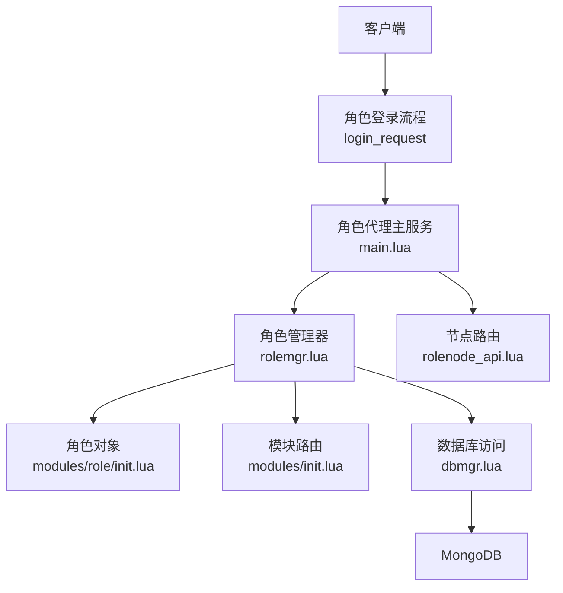
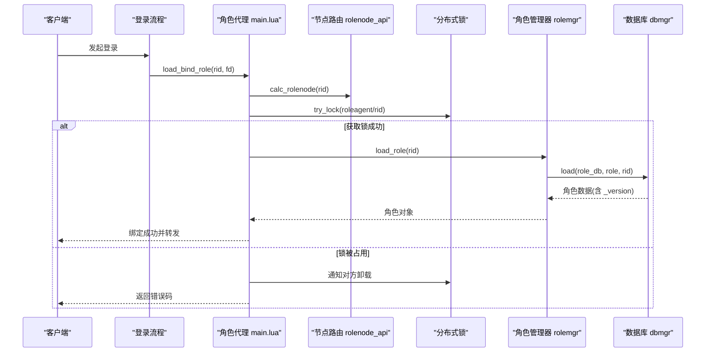
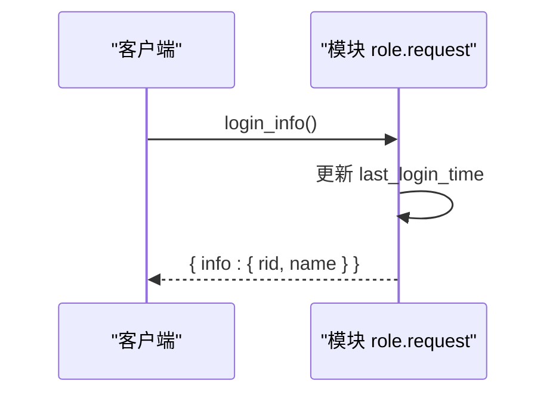
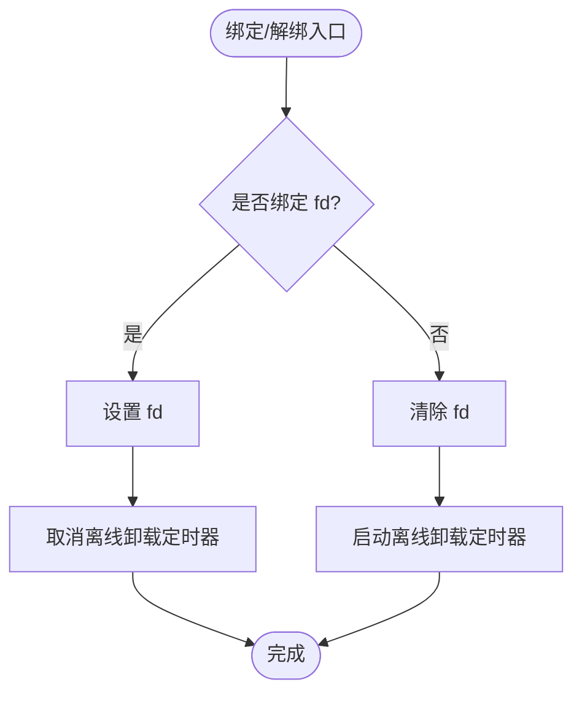
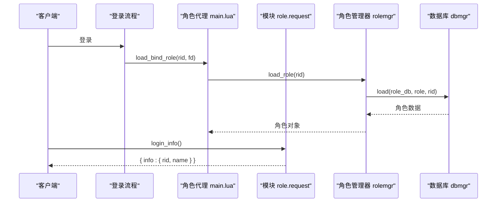
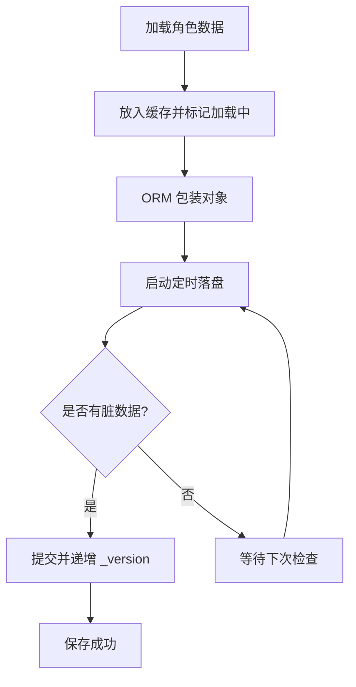
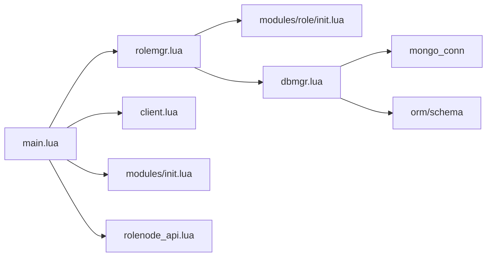

# 角色协议

<cite>
**本文引用的文件**
- [proto/roleagent/role.sproto](file://proto/roleagent/role.sproto)
- [schema/role.sproto](file://schema/role.sproto)
- [app/role/roleagent/modules/role/request.lua](file://app/role/roleagent/modules/role/request.lua)
- [app/role/roleagent/modules/role/init.lua](file://app/role/roleagent/modules/role/init.lua)
- [app/role/roleagent/client.lua](file://app/role/roleagent/client.lua)
- [app/role/roleagent/main.lua](file://app/role/roleagent/main.lua)
- [app/role/roleagent/rolemgr.lua](file://app/role/roleagent/rolemgr.lua)
- [lualib/dbmgr.lua](file://lualib/dbmgr.lua)
- [lualib/rolenode_api.lua](file://lualib/rolenode_api.lua)
- [lualib/skyext.lua](file://lualib/skyext.lua)
- [app/role/roleagent/modules/init.lua](file://app/role/roleagent/modules/init.lua)
</cite>

## 目录
1. [简介](#简介)
2. [项目结构](#项目结构)
3. [核心组件](#核心组件)
4. [架构总览](#架构总览)
5. [详细组件分析](#详细组件分析)
6. [依赖关系分析](#依赖关系分析)
7. [性能考虑](#性能考虑)
8. [故障排查指南](#故障排查指南)
9. [结论](#结论)
10. [附录](#附录)

## 简介
本规范面向 SkyExt 框架中的“角色”子系统，聚焦于角色相关的消息协议、数据模型、状态同步机制、持久化与版本管理，以及性能优化与批量操作建议。文档基于仓库中角色模块的协议定义、服务实现与数据库访问层进行系统化梳理，帮助读者快速理解并正确使用角色协议。

## 项目结构
角色相关代码主要分布在以下位置：
- 协议定义：proto/roleagent/role.sproto（登录信息）、schema/role.sproto（角色数据模型）
- 角色代理与服务：app/role/roleagent/*（客户端绑定、角色加载/卸载、模块路由）
- 数据持久化：lualib/dbmgr.lua（ORM 封装、定时落盘、版本控制）
- 节点路由：lualib/rolenode_api.lua（角色所在节点计算）
- 扩展初始化：lualib/skyext.lua（全局初始化、配置与日志）

**图表来源**
- [app/role/roleagent/main.lua:36-80](file://app/role/roleagent/main.lua#L36-L80)
- [app/role/roleagent/rolemgr.lua:15-26](file://app/role/roleagent/rolemgr.lua#L15-L26)
- [app/role/roleagent/modules/role/init.lua:9-19](file://app/role/roleagent/modules/role/init.lua#L9-L19)
- [lualib/dbmgr.lua:94-148](file://lualib/dbmgr.lua#L94-L148)
- [lualib/rolenode_api.lua:7-13](file://lualib/rolenode_api.lua#L7-L13)

**章节来源**
- [app/role/roleagent/main.lua:1-117](file://app/role/roleagent/main.lua#L1-L117)
- [app/role/roleagent/rolemgr.lua:1-59](file://app/role/roleagent/rolemgr.lua#L1-L59)
- [lualib/dbmgr.lua:1-219](file://lualib/dbmgr.lua#L1-L219)
- [lualib/rolenode_api.lua:1-17](file://lualib/rolenode_api.lua#L1-L17)

## 核心组件
- 角色数据模型：定义在 schema/role.sproto，包含角色ID、名称、账号、服务器、游戏范围、创建时间、最后登录时间、模块列表等字段，并提供版本字段用于并发安全。
- 角色登录协议：定义在 proto/roleagent/role.sproto，提供 login_info 请求/响应，返回角色的基本信息（rid、name）。
- 角色对象与生命周期：由 modules/role/init.lua 维护，支持绑定/解绑客户端 fd，离线超时自动卸载。
- 角色管理器：rolemgr.lua 负责从数据库加载/卸载角色对象，并在卸载时触发持久化。
- 数据库访问层：dbmgr.lua 提供 ORM 封装、脏数据检测、定时落盘、乐观锁版本控制。
- 节点路由：rolenode_api.lua 计算角色所在节点，配合分布式锁避免多实例冲突。

**章节来源**
- [schema/role.sproto:1-24](file://schema/role.sproto#L1-L24)
- [proto/roleagent/role.sproto:1-13](file://proto/roleagent/role.sproto#L1-L13)
- [app/role/roleagent/modules/role/init.lua:9-38](file://app/role/roleagent/modules/role/init.lua#L9-L38)
- [app/role/roleagent/rolemgr.lua:15-52](file://app/role/roleagent/rolemgr.lua#L15-L52)
- [lualib/dbmgr.lua:53-92](file://lualib/dbmgr.lua#L53-L92)
- [lualib/rolenode_api.lua:7-13](file://lualib/rolenode_api.lua#L7-L13)

## 架构总览
角色子系统采用“角色代理 + 模块路由 + ORM 持久化”的分层架构：
- 客户端通过登录流程进入角色代理，代理根据角色ID计算目标节点并加锁，确保唯一性。
- 角色对象加载后，模块路由将不同业务模块（如邮件、背包）注册到 sproto 接口，便于后续扩展。
- 数据通过 dbmgr 的 ORM 层进行读写，支持定时落盘与版本控制，保证一致性。

**图表来源**
- [app/role/roleagent/main.lua:36-80](file://app/role/roleagent/main.lua#L36-L80)
- [lualib/rolenode_api.lua:7-13](file://lualib/rolenode_api.lua#L7-L13)
- [app/role/roleagent/rolemgr.lua:15-26](file://app/role/roleagent/rolemgr.lua#L15-L26)
- [lualib/dbmgr.lua:94-148](file://lualib/dbmgr.lua#L94-L148)

## 详细组件分析

### 角色数据模型与字段定义
- 角色根对象：
  - _version：整数，用于乐观锁版本控制
  - rid：整数，角色ID
  - name：字符串，角色名称
  - account：字符串，所属账号
  - server：字符串，客户端可见的服务器标识
  - game：字符串，玩法范围标识（合服场景）
  - create_time：整数，创建时间戳
  - last_login_time：整数，最后登录时间戳
  - modules：角色模块集合（bag、mail 等）
- 模块集合：
  - bag：资源列表
  - mail：邮件列表

该模型通过 ORM 包装，dbmgr 在保存时递增 _version 并使用旧版本作为条件更新，防止并发覆盖。

**章节来源**
- [schema/role.sproto:1-24](file://schema/role.sproto#L1-L24)
- [lualib/dbmgr.lua:67-92](file://lualib/dbmgr.lua#L67-L92)

### 角色登录协议与消息格式
- 协议类型：login_info
- 请求体：空
- 响应体：info.role，包含 rid、name
- 处理逻辑：更新角色的 last_login_time，并返回基本信息

**图表来源**
- [proto/roleagent/role.sproto:7-12](file://proto/roleagent/role.sproto#L7-L12)
- [app/role/roleagent/modules/role/request.lua:7-29](file://app/role/roleagent/modules/role/request.lua#L7-L29)

**章节来源**
- [proto/roleagent/role.sproto:1-13](file://proto/roleagent/role.sproto#L1-L13)
- [app/role/roleagent/modules/role/request.lua:1-32](file://app/role/roleagent/modules/role/request.lua#L1-L32)

### 角色状态管理机制
- 在线状态：角色对象维护 fd 字段表示绑定的客户端连接；bind_fd/unbind_fd 用于切换在线/离线状态。
- 离线卸载：未绑定时启动定时器，超时后调用 unload_role 释放内存并持久化。
- 踢出与重连：当角色已绑定其他 fd 时，先断开旧连接再绑定新连接，确保单点在线。

**图表来源**
- [app/role/roleagent/modules/role/init.lua:21-38](file://app/role/roleagent/modules/role/init.lua#L21-L38)
- [app/role/roleagent/client.lua:20-43](file://app/role/roleagent/client.lua#L20-L43)
- [app/role/roleagent/main.lua:73-80](file://app/role/roleagent/main.lua#L73-L80)

**章节来源**
- [app/role/roleagent/modules/role/init.lua:9-38](file://app/role/roleagent/modules/role/init.lua#L9-L38)
- [app/role/roleagent/client.lua:1-50](file://app/role/roleagent/client.lua#L1-L50)
- [app/role/roleagent/main.lua:36-80](file://app/role/roleagent/main.lua#L36-L80)

### 角色操作的完整消息流示例
以“角色登录与信息查询”为例：
- 客户端发送 login_info 请求
- 角色模块更新 last_login_time 并返回 rid、name
- 若角色尚未加载，代理会先加载角色对象并绑定客户端 fd
- 若角色在其他节点，代理会通过分布式锁协调卸载并重新绑定

**图表来源**
- [app/role/roleagent/main.lua:36-80](file://app/role/roleagent/main.lua#L36-L80)
- [app/role/roleagent/modules/role/request.lua:7-29](file://app/role/roleagent/modules/role/request.lua#L7-L29)
- [app/role/roleagent/rolemgr.lua:15-26](file://app/role/roleagent/rolemgr.lua#L15-L26)
- [lualib/dbmgr.lua:94-148](file://lualib/dbmgr.lua#L94-L148)

**章节来源**
- [app/role/roleagent/main.lua:36-80](file://app/role/roleagent/main.lua#L36-L80)
- [app/role/roleagent/modules/role/request.lua:7-29](file://app/role/roleagent/modules/role/request.lua#L7-L29)
- [app/role/roleagent/rolemgr.lua:15-26](file://app/role/roleagent/rolemgr.lua#L15-L26)
- [lualib/dbmgr.lua:94-148](file://lualib/dbmgr.lua#L94-L148)

### 持久化策略与版本管理
- 懒加载与缓存：dbmgr.load 使用 find_and_modify upsert 占位，避免重复加载；结果通过 ORM 包装为可追踪变更的对象。
- 定时落盘：每角色对象启动一个随机延迟的定时器，周期性检查脏数据并写入数据库。
- 乐观锁：保存时使用 _version 作为条件更新，失败则回滚版本，确保并发安全。
- 卸载保存：角色卸载时取消定时器并强制保存一次，保证数据一致性。

**图表来源**
- [lualib/dbmgr.lua:94-148](file://lualib/dbmgr.lua#L94-L148)
- [lualib/dbmgr.lua:53-92](file://lualib/dbmgr.lua#L53-L92)

**章节来源**
- [lualib/dbmgr.lua:53-92](file://lualib/dbmgr.lua#L53-L92)
- [lualib/dbmgr.lua:94-148](file://lualib/dbmgr.lua#L94-L148)
- [lualib/dbmgr.lua:150-198](file://lualib/dbmgr.lua#L150-L198)

### 模块路由与扩展点
- 模块注册：modules/init.lua 在启动时将各模块（role、mail、bag）注册到 sproto 接口，便于客户端按模块调用。
- 模块加载：角色对象加载时，根据 role_data.modules 初始化对应模块实例，支持后续扩展。

**章节来源**
- [app/role/roleagent/modules/init.lua:1-36](file://app/role/roleagent/modules/init.lua#L1-L36)

## 依赖关系分析
角色子系统的关键依赖如下：
- 角色代理 main.lua 依赖 rolemgr、client、modules、distributed_lock、rolenode_api
- 角色管理器 rolemgr.lua 依赖 modules.role、client、dbmgr、config、modules
- 数据库访问 dbmgr.lua 依赖 mongo_conn、orm、schema、timer、config
- 节点路由 rolenode_api.lua 依赖 config

**图表来源**
- [app/role/roleagent/main.lua:1-117](file://app/role/roleagent/main.lua#L1-L117)
- [app/role/roleagent/rolemgr.lua:1-59](file://app/role/roleagent/rolemgr.lua#L1-L59)
- [lualib/dbmgr.lua:1-219](file://lualib/dbmgr.lua#L1-L219)
- [lualib/rolenode_api.lua:1-17](file://lualib/rolenode_api.lua#L1-L17)

**章节来源**
- [app/role/roleagent/main.lua:1-117](file://app/role/roleagent/main.lua#L1-L117)
- [app/role/roleagent/rolemgr.lua:1-59](file://app/role/roleagent/rolemgr.lua#L1-L59)
- [lualib/dbmgr.lua:1-219](file://lualib/dbmgr.lua#L1-L219)
- [lualib/rolenode_api.lua:1-17](file://lualib/rolenode_api.lua#L1-L17)

## 性能考虑
- 懒加载与缓存：角色数据按需加载，减少内存占用；dbmgr 的缓存避免重复 IO。
- 定时落盘：随机延迟分散写压力，降低数据库抖动。
- 乐观锁：通过 _version 控制并发写入，避免覆盖冲突。
- 单点在线：绑定 fd 时断开旧连接，避免多端同时操作同一角色。
- 批量操作建议：
  - 在进程关闭或角色卸载时，可使用批量写入接口合并多次更新（当前代码注释提示可用 bulkWrite）。
  - 对高频小更新，可合并为批次提交，减少网络往返。
  - 对跨模块的状态变更，建议在事务或批处理中统一提交，保证一致性。

[本节为通用性能指导，不直接分析具体文件]

## 故障排查指南
- 角色不在当前节点：load_bind_role 会校验角色所在节点，若非本机则返回错误码并提示目标节点。
- 分布式锁失败：try_lock 失败且无 lockvalue 时记录警告；若锁值存在但仍在其他节点，返回 IN_OTHER_NODE。
- 角色已绑定：若角色已有 fd，会先断开旧连接再绑定新连接，避免重复绑定。
- 数据库保存失败：save_dirty 记录错误并返回 false；dbmgr.unload 在保存失败时记录错误并继续清理缓存。
- 模块未加载：modules.init 会在角色加载时初始化模块，若缺失会报错或跳过。

**章节来源**
- [app/role/roleagent/main.lua:36-80](file://app/role/roleagent/main.lua#L36-L80)
- [lualib/dbmgr.lua:53-92](file://lualib/dbmgr.lua#L53-L92)
- [lualib/dbmgr.lua:150-198](file://lualib/dbmgr.lua#L150-L198)

## 结论
SkyExt 的角色协议围绕“轻量消息 + 模块化路由 + ORM 持久化”构建，具备清晰的职责划分与良好的扩展性。通过版本控制与分布式锁保障一致性，结合懒加载与定时落盘提升性能。建议在生产环境中完善节点路由算法、引入批量写入与监控告警，进一步提升稳定性与吞吐能力。

[本节为总结性内容，不直接分析具体文件]

## 附录
- 角色数据模型字段说明：
  - _version：整数，版本控制
  - rid：整数，角色ID
  - name：字符串，角色名称
  - account：字符串，账号
  - server：字符串，服务器标识
  - game：字符串，玩法范围
  - create_time：整数，创建时间
  - last_login_time：整数，最后登录时间
  - modules：模块集合（bag、mail）
- 登录协议：
  - 类型：login_info
  - 请求：空
  - 响应：info.role（rid、name）

[本节为补充说明，不直接分析具体文件]