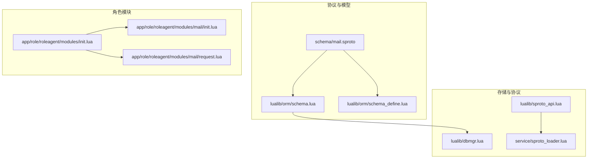
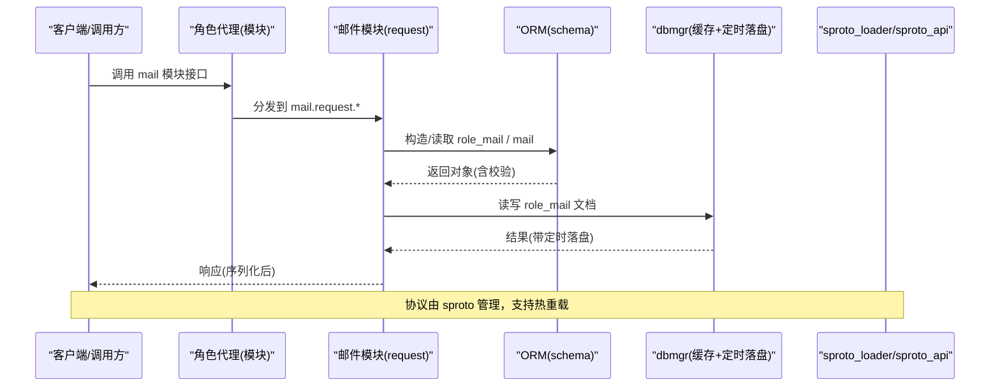
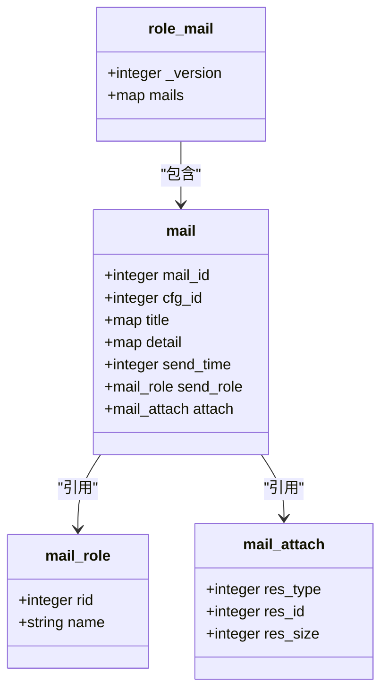
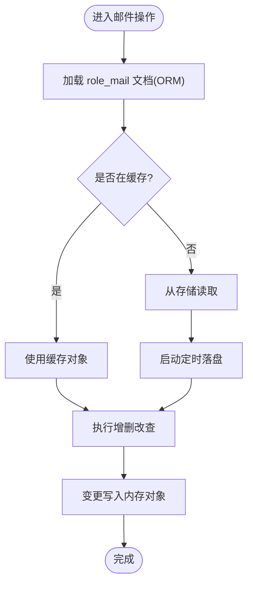
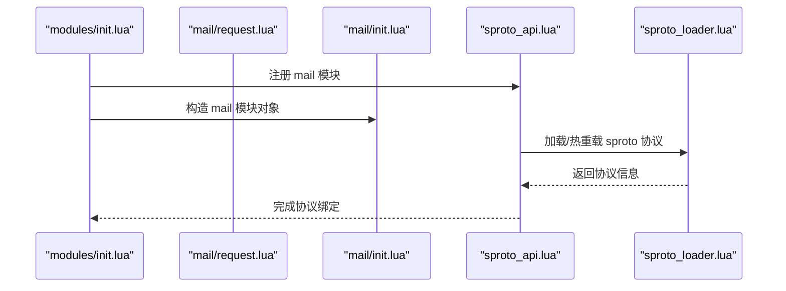
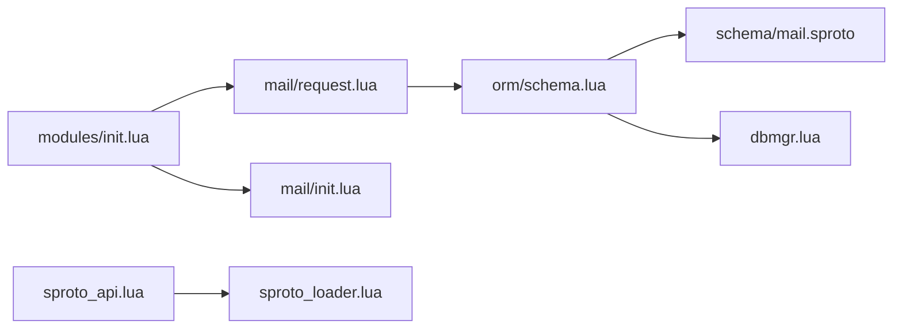

# 邮件协议

<cite>
**本文引用的文件**
- [schema/mail.sproto](file://schema/mail.sproto)
- [lualib/orm/schema.lua](file://lualib/orm/schema.lua)
- [lualib/orm/schema_define.lua](file://lualib/orm/schema_define.lua)
- [app/role/roleagent/modules/init.lua](file://app/role/roleagent/modules/init.lua)
- [app/role/roleagent/modules/mail/init.lua](file://app/role/roleagent/modules/mail/init.lua)
- [app/role/roleagent/modules/mail/request.lua](file://app/role/roleagent/modules/mail/request.lua)
- [lualib/dbmgr.lua](file://lualib/dbmgr.lua)
- [lualib/sproto_api.lua](file://lualib/sproto_api.lua)
- [service/sproto_loader.lua](file://service/sproto_loader.lua)
</cite>

## 目录
1. [简介](#简介)
2. [项目结构](#项目结构)
3. [核心组件](#核心组件)
4. [架构总览](#架构总览)
5. [详细组件分析](#详细组件分析)
6. [依赖关系分析](#依赖关系分析)
7. [性能考虑](#性能考虑)
8. [故障排查指南](#故障排查指南)
9. [结论](#结论)
10. [附录](#附录)

## 简介
本规范基于 SkyExt 框架中已实现的“角色邮件”数据模型与模块骨架，定义邮件系统的消息结构与数据模型，说明存储机制、查询接口以及扩展点。当前仓库提供了：
- 邮件数据模型（sproto 定义）
- ORM 类型映射与字段校验
- 角色模块加载与注册入口
- 通用数据库缓存与定时落盘机制

尚未实现具体业务请求处理逻辑（如发送、删除、读取等），但为后续扩展预留了清晰的接入点。

## 项目结构
邮件相关代码主要分布在以下位置：
- schema/mail.sproto：定义 role_mail、mail、mail_role、mail_attach 等数据结构
- lualib/orm/*：由 sproto 生成的 ORM 类型与字段校验
- app/role/roleagent/modules/*：角色模块加载与 mail 模块初始化、请求路由占位
- lualib/dbmgr.lua：通用文档缓存与定时持久化
- lualib/sproto_api.lua 与 service/sproto_loader.lua：sproto 协议加载与热重载

图表来源
- [schema/mail.sproto:1-36](file://schema/mail.sproto#L1-L36)
- [lualib/orm/schema.lua:250-417](file://lualib/orm/schema.lua#L250-L417)
- [lualib/orm/schema_define.lua:1-68](file://lualib/orm/schema_define.lua#L1-L68)
- [app/role/roleagent/modules/init.lua:1-36](file://app/role/roleagent/modules/init.lua#L1-L36)
- [lualib/dbmgr.lua:133-174](file://lualib/dbmgr.lua#L133-L174)
- [lualib/sproto_api.lua:158-198](file://lualib/sproto_api.lua#L158-L198)
- [service/sproto_loader.lua:1-86](file://service/sproto_loader.lua#L1-L86)

章节来源
- [schema/mail.sproto:1-36](file://schema/mail.sproto#L1-L36)
- [lualib/orm/schema.lua:250-417](file://lualib/orm/schema.lua#L250-L417)
- [app/role/roleagent/modules/init.lua:1-36](file://app/role/roleagent/modules/init.lua#L1-L36)

## 核心组件
- 邮件数据模型（sproto）
  - role_mail：玩家邮件容器，包含版本号和按 mail_id 索引的邮件列表
  - mail：单封邮件，包含 ID、配置ID、标题、内容、发送时间、发送者、附件
  - str2str：键值对结构，用于标题与内容的多语言或结构化文本
  - mail_role：发送者信息（rid、name）
  - mail_attach：资源附件（res_type、res_id、res_size）
- ORM 类型映射
  - 将 sproto 类型映射为可序列化的对象，提供字段校验、解析与构造方法
  - role_modules.mail 挂载 role_mail，作为角色数据的一部分
- 角色模块
  - modules/init.lua 负责注册“mail”模块并加载模块实例
  - modules/mail/init.lua 提供模块对象构造（当前仅记录日志）
  - modules/mail/request.lua 为请求处理器占位，待实现具体 API
- 存储与协议
  - dbmgr 提供文档级缓存与定时落盘，适用于 role_mail 这类角色数据
  - sproto_api 与 sproto_loader 负责协议加载与热更新

章节来源
- [schema/mail.sproto:1-36](file://schema/mail.sproto#L1-L36)
- [lualib/orm/schema.lua:250-417](file://lualib/orm/schema.lua#L250-L417)
- [lualib/orm/schema_define.lua:1-68](file://lualib/orm/schema_define.lua#L1-L68)
- [app/role/roleagent/modules/init.lua:1-36](file://app/role/roleagent/modules/init.lua#L1-L36)
- [app/role/roleagent/modules/mail/init.lua:1-16](file://app/role/roleagent/modules/mail/init.lua#L1-L16)
- [app/role/roleagent/modules/mail/request.lua:1-4](file://app/role/roleagent/modules/mail/request.lua#L1-L4)
- [lualib/dbmgr.lua:133-174](file://lualib/dbmgr.lua#L133-L174)
- [lualib/sproto_api.lua:158-198](file://lualib/sproto_api.lua#L158-L198)
- [service/sproto_loader.lua:1-86](file://service/sproto_loader.lua#L1-L86)

## 架构总览
邮件系统以“角色模块”为中心，数据模型通过 ORM 暴露给上层业务；存储层使用通用文档缓存与定时落盘；协议层通过 sproto 进行序列化与传输。

图表来源
- [app/role/roleagent/modules/init.lua:1-36](file://app/role/roleagent/modules/init.lua#L1-L36)
- [app/role/roleagent/modules/mail/request.lua:1-4](file://app/role/roleagent/modules/mail/request.lua#L1-L4)
- [lualib/orm/schema.lua:250-417](file://lualib/orm/schema.lua#L250-L417)
- [lualib/dbmgr.lua:133-174](file://lualib/dbmgr.lua#L133-L174)
- [lualib/sproto_api.lua:158-198](file://lualib/sproto_api.lua#L158-L198)
- [service/sproto_loader.lua:1-86](file://service/sproto_loader.lua#L1-L86)

## 详细组件分析

### 数据模型与字段定义
- role_mail
  - _version：整数，版本控制
  - mails：按 mail_id 索引的邮件映射
- mail
  - mail_id：整数，邮件唯一标识
  - cfg_id：整数，邮件模板/配置ID
  - title：str2str 映射，支持多语言或结构化标题
  - detail：str2str 映射，支持多语言或结构化正文
  - send_time：整数，发送时间戳
  - send_role：mail_role，发送者信息
  - attach：mail_attach，资源附件
- mail_role
  - rid：整数，角色ID
  - name：字符串，角色名
- mail_attach
  - res_type：整数，资源分类
  - res_id：整数，资源ID
  - res_size：整数，资源数量

图表来源
- [schema/mail.sproto:1-36](file://schema/mail.sproto#L1-L36)
- [lualib/orm/schema.lua:250-417](file://lualib/orm/schema.lua#L250-L417)

章节来源
- [schema/mail.sproto:1-36](file://schema/mail.sproto#L1-L36)
- [lualib/orm/schema.lua:250-417](file://lualib/orm/schema.lua#L250-L417)

### 存储机制与查询接口
- 存储载体
  - role_mail 作为角色模块的一部分，通过 ORM 暴露，并由 dbmgr 进行文档级缓存与定时落盘
- 缓存与落盘
  - dbmgr 在首次访问时加载文档，创建 ORM 对象，并启动随机延迟定时器周期性保存，降低写放大
  - unload 流程保护重复卸载与加载中状态
- 查询接口
  - 当前 request.lua 为空，未暴露具体查询 API
  - 建议后续在 request.lua 中实现：
    - 获取邮件列表（按 mail_id 范围或分页）
    - 获取单封邮件详情
    - 新增/删除邮件
    - 标记已读/清理过期邮件

图表来源
- [lualib/dbmgr.lua:133-174](file://lualib/dbmgr.lua#L133-L174)
- [lualib/orm/schema.lua:401-417](file://lualib/orm/schema.lua#L401-L417)

章节来源
- [lualib/dbmgr.lua:133-174](file://lualib/dbmgr.lua#L133-L174)
- [lualib/orm/schema.lua:401-417](file://lualib/orm/schema.lua#L401-L417)

### 模块加载与协议注册
- 模块注册
  - modules/init.lua 在 init 阶段注册 role、mail、bag 三个模块的请求处理器
  - load 阶段根据角色数据初始化各模块实例，其中 mail 模块实例由 mail.init.lua 构造
- 协议加载
  - sproto_api 在初始化时加载 sproto 协议，并通过事件通道监听热重载
  - sproto_loader 提供 load_proto 与 GM 命令重载协议

图表来源
- [app/role/roleagent/modules/init.lua:1-36](file://app/role/roleagent/modules/init.lua#L1-L36)
- [app/role/roleagent/modules/mail/init.lua:1-16](file://app/role/roleagent/modules/mail/init.lua#L1-L16)
- [lualib/sproto_api.lua:158-198](file://lualib/sproto_api.lua#L158-L198)
- [service/sproto_loader.lua:1-86](file://service/sproto_loader.lua#L1-L86)

章节来源
- [app/role/roleagent/modules/init.lua:1-36](file://app/role/roleagent/modules/init.lua#L1-L36)
- [app/role/roleagent/modules/mail/init.lua:1-16](file://app/role/roleagent/modules/mail/init.lua#L1-L16)
- [lualib/sproto_api.lua:158-198](file://lualib/sproto_api.lua#L158-L198)
- [service/sproto_loader.lua:1-86](file://service/sproto_loader.lua#L1-L86)

### 邮件操作示例（占位）
以下为建议的接口设计（当前未实现，需在 request.lua 中补充）：
- 发送邮件
  - 输入：收件人 rid、cfg_id、title、detail、send_time、send_role、attach
  - 行为：生成 mail_id，构造 mail 对象，插入 role_mail.mails
  - 输出：成功/失败码
- 接收/读取邮件
  - 输入：收件人 rid、可选 mail_id 或页码
  - 行为：从 role_mail.mails 读取并按条件过滤
  - 输出：邮件列表或单封邮件
- 删除邮件
  - 输入：收件人 rid、mail_id
  - 行为：从 role_mail.mails 移除对应条目
  - 输出：成功/失败码
- 附件处理
  - 输入：mail_attach（res_type、res_id、res_size）
  - 行为：校验资源类型与数量，必要时与背包/资源系统联动
  - 输出：成功/失败码

章节来源
- [app/role/roleagent/modules/mail/request.lua:1-4](file://app/role/roleagent/modules/mail/request.lua#L1-L4)
- [schema/mail.sproto:1-36](file://schema/mail.sproto#L1-L36)

### 过期机制与自动清理策略
- 现状
  - 数据模型中未包含过期时间字段；邮件生命周期由业务侧决定
- 建议方案
  - 在 mail 中增加 expire_time 字段，并在读取/批量操作中过滤过期项
  - 结合定时任务定期清理过期邮件，减少无效数据增长
  - 若需全局通知或跨服邮件，可在后续扩展独立的全局邮件存储（参考 schema 注释 TODO）

章节来源
- [schema/mail.sproto:1-36](file://schema/mail.sproto#L1-L36)

### 附件处理方式与大小限制
- 附件模型
  - mail_attach 使用 res_type、res_id、res_size 描述资源型附件
- 限制策略
  - 当前未定义大小上限；建议在业务层对 res_size 做上限校验
  - 对于非资源型大附件（如文件），建议采用外部存储并仅保留引用元数据
- 联动处理
  - 领取附件时可触发资源发放逻辑（例如与背包系统集成）

章节来源
- [schema/mail.sproto:1-36](file://schema/mail.sproto#L1-L36)
- [lualib/orm/schema.lua:273-290](file://lualib/orm/schema.lua#L273-L290)

## 依赖关系分析
- 模块耦合
  - modules/init.lua 强依赖 mail.request 与 mail.init
  - ORM 依赖 sproto 定义，dbmgr 依赖 ORM 对象
- 外部依赖
  - sproto_loader 提供协议加载与热重载能力
  - dbmgr 提供文档缓存与定时落盘

图表来源
- [app/role/roleagent/modules/init.lua:1-36](file://app/role/roleagent/modules/init.lua#L1-L36)
- [app/role/roleagent/modules/mail/request.lua:1-4](file://app/role/roleagent/modules/mail/request.lua#L1-L4)
- [app/role/roleagent/modules/mail/init.lua:1-16](file://app/role/roleagent/modules/mail/init.lua#L1-L16)
- [lualib/orm/schema.lua:250-417](file://lualib/orm/schema.lua#L250-L417)
- [schema/mail.sproto:1-36](file://schema/mail.sproto#L1-L36)
- [lualib/dbmgr.lua:133-174](file://lualib/dbmgr.lua#L133-L174)
- [lualib/sproto_api.lua:158-198](file://lualib/sproto_api.lua#L158-L198)
- [service/sproto_loader.lua:1-86](file://service/sproto_loader.lua#L1-L86)

章节来源
- [app/role/roleagent/modules/init.lua:1-36](file://app/role/roleagent/modules/init.lua#L1-L36)
- [lualib/orm/schema.lua:250-417](file://lualib/orm/schema.lua#L250-L417)
- [lualib/dbmgr.lua:133-174](file://lualib/dbmgr.lua#L133-L174)
- [lualib/sproto_api.lua:158-198](file://lualib/sproto_api.lua#L158-L198)
- [service/sproto_loader.lua:1-86](file://service/sproto_loader.lua#L1-L86)

## 性能考虑
- 缓存与落盘
  - dbmgr 使用随机延迟定时器降低集中写压力，适合高频更新的邮件列表
- 协议序列化
  - sproto 提供高效序列化，建议合理拆分消息体，避免过大 payload
- 查询优化
  - 对邮件列表建议使用分页或范围查询，减少一次性传输量
- 附件体积
  - 对 res_size 设置上限，避免单次消息过大影响网络与存储

[本节为通用指导，不直接分析具体文件]

## 故障排查指南
- 协议加载失败
  - 检查 sproto_loader 是否成功加载 schema，确认路径与索引正确
- 模块未生效
  - 确认 modules/init.lua 是否正确注册 mail 模块，且 request.lua 存在
- 数据未持久化
  - 检查 dbmgr 定时器是否启动，是否存在 unload 冲突或 loading 状态
- 数据校验错误
  - 核对 ORM 字段类型与 sproto 定义一致性

章节来源
- [service/sproto_loader.lua:1-86](file://service/sproto_loader.lua#L1-L86)
- [app/role/roleagent/modules/init.lua:1-36](file://app/role/roleagent/modules/init.lua#L1-L36)
- [lualib/dbmgr.lua:133-174](file://lualib/dbmgr.lua#L133-L174)
- [lualib/orm/schema.lua:250-417](file://lualib/orm/schema.lua#L250-L417)

## 结论
当前 SkyExt 邮件系统已完成数据模型与模块骨架搭建，具备可扩展的存储与协议基础。下一步应在 mail/request.lua 中实现完整的邮件收发、删除、查询与附件处理逻辑，并结合业务需求完善过期与清理策略。

[本节为总结性内容，不直接分析具体文件]

## 附录
- 术语
  - sproto：轻量级协议定义与序列化库
  - ORM：对象关系映射，提供类型安全的数据访问
  - dbmgr：文档级缓存与定时落盘管理器
- 相关文件
  - 协议定义：schema/mail.sproto
  - ORM 映射：lualib/orm/schema.lua、lualib/orm/schema_define.lua
  - 模块入口：app/role/roleagent/modules/init.lua
  - 存储机制：lualib/dbmgr.lua
  - 协议服务：lualib/sproto_api.lua、service/sproto_loader.lua

[本节为补充说明，不直接分析具体文件]