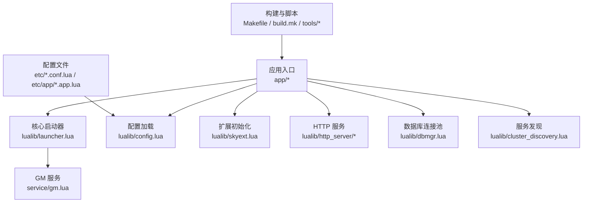
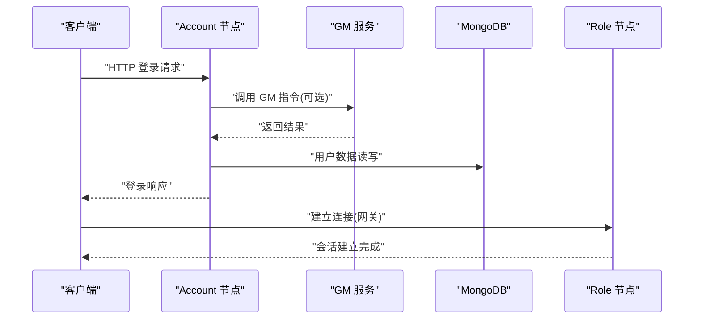
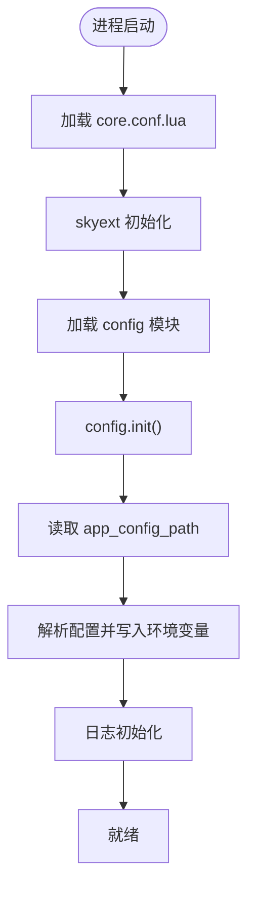
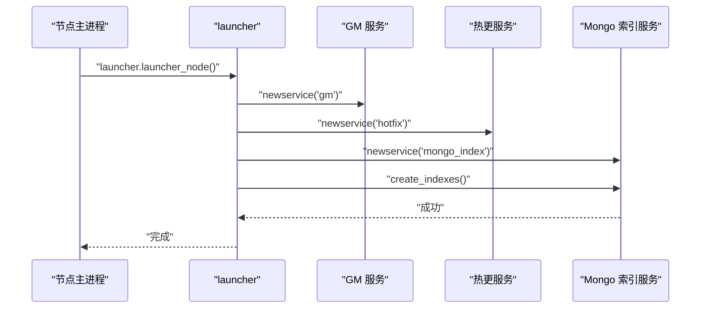
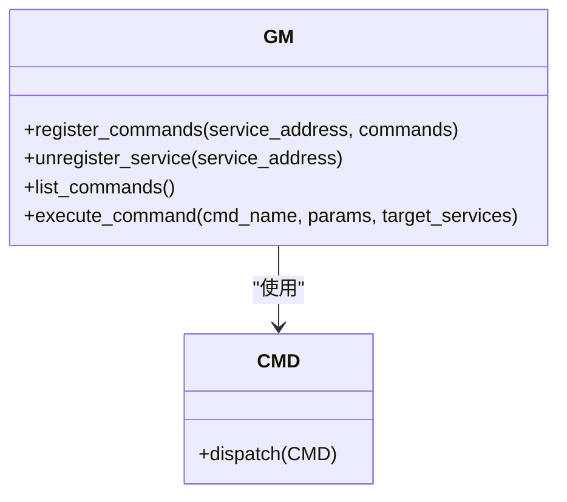
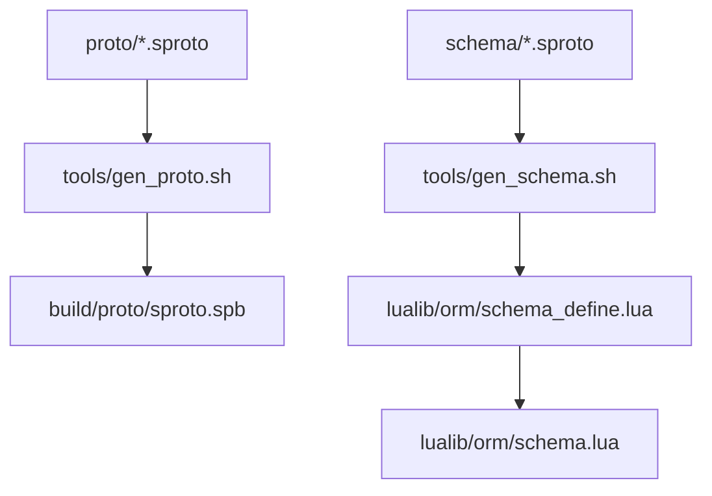
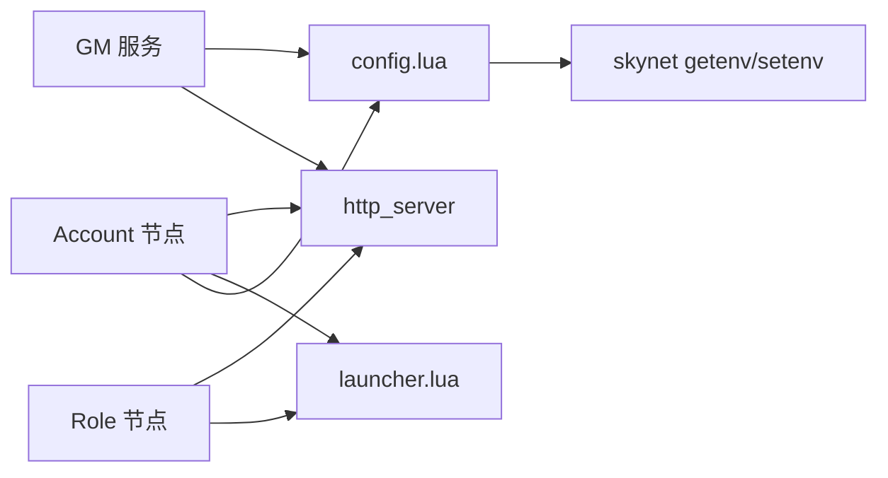

# 开发指南

<cite>
**本文引用的文件**
- [README.md](file://README.md)
- [Makefile](file://Makefile)
- [build.mk](file://build.mk)
- [core.conf.lua](file://etc/core.conf.lua)
- [common.app.lua](file://etc/app/common.app.lua)
- [account/main.lua](file://app/account/main.lua)
- [role/main.lua](file://app/role/main.lua)
- [skyext.lua](file://lualib/skyext.lua)
- [config.lua](file://lualib/config.lua)
- [launcher.lua](file://lualib/launcher.lua)
- [gen_proto.sh](file://tools/gen_proto.sh)
- [gen_schema.sh](file://tools/gen_schema.sh)
- [run.lua](file://tools/run.lua)
- [gm.lua](file://service/gm.lua)
- [errcode.lua](file://lualib/errcode.lua)
- [test_etcd/main.lua](file://test/test_etcd/main.lua)
</cite>

## 目录
1. [简介](#简介)
2. [项目结构](#项目结构)
3. [核心组件](#核心组件)
4. [架构总览](#架构总览)
5. [详细组件分析](#详细组件分析)
6. [依赖关系分析](#依赖关系分析)
7. [性能考虑](#性能考虑)
8. [故障排查指南](#故障排查指南)
9. [结论](#结论)
10. [附录](#附录)

## 简介
本指南面向 SkyExt 框架的开发者，覆盖从环境搭建、依赖安装、项目初始化到新功能开发规范、模块标准、代码组织原则的全流程说明。文档还包含协议定义与生成、测试方法（单元/集成/性能）、调试技巧、代码审查标准、版本控制与发布流程，以及常用工具的使用与常见问题排查。SkyExt 是基于 skynet 的分布式游戏服务器框架，采用微服务设计，支持账号节点与角色节点分离部署，内置 ORM、服务发现、JWT 认证、日志系统，并计划支持热更新与监控管理。

## 项目结构
SkyExt 采用分层与模块化组织：
- app：应用入口，按节点类型划分（account、role、robot）
- etc：配置中心，分为节点级与应用级配置
- lualib：通用库（ORM、HTTP、日志、工具等）
- proto/schema：协议与数据模式定义
- service：后台服务（GM、MongoDB 索引、热更等）
- tools：构建与辅助脚本
- test：测试用例
- 3rd：第三方依赖（sproto-orm、lua-cjson、luafilesystem、libsodium 等）

图表来源
- [core.conf.lua:1-30](file://etc/core.conf.lua#L1-L30)
- [common.app.lua:1-100](file://etc/app/common.app.lua#L1-L100)
- [account/main.lua:1-25](file://app/account/main.lua#L1-L25)
- [role/main.lua:1-25](file://app/role/main.lua#L1-L25)
- [launcher.lua:1-20](file://lualib/launcher.lua#L1-L20)
- [config.lua:1-145](file://lualib/config.lua#L1-L145)
- [skyext.lua:1-81](file://lualib/skyext.lua#L1-L81)
- [gm.lua:1-310](file://service/gm.lua#L1-L310)

章节来源
- [README.md:1-276](file://README.md#L1-L276)
- [Makefile:1-47](file://Makefile#L1-L47)
- [build.mk:1-106](file://build.mk#L1-L106)

## 核心组件
- 配置系统：统一读取与序列化应用配置，支持字符串、数值、布尔、表类型；通过环境变量注入，避免重复加载。
- 启动器：负责启动 GM、热更、MongoDB 索引等基础服务。
- 扩展初始化：在 skynet 启动时加载配置与日志，并覆盖部分 table 操作以适配 ORM。
- HTTP 服务：为 account 与 gm 提供 HTTP 接口，支持路由注册。
- 错误码：集中定义业务错误码，便于统一处理与返回。

章节来源
- [config.lua:1-145](file://lualib/config.lua#L1-L145)
- [launcher.lua:1-20](file://lualib/launcher.lua#L1-L20)
- [skyext.lua:1-81](file://lualib/skyext.lua#L1-L81)
- [gm.lua:1-310](file://service/gm.lua#L1-L310)
- [errcode.lua:1-29](file://lualib/errcode.lua#L1-L29)

## 架构总览
SkyExt 的运行时由多个节点组成：
- Account 节点：提供 HTTP 登录与账号管理，启动 GM 与 MongoDB 索引。
- Role 节点：监听客户端连接，启动 watchdog 网关，承载角色逻辑。
- GM 服务：提供指令注册、执行与管理能力，暴露 HTTP 接口。
- 配置与扩展：在启动阶段加载应用配置与日志，确保后续模块可用。

图表来源
- [account/main.lua:1-25](file://app/account/main.lua#L1-L25)
- [role/main.lua:1-25](file://app/role/main.lua#L1-L25)
- [gm.lua:1-310](file://service/gm.lua#L1-L310)
- [common.app.lua:1-100](file://etc/app/common.app.lua#L1-L100)

## 详细组件分析

### 配置加载与初始化流程
- 启动时通过 core.conf 设置 Lua 搜索路径与服务路径。
- skyext 在 init 中加载 config 与 log，并覆盖 table 相关函数以支持 ORM。
- config.init 读取 app_config_path 指向的应用配置，解析并写入环境变量供各模块使用。

图表来源
- [core.conf.lua:1-30](file://etc/core.conf.lua#L1-L30)
- [skyext.lua:1-81](file://lualib/skyext.lua#L1-L81)
- [config.lua:1-145](file://lualib/config.lua#L1-L145)

章节来源
- [core.conf.lua:1-30](file://etc/core.conf.lua#L1-L30)
- [skyext.lua:1-81](file://lualib/skyext.lua#L1-L81)
- [config.lua:1-145](file://lualib/config.lua#L1-L145)

### 启动器与基础服务
- launcher_node 启动 GM、热更服务，并创建 MongoDB 索引后退出索引服务。
- Account 节点启动 HTTP 服务并注册路由；Role 节点启动 watchdog 网关监听端口。

图表来源
- [launcher.lua:1-20](file://lualib/launcher.lua#L1-L20)
- [gm.lua:1-310](file://service/gm.lua#L1-L310)

章节来源
- [launcher.lua:1-20](file://lualib/launcher.lua#L1-L20)
- [account/main.lua:1-25](file://app/account/main.lua#L1-L25)
- [role/main.lua:1-25](file://app/role/main.lua#L1-L25)

### GM 指令系统
- 支持批量注册指令、注销服务指令、列出指令、执行指令。
- 指令可绑定到多个服务地址，支持按服务过滤执行。
- 提供 HTTP 接口与 cmd_api 分发机制。

图表来源
- [gm.lua:1-310](file://service/gm.lua#L1-L310)

章节来源
- [gm.lua:1-310](file://service/gm.lua#L1-L310)

### 协议与模式生成
- 协议生成：将 sproto 文件编译为二进制格式，供运行时校验与编解码。
- 模式生成：基于 schema/*.sproto 生成 ORM 所需模式定义与元数据。

图表来源
- [gen_proto.sh:1-8](file://tools/gen_proto.sh#L1-L8)
- [gen_schema.sh:1-10](file://tools/gen_schema.sh#L1-L10)

章节来源
- [gen_proto.sh:1-8](file://tools/gen_proto.sh#L1-L8)
- [gen_schema.sh:1-10](file://tools/gen_schema.sh#L1-L10)

### 运行工具与脚本入口
- run.lua 作为工具脚本的统一入口，设置路径、解析参数、执行目标脚本。
- Makefile 提供 proto、schema、autocode、format、lint、dist 等命令。

章节来源
- [run.lua:1-80](file://tools/run.lua#L1-L80)
- [Makefile:1-47](file://Makefile#L1-L47)

## 依赖关系分析
- 构建依赖：skynet、libsodium、lua-cjson、luafilesystem、sproto-orm。
- 运行时依赖：etcd（服务发现与锁）、MongoDB（持久化）。
- 模块耦合：
  - account/role 依赖 launcher、config、http_server。
  - gm 依赖 http_server、cmd_api、config。
  - 配置模块依赖 skynet.getenv/setenv。

图表来源
- [account/main.lua:1-25](file://app/account/main.lua#L1-L25)
- [role/main.lua:1-25](file://app/role/main.lua#L1-L25)
- [gm.lua:1-310](file://service/gm.lua#L1-L310)
- [config.lua:1-145](file://lualib/config.lua#L1-L145)

章节来源
- [build.mk:1-106](file://build.mk#L1-L106)
- [common.app.lua:1-100](file://etc/app/common.app.lua#L1-L100)

## 性能考虑
- 线程与并发：根据 core.conf 中的 thread 数调整并发度；HTTP agent_count 影响连接处理能力。
- 数据库连接池：MongoDB connections 需根据负载调优，避免连接耗尽或过多上下文切换。
- 日志策略：合理设置日志等级与分割策略，避免 IO 瓶颈。
- 协议校验：启用 proto checksum 可减少非法包处理开销。
- 内存与对象：ORM 对 table 操作的覆盖需谨慎，避免过度包装导致性能下降。

## 故障排查指南
- 启动失败：检查 core.conf 的路径与模块名是否正确；确认 app_config_path 存在且可解析。
- 配置加载异常：查看 config.init 的错误信息；确认环境变量与嵌套表序列化正确。
- 数据库连接问题：核对 mongo_config 的 host/port/authdb；检查集合索引是否创建成功。
- 服务发现异常：验证 etcd_config 的 http_host 列表连通性；使用测试用例进行探测。
- 协议不一致：启用 proto_checksum 并在日志中定位差异；重新生成 sproto.spb。
- 常见错误码：参考 errcode 定义，快速定位业务错误场景。

章节来源
- [core.conf.lua:1-30](file://etc/core.conf.lua#L1-L30)
- [config.lua:1-145](file://lualib/config.lua#L1-L145)
- [common.app.lua:1-100](file://etc/app/common.app.lua#L1-L100)
- [errcode.lua:1-29](file://lualib/errcode.lua#L1-L29)
- [test_etcd/main.lua:1-53](file://test/test_etcd/main.lua#L1-L53)

## 结论
SkyExt 提供了清晰的节点划分、统一的配置与启动流程、完善的 GM 指令系统与协议/模式生成工具链。遵循本文的开发规范与最佳实践，可以快速扩展功能、保证稳定性与可维护性。建议在新功能开发前明确模块职责、定义好协议与错误码，并通过测试与性能评估保障上线质量。

## 附录

### 开发环境搭建与项目初始化
- 初始化子模块与编译：
  - make init
  - make build
- 启动外部依赖：
  - 启动 etcd 集群
  - 启动 MongoDB
- 生成协议与模式：
  - make proto
  - make schema
  - make autocode
- 启动节点：
  - 启动 account 节点（多实例）
  - 启动 role 节点（多实例）
  - 启动 robot 进行压测

章节来源
- [README.md:48-110](file://README.md#L48-L110)
- [Makefile:11-47](file://Makefile#L11-L47)
- [build.mk:78-92](file://build.mk#L78-L92)

### 新功能开发规范与模块标准
- 模块职责单一：每个模块聚焦一个领域（如 bag、mail、role），通过 request/init 拆分请求处理与初始化。
- 协议先行：新增功能先在 schema 与 proto 中定义数据结构与消息，再使用工具生成代码。
- 错误码统一：所有业务错误映射到 errcode，避免散乱状态码。
- 配置外置：新特性参数放入 etc/app/*.app.lua，通过 config.get_* 获取。
- 可观测性：关键路径添加日志，记录输入输出与耗时。

章节来源
- [errcode.lua:1-29](file://lualib/errcode.lua#L1-L29)
- [common.app.lua:1-100](file://etc/app/common.app.lua#L1-L100)

### 代码组织原则
- app 层：节点入口与启动编排，不放置业务逻辑。
- lualib 层：通用能力（ORM、HTTP、日志、工具）。
- service 层：后台服务（GM、热更、索引）。
- proto/schema：契约定义，保持向后兼容。
- tools：构建与自动化脚本，保持幂等与可重复。

章节来源
- [core.conf.lua:1-30](file://etc/core.conf.lua#L1-L30)

### 协议定义流程
- 在 schema 定义数据模型，在 proto 定义消息结构。
- 运行 make proto 生成 sproto.spb。
- 运行 make schema 生成 ORM 模式文件。
- 在业务中使用生成的 API 进行编解码与持久化。

章节来源
- [gen_proto.sh:1-8](file://tools/gen_proto.sh#L1-L8)
- [gen_schema.sh:1-10](file://tools/gen_schema.sh#L1-L10)

### 测试方法与调试技巧
- 单元测试：针对工具脚本与纯函数，使用 run.lua 执行测试脚本。
- 集成测试：通过 test/test_etcd 示例验证 etcd 交互与 cmd_api 分发。
- 性能测试：使用 robot 节点模拟客户端流量，观察日志与资源占用。
- 调试技巧：
  - 开启详细日志（log_level 调高）
  - 使用 GM 指令查询服务状态与执行诊断
  - 结合 HTTP 接口与浏览器工具（public/gm.html）

章节来源
- [run.lua:1-80](file://tools/run.lua#L1-L80)
- [test_etcd/main.lua:1-53](file://test/test_etcd/main.lua#L1-L53)
- [gm.lua:1-310](file://service/gm.lua#L1-L310)

### 代码审查标准、版本控制与发布流程
- 代码审查：
  - 命名清晰、模块内聚、低耦合
  - 错误处理完善，日志充分
  - 配置项有默认值与注释
- 版本控制：
  - 分支策略：feature/xxx、hotfix/xxx
  - 提交信息规范：模块+变更点
- 发布流程：
  - 全量构建与测试通过
  - 生成 dist 包
  - 灰度发布与回滚预案

章节来源
- [Makefile:44-47](file://Makefile#L44-L47)
- [README.md:267-276](file://README.md#L267-L276)

### 开发工具使用指南
- 格式化与检查：
  - make format（stylua）
  - make lint（luacheck）
- 构建与清理：
  - make clean / make cleanall
  - make dist（打包）
- 工具脚本：
  - tools/run.lua 统一入口
  - tools/gen_proto.sh / gen_schema.sh

章节来源
- [Makefile:34-47](file://Makefile#L34-L47)
- [build.mk:93-106](file://build.mk#L93-L106)
- [run.lua:1-80](file://tools/run.lua#L1-L80)