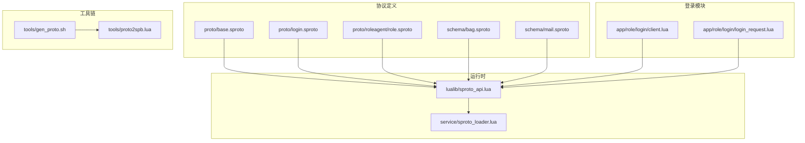
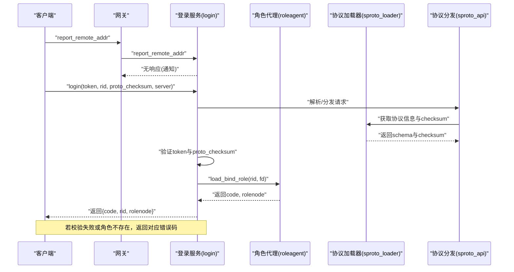
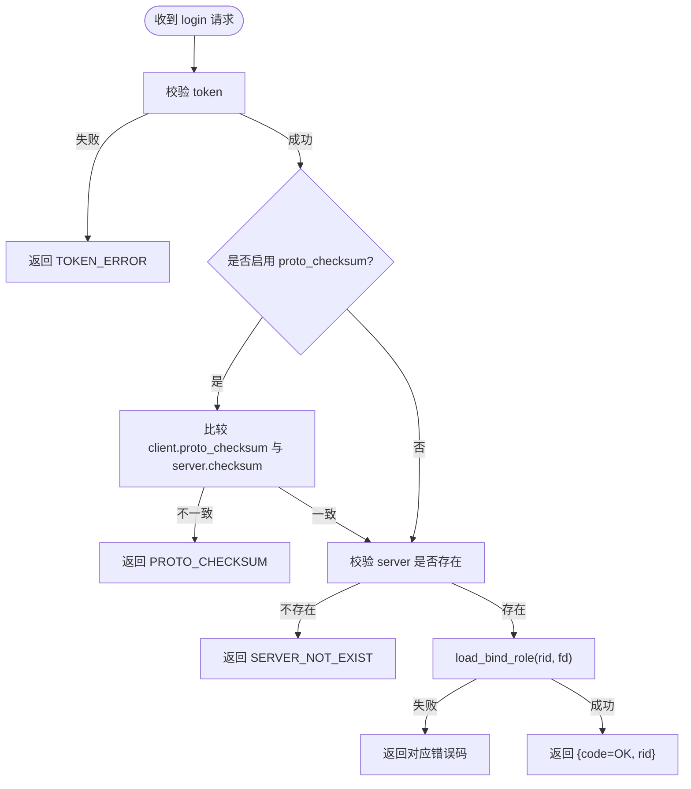
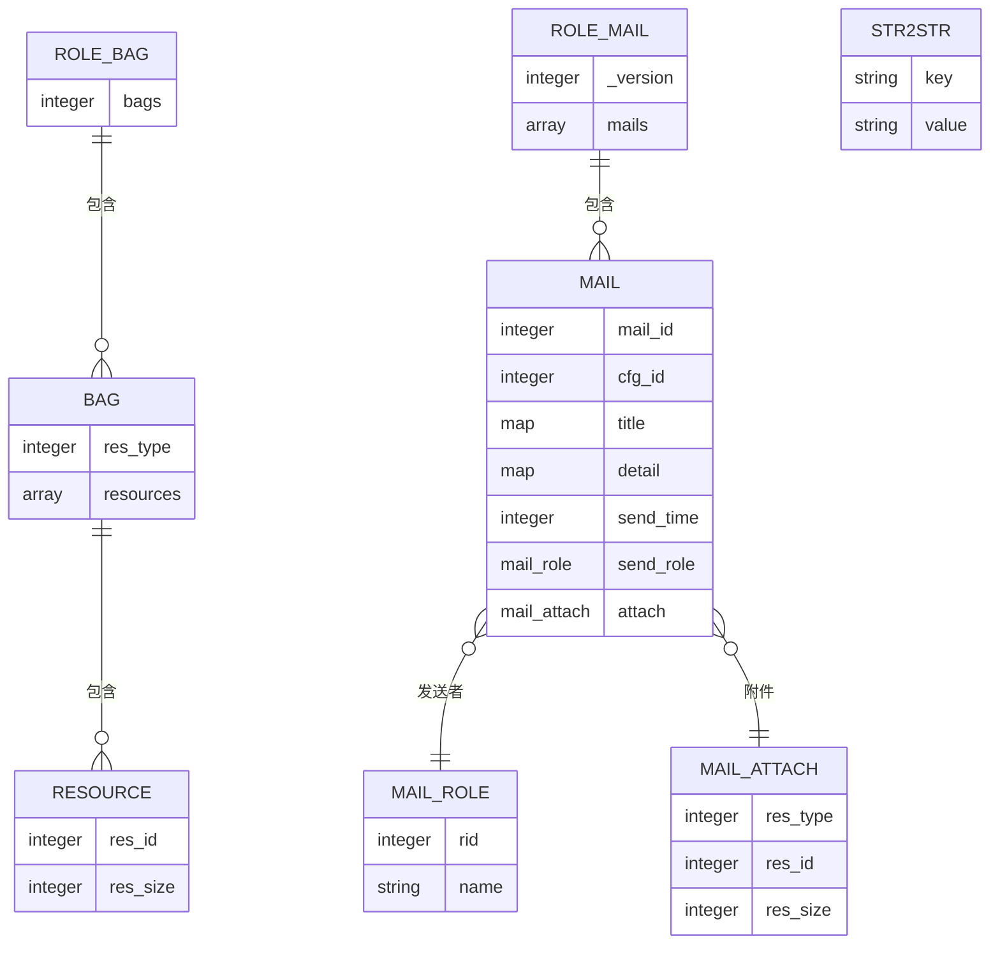
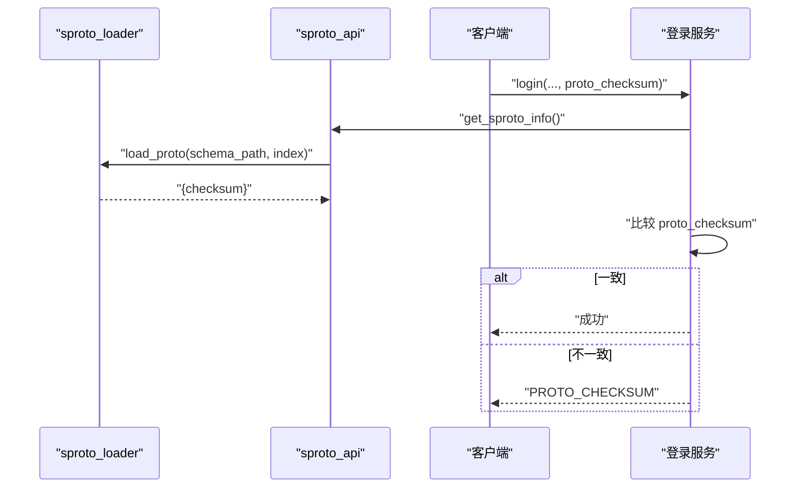
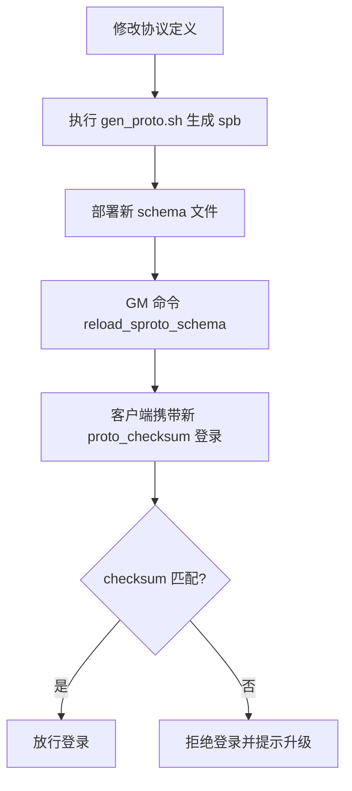
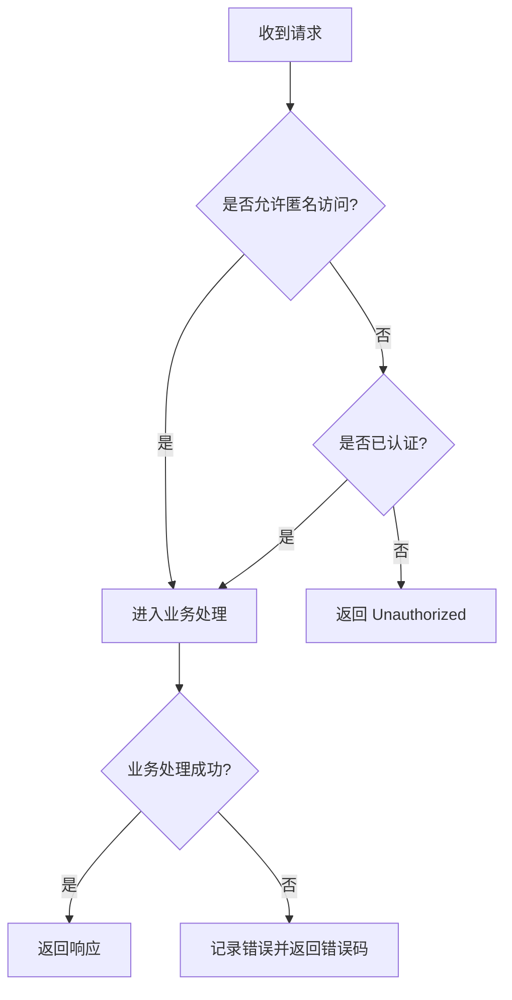
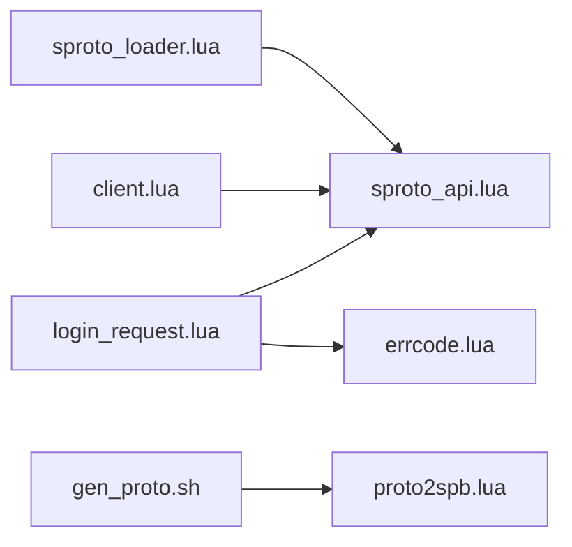

# 协议定义

<cite>
**本文引用的文件**
- [base.sproto](file://proto/base.sproto)
- [login.sproto](file://proto/login.sproto)
- [role.sproto](file://proto/roleagent/role.sproto)
- [bag.sproto](file://schema/bag.sproto)
- [mail.sproto](file://schema/mail.sproto)
- [sproto_api.lua](file://lualib/sproto_api.lua)
- [sproto_loader.lua](file://service/sproto_loader.lua)
- [client.lua](file://app/role/login/client.lua)
- [login_request.lua](file://app/role/login/login_request.lua)
- [errcode.lua](file://lualib/errcode.lua)
- [gen_proto.sh](file://tools/gen_proto.sh)
- [proto2spb.lua](file://tools/proto2spb.lua)
</cite>

## 目录
1. [简介](#简介)
2. [项目结构](#项目结构)
3. [核心组件](#核心组件)
4. [架构总览](#架构总览)
5. [详细组件分析](#详细组件分析)
6. [依赖关系分析](#依赖关系分析)
7. [性能考虑](#性能考虑)
8. [故障排查指南](#故障排查指南)
9. [结论](#结论)
10. [附录](#附录)

## 简介
本文件为 SkyExt 框架中基于 sproto 的协议定义与使用文档，覆盖基础协议结构、登录协议、角色协议字段定义，消息格式与序列化规则、版本管理机制、兼容性策略与向后兼容原则、协议版本升级流程与迁移指南，以及协议使用示例与错误处理模式。同时提供协议流程图与消息交互序列图，帮助开发者快速理解并正确使用协议体系。

## 项目结构
SkyExt 将协议定义集中在 proto 与 schema 目录：
- proto：网络层协议定义（包头、登录、角色等）
- schema：业务数据模型定义（角色、背包、邮件等）
- lualib/sproto_api.lua：运行时协议加载、分发、调用封装
- service/sproto_loader.lua：协议文件读取、校验、缓存与热重载
- app/role/login/*：登录模块实现（鉴权、路由、绑定角色节点）
- tools/*：协议生成与打包工具



图表来源
- [base.sproto:1-7](file://proto/base.sproto#L1-L7)
- [login.sproto:1-26](file://proto/login.sproto#L1-L26)
- [role.sproto:1-13](file://proto/roleagent/role.sproto#L1-L13)
- [bag.sproto:1-16](file://schema/bag.sproto#L1-L16)
- [mail.sproto:1-37](file://schema/mail.sproto#L1-L37)
- [sproto_api.lua:118-196](file://lualib/sproto_api.lua#L118-L196)
- [sproto_loader.lua:19-59](file://service/sproto_loader.lua#L19-L59)
- [client.lua:55-73](file://app/role/login/client.lua#L55-L73)
- [login_request.lua:58-105](file://app/role/login/login_request.lua#L58-L105)
- [gen_proto.sh:1-8](file://tools/gen_proto.sh#L1-L8)
- [proto2spb.lua:1-30](file://tools/proto2spb.lua#L1-L30)

章节来源
- [base.sproto:1-7](file://proto/base.sproto#L1-L7)
- [login.sproto:1-26](file://proto/login.sproto#L1-L26)
- [role.sproto:1-13](file://proto/roleagent/role.sproto#L1-L13)
- [bag.sproto:1-16](file://schema/bag.sproto#L1-L16)
- [mail.sproto:1-37](file://schema/mail.sproto#L1-L37)
- [sproto_api.lua:118-196](file://lualib/sproto_api.lua#L118-L196)
- [sproto_loader.lua:19-59](file://service/sproto_loader.lua#L19-L59)
- [client.lua:55-73](file://app/role/login/client.lua#L55-L73)
- [login_request.lua:58-105](file://app/role/login/login_request.lua#L58-L105)
- [gen_proto.sh:1-8](file://tools/gen_proto.sh#L1-L8)
- [proto2spb.lua:1-30](file://tools/proto2spb.lua#L1-L30)

## 核心组件
- 基础包协议 base.package：包含 type、session、ud 三个字段，用于区分消息类型、会话标识与用户自定义数据。
- 登录协议 login：
  - report_remote_addr：网关向游戏服务上报客户端连接信息。
  - login：客户端登录请求，携带 token、rid、proto_checksum、server；返回 code、rid、rolenode。
  - logout：登出通知。
- 角色协议 roleagent.role：
  - .role：角色基本信息 rid、name。
  - login_info：获取角色登录信息。
- 业务数据模型 schema：
  - bag：资源分类与资源列表。
  - mail：邮件、发送人、附件等。

章节来源
- [base.sproto:1-7](file://proto/base.sproto#L1-L7)
- [login.sproto:1-26](file://proto/login.sproto#L1-L26)
- [role.sproto:1-13](file://proto/roleagent/role.sproto#L1-L13)
- [bag.sproto:1-16](file://schema/bag.sproto#L1-L16)
- [mail.sproto:1-37](file://schema/mail.sproto#L1-L37)

## 架构总览
下图展示从客户端到登录服务的完整消息流，包括协议加载、鉴权、协议版本校验、角色绑定与后续转发。



图表来源
- [login.sproto:1-26](file://proto/login.sproto#L1-L26)
- [sproto_api.lua:118-196](file://lualib/sproto_api.lua#L118-L196)
- [sproto_loader.lua:19-59](file://service/sproto_loader.lua#L19-L59)
- [login_request.lua:58-105](file://app/role/login/login_request.lua#L58-L105)

## 详细组件分析

### 基础协议结构与消息格式
- base.package
  - type：整数，消息类型标识
  - session：整数，请求-响应对应会话ID
  - ud：整数，用户自定义数据
- 消息封装
  - 通过 sproto_api 的 host("base.package") 进行编解码
  - 所有请求/响应均包裹在 base.package 中，便于统一路由与会话管理

章节来源
- [base.sproto:1-7](file://proto/base.sproto#L1-L7)
- [sproto_api.lua:182-186](file://lualib/sproto_api.lua#L182-L186)

### 登录协议详解
- report_remote_addr
  - request：remote_addr、local_addr
  - 用途：网关上报客户端与本地地址，供登录服务记录
- login
  - request：token、rid、proto_checksum、server
  - response：code、rid、rolenode
  - 处理逻辑：
    - 校验 token
    - 可选校验 proto_checksum（配置开启时）
    - 校验服务器存在性
    - 绑定角色并返回目标节点
- logout
  - 关闭客户端连接



图表来源
- [login.sproto:10-22](file://proto/login.sproto#L10-L22)
- [login_request.lua:58-105](file://app/role/login/login_request.lua#L58-L105)
- [errcode.lua:1-29](file://lualib/errcode.lua#L1-L29)

章节来源
- [login.sproto:1-26](file://proto/login.sproto#L1-L26)
- [login_request.lua:58-105](file://app/role/login/login_request.lua#L58-L105)
- [errcode.lua:1-29](file://lualib/errcode.lua#L1-L29)

### 角色协议详解
- .role：rid、name
- login_info
  - request：空
  - response：info（role）
  - 用途：登录后获取角色基本信息

```mermaid
classDiagram
class Role {
+integer rid
+string name
}
class LoginInfo {
+request {}
+response info : Role
}
LoginInfo --> Role : "返回"
```

图表来源
- [role.sproto:1-13](file://proto/roleagent/role.sproto#L1-L13)

章节来源
- [role.sproto:1-13](file://proto/roleagent/role.sproto#L1-L13)

### 业务数据模型（schema）
- bag
  - role_bag：bags（*bag(res_type)）
  - bag：res_type、res（*resource(res_id)）
  - resource：res_id、res_size
- mail
  - role_mail：_version、mails（*mail(mail_id)）
  - mail：mail_id、cfg_id、title、detail、send_time、send_role、attach
  - str2str：key、value
  - mail_role：rid、name
  - mail_attach：res_type、res_id、res_size



图表来源
- [bag.sproto:1-16](file://schema/bag.sproto#L1-L16)
- [mail.sproto:1-37](file://schema/mail.sproto#L1-L37)

章节来源
- [bag.sproto:1-16](file://schema/bag.sproto#L1-L16)
- [mail.sproto:1-37](file://schema/mail.sproto#L1-L37)

### 序列化规则与版本管理
- 序列化
  - 使用 sprotoloader 加载 schema，并通过 host("base.package") 进行编解码
  - 所有消息以 base.package 包裹，支持 session 与 ud
- 版本管理
  - sproto_loader 读取 schema 文件内容计算 md5 checksum
  - 将 checksum 保存在 g_sproto_loaded 中，供 sproto_api.get_sproto_info() 暴露
  - 登录流程可强制校验 client.proto_checksum 与 server.checksum，确保客户端与服务端协议一致
- 热重载
  - 通过 event_channel 订阅 schema_path，触发 reload_sproto
  - GM 命令 reload_sproto_schema 可批量重载所有已加载 schema



图表来源
- [sproto_loader.lua:19-59](file://service/sproto_loader.lua#L19-L59)
- [sproto_api.lua:161-186](file://lualib/sproto_api.lua#L161-L186)
- [login_request.lua:68-85](file://app/role/login/login_request.lua#L68-L85)

章节来源
- [sproto_loader.lua:19-59](file://service/sproto_loader.lua#L19-L59)
- [sproto_api.lua:161-186](file://lualib/sproto_api.lua#L161-L186)
- [login_request.lua:68-85](file://app/role/login/login_request.lua#L68-L85)

### 兼容性策略与向后兼容原则
- 字段新增：允许新增字段，旧客户端忽略未知字段
- 字段删除：不允许删除已有字段（避免破坏旧客户端）
- 字段类型与名称：不允许修改（避免破坏序列化）
- 版本控制：通过 schema._version 与 proto_checksum 双重保障
- 建议：对关键数据结构维护 _version，并在服务端做兼容处理

章节来源
- [mail.sproto:1-37](file://schema/mail.sproto#L1-L37)
- [role.sproto:1-24](file://schema/role.sproto#L1-L24)
- [login.sproto:10-22](file://proto/login.sproto#L10-L22)

### 协议版本升级流程与迁移指南
- 升级步骤
  1. 修改 proto/schema 文件，遵循向后兼容原则
  2. 运行工具生成 spb：tools/gen_proto.sh -> tools/proto2spb.lua
  3. 部署新的 schema 文件至服务
  4. 通过 GM 命令 reload_sproto_schema 热重载
  5. 客户端更新后携带新的 proto_checksum
  6. 服务端校验通过后放行
- 回滚策略
  - 若新版本导致不兼容，立即回滚 schema 并重新加载
  - 客户端需具备降级能力或提示升级



图表来源
- [gen_proto.sh:1-8](file://tools/gen_proto.sh#L1-L8)
- [proto2spb.lua:1-30](file://tools/proto2spb.lua#L1-L30)
- [sproto_loader.lua:61-80](file://service/sproto_loader.lua#L61-L80)
- [login_request.lua:68-85](file://app/role/login/login_request.lua#L68-L85)

章节来源
- [gen_proto.sh:1-8](file://tools/gen_proto.sh#L1-L8)
- [proto2spb.lua:1-30](file://tools/proto2spb.lua#L1-L30)
- [sproto_loader.lua:61-80](file://service/sproto_loader.lua#L61-L80)
- [login_request.lua:68-85](file://app/role/login/login_request.lua#L68-L85)

### 协议使用示例
- 登录流程
  - 客户端先上报地址 report_remote_addr
  - 再发起 login(token, rid, proto_checksum, server)
  - 成功后根据返回的 rolenode 连接到具体游戏节点
- 角色信息查询
  - 连接 roleagent 后调用 login_info 获取角色基本信息

章节来源
- [login.sproto:1-26](file://proto/login.sproto#L1-L26)
- [role.sproto:1-13](file://proto/roleagent/role.sproto#L1-L13)

### 错误处理模式
- 统一错误码 errcode
  - OK、TOKEN_ERROR、PROTO_CHECKSUM、SERVER_NOT_EXIST、ROLE_NOT_EXIST 等
- 中间件拦截
  - 登录模块通过 middleware_cbs 进行鉴权检查，未认证请求直接拒绝
- 异常捕获
  - sproto_api 使用 xpcall 捕获请求处理异常并记录日志



图表来源
- [client.lua:55-73](file://app/role/login/client.lua#L55-L73)
- [sproto_api.lua:97-116](file://lualib/sproto_api.lua#L97-L116)
- [errcode.lua:1-29](file://lualib/errcode.lua#L1-L29)

章节来源
- [client.lua:55-73](file://app/role/login/client.lua#L55-L73)
- [sproto_api.lua:97-116](file://lualib/sproto_api.lua#L97-L116)
- [errcode.lua:1-29](file://lualib/errcode.lua#L1-L29)

## 依赖关系分析
- sproto_api 依赖 sproto_loader 提供 schema 与 checksum
- 登录模块依赖 sproto_api 进行协议解析与调用
- 登录模块依赖 errcode 统一错误码
- 工具链负责生成 spb 并部署 schema



图表来源
- [sproto_api.lua:118-196](file://lualib/sproto_api.lua#L118-L196)
- [sproto_loader.lua:19-80](file://service/sproto_loader.lua#L19-L80)
- [client.lua:55-73](file://app/role/login/client.lua#L55-L73)
- [login_request.lua:58-105](file://app/role/login/login_request.lua#L58-L105)
- [errcode.lua:1-29](file://lualib/errcode.lua#L1-L29)
- [gen_proto.sh:1-8](file://tools/gen_proto.sh#L1-L8)
- [proto2spb.lua:1-30](file://tools/proto2spb.lua#L1-L30)

章节来源
- [sproto_api.lua:118-196](file://lualib/sproto_api.lua#L118-L196)
- [sproto_loader.lua:19-80](file://service/sproto_loader.lua#L19-L80)
- [client.lua:55-73](file://app/role/login/client.lua#L55-L73)
- [login_request.lua:58-105](file://app/role/login/login_request.lua#L58-L105)
- [errcode.lua:1-29](file://lualib/errcode.lua#L1-L29)
- [gen_proto.sh:1-8](file://tools/gen_proto.sh#L1-L8)
- [proto2spb.lua:1-30](file://tools/proto2spb.lua#L1-L30)

## 性能考虑
- 协议加载缓存：sproto_loader 缓存已加载 schema，避免重复 IO 与解析
- 热重载：通过事件通道触发 reload，减少停机时间
- 超时控制：sproto_api.call 默认超时，防止阻塞
- 日志与监控：关键路径记录日志，便于定位问题

章节来源
- [sproto_loader.lua:19-59](file://service/sproto_loader.lua#L19-L59)
- [sproto_api.lua:136-159](file://lualib/sproto_api.lua#L136-L159)

## 故障排查指南
- 登录失败常见原因
  - token 无效：检查 JWT 配置与客户端传入 token
  - 协议版本不一致：确认客户端与服务端 schema 一致，必要时重启或热重载
  - 服务器不存在：检查 server 配置映射
  - 角色不存在：检查 rid 有效性
- 协议重载失败
  - 检查 schema 路径与权限
  - 查看 GM 命令返回的错误信息
- 中间件拒绝
  - 检查登录状态与白名单接口

章节来源
- [login_request.lua:58-105](file://app/role/login/login_request.lua#L58-L105)
- [sproto_loader.lua:61-80](file://service/sproto_loader.lua#L61-L80)
- [client.lua:55-73](file://app/role/login/client.lua#L55-L73)

## 结论
SkyExt 的 sproto 协议体系通过统一的包头、严格的版本校验与热重载机制，实现了高内聚、低耦合的消息通信。配合清晰的错误码与中间件鉴权，保障了登录流程的安全性与稳定性。遵循向后兼容原则与规范的升级流程，可在不影响在线服务的前提下完成协议演进。

## 附录
- 常用错误码参考
  - OK、TOKEN_ERROR、PROTO_CHECKSUM、SERVER_NOT_EXIST、ROLE_NOT_EXIST 等
- 工具脚本
  - gen_proto.sh：批量生成 spb
  - proto2spb.lua：解析 sproto 并生成 spb

章节来源
- [errcode.lua:1-29](file://lualib/errcode.lua#L1-L29)
- [gen_proto.sh:1-8](file://tools/gen_proto.sh#L1-L8)
- [proto2spb.lua:1-30](file://tools/proto2spb.lua#L1-L30)