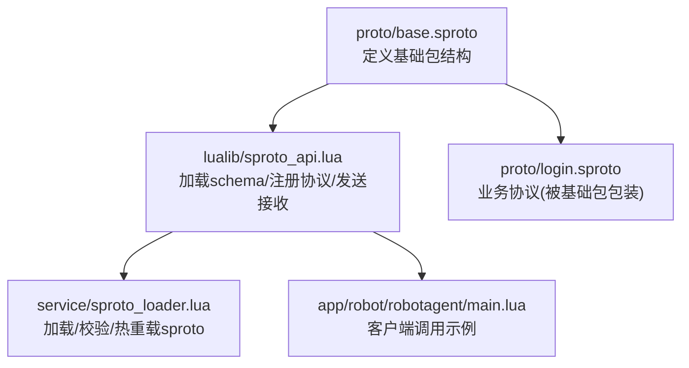
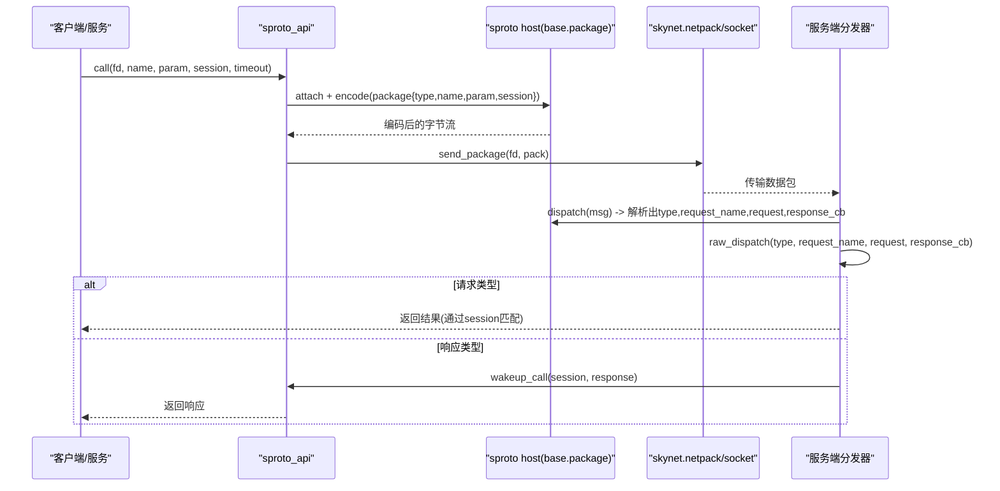
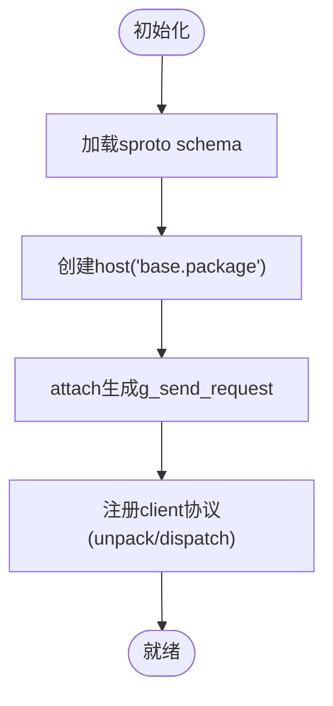
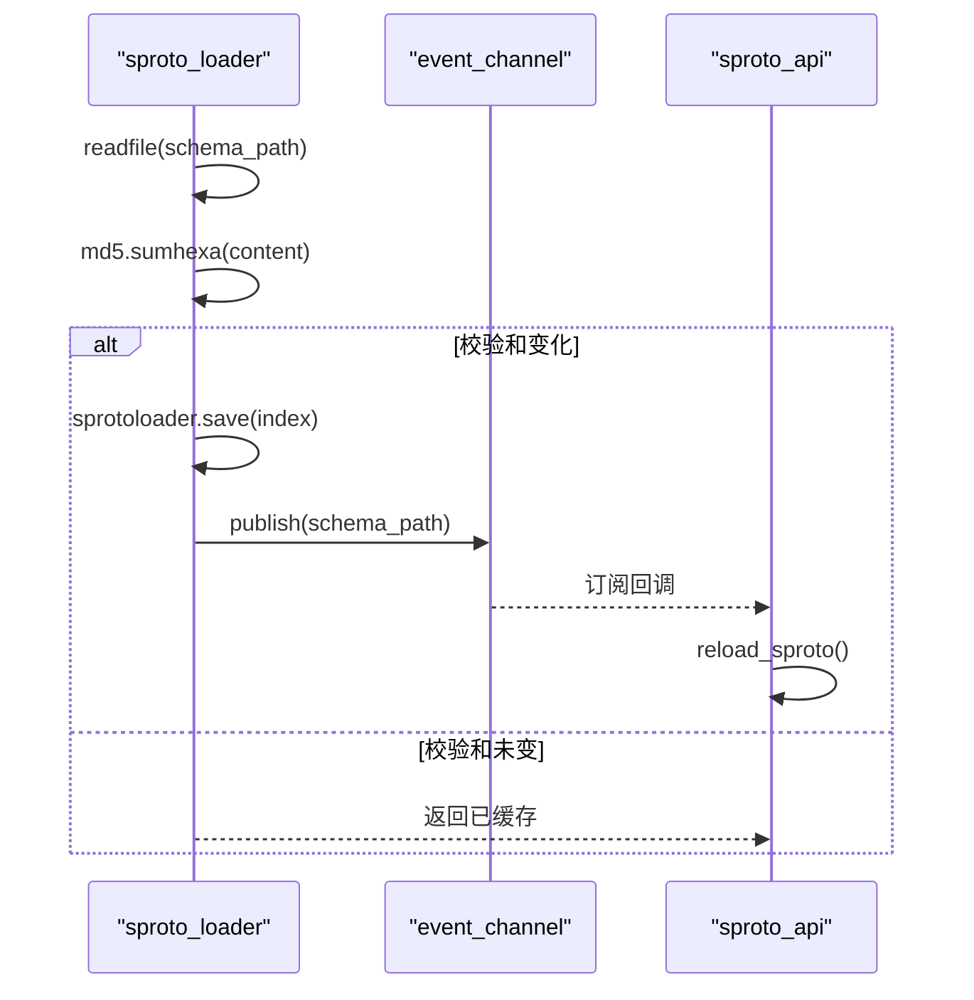
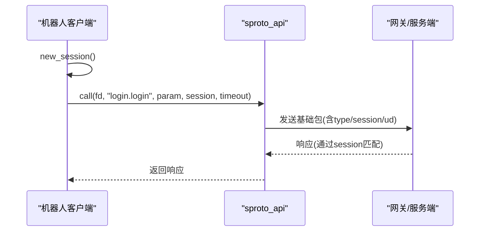
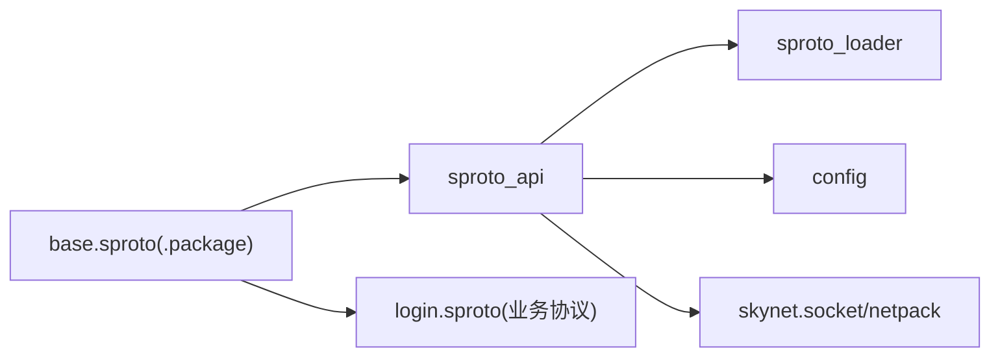

# 基础协议

<cite>
**本文引用的文件**
- [proto/base.sproto](file://proto/base.sproto)
- [lualib/sproto_api.lua](file://lualib/sproto_api.lua)
- [service/sproto_loader.lua](file://service/sproto_loader.lua)
- [app/robot/robotagent/main.lua](file://app/robot/robotagent/main.lua)
- [proto/login.sproto](file://proto/login.sproto)
</cite>

## 目录
1. [简介](#简介)
2. [项目结构](#项目结构)
3. [核心组件](#核心组件)
4. [架构总览](#架构总览)
5. [详细组件分析](#详细组件分析)
6. [依赖关系分析](#依赖关系分析)
7. [性能考虑](#性能考虑)
8. [故障排查指南](#故障排查指南)
9. [结论](#结论)
10. [附录](#附录)

## 简介
本章节面向 SkyExt 框架的基础协议，聚焦于 base.sproto 中定义的 .package 包结构及其在通信体系中的核心作用。该基础协议为所有业务协议提供统一的包装格式，包含消息类型、会话标识和用户数据等关键字段，确保请求与响应的可追踪、可路由和可扩展。

## 项目结构
- 协议定义位于 proto 目录，其中 base.sproto 定义了基础包结构；其他业务协议（如 login.sproto）通过该基础包进行统一封装。
- 运行时由 lualib/sproto_api.lua 负责加载 sproto schema、创建 host、注册协议分发器以及实现 call/notify 等高层接口。
- service/sproto_loader.lua 提供协议文件的读取、校验与热重载能力，并通过事件通道通知相关模块重新加载。
- app/robot/robotagent/main.lua 展示了客户端侧如何生成 session、发起 call/notify 并处理响应。

图表来源
- [proto/base.sproto:1-7](file://proto/base.sproto#L1-L7)
- [lualib/sproto_api.lua:118-196](file://lualib/sproto_api.lua#L118-L196)
- [service/sproto_loader.lua:19-59](file://service/sproto_loader.lua#L19-L59)
- [app/robot/robotagent/main.lua:20-27](file://app/robot/robotagent/main.lua#L20-L27)
- [proto/login.sproto:1-26](file://proto/login.sproto#L1-L26)

章节来源
- [proto/base.sproto:1-7](file://proto/base.sproto#L1-L7)
- [lualib/sproto_api.lua:118-196](file://lualib/sproto_api.lua#L118-L196)
- [service/sproto_loader.lua:19-59](file://service/sproto_loader.lua#L19-L59)
- [app/robot/robotagent/main.lua:20-27](file://app/robot/robotagent/main.lua#L20-L27)
- [proto/login.sproto:1-26](file://proto/login.sproto#L1-L26)

## 核心组件
- 基础包结构：.package { type, session, ud }，用于统一包装所有业务消息。
- sproto 主机与分发：sproto_api 通过 host("base.package") 创建编码器/解码器，并在 skynet 的 client 协议上注册 unpack/dispatch，将底层字节流解析为 type、request_name、request、response_cb。
- 会话管理：call 方法使用 session 字段作为请求-响应的关联键，内部维护 pending 表以等待响应或超时。
- 协议加载与热重载：sproto_loader 负责读取 schema、计算 checksum、保存二进制 schema，并通过事件通道触发 reload_sproto。

章节来源
- [proto/base.sproto:1-7](file://proto/base.sproto#L1-L7)
- [lualib/sproto_api.lua:118-196](file://lualib/sproto_api.lua#L118-L196)
- [service/sproto_loader.lua:19-59](file://service/sproto_loader.lua#L19-L59)

## 架构总览
基础协议在整个通信体系中的位置如下：
- 客户端或服务端通过 sproto_api.call/notify 发送消息，底层使用 g_send_request(name, param, session) 将业务消息包装为 base.package。
- 网络层通过 netpack.pack 打包后写入 socket。
- 对端收到后，由 skynet 的 client 协议的 unpack 调用 g_host:dispatch 解析出 type、request_name、request、response_cb。
- sproto_api.raw_dispatch 根据 type 分派到请求处理或响应唤醒流程。

图表来源
- [lualib/sproto_api.lua:81-159](file://lualib/sproto_api.lua#L81-L159)
- [lualib/sproto_api.lua:118-196](file://lualib/sproto_api.lua#L118-L196)

## 详细组件分析

### 基础包结构与字段说明
- type（消息类型）
  - 数据类型：integer
  - 取值范围：由 sproto 协议定义决定，常见包括 REQUEST、NOTIFY、RESPONSE 等语义类型（具体枚举值取决于上层实现）。
  - 默认值：无显式默认值，发送方必须设置。
  - 作用：区分请求、通知、响应等消息类别，驱动不同的处理分支。
- session（会话标识）
  - 数据类型：integer
  - 取值范围：正整数，通常单调递增或由全局计数器生成。
  - 默认值：无显式默认值，发送方必须设置。
  - 作用：唯一标识一次请求-响应对，用于服务端将响应回送到正确的协程/调用者。
- ud（用户数据）
  - 数据类型：integer
  - 取值范围：任意整型值，常用于透传上下文信息（如角色ID、区服ID、扩展标记等）。
  - 默认值：无显式默认值，可选字段。
  - 作用：在不改变业务协议的前提下，携带跨层上下文或调试信息。

章节来源
- [proto/base.sproto:1-7](file://proto/base.sproto#L1-L7)

### sproto_api 中的基础协议集成
- 初始化阶段：
  - 从配置获取 sproto schema 路径与索引，调用 sproto_loader 加载并缓存 schema。
  - 创建 host("base.package") 并 attach 生成 g_send_request，用于统一编码基础包。
- 协议注册：
  - 注册 skynet 的 client 协议，unpack 使用 g_host:dispatch 将原始字节流解析为 type、request_name、request、response_cb。
  - dispatch 回调进入 raw_dispatch，按 type 分派到请求处理或响应唤醒。
- 发送与等待：
  - notify 直接发送通知消息（无需等待响应）。
  - call 发送请求并记录 pending，基于 session 等待响应或超时。

图表来源
- [lualib/sproto_api.lua:169-196](file://lualib/sproto_api.lua#L169-L196)

章节来源
- [lualib/sproto_api.lua:118-196](file://lualib/sproto_api.lua#L118-L196)

### 协议加载与热重载
- sproto_loader 负责：
  - 读取 schema 文件内容并计算 MD5 校验和。
  - 若未变更则复用已加载的 schema；否则保存到二进制并更新缓存。
  - 通过事件通道发布 schema_path，触发 reload_sproto。
- reload_sproto：
  - 重新加载 schema，重建 host("base.package") 与 g_send_request，保证运行时协议变更生效。

图表来源
- [service/sproto_loader.lua:19-59](file://service/sproto_loader.lua#L19-L59)
- [lualib/sproto_api.lua:182-196](file://lualib/sproto_api.lua#L182-L196)

章节来源
- [service/sproto_loader.lua:19-59](file://service/sproto_loader.lua#L19-L59)
- [lualib/sproto_api.lua:182-196](file://lualib/sproto_api.lua#L182-L196)

### 客户端调用示例与最佳实践
- 会话生成：
  - 使用单调递增的计数器生成 session，避免冲突。
- 发送请求：
  - 调用 sproto_api.call(fd, name, param, session, timeout)，name 为“模块名.命令名”（如 login.login）。
- 处理响应：
  - 服务端通过 raw_dispatch 将响应唤醒对应协程，返回给调用方。
- 通知消息：
  - 使用 sproto_api.notify(fd, name, param) 发送单向通知，不等待响应。

图表来源
- [app/robot/robotagent/main.lua:20-27](file://app/robot/robotagent/main.lua#L20-L27)
- [lualib/sproto_api.lua:132-159](file://lualib/sproto_api.lua#L132-L159)

章节来源
- [app/robot/robotagent/main.lua:20-27](file://app/robot/robotagent/main.lua#L20-L27)
- [lualib/sproto_api.lua:132-159](file://lualib/sproto_api.lua#L132-L159)

## 依赖关系分析
- sproto_api 依赖：
  - skynet 的 socket/netpack 进行网络收发。
  - sproto_loader 提供的 schema 加载与热重载。
  - config 模块获取 sproto_schema_path、sproto_index、sproto_timeout 等配置。
- 基础包依赖：
  - 所有业务协议（如 login.sproto）通过 base.package 统一封装，确保一致的序列化/反序列化与路由机制。

图表来源
- [proto/base.sproto:1-7](file://proto/base.sproto#L1-L7)
- [lualib/sproto_api.lua:118-196](file://lualib/sproto_api.lua#L118-L196)
- [service/sproto_loader.lua:19-59](file://service/sproto_loader.lua#L19-L59)
- [proto/login.sproto:1-26](file://proto/login.sproto#L1-L26)

章节来源
- [lualib/sproto_api.lua:118-196](file://lualib/sproto_api.lua#L118-L196)
- [service/sproto_loader.lua:19-59](file://service/sproto_loader.lua#L19-L59)
- [proto/base.sproto:1-7](file://proto/base.sproto#L1-L7)
- [proto/login.sproto:1-26](file://proto/login.sproto#L1-L26)

## 性能考虑
- 序列化开销：基础包字段较少（type、session、ud），序列化/反序列化成本低，适合高频通信。
- 会话管理：pending 表以 session 为键，查找复杂度 O(1)；需确保 session 唯一且及时清理。
- 超时控制：call 支持超时，避免协程长期挂起；合理设置 sproto_timeout。
- 热重载：schema 变更时通过事件通道触发 reload，减少重启成本；注意校验和变化时的资源释放。

[本节为通用性能建议，不直接分析具体文件]

## 故障排查指南
- 协议加载失败：
  - 检查 sproto_schema_path 与 sproto_index 配置是否正确。
  - 查看 sproto_loader 的错误日志，确认 schema 文件可读且格式正确。
- 请求无响应：
  - 确认 session 是否唯一且未被重复使用。
  - 检查服务端是否正确通过 raw_dispatch 唤醒对应 pending。
  - 核对 sproto_timeout 是否过短导致提前超时。
- 中间件拦截：
  - 若注册了 middleware_cbs，确认回调未拒绝请求；错误会被记录并中断后续处理。

章节来源
- [lualib/sproto_api.lua:57-79](file://lualib/sproto_api.lua#L57-L79)
- [lualib/sproto_api.lua:136-159](file://lualib/sproto_api.lua#L136-L159)
- [service/sproto_loader.lua:19-59](file://service/sproto_loader.lua#L19-L59)

## 结论
基础协议 .package 是 SkyExt 通信体系的基石，通过统一的 type、session、ud 字段，实现了跨模块、跨服务的消息路由与会话管理。配合 sproto_api 的加载、分发与超时机制，以及 sproto_loader 的热重载能力，系统能够在保持高性能的同时具备良好的可维护性与扩展性。遵循本文的最佳实践，可有效提升协议使用的正确性与稳定性。

[本节为总结性内容，不直接分析具体文件]

## 附录
- 字段规范速查
  - type：integer，必填，区分请求/通知/响应等。
  - session：integer，必填，唯一会话标识，用于请求-响应关联。
  - ud：integer，可选，透传用户自定义上下文。
- 使用要点
  - 客户端侧生成单调递增的 session。
  - 服务端侧通过 raw_dispatch 将响应唤醒对应协程。
  - 合理配置 sproto_timeout，避免长时间阻塞。
  - 使用 sproto_loader 的热重载能力，实现协议变更零停机。

[本节为补充说明，不直接分析具体文件]