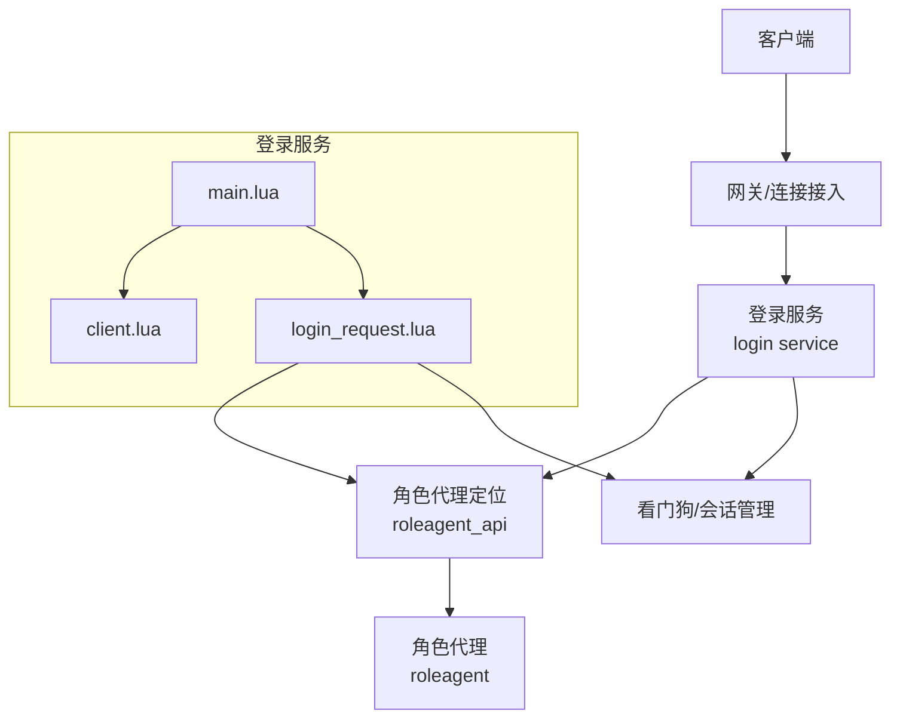
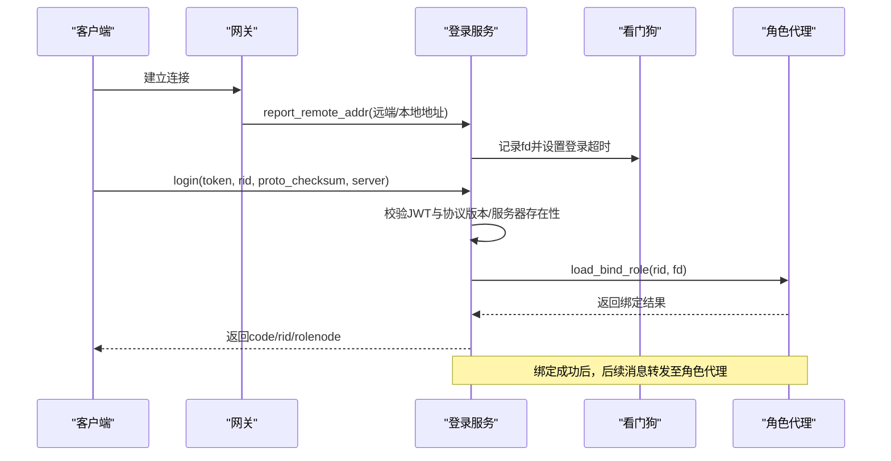
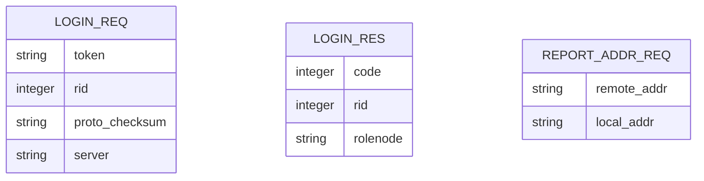
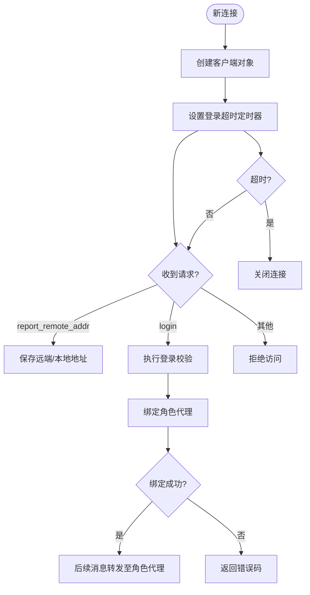
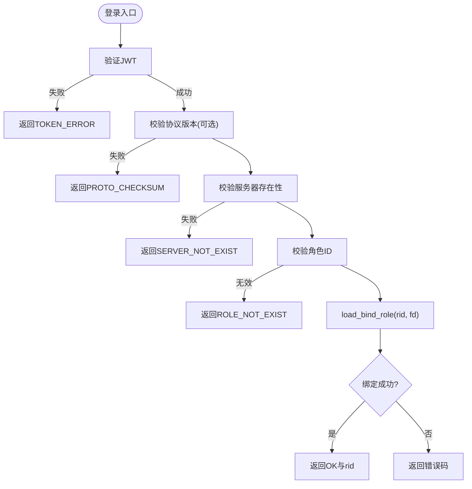
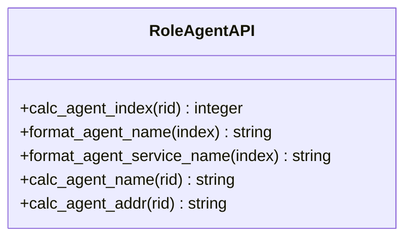
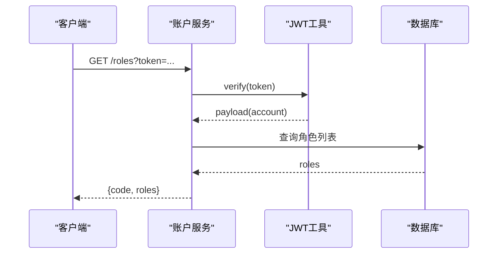
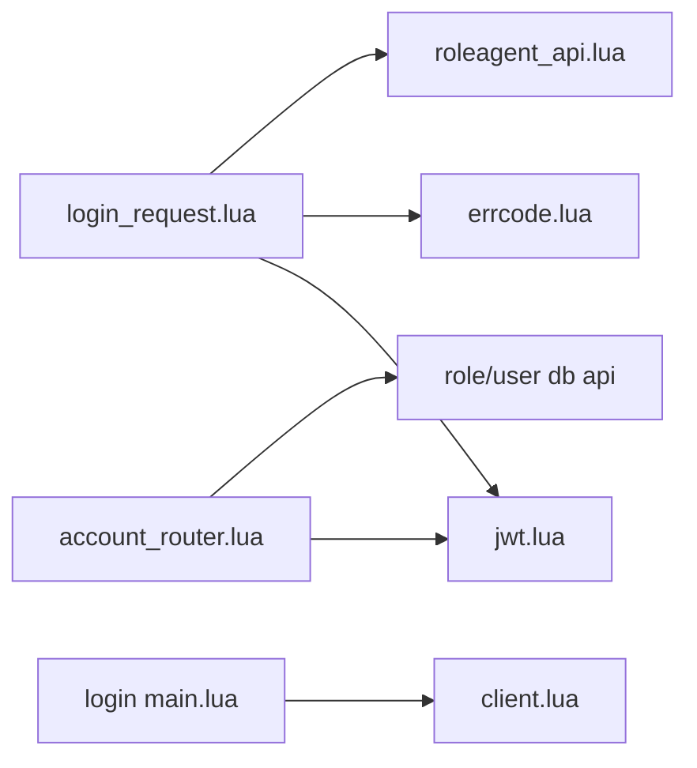
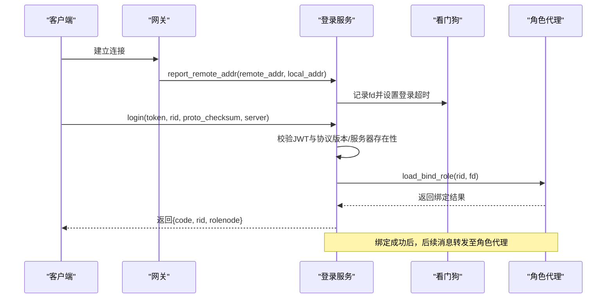

# 登录协议

<cite>
**本文引用的文件**
- [proto/login.sproto](file://proto/login.sproto)
- [app/role/login/main.lua](file://app/role/login/main.lua)
- [app/role/login/client.lua](file://app/role/login/client.lua)
- [app/role/login/login_request.lua](file://app/role/login/login_request.lua)
- [app/role/lualib/roleagent_api.lua](file://app/role/lualib/roleagent_api.lua)
- [lualib/jwt.lua](file://lualib/jwt.lua)
- [lualib/errcode.lua](file://lualib/errcode.lua)
- [app/account/main.lua](file://app/account/main.lua)
- [app/account/lualib/account_router.lua](file://app/account/lualib/account_router.lua)
</cite>

## 目录
1. [简介](#简介)
2. [项目结构](#项目结构)
3. [核心组件](#核心组件)
4. [架构总览](#架构总览)
5. [详细组件分析](#详细组件分析)
6. [依赖关系分析](#依赖关系分析)
7. [性能考虑](#性能考虑)
8. [故障排查指南](#故障排查指南)
9. [结论](#结论)
10. [附录](#附录)

## 简介
本文件为 SkyExt 框架的“登录协议”技术文档，聚焦于角色登录流程、消息定义、认证机制（JWT）、状态管理、错误码与异常处理策略，并提供完整的交互序列图与客户端集成要点。该协议用于客户端通过网关进入游戏服后，向登录服务发起角色登录请求，完成账号校验、协议版本校验、角色绑定与路由转发等关键步骤。

## 项目结构
登录相关代码主要分布在以下模块：
- 协议定义：proto/login.sproto
- 登录服务入口与生命周期：app/role/login/main.lua
- 连接与会话管理：app/role/login/client.lua
- 登录业务逻辑：app/role/login/login_request.lua
- 角色代理定位：app/role/lualib/roleagent_api.lua
- JWT 工具：lualib/jwt.lua
- 错误码：lualib/errcode.lua
- 账户服务（提供角色列表与创建）：app/account/main.lua、app/account/lualib/account_router.lua

**图示来源**
- [app/role/login/main.lua:15-36](file://app/role/login/main.lua#L15-L36)
- [app/role/login/client.lua:18-73](file://app/role/login/client.lua#L18-L73)
- [app/role/login/login_request.lua:17-110](file://app/role/login/login_request.lua#L17-L110)
- [app/role/lualib/roleagent_api.lua:21-45](file://app/role/lualib/roleagent_api.lua#L21-L45)

**章节来源**
- [proto/login.sproto:1-26](file://proto/login.sproto#L1-L26)
- [app/role/login/main.lua:15-36](file://app/role/login/main.lua#L15-L36)
- [app/role/login/client.lua:18-73](file://app/role/login/client.lua#L18-L73)
- [app/role/login/login_request.lua:17-110](file://app/role/login/login_request.lua#L17-L110)
- [app/role/lualib/roleagent_api.lua:21-45](file://app/role/lualib/roleagent_api.lua#L21-L45)

## 核心组件
- 协议层：基于 sproto 定义 login、logout、report_remote_addr 三类消息，包含请求与响应字段。
- 登录服务：负责接收并调度登录请求，进行 JWT 校验、协议版本校验、服务器存在性检查，并将 fd 绑定到目标角色代理。
- 会话管理：维护未认证连接的超时关闭、白名单接口放行、认证状态标记。
- 角色代理定位：根据角色 ID 计算并缓存角色代理名称与地址，实现跨节点路由。
- JWT 工具：提供 token 生成与验证，支持 HS256/HS512，校验签名与时间窗口。
- 错误码：集中定义登录流程中可能出现的错误码。
- 账户服务：提供基于 JWT 的角色查询与创建接口，辅助客户端获取可登录角色及所在节点信息。

**章节来源**
- [proto/login.sproto:1-26](file://proto/login.sproto#L1-L26)
- [app/role/login/login_request.lua:58-105](file://app/role/login/login_request.lua#L58-L105)
- [app/role/login/client.lua:18-73](file://app/role/login/client.lua#L18-L73)
- [app/role/lualib/roleagent_api.lua:7-45](file://app/role/lualib/roleagent_api.lua#L7-L45)
- [lualib/jwt.lua:17-100](file://lualib/jwt.lua#L17-L100)
- [lualib/errcode.lua:1-29](file://lualib/errcode.lua#L1-L29)
- [app/account/lualib/account_router.lua:24-59](file://app/account/lualib/account_router.lua#L24-L59)

## 架构总览
登录流程涉及客户端、登录服务、角色代理以及看门狗等组件。客户端先上报远端地址，再携带 JWT Token、角色 ID、协议校验和与区服标识发起登录；登录服务校验通过后，将连接绑定至对应角色代理，后续消息由角色代理接管。

**图示来源**
- [proto/login.sproto:1-26](file://proto/login.sproto#L1-L26)
- [app/role/login/login_request.lua:17-105](file://app/role/login/login_request.lua#L17-L105)
- [app/role/login/client.lua:33-47](file://app/role/login/client.lua#L33-L47)
- [app/role/lualib/roleagent_api.lua:31-45](file://app/role/lualib/roleagent_api.lua#L31-L45)

## 详细组件分析

### 协议定义（sproto）
- report_remote_addr：客户端上报远端与本地地址，便于服务端记录连接上下文。
- login：请求包含 token、rid、proto_checksum、server；响应包含 code、rid、rolenode。
- logout：触发登出流程，通常由登录服务关闭连接或转发至角色代理。

**图示来源**
- [proto/login.sproto:1-26](file://proto/login.sproto#L1-L26)

**章节来源**
- [proto/login.sproto:1-26](file://proto/login.sproto#L1-L26)

### 登录服务与连接管理
- 服务启动：注册模块与命令分发，初始化 watchdog 与 roleagentmgr 引用。
- 新连接：创建 client 对象，设置登录超时定时器，若超时未认证则关闭连接。
- 中间件鉴权：仅允许 login.login 与 login.report_remote_addr 在未认证状态下访问，其他请求需已认证。
- 断开处理：解绑 fd，清理会话。

**图示来源**
- [app/role/login/main.lua:15-36](file://app/role/login/main.lua#L15-L36)
- [app/role/login/client.lua:33-73](file://app/role/login/client.lua#L33-L73)
- [app/role/login/login_request.lua:58-105](file://app/role/login/login_request.lua#L58-L105)

**章节来源**
- [app/role/login/main.lua:15-36](file://app/role/login/main.lua#L15-L36)
- [app/role/login/client.lua:18-73](file://app/role/login/client.lua#L18-L73)

### 登录业务逻辑（JWT 校验、协议校验、角色绑定）
- JWT 校验：使用配置的密钥验证 token 的签名与有效期，失败返回 TOKEN_ERROR。
- 协议版本校验：可选开启，比较客户端传入的 proto_checksum 与服务端当前 sproto checksum，不一致返回 PROTO_CHECKSUM。
- 服务器存在性校验：校验 server 是否在配置映射中，不存在返回 SERVER_NOT_EXIST。
- 角色存在性校验：rid 必须为正整数，否则返回 ROLE_NOT_EXIST。
- 角色绑定：调用角色代理的 load_bind_role，成功后解绑登录服务并返回成功码与角色信息。

**图示来源**
- [app/role/login/login_request.lua:58-105](file://app/role/login/login_request.lua#L58-L105)
- [lualib/jwt.lua:17-67](file://lualib/jwt.lua#L17-L67)
- [lualib/errcode.lua:1-29](file://lualib/errcode.lua#L1-L29)

**章节来源**
- [app/role/login/login_request.lua:58-105](file://app/role/login/login_request.lua#L58-L105)
- [lualib/jwt.lua:17-67](file://lualib/jwt.lua#L17-L67)
- [lualib/errcode.lua:1-29](file://lualib/errcode.lua#L1-L29)

### 角色代理定位与路由
- 根据角色 ID 计算 agent 索引与名称，并缓存以避免重复查找。
- 解析实际服务地址，若不存在则报错，确保路由正确。
- 登录成功后，后续消息由角色代理接管，实现会话迁移。

**图示来源**
- [app/role/lualib/roleagent_api.lua:7-45](file://app/role/lualib/roleagent_api.lua#L7-L45)

**章节来源**
- [app/role/lualib/roleagent_api.lua:7-45](file://app/role/lualib/roleagent_api.lua#L7-L45)

### 账户服务与角色管理（辅助登录）
- GET /roles：基于 JWT 查询账号下的角色列表，并附加角色所在节点信息。
- POST /create_role：在限制范围内创建新角色，返回角色信息与所在节点。
- 这些接口帮助客户端在登录前获取可登录角色及其目标节点。

**图示来源**
- [app/account/lualib/account_router.lua:24-59](file://app/account/lualib/account_router.lua#L24-L59)
- [lualib/jwt.lua:17-67](file://lualib/jwt.lua#L17-L67)

**章节来源**
- [app/account/lualib/account_router.lua:24-59](file://app/account/lualib/account_router.lua#L24-L59)
- [app/account/main.lua:7-22](file://app/account/main.lua#L7-L22)

## 依赖关系分析
- 登录服务依赖：
  - sproto 协议定义（login.sproto）
  - JWT 工具（jwt.lua）
  - 错误码（errcode.lua）
  - 角色代理定位（roleagent_api.lua）
  - 看门狗（会话管理与超时控制）
- 账户服务依赖：
  - JWT 工具（jwt.lua）
  - 角色数据库 API（role_db_api）
  - 用户数据库 API（user_db_api）
  - 角色节点 API（rolenode_api）

**图示来源**
- [app/role/login/login_request.lua:1-110](file://app/role/login/login_request.lua#L1-L110)
- [app/role/login/main.lua:15-36](file://app/role/login/main.lua#L15-L36)
- [app/account/lualib/account_router.lua:1-143](file://app/account/lualib/account_router.lua#L1-L143)
- [lualib/jwt.lua:17-100](file://lualib/jwt.lua#L17-L100)
- [lualib/errcode.lua:1-29](file://lualib/errcode.lua#L1-L29)
- [app/role/lualib/roleagent_api.lua:7-45](file://app/role/lualib/roleagent_api.lua#L7-L45)

**章节来源**
- [app/role/login/login_request.lua:1-110](file://app/role/login/login_request.lua#L1-L110)
- [app/role/login/main.lua:15-36](file://app/role/login/main.lua#L15-L36)
- [app/account/lualib/account_router.lua:1-143](file://app/account/lualib/account_router.lua#L1-L143)
- [lualib/jwt.lua:17-100](file://lualib/jwt.lua#L17-L100)
- [lualib/errcode.lua:1-29](file://lualib/errcode.lua#L1-L29)
- [app/role/lualib/roleagent_api.lua:7-45](file://app/role/lualib/roleagent_api.lua#L7-L45)

## 性能考虑
- 登录超时控制：默认 60 秒，避免僵尸连接占用资源。
- 角色代理地址缓存：减少重复查找开销，提升路由效率。
- JWT 校验：轻量级 HMAC 校验，注意密钥安全与算法选择（HS256/HS512）。
- 协议版本校验：可选开关，防止客户端与服务端协议不匹配导致异常。
- 并发与限流：建议结合网关层对登录接口进行限流与防刷。

[本节为通用性能建议，无需特定文件引用]

## 故障排查指南
- TOKEN_ERROR：检查客户端 token 是否有效、是否过期、签名是否与服务器一致。
- PROTO_CHECKSUM：确认客户端与服务端 sproto 版本一致，必要时升级客户端。
- SERVER_NOT_EXIST：检查 server 参数是否在配置中存在。
- ROLE_NOT_EXIST：确认 rid 是否为正数且角色存在。
- 登录超时：检查客户端是否在超时时间内完成认证流程，必要时调整超时配置。
- 绑定失败：查看角色代理是否存在与负载情况，必要时重启或扩容角色代理。

**章节来源**
- [lualib/errcode.lua:1-29](file://lualib/errcode.lua#L1-L29)
- [app/role/login/login_request.lua:58-105](file://app/role/login/login_request.lua#L58-L105)
- [app/role/login/client.lua:33-47](file://app/role/login/client.lua#L33-L47)

## 结论
SkyExt 的登录协议以 sproto 为基础，结合 JWT 认证与角色代理路由，实现了安全、可扩展的角色登录流程。通过严格的错误码与异常处理策略，配合会话超时与协议版本校验，保障了系统的稳定性与一致性。客户端应遵循协议规范，合理处理错误码与重连逻辑，以获得良好的用户体验。

[本节为总结性内容，无需特定文件引用]

## 附录

### 登录交互序列图（完整）

**图示来源**
- [proto/login.sproto:1-26](file://proto/login.sproto#L1-L26)
- [app/role/login/login_request.lua:17-105](file://app/role/login/login_request.lua#L17-L105)
- [app/role/login/client.lua:33-47](file://app/role/login/client.lua#L33-L47)
- [app/role/lualib/roleagent_api.lua:31-45](file://app/role/lualib/roleagent_api.lua#L31-L45)

### 错误码定义
- OK：成功
- NOT_THIS_NODE：非当前游戏节点，自动切到对应的游戏节点
- IN_OTHER_NODE：角色已在其他游戏节点，弹提示稍后重试
- ROLE_NOT_EXIST：角色不存在
- LOCAK_FAILED：角色锁定服务失败，弹提示稍后重试
- ROLE_TOO_MANY：角色数量超过限制
- DB_ERROR：数据库操作错误
- TOKEN_ERROR：token 错误
- PROTO_CHECKSUM：proto_checksum 错误
- SERVER_NOT_EXIST：服务器不存在

**章节来源**
- [lualib/errcode.lua:1-29](file://lualib/errcode.lua#L1-L29)

### 客户端集成示例（步骤说明）
- 获取角色列表：调用账户服务的 GET /roles，携带 token 与可选 server，获取角色列表与所在节点。
- 创建角色：调用 POST /create_role，携带 token、server、name，创建新角色并获取所在节点。
- 登录角色：向登录服务发送 login 消息，包含 token、rid、proto_checksum、server。
- 处理响应：根据 code 判断是否成功；成功则后续消息转发至角色代理；失败则按错误码提示并重试或引导重新登录。
- 登出：调用 logout 或关闭连接，释放会话。

[本节为集成步骤说明，无需特定文件引用]