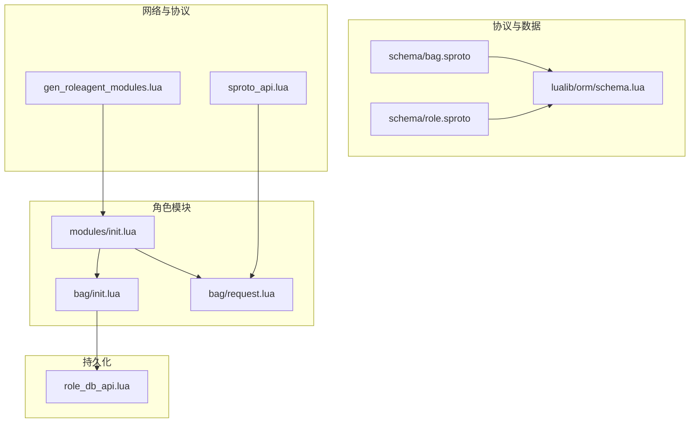
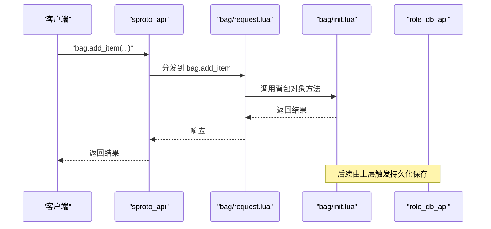
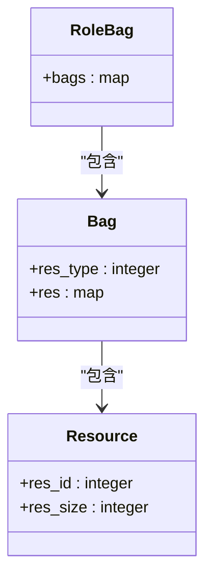
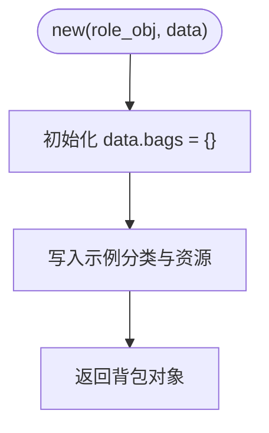
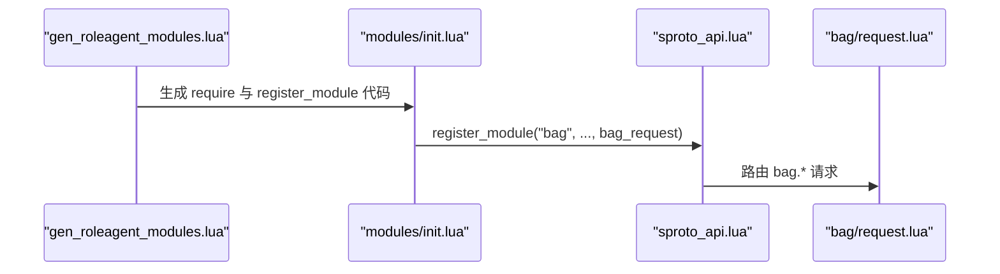
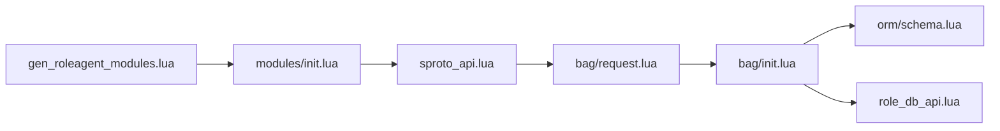

# 背包协议

<cite>
**本文引用的文件**
- [schema/bag.sproto](file://schema/bag.sproto)
- [lualib/orm/schema.lua](file://lualib/orm/schema.lua)
- [app/role/roleagent/modules/bag/init.lua](file://app/role/roleagent/modules/bag/init.lua)
- [app/role/roleagent/modules/bag/request.lua](file://app/role/roleagent/modules/bag/request.lua)
- [app/role/roleagent/modules/init.lua](file://app/role/roleagent/modules/init.lua)
- [tools/gen_roleagent_modules.lua](file://tools/gen_roleagent_modules.lua)
- [lualib/sproto_api.lua](file://lualib/sproto_api.lua)
- [schema/role.sproto](file://schema/role.sproto)
- [lualib/role_db_api.lua](file://lualib/role_db_api.lua)
</cite>

## 目录
1. [简介](#简介)
2. [项目结构](#项目结构)
3. [核心组件](#核心组件)
4. [架构总览](#架构总览)
5. [详细组件分析](#详细组件分析)
6. [依赖关系分析](#依赖关系分析)
7. [性能考量](#性能考量)
8. [故障排查指南](#故障排查指南)
9. [结论](#结论)
10. [附录：API 参考与扩展指南](#附录api-参考与扩展指南)

## 简介
本文件为 SkyExt 框架的“背包协议”提供完整技术文档。内容涵盖：
- 背包系统的数据模型（资源、分类、背包列表）
- 消息类型与请求处理机制（基于 sproto 模块注册与分发）
- 物品的增删改查操作、容量管理与属性定义
- 数据持久化、同步策略与冲突解决思路
- 完整的 API 参考与典型使用场景
- 扩展方法与自定义物品类型的实现指南

## 项目结构
与背包相关的代码主要分布在以下位置：
- 协议与数据模型定义：schema/bag.sproto、schema/role.sproto
- ORM 类型生成与校验：lualib/orm/schema.lua
- 角色模块加载与初始化：app/role/roleagent/modules/init.lua
- 背包模块实现：app/role/roleagent/modules/bag/init.lua、request.lua
- 协议路由与分发：lualib/sproto_api.lua
- 模块自动发现与代码生成：tools/gen_roleagent_modules.lua
- 角色数据持久化接口：lualib/role_db_api.lua

图表来源
- [schema/bag.sproto:1-16](file://schema/bag.sproto#L1-L16)
- [schema/role.sproto:1-24](file://schema/role.sproto#L1-L24)
- [lualib/orm/schema.lua:187-379](file://lualib/orm/schema.lua#L187-L379)
- [app/role/roleagent/modules/init.lua:1-36](file://app/role/roleagent/modules/init.lua#L1-L36)
- [app/role/roleagent/modules/bag/init.lua:1-27](file://app/role/roleagent/modules/bag/init.lua#L1-L27)
- [app/role/roleagent/modules/bag/request.lua:1-4](file://app/role/roleagent/modules/bag/request.lua#L1-L4)
- [lualib/sproto_api.lua:1-199](file://lualib/sproto_api.lua#L1-L199)
- [tools/gen_roleagent_modules.lua:1-130](file://tools/gen_roleagent_modules.lua#L1-L130)
- [lualib/role_db_api.lua:1-85](file://lualib/role_db_api.lua#L1-L85)

章节来源
- [schema/bag.sproto:1-16](file://schema/bag.sproto#L1-L16)
- [schema/role.sproto:1-24](file://schema/role.sproto#L1-L24)
- [lualib/orm/schema.lua:187-379](file://lualib/orm/schema.lua#L187-L379)
- [app/role/roleagent/modules/init.lua:1-36](file://app/role/roleagent/modules/init.lua#L1-L36)
- [app/role/roleagent/modules/bag/init.lua:1-27](file://app/role/roleagent/modules/bag/init.lua#L1-L27)
- [app/role/roleagent/modules/bag/request.lua:1-4](file://app/role/roleagent/modules/bag/request.lua#L1-L4)
- [lualib/sproto_api.lua:1-199](file://lualib/sproto_api.lua#L1-L199)
- [tools/gen_roleagent_modules.lua:1-130](file://tools/gen_roleagent_modules.lua#L1-L130)
- [lualib/role_db_api.lua:1-85](file://lualib/role_db_api.lua#L1-L85)

## 核心组件
- 数据模型
  - role_bag：包含 bags 列表，bags 是 res_type -> bag 的映射
  - bag：包含 res_type 和 res（res_id -> resource 的映射）
  - resource：包含 res_id 与 res_size
- 模块加载
  - modules/init.lua 通过自动生成脚本扫描并注册各模块（包括 bag）
  - 在 load 阶段为每个角色实例创建 bag 模块对象
- 协议路由
  - sproto_api 负责将客户端请求按 mod.cmd 形式分发到对应模块的请求处理器
  - 模块通过 register_module 暴露请求函数
- 持久化
  - 角色数据通过 role_db_api 与 MongoDB 交互，角色对象包含 modules 字段，其中 bag 作为子模块存储

章节来源
- [schema/bag.sproto:1-16](file://schema/bag.sproto#L1-L16)
- [lualib/orm/schema.lua:187-379](file://lualib/orm/schema.lua#L187-L379)
- [app/role/roleagent/modules/init.lua:1-36](file://app/role/roleagent/modules/init.lua#L1-L36)
- [lualib/sproto_api.lua:1-199](file://lualib/sproto_api.lua#L1-L199)
- [lualib/role_db_api.lua:1-85](file://lualib/role_db_api.lua#L1-L85)

## 架构总览
背包系统基于 Skynet 的角色代理（roleagent）架构，采用模块化设计：
- 客户端通过 sproto 协议发送 bag.* 请求
- sproto_api 根据请求名分发给 bag.request 中的处理器
- 处理器调用 bag.init 中维护的背包数据对象进行增删改查
- 变更后的数据随角色数据一起持久化到数据库

图表来源
- [lualib/sproto_api.lua:1-199](file://lualib/sproto_api.lua#L1-L199)
- [app/role/roleagent/modules/bag/request.lua:1-4](file://app/role/roleagent/modules/bag/request.lua#L1-L4)
- [app/role/roleagent/modules/bag/init.lua:1-27](file://app/role/roleagent/modules/bag/init.lua#L1-L27)
- [lualib/role_db_api.lua:1-85](file://lualib/role_db_api.lua#L1-L85)

## 详细组件分析

### 数据模型与 ORM
- role_bag.bags：以 res_type 为键的表，值为 bag 对象
- bag.res_type：整数，表示资源分类
- bag.res：以 res_id 为键的表，值为 resource 对象
- resource.res_id：整数，资源标识
- resource.res_size：整数，资源数量

ORM 层对以上结构进行了类型约束与解析支持，确保数据一致性。

图表来源
- [schema/bag.sproto:1-16](file://schema/bag.sproto#L1-L16)
- [lualib/orm/schema.lua:187-379](file://lualib/orm/schema.lua#L187-L379)

章节来源
- [schema/bag.sproto:1-16](file://schema/bag.sproto#L1-L16)
- [lualib/orm/schema.lua:187-379](file://lualib/orm/schema.lua#L187-L379)

### 背包模块初始化与数据结构
- 模块在 new(role_obj, data) 时初始化 data.bags，并预置一个示例分类与资源
- 该对象持有 role_obj 引用，便于后续访问角色上下文

图表来源
- [app/role/roleagent/modules/bag/init.lua:1-27](file://app/role/roleagent/modules/bag/init.lua#L1-L27)

章节来源
- [app/role/roleagent/modules/bag/init.lua:1-27](file://app/role/roleagent/modules/bag/init.lua#L1-L27)

### 协议注册与请求分发
- 模块自动发现：gen_roleagent_modules.lua 扫描 modules 目录，为每个含 request.lua 的子目录生成注册代码
- 运行时：modules/init.lua 调用 sproto_api.register_module("bag", client, bag_request)
- 请求分发：sproto_api 将 bag.* 请求路由到 bag/request.lua 中的函数

图表来源
- [tools/gen_roleagent_modules.lua:1-130](file://tools/gen_roleagent_modules.lua#L1-L130)
- [app/role/roleagent/modules/init.lua:1-36](file://app/role/roleagent/modules/init.lua#L1-L36)
- [lualib/sproto_api.lua:1-199](file://lualib/sproto_api.lua#L1-L199)
- [app/role/roleagent/modules/bag/request.lua:1-4](file://app/role/roleagent/modules/bag/request.lua#L1-L4)

章节来源
- [tools/gen_roleagent_modules.lua:1-130](file://tools/gen_roleagent_modules.lua#L1-L130)
- [app/role/roleagent/modules/init.lua:1-36](file://app/role/roleagent/modules/init.lua#L1-L36)
- [lualib/sproto_api.lua:1-199](file://lualib/sproto_api.lua#L1-L199)
- [app/role/roleagent/modules/bag/request.lua:1-4](file://app/role/roleagent/modules/bag/request.lua#L1-L4)

### 物品增删改查与容量管理
当前仓库未提供 bag/request.lua 的具体实现，因此无法给出确切的 API 行为。建议的实现要点：
- 增加物品：根据 res_type 定位 bag，再在 bag.res 中以 res_id 累加或新增 resource
- 删除物品：减少 res_size，若小于等于 0 则移除该条目
- 修改物品：直接更新 res_size
- 查询物品：读取 bag.res[res_id] 获取数量
- 容量管理：可在 bag 或全局配置中定义每类资源的最大容量；在增删改时进行校验与拒绝非法操作

注意：上述为通用实现建议，具体逻辑需在 bag/request.lua 中补充实现。

章节来源
- [app/role/roleagent/modules/bag/request.lua:1-4](file://app/role/roleagent/modules/bag/request.lua#L1-L4)
- [schema/bag.sproto:1-16](file://schema/bag.sproto#L1-L16)

### 持久化机制、同步策略与冲突解决
- 持久化
  - 角色数据通过 role_db_api 与 MongoDB 交互，角色对象包含 modules 字段，bag 作为子模块嵌入
  - 建议在每次背包变更后触发保存，或在定时任务中批量落库
- 同步策略
  - 服务端为权威源，客户端仅展示；所有变更在服务端完成后再推送给客户端
  - 可使用 sproto_api.notify 向客户端推送背包状态变化
- 冲突解决
  - 当前角色数据包含 _version 字段，可用于乐观锁：保存前比较版本，不一致则拒绝或合并
  - 对于并发修改，可结合分布式锁或队列串行化处理

章节来源
- [schema/role.sproto:1-24](file://schema/role.sproto#L1-L24)
- [lualib/role_db_api.lua:1-85](file://lualib/role_db_api.lua#L1-L85)
- [lualib/sproto_api.lua:1-199](file://lualib/sproto_api.lua#L1-L199)

## 依赖关系分析
- 模块自动发现依赖 tools/gen_roleagent_modules.lua 生成的 modules/init.lua
- 协议路由依赖 lualib/sproto_api.lua 的 register_module 与 dispatch
- 数据模型依赖 schema/*.sproto 与 lualib/orm/schema.lua 的类型约束
- 持久化依赖 lualib/role_db_api.lua 与 MongoDB

图表来源
- [tools/gen_roleagent_modules.lua:1-130](file://tools/gen_roleagent_modules.lua#L1-L130)
- [app/role/roleagent/modules/init.lua:1-36](file://app/role/roleagent/modules/init.lua#L1-L36)
- [lualib/sproto_api.lua:1-199](file://lualib/sproto_api.lua#L1-L199)
- [app/role/roleagent/modules/bag/request.lua:1-4](file://app/role/roleagent/modules/bag/request.lua#L1-L4)
- [app/role/roleagent/modules/bag/init.lua:1-27](file://app/role/roleagent/modules/bag/init.lua#L1-L27)
- [lualib/orm/schema.lua:187-379](file://lualib/orm/schema.lua#L187-L379)
- [lualib/role_db_api.lua:1-85](file://lualib/role_db_api.lua#L1-L85)

章节来源
- [tools/gen_roleagent_modules.lua:1-130](file://tools/gen_roleagent_modules.lua#L1-L130)
- [app/role/roleagent/modules/init.lua:1-36](file://app/role/roleagent/modules/init.lua#L1-L36)
- [lualib/sproto_api.lua:1-199](file://lualib/sproto_api.lua#L1-L199)
- [app/role/roleagent/modules/bag/request.lua:1-4](file://app/role/roleagent/modules/bag/request.lua#L1-L4)
- [app/role/roleagent/modules/bag/init.lua:1-27](file://app/role/roleagent/modules/bag/init.lua#L1-L27)
- [lualib/orm/schema.lua:187-379](file://lualib/orm/schema.lua#L187-L379)
- [lualib/role_db_api.lua:1-85](file://lualib/role_db_api.lua#L1-L85)

## 性能考量
- 数据结构选择
  - 使用 res_id -> resource 的映射表，查找与更新复杂度接近 O(1)
- 批量操作
  - 建议将多次增删改合并为一次保存，减少数据库写放大
- 容量校验
  - 在内存中进行容量检查，避免无效的网络往返
- 异步持久化
  - 使用定时器或事件驱动批量落库，降低主路径延迟

[本节为通用指导，不直接分析具体文件]

## 故障排查指南
- 协议未注册
  - 检查 modules/init.lua 是否正确调用 register_module("bag", ...)
  - 确认 gen_roleagent_modules.lua 已正确扫描到 bag 模块
- 请求无响应
  - 检查 bag/request.lua 是否实现了对应的请求函数
  - 查看 sproto_api 的分发日志，确认请求名匹配
- 数据不一致
  - 检查 ORM 类型约束是否符合 schema/bag.sproto
  - 确认持久化流程是否成功，必要时加入重试与回滚
- 版本冲突
  - 使用 _version 字段进行乐观锁校验，失败时提示客户端刷新

章节来源
- [app/role/roleagent/modules/init.lua:1-36](file://app/role/roleagent/modules/init.lua#L1-L36)
- [tools/gen_roleagent_modules.lua:1-130](file://tools/gen_roleagent_modules.lua#L1-L130)
- [lualib/sproto_api.lua:1-199](file://lualib/sproto_api.lua#L1-L199)
- [schema/bag.sproto:1-16](file://schema/bag.sproto#L1-L16)
- [lualib/role_db_api.lua:1-85](file://lualib/role_db_api.lua#L1-L85)

## 结论
SkyExt 的背包系统采用清晰的模块化设计与强类型数据模型，通过 sproto 协议进行通信，配合 ORM 与数据库持久化，具备良好的可扩展性与可维护性。当前仓库提供了数据模型与模块骨架，具体的物品操作 API 需在 bag/request.lua 中实现。建议完善请求处理、容量校验、持久化与同步策略，以满足生产环境需求。

[本节为总结，不直接分析具体文件]

## 附录：API 参考与扩展指南

### 数据模型参考
- role_bag
  - bags：map<integer, bag>，以资源分类为键
- bag
  - res_type：integer，资源分类
  - res：map<integer, resource>，以资源 ID 为键
- resource
  - res_id：integer，资源标识
  - res_size：integer，资源数量

章节来源
- [schema/bag.sproto:1-16](file://schema/bag.sproto#L1-L16)
- [lualib/orm/schema.lua:187-379](file://lualib/orm/schema.lua#L187-L379)

### 典型使用场景
- 玩家获得物品
  - 客户端发送 bag.add_item(res_type, res_id, amount)
  - 服务端校验容量与合法性，更新 bag.res[res_id].res_size
  - 推送更新通知给客户端
- 玩家消耗物品
  - 客户端发送 bag.consume_item(res_type, res_id, amount)
  - 服务端减少数量，若不足则拒绝
  - 推送更新通知给客户端
- 查询背包
  - 客户端发送 bag.get_items(res_type)
  - 服务端返回该分类下的资源列表

注意：上述为建议的 API 形态，需在 bag/request.lua 中实现具体函数。

章节来源
- [app/role/roleagent/modules/bag/request.lua:1-4](file://app/role/roleagent/modules/bag/request.lua#L1-L4)
- [lualib/sproto_api.lua:1-199](file://lualib/sproto_api.lua#L1-L199)

### 扩展方法与自定义物品类型
- 新增资源分类
  - 在 bag.res_type 中定义新的分类值
  - 在业务配置中定义该分类的容量上限与规则
- 自定义物品属性
  - 可在 resource 基础上扩展额外字段（需同步更新 schema 与 ORM）
  - 在 ORM 层添加字段校验与解析逻辑
- 新增请求接口
  - 在 bag/request.lua 中添加新函数并通过 register_module 暴露
  - 遵循 sproto_api 的请求分发约定

章节来源
- [schema/bag.sproto:1-16](file://schema/bag.sproto#L1-L16)
- [lualib/orm/schema.lua:187-379](file://lualib/orm/schema.lua#L187-L379)
- [app/role/roleagent/modules/init.lua:1-36](file://app/role/roleagent/modules/init.lua#L1-L36)
- [lualib/sproto_api.lua:1-199](file://lualib/sproto_api.lua#L1-L199)