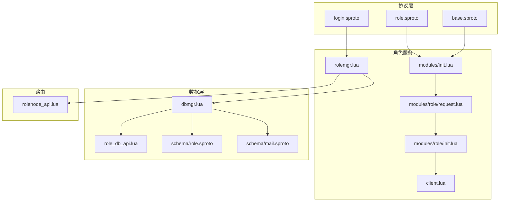
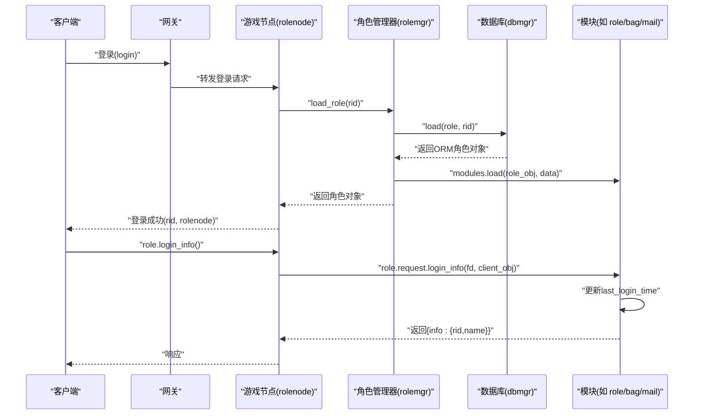
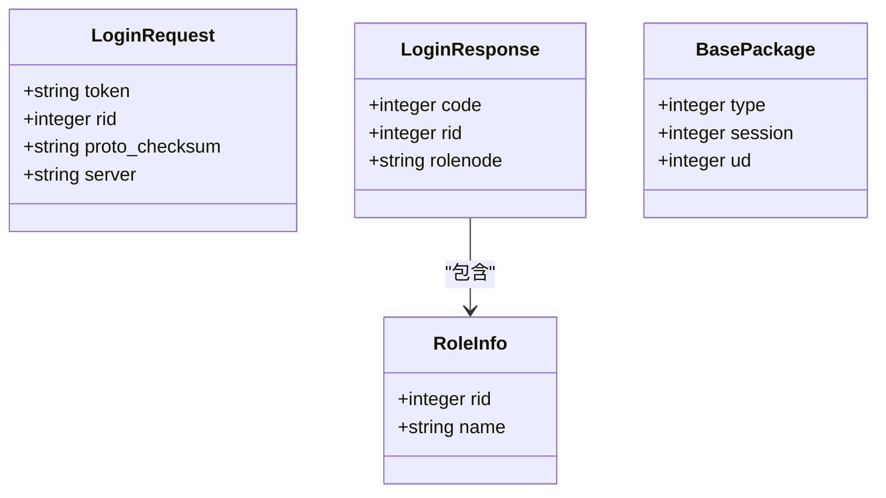
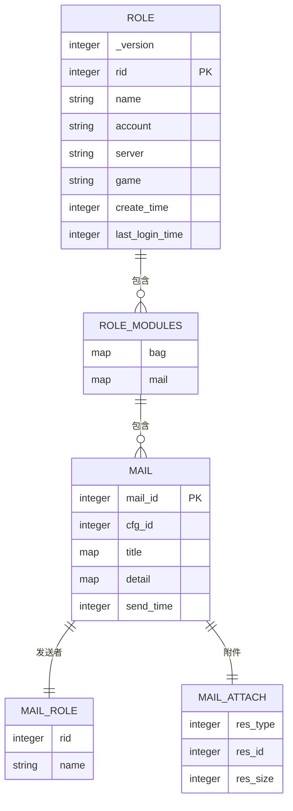
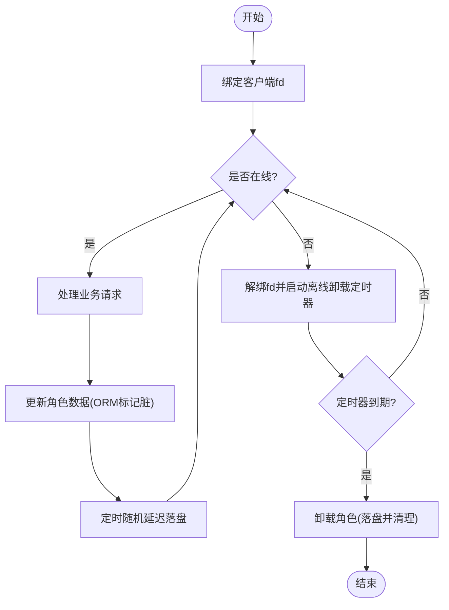
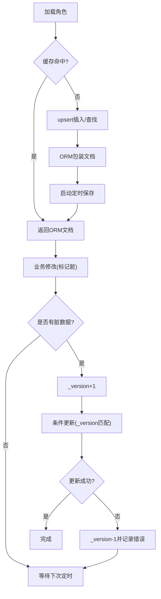
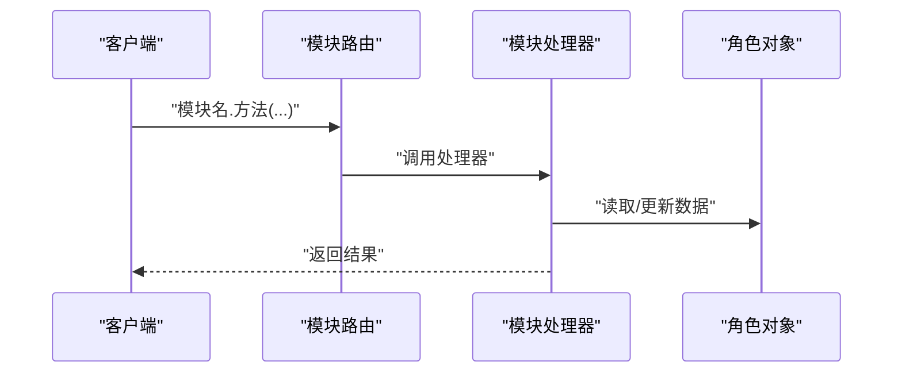
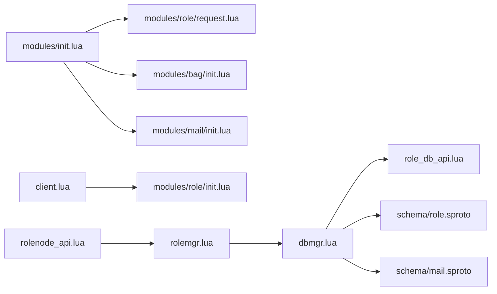

# 角色协议

<cite>
**本文引用的文件**
- [proto/roleagent/role.sproto](file://proto/roleagent/role.sproto)
- [schema/role.sproto](file://schema/role.sproto)
- [app/role/roleagent/modules/role/request.lua](file://app/role/roleagent/modules/role/request.lua)
- [app/role/roleagent/modules/role/init.lua](file://app/role/roleagent/modules/role/init.lua)
- [app/role/roleagent/modules/init.lua](file://app/role/roleagent/modules/init.lua)
- [app/role/roleagent/client.lua](file://app/role/roleagent/client.lua)
- [app/role/roleagent/rolemgr.lua](file://app/role/roleagent/rolemgr.lua)
- [lualib/dbmgr.lua](file://lualib/dbmgr.lua)
- [lualib/role_db_api.lua](file://lualib/role_db_api.lua)
- [lualib/rolenode_api.lua](file://lualib/rolenode_api.lua)
- [proto/login.sproto](file://proto/login.sproto)
- [proto/base.sproto](file://proto/base.sproto)
- [schema/mail.sproto](file://schema/mail.sproto)
</cite>

## 目录
1. [简介](#简介)
2. [项目结构](#项目结构)
3. [核心组件](#核心组件)
4. [架构总览](#架构总览)
5. [详细组件分析](#详细组件分析)
6. [依赖关系分析](#依赖关系分析)
7. [性能考虑](#性能考虑)
8. [故障排查指南](#故障排查指南)
9. [结论](#结论)
10. [附录：API 参考与使用示例](#附录api-参考与使用示例)

## 简介
本文件为 SkyExt 框架中“角色协议”的完整技术文档，聚焦角色相关的消息类型、数据模型、操作接口与生命周期管理。内容覆盖：
- 角色登录、查询等协议定义与调用流程
- 角色对象在内存中的创建、绑定/解绑客户端连接、离线卸载
- 角色数据的持久化、版本控制与增量保存
- 模块（背包、邮件等）在角色数据中的组织方式
- 序列化格式、版本兼容性与迁移策略建议
- 完整的 API 参考与使用示例
- 性能优化建议与调试方法

## 项目结构
围绕角色协议的核心代码分布在以下位置：
- 协议定义：proto/roleagent/role.sproto、proto/login.sproto、proto/base.sproto
- 数据模型：schema/role.sproto、schema/mail.sproto
- 角色服务：app/role/roleagent/*（角色管理器、客户端绑定、模块路由）
- 数据访问：lualib/dbmgr.lua、lualib/role_db_api.lua
- 节点路由：lualib/rolenode_api.lua

**图示来源**
- [proto/login.sproto:1-26](file://proto/login.sproto#L1-L26)
- [proto/roleagent/role.sproto:1-13](file://proto/roleagent/role.sproto#L1-L13)
- [proto/base.sproto:1-7](file://proto/base.sproto#L1-L7)
- [app/role/roleagent/modules/init.lua:1-35](file://app/role/roleagent/modules/init.lua#L1-L35)
- [app/role/roleagent/modules/role/request.lua:1-32](file://app/role/roleagent/modules/role/request.lua#L1-L32)
- [app/role/roleagent/modules/role/init.lua:1-41](file://app/role/roleagent/modules/role/init.lua#L1-L41)
- [app/role/roleagent/client.lua:1-50](file://app/role/roleagent/client.lua#L1-L50)
- [app/role/roleagent/rolemgr.lua:1-59](file://app/role/roleagent/rolemgr.lua#L1-L59)
- [lualib/dbmgr.lua:1-219](file://lualib/dbmgr.lua#L1-L219)
- [lualib/role_db_api.lua:1-85](file://lualib/role_db_api.lua#L1-L85)
- [schema/role.sproto:1-24](file://schema/role.sproto#L1-L24)
- [schema/mail.sproto:1-36](file://schema/mail.sproto#L1-L36)

**章节来源**
- [proto/login.sproto:1-26](file://proto/login.sproto#L1-L26)
- [proto/roleagent/role.sproto:1-13](file://proto/roleagent/role.sproto#L1-L13)
- [proto/base.sproto:1-7](file://proto/base.sproto#L1-L7)
- [schema/role.sproto:1-24](file://schema/role.sproto#L1-L24)
- [schema/mail.sproto:1-36](file://schema/mail.sproto#L1-L36)
- [app/role/roleagent/modules/init.lua:1-35](file://app/role/roleagent/modules/init.lua#L1-L35)
- [app/role/roleagent/modules/role/request.lua:1-32](file://app/role/roleagent/modules/role/request.lua#L1-L32)
- [app/role/roleagent/modules/role/init.lua:1-41](file://app/role/roleagent/modules/role/init.lua#L1-L41)
- [app/role/roleagent/client.lua:1-50](file://app/role/roleagent/client.lua#L1-L50)
- [app/role/roleagent/rolemgr.lua:1-59](file://app/role/roleagent/rolemgr.lua#L1-L59)
- [lualib/dbmgr.lua:1-219](file://lualib/dbmgr.lua#L1-L219)
- [lualib/role_db_api.lua:1-85](file://lualib/role_db_api.lua#L1-L85)
- [lualib/rolenode_api.lua:1-17](file://lualib/rolenode_api.lua#L1-L17)

## 核心组件
- 角色协议消息
  - 登录信息请求/响应：用于返回角色基本信息（rid、name）
  - 登录/登出：网关到游戏节点的登录握手与退出
  - 基础包体：统一的消息头字段
- 角色数据模型
  - 角色主表：包含 rid、name、account、server、game、时间戳、模块聚合等
  - 模块聚合：bag、mail 等子模块以嵌套结构存储
- 角色生命周期管理
  - 加载：从数据库加载并封装 ORM 对象，挂载模块
  - 绑定/解绑：绑定/解绑客户端 fd，触发离线卸载定时器
  - 卸载：定时或显式触发，落盘后清理内存
- 数据持久化与版本控制
  - 基于 ORM 的脏标记与增量更新
  - 乐观锁版本号 _version，防止并发写冲突
  - 定时随机延迟落盘，降低写入抖动
- 模块系统
  - 自动注册模块路由，按模块名分发请求
  - 模块初始化时注入默认数据（如背包初始资源）

**章节来源**
- [proto/roleagent/role.sproto:1-13](file://proto/roleagent/role.sproto#L1-L13)
- [proto/login.sproto:1-26](file://proto/login.sproto#L1-L26)
- [proto/base.sproto:1-7](file://proto/base.sproto#L1-L7)
- [schema/role.sproto:1-24](file://schema/role.sproto#L1-L24)
- [schema/mail.sproto:1-36](file://schema/mail.sproto#L1-L36)
- [app/role/roleagent/modules/init.lua:1-35](file://app/role/roleagent/modules/init.lua#L1-L35)
- [app/role/roleagent/modules/role/init.lua:1-41](file://app/role/roleagent/modules/role/init.lua#L1-L41)
- [app/role/roleagent/client.lua:1-50](file://app/role/roleagent/client.lua#L1-L50)
- [app/role/roleagent/rolemgr.lua:1-59](file://app/role/roleagent/rolemgr.lua#L1-L59)
- [lualib/dbmgr.lua:1-219](file://lualib/dbmgr.lua#L1-L219)

## 架构总览
角色协议的整体交互流程如下：
- 客户端通过网关发起登录，网关根据 token、rid、server 等信息将请求转发至目标游戏节点
- 游戏节点校验后，加载角色数据，建立角色对象，绑定客户端 fd
- 业务模块（如 role、bag、mail）处理具体请求，修改角色数据
- 数据变更通过 ORM 标记脏状态，定时任务批量落盘；角色下线时强制落盘
- 角色数据采用 schema 定义的序列化格式，配合 _version 实现并发安全

**图示来源**
- [proto/login.sproto:10-22](file://proto/login.sproto#L10-L22)
- [proto/roleagent/role.sproto:7-12](file://proto/roleagent/role.sproto#L7-L12)
- [app/role/roleagent/rolemgr.lua:15-25](file://app/role/roleagent/rolemgr.lua#L15-L25)
- [lualib/dbmgr.lua:94-148](file://lualib/dbmgr.lua#L94-L148)
- [app/role/roleagent/modules/role/request.lua:7-29](file://app/role/roleagent/modules/role/request.lua#L7-L29)

## 详细组件分析

### 角色协议消息与数据结构
- 角色登录信息
  - 请求：空
  - 响应：包含角色信息（rid、name）
- 登录/登出
  - 登录请求：token、rid、proto_checksum、server
  - 登录响应：code、rid、rolenode
  - 登出：无参
- 基础包体
  - type、session、ud

**图示来源**
- [proto/roleagent/role.sproto:1-12](file://proto/roleagent/role.sproto#L1-L12)
- [proto/login.sproto:10-22](file://proto/login.sproto#L10-L22)
- [proto/base.sproto:1-7](file://proto/base.sproto#L1-L7)

**章节来源**
- [proto/roleagent/role.sproto:1-13](file://proto/roleagent/role.sproto#L1-L13)
- [proto/login.sproto:1-26](file://proto/login.sproto#L1-L26)
- [proto/base.sproto:1-7](file://proto/base.sproto#L1-L7)

### 角色数据模型与序列化
- 角色主结构
  - 字段：_version、rid、name、account、server、game、create_time、last_login_time、modules
- 模块聚合
  - bag：资源列表
  - mail：邮件列表
- 邮件模块
  - 邮件项：mail_id、cfg_id、title、detail、send_time、send_role、attach
  - 附件：res_type、res_id、res_size
  - 发送者：rid、name

**图示来源**
- [schema/role.sproto:1-24](file://schema/role.sproto#L1-L24)
- [schema/mail.sproto:1-36](file://schema/mail.sproto#L1-L36)

**章节来源**
- [schema/role.sproto:1-24](file://schema/role.sproto#L1-L24)
- [schema/mail.sproto:1-36](file://schema/mail.sproto#L1-L36)

### 角色生命周期管理
- 创建与加载
  - 通过角色管理器加载角色数据，构造角色对象，并初始化模块
- 绑定/解绑客户端
  - 绑定：记录 fd，取消离线卸载定时器
  - 解绑：设置 fd 为空，启动离线卸载定时器
- 卸载与落盘
  - 显式卸载或定时器触发时，先取消定时存盘，再执行最终落盘，最后清理内存

**图示来源**
- [app/role/roleagent/modules/role/init.lua:21-38](file://app/role/roleagent/modules/role/init.lua#L21-L38)
- [app/role/roleagent/client.lua:20-43](file://app/role/roleagent/client.lua#L20-L43)
- [app/role/roleagent/rolemgr.lua:32-52](file://app/role/roleagent/rolemgr.lua#L32-L52)
- [lualib/dbmgr.lua:136-148](file://lualib/dbmgr.lua#L136-L148)
- [lualib/dbmgr.lua:150-198](file://lualib/dbmgr.lua#L150-L198)

**章节来源**
- [app/role/roleagent/modules/role/init.lua:1-41](file://app/role/roleagent/modules/role/init.lua#L1-L41)
- [app/role/roleagent/client.lua:1-50](file://app/role/roleagent/client.lua#L1-L50)
- [app/role/roleagent/rolemgr.lua:1-59](file://app/role/roleagent/rolemgr.lua#L1-L59)
- [lualib/dbmgr.lua:94-198](file://lualib/dbmgr.lua#L94-L198)

### 数据持久化与版本控制
- 加载
  - 防重入占位，find_and_modify upsert，返回 ORM 包装对象
  - 启动定时任务周期性保存脏数据
- 保存
  - 仅当存在脏数据时提交，递增 _version，使用乐观锁条件更新
  - 失败时回滚版本号
- 卸载
  - 取消定时任务，强制落盘，清理缓存

**图示来源**
- [lualib/dbmgr.lua:94-148](file://lualib/dbmgr.lua#L94-L148)
- [lualib/dbmgr.lua:53-92](file://lualib/dbmgr.lua#L53-L92)

**章节来源**
- [lualib/dbmgr.lua:53-92](file://lualib/dbmgr.lua#L53-L92)
- [lualib/dbmgr.lua:94-148](file://lualib/dbmgr.lua#L94-L148)
- [lualib/dbmgr.lua:150-198](file://lualib/dbmgr.lua#L150-L198)

### 模块系统与路由
- 模块注册
  - 自动生成模块路由，将模块名映射到请求处理器
- 模块初始化
  - 加载角色数据时，为每个模块创建实例并注入默认数据
- 请求处理
  - 通过模块路由分发给对应处理器，处理器读取/更新角色数据并返回结果

**图示来源**
- [app/role/roleagent/modules/init.lua:12-34](file://app/role/roleagent/modules/init.lua#L12-L34)
- [app/role/roleagent/modules/role/request.lua:7-29](file://app/role/roleagent/modules/role/request.lua#L7-L29)

**章节来源**
- [app/role/roleagent/modules/init.lua:1-35](file://app/role/roleagent/modules/init.lua#L1-L35)
- [app/role/roleagent/modules/role/request.lua:1-32](file://app/role/roleagent/modules/role/request.lua#L1-L32)

## 依赖关系分析
- 角色服务依赖
  - 模块路由：modules/init.lua
  - 客户端绑定：client.lua
  - 角色管理：rolemgr.lua
- 数据层依赖
  - 数据库管理：dbmgr.lua
  - 角色数据库接口：role_db_api.lua
  - 数据模型：schema/role.sproto、schema/mail.sproto
- 路由与发现
  - 节点选择：rolenode_api.lua

**图示来源**
- [app/role/roleagent/modules/init.lua:1-35](file://app/role/roleagent/modules/init.lua#L1-L35)
- [app/role/roleagent/modules/role/request.lua:1-32](file://app/role/roleagent/modules/role/request.lua#L1-L32)
- [app/role/roleagent/modules/bag/init.lua:1-26](file://app/role/roleagent/modules/bag/init.lua#L1-L26)
- [app/role/roleagent/modules/mail/init.lua:1-16](file://app/role/roleagent/modules/mail/init.lua#L1-L16)
- [app/role/roleagent/client.lua:1-50](file://app/role/roleagent/client.lua#L1-L50)
- [app/role/roleagent/modules/role/init.lua:1-41](file://app/role/roleagent/modules/role/init.lua#L1-L41)
- [app/role/roleagent/rolemgr.lua:1-59](file://app/role/roleagent/rolemgr.lua#L1-L59)
- [lualib/dbmgr.lua:1-219](file://lualib/dbmgr.lua#L1-L219)
- [lualib/role_db_api.lua:1-85](file://lualib/role_db_api.lua#L1-L85)
- [schema/role.sproto:1-24](file://schema/role.sproto#L1-L24)
- [schema/mail.sproto:1-36](file://schema/mail.sproto#L1-L36)
- [lualib/rolenode_api.lua:1-17](file://lualib/rolenode_api.lua#L1-L17)

**章节来源**
- [app/role/roleagent/modules/init.lua:1-35](file://app/role/roleagent/modules/init.lua#L1-L35)
- [app/role/roleagent/client.lua:1-50](file://app/role/roleagent/client.lua#L1-L50)
- [app/role/roleagent/rolemgr.lua:1-59](file://app/role/roleagent/rolemgr.lua#L1-L59)
- [lualib/dbmgr.lua:1-219](file://lualib/dbmgr.lua#L1-L219)
- [lualib/role_db_api.lua:1-85](file://lualib/role_db_api.lua#L1-L85)
- [schema/role.sproto:1-24](file://schema/role.sproto#L1-L24)
- [schema/mail.sproto:1-36](file://schema/mail.sproto#L1-L36)
- [lualib/rolenode_api.lua:1-17](file://lualib/rolenode_api.lua#L1-L17)

## 性能考虑
- 写入优化
  - 使用 ORM 脏标记与定时批量落盘，减少频繁 IO
  - 随机延迟避免集中写入导致的热点
  - 乐观锁 _version 避免重复写与冲突
- 读取优化
  - 加载时使用 find_and_modify 保证幂等与防重入
  - 投影限制返回字段，减少网络与内存占用
- 内存管理
  - 离线卸载定时器及时释放角色对象
  - 模块 lazy load 预留扩展点，按需加载非核心数据
- 并发安全
  - 加载阶段防重入占位，避免重复加载
  - 卸载阶段标记 unloading，防止重复卸载

[本节提供通用指导，不直接分析具体文件]

## 故障排查指南
- 常见问题定位
  - 角色未找到：检查 account 与 rid 的关联是否正确
  - 保存失败：查看 _version 是否被其他进程修改，确认条件更新是否满足
  - 卸载失败：确认是否处于 loading/unloading 状态
- 日志与监控
  - 关键路径均输出日志，包括加载、保存、卸载、错误等
  - 可通过 GM 命令重载 ORM schema，验证新配置生效
- 调试建议
  - 开启 debug 日志级别，关注 save_doc 与 unload 流程
  - 检查 db_save_interval 配置，调整落盘频率
  - 核对 schema 字段是否与数据库一致，避免类型不匹配

**章节来源**
- [lualib/dbmgr.lua:53-92](file://lualib/dbmgr.lua#L53-L92)
- [lualib/dbmgr.lua:150-198](file://lualib/dbmgr.lua#L150-L198)
- [lualib/dbmgr.lua:202-216](file://lualib/dbmgr.lua#L202-L216)
- [lualib/role_db_api.lua:12-42](file://lualib/role_db_api.lua#L12-L42)

## 结论
SkyExt 的角色协议以清晰的协议定义、稳健的数据模型与完善的生命周期管理为核心，结合 ORM 的脏标记与乐观锁机制，实现了高可靠的角色数据持久化与同步。模块化的设计便于扩展与维护，配合合理的性能优化与调试手段，可支撑大规模在线场景下的稳定运行。

[本节总结性内容，不直接分析具体文件]

## 附录：API 参考与使用示例

### 角色协议 API
- 角色登录信息
  - 模块：role
  - 方法：login_info(fd, client_obj)
  - 功能：更新最后登录时间，返回角色基本信息
  - 响应：{ info: { rid, name } }
- 登录/登出
  - 登录：请求包含 token、rid、proto_checksum、server；响应包含 code、rid、rolenode
  - 登出：无参

**章节来源**
- [proto/roleagent/role.sproto:7-12](file://proto/roleagent/role.sproto#L7-L12)
- [proto/login.sproto:10-22](file://proto/login.sproto#L10-L22)
- [app/role/roleagent/modules/role/request.lua:7-29](file://app/role/roleagent/modules/role/request.lua#L7-L29)

### 角色数据模型 API
- 角色主结构
  - 字段：_version、rid、name、account、server、game、create_time、last_login_time、modules
- 模块聚合
  - bag：资源列表
  - mail：邮件列表

**章节来源**
- [schema/role.sproto:1-24](file://schema/role.sproto#L1-L24)
- [schema/mail.sproto:1-36](file://schema/mail.sproto#L1-L36)

### 角色生命周期 API
- 加载角色
  - 函数：rolemgr.load_role(rid)
  - 行为：若已存在则复用，否则从数据库加载并初始化模块
- 获取角色
  - 函数：rolemgr.get_role(rid)
- 卸载角色
  - 函数：rolemgr.unload_role(rid)
  - 行为：解绑客户端、落盘、清理内存

**章节来源**
- [app/role/roleagent/rolemgr.lua:15-52](file://app/role/roleagent/rolemgr.lua#L15-L52)

### 数据持久化 API
- 加载数据
  - 函数：dbmgr.load(dbname, dbcoll, key, unique_id, default)
  - 行为：防重入、upsert、ORM 包装、启动定时保存
- 卸载数据
  - 函数：dbmgr.unload(dbname, dbcoll, key, unique_id)
  - 行为：取消定时、强制落盘、清理缓存

**章节来源**
- [lualib/dbmgr.lua:94-148](file://lualib/dbmgr.lua#L94-L148)
- [lualib/dbmgr.lua:150-198](file://lualib/dbmgr.lua#L150-L198)

### 使用示例
- 角色登录信息请求
  - 客户端调用模块 role 的 login_info 方法
  - 服务端更新 last_login_time 并返回 { info: { rid, name } }
- 登录流程
  - 客户端向网关发送登录请求
  - 网关转发至游戏节点，节点加载角色并返回 rolenode
  - 客户端连接指定 rolenode 进行后续交互

**章节来源**
- [app/role/roleagent/modules/role/request.lua:7-29](file://app/role/roleagent/modules/role/request.lua#L7-L29)
- [proto/login.sproto:10-22](file://proto/login.sproto#L10-L22)
- [app/role/roleagent/rolemgr.lua:15-25](file://app/role/roleagent/rolemgr.lua#L15-L25)

### 版本兼容性与数据迁移策略
- 兼容性约束
  - 不允许删除字段
  - 不允许修改字段类型
  - 不允许修改字段名字
- 迁移建议
  - 新增字段时保持向后兼容，旧客户端忽略未知字段
  - 使用 _version 标识数据版本，必要时提供迁移脚本
  - 通过 GM 命令重载 ORM schema，确保运行时一致性

**章节来源**
- [schema/role.sproto:20-24](file://schema/role.sproto#L20-L24)
- [lualib/dbmgr.lua:202-216](file://lualib/dbmgr.lua#L202-L216)