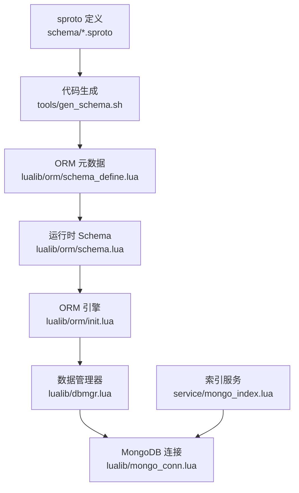
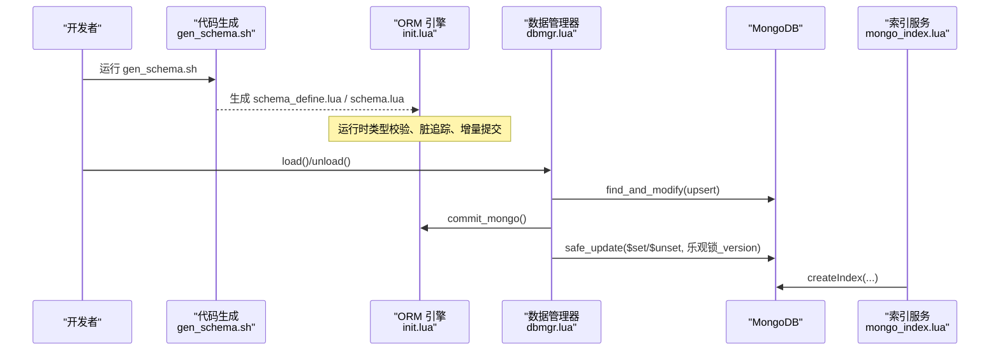
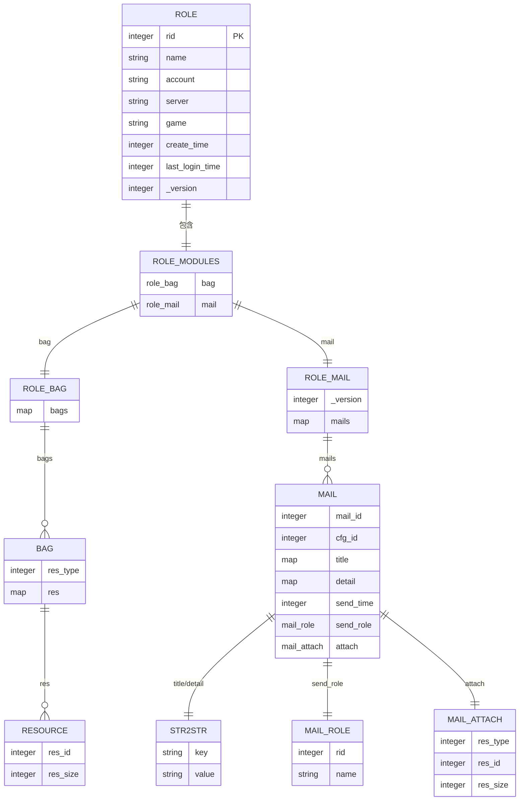
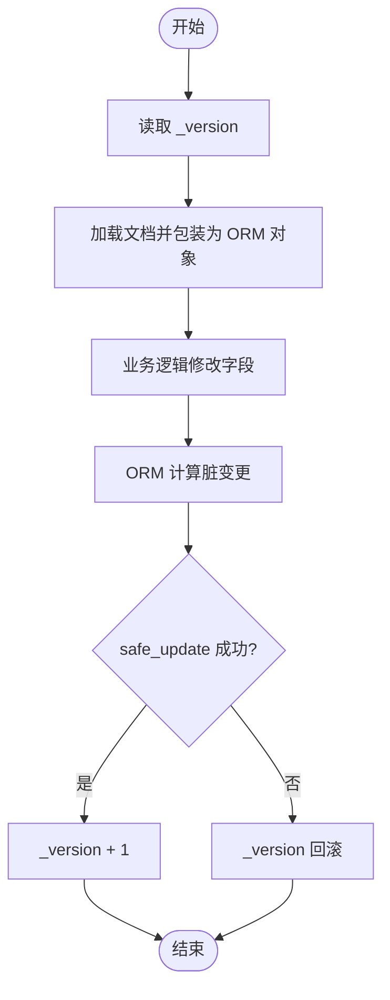
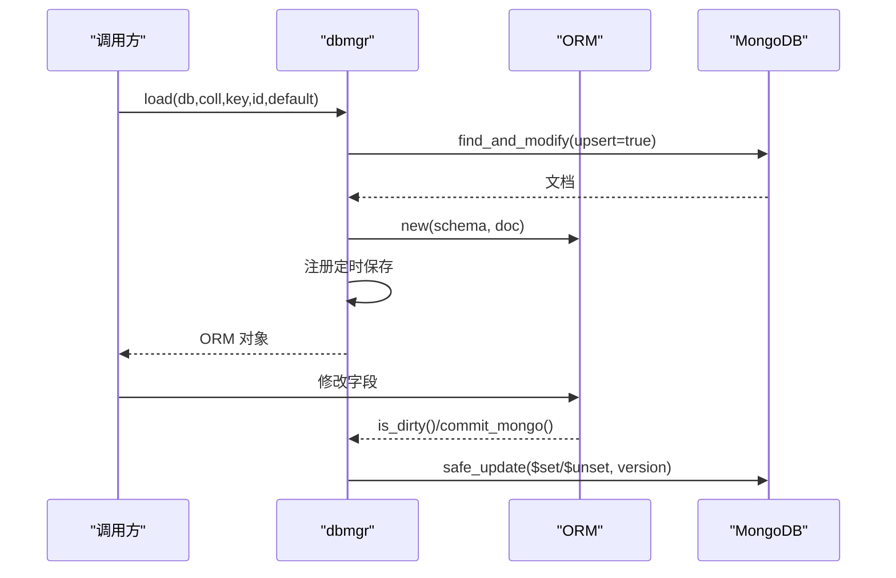
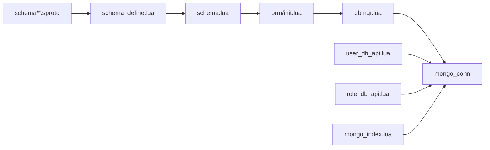

# 数据模型

<cite>
**本文引用的文件**
- [schema/role.sproto](file://schema/role.sproto)
- [schema/bag.sproto](file://schema/bag.sproto)
- [schema/mail.sproto](file://schema/mail.sproto)
- [lualib/orm/schema_define.lua](file://lualib/orm/schema_define.lua)
- [lualib/orm/schema.lua](file://lualib/orm/schema.lua)
- [lualib/orm/init.lua](file://lualib/orm/init.lua)
- [lualib/dbmgr.lua](file://lualib/dbmgr.lua)
- [service/mongo_index.lua](file://service/mongo_index.lua)
- [lualib/user_db_api.lua](file://lualib/user_db_api.lua)
- [lualib/role_db_api.lua](file://lualib/role_db_api.lua)
- [tools/gen_schema.sh](file://tools/gen_schema.sh)
- [tools/gen_proto.sh](file://tools/gen_proto.sh)
</cite>

## 目录
1. [简介](#简介)
2. [项目结构](#项目结构)
3. [核心组件](#核心组件)
4. [架构总览](#架构总览)
5. [详细组件分析](#详细组件分析)
6. [依赖关系分析](#依赖关系分析)
7. [性能考虑](#性能考虑)
8. [故障排查指南](#故障排查指南)
9. [结论](#结论)
10. [附录](#附录)

## 简介
本设计文档围绕 SkyExt 框架的数据模型，系统性说明核心实体（用户、角色、背包、邮件）的关系设计与字段定义；阐述 sproto 协议版本管理与兼容性策略；文档化数据验证规则与业务约束；给出数据库 schema 与索引策略；说明数据迁移方案与版本升级流程；并提供数据访问模式、查询优化建议以及数据流图与实体关系图。

## 项目结构
SkyExt 的数据模型以 sproto 为契约源，通过工具链生成 ORM 元数据与运行时类型校验器，配合 dbmgr 实现带脏检查与乐观锁的持久化。MongoDB 作为存储后端，提供集合与索引管理。

图表来源
- [tools/gen_schema.sh:1-10](file://tools/gen_schema.sh#L1-L10)
- [lualib/orm/schema_define.lua:1-131](file://lualib/orm/schema_define.lua#L1-L131)
- [lualib/orm/schema.lua:1-471](file://lualib/orm/schema.lua#L1-L471)
- [lualib/orm/init.lua:348-447](file://lualib/orm/init.lua#L348-L447)
- [lualib/dbmgr.lua:1-219](file://lualib/dbmgr.lua#L1-L219)
- [service/mongo_index.lua:1-40](file://service/mongo_index.lua#L1-L40)

章节来源
- [tools/gen_schema.sh:1-10](file://tools/gen_schema.sh#L1-L10)
- [lualib/orm/schema_define.lua:1-131](file://lualib/orm/schema_define.lua#L1-L131)
- [lualib/orm/schema.lua:1-471](file://lualib/orm/schema.lua#L1-L471)
- [lualib/orm/init.lua:348-447](file://lualib/orm/init.lua#L348-L447)
- [lualib/dbmgr.lua:1-219](file://lualib/dbmgr.lua#L1-L219)
- [service/mongo_index.lua:1-40](file://service/mongo_index.lua#L1-L40)

## 核心组件
- 数据契约：sproto 定义位于 schema 目录，描述角色、背包、邮件等数据结构。
- 代码生成：gen_schema.sh 将 sproto 转换为 ORM 元数据与运行时 schema。
- ORM 引擎：基于 lualib/orm/init.lua 实现脏追踪、增量提交、嵌套对象处理。
- 数据管理器：dbmgr 负责加载、缓存、定时落盘、乐观锁更新。
- 索引服务：mongo_index 启动时创建 MongoDB 索引。
- 账户与角色 API：user_db_api 与 role_db_api 提供账号与角色的 CRUD。

章节来源
- [schema/role.sproto:1-24](file://schema/role.sproto#L1-L24)
- [schema/bag.sproto:1-16](file://schema/bag.sproto#L1-L16)
- [schema/mail.sproto:1-37](file://schema/mail.sproto#L1-L37)
- [tools/gen_schema.sh:1-10](file://tools/gen_schema.sh#L1-L10)
- [lualib/orm/init.lua:348-447](file://lualib/orm/init.lua#L348-L447)
- [lualib/dbmgr.lua:1-219](file://lualib/dbmgr.lua#L1-L219)
- [service/mongo_index.lua:1-40](file://service/mongo_index.lua#L1-L40)
- [lualib/user_db_api.lua:1-90](file://lualib/user_db_api.lua#L1-L90)
- [lualib/role_db_api.lua:1-85](file://lualib/role_db_api.lua#L1-L85)

## 架构总览
下图展示从 sproto 到持久化的完整链路，包括 ORM 校验、脏数据收集、乐观锁更新与索引初始化。

图表来源
- [tools/gen_schema.sh:1-10](file://tools/gen_schema.sh#L1-L10)
- [lualib/orm/init.lua:348-447](file://lualib/orm/init.lua#L348-L447)
- [lualib/dbmgr.lua:94-148](file://lualib/dbmgr.lua#L94-L148)
- [lualib/dbmgr.lua:53-92](file://lualib/dbmgr.lua#L53-L92)
- [service/mongo_index.lua:11-35](file://service/mongo_index.lua#L11-L35)

## 详细组件分析

### 实体关系与字段定义
- 角色（role）
  - 关键字段：rid、name、account、server、game、create_time、last_login_time、_version、modules
  - 模块聚合：bag、mail
- 背包（role_bag）
  - bags: map(res_type -> bag)
  - bag: res_type + map(res_id -> resource)
  - resource: res_id、res_size
- 邮件（role_mail）
  - mails: map(mail_id -> mail)
  - mail: mail_id、cfg_id、title、detail、send_time、send_role、attach
  - str2str: key/value 用于标题与详情
  - mail_role: rid、name
  - mail_attach: res_type、res_id、res_size

图表来源
- [schema/role.sproto:1-24](file://schema/role.sproto#L1-L24)
- [schema/bag.sproto:1-16](file://schema/bag.sproto#L1-L16)
- [schema/mail.sproto:1-37](file://schema/mail.sproto#L1-L37)
- [lualib/orm/schema_define.lua:1-131](file://lualib/orm/schema_define.lua#L1-L131)

章节来源
- [schema/role.sproto:1-24](file://schema/role.sproto#L1-L24)
- [schema/bag.sproto:1-16](file://schema/bag.sproto#L1-L16)
- [schema/mail.sproto:1-37](file://schema/mail.sproto#L1-L37)
- [lualib/orm/schema_define.lua:1-131](file://lualib/orm/schema_define.lua#L1-L131)

### sproto 协议版本管理与兼容性策略
- 版本字段
  - role._version、role_mail._version 用于记录数据版本，配合 dbmgr 的乐观锁更新。
- 兼容性约束（来自 schema 注释）
  - 不允许删除字段
  - 不允许修改字段类型
  - 不允许修改字段名
- 生成与重载
  - 通过 tools/gen_schema.sh 重新生成 schema_define.lua 与 schema.lua
  - 支持运行时通过 GM 命令重载 schema，避免重启影响在线服务

图表来源
- [lualib/dbmgr.lua:67-92](file://lualib/dbmgr.lua#L67-L92)
- [lualib/dbmgr.lua:94-148](file://lualib/dbmgr.lua#L94-L148)
- [lualib/orm/init.lua:428-447](file://lualib/orm/init.lua#L428-L447)
- [schema/role.sproto:1-24](file://schema/role.sproto#L1-L24)
- [schema/mail.sproto:1-37](file://schema/mail.sproto#L1-L37)

章节来源
- [schema/role.sproto:18-24](file://schema/role.sproto#L18-L24)
- [schema/mail.sproto:1-37](file://schema/mail.sproto#L1-L37)
- [lualib/dbmgr.lua:67-92](file://lualib/dbmgr.lua#L67-L92)
- [lualib/dbmgr.lua:94-148](file://lualib/dbmgr.lua#L94-L148)
- [lualib/orm/init.lua:428-447](file://lualib/orm/init.lua#L428-L447)

### 数据验证规则与业务约束
- 类型校验
  - ORM 在赋值时进行键值类型校验，确保整数、字符串、布尔等类型正确。
  - map 的键类型受 schema 约束（如 integer 或 string）。
- 必填与存在性
  - 通过 schema 定义约束字段存在性与类型，缺失或类型不匹配会触发错误。
- 业务约束
  - 角色唯一标识 rid，账号关联 rids 列表。
  - 资源按分类 res_type 组织，资源项由 res_id 唯一标识。
  - 邮件附件与资源结构一致，便于统一处理。
  - 登录流程中携带 proto_checksum，用于客户端与服务端协议一致性校验（参考 login.sproto）。

章节来源
- [lualib/orm/schema.lua:40-142](file://lualib/orm/schema.lua#L40-L142)
- [lualib/orm/schema.lua:202-248](file://lualib/orm/schema.lua#L202-L248)
- [lualib/orm/schema.lua:328-352](file://lualib/orm/schema.lua#L328-L352)
- [lualib/orm/schema.lua:369-417](file://lualib/orm/schema.lua#L369-L417)
- [lualib/user_db_api.lua:12-44](file://lualib/user_db_api.lua#L12-L44)
- [lualib/role_db_api.lua:12-42](file://lualib/role_db_api.lua#L12-L42)

### 数据库 Schema 设计与索引策略
- 集合与字段
  - 用户集合：account、rids、create_time
  - 角色集合：rid、account、server、game、create_time、last_login_time、_version、modules
  - 模块内嵌：bag、mail（随角色文档存储）
- 索引建议
  - 用户集合：account 唯一索引
  - 角色集合：rid 唯一索引；account+server 复合索引；rid+server 复合索引
  - 若需按游戏范围查询：game 索引
- 索引创建
  - 通过 service/mongo_index.lua 在启动时批量创建索引，失败记录日志并标记异常

章节来源
- [lualib/user_db_api.lua:12-44](file://lualib/user_db_api.lua#L12-L44)
- [lualib/role_db_api.lua:12-42](file://lualib/role_db_api.lua#L12-L42)
- [service/mongo_index.lua:11-35](file://service/mongo_index.lua#L11-L35)

### 数据迁移方案与版本升级流程
- 迁移入口
  - 修改 schema/*.sproto 后，执行 tools/gen_schema.sh 重新生成 ORM 元数据与运行时 schema。
  - 使用 tools/gen_proto.sh 生成协议相关产物（如需）。
- 运行时重载
  - 通过 dbmgr 暴露的 GM 命令 reload_orm_schema 动态重载 schema，无需重启进程。
- 兼容策略
  - 遵循“不删字段、不改类型、不改字段名”的原则，保证旧客户端与旧数据可继续工作。
  - 新增字段采用可选方式，并在业务层提供默认值或迁移脚本。

章节来源
- [tools/gen_schema.sh:1-10](file://tools/gen_schema.sh#L1-L10)
- [tools/gen_proto.sh:1-8](file://tools/gen_proto.sh#L1-L8)
- [lualib/dbmgr.lua:202-210](file://lualib/dbmgr.lua#L202-L210)
- [schema/role.sproto:18-24](file://schema/role.sproto#L18-L24)

### 数据访问模式与查询优化建议
- 加载与缓存
  - dbmgr.load 使用 find_and_modify upsert 获取或创建文档，返回 ORM 包装对象，并注册随机延迟定时器周期性保存脏数据。
  - 内存缓存避免重复 IO，防止重入通过 loading 标志保护。
- 写入与并发
  - 使用 _version 乐观锁，更新前比较版本，失败则回滚本地版本计数。
  - 使用 $set/$unset 仅提交变更字段，减少网络与存储开销。
- 查询优化
  - 使用投影 projection 仅返回必要字段，降低传输成本。
  - 对高频查询建立合适索引（见索引策略）。
  - 单角色场景直接按 rid 查询，多角色使用 $in 批量查询。

图表来源
- [lualib/dbmgr.lua:94-148](file://lualib/dbmgr.lua#L94-L148)
- [lualib/dbmgr.lua:53-92](file://lualib/dbmgr.lua#L53-L92)
- [lualib/orm/init.lua:428-447](file://lualib/orm/init.lua#L428-L447)

章节来源
- [lualib/dbmgr.lua:94-148](file://lualib/dbmgr.lua#L94-L148)
- [lualib/dbmgr.lua:53-92](file://lualib/dbmgr.lua#L53-L92)
- [lualib/orm/init.lua:428-447](file://lualib/orm/init.lua#L428-L447)

## 依赖关系分析
- 组件耦合
  - schema 定义驱动 ORM 元数据与运行时校验，形成强契约。
  - dbmgr 依赖 ORM 与 mongo 连接，封装加载、缓存、落盘逻辑。
  - user_db_api 与 role_db_api 分别管理账号与角色集合，角色创建时维护账号的 rids 列表。
- 外部依赖
  - MongoDB：通过 mongo_conn 获取集合对象，执行查询与更新。
  - 配置：通过 config 获取数据库与集合名称、保存间隔等参数。

图表来源
- [tools/gen_schema.sh:1-10](file://tools/gen_schema.sh#L1-L10)
- [lualib/orm/schema_define.lua:1-131](file://lualib/orm/schema_define.lua#L1-L131)
- [lualib/orm/schema.lua:1-471](file://lualib/orm/schema.lua#L1-L471)
- [lualib/orm/init.lua:348-447](file://lualib/orm/init.lua#L348-L447)
- [lualib/dbmgr.lua:1-219](file://lualib/dbmgr.lua#L1-L219)
- [lualib/user_db_api.lua:1-90](file://lualib/user_db_api.lua#L1-L90)
- [lualib/role_db_api.lua:1-85](file://lualib/role_db_api.lua#L1-L85)
- [service/mongo_index.lua:1-40](file://service/mongo_index.lua#L1-L40)

章节来源
- [lualib/orm/schema_define.lua:1-131](file://lualib/orm/schema_define.lua#L1-L131)
- [lualib/orm/schema.lua:1-471](file://lualib/orm/schema.lua#L1-L471)
- [lualib/orm/init.lua:348-447](file://lualib/orm/init.lua#L348-L447)
- [lualib/dbmgr.lua:1-219](file://lualib/dbmgr.lua#L1-L219)
- [lualib/user_db_api.lua:1-90](file://lualib/user_db_api.lua#L1-L90)
- [lualib/role_db_api.lua:1-85](file://lualib/role_db_api.lua#L1-L85)
- [service/mongo_index.lua:1-40](file://service/mongo_index.lua#L1-L40)

## 性能考虑
- 减少网络往返
  - 使用 find_and_modify 一次性完成 upsert 与返回，避免额外查询。
  - 使用 $set/$unset 仅提交变更字段，降低负载。
- 内存与缓存
  - 文档级缓存避免重复 IO，loading 标志防止并发重入。
  - 随机延迟定时保存，避免集中写放大。
- 查询优化
  - 合理设置 projection，只取必要字段。
  - 针对高频查询建立索引，如 rid、account+server。
- 版本控制
  - 乐观锁减少冲突重试成本，失败时快速回滚本地状态。

[本节为通用指导，不直接分析具体文件]

## 故障排查指南
- 常见错误
  - 保存失败且未修改行：检查 query 条件与 _version 是否匹配。
  - 集合不存在：确认配置中的 dbname 与 collection 名称正确。
  - 索引创建失败：查看日志输出，确认权限与集合是否存在。
- 定位方法
  - 启用 debug 日志，关注 load/save/unload 的关键路径。
  - 使用 GM 命令 reload_orm_schema 验证 schema 是否正确重载。
  - 检查 user_db_api 与 role_db_api 的初始化日志，确认集合对象已就绪。

章节来源
- [lualib/dbmgr.lua:53-92](file://lualib/dbmgr.lua#L53-L92)
- [lualib/dbmgr.lua:150-198](file://lualib/dbmgr.lua#L150-L198)
- [service/mongo_index.lua:11-35](file://service/mongo_index.lua#L11-L35)
- [lualib/user_db_api.lua:82-87](file://lualib/user_db_api.lua#L82-L87)
- [lualib/role_db_api.lua:77-82](file://lualib/role_db_api.lua#L77-L82)

## 结论
SkyExt 的数据模型以 sproto 为核心契约，结合 ORM 与 dbmgr 实现了类型安全、脏追踪与乐观锁的持久化机制。通过合理的索引策略与查询优化，系统在高并发与大数据量场景下具备良好性能。版本管理与兼容性策略保障了平滑升级与在线热重载能力。

[本节为总结性内容，不直接分析具体文件]

## 附录
- 关键流程参考
  - 数据加载与保存：[lualib/dbmgr.lua:94-148](file://lualib/dbmgr.lua#L94-L148)、[lualib/dbmgr.lua:53-92](file://lualib/dbmgr.lua#L53-L92)
  - ORM 提交与脏检查：[lualib/orm/init.lua:428-447](file://lualib/orm/init.lua#L428-L447)
  - 索引创建：[service/mongo_index.lua:11-35](file://service/mongo_index.lua#L11-L35)
  - 账号与角色 API：[lualib/user_db_api.lua:12-44](file://lualib/user_db_api.lua#L12-L44)、[lualib/role_db_api.lua:12-42](file://lualib/role_db_api.lua#L12-L42)
  - 代码生成：[tools/gen_schema.sh:1-10](file://tools/gen_schema.sh#L1-L10)、[tools/gen_proto.sh:1-8](file://tools/gen_proto.sh#L1-L8)