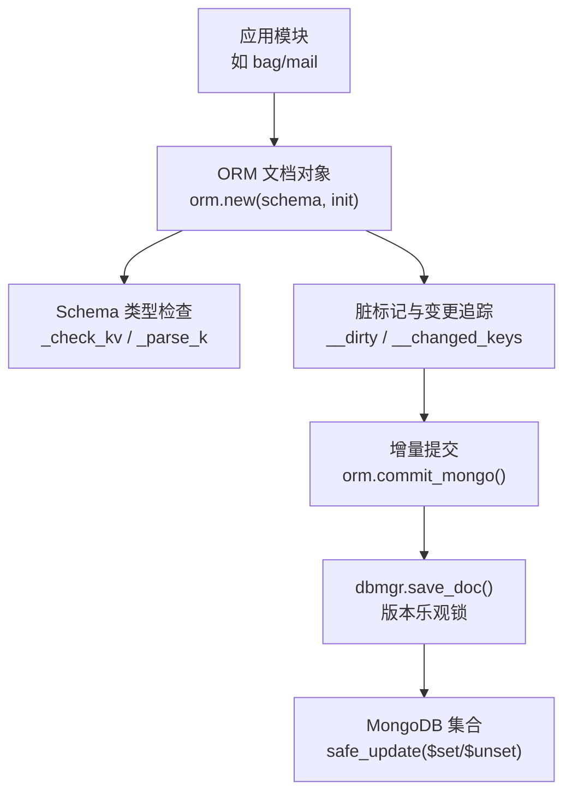
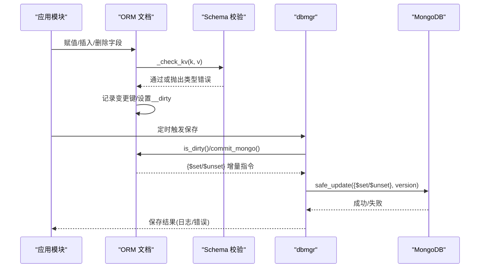
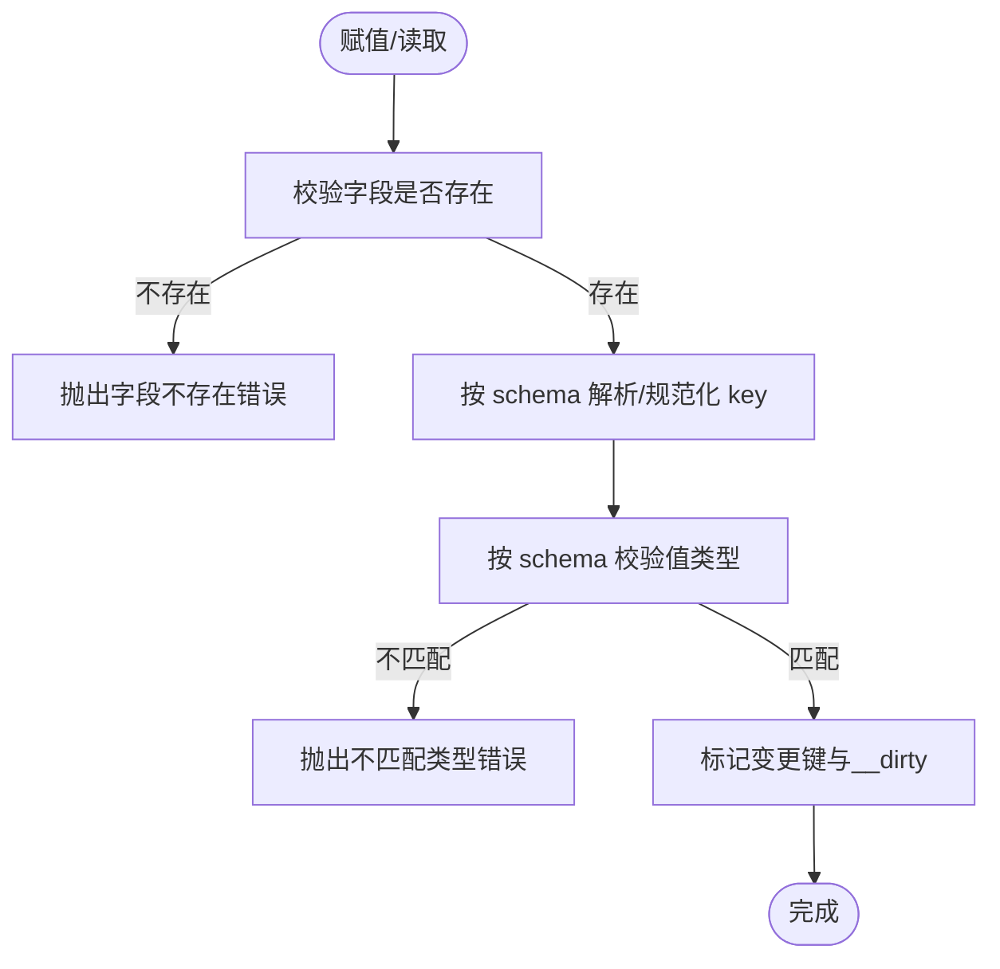
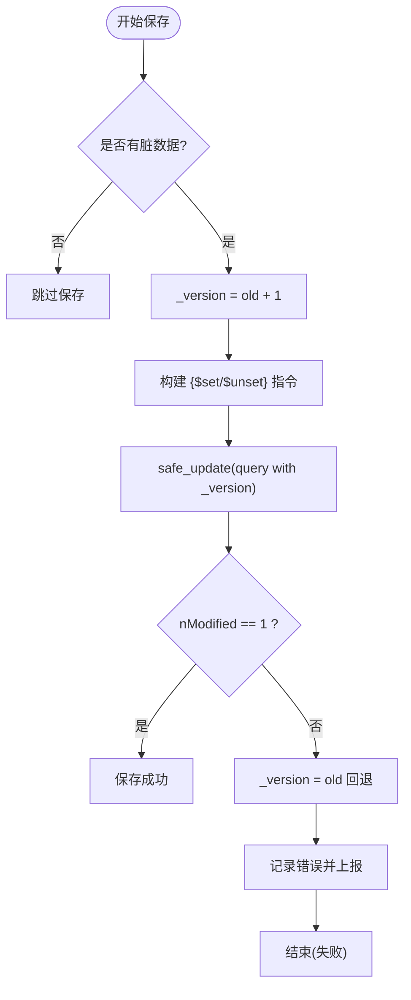
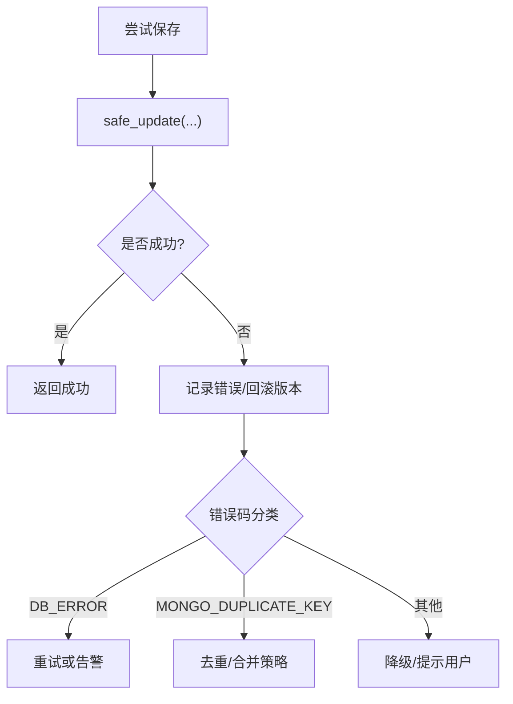
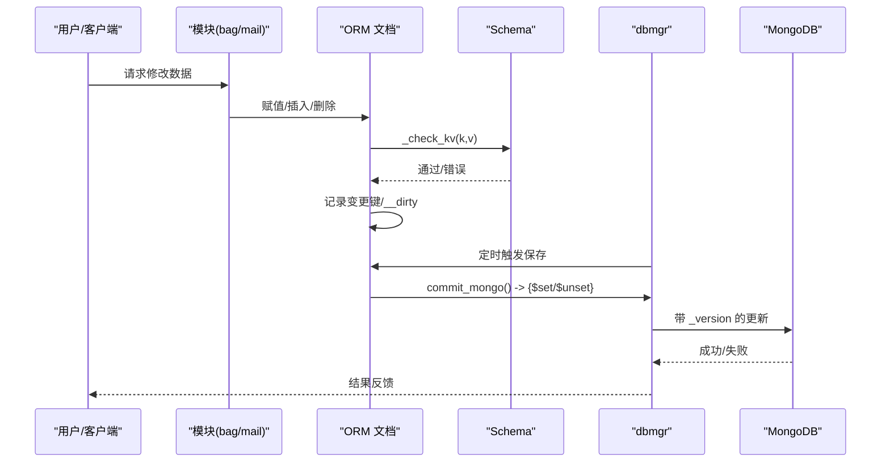
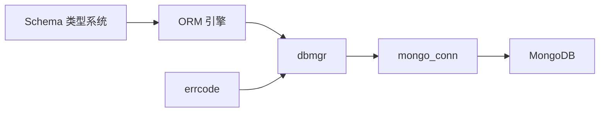

# 数据验证与约束

<cite>
**本文引用的文件**
- [lualib/orm/init.lua](file://lualib/orm/init.lua)
- [lualib/orm/schema.lua](file://lualib/orm/schema.lua)
- [lualib/orm/schema_define.lua](file://lualib/orm/schema_define.lua)
- [lualib/dbmgr.lua](file://lualib/dbmgr.lua)
- [lualib/mongo_conn.lua](file://lualib/mongo_conn.lua)
- [schema/role.sproto](file://schema/role.sproto)
- [app/role/roleagent/modules/bag/init.lua](file://app/role/roleagent/modules/bag/init.lua)
- [lualib/errcode.lua](file://lualib/errcode.lua)
</cite>

## 目录
1. [简介](#简介)
2. [项目结构](#项目结构)
3. [核心组件](#核心组件)
4. [架构总览](#架构总览)
5. [详细组件分析](#详细组件分析)
6. [依赖关系分析](#依赖关系分析)
7. [性能考量](#性能考量)
8. [故障排查指南](#故障排查指南)
9. [结论](#结论)
10. [附录](#附录)

## 简介
本文件面向 SkyExt 框架的数据验证系统，聚焦 ORM 层字段验证规则、数据类型检查、业务规则校验、自定义验证器扩展点、数据完整性保证与事务处理机制。文档同时提供错误处理与异常恢复策略、配置示例与最佳实践，并包含数据流验证图与错误处理流程图，帮助读者快速理解与正确使用该子系统。

## 项目结构
SkyExt 的 ORM 数据验证由三部分组成：
- 运行时 ORM 引擎：负责对象生命周期、脏标记、序列化与提交（lualib/orm/init.lua）
- Schema 定义与类型检查：由 sproto 生成代码，提供强类型字段校验（lualib/orm/schema.lua, lualib/orm/schema_define.lua, schema/*.sproto）
- 持久化与一致性：dbmgr 将 ORM 对象与 MongoDB 集合关联，实现增量保存与版本控制（lualib/dbmgr.lua），底层连接管理在 mongo_conn（lualib/mongo_conn.lua）

图表来源
- [lualib/orm/init.lua:234-295](file://lualib/orm/init.lua#L234-L295)
- [lualib/orm/schema.lua:163-185](file://lualib/orm/schema.lua#L163-L185)
- [lualib/dbmgr.lua:67-92](file://lualib/dbmgr.lua#L67-L92)

章节来源
- [lualib/orm/init.lua:1-491](file://lualib/orm/init.lua#L1-L491)
- [lualib/orm/schema.lua:1-471](file://lualib/orm/schema.lua#L1-L471)
- [lualib/orm/schema_define.lua:1-131](file://lualib/orm/schema_define.lua#L1-L131)
- [lualib/dbmgr.lua:1-219](file://lualib/dbmgr.lua#L1-L219)
- [schema/role.sproto:1-24](file://schema/role.sproto#L1-L24)

## 核心组件
- ORM 文档对象
  - 通过 orm.new(schema, init) 创建，内部使用元表拦截赋值，触发字段存在性与类型校验，并维护脏标记与变更键集合。
  - 支持嵌套结构与数组型文档，自动传播父级 dirty 标记。
- Schema 类型系统
  - 基于 sproto 生成的 schema 定义，提供字段名白名单、键值类型检查、map 的 key/value 类型约束。
  - 内置基础类型：integer、number、string、boolean；以及 struct/map/array 等复合类型。
- 持久化与一致性
  - dbmgr.load 返回 ORM 文档对象，定时任务异步保存脏数据；save_doc 使用 _version 乐观锁进行并发安全更新。
  - 提交阶段仅对变更字段生成 $set/$unset 操作，减少网络与存储开销。

章节来源
- [lualib/orm/init.lua:54-97](file://lualib/orm/init.lua#L54-L97)
- [lualib/orm/init.lua:315-327](file://lualib/orm/init.lua#L315-L327)
- [lualib/orm/schema.lua:89-185](file://lualib/orm/schema.lua#L89-L185)
- [lualib/dbmgr.lua:94-148](file://lualib/dbmgr.lua#L94-L148)
- [lualib/dbmgr.lua:67-92](file://lualib/dbmgr.lua#L67-L92)

## 架构总览
下图展示从应用侧修改 ORM 文档到最终落库的完整流程，包括类型校验、脏追踪、增量提交与版本控制。

图表来源
- [lualib/orm/init.lua:54-97](file://lualib/orm/init.lua#L54-L97)
- [lualib/orm/init.lua:321-327](file://lualib/orm/init.lua#L321-L327)
- [lualib/orm/init.lua:428-447](file://lualib/orm/init.lua#L428-L447)
- [lualib/dbmgr.lua:67-92](file://lualib/dbmgr.lua#L67-L92)

## 详细组件分析

### 字段验证规则与数据类型检查
- 字段存在性校验：每次访问或赋值前，通过 schema._check_k/_parse_k 校验字段是否存在于当前 schema 中，不存在则报错。
- 值类型校验：_check_v_tp 严格匹配 integer/number/string/boolean 等类型；对于 map，额外校验 key 与 value 的类型。
- 键解析：当 schema 要求特定 key 类型（如 integer 或 string）时，_parse_k_tp 会尝试转换或拒绝非法输入。
- 嵌套与数组：对嵌套文档与数组元素同样执行类型检查，并在赋值时递归构造子文档。

图表来源
- [lualib/orm/schema.lua:163-185](file://lualib/orm/schema.lua#L163-L185)
- [lualib/orm/schema.lua:89-142](file://lualib/orm/schema.lua#L89-L142)
- [lualib/orm/init.lua:54-97](file://lualib/orm/init.lua#L54-L97)

章节来源
- [lualib/orm/schema.lua:89-185](file://lualib/orm/schema.lua#L89-L185)
- [lualib/orm/init.lua:54-97](file://lualib/orm/init.lua#L54-L97)

### 业务规则验证与自定义验证器
- 当前 ORM 层提供“强类型 + 字段白名单”的基础约束，适用于大多数场景。
- 业务规则验证建议在上层模块中进行（例如资源数量非负、背包容量限制等），在赋值前后调用自定义校验函数，必要时抛出错误以阻止非法状态写入。
- 推荐模式：
  - 在模块初始化时建立默认数据结构，确保初始状态合法。
  - 在关键写路径（如增减资源、发送邮件）前后增加业务校验。
  - 将校验逻辑封装为可复用的函数，集中管理业务规则。

章节来源
- [app/role/roleagent/modules/bag/init.lua:6-24](file://app/role/roleagent/modules/bag/init.lua#L6-L24)

### 数据完整性保证与事务处理机制
- 版本乐观锁：每个文档携带 _version 字段，保存时以 {key: id, _version: old} 作为查询条件，仅当版本一致时才更新，避免覆盖并发修改。
- 增量提交：orm.commit_mongo 仅收集变更字段，生成 $set/$unset 指令，降低冲突概率与网络开销。
- 异步落盘：dbmgr 启动定时器周期性保存脏数据，结合随机延迟分散写入压力。
- 回滚与恢复：若保存失败，dbmgr 会回退版本号，防止不一致；上层可根据错误码重试或告警。

图表来源
- [lualib/dbmgr.lua:67-92](file://lualib/dbmgr.lua#L67-L92)
- [lualib/orm/init.lua:428-447](file://lualib/orm/init.lua#L428-L447)

章节来源
- [lualib/dbmgr.lua:67-92](file://lualib/dbmgr.lua#L67-L92)
- [lualib/orm/init.lua:428-447](file://lualib/orm/init.lua#L428-L447)

### 错误处理与异常恢复策略
- 类型错误：Schema 校验失败会直接抛出错误，调用方应捕获并记录上下文信息（字段名、期望类型、实际值）。
- 保存失败：dbmgr 记录错误日志，并回退版本号；上层可按需重试或降级。
- 错误码：统一错误码集中在 errcode，便于上层分类处理（如数据库错误、重复键等）。

图表来源
- [lualib/dbmgr.lua:53-65](file://lualib/dbmgr.lua#L53-L65)
- [lualib/errcode.lua:1-29](file://lualib/errcode.lua#L1-L29)

章节来源
- [lualib/dbmgr.lua:53-65](file://lualib/dbmgr.lua#L53-L65)
- [lualib/errcode.lua:1-29](file://lualib/errcode.lua#L1-L29)

### 数据流验证图
下图展示了从应用侧创建/修改 ORM 文档到最终落库的数据流，强调类型校验与脏追踪的关键节点。

图表来源
- [lualib/orm/init.lua:54-97](file://lualib/orm/init.lua#L54-L97)
- [lualib/orm/init.lua:428-447](file://lualib/orm/init.lua#L428-L447)
- [lualib/dbmgr.lua:67-92](file://lualib/dbmgr.lua#L67-L92)

## 依赖关系分析
- ORM 引擎依赖 Schema 提供的类型与字段白名单，所有读写均受其约束。
- dbmgr 依赖 ORM 的脏追踪与提交能力，并通过 mongo_conn 获取集合对象进行持久化。
- 错误码模块为上层提供统一的错误分类依据。

图表来源
- [lualib/orm/init.lua:1-491](file://lualib/orm/init.lua#L1-L491)
- [lualib/orm/schema.lua:1-471](file://lualib/orm/schema.lua#L1-L471)
- [lualib/dbmgr.lua:1-219](file://lualib/dbmgr.lua#L1-L219)
- [lualib/mongo_conn.lua:94-151](file://lualib/mongo_conn.lua#L94-L151)
- [lualib/errcode.lua:1-29](file://lualib/errcode.lua#L1-L29)

章节来源
- [lualib/orm/init.lua:1-491](file://lualib/orm/init.lua#L1-L491)
- [lualib/orm/schema.lua:1-471](file://lualib/orm/schema.lua#L1-L471)
- [lualib/dbmgr.lua:1-219](file://lualib/dbmgr.lua#L1-L219)
- [lualib/mongo_conn.lua:94-151](file://lualib/mongo_conn.lua#L94-L151)
- [lualib/errcode.lua:1-29](file://lualib/errcode.lua#L1-L29)

## 性能考量
- 增量提交：仅对变更字段生成 $set/$unset，减少无效写入与冲突概率。
- 脏标记传播：父级 dirty 标记避免重复遍历，提升批量提交效率。
- 异步落盘：定时器随机延迟分散写入峰值，降低数据库压力。
- 类型检查前置：在赋值阶段即进行类型校验，避免后续处理成本。

[本节为通用指导，不直接分析具体文件]

## 故障排查指南
- 类型不匹配：检查字段类型是否与 schema 定义一致，注意 integer 与 number 的区别。
- 字段不存在：确认字段名是否在 schema 中定义，避免拼写错误。
- 保存失败：查看错误日志与错误码，区分数据库错误、重复键等情况；必要时重试或采取降级策略。
- 并发冲突：检查 _version 是否正确递增；若 nModified 不为 1，说明版本冲突，需重新加载并再次尝试。

章节来源
- [lualib/orm/schema.lua:89-185](file://lualib/orm/schema.lua#L89-L185)
- [lualib/dbmgr.lua:53-92](file://lualib/dbmgr.lua#L53-L92)
- [lualib/errcode.lua:1-29](file://lualib/errcode.lua#L1-L29)

## 结论
SkyExt 的 ORM 数据验证系统通过强类型 Schema、严格的字段白名单与增量提交机制，提供了可靠的数据完整性保障。配合 dbmgr 的版本乐观锁与异步落盘，系统在并发与性能之间取得良好平衡。建议在业务层补充必要的业务规则校验，并结合错误码体系完善异常恢复策略。

[本节为总结性内容，不直接分析具体文件]

## 附录

### 配置与最佳实践
- 配置要点
  - 在配置文件中定义 mongo_config，指定数据库与集合映射，供 dbmgr 使用。
  - 设置 db_save_interval 控制定时保存间隔，合理权衡实时性与性能。
- 最佳实践
  - 始终通过 orm.new 创建文档对象，避免绕过类型校验。
  - 在业务写路径前后加入业务规则校验，确保数据语义正确。
  - 使用 orm.is_dirty 与 orm.commit_mongo 精确控制保存时机与范围。
  - 对可能失败的保存操作进行重试与降级处理，结合错误码分类。

章节来源
- [lualib/dbmgr.lua:14-16](file://lualib/dbmgr.lua#L14-L16)
- [lualib/dbmgr.lua:67-92](file://lualib/dbmgr.lua#L67-L92)
- [lualib/orm/init.lua:428-447](file://lualib/orm/init.lua#L428-L447)