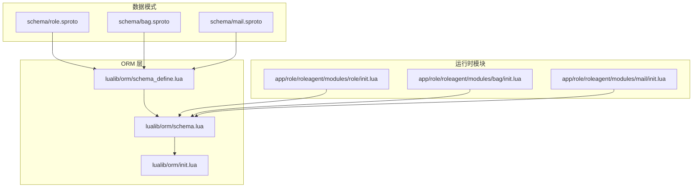
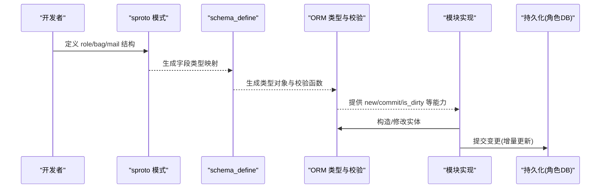
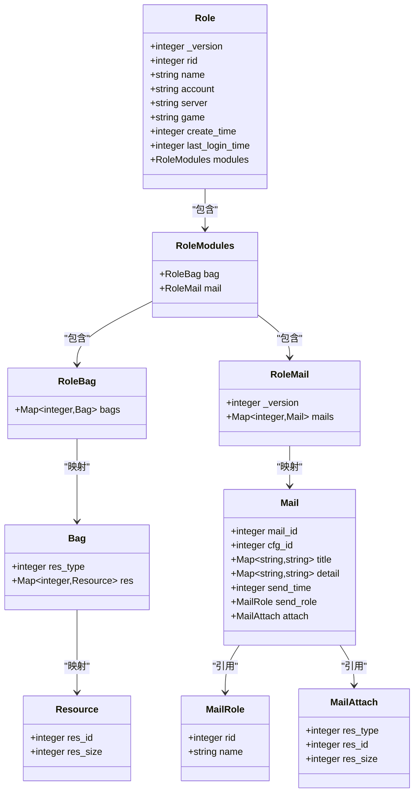
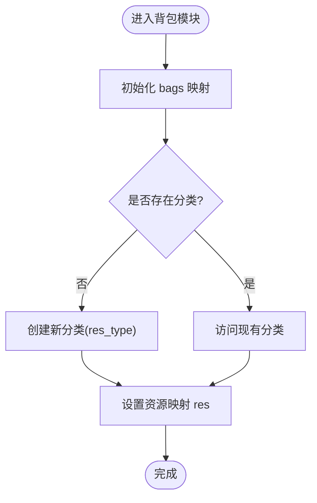
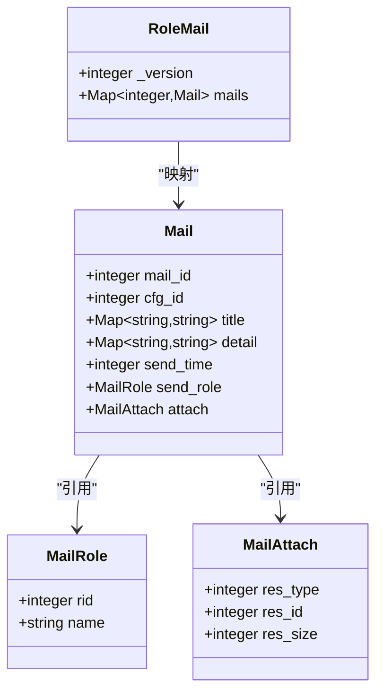
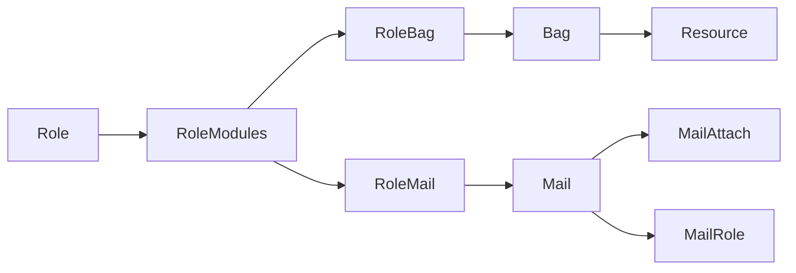
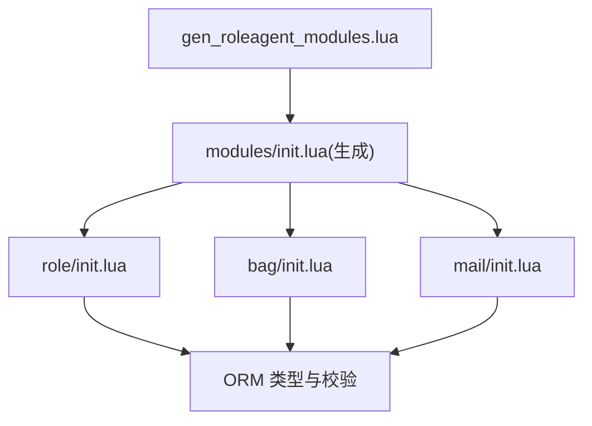

# 核心实体模型

<cite>
**本文引用的文件**
- [schema/role.sproto](file://schema/role.sproto)
- [schema/bag.sproto](file://schema/bag.sproto)
- [schema/mail.sproto](file://schema/mail.sproto)
- [lualib/orm/schema_define.lua](file://lualib/orm/schema_define.lua)
- [lualib/orm/schema.lua](file://lualib/orm/schema.lua)
- [lualib/orm/init.lua](file://lualib/orm/init.lua)
- [app/role/roleagent/modules/role/init.lua](file://app/role/roleagent/modules/role/init.lua)
- [app/role/roleagent/modules/bag/init.lua](file://app/role/roleagent/modules/bag/init.lua)
- [app/role/roleagent/modules/mail/init.lua](file://app/role/roleagent/modules/mail/init.lua)
- [tools/gen_roleagent_modules.lua](file://tools/gen_roleagent_modules.lua)
- [lualib/role_db_api.lua](file://lualib/role_db_api.lua)
</cite>

## 目录
1. [简介](#简介)
2. [项目结构](#项目结构)
3. [核心组件](#核心组件)
4. [架构总览](#架构总览)
5. [详细组件分析](#详细组件分析)
6. [依赖关系分析](#依赖关系分析)
7. [性能考虑](#性能考虑)
8. [故障排查指南](#故障排查指南)
9. [结论](#结论)
10. [附录](#附录)

## 简介
本文面向 SkyExt 框架的核心数据实体，系统性说明角色（Role）、背包（Bag）、邮件（Mail）等实体的数据结构设计、字段含义与业务用途、实体间关系与依赖、字段校验规则与默认值、约束条件，以及生命周期管理与状态转换。文档同时提供实体关系图、关键流程时序图与示例数据，帮助开发者快速理解并正确使用这些核心模型。

## 项目结构
SkyExt 使用 sproto 定义数据模式，并通过 ORM 层生成类型化结构与校验逻辑；模块按功能划分在 app/role/roleagent/modules 下，每个模块负责对应实体的初始化与请求处理。

**图表来源**
- [schema/role.sproto:1-24](file://schema/role.sproto#L1-L24)
- [schema/bag.sproto:1-16](file://schema/bag.sproto#L1-L16)
- [schema/mail.sproto:1-37](file://schema/mail.sproto#L1-L37)
- [lualib/orm/schema_define.lua:1-131](file://lualib/orm/schema_define.lua#L1-L131)
- [lualib/orm/schema.lua:1-471](file://lualib/orm/schema.lua#L1-L471)
- [lualib/orm/init.lua:1-491](file://lualib/orm/init.lua#L1-L491)
- [app/role/roleagent/modules/role/init.lua:1-41](file://app/role/roleagent/modules/role/init.lua#L1-L41)
- [app/role/roleagent/modules/bag/init.lua:1-27](file://app/role/roleagent/modules/bag/init.lua#L1-L27)
- [app/role/roleagent/modules/mail/init.lua:1-17](file://app/role/roleagent/modules/mail/init.lua#L1-L17)

**章节来源**
- [schema/role.sproto:1-24](file://schema/role.sproto#L1-L24)
- [schema/bag.sproto:1-16](file://schema/bag.sproto#L1-L16)
- [schema/mail.sproto:1-37](file://schema/mail.sproto#L1-L37)
- [lualib/orm/schema_define.lua:1-131](file://lualib/orm/schema_define.lua#L1-L131)
- [lualib/orm/schema.lua:1-471](file://lualib/orm/schema.lua#L1-L471)
- [lualib/orm/init.lua:1-491](file://lualib/orm/init.lua#L1-L491)
- [app/role/roleagent/modules/role/init.lua:1-41](file://app/role/roleagent/modules/role/init.lua#L1-L41)
- [app/role/roleagent/modules/bag/init.lua:1-27](file://app/role/roleagent/modules/bag/init.lua#L1-L27)
- [app/role/roleagent/modules/mail/init.lua:1-17](file://app/role/roleagent/modules/mail/init.lua#L1-L17)

## 核心组件
- 角色（Role）：玩家主实体，包含基础信息、服务器与游戏范围标识、创建与登录时间戳，以及扩展模块集合（背包、邮件等）。
- 背包（Bag）：按资源分类组织资源列表，支持多类资源聚合存储。
- 邮件（Mail）：玩家收件箱，支持多语言标题与内容、发送者信息、附件资源等。

上述三个实体通过 role_modules 组合，形成“角色-模块”的聚合根结构，便于按需加载与独立维护。

**章节来源**
- [schema/role.sproto:1-24](file://schema/role.sproto#L1-L24)
- [schema/bag.sproto:1-16](file://schema/bag.sproto#L1-L16)
- [schema/mail.sproto:1-37](file://schema/mail.sproto#L1-L37)
- [lualib/orm/schema_define.lua:68-121](file://lualib/orm/schema_define.lua#L68-L121)

## 架构总览
下图展示了从 sproto 模式到 ORM 类型系统，再到运行时模块实例化的整体链路。

**图表来源**
- [schema/role.sproto:1-24](file://schema/role.sproto#L1-L24)
- [schema/bag.sproto:1-16](file://schema/bag.sproto#L1-L16)
- [schema/mail.sproto:1-37](file://schema/mail.sproto#L1-L37)
- [lualib/orm/schema_define.lua:1-131](file://lualib/orm/schema_define.lua#L1-L131)
- [lualib/orm/schema.lua:1-471](file://lualib/orm/schema.lua#L1-L471)
- [lualib/orm/init.lua:315-447](file://lualib/orm/init.lua#L315-L447)
- [lualib/role_db_api.lua:56-84](file://lualib/role_db_api.lua#L56-L84)

## 详细组件分析

### 角色（Role）实体
- 字段说明
  - _version：整数，用于版本控制与迁移兼容。
  - rid：整数，角色唯一标识。
  - name：字符串，角色名称。
  - account：字符串，所属账号。
  - server：字符串，客户端可见的服务器标识。
  - game：字符串，玩法范围标识，合服时可将不同服务器归并为同一 game。
  - create_time：整数，创建时间戳。
  - last_login_time：整数，最后登录时间戳。
  - modules：role_modules，模块聚合根，当前包含 bag 与 mail。
- 数据类型与约束
  - 所有字段由 ORM 严格校验类型，键名必须存在于 schema 中。
  - 复合字段 modules 为 struct，内部 bag/mail 均为 struct。
- 默认值与初始化
  - 创建角色时，_version 初始化为 0，rid/account 由创建流程注入。
- 生命周期与状态
  - 绑定/解绑客户端 fd：用于离线卸载计时器触发。
  - 离线卸载：当无 fd 且超时后，调用 unload_role 释放内存。
- 错误处理
  - 字段赋值会触发类型校验，非法类型将抛出错误。
- 示例数据（示意）
  - rid=10001, name="玩家A", account="acc_001", server="srv_1", game="game_a", create_time=1700000000, last_login_time=1700000100, modules={bag:{bags:{}}, mail:{_version:0, mails:{}}}

**图表来源**
- [schema/role.sproto:1-24](file://schema/role.sproto#L1-L24)
- [schema/bag.sproto:1-16](file://schema/bag.sproto#L1-L16)
- [schema/mail.sproto:1-37](file://schema/mail.sproto#L1-L37)
- [lualib/orm/schema_define.lua:68-121](file://lualib/orm/schema_define.lua#L68-L121)
- [lualib/orm/schema.lua:328-435](file://lualib/orm/schema.lua#L328-L435)

**章节来源**
- [schema/role.sproto:1-24](file://schema/role.sproto#L1-L24)
- [lualib/orm/schema_define.lua:68-121](file://lualib/orm/schema_define.lua#L68-L121)
- [lualib/orm/schema.lua:328-435](file://lualib/orm/schema.lua#L328-L435)
- [app/role/roleagent/modules/role/init.lua:1-41](file://app/role/roleagent/modules/role/init.lua#L1-L41)
- [lualib/role_db_api.lua:56-84](file://lualib/role_db_api.lua#L56-L84)

### 背包（Bag）实体
- 字段说明
  - role_bag.bags：以资源分类（res_type）为键的映射，值为 bag。
  - bag.res_type：资源分类标识，区分不同类型的道具和资源。
  - bag.res：以资源 id（res_id）为键的映射，值为 resource。
  - resource.res_id：资源 id。
  - resource.res_size：资源数量。
- 数据类型与约束
  - bags/res 均为 map，键类型为 integer，值类型分别为 bag/resource。
  - ORM 会在赋值时校验 key/value 类型。
- 默认值与初始化
  - 模块初始化时会预置一个分类（例如 res_type=101），并附带示例资源条目。
- 生命周期与状态
  - 作为角色模块之一，随角色加载而初始化，随角色卸载而释放。
- 错误处理
  - 非法键或值类型将触发校验错误。
- 示例数据（示意）
  - bags[101] = { res_type=101, res={ [10086]={ res_size=1 } } }

**图表来源**
- [schema/bag.sproto:1-16](file://schema/bag.sproto#L1-L16)
- [lualib/orm/schema_define.lua:4-13](file://lualib/orm/schema_define.lua#L4-L13)
- [lualib/orm/schema.lua:187-233](file://lualib/orm/schema.lua#L187-L233)
- [app/role/roleagent/modules/bag/init.lua:6-23](file://app/role/roleagent/modules/bag/init.lua#L6-L23)

**章节来源**
- [schema/bag.sproto:1-16](file://schema/bag.sproto#L1-L16)
- [lualib/orm/schema_define.lua:4-13](file://lualib/orm/schema_define.lua#L4-L13)
- [lualib/orm/schema.lua:187-233](file://lualib/orm/schema.lua#L187-L233)
- [app/role/roleagent/modules/bag/init.lua:6-23](file://app/role/roleagent/modules/bag/init.lua#L6-L23)

### 邮件（Mail）实体
- 字段说明
  - role_mail._version：邮件模块版本。
  - role_mail.mails：以 mail_id 为键的映射，值为 mail。
  - mail.mail_id：邮件 id。
  - mail.cfg_id：邮件配置 id。
  - mail.title/detail：多语言键值对（str2str），key 为语言代码，value 为文本。
  - mail.send_time：发送时间戳。
  - mail.send_role：发送者信息（rid/name）。
  - mail.attach：附件资源（res_type/res_id/res_size）。
- 数据类型与约束
  - mails/title/detail 为 map，键类型为 integer/string，值类型受 schema 约束。
  - ORM 强制校验键值类型，防止非法数据写入。
- 默认值与初始化
  - 模块初始化时仅创建空容器，具体邮件由业务逻辑添加。
- 生命周期与状态
  - 作为角色模块之一，随角色加载而初始化。
- 错误处理
  - 非法键或值类型将触发校验错误。
- 示例数据（示意）
  - mails[1001] = { mail_id=1001, cfg_id=1, title={"zh":"测试","en":"Test"}, detail={}, send_time=1700000200, send_role={rid=1,name="管理员"}, attach={res_type=101,res_id=10086,res_size=5} }

**图表来源**
- [schema/mail.sproto:1-37](file://schema/mail.sproto#L1-L37)
- [lualib/orm/schema_define.lua:14-51](file://lualib/orm/schema_define.lua#L14-L51)
- [lualib/orm/schema.lua:250-308](file://lualib/orm/schema.lua#L250-L308)
- [lualib/orm/schema.lua:401-417](file://lualib/orm/schema.lua#L401-L417)

**章节来源**
- [schema/mail.sproto:1-37](file://schema/mail.sproto#L1-L37)
- [lualib/orm/schema_define.lua:14-51](file://lualib/orm/schema_define.lua#L14-L51)
- [lualib/orm/schema.lua:250-308](file://lualib/orm/schema.lua#L250-L308)
- [lualib/orm/schema.lua:401-417](file://lualib/orm/schema.lua#L401-L417)
- [app/role/roleagent/modules/mail/init.lua:6-13](file://app/role/roleagent/modules/mail/init.lua#L6-L13)

### 实体关系与依赖
- 角色（Role）聚合模块（modules），模块包含背包（bag）和邮件（mail）。
- 背包（bag）按资源分类（res_type）组织资源（resource）。
- 邮件（mail）可携带附件（mail_attach），并记录发送者（mail_role）。
- ORM 层提供类型校验、脏标记追踪与增量提交能力。

**图表来源**
- [schema/role.sproto:1-24](file://schema/role.sproto#L1-L24)
- [schema/bag.sproto:1-16](file://schema/bag.sproto#L1-L16)
- [schema/mail.sproto:1-37](file://schema/mail.sproto#L1-L37)
- [lualib/orm/schema_define.lua:68-121](file://lualib/orm/schema_define.lua#L68-L121)

**章节来源**
- [schema/role.sproto:1-24](file://schema/role.sproto#L1-L24)
- [schema/bag.sproto:1-16](file://schema/bag.sproto#L1-L16)
- [schema/mail.sproto:1-37](file://schema/mail.sproto#L1-L37)
- [lualib/orm/schema_define.lua:68-121](file://lualib/orm/schema_define.lua#L68-L121)

## 依赖关系分析
- 模式到 ORM：sproto 定义经工具生成 schema_define，再由 schema.lua 构建类型对象与校验函数。
- 模块到 ORM：各模块通过 ORM 提供的 new/commit/is_dirty 等方法操作实体，确保类型安全与增量持久化。
- 模块加载：gen_roleagent_modules.lua 根据模块清单动态生成加载逻辑，为每个非 role 模块创建实例并挂载到角色对象上。

**图表来源**
- [tools/gen_roleagent_modules.lua:52-129](file://tools/gen_roleagent_modules.lua#L52-L129)
- [app/role/roleagent/modules/role/init.lua:1-41](file://app/role/roleagent/modules/role/init.lua#L1-L41)
- [app/role/roleagent/modules/bag/init.lua:1-27](file://app/role/roleagent/modules/bag/init.lua#L1-L27)
- [app/role/roleagent/modules/mail/init.lua:1-17](file://app/role/roleagent/modules/mail/init.lua#L1-L17)
- [lualib/orm/schema.lua:1-471](file://lualib/orm/schema.lua#L1-L471)

**章节来源**
- [tools/gen_roleagent_modules.lua:52-129](file://tools/gen_roleagent_modules.lua#L52-L129)
- [lualib/orm/schema.lua:1-471](file://lualib/orm/schema.lua#L1-L471)

## 性能考虑
- 增量提交：ORM 通过脏标记与路径计算，仅提交变更字段，减少网络与存储开销。
- 类型校验前置：在赋值阶段进行类型检查，避免无效数据进入持久化流程。
- 模块化加载：模块按需加载，降低角色初始化成本。
- 建议
  - 批量更新时合并多次赋值，减少 commit 次数。
  - 合理拆分资源分类，避免单分类过大导致序列化膨胀。

[本节为通用指导，不直接分析具体文件]

## 故障排查指南
- 类型错误
  - 现象：赋值时报错提示键或值类型不符。
  - 原因：传入的键/值类型与 schema 定义不一致。
  - 处理：检查字段类型，确保 integer/string/boolean 正确。
- 未知键错误
  - 现象：访问未定义的键时报错。
  - 原因：键名不在 schema 中。
  - 处理：核对字段名是否与 schema 一致。
- 循环引用错误
  - 现象：克隆或序列化时报循环引用错误。
  - 原因：实体之间出现环状引用。
  - 处理：重构数据结构，避免环引用。
- 离线卸载未触发
  - 现象：角色长时间在线但实际已断开。
  - 原因：fd 未正确解绑或未启动定时器。
  - 处理：检查 bind_fd/unbind_fd 调用时机与配置。

**章节来源**
- [lualib/orm/init.lua:40-86](file://lualib/orm/init.lua#L40-L86)
- [lualib/orm/init.lua:163-185](file://lualib/orm/init.lua#L163-L185)
- [lualib/orm/init.lua:120-124](file://lualib/orm/init.lua#L120-L124)
- [app/role/roleagent/modules/role/init.lua:21-38](file://app/role/roleagent/modules/role/init.lua#L21-L38)

## 结论
SkyExt 通过 sproto 与 ORM 的组合，为角色、背包、邮件等核心实体提供了强类型、可校验、可增量持久化的数据模型。模块化的设计使职责清晰、易于扩展；结合离线卸载与版本控制机制，保障了运行时的稳定性与可维护性。建议在新增字段或模块时遵循向后兼容原则，谨慎管理版本与默认值。

[本节为总结性内容，不直接分析具体文件]

## 附录
- 字段验证规则
  - 所有字段赋值均经过 schema 类型校验，键名必须在 schema 中声明。
  - map 类型的键与值类型分别由 schema 指定，非法类型将抛错。
- 默认值设置
  - 角色创建时 _version 初始化为 0。
  - 背包模块初始化时预置示例分类与资源条目。
- 约束条件
  - 不允许删除或重命名字段（见 schema 注释）。
  - 不允许更改字段类型（见 schema 注释）。
- 生命周期管理
  - 角色模块随角色加载而初始化，随角色卸载而释放。
  - 离线卸载通过定时器触发，确保资源及时回收。
- 状态转换
  - 角色在线/离线状态通过 fd 绑定与定时器管理。
  - 实体变更通过脏标记累积，提交时生成增量更新指令。

**章节来源**
- [schema/role.sproto:18-24](file://schema/role.sproto#L18-L24)
- [lualib/role_db_api.lua:56-84](file://lualib/role_db_api.lua#L56-L84)
- [app/role/roleagent/modules/bag/init.lua:6-23](file://app/role/roleagent/modules/bag/init.lua#L6-L23)
- [lualib/orm/init.lua:315-447](file://lualib/orm/init.lua#L315-L447)