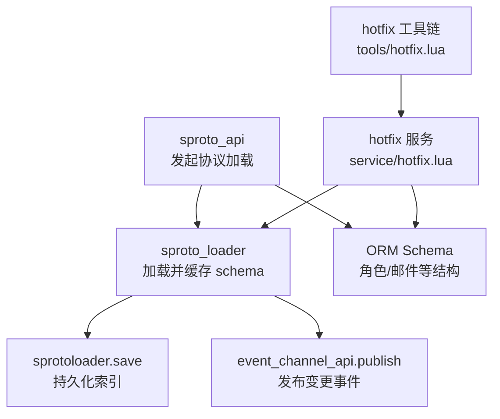
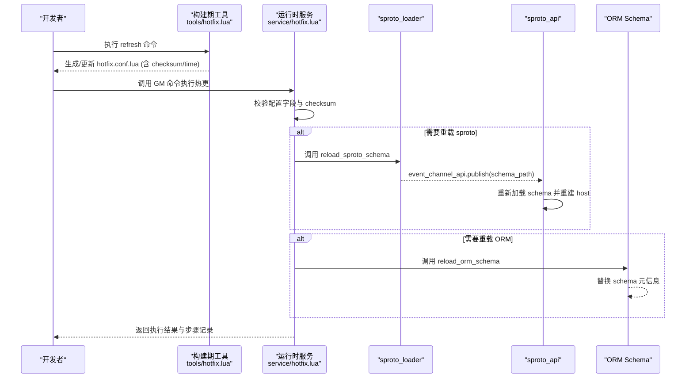
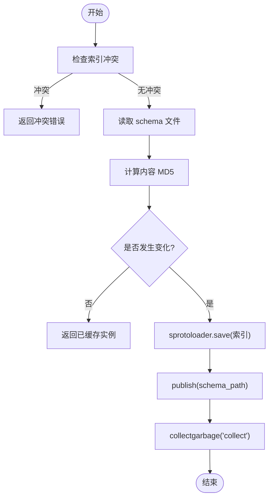
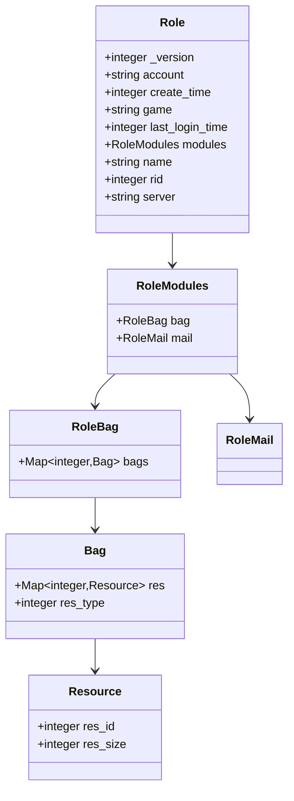
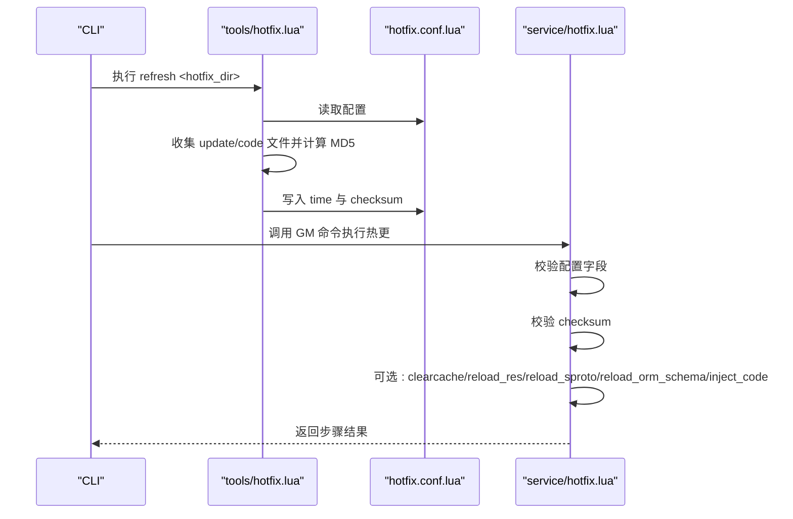
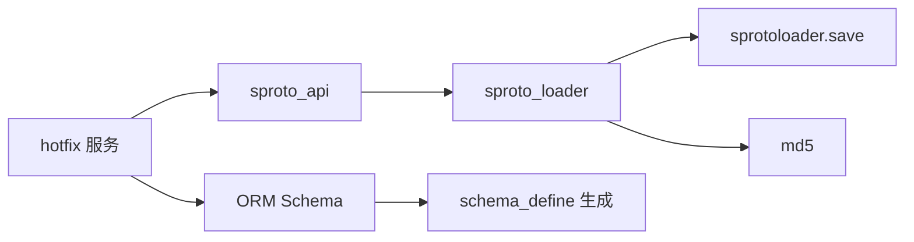
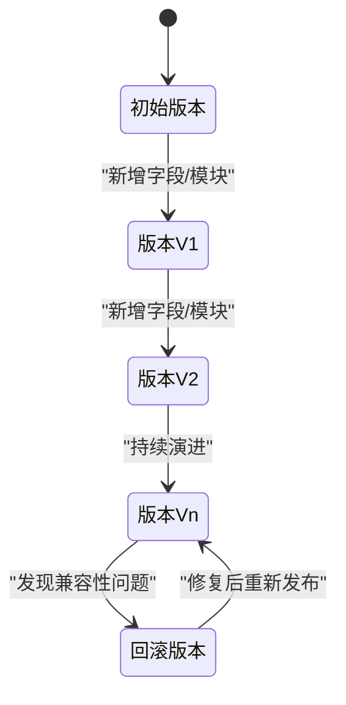
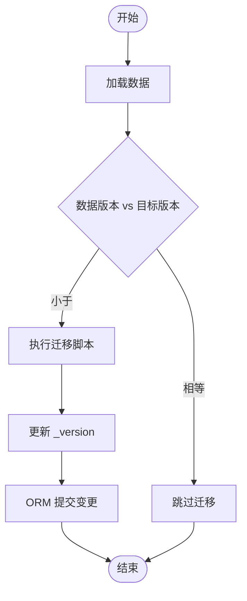

# 版本管理

<cite>
**本文引用的文件**
- [lualib/sproto_api.lua](file://lualib/sproto_api.lua)
- [service/sproto_loader.lua](file://service/sproto_loader.lua)
- [lualib/orm/init.lua](file://lualib/orm/init.lua)
- [lualib/orm/schema.lua](file://lualib/orm/schema.lua)
- [lualib/orm/schema_define.lua](file://lualib/orm/schema_define.lua)
- [schema/role.sproto](file://schema/role.sproto)
- [tools/hotfix.lua](file://tools/hotfix.lua)
- [service/hotfix.lua](file://service/hotfix.lua)
</cite>

## 目录
1. [简介](#简介)
2. [项目结构](#项目结构)
3. [核心组件](#核心组件)
4. [架构总览](#架构总览)
5. [详细组件分析](#详细组件分析)
6. [依赖关系分析](#依赖关系分析)
7. [性能考量](#性能考量)
8. [故障排除指南](#故障排除指南)
9. [结论](#结论)
10. [附录](#附录)

## 简介
本文件面向 SkyExt 框架的数据版本管理系统，聚焦 sproto 协议的版本控制机制与向后兼容策略，系统阐述数据迁移流程、版本升级工具与回滚机制，文档化版本检查规则与兼容性验证逻辑，并给出版本冲突检测与自动修复策略。同时提供版本演进图与迁移流程图，以及最佳实践与故障排除建议，帮助开发者安全、可控地进行协议与数据结构的演进。

## 项目结构
围绕版本管理的代码主要分布在以下模块：
- 协议加载与热重载：sproto_loader（服务）、sproto_api（客户端侧调用）
- ORM 数据模型与 Schema 管理：orm/init.lua、orm/schema.lua、orm/schema_define.lua
- 协议定义：schema/*.sproto（如 role.sproto）
- 热更新与校验：tools/hotfix.lua（构建期工具）、service/hotfix.lua（运行时执行器）

图表来源
- [lualib/sproto_api.lua:169-196](file://lualib/sproto_api.lua#L169-L196)
- [service/sproto_loader.lua:19-58](file://service/sproto_loader.lua#L19-L58)
- [lualib/orm/schema.lua:328-352](file://lualib/orm/schema.lua#L328-L352)
- [service/hotfix.lua:134-156](file://service/hotfix.lua#L134-L156)

章节来源
- [lualib/sproto_api.lua:169-196](file://lualib/sproto_api.lua#L169-L196)
- [service/sproto_loader.lua:19-58](file://service/sproto_loader.lua#L19-L58)
- [lualib/orm/schema.lua:328-352](file://lualib/orm/schema.lua#L328-L352)
- [service/hotfix.lua:134-156](file://service/hotfix.lua#L134-L156)

## 核心组件
- sproto_loader：负责读取、校验、保存 sproto schema，维护多索引版本，支持按路径热重载并通过事件通道通知订阅者。
- sproto_api：在进程启动时初始化 sproto loader 服务，订阅 schema 变更事件，动态重建 host 与发送函数，保证请求/响应编解码一致性。
- ORM Schema：由 schema_define 生成，定义数据结构与类型约束；提供 reload_schema 能力以在运行期替换 schema 元信息，配合数据层进行增量提交。
- hotfix 工具与服务：构建期计算 checksum 并写入配置；运行时校验配置完整性与内容一致性，按需清理缓存、重载资源、sproto 与 ORM schema，并注入补丁代码。

章节来源
- [service/sproto_loader.lua:19-58](file://service/sproto_loader.lua#L19-L58)
- [lualib/sproto_api.lua:169-196](file://lualib/sproto_api.lua#L169-L196)
- [lualib/orm/init.lua:461-481](file://lualib/orm/init.lua#L461-L481)
- [service/hotfix.lua:36-108](file://service/hotfix.lua#L36-L108)

## 架构总览
下图展示了从“热更包”到“协议与数据模型生效”的完整链路：构建期通过工具计算校验和并写入配置；运行时加载配置、校验一致性、选择性重载 sproto 与 ORM schema，并通过事件通道触发客户端侧重新绑定协议主机。

图表来源
- [tools/hotfix.lua:170-230](file://tools/hotfix.lua#L170-L230)
- [service/hotfix.lua:36-108](file://service/hotfix.lua#L36-L108)
- [service/hotfix.lua:134-156](file://service/hotfix.lua#L134-L156)
- [service/sproto_loader.lua:68-79](file://service/sproto_loader.lua#L68-L79)
- [lualib/sproto_api.lua:182-196](file://lualib/sproto_api.lua#L182-L196)

## 详细组件分析

### sproto 协议版本控制与热重载
- 版本标识与索引：sproto_loader 使用 sproto_index 区分不同 schema 版本，避免同一索引被重复覆盖。
- 冲突检测：若同一索引指向不同 schema_path，将直接拒绝并返回错误，防止隐式覆盖。
- 增量加载：基于文件内容 MD5 判断是否变化，未变化则复用已加载实例，减少开销。
- 事件驱动：加载成功后通过 event_channel_api.publish 广播 schema_path，sproto_api 订阅后重建 host 与发送函数，实现无侵入热重载。

图表来源
- [service/sproto_loader.lua:19-58](file://service/sproto_loader.lua#L19-L58)

章节来源
- [service/sproto_loader.lua:19-58](file://service/sproto_loader.lua#L19-L58)
- [lualib/sproto_api.lua:169-196](file://lualib/sproto_api.lua#L169-L196)

### ORM 数据模型与 Schema 热替换
- 模型定义：由 schema_define 生成 orm/schema.lua，为每个结构体提供类型校验、键解析与构造函数。
- 版本字段：role 与 role_mail 包含 _version 字段，用于标识数据版本，便于后续迁移与兼容性处理。
- 运行期替换：orm.reload_schema(old, new) 将新 schema 的字段描述拷贝至旧对象，保持内存引用稳定，避免大规模重建成本。
- 提交优化：commit_mongo 仅对变更字段生成 $set/$unset，降低网络与存储压力。

图表来源
- [lualib/orm/schema.lua:328-352](file://lualib/orm/schema.lua#L328-L352)
- [lualib/orm/schema.lua:369-384](file://lualib/orm/schema.lua#L369-L384)
- [lualib/orm/schema.lua:217-233](file://lualib/orm/schema.lua#L217-L233)
- [lualib/orm/schema.lua:310-326](file://lualib/orm/schema.lua#L310-L326)

章节来源
- [lualib/orm/schema.lua:328-352](file://lualib/orm/schema.lua#L328-L352)
- [lualib/orm/init.lua:461-481](file://lualib/orm/init.lua#L461-L481)
- [lualib/orm/init.lua:428-447](file://lualib/orm/init.lua#L428-L447)

### 热更新工具链与校验
- 构建期工具（tools/hotfix.lua）：
  - 读取 hotfix.conf.lua，收集 update_files 与 code_files 内容，计算合并内容的 MD5，并更新 time 与 checksum。
  - 提供 refresh 子命令，便于 CI/CD 流水线自动化生成校验信息。
- 运行时服务（service/hotfix.lua）：
  - 校验配置必填字段（desc、checksum、gitsha_base、gitsha_update、time）。
  - 校验实际内容与配置的 checksum 一致，不一致则中止。
  - 根据配置选择性执行：清理 Lua 缓存、重载资源、重载 sproto、重载 ORM schema、注入补丁代码。
  - 记录执行历史，支持查询最近 N 条记录。

图表来源
- [tools/hotfix.lua:170-230](file://tools/hotfix.lua#L170-L230)
- [service/hotfix.lua:36-108](file://service/hotfix.lua#L36-L108)
- [service/hotfix.lua:110-156](file://service/hotfix.lua#L110-L156)
- [service/hotfix.lua:229-289](file://service/hotfix.lua#L229-L289)

章节来源
- [tools/hotfix.lua:170-230](file://tools/hotfix.lua#L170-L230)
- [service/hotfix.lua:36-108](file://service/hotfix.lua#L36-L108)
- [service/hotfix.lua:110-156](file://service/hotfix.lua#L110-L156)
- [service/hotfix.lua:229-289](file://service/hotfix.lua#L229-L289)

### 版本检查规则与兼容性验证
- 协议层面：
  - 禁止删除字段、修改字段类型、修改字段名（见 schema/role.sproto 中的注释约定），确保二进制兼容。
  - 新增字段需遵循 sproto 的向后兼容原则（默认值语义）。
- 数据层面：
  - 通过 _version 字段标记数据版本，结合 ORM 提交时的增量更新，逐步完成数据迁移。
  - 使用 orm.reload_schema 在运行期平滑替换 schema 元信息，避免重启。
- 校验机制：
  - 构建期计算 checksum，运行时严格比对，防止误发或篡改。
  - sproto_loader 的索引冲突检测避免同一索引被不同 schema 覆盖。

章节来源
- [schema/role.sproto:20-24](file://schema/role.sproto#L20-L24)
- [lualib/orm/schema.lua:328-352](file://lualib/orm/schema.lua#L328-L352)
- [lualib/orm/init.lua:461-481](file://lualib/orm/init.lua#L461-L481)
- [service/sproto_loader.lua:22-31](file://service/sproto_loader.lua#L22-L31)

### 版本冲突检测与自动修复策略
- 冲突检测：
  - sproto_loader 在同一索引下检测到 schema_path 不一致时立即报错，阻止覆盖。
  - hotfix 服务在 checksum 不匹配时中止流程，避免不一致状态。
- 自动修复：
  - 通过事件通道触发 sproto_api 重新加载 schema，无需重启进程。
  - 使用 orm.reload_schema 将新 schema 描述注入现有对象，保持引用稳定。
  - 建议在热更前执行 clearcache，确保 Lua 代码层最新。

章节来源
- [service/sproto_loader.lua:22-31](file://service/sproto_loader.lua#L22-L31)
- [lualib/sproto_api.lua:182-196](file://lualib/sproto_api.lua#L182-L196)
- [lualib/orm/init.lua:461-481](file://lualib/orm/init.lua#L461-L481)
- [service/hotfix.lua:110-120](file://service/hotfix.lua#L110-L120)

### 数据迁移流程与回滚机制
- 迁移流程：
  - 在业务逻辑中读取数据的 _version，对比目标版本，执行必要的字段补齐或类型转换。
  - 使用 ORM 的 commit_mongo 仅提交变更字段，减少写放大。
  - 通过 hotfix 流程统一触发 sproto 与 ORM schema 的重载，保证编解码与校验一致。
- 回滚机制：
  - 利用 hotfix 历史与 checksum 可定位问题版本；必要时回退到上一个稳定版本的 hotfix 包。
  - 由于 sproto_loader 基于索引与 checksum 保护，回滚时不会发生索引冲突。
  - 建议在关键变更前备份数据或保留可逆的迁移脚本。

章节来源
- [lualib/orm/init.lua:428-447](file://lualib/orm/init.lua#L428-L447)
- [service/hotfix.lua:291-416](file://service/hotfix.lua#L291-L416)
- [service/hotfix.lua:418-449](file://service/hotfix.lua#L418-L449)

## 依赖关系分析
- sproto_api 依赖 sproto_loader 提供的唯一服务地址，通过 skynet.uniqueservice 获取。
- sproto_loader 依赖 sprotoloader.save 持久化索引，依赖 md5 计算内容校验。
- hotfix 服务依赖 gm_api 与 cmd_api 暴露 GM 命令，依赖 util_io/util_path 进行文件操作。
- ORM schema 由 schema_define 生成，依赖 orm 基础能力进行类型校验与提交。

图表来源
- [lualib/sproto_api.lua:188-196](file://lualib/sproto_api.lua#L188-L196)
- [service/sproto_loader.lua:1-7](file://service/sproto_loader.lua#L1-L7)
- [service/hotfix.lua:1-7](file://service/hotfix.lua#L1-L7)
- [lualib/orm/schema.lua:1-4](file://lualib/orm/schema.lua#L1-L4)

章节来源
- [lualib/sproto_api.lua:188-196](file://lualib/sproto_api.lua#L188-L196)
- [service/sproto_loader.lua:1-7](file://service/sproto_loader.lua#L1-L7)
- [service/hotfix.lua:1-7](file://service/hotfix.lua#L1-L7)
- [lualib/orm/schema.lua:1-4](file://lualib/orm/schema.lua#L1-L4)

## 性能考量
- 增量加载：sproto_loader 基于 MD5 判断是否变化，避免重复编译与保存。
- 事件驱动：通过事件通道解耦加载与使用方，减少阻塞。
- 提交优化：ORM 仅提交变更字段，降低网络与存储压力。
- 垃圾回收：加载完成后主动 collectgarbage("collect")，释放旧对象内存。

[本节为通用性能讨论，不直接分析具体文件]

## 故障排除指南
- 协议索引冲突：
  - 现象：加载时报错提示索引冲突。
  - 排查：确认同一 sproto_index 是否对应不同的 schema_path。
  - 解决：修正配置或调整索引分配。
- 校验失败：
  - 现象：hotfix 执行时报 checksum 不匹配。
  - 排查：确认构建期工具是否正确计算并写入 checksum。
  - 解决：重新执行 refresh，确保 update/code 文件列表一致。
- 热重载无效：
  - 现象：reload_sproto_schema 后仍使用旧协议。
  - 排查：确认 sproto_api 是否订阅了事件通道并成功重建 host。
  - 解决：检查事件通道订阅与回调执行日志。
- ORM 字段校验错误：
  - 现象：写入时报类型不匹配。
  - 排查：核对 schema 定义与数据源类型。
  - 解决：修正数据或更新 schema 并执行 reload_schema。

章节来源
- [service/sproto_loader.lua:22-31](file://service/sproto_loader.lua#L22-L31)
- [service/hotfix.lua:71-108](file://service/hotfix.lua#L71-L108)
- [lualib/sproto_api.lua:182-196](file://lualib/sproto_api.lua#L182-L196)
- [lualib/orm/schema.lua:156-185](file://lualib/orm/schema.lua#L156-L185)

## 结论
SkyExt 的版本管理通过“构建期校验 + 运行期热重载”的组合，实现了 sproto 协议与 ORM 数据模型的平滑演进。借助索引冲突检测、checksum 校验、事件驱动与增量提交，系统在保障兼容性的同时兼顾了性能与可维护性。建议在生产环境中严格遵循“只增不改”的协议演进原则，并结合热更新工具链进行灰度发布与快速回滚。

[本节为总结性内容，不直接分析具体文件]

## 附录

### 版本演进图（概念示意）

[此图为概念示意，不映射具体源码]

### 迁移流程图（概念示意）

[此图为概念示意，不映射具体源码]