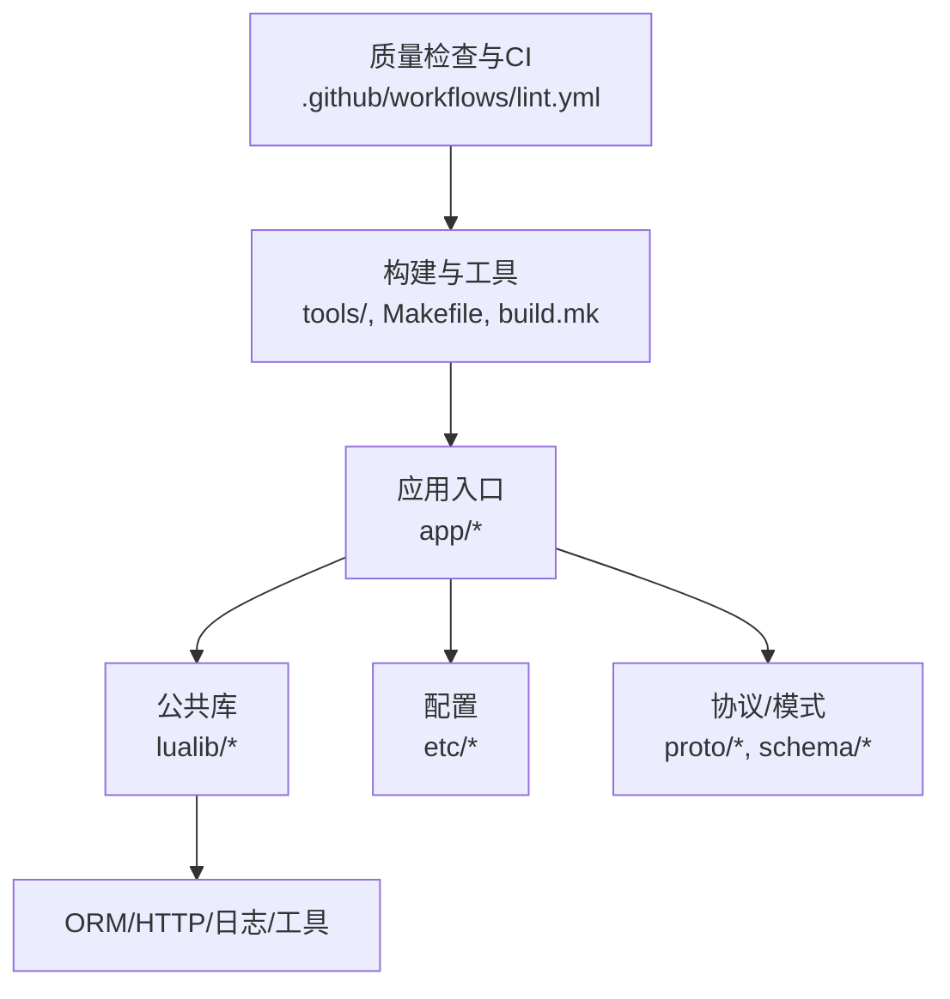
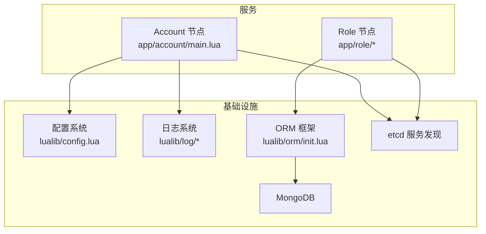
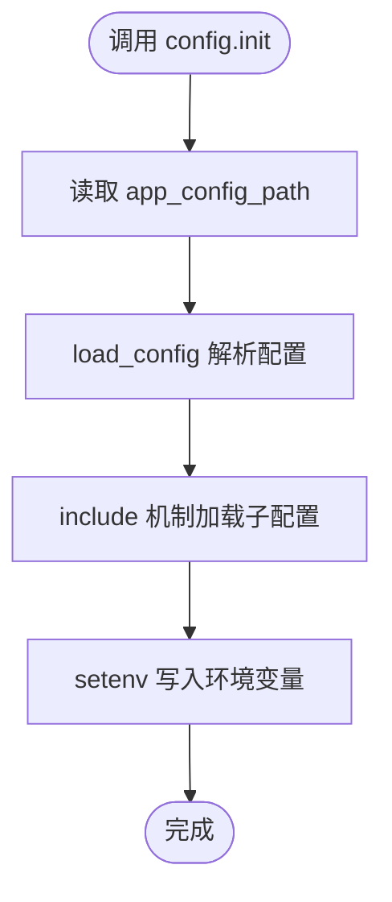
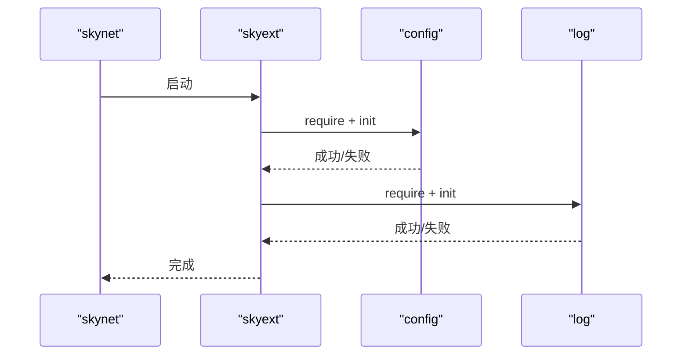
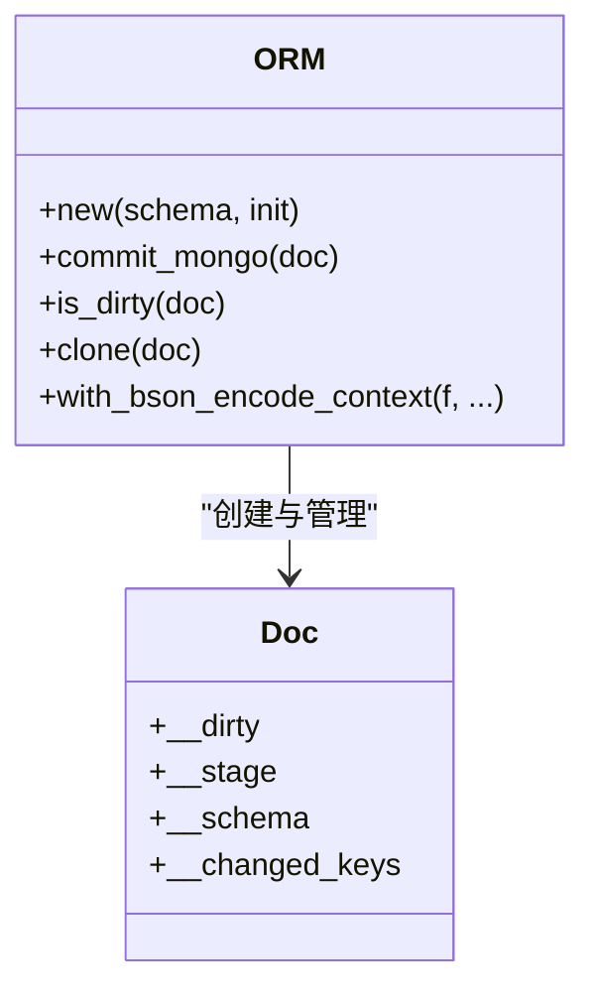
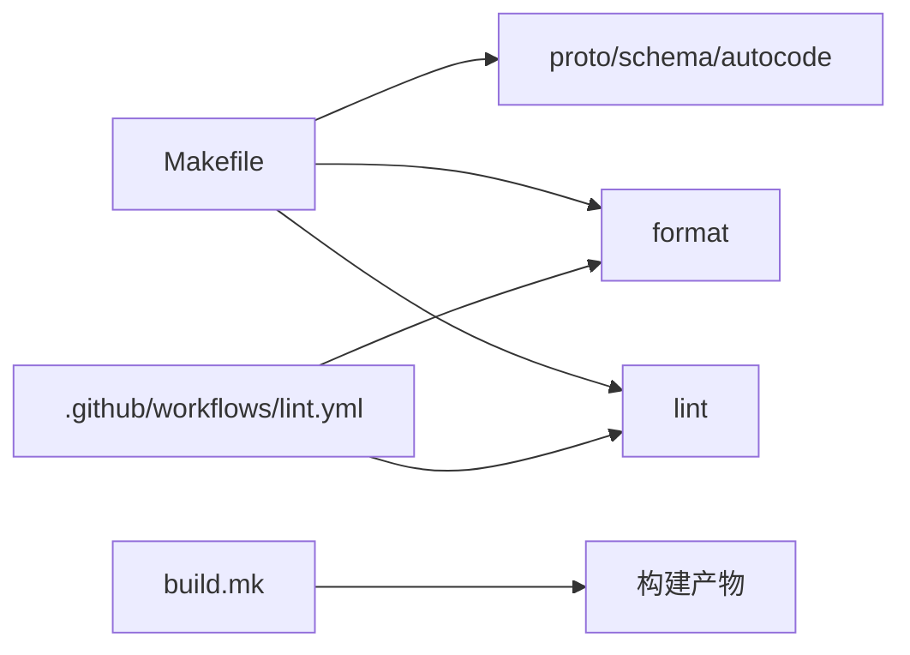

# 代码质量

<cite>
**本文引用的文件**
- [README.md](file://README.md)
- [Makefile](file://Makefile)
- [build.mk](file://build.mk)
- [.luacheckrc](file://.luacheckrc)
- [.stylua.toml](file://.stylua.toml)
- [.styluaignore](file://.styluaignore)
- [.github/workflows/lint.yml](file://.github/workflows/lint.yml)
- [lualib/skyext.lua](file://lualib/skyext.lua)
- [lualib/config.lua](file://lualib/config.lua)
- [lualib/util/table.lua](file://lualib/util/table.lua)
- [app/account/main.lua](file://app/account/main.lua)
- [test/test_etcd/main.lua](file://test/test_etcd/main.lua)
- [lualib/orm/init.lua](file://lualib/orm/init.lua)
</cite>

## 目录
1. [简介](#简介)
2. [项目结构](#项目结构)
3. [核心组件](#核心组件)
4. [架构总览](#架构总览)
5. [详细组件分析](#详细组件分析)
6. [依赖关系分析](#依赖关系分析)
7. [性能考虑](#性能考虑)
8. [故障排查指南](#故障排查指南)
9. [结论](#结论)
10. [附录](#附录)

## 简介
本指南面向 SkyExt 框架的开发者，提供统一的代码质量规范与流程，涵盖编码风格、命名约定、注释规范、静态检查与格式化、模块化设计原则、接口设计规范、单元测试编写与覆盖率要求、重构建议与反模式识别，并给出具体配置与示例路径。目标是提升可维护性、可扩展性与团队协作效率。

## 项目结构
SkyExt 采用分层与模块化组织：
- 应用入口位于 app/，按服务划分（account、role、robot）
- 公共库位于 lualib/，包含 ORM、HTTP、日志、工具等
- 协议与数据模式位于 proto/ 与 schema/
- 配置文件位于 etc/，分为节点配置与应用配置
- 构建与工具脚本位于 tools/ 与 Makefile/build.mk
- 测试用例位于 test/
- 质量检查与 CI 在 .github/workflows/ 与根级配置文件

图表来源
- [Makefile:21-42](file://Makefile#L21-L42)
- [build.mk:87-90](file://build.mk#L87-L90)
- [.github/workflows/lint.yml:17-32](file://.github/workflows/lint.yml#L17-L32)

章节来源
- [README.md:112-130](file://README.md#L112-L130)
- [Makefile:1-47](file://Makefile#L1-L47)
- [build.mk:1-106](file://build.mk#L1-L106)

## 核心组件
- 配置系统：统一读取与缓存环境变量与应用配置，支持类型化访问与表序列化
- 启动与初始化：框架扩展模块负责加载配置与日志，覆盖 assert/error 以增强错误追踪
- 工具库：提供深拷贝、表操作、字符串化等常用能力
- ORM：基于元表的文档对象模型，支持脏标记、增量提交与 BSON 序列化上下文
- 服务入口：Account 节点启动 HTTP 服务并注册路由

章节来源
- [lualib/config.lua:1-145](file://lualib/config.lua#L1-L145)
- [lualib/skyext.lua:1-81](file://lualib/skyext.lua#L1-L81)
- [lualib/util/table.lua:1-169](file://lualib/util/table.lua#L1-L169)
- [lualib/orm/init.lua:1-491](file://lualib/orm/init.lua#L1-L491)
- [app/account/main.lua:1-25](file://app/account/main.lua#L1-L25)

## 架构总览
SkyExt 基于 skynet 的微服务架构，Account 节点暴露 HTTP 接口，Role 节点处理角色逻辑，通过 etcd 进行服务发现，MongoDB 持久化数据。ORM 层对文档变更进行追踪并提交至数据库。

图表来源
- [app/account/main.lua:1-25](file://app/account/main.lua#L1-L25)
- [lualib/config.lua:120-145](file://lualib/config.lua#L120-L145)
- [lualib/orm/init.lua:315-491](file://lualib/orm/init.lua#L315-L491)

## 详细组件分析

### 配置系统（config）
- 职责：加载应用配置、缓存、类型化访问、将表序列化为环境变量
- 关键点：
  - init() 解析 app_config_path，执行 include 机制，设置全局环境变量
  - get/get_boolean/get_number/get_table 提供类型安全访问
  - serialize/load_config 支持嵌套结构与变量替换
- 建议：
  - 所有配置项应在配置文件中显式声明默认值或必填校验
  - 避免在运行时动态修改已缓存的配置

图表来源
- [lualib/config.lua:88-145](file://lualib/config.lua#L88-L145)

章节来源
- [lualib/config.lua:1-145](file://lualib/config.lua#L1-L145)

### 启动与初始化（skyext）
- 职责：提前 require sharetable，重载 table.* 以适配 ORM 元方法；加载配置与日志；覆盖 assert/error
- 关键点：
  - 覆盖 next/unpack/concat/insert/remove 以支持 ORM 文档对象
  - 启动时加载配置与日志，失败则直接 error
- 建议：
  - 保持最小化初始化逻辑，避免引入副作用
  - 错误信息应包含上下文以便定位问题

图表来源
- [lualib/skyext.lua:1-81](file://lualib/skyext.lua#L1-L81)
- [lualib/config.lua:120-145](file://lualib/config.lua#L120-L145)

章节来源
- [lualib/skyext.lua:1-81](file://lualib/skyext.lua#L1-L81)

### 工具库（util.table）
- 职责：提供深拷贝、键值提取、大小统计、清空、合并、字符串化、数组查找等
- 关键点：
  - deepcopy 使用 copies 表防止循环引用
  - tostring 实现限制最大元素数量以避免过大输出
- 建议：
  - 对外暴露稳定 API，内部函数保持私有
  - 对大表操作需考虑性能与内存占用

章节来源
- [lualib/util/table.lua:1-169](file://lualib/util/table.lua#L1-L169)

### ORM 框架（orm）
- 职责：文档对象模型，字段校验、脏标记、增量提交、BSON 序列化上下文
- 关键点：
  - new(schema, init) 创建文档对象，__newindex 拦截变更
  - commit_mongo 生成 $set/$unset 增量更新
  - with_bson_encode_context 切换迭代器以兼容 BSON 键名规则
- 建议：
  - 使用 orm.check_type 确保传入的是 ORM 文档
  - 谨慎使用 clone，避免深层复制开销

图表来源
- [lualib/orm/init.lua:234-491](file://lualib/orm/init.lua#L234-L491)

章节来源
- [lualib/orm/init.lua:1-491](file://lualib/orm/init.lua#L1-L491)

### Account 服务入口
- 职责：启动 HTTP 服务，读取端口与代理数，注册路由
- 关键点：
  - 从配置获取 account_http_port 与 account_agent_count
  - 使用 http_server.start 与 register_router
- 建议：
  - 启动参数应有默认值与边界校验
  - 路由注册失败时应记录错误并退出

章节来源
- [app/account/main.lua:1-25](file://app/account/main.lua#L1-L25)

### 测试示例（etcd）
- 职责：演示 etcd 客户端的使用与服务间通信
- 关键点：
  - 通过 config.get_table 获取 etcd 配置
  - 使用 timer 定时任务与 cmd_api 分发命令
- 建议：
  - 测试用例应隔离环境，使用独立命名空间
  - 断言应覆盖成功与失败路径

章节来源
- [test/test_etcd/main.lua:1-53](file://test/test_etcd/main.lua#L1-L53)

## 依赖关系分析
- 构建与工具：
  - Makefile 提供 proto/schema/autocode/format/lint/dist 等目标
  - build.mk 负责平台检测、C 扩展编译与二进制产物
- 质量检查：
  - luacheck 与 StyLua 在本地与 CI 中统一执行
  - 忽略规则与排除目录明确，保证第三方与框架代码不受影响

图表来源
- [Makefile:21-42](file://Makefile#L21-L42)
- [build.mk:87-90](file://build.mk#L87-L90)
- [.github/workflows/lint.yml:24-32](file://.github/workflows/lint.yml#L24-L32)

章节来源
- [Makefile:1-47](file://Makefile#L1-L47)
- [build.mk:1-106](file://build.mk#L1-L106)
- [.github/workflows/lint.yml:1-33](file://.github/workflows/lint.yml#L1-L33)

## 性能考虑
- 配置缓存：config 模块对读取结果进行缓存，减少重复 I/O
- ORM 增量提交：仅提交变更字段，降低网络与存储开销
- 表字符串化：tostring 限制最大元素数量，避免内存爆炸
- 工具库深拷贝：使用 copies 表避免循环引用导致的无限递归

[本节为通用指导，不直接分析具体文件]

## 故障排查指南
- 配置加载失败：
  - 检查 app_config_path 是否存在且可读
  - 确认 include 路径与变量替换正确
- 日志初始化失败：
  - 检查 log_level 与相关布尔开关
  - 查看是否覆盖了 _G.assert/_G.error 导致堆栈异常
- ORM 提交异常：
  - 使用 orm.is_dirty 判断是否有变更
  - 使用 with_bson_encode_context 确保键名合法
- 服务启动异常：
  - 检查端口与代理数配置
  - 查看路由注册是否成功

章节来源
- [lualib/config.lua:120-145](file://lualib/config.lua#L120-L145)
- [lualib/skyext.lua:61-81](file://lualib/skyext.lua#L61-L81)
- [lualib/orm/init.lua:315-491](file://lualib/orm/init.lua#L315-L491)
- [app/account/main.lua:1-25](file://app/account/main.lua#L1-L25)

## 结论
通过统一的编码规范、严格的静态检查与格式化、清晰的模块化设计与接口契约、完善的测试与覆盖率要求，以及持续的重构与反模式治理，SkyExt 能够保持高可维护性与可扩展性。建议在团队内推广本指南，并在 CI 中强制执行质量门禁。

[本节为总结，不直接分析具体文件]

## 附录

### 编码规范与风格标准
- 命名约定
  - 模块返回表使用大写前缀或文件名一致（如 M）
  - 函数与变量使用小写下划线分隔
  - 常量使用全大写下划线分隔
- 代码格式化
  - 使用 StyLua 统一格式，列宽 120，缩进 4 空格，双引号优先
  - 忽略第三方与框架目录，避免污染
- 注释规范
  - 模块级说明与关键函数注释应描述用途、参数与返回值
  - 复杂逻辑添加行内注释解释意图而非复述代码

章节来源
- [.stylua.toml:1-8](file://.stylua.toml#L1-L8)
- [.styluaignore:1-4](file://.styluaignore#L1-L4)

### 代码审查流程与检查工具
- 本地流程
  - 运行 make format 格式化代码
  - 运行 make lint 执行 luacheck 检查
- CI 流程
  - GitHub Actions 在 push/PR 到 main 分支时执行 luacheck 与 StyLua --check
- 规则配置
  - luacheck 启用 max std，忽略未用参数与重定义，允许特定全局变量
  - 排除 3rd、etc、skynet 目录

章节来源
- [Makefile:34-42](file://Makefile#L34-L42)
- [.luacheckrc:1-26](file://.luacheckrc#L1-L26)
- [.github/workflows/lint.yml:24-32](file://.github/workflows/lint.yml#L24-L32)

### 模块化设计与接口设计规范
- 模块职责单一，接口清晰稳定
- 对外暴露最小必要 API，内部实现隐藏
- 使用 ORM 文档对象作为数据载体，确保类型与变更追踪
- 配置集中管理，避免散落的魔法字符串

章节来源
- [lualib/orm/init.lua:234-491](file://lualib/orm/init.lua#L234-L491)
- [lualib/config.lua:1-145](file://lualib/config.lua#L1-L145)

### 单元测试编写指南与覆盖率要求
- 编写要点
  - 每个模块至少覆盖正常路径与异常路径
  - 使用模拟外部依赖（如 etcd、MongoDB）
  - 断言明确，避免模糊匹配
- 覆盖率要求
  - 新增代码行覆盖率不低于 80%
  - 关键路径（配置、ORM、HTTP）覆盖率不低于 90%
- 示例参考
  - 参考 test/test_etcd/main.lua 的服务间通信与定时器用法

章节来源
- [test/test_etcd/main.lua:1-53](file://test/test_etcd/main.lua#L1-L53)

### 重构建议与反模式识别
- 重构建议
  - 将重复逻辑抽取为工具函数或模块
  - 使用 ORM 替代裸表操作，提升类型安全
  - 配置项增加默认值与校验，避免 nil 传播
- 反模式识别
  - 避免全局状态滥用，改用模块级单例或依赖注入
  - 避免过深的条件嵌套，使用早返回与策略模式
  - 避免在大表中频繁插入删除，考虑数据结构优化

[本节为通用指导，不直接分析具体文件]

### 具体代码示例与质量检查配置
- 格式化配置
  - 列宽、缩进、引号风格、括号风格已在 .stylua.toml 中定义
- 静态检查配置
  - luacheck 规则与忽略项在 .luacheckrc 中定义
- 构建与自动化
  - Makefile 提供 format 与 lint 目标
  - CI 在 PR/Push 时执行检查

章节来源
- [.stylua.toml:1-8](file://.stylua.toml#L1-L8)
- [.luacheckrc:1-26](file://.luacheckrc#L1-L26)
- [Makefile:34-42](file://Makefile#L34-L42)
- [.github/workflows/lint.yml:24-32](file://.github/workflows/lint.yml#L24-L32)