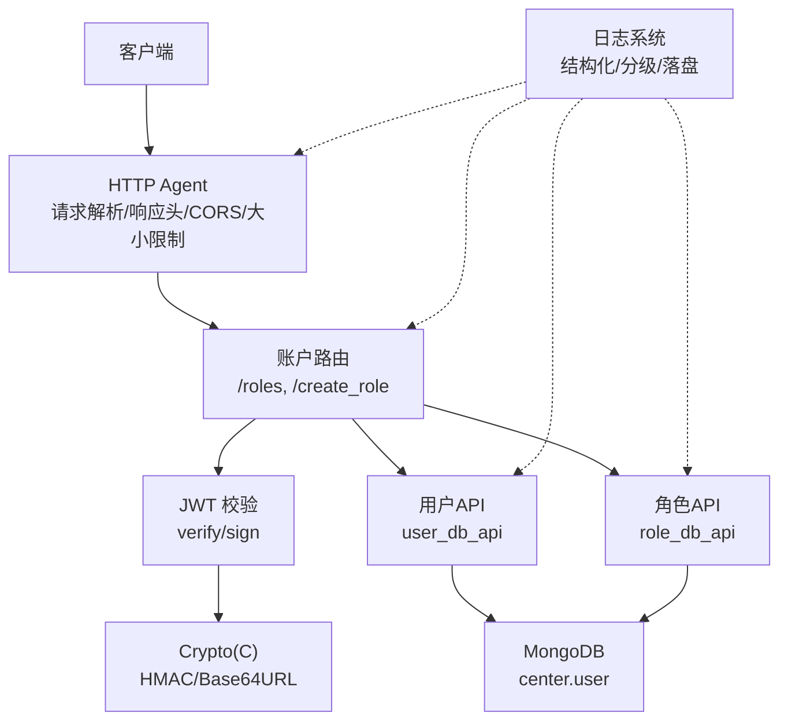
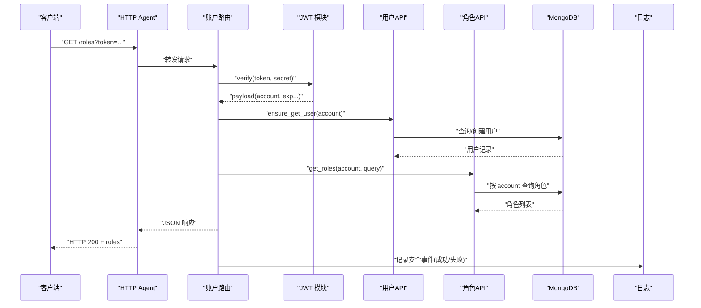
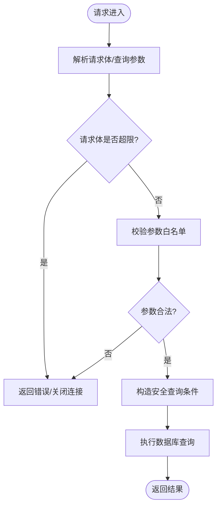
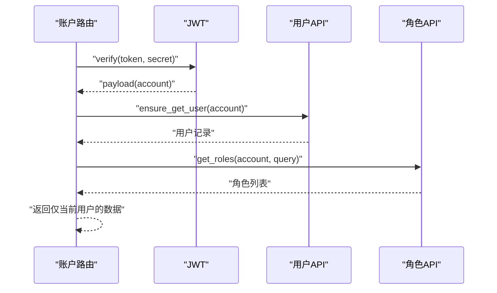
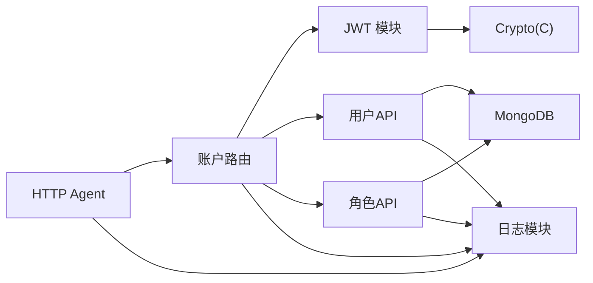

# 安全考虑

<cite>
**本文引用的文件**
- [lualib/jwt.lua](file://lualib/jwt.lua)
- [lualib-src/crypto.c](file://lualib-src/crypto.c)
- [app/account/lualib/account_router.lua](file://app/account/lualib/account_router.lua)
- [lualib/http_server/agent.lua](file://lualib/http_server/agent.lua)
- [lualib/user_db_api.lua](file://lualib/user_db_api.lua)
- [lualib/role_db_api.lua](file://lualib/role_db_api.lua)
- [etc/app/common.app.lua](file://etc/app/common.app.lua)
- [lualib/log/logger.lua](file://lualib/log/logger.lua)
- [lualib/errcode.lua](file://lualib/errcode.lua)
- [lualib/etcd.lua](file://lualib/etcd.lua)
- [app/role/login/client.lua](file://app/role/login/client.lua)
</cite>

## 目录
1. [简介](#简介)
2. [项目结构与安全相关组件](#项目结构与安全相关组件)
3. [核心安全能力总览](#核心安全能力总览)
4. [架构概览](#架构概览)
5. [详细组件分析](#详细组件分析)
6. [依赖关系分析](#依赖关系分析)
7. [性能与可用性考量](#性能与可用性考量)
8. [故障排查指南](#故障排查指南)
9. [结论](#结论)
10. [附录：配置与修复清单](#附录：配置与修复清单)

## 简介
本指南面向 SkyExt 框架的安全实践，聚焦输入验证、访问控制、数据安全、会话安全、审计日志与漏洞修复。文档基于仓库现有实现进行梳理，并给出可操作的加固建议与示例路径，帮助开发者在业务中落地安全方案。

## 项目结构与安全相关组件
SkyExt 的安全能力分布在以下模块：
- HTTP 服务与路由：负责请求解析、响应头设置、CORS、请求体大小限制等
- 认证与授权：JWT 签发与校验、登录中间件、角色/用户数据隔离
- 数据存储：MongoDB 连接与集合操作、索引约束
- 加密与签名：HMAC-SHA256/512、Base64URL 编解码（基于 libsodium）
- 日志与审计：结构化日志、错误堆栈、日志分级与落盘
- 配置管理：密钥、超时、限流等安全参数集中配置

图表来源
- [lualib/http_server/agent.lua:31-118](file://lualib/http_server/agent.lua#L31-L118)
- [app/account/lualib/account_router.lua:24-140](file://app/account/lualib/account_router.lua#L24-L140)
- [lualib/jwt.lua:17-100](file://lualib/jwt.lua#L17-L100)
- [lualib-src/crypto.c:102-160](file://lualib-src/crypto.c#L102-L160)
- [lualib/user_db_api.lua:12-80](file://lualib/user_db_api.lua#L12-L80)
- [lualib/role_db_api.lua:12-84](file://lualib/role_db_api.lua#L12-L84)
- [lualib/log/logger.lua:119-148](file://lualib/log/logger.lua#L119-L148)

章节来源
- [lualib/http_server/agent.lua:31-118](file://lualib/http_server/agent.lua#L31-L118)
- [app/account/lualib/account_router.lua:24-140](file://app/account/lualib/account_router.lua#L24-L140)
- [lualib/jwt.lua:17-100](file://lualib/jwt.lua#L17-L100)
- [lualib-src/crypto.c:102-160](file://lualib-src/crypto.c#L102-L160)
- [lualib/user_db_api.lua:12-80](file://lualib/user_db_api.lua#L12-L80)
- [lualib/role_db_api.lua:12-84](file://lualib/role_db_api.lua#L12-L84)
- [lualib/log/logger.lua:119-148](file://lualib/log/logger.lua#L119-L148)

## 核心安全能力总览
- 输入验证与过滤
  - HTTP 请求体大小限制：通过配置项限制最大请求体大小，避免超大负载攻击
  - JSON 解析：使用安全 JSON 库解析请求体，异常时返回错误码
  - 查询参数校验：对 server 等参数做白名单校验，防止非法值进入数据库查询
- 访问控制与授权
  - JWT Token 校验：所有敏感接口均要求携带有效 token，服务端校验签名与有效期
  - 登录中间件：游戏服登录流程提供中间件，未认证请求直接拒绝
  - 资源隔离：按 account 维度查询角色列表，确保仅能访问自身数据
- 数据安全
  - 传输安全：HTTP 服务支持 CORS，生产环境应限制来源；建议启用 HTTPS（由反向代理保障）
  - 存储安全：MongoDB 集合建立唯一索引，避免重复键冲突；敏感字段建议在应用层加密后落库
  - 日志脱敏：结构化日志记录关键上下文，避免输出完整 token、密码等敏感信息
- 会话安全
  - Token 过期策略：JWT 包含 iat/exp/nbf，服务端严格校验时间窗口
  - 刷新机制：etcd 客户端自动刷新内部鉴权 token，降低频繁认证开销
  - 超时处理：登录超时、请求体大小限制、重试退避等
- 审计与日志
  - 统一日志框架：结构化事件、堆栈追踪、分级输出、文件轮转
  - 安全事件：失败认证、越权访问、数据库异常等均记录告警级别日志

章节来源
- [lualib/http_server/agent.lua:20-56](file://lualib/http_server/agent.lua#L20-L56)
- [app/account/lualib/account_router.lua:24-140](file://app/account/lualib/account_router.lua#L24-L140)
- [lualib/jwt.lua:17-100](file://lualib/jwt.lua#L17-L100)
- [app/role/login/client.lua:55-73](file://app/role/login/client.lua#L55-L73)
- [lualib/user_db_api.lua:12-80](file://lualib/user_db_api.lua#L12-L80)
- [lualib/role_db_api.lua:12-84](file://lualib/role_db_api.lua#L12-L84)
- [lualib/log/logger.lua:119-148](file://lualib/log/logger.lua#L119-L148)
- [lualib/etcd.lua:299-353](file://lualib/etcd.lua#L299-L353)

## 架构概览
下图展示了从客户端到后端服务的典型安全调用链：HTTP 接收请求 -> 路由校验 -> JWT 验证 -> 数据访问 -> 日志记录。

图表来源
- [lualib/http_server/agent.lua:31-118](file://lualib/http_server/agent.lua#L31-L118)
- [app/account/lualib/account_router.lua:24-140](file://app/account/lualib/account_router.lua#L24-L140)
- [lualib/jwt.lua:17-100](file://lualib/jwt.lua#L17-L100)
- [lualib/user_db_api.lua:12-80](file://lualib/user_db_api.lua#L12-L80)
- [lualib/role_db_api.lua:12-84](file://lualib/role_db_api.lua#L12-L84)
- [lualib/log/logger.lua:119-148](file://lualib/log/logger.lua#L119-L148)

## 详细组件分析

### 输入验证与过滤
- 请求体大小限制：HTTP Agent 读取请求时受配置项限制，超过阈值将拒绝或报错，避免内存耗尽
- JSON 解析：使用 cjson.safe 解析请求体，解析失败时返回错误码，避免注入风险
- 查询参数白名单：server 参数需存在于 server2game 映射中，否则拒绝，防止非法服务器名进入查询条件
- 数据库查询构造：通过 API 层组装查询条件，避免拼接字符串导致的注入风险

图表来源
- [lualib/http_server/agent.lua:20-56](file://lualib/http_server/agent.lua#L20-L56)
- [app/account/lualib/account_router.lua:38-47](file://app/account/lualib/account_router.lua#L38-L47)
- [lualib/role_db_api.lua:12-42](file://lualib/role_db_api.lua#L12-L42)

章节来源
- [lualib/http_server/agent.lua:20-56](file://lualib/http_server/agent.lua#L20-L56)
- [app/account/lualib/account_router.lua:38-47](file://app/account/lualib/account_router.lua#L38-L47)
- [lualib/role_db_api.lua:12-42](file://lualib/role_db_api.lua#L12-L42)

### 权限控制与访问授权
- JWT 校验：所有敏感接口必须携带 token，服务端使用 HMAC 算法校验签名与有效期
- 登录中间件：游戏服登录流程提供中间件，未认证请求直接拒绝，减少未授权访问面
- 资源隔离：按 account 维度查询角色，确保用户只能访问自己的数据
- 错误码规范：统一错误码定义，便于前端提示与审计统计

图表来源
- [app/account/lualib/account_router.lua:24-140](file://app/account/lualib/account_router.lua#L24-L140)
- [lualib/jwt.lua:17-100](file://lualib/jwt.lua#L17-L100)
- [lualib/user_db_api.lua:12-80](file://lualib/user_db_api.lua#L12-L80)
- [lualib/role_db_api.lua:12-84](file://lualib/role_db_api.lua#L12-L84)

章节来源
- [app/account/lualib/account_router.lua:24-140](file://app/account/lualib/account_router.lua#L24-L140)
- [lualib/jwt.lua:17-100](file://lualib/jwt.lua#L17-L100)
- [app/role/login/client.lua:55-73](file://app/role/login/client.lua#L55-L73)
- [lualib/errcode.lua:1-29](file://lualib/errcode.lua#L1-L29)

### 数据安全保护措施
- 传输加密：HTTP 服务默认允许跨域，生产环境应限制来源；建议通过反向代理启用 HTTPS
- 存储加密：敏感字段（如密码、令牌）应在应用层加密后再写入数据库；当前 MongoDB 配置支持用户名/密码认证
- 日志脱敏：结构化日志记录关键上下文，避免输出完整 token、密码等敏感信息；错误日志包含堆栈便于定位
- 索引约束：为 user.account、role.rid 等字段建立唯一索引，防止重复键冲突与数据污染

章节来源
- [etc/app/common.app.lua:31-72](file://etc/app/common.app.lua#L31-L72)
- [lualib/log/logger.lua:119-148](file://lualib/log/logger.lua#L119-L148)
- [lualib/user_db_api.lua:12-80](file://lualib/user_db_api.lua#L12-L80)
- [lualib/role_db_api.lua:12-84](file://lualib/role_db_api.lua#L12-L84)

### 会话安全管理最佳实践
- Token 有效期：JWT 包含 iat/exp/nbf，服务端严格校验时间窗口，防止重放与过期使用
- 刷新机制：etcd 客户端自动刷新内部鉴权 token，降低频繁认证开销，同时具备重试与错误缓存
- 超时处理：登录超时、请求体大小限制、重试退避等，避免长时间占用资源
- 防固定攻击：建议使用一次性 nonce 或绑定设备指纹（需在业务层扩展），并在服务端维护黑名单

章节来源
- [lualib/jwt.lua:17-100](file://lualib/jwt.lua#L17-L100)
- [lualib/etcd.lua:299-353](file://lualib/etcd.lua#L299-L353)
- [lualib/http_server/agent.lua:20-56](file://lualib/http_server/agent.lua#L20-L56)

### 安全审计与日志记录建议
- 统一日志框架：结构化事件、堆栈追踪、分级输出、文件轮转
- 安全事件：失败认证、越权访问、数据库异常等均记录告警级别日志
- 日志脱敏：避免输出完整 token、密码等敏感信息；对大对象进行截断
- 监控与告警：结合日志聚合平台，对高频错误、异常 IP、暴力破解等行为进行告警

章节来源
- [lualib/log/logger.lua:119-148](file://lualib/log/logger.lua#L119-L148)
- [app/account/lualib/account_router.lua:24-140](file://app/account/lualib/account_router.lua#L24-L140)

## 依赖关系分析
- HTTP Agent 依赖配置项控制请求体大小与响应头
- 账户路由依赖 JWT 模块进行认证，依赖用户/角色 API 进行数据访问
- JWT 模块依赖底层 crypto 模块进行 HMAC 与 Base64URL 编解码
- 用户/角色 API 依赖 MongoDB 连接，使用索引保证数据一致性
- 日志模块被各层复用，记录安全事件与调试信息

图表来源
- [lualib/http_server/agent.lua:31-118](file://lualib/http_server/agent.lua#L31-L118)
- [app/account/lualib/account_router.lua:24-140](file://app/account/lualib/account_router.lua#L24-L140)
- [lualib/jwt.lua:17-100](file://lualib/jwt.lua#L17-L100)
- [lualib-src/crypto.c:102-160](file://lualib-src/crypto.c#L102-L160)
- [lualib/user_db_api.lua:12-80](file://lualib/user_db_api.lua#L12-L80)
- [lualib/role_db_api.lua:12-84](file://lualib/role_db_api.lua#L12-L84)
- [lualib/log/logger.lua:119-148](file://lualib/log/logger.lua#L119-L148)

章节来源
- [lualib/http_server/agent.lua:31-118](file://lualib/http_server/agent.lua#L31-L118)
- [app/account/lualib/account_router.lua:24-140](file://app/account/lualib/account_router.lua#L24-L140)
- [lualib/jwt.lua:17-100](file://lualib/jwt.lua#L17-L100)
- [lualib-src/crypto.c:102-160](file://lualib-src/crypto.c#L102-L160)
- [lualib/user_db_api.lua:12-80](file://lualib/user_db_api.lua#L12-L80)
- [lualib/role_db_api.lua:12-84](file://lualib/role_db_api.lua#L12-L84)
- [lualib/log/logger.lua:119-148](file://lualib/log/logger.lua#L119-L148)

## 性能与可用性考量
- 请求体大小限制：避免超大负载导致内存压力，提升抗 DDoS 能力
- JWT 校验：HMAC 计算开销低，适合高并发场景；建议缓存已验证的 payload（注意安全性）
- 数据库查询：使用投影字段减少网络传输；利用索引加速查询
- 日志落盘：合理配置日志轮转策略，避免磁盘写满影响服务

[本节为通用指导，不直接分析具体文件]

## 故障排查指南
- 认证失败：检查 JWT 签名与有效期，确认密钥一致；查看日志中的 TOKEN_ERROR 记录
- 越权访问：确认按 account 维度查询，避免越权；检查中间件是否生效
- 数据库异常：检查连接配置、索引是否存在；查看日志中的 DB_ERROR 记录
- 请求过大：调整请求体大小限制；检查客户端是否发送了多余数据

章节来源
- [lualib/errcode.lua:1-29](file://lualib/errcode.lua#L1-L29)
- [app/account/lualib/account_router.lua:24-140](file://app/account/lualib/account_router.lua#L24-L140)
- [lualib/log/logger.lua:119-148](file://lualib/log/logger.lua#L119-L148)

## 结论
SkyExt 框架已具备基础的认证、授权、输入验证与日志审计能力。生产环境中建议进一步强化传输加密、敏感数据加密存储、细粒度权限控制与更严格的输入校验。通过合理的配置与代码改造，可有效抵御常见安全威胁。

[本节为总结性内容，不直接分析具体文件]

## 附录：配置与修复清单
- 配置项
  - 登录 JWT 密钥：请替换默认值，使用强随机密钥
  - 请求体大小限制：根据业务需求调整，避免过大或过小
  - MongoDB 认证：启用用户名/密码认证，并限制最小权限
  - CORS 配置：生产环境限制允许的源与方法
- 修复建议
  - 对所有外部输入进行白名单校验，避免 SQL 注入与 XSS
  - 对敏感字段进行应用层加密存储，避免明文落库
  - 启用 HTTPS，并通过反向代理限制来源
  - 增加会话固定攻击防护：绑定设备指纹、定期刷新 token、维护黑名单
  - 完善日志脱敏：避免输出完整 token、密码等敏感信息

章节来源
- [etc/app/common.app.lua:90-100](file://etc/app/common.app.lua#L90-L100)
- [lualib/http_server/agent.lua:20-56](file://lualib/http_server/agent.lua#L20-L56)
- [lualib/log/logger.lua:119-148](file://lualib/log/logger.lua#L119-L148)