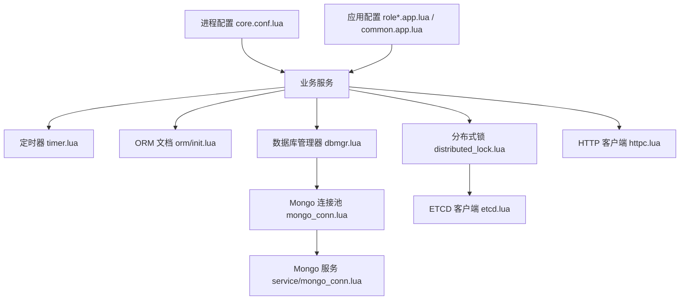
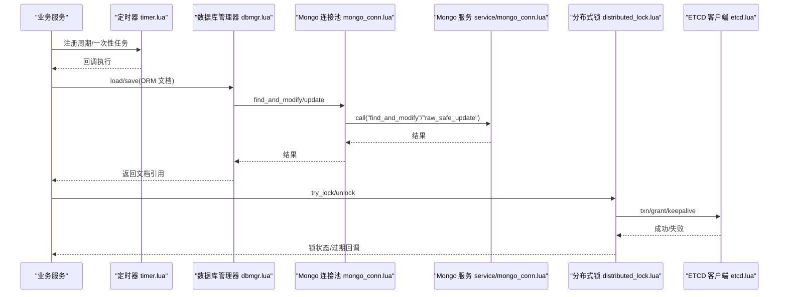
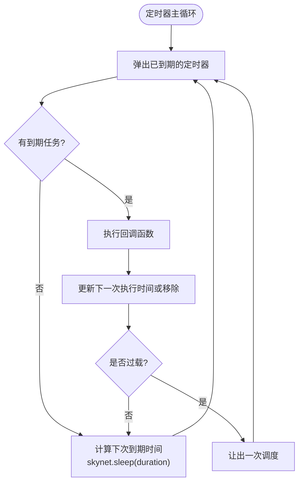
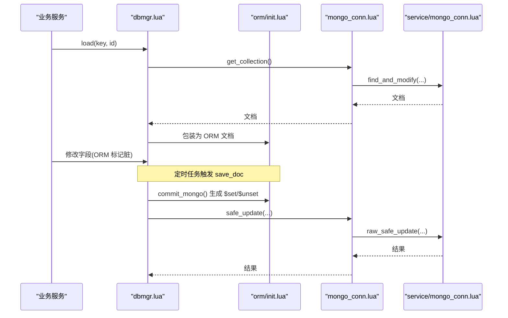
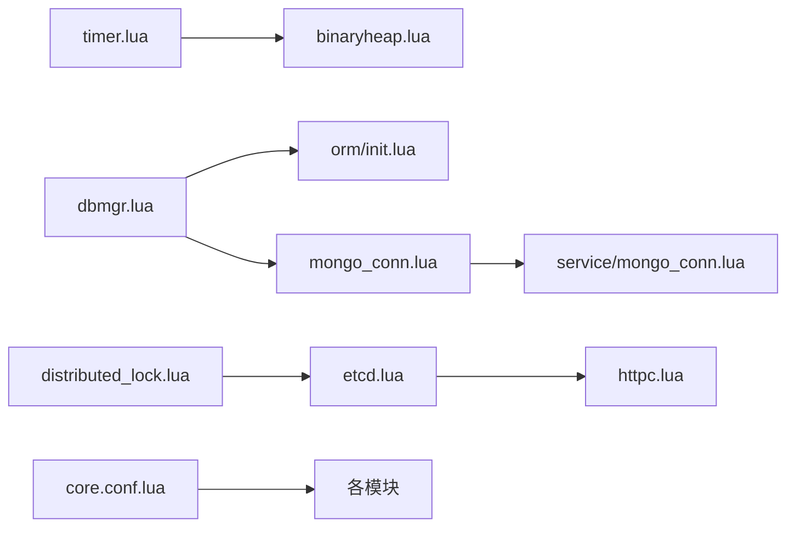

# 性能优化

<cite>
**本文引用的文件**
- [lualib/timer.lua](file://lualib/timer.lua)
- [lualib/binaryheap.lua](file://lualib/binaryheap.lua)
- [lualib/dbmgr.lua](file://lualib/dbmgr.lua)
- [lualib/mongo_conn.lua](file://lualib/mongo_conn.lua)
- [service/mongo_conn.lua](file://service/mongo_conn.lua)
- [lualib/orm/init.lua](file://lualib/orm/init.lua)
- [lualib/distributed_lock.lua](file://lualib/distributed_lock.lua)
- [lualib/etcd.lua](file://lualib/etcd.lua)
- [lualib/httpc.lua](file://lualib/httpc.lua)
- [etc/core.conf.lua](file://etc/core.conf.lua)
- [etc/app/common.app.lua](file://etc/app/common.app.lua)
- [etc/app/role1.app.lua](file://etc/app/role1.app.lua)
- [etc/app/role2.app.lua](file://etc/app/role2.app.lua)
- [lualib/skyext.lua](file://lualib/skyext.lua)
- [service/gm_sys.lua](file://service/gm_sys.lua)
</cite>

## 目录
1. [简介](#简介)
2. [项目结构](#项目结构)
3. [核心组件](#核心组件)
4. [架构总览](#架构总览)
5. [详细组件分析](#详细组件分析)
6. [依赖关系分析](#依赖关系分析)
7. [性能考量与基准建议](#性能考量与基准建议)
8. [故障排查指南](#故障排查指南)
9. [结论](#结论)
10. [附录](#附录)

## 简介
本指南面向 SkyExt 框架的性能优化，聚焦以下方面：
- 内存管理最佳实践：对象池使用、垃圾回收调优、内存泄漏预防
- 数据库查询优化：连接池配置、查询语句优化、索引设计
- 网络通信优化：消息批处理、连接复用、协议压缩
- 定时器优化：避免频繁创建销毁定时器
- 分布式锁与并发控制：性能考虑与优化策略
- 提供具体代码示例路径与可执行的基准测试方法

## 项目结构
SkyExt 在 Skynet 之上构建了 Lua 层服务与工具库，关键模块包括：
- 定时器与最小堆：timer.lua + binaryheap.lua
- 数据持久化：dbmgr.lua + mongo_conn.lua（Lua 侧）+ service/mongo_conn.lua（C 驱动封装）
- ORM 脏追踪与提交：orm/init.lua
- 分布式锁：distributed_lock.lua + etcd.lua
- HTTP 客户端：httpc.lua
- 进程级配置与线程数：core.conf.lua
- 应用配置：common.app.lua、role*.app.lua
- 启动与全局钩子：skyext.lua
- GM 监控与内存统计：gm_sys.lua



图表来源
- [lualib/timer.lua:1-267](file://lualib/timer.lua#L1-L267)
- [lualib/dbmgr.lua:1-219](file://lualib/dbmgr.lua#L1-L219)
- [lualib/mongo_conn.lua:1-152](file://lualib/mongo_conn.lua#L1-L152)
- [service/mongo_conn.lua:1-71](file://service/mongo_conn.lua#L1-L71)
- [lualib/orm/init.lua:1-491](file://lualib/orm/init.lua#L1-L491)
- [lualib/distributed_lock.lua:1-228](file://lualib/distributed_lock.lua#L1-L228)
- [lualib/etcd.lua:1-800](file://lualib/etcd.lua#L1-L800)
- [lualib/httpc.lua:1-16](file://lualib/httpc.lua#L1-L16)
- [etc/core.conf.lua:1-30](file://etc/core.conf.lua#L1-L30)
- [etc/app/common.app.lua:1-60](file://etc/app/common.app.lua#L1-L60)
- [etc/app/role1.app.lua:1-29](file://etc/app/role1.app.lua#L1-L29)
- [etc/app/role2.app.lua:1-29](file://etc/app/role2.app.lua#L1-L29)

章节来源
- [etc/core.conf.lua:1-30](file://etc/core.conf.lua#L1-L30)
- [etc/app/common.app.lua:1-60](file://etc/app/common.app.lua#L1-L60)
- [etc/app/role1.app.lua:1-29](file://etc/app/role1.app.lua#L1-L29)
- [etc/app/role2.app.lua:1-29](file://etc/app/role2.app.lua#L1-L29)

## 核心组件
- 定时器系统：基于最小堆的周期/一次性定时器，具备过载保护与唤醒机制，避免频繁 sleep/wakeup 抖动。
- 数据库访问：dbmgr 提供缓存、脏写合并、随机延迟批量落盘；mongo_conn 实现连接池与路由；service/mongo_conn 封装底层驱动。
- ORM 脏追踪：通过元表拦截赋值，记录变更并生成最小更新集，减少无效写入。
- 分布式锁：基于 etcd 租约与事务，自动心跳续期，失败重建锁并通知业务。
- HTTP 客户端：统一 JSON 请求封装，便于外部调用。
- 进程配置：thread 参数决定工作线程数，影响整体吞吐。

章节来源
- [lualib/timer.lua:1-267](file://lualib/timer.lua#L1-L267)
- [lualib/dbmgr.lua:1-219](file://lualib/dbmgr.lua#L1-L219)
- [lualib/mongo_conn.lua:1-152](file://lualib/mongo_conn.lua#L1-L152)
- [service/mongo_conn.lua:1-71](file://service/mongo_conn.lua#L1-L71)
- [lualib/orm/init.lua:1-491](file://lualib/orm/init.lua#L1-L491)
- [lualib/distributed_lock.lua:1-228](file://lualib/distributed_lock.lua#L1-L228)
- [lualib/etcd.lua:1-800](file://lualib/etcd.lua#L1-L800)
- [lualib/httpc.lua:1-16](file://lualib/httpc.lua#L1-L16)
- [etc/core.conf.lua:1-30](file://etc/core.conf.lua#L1-L30)

## 架构总览
下图展示了从业务到存储与分布式协调的关键路径，以及定时器的调度方式。



图表来源
- [lualib/timer.lua:1-267](file://lualib/timer.lua#L1-L267)
- [lualib/dbmgr.lua:1-219](file://lualib/dbmgr.lua#L1-L219)
- [lualib/mongo_conn.lua:1-152](file://lualib/mongo_conn.lua#L1-L152)
- [service/mongo_conn.lua:1-71](file://service/mongo_conn.lua#L1-L71)
- [lualib/distributed_lock.lua:1-228](file://lualib/distributed_lock.lua#L1-L228)
- [lualib/etcd.lua:1-800](file://lualib/etcd.lua#L1-L800)

## 详细组件分析

### 定时器与最小堆
- 设计要点
  - 使用最小堆维护到期时间，支持 update/remove/peek，降低查找与调整开销。
  - 单协程循环执行，sleep 至最近到期时间或最大空闲时间，避免忙轮询。
  - 过载保护：累计超时超过阈值时主动让出，防止阻塞其他任务。
- 性能影响
  - 插入/更新/删除为 O(log N)，适合大量定时器场景。
  - 合理设置间隔与首次延迟，避免瞬时风暴。
- 优化建议
  - 使用 repeat_random_delayed 分散启动时间。
  - 将高频短间隔任务合并为低频长间隔任务，减少上下文切换。
  - 避免在回调中做重 IO，必要时异步化。



图表来源
- [lualib/timer.lua:159-207](file://lualib/timer.lua#L159-L207)
- [lualib/binaryheap.lua:378-390](file://lualib/binaryheap.lua#L378-L390)

章节来源
- [lualib/timer.lua:1-267](file://lualib/timer.lua#L1-L267)
- [lualib/binaryheap.lua:1-406](file://lualib/binaryheap.lua#L1-L406)

### 数据库访问与 ORM 脏追踪
- 设计要点
  - dbmgr 对每个文档建立本地缓存，使用 ORM 跟踪变更，按固定间隔随机延迟批量落盘，降低写放大。
  - mongo_conn 维护多连接池并按需路由，service/mongo_conn 封装底层驱动，避免跨进程重复编码。
  - ORM 仅提交变更字段，减少网络与磁盘写入。
- 性能影响
  - 批量落盘显著降低 MongoDB 写入压力。
  - 连接池提升并发吞吐，但需平衡连接数与后端负载。
- 优化建议
  - 根据 QPS 调整 connections 与 db_save_interval。
  - 使用投影字段减少回传数据量。
  - 对热点键加版本号冲突检测，避免覆盖写。



图表来源
- [lualib/dbmgr.lua:94-148](file://lualib/dbmgr.lua#L94-L148)
- [lualib/orm/init.lua:348-447](file://lualib/orm/init.lua#L348-L447)
- [lualib/mongo_conn.lua:44-77](file://lualib/mongo_conn.lua#L44-L77)
- [service/mongo_conn.lua:29-65](file://service/mongo_conn.lua#L29-L65)

章节来源
- [lualib/dbmgr.lua:1-219](file://lualib/dbmgr.lua#L1-L219)
- [lualib/orm/init.lua:1-491](file://lualib/orm/init.lua#L1-L491)
- [lualib/mongo_conn.lua:1-152](file://lualib/mongo_conn.lua#L1-L152)
- [service/mongo_conn.lua:1-71](file://service/mongo_conn.lua#L1-L71)

### 分布式锁与 ETCD 交互
- 设计要点
  - 基于 etcd 租约与事务获取锁，周期性 keepalive 续期，失败时重新 grant 并尝试重建所有锁。
  - 锁失效时调用业务回调，便于上层恢复逻辑。
- 性能影响
  - 事务与范围查询带来一定网络开销，应控制锁粒度与持有时间。
  - 心跳间隔与 TTL 需权衡可靠性与流量。
- 优化建议
  - 缩短锁持有时间，避免长时间占用。
  - 合理设置 LEASE_TTL 与 HEARTBEAT_INTERVAL。
  - 对高竞争资源采用排队或分片策略。

```mermaid
sequenceDiagram
participant App as "业务服务"
participant Lock as "distributed_lock.lua"
participant Etcd as "etcd.lua"
App->>Lock : try_lock(key, value, expired_cb)
Lock->>Etcd : txn(compare, success, failure)
Etcd-->>Lock : 成功/失败 + 当前拥有者信息
alt 获得锁
Lock->>Etcd : grant(TTL)
Loop{
Lock->>Etcd : keepalive(leaseid)
Etcd-->>Lock : TTL 剩余
}
Lock-->>App : true
else 未获得锁
Lock->>Etcd : delete(my_key)
Lock-->>App : false, owner
end
```

图表来源
- [lualib/distributed_lock.lua:38-133](file://lualib/distributed_lock.lua#L38-L133)
- [lualib/etcd.lua:549-566](file://lualib/etcd.lua#L549-L566)
- [lualib/etcd.lua:775-791](file://lualib/etcd.lua#L775-L791)
- [lualib/etcd.lua:169-186](file://lualib/etcd.lua#L169-L186)

章节来源
- [lualib/distributed_lock.lua:1-228](file://lualib/distributed_lock.lua#L1-L228)
- [lualib/etcd.lua:1-800](file://lualib/etcd.lua#L1-L800)

### HTTP 客户端
- 设计要点
  - 统一 JSON 序列化与 content-type 设置，简化调用方。
- 优化建议
  - 在高并发场景下复用连接（若底层支持），或结合连接池使用。
  - 对大响应启用流式读取（如底层支持）。

章节来源
- [lualib/httpc.lua:1-16](file://lualib/httpc.lua#L1-L16)

## 依赖关系分析
- 模块耦合
  - dbmgr 依赖 orm、mongo_conn、timer；mongo_conn 依赖 skynet.queue 与 bson；service/mongo_conn 依赖 skynet.db.mongo。
  - distributed_lock 依赖 etcd、timer、config。
  - timer 依赖 binaryheap、time、log。
- 潜在风险
  - 过多定时器导致 CPU 抖动；ORM 深度嵌套可能增加序列化成本；ETCD 事务频繁调用可能成为瓶颈。
- 外部依赖
  - MongoDB、ETCD、Skynet 内核与 C 扩展。



图表来源
- [lualib/timer.lua:1-267](file://lualib/timer.lua#L1-L267)
- [lualib/binaryheap.lua:1-406](file://lualib/binaryheap.lua#L1-L406)
- [lualib/dbmgr.lua:1-219](file://lualib/dbmgr.lua#L1-L219)
- [lualib/orm/init.lua:1-491](file://lualib/orm/init.lua#L1-L491)
- [lualib/mongo_conn.lua:1-152](file://lualib/mongo_conn.lua#L1-L152)
- [service/mongo_conn.lua:1-71](file://service/mongo_conn.lua#L1-L71)
- [lualib/distributed_lock.lua:1-228](file://lualib/distributed_lock.lua#L1-L228)
- [lualib/etcd.lua:1-800](file://lualib/etcd.lua#L1-L800)
- [lualib/httpc.lua:1-16](file://lualib/httpc.lua#L1-L16)
- [etc/core.conf.lua:1-30](file://etc/core.conf.lua#L1-L30)

章节来源
- [lualib/timer.lua:1-267](file://lualib/timer.lua#L1-L267)
- [lualib/dbmgr.lua:1-219](file://lualib/dbmgr.lua#L1-L219)
- [lualib/orm/init.lua:1-491](file://lualib/orm/init.lua#L1-L491)
- [lualib/mongo_conn.lua:1-152](file://lualib/mongo_conn.lua#L1-L152)
- [service/mongo_conn.lua:1-71](file://service/mongo_conn.lua#L1-L71)
- [lualib/distributed_lock.lua:1-228](file://lualib/distributed_lock.lua#L1-L228)
- [lualib/etcd.lua:1-800](file://lualib/etcd.lua#L1-L800)
- [lualib/httpc.lua:1-16](file://lualib/httpc.lua#L1-L16)
- [etc/core.conf.lua:1-30](file://etc/core.conf.lua#L1-L30)

## 性能考量与基准建议

### 内存管理与 GC 调优
- 对象池使用
  - 对频繁创建销毁的小对象（如请求体、临时表）进行复用，减少分配与回收压力。
  - 在 ORM 场景中尽量复用文档对象，利用脏追踪只提交变更。
- GC 调优
  - 观察 jemalloc 统计与堆快照，定位热点分配点。
  - 适当增大堆大小或调整分片，降低 GC 频率。
- 内存泄漏预防
  - 确保定时器取消、锁释放、事件监听注销，避免闭包引用链长期存活。
  - 谨慎使用全局表缓存大对象，设置过期与上限。

章节来源
- [service/gm_sys.lua:326-432](file://service/gm_sys.lua#L326-L432)
- [lualib/orm/init.lua:348-447](file://lualib/orm/init.lua#L348-L447)
- [lualib/distributed_lock.lua:136-152](file://lualib/distributed_lock.lua#L136-L152)
- [lualib/timer.lua:255-264](file://lualib/timer.lua#L255-L264)

### 数据库查询优化
- 连接池配置
  - 依据 QPS 与后端能力调整 connections，避免连接不足或过多。
  - 参考应用配置中的默认值，并结合压测结果微调。
- 查询语句优化
  - 使用投影字段减少回传数据量。
  - 优先使用精确匹配与范围条件，避免全表扫描。
- 索引设计
  - 为常用查询条件建立复合索引，注意选择性。
  - 定期分析慢查询日志，优化索引命中。

章节来源
- [etc/app/common.app.lua:30-40](file://etc/app/common.app.lua#L30-L40)
- [lualib/mongo_conn.lua:94-105](file://lualib/mongo_conn.lua#L94-L105)
- [service/mongo_conn.lua:29-65](file://service/mongo_conn.lua#L29-L65)

### 网络通信优化
- 消息批处理
  - 将多个小请求合并为批量操作，减少往返次数。
  - 在 ORM 提交阶段聚合 $set/$unset，减少写入次数。
- 连接复用
  - 使用连接池复用底层连接，避免频繁握手。
  - 对 HTTP 客户端，若底层支持 keep-alive，则开启以减少开销。
- 协议压缩
  - 对大响应启用压缩（如 gzip），权衡 CPU 与带宽。
  - 在网关层统一压缩/解压，减轻业务节点负担。

章节来源
- [lualib/orm/init.lua:428-447](file://lualib/orm/init.lua#L428-L447)
- [lualib/mongo_conn.lua:94-105](file://lualib/mongo_conn.lua#L94-L105)
- [lualib/httpc.lua:1-16](file://lualib/httpc.lua#L1-L16)

### 定时器优化
- 避免频繁创建销毁
  - 使用 repeat_* 系列接口复用定时器对象，减少分配。
  - 合并相近间隔的任务，降低调度频率。
- 过载保护
  - 利用内置过载检测，避免阻塞其他任务。
  - 将耗时任务放入独立队列或后台协程。

章节来源
- [lualib/timer.lua:210-253](file://lualib/timer.lua#L210-L253)
- [lualib/timer.lua:170-207](file://lualib/timer.lua#L170-L207)

### 分布式锁与并发控制
- 性能考虑
  - 控制锁粒度与持有时间，减少竞争。
  - 合理设置 TTL 与心跳间隔，平衡可靠性与流量。
- 并发优化
  - 对热点资源采用分片或排队策略。
  - 使用非阻塞 try_lock，失败时退避重试。

章节来源
- [lualib/distributed_lock.lua:104-133](file://lualib/distributed_lock.lua#L104-L133)
- [lualib/distributed_lock.lua:154-225](file://lualib/distributed_lock.lua#L154-L225)
- [lualib/etcd.lua:549-566](file://lualib/etcd.lua#L549-L566)

### 进程与线程配置
- 工作线程数
  - 根据 CPU 核数与任务类型调整 thread，避免上下文切换过多。
- 服务路径与加载
  - 合理组织 luaservice 与 lua_path，减少模块加载开销。

章节来源
- [etc/core.conf.lua:1-30](file://etc/core.conf.lua#L1-L30)

### 基准测试方法与示例
- 目标
  - 评估不同配置下的吞吐、延迟与资源占用。
- 步骤
  - 使用 GM 命令查看内存与网络统计，作为基线。
  - 针对定时器、ORM 提交、分布式锁分别构造压测脚本，测量 P95/P99 延迟与错误率。
  - 逐步调整连接池大小、保存间隔、TTL 等参数，对比效果。
- 指标
  - QPS、平均/尾延迟、CPU、内存、GC 次数、网络带宽。

章节来源
- [service/gm_sys.lua:73-103](file://service/gm_sys.lua#L73-L103)
- [service/gm_sys.lua:326-432](file://service/gm_sys.lua#L326-L432)

## 故障排查指南
- 常见问题
  - 定时器过载：检查回调耗时与间隔，必要时拆分任务。
  - 数据库写入失败：检查版本冲突与连接池健康，确认索引与权限。
  - 分布式锁失效：检查 ETCD 连通性与 TTL，关注心跳失败日志。
  - 内存增长：使用堆快照定位热点对象，清理未释放的定时器与锁。
- 诊断工具
  - 使用 GM 命令查看服务列表、统计、内存、网络状态。
  - 启用堆快照与 jemalloc 统计，分析分配热点。

章节来源
- [lualib/timer.lua:170-207](file://lualib/timer.lua#L170-L207)
- [lualib/dbmgr.lua:53-92](file://lualib/dbmgr.lua#L53-L92)
- [lualib/distributed_lock.lua:169-225](file://lualib/distributed_lock.lua#L169-L225)
- [service/gm_sys.lua:73-103](file://service/gm_sys.lua#L73-L103)
- [service/gm_sys.lua:326-432](file://service/gm_sys.lua#L326-L432)

## 结论
SkyExt 在定时器、ORM 脏追踪、连接池与分布式锁等方面提供了良好的性能基础。通过合理配置连接池、优化查询与索引、控制锁粒度与持有时间、合并消息与复用连接，可以显著提升吞吐并降低延迟。配合 GM 监控与基准测试，持续迭代参数，达到稳定高效的运行状态。

## 附录
- 关键配置项参考
  - 工作线程数：thread
  - 数据库连接数：connections
  - 登录超时：login_timeout_sec
  - 角色离线卸载时间：role_offline_unload_sec
  - ETCD 超时：httpc.timeout

章节来源
- [etc/core.conf.lua:1-30](file://etc/core.conf.lua#L1-L30)
- [etc/app/common.app.lua:30-60](file://etc/app/common.app.lua#L30-L60)
- [etc/app/role1.app.lua:1-29](file://etc/app/role1.app.lua#L1-L29)
- [etc/app/role2.app.lua:1-29](file://etc/app/role2.app.lua#L1-L29)
- [lualib/etcd.lua:22-22](file://lualib/etcd.lua#L22-L22)