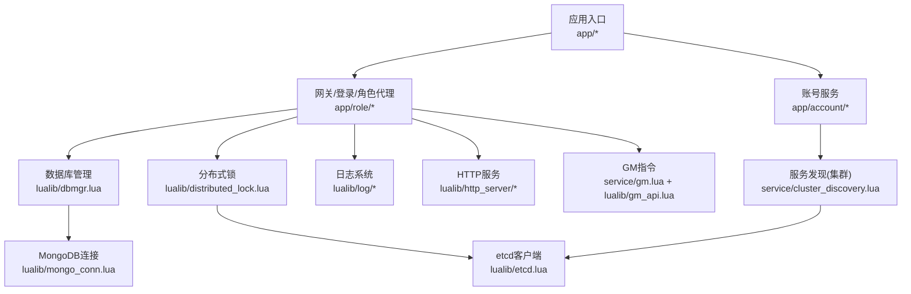
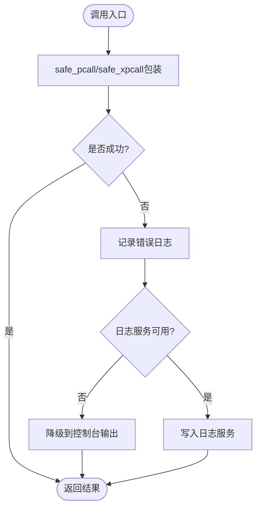
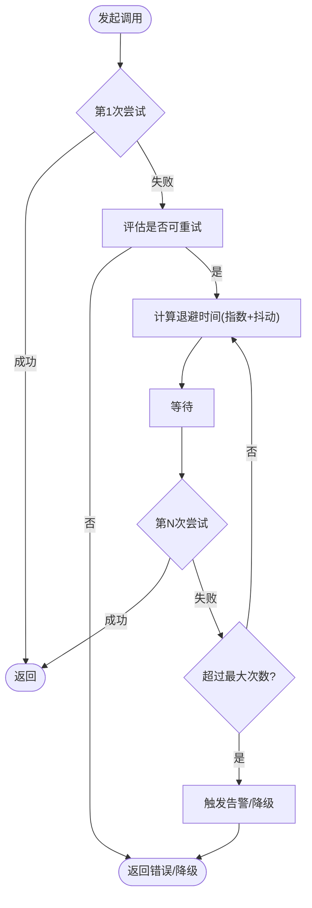
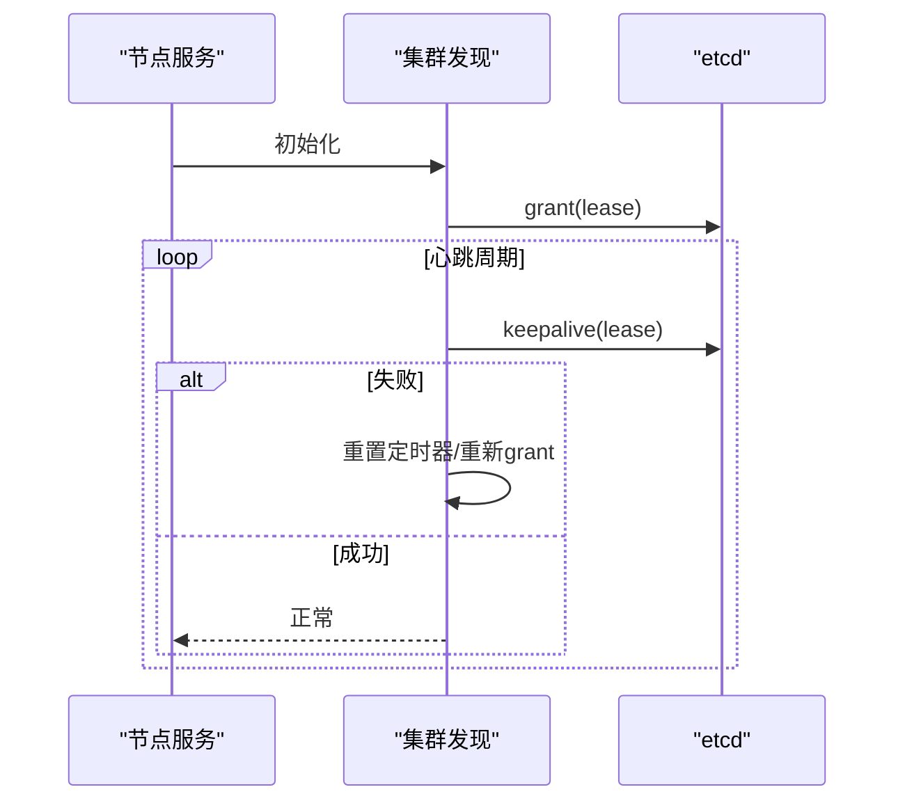
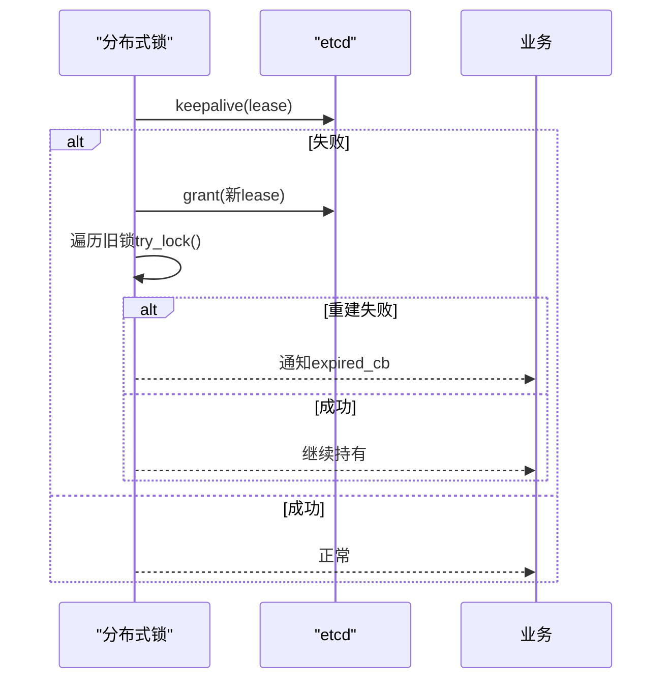
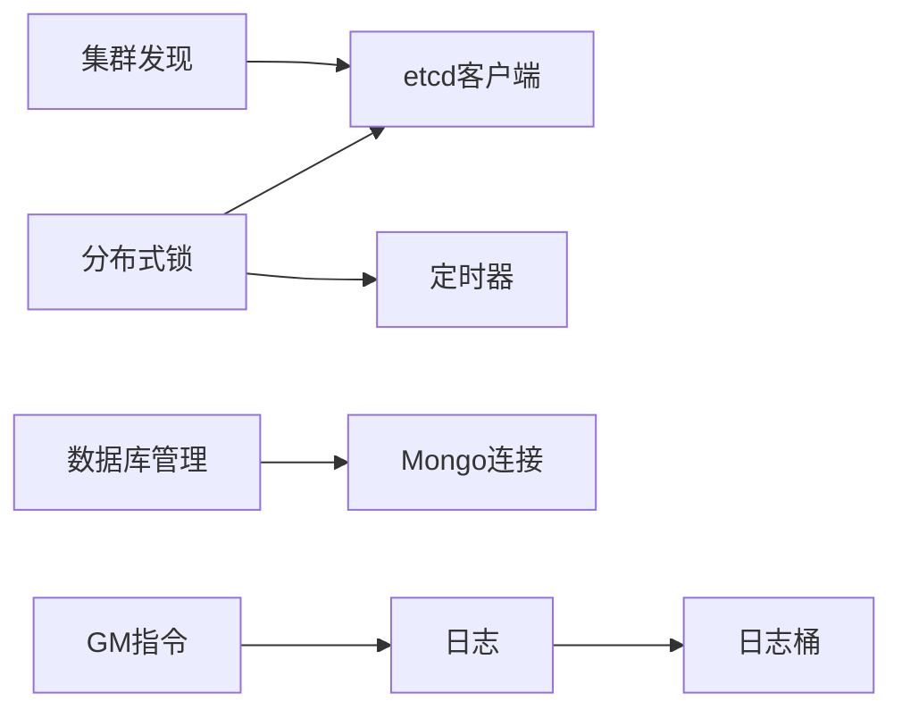

# 故障处理

<cite>
**本文引用的文件**
- [README.md](file://README.md)
- [errcode.lua](file://lualib/errcode.lua)
- [logger.lua](file://lualib/log/logger.lua)
- [log_level.lua](file://lualib/log/log_level.lua)
- [bucket/init.lua](file://lualib/log/bucket/init.lua)
- [formatter.lua](file://lualib/log/formatter.lua)
- [etcd.lua](file://lualib/etcd.lua)
- [distributed_lock.lua](file://lualib/distributed_lock.lua)
- [dbmgr.lua](file://lualib/dbmgr.lua)
- [timer.lua](file://lualib/timer.lua)
- [snowflake.lua](file://lualib/snowflake.lua)
- [httpc.lua](file://lualib/httpc.lua)
- [gm.lua](file://service/gm.lua)
- [gm_api.lua](file://lualib/gm_api.lua)
- [cluster_discovery.lua](file://service/cluster_discovery.lua)
- [watchdog.lua](file://app/role/watchdog.lua)
- [monitor.app.lua](file://etc/app/monitor.app.lua)
</cite>

## 目录
1. [简介](#简介)
2. [项目结构](#项目结构)
3. [核心组件](#核心组件)
4. [架构总览](#架构总览)
5. [详细组件分析](#详细组件分析)
6. [依赖关系分析](#依赖关系分析)
7. [性能考虑](#性能考虑)
8. [故障排查指南](#故障排查指南)
9. [结论](#结论)
10. [附录](#附录)

## 简介
本指南面向 SkyExt 框架的运维与开发人员，系统化说明异常捕获、错误分类、错误恢复、重试机制、降级策略、分布式故障处理、监控告警与诊断工具使用，并提供可落地的应急预案。内容基于仓库中现有实现进行提炼与扩展建议，确保与实际代码一致且具备可操作性。

## 项目结构
SkyExt 采用 skynet 微服务架构，包含账号节点、角色节点、机器人节点等；通过 etcd 完成服务发现与租约管理，MongoDB 作为数据持久化存储；内置日志、HTTP 服务、GM 指令、分布式锁、定时器、ID 生成等基础能力。



图表来源
- [README.md:22-38](file://README.md#L22-L38)
- [cluster_discovery.lua:46-73](file://service/cluster_discovery.lua#L46-L73)
- [distributed_lock.lua:154-227](file://lualib/distributed_lock.lua#L154-L227)
- [etcd.lua:167-229](file://lualib/etcd.lua#L167-L229)
- [dbmgr.lua:14-219](file://lualib/dbmgr.lua#L14-L219)
- [gm.lua:291-310](file://service/gm.lua#L291-L310)

章节来源
- [README.md:22-38](file://README.md#L22-L38)

## 核心组件
- 错误码体系：集中定义业务错误码，便于统一分类与前端提示。
- 日志系统：结构化日志、分级输出、安全封装 pcall/xpcall，支持过载保护与降级到控制台。
- 服务发现与租约：基于 etcd 的节点注册、服务注册、心跳保活与失败隔离。
- 分布式锁：基于 etcd 租约与事务的锁获取、续约、失效通知与重建。
- 数据库访问：ORM 缓存、版本控制、定时落盘与卸载清理。
- 定时器：周期性任务、过载检测与补偿。
- HTTP 客户端：JSON 请求封装与状态码处理。
- GM 指令：统一注册、执行、批量注销与结果聚合。

章节来源
- [errcode.lua:1-29](file://lualib/errcode.lua#L1-L29)
- [logger.lua:1-290](file://lualib/log/logger.lua#L1-L290)
- [cluster_discovery.lua:46-73](file://service/cluster_discovery.lua#L46-L73)
- [distributed_lock.lua:104-227](file://lualib/distributed_lock.lua#L104-L227)
- [dbmgr.lua:94-219](file://lualib/dbmgr.lua#L94-L219)
- [timer.lua:192-228](file://lualib/timer.lua#L192-L228)
- [httpc.lua:1-16](file://lualib/httpc.lua#L1-L16)
- [gm.lua:1-310](file://service/gm.lua#L1-L310)

## 架构总览
下图展示关键故障路径与恢复点：网络/etcd 异常触发健康检查与端点切换；分布式锁在租约过期时重建并通知业务；数据库写入失败回滚版本并记录；定时器过载保护避免雪崩；GM 指令用于在线诊断与应急操作。

```mermaid
sequenceDiagram
participant App as "业务服务"
participant Lock as "分布式锁"
participant Etcd as "etcd客户端"
participant DB as "数据库"
participant Log as "日志"
participant GM as "GM指令"
App->>Lock : try_lock(key, value, expired_cb)
Lock->>Etcd : txn(创建key+范围查询)
Etcd-->>Lock : 成功/失败
alt 成功获得锁
Lock-->>App : true
Note over Lock : 定时keepalive续租
else 失败
Lock-->>App : false, holder
Log.warn("锁竞争或失败")
end
App->>DB : load/save
DB-->>App : ok/error
alt 写失败
DB-->>App : 回滚版本/记录错误
Log.error("保存失败")
end
App->>GM : execute_command("dump_state", ...)
GM-->>App : 诊断结果
```

图表来源
- [distributed_lock.lua:104-227](file://lualib/distributed_lock.lua#L104-L227)
- [etcd.lua:167-229](file://lualib/etcd.lua#L167-L229)
- [dbmgr.lua:53-92](file://lualib/dbmgr.lua#L53-L92)
- [gm.lua:219-289](file://service/gm.lua#L219-L289)

## 详细组件分析

### 错误捕获与恢复
- 安全调用封装：提供 safe_pcall/safe_xpcall，在错误处理上下文中计数，避免重复进入错误处理导致的栈污染。
- 日志降级：当日志服务不可用时自动回退到控制台 bucket，保证关键错误可观测。
- 堆栈追踪：配置 traceback 深度与元素限制，平衡诊断信息量与性能。



图表来源
- [logger.lua:155-194](file://lualib/log/logger.lua#L155-L194)
- [bucket/init.lua:1-30](file://lualib/log/bucket/init.lua#L1-L30)
- [formatter.lua:53-100](file://lualib/log/formatter.lua#L53-L100)

章节来源
- [logger.lua:155-194](file://lualib/log/logger.lua#L155-L194)
- [bucket/init.lua:1-30](file://lualib/log/bucket/init.lua#L1-L30)
- [formatter.lua:53-100](file://lualib/log/formatter.lua#L53-L100)

### 错误分类与统一返回
- 错误码集中管理：OK、非当前节点、角色在其他节点、角色不存在、锁定失败、角色过多、数据库错误、Token 错误、协议校验错误、服务器不存在、MongoDB 重复键等。
- 元表索引保护：未定义的错误码访问将报错，防止误用。

章节来源
- [errcode.lua:1-29](file://lualib/errcode.lua#L1-L29)

### 重试机制（含指数退避）
- 现状：仓库未直接实现通用重试器；建议在调用外部依赖（etcd、HTTP、数据库）处封装重试逻辑。
- 推荐实现要点：
  - 指数退避：base_delay * 2^attempt，叠加抖动避免同步风暴。
  - 最大重试次数与超时：按接口类型设定上限，避免无限重试。
  - 幂等性判断：仅对幂等操作重试，写操作需结合唯一键与去重。
  - 失败通知：达到阈值后上报监控并触发告警。
  - 熔断/短路：连续失败超过阈值暂停重试一段时间。



[无图表来源：概念性流程图]

### 服务发现失败处理
- 租约与心跳：定期 grant/keepalive，失败则重置定时器并重新申请租约。
- 端点健康检查：失败主机加入黑名单，固定时间内不再选择；环形负载均衡轮询其他端点。
- 服务注册/更新：带 node_revision 的版本控制，避免旧覆盖新。



图表来源
- [cluster_discovery.lua:46-73](file://service/cluster_discovery.lua#L46-L73)
- [cluster_discovery.lua:248-266](file://service/cluster_discovery.lua#L248-L266)
- [etcd.lua:167-229](file://lualib/etcd.lua#L167-L229)

章节来源
- [cluster_discovery.lua:46-73](file://service/cluster_discovery.lua#L46-L73)
- [cluster_discovery.lua:248-266](file://service/cluster_discovery.lua#L248-L266)
- [etcd.lua:167-229](file://lualib/etcd.lua#L167-L229)

### 网络连接异常处理
- etcd 客户端：失败端点标记不健康，选择下一个端点；工作端点置空以触发重新选择。
- HTTP 客户端：统一 JSON 请求封装，根据状态码区分成功与失败。

章节来源
- [etcd.lua:167-229](file://lualib/etcd.lua#L167-L229)
- [httpc.lua:1-16](file://lualib/httpc.lua#L1-L16)

### 分布式锁失效处理
- 租约续期：定时 keepalive，失败则重新 grant 并重建所有锁。
- 锁重建：遍历旧锁集合，尝试重新获取；失败则调用业务回调通知锁已失效。
- 解锁：删除 key 并清理本地状态。



图表来源
- [distributed_lock.lua:154-227](file://lualib/distributed_lock.lua#L154-L227)

章节来源
- [distributed_lock.lua:154-227](file://lualib/distributed_lock.lua#L154-L227)

### 数据降级策略
- 读路径：优先从内存 ORM 缓存读取；加载失败记录错误并返回默认值或延迟重试。
- 写路径：乐观锁版本控制，写失败回滚版本并记录；卸载时强制落盘，失败记录并保留脏数据以便后续重试。
- 定时落盘：随机延迟分散写压力；取消定时器避免并发写冲突。

章节来源
- [dbmgr.lua:53-92](file://lualib/dbmgr.lua#L53-L92)
- [dbmgr.lua:94-148](file://lualib/dbmgr.lua#L94-L148)
- [dbmgr.lua:150-198](file://lualib/dbmgr.lua#L150-L198)

### 功能降级方案
- 日志降级：日志服务不可用时回退到控制台输出，确保关键错误可见。
- 服务发现降级：etcd 不可用时，保持本地缓存视图，降低影响面。
- 功能开关：可通过配置项关闭非核心功能（如统计、遥测），保障主流程稳定。

章节来源
- [bucket/init.lua:1-30](file://lualib/log/bucket/init.lua#L1-L30)
- [etcd.lua:167-229](file://lualib/etcd.lua#L167-L229)

### 监控告警与诊断工具
- GM 指令：统一注册与执行，支持跨服务诊断命令，返回多服务执行结果。
- 日志级别：DEBUG/INFO/WARN/ERROR/FATAL 分级输出，便于定位问题。
- 监控节点：配置文件定义监控节点名称与端口，便于接入监控系统。

章节来源
- [gm.lua:1-310](file://service/gm.lua#L1-L310)
- [gm_api.lua:1-144](file://lualib/gm_api.lua#L1-L144)
- [log_level.lua:1-10](file://lualib/log/log_level.lua#L1-L10)
- [monitor.app.lua:1-9](file://etc/app/monitor.app.lua#L1-L9)

### 定时器与过载保护
- 定时器过载检测：累计补偿时间超过阈值时记录错误并短暂休眠，避免阻塞。
- 周期性任务：repeat_immediately 立即执行一次并周期循环，适合心跳与保活。

章节来源
- [timer.lua:192-228](file://lualib/timer.lua#L192-L228)

### ID 生成与时钟回拨
- 时钟回拨保护：检测到时间回拨抛出错误，避免重复 ID。
- 序列号溢出：等待下一时间单位并重置序列号，保证单调递增。

章节来源
- [snowflake.lua:41-76](file://lualib/snowflake.lua#L41-L76)

## 依赖关系分析
- 模块耦合：分布式锁依赖 etcd 客户端与定时器；服务发现依赖 etcd 与配置；数据库管理依赖 mongo 连接与 ORM。
- 外部依赖：etcd（服务发现/锁）、MongoDB（持久化）、HTTP 客户端（内部服务通信）。
- 潜在环依赖：通过服务名与地址解耦，避免直接循环引用。



图表来源
- [distributed_lock.lua:1-227](file://lualib/distributed_lock.lua#L1-L227)
- [cluster_discovery.lua:46-73](file://service/cluster_discovery.lua#L46-L73)
- [dbmgr.lua:1-219](file://lualib/dbmgr.lua#L1-L219)
- [gm.lua:1-310](file://service/gm.lua#L1-L310)
- [logger.lua:1-290](file://lualib/log/logger.lua#L1-L290)

章节来源
- [distributed_lock.lua:1-227](file://lualib/distributed_lock.lua#L1-L227)
- [cluster_discovery.lua:46-73](file://service/cluster_discovery.lua#L46-L73)
- [dbmgr.lua:1-219](file://lualib/dbmgr.lua#L1-L219)
- [gm.lua:1-310](file://service/gm.lua#L1-L310)
- [logger.lua:1-290](file://lualib/log/logger.lua#L1-L290)

## 性能考虑
- 日志写入异步化与桶化，避免阻塞主流程；必要时降级到控制台。
- 数据库写路径使用版本控制与随机延迟落盘，减少热点与冲突。
- etcd 客户端端点健康检查与失败隔离，避免单点故障放大。
- 定时器过载保护，防止长时间阻塞导致雪崩。
- ID 生成避免时钟回拨与序列溢出，保证高吞吐下的唯一性与顺序性。

[本节为通用指导，无需具体文件来源]

## 故障排查指南
- 常见问题定位：
  - etcd 不可用：检查租约与心跳日志，确认端点健康与黑名单状态。
  - 分布式锁失效：查看 keepalive 失败与重建日志，确认 expired_cb 是否被调用。
  - 数据库写入失败：检查版本回滚与 save_dirty 错误日志，确认脏数据状态。
  - 定时器过载：关注过载时长与错误日志，调整任务频率或优化耗时。
  - 服务发现不一致：核对 node_revision 与服务列表，确认注册/更新流程。
- 诊断工具：
  - 使用 GM 指令执行 dump_state、list_services、check_etcd 等自定义命令。
  - 通过日志级别提升定位问题，结合结构化字段（module、line、events）快速过滤。
- 应急预案：
  - 紧急下线：通过 GM 指令停止特定服务或关闭路由。
  - 限流降级：临时关闭非核心功能，降低负载。
  - 数据修复：利用 GM 指令触发数据修复脚本或回滚。

章节来源
- [gm.lua:219-289](file://service/gm.lua#L219-L289)
- [logger.lua:1-290](file://lualib/log/logger.lua#L1-L290)
- [distributed_lock.lua:154-227](file://lualib/distributed_lock.lua#L154-L227)
- [dbmgr.lua:53-92](file://lualib/dbmgr.lua#L53-L92)
- [timer.lua:192-228](file://lualib/timer.lua#L192-L228)

## 结论
SkyExt 在错误捕获、日志降级、服务发现与健康检查、分布式锁租约管理、数据库版本控制与定时落盘等方面提供了坚实基础。建议在此基础上补充通用重试器、熔断器与更完善的监控告警，形成闭环的故障处理能力。通过 GM 指令与结构化日志，可实现高效的在线诊断与应急响应。

[本节为总结，无需具体文件来源]

## 附录
- 配置项参考：
  - 日志等级：DEBUG/INFO/WARN/ERROR/FATAL
  - etcd 超时与 TTL：客户端构造参数与租约 TTL
  - 数据库保存间隔：db_save_interval
  - 监控节点：cluster_node_name、cluster_listen_port
- 最佳实践清单：
  - 所有外部调用必须包裹安全调用与错误分类。
  - 对外部依赖实施重试、熔断与超时控制。
  - 关键路径增加日志埋点与指标上报。
  - 定期演练应急预案，验证 GM 指令有效性。

[本节为补充信息，无需具体文件来源]