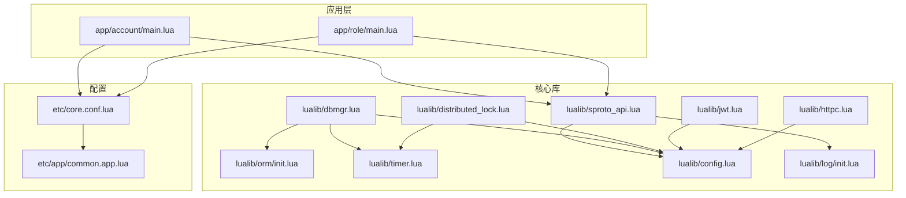
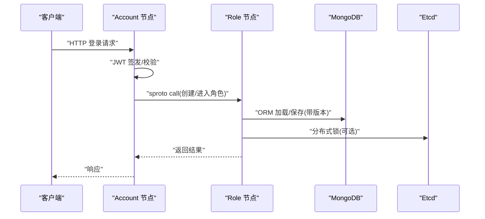
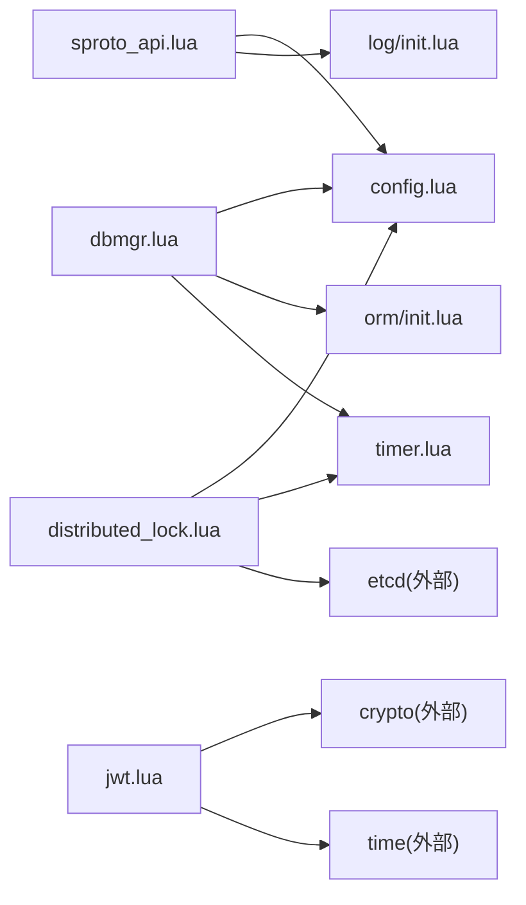

# 最佳实践

<cite>
**本文引用的文件**
- [README.md](file://README.md)
- [skyext.lua](file://lualib/skyext.lua)
- [config.lua](file://lualib/config.lua)
- [dbmgr.lua](file://lualib/dbmgr.lua)
- [orm/init.lua](file://lualib/orm/init.lua)
- [sproto_api.lua](file://lualib/sproto_api.lua)
- [distributed_lock.lua](file://lualib/distributed_lock.lua)
- [jwt.lua](file://lualib/jwt.lua)
- [timer.lua](file://lualib/timer.lua)
- [httpc.lua](file://lualib/httpc.lua)
- [errcode.lua](file://lualib/errcode.lua)
- [log/init.lua](file://lualib/log/init.lua)
- [core.conf.lua](file://etc/core.conf.lua)
- [common.app.lua](file://etc/app/common.app.lua)
- [app/account/main.lua](file://app/account/main.lua)
- [app/role/main.lua](file://app/role/main.lua)
</cite>

## 目录
1. [简介](#简介)
2. [项目结构](#项目结构)
3. [核心组件](#核心组件)
4. [架构总览](#架构总览)
5. [详细组件分析](#详细组件分析)
6. [依赖关系分析](#依赖关系分析)
7. [性能优化指南](#性能优化指南)
8. [安全注意事项](#安全注意事项)
9. [故障处理与高可用](#故障处理与高可用)
10. [代码质量与设计规范](#代码质量与设计规范)
11. [基准测试与优化案例](#基准测试与优化案例)
12. [排错指南](#排错指南)
13. [结论](#结论)

## 简介
本指南面向使用 SkyExt 框架的开发者，聚焦于生产环境的最佳实践。内容覆盖性能优化（内存、数据库、网络）、安全（输入校验、权限、数据安全）、故障处理（异常、重试、降级）、代码质量与设计模式、以及基于仓库现有实现的架构决策与反模式规避。所有建议均结合仓库中的实际实现进行说明，并提供可追溯的文件来源。

## 项目结构
SkyExt 采用分层与模块化组织：
- 应用入口：account、role、robot 等节点启动脚本
- 核心库：ORM、定时器、分布式锁、协议编解码、HTTP 客户端、配置加载、日志等
- 服务：sproto_loader、mongo_conn、gm、hotfix 等
- 配置：核心配置与应用配置分离，支持环境变量注入与 include
- 协议与模式：sproto 协议定义与 ORM schema 定义

图表来源
- [app/account/main.lua:1-25](file://app/account/main.lua#L1-L25)
- [app/role/main.lua:1-25](file://app/role/main.lua#L1-L25)
- [lualib/sproto_api.lua:1-199](file://lualib/sproto_api.lua#L1-L199)
- [lualib/dbmgr.lua:1-219](file://lualib/dbmgr.lua#L1-L219)
- [lualib/orm/init.lua:1-491](file://lualib/orm/init.lua#L1-L491)
- [lualib/distributed_lock.lua:1-228](file://lualib/distributed_lock.lua#L1-L228)
- [lualib/timer.lua:1-267](file://lualib/timer.lua#L1-L267)
- [lualib/jwt.lua:1-103](file://lualib/jwt.lua#L1-L103)
- [lualib/httpc.lua:1-16](file://lualib/httpc.lua#L1-L16)
- [lualib/config.lua:1-145](file://lualib/config.lua#L1-L145)
- [lualib/log/init.lua:1-58](file://lualib/log/init.lua#L1-L58)
- [etc/core.conf.lua:1-30](file://etc/core.conf.lua#L1-L30)
- [etc/app/common.app.lua:1-100](file://etc/app/common.app.lua#L1-L100)

章节来源
- [README.md:22-47](file://README.md#L22-L47)
- [etc/core.conf.lua:1-30](file://etc/core.conf.lua#L1-L30)
- [etc/app/common.app.lua:1-100](file://etc/app/common.app.lua#L1-L100)

## 核心组件
- 配置系统：统一读取应用配置，支持类型转换与 include，初始化时写入 skynet 环境供全局访问
- 定时器：最小堆驱动，支持一次性、周期、随机延迟执行；内置过载检测与告警
- ORM：脏标记与增量提交，支持嵌套对象、数组、bson 序列化上下文
- 数据库管理：连接池复用、缓存文档、定时落盘、版本控制防并发冲突
- 协议层：sproto 注册与分发，中间件拦截，call/call with timeout，session 管理
- 分布式锁：基于 etcd 事务与租约，自动续租与重建，过期回调
- JWT：签名与验证，支持 HS256/HS512，时间窗口校验
- HTTP 客户端：JSON POST 封装
- 日志：统一入口，覆盖 assert/error/pcall/xpcall，结构化输出

章节来源
- [lualib/config.lua:1-145](file://lualib/config.lua#L1-L145)
- [lualib/timer.lua:1-267](file://lualib/timer.lua#L1-L267)
- [lualib/orm/init.lua:1-491](file://lualib/orm/init.lua#L1-L491)
- [lualib/dbmgr.lua:1-219](file://lualib/dbmgr.lua#L1-L219)
- [lualib/sproto_api.lua:1-199](file://lualib/sproto_api.lua#L1-L199)
- [lualib/distributed_lock.lua:1-228](file://lualib/distributed_lock.lua#L1-L228)
- [lualib/jwt.lua:1-103](file://lualib/jwt.lua#L1-L103)
- [lualib/httpc.lua:1-16](file://lualib/httpc.lua#L1-L16)
- [lualib/log/init.lua:1-58](file://lualib/log/init.lua#L1-L58)

## 架构总览
SkyExt 以 skynet 为内核，按角色拆分 account 与 role 节点。Account 提供 HTTP 接口与账号登录鉴权；Role 负责游戏逻辑与数据持久化。通过 sproto 协议在网关与业务间通信，ORM + MongoDB 完成数据持久化，etcd 提供服务发现与分布式锁。

图表来源
- [app/account/main.lua:1-25](file://app/account/main.lua#L1-L25)
- [app/role/main.lua:1-25](file://app/role/main.lua#L1-L25)
- [lualib/sproto_api.lua:118-199](file://lualib/sproto_api.lua#L118-L199)
- [lualib/dbmgr.lua:94-148](file://lualib/dbmgr.lua#L94-L148)
- [lualib/distributed_lock.lua:104-152](file://lualib/distributed_lock.lua#L104-L152)
- [lualib/jwt.lua:18-67](file://lualib/jwt.lua#L18-L67)

## 详细组件分析

### 配置系统（config）
- 设计要点
  - 支持字符串、布尔、数值、表类型读取，表类型通过 load 动态解析
  - 应用配置通过 include 机制组合，环境变量注入
  - 初始化后将配置写入 skynet 环境，供各模块统一获取
- 最佳实践
  - 将敏感信息放入环境变量，避免硬编码
  - 对关键配置增加默认值与边界检查
  - 使用 get_table 时确保配置结构稳定，必要时做 schema 校验

章节来源
- [lualib/config.lua:6-72](file://lualib/config.lua#L6-L72)
- [lualib/config.lua:88-145](file://lualib/config.lua#L88-L145)
- [etc/app/common.app.lua:1-100](file://etc/app/common.app.lua#L1-L100)

### 定时器（timer）
- 设计要点
  - 最小堆管理到期任务，支持一次性、周期、随机延迟
  - 过载保护：累计超时超过阈值触发告警并让出调度
  - 唤醒机制：避免长时间休眠导致响应延迟
- 最佳实践
  - 合理设置间隔与首次延迟，避免雪崩
  - 周期性任务注意幂等与去重
  - 监控过载日志，及时扩容或优化任务逻辑

章节来源
- [lualib/timer.lua:11-22](file://lualib/timer.lua#L11-L22)
- [lualib/timer.lua:129-157](file://lualib/timer.lua#L129-L157)
- [lualib/timer.lua:169-208](file://lualib/timer.lua#L169-L208)
- [lualib/timer.lua:210-267](file://lualib/timer.lua#L210-L267)

### ORM 与脏提交（orm）
- 设计要点
  - 元表拦截赋值，记录变更键与脏标记
  - 支持嵌套对象与数组，序列化时生成 $set/$unset 增量
  - 提供 bson 编码上下文，保证 key 类型正确
- 最佳实践
  - 仅修改必要字段，减少 $set 体积
  - 避免循环引用，使用 orm.clone 复制对象
  - 批量更新前合并多次小改动，降低网络开销

章节来源
- [lualib/orm/init.lua:40-97](file://lualib/orm/init.lua#L40-L97)
- [lualib/orm/init.lua:213-232](file://lualib/orm/init.lua#L213-L232)
- [lualib/orm/init.lua:348-447](file://lualib/orm/init.lua#L348-L447)
- [lualib/orm/init.lua:449-491](file://lualib/orm/init.lua#L449-L491)

### 数据库管理（dbmgr）
- 设计要点
  - 文档级缓存，防止重复加载
  - 定时随机延迟落盘，降低写放大与抖动
  - 版本控制：_version 乐观锁，避免并发覆盖
- 最佳实践
  - 合理设置 db_save_interval，平衡一致性与性能
  - 卸载前强制落盘，避免进程退出丢失
  - 关注 save_dirty 失败路径，必要时引入重试与死信队列

章节来源
- [lualib/dbmgr.lua:11-16](file://lualib/dbmgr.lua#L11-L16)
- [lualib/dbmgr.lua:53-92](file://lualib/dbmgr.lua#L53-L92)
- [lualib/dbmgr.lua:94-148](file://lualib/dbmgr.lua#L94-L148)
- [lualib/dbmgr.lua:150-198](file://lualib/dbmgr.lua#L150-L198)

### 协议层（sproto_api）
- 设计要点
  - 注册请求处理器与中间件，支持拦截与拒绝
  - call 支持超时与 session 管理
  - 动态加载 sproto schema，支持热重载
- 最佳实践
  - 中间件集中处理鉴权、限流、审计
  - 为长耗时操作设置合理超时，避免协程泄漏
  - 使用 raw_dispatch 进行调试与埋点

章节来源
- [lualib/sproto_api.lua:19-79](file://lualib/sproto_api.lua#L19-L79)
- [lualib/sproto_api.lua:97-159](file://lualib/sproto_api.lua#L97-L159)
- [lualib/sproto_api.lua:169-199](file://lualib/sproto_api.lua#L169-L199)

### 分布式锁（distributed_lock）
- 设计要点
  - 基于 etcd 事务与租约，保证互斥与自动失效
  - 心跳续租，失败时重建锁并通知业务
  - try_lock 非阻塞，返回占用者信息
- 最佳实践
  - 为锁粒度设计合理的 key 命名空间
  - 业务需实现 expired_cb，处理锁丢失后的恢复
  - 监控 keepalive 失败率，评估 etcd 健康度

章节来源
- [lualib/distributed_lock.lua:11-26](file://lualib/distributed_lock.lua#L11-L26)
- [lualib/distributed_lock.lua:38-99](file://lualib/distributed_lock.lua#L38-L99)
- [lualib/distributed_lock.lua:104-152](file://lualib/distributed_lock.lua#L104-L152)
- [lualib/distributed_lock.lua:154-228](file://lualib/distributed_lock.lua#L154-L228)

### JWT 认证（jwt）
- 设计要点
  - 支持 HS256/HS512，校验 header、payload、签名与时间窗口
  - 提供 sign 与 verify 接口
- 最佳实践
  - 密钥轮换策略与存储安全
  - 合理设置 exp，避免过长令牌泄露风险
  - 服务端侧验签，不信任客户端时间

章节来源
- [lualib/jwt.lua:12-15](file://lualib/jwt.lua#L12-L15)
- [lualib/jwt.lua:18-67](file://lualib/jwt.lua#L18-L67)
- [lualib/jwt.lua:69-103](file://lualib/jwt.lua#L69-L103)

### HTTP 客户端（httpc）
- 设计要点
  - 封装 JSON POST，统一 content-type
- 最佳实践
  - 对外部调用增加超时与重试
  - 对响应体大小限制，防止内存溢出
  - 错误码与日志规范化

章节来源
- [lualib/httpc.lua:1-16](file://lualib/httpc.lua#L1-L16)

### 日志系统（log）
- 设计要点
  - 统一入口，覆盖 assert/error/pcall/xpcall
  - 支持多输出与级别控制
- 最佳实践
  - 生产环境关闭 debug 与 table 打印
  - 关键路径添加结构化日志
  - 监控日志量与磁盘占用

章节来源
- [lualib/log/init.lua:1-58](file://lualib/log/init.lua#L1-L58)

## 依赖关系分析
- 模块耦合
  - sproto_api 依赖 config、log、event_channel_api
  - dbmgr 依赖 config、log、mongo_conn、orm、timer
  - distributed_lock 依赖 etcd、timer、config、log
  - jwt 依赖 crypto、time、cjson
- 外部依赖
  - etcd：服务发现与分布式锁
  - MongoDB：数据持久化
  - libsodium/lua-cjson：加密与 JSON
- 潜在循环依赖
  - 当前未发现直接循环依赖，但需注意 sproto_api 与 event_channel_api 的交互

图表来源
- [lualib/sproto_api.lua:1-199](file://lualib/sproto_api.lua#L1-L199)
- [lualib/dbmgr.lua:1-219](file://lualib/dbmgr.lua#L1-L219)
- [lualib/distributed_lock.lua:1-228](file://lualib/distributed_lock.lua#L1-L228)
- [lualib/jwt.lua:1-103](file://lualib/jwt.lua#L1-L103)

章节来源
- [lualib/sproto_api.lua:1-199](file://lualib/sproto_api.lua#L1-L199)
- [lualib/dbmgr.lua:1-219](file://lualib/dbmgr.lua#L1-L219)
- [lualib/distributed_lock.lua:1-228](file://lualib/distributed_lock.lua#L1-L228)
- [lualib/jwt.lua:1-103](file://lualib/jwt.lua#L1-L103)

## 性能优化指南
- 内存管理
  - 使用 ORM 的脏标记与增量提交，避免全量更新
  - 谨慎使用大表拼接与深拷贝，优先就地修改
  - 定时器任务中避免持有大对象引用，及时释放
- 数据库查询优化
  - 利用索引（见 common.app.lua 中的 indexes），减少扫描
  - 使用 find_and_modify upsert 减少额外查询
  - 合理设置 db_save_interval，平衡一致性与时延
- 网络通信优化
  - sproto 中间件集中处理鉴权与限流，减少重复逻辑
  - 为 call 设置合理超时，避免协程堆积
  - HTTP 客户端增加重试与熔断策略

章节来源
- [lualib/orm/init.lua:348-447](file://lualib/orm/init.lua#L348-L447)
- [lualib/dbmgr.lua:94-148](file://lualib/dbmgr.lua#L94-L148)
- [etc/app/common.app.lua:31-72](file://etc/app/common.app.lua#L31-L72)
- [lualib/sproto_api.lua:136-159](file://lualib/sproto_api.lua#L136-L159)
- [lualib/httpc.lua:1-16](file://lualib/httpc.lua#L1-L16)

## 安全注意事项
- 输入验证
  - 使用 ORM schema 校验字段类型与结构
  - 对 sproto 请求参数进行白名单校验
- 权限控制
  - 在 sproto 中间件中统一鉴权，拒绝非法请求
  - 基于角色/资源的最小权限原则
- 数据安全
  - JWT 密钥妥善保管，定期轮换
  - 敏感配置通过环境变量注入，避免明文
  - 日志脱敏，避免记录密码、token 等

章节来源
- [lualib/sproto_api.lua:47-79](file://lualib/sproto_api.lua#L47-L79)
- [lualib/jwt.lua:18-67](file://lualib/jwt.lua#L18-L67)
- [lualib/config.lua:88-145](file://lualib/config.lua#L88-L145)
- [lualib/log/init.lua:41-58](file://lualib/log/init.lua#L41-L58)

## 故障处理与高可用
- 异常处理
  - 使用 xpcall 包裹关键路径，记录堆栈
  - 统一错误码（errcode），便于前端提示与重试策略
- 重试机制
  - 对外部 HTTP 调用增加指数退避重试
  - 数据库写失败时，考虑本地队列与异步重试
- 降级方案
  - 非核心功能降级（如统计、推荐）
  - 读多写少场景，允许短暂不一致，最终一致
- 分布式锁失效
  - 监听过期回调，恢复业务状态
  - 监控 etcd 健康，快速切换备用集群

章节来源
- [lualib/errcode.lua:1-29](file://lualib/errcode.lua#L1-L29)
- [lualib/distributed_lock.lua:28-36](file://lualib/distributed_lock.lua#L28-L36)
- [lualib/distributed_lock.lua:188-204](file://lualib/distributed_lock.lua#L188-L204)
- [lualib/sproto_api.lua:97-116](file://lualib/sproto_api.lua#L97-L116)

## 代码质量与设计规范
- 设计模式
  - 中间件模式：sproto 中间件用于鉴权、限流、审计
  - 工厂模式：ORM 文档创建与克隆
  - 观察者模式：事件通道订阅 schema 重载
- 架构决策
  - 配置与环境变量分离，便于多环境部署
  - 协议与数据模型解耦，schema 独立演进
  - 读写分离：ORM 缓存 + 定时落盘
- 反模式避免
  - 避免在定时器中执行阻塞 IO
  - 避免全局大对象常驻内存
  - 避免无超时调用，防止协程泄漏

章节来源
- [lualib/sproto_api.lua:47-79](file://lualib/sproto_api.lua#L47-L79)
- [lualib/orm/init.lua:234-295](file://lualib/orm/init.lua#L234-L295)
- [lualib/sproto_api.lua:169-199](file://lualib/sproto_api.lua#L169-L199)
- [lualib/config.lua:88-145](file://lualib/config.lua#L88-L145)

## 基准测试与优化案例
- 建议指标
  - 吞吐：每秒请求数（QPS）
  - 时延：P95/P99 时延
  - 资源：CPU、内存、GC 次数
  - 数据库：QPS、慢查询、连接池利用率
- 测试方法
  - 使用 robot 节点进行压测，模拟多用户并发
  - 分阶段压测：冷启动、稳态、峰值、恢复
  - 结合日志与监控定位瓶颈
- 优化案例
  - 调整 db_save_interval，降低写放大
  - 增加索引，减少查询时延
  - 中间件前置校验，减少无效请求

章节来源
- [app/robot/robotagent/main.lua](file://app/robot/robotagent/main.lua)
- [etc/app/common.app.lua:31-72](file://etc/app/common.app.lua#L31-L72)
- [lualib/dbmgr.lua:136-148](file://lualib/dbmgr.lua#L136-L148)

## 排错指南
- 常见问题
  - 配置加载失败：检查 app_config_path 与 include 路径
  - 数据库连接失败：检查 mongo_config 与网络连通性
  - 分布式锁失败：检查 etcd 健康与租约续期
  - 协议重载失败：检查 sproto_schema_path 与版本号
- 排查步骤
  - 查看日志级别与输出，定位错误堆栈
  - 使用 GM 命令重载 schema，验证生效
  - 监控定时器过载日志，调整任务频率
- 工具与命令
  - make proto/schema/autocode 生成代码
  - tools/hotfix.sh 热更新补丁

章节来源
- [lualib/config.lua:120-145](file://lualib/config.lua#L120-L145)
- [lualib/dbmgr.lua:202-216](file://lualib/dbmgr.lua#L202-L216)
- [lualib/distributed_lock.lua:154-228](file://lualib/distributed_lock.lua#L154-L228)
- [lualib/sproto_api.lua:169-199](file://lualib/sproto_api.lua#L169-L199)
- [lualib/timer.lua:196-208](file://lualib/timer.lua#L196-L208)

## 结论
SkyExt 提供了高性能、可扩展的游戏服务器基础能力。通过 ORM 脏提交、定时器过载保护、分布式锁与 JWT 认证等机制，满足生产环境的关键需求。建议在开发中遵循本指南的最佳实践，持续监控与优化，确保系统的稳定性与可维护性。