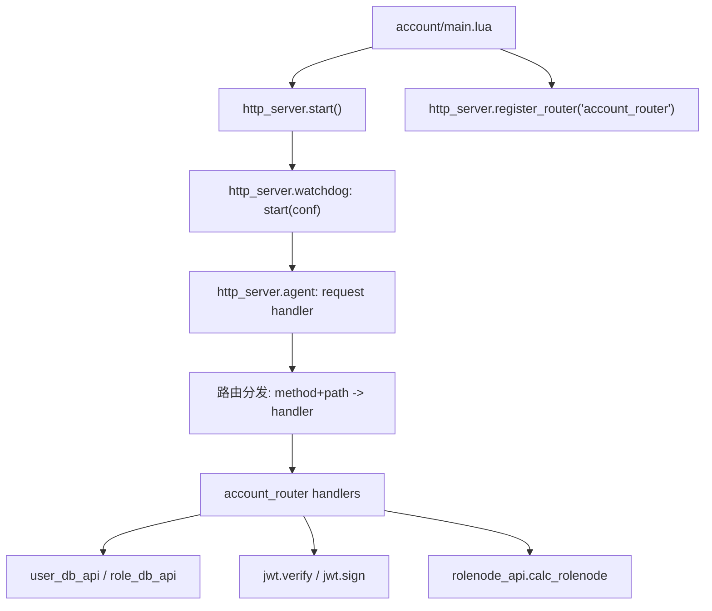
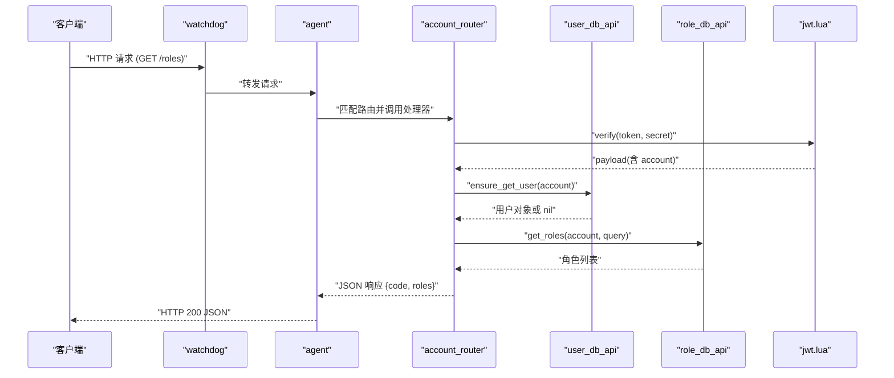
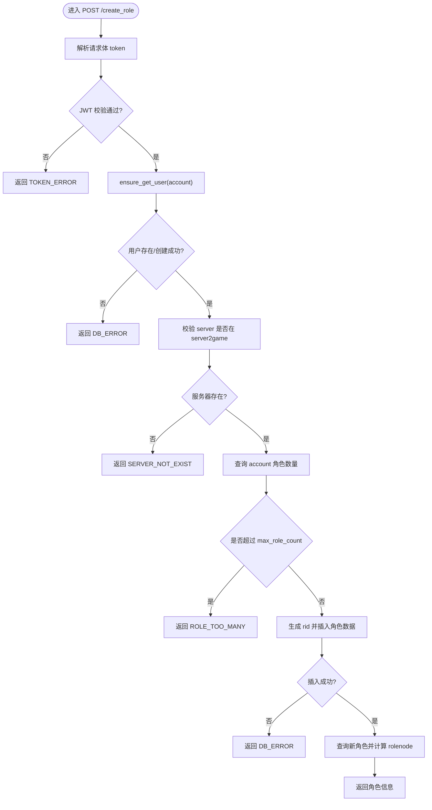
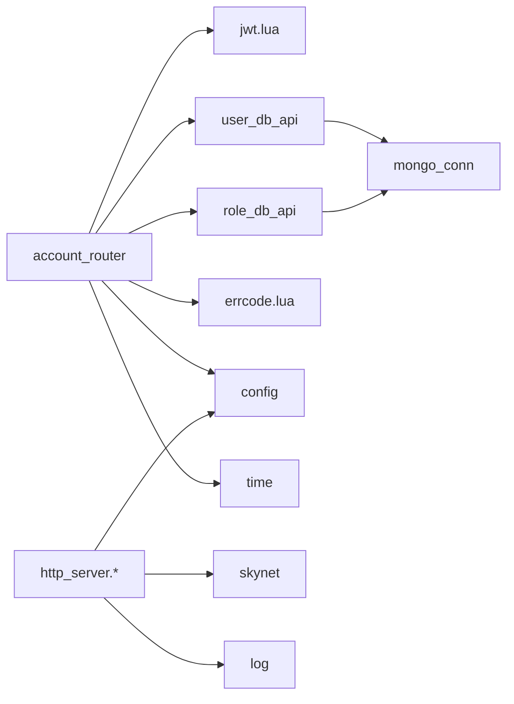

# Account 服务

<cite>
**本文引用的文件**
- [app/account/main.lua](file://app/account/main.lua)
- [app/account/lualib/account_router.lua](file://app/account/lualib/account_router.lua)
- [lualib/http_server/init.lua](file://lualib/http_server/init.lua)
- [lualib/http_server/watchdog.lua](file://lualib/http_server/watchdog.lua)
- [lualib/http_server/agent.lua](file://lualib/http_server/agent.lua)
- [etc/app/account1.app.lua](file://etc/app/account1.app.lua)
- [etc/app/account2.app.lua](file://etc/app/account2.app.lua)
- [etc/app/common.app.lua](file://etc/app/common.app.lua)
- [etc/core.conf.lua](file://etc/core.conf.lua)
- [etc/account1.conf.lua](file://etc/account1.conf.lua)
- [etc/account2.conf.lua](file://etc/account2.conf.lua)
- [lualib/jwt.lua](file://lualib/jwt.lua)
- [lualib/user_db_api.lua](file://lualib/user_db_api.lua)
- [lualib/role_db_api.lua](file://lualib/role_db_api.lua)
- [lualib/errcode.lua](file://lualib/errcode.lua)
</cite>

## 目录
1. [简介](#简介)
2. [项目结构](#项目结构)
3. [核心组件](#核心组件)
4. [架构总览](#架构总览)
5. [详细组件分析](#详细组件分析)
6. [依赖关系分析](#依赖关系分析)
7. [性能考虑](#性能考虑)
8. [故障排查指南](#故障排查指南)
9. [结论](#结论)
10. [附录](#附录)

## 简介
本文件为 Account 服务的完整技术文档，覆盖以下内容：
- 服务启动流程、HTTP 服务器配置与路由注册机制
- 账号注册、登录验证、JWT Token 生成与管理
- HTTP API 接口实现（用户注册、创建角色、状态查询）
- 配置参数说明（端口、代理数量等）
- 错误处理机制与日志记录方案
- 请求响应示例与集成要点

## 项目结构
Account 服务基于 Skynet 框架运行，入口脚本位于 app/account/main.lua。服务通过 http_server 模块启动 HTTP 监听，并动态注册路由表 account_router。配置集中在 etc/app/*.app.lua 与 etc/core.conf.lua 中，数据库访问由 user_db_api 与 role_db_api 封装，鉴权使用 jwt.lua。

图表来源
- [app/account/main.lua:7-16](file://app/account/main.lua#L7-L16)
- [lualib/http_server/init.lua:8-20](file://lualib/http_server/init.lua#L8-L20)
- [lualib/http_server/watchdog.lua:13-39](file://lualib/http_server/watchdog.lua#L13-L39)
- [lualib/http_server/agent.lua:31-118](file://lualib/http_server/agent.lua#L31-L118)
- [app/account/lualib/account_router.lua:15-140](file://app/account/lualib/account_router.lua#L15-L140)

章节来源
- [app/account/main.lua:1-25](file://app/account/main.lua#L1-L25)
- [etc/core.conf.lua:1-30](file://etc/core.conf.lua#L1-L30)
- [etc/app/account1.app.lua:1-21](file://etc/app/account1.app.lua#L1-L21)
- [etc/app/account2.app.lua:1-21](file://etc/app/account2.app.lua#L1-L21)

## 核心组件
- 启动器与 HTTP 服务
  - 入口 main.lua 读取配置，启动 http_server，并注册路由表。
  - watchdog 负责创建多个 agent 进程，轮询分配连接；agent 解析 HTTP 请求并调用路由处理器。
- 路由与业务逻辑
  - account_router 提供 GET /roles、POST /create_role 等接口，进行 JWT 校验、角色查询与创建。
- 数据访问层
  - user_db_api 管理用户账户与角色 ID 列表；role_db_api 管理角色数据，支持按 account/server 查询。
- 鉴权与令牌
  - jwt.lua 提供 HS256/HS512 的 token 签发与校验，包含时间有效性检查。
- 配置与日志
  - common.app.lua 集中定义 MongoDB、etcd、日志等级、JWT 密钥、server2game 映射等。
  - 各 app 配置文件指定端口、agent 数量、机器 ID 等。

章节来源
- [lualib/http_server/watchdog.lua:13-39](file://lualib/http_server/watchdog.lua#L13-L39)
- [lualib/http_server/agent.lua:31-118](file://lualib/http_server/agent.lua#L31-L118)
- [app/account/lualib/account_router.lua:15-140](file://app/account/lualib/account_router.lua#L15-L140)
- [lualib/user_db_api.lua:1-90](file://lualib/user_db_api.lua#L1-L90)
- [lualib/role_db_api.lua:1-85](file://lualib/role_db_api.lua#L1-L85)
- [lualib/jwt.lua:17-100](file://lualib/jwt.lua#L17-L100)
- [etc/app/common.app.lua:1-100](file://etc/app/common.app.lua#L1-L100)

## 架构总览
Account 服务采用“入口 -> HTTP 网关 -> 路由 -> 业务 -> 数据”的分层架构。HTTP 网关由 watchdog + agent 组成，支持多 agent 并发；路由层将方法+路径映射到具体处理器；业务层完成鉴权、数据读写与跨节点信息计算；数据层通过 mongo_conn 访问 MongoDB。

图表来源
- [lualib/http_server/watchdog.lua:13-39](file://lualib/http_server/watchdog.lua#L13-L39)
- [lualib/http_server/agent.lua:31-118](file://lualib/http_server/agent.lua#L31-L118)
- [app/account/lualib/account_router.lua:20-59](file://app/account/lualib/account_router.lua#L20-L59)
- [lualib/user_db_api.lua:60-80](file://lualib/user_db_api.lua#L60-L80)
- [lualib/role_db_api.lua:12-42](file://lualib/role_db_api.lua#L12-L42)
- [lualib/jwt.lua:17-67](file://lualib/jwt.lua#L17-L67)

## 详细组件分析

### 启动流程与 HTTP 服务器配置
- 启动入口
  - main.lua 读取配置中的 account_http_port 与 account_agent_count，调用 http_server.start 启动监听，并通过 register_router 注册路由表。
- watchdog 工作模式
  - 根据 agent_count 创建多个 http_agent_* 子服务，监听端口后将请求轮询分发给 agent。
- agent 请求处理
  - 解析 HTTP 请求，构建 req/res 对象，查找 method+path 对应的处理器并执行；支持写 JSON、写文件、设置 CORS 头。
- 配置项
  - 端口与代理数：在 etc/app/account*.app.lua 中设置 account_http_port、account_agent_count。
  - 请求体大小：common.app.lua 中 http_request_body_size 控制最大请求体。
  - 服务路径：core.conf.lua 定义 luaservice、lua_path、lua_cpath 等加载路径。

章节来源
- [app/account/main.lua:7-16](file://app/account/main.lua#L7-L16)
- [lualib/http_server/watchdog.lua:13-39](file://lualib/http_server/watchdog.lua#L13-L39)
- [lualib/http_server/agent.lua:20-118](file://lualib/http_server/agent.lua#L20-L118)
- [etc/app/account1.app.lua:13-18](file://etc/app/account1.app.lua#L13-L18)
- [etc/app/account2.app.lua:13-18](file://etc/app/account2.app.lua#L13-L18)
- [etc/app/common.app.lua:90-100](file://etc/app/common.app.lua#L90-L100)
- [etc/core.conf.lua:1-30](file://etc/core.conf.lua#L1-L30)

### 路由注册机制
- 注册方式
  - http_server.init 暴露 start 与 register_router；main.lua 调用后者传入路由模块名。
- 路由分发
  - watchdog 将 register_router 命令广播给所有 agent；每个 agent 加载路由模块，将 method->path->handler 注册到内部表。
- 路由表结构
  - account_router 以 GET/POST 为键，值为路径到处理器的映射。

章节来源
- [lualib/http_server/init.lua:8-20](file://lualib/http_server/init.lua#L8-L20)
- [lualib/http_server/watchdog.lua:35-39](file://lualib/http_server/watchdog.lua#L35-L39)
- [lualib/http_server/agent.lua:156-168](file://lualib/http_server/agent.lua#L156-L168)
- [app/account/lualib/account_router.lua:15-18](file://app/account/lualib/account_router.lua#L15-L18)

### 账号注册与角色创建
- 接口：POST /create_role
- 流程
  - 从请求体读取 token，调用 jwt.verify 校验；若失败返回 TOKEN_ERROR。
  - 使用 ensure_get_user 确保用户存在（不存在则创建）。
  - 校验 server 是否存在于 server2game 映射。
  - 查询当前 account 的角色数量，超过 max_role_count 返回 ROLE_TOO_MANY。
  - 生成唯一 rid，写入角色数据并同步更新用户的 rids 列表。
  - 查询新角色并计算 rolenode，返回角色信息。
- 错误处理
  - 数据库异常返回 DB_ERROR；服务器不存在返回 SERVER_NOT_EXIST；token 错误返回 TOKEN_ERROR。

图表来源
- [app/account/lualib/account_router.lua:61-140](file://app/account/lualib/account_router.lua#L61-L140)
- [lualib/user_db_api.lua:60-80](file://lualib/user_db_api.lua#L60-L80)
- [lualib/role_db_api.lua:56-75](file://lualib/role_db_api.lua#L56-L75)
- [etc/app/common.app.lua:79-97](file://etc/app/common.app.lua#L79-L97)

章节来源
- [app/account/lualib/account_router.lua:61-140](file://app/account/lualib/account_router.lua#L61-L140)
- [lualib/user_db_api.lua:46-80](file://lualib/user_db_api.lua#L46-L80)
- [lualib/role_db_api.lua:56-75](file://lualib/role_db_api.lua#L56-L75)
- [lualib/errcode.lua:1-29](file://lualib/errcode.lua#L1-L29)

### 登录验证与 JWT Token 管理
- 令牌生成
  - jwt.sign(payload, secret, alg, exp_secs) 支持 HS256/HS512，自动添加 iat/exp，并进行签名。
- 令牌校验
  - jwt.verify(token, secret) 解析三段式 token，校验 header.typ=JWT、算法支持、签名一致性、nbf/iat/exp 时间有效性。
- 服务端使用
  - account_router 使用 login_jwt_secret 对 token 进行校验，提取 account 用于后续操作。
- 建议
  - 登录接口应调用 jwt.sign 生成 token 并返回给客户端；后续请求携带 token 进行鉴权。

章节来源
- [lualib/jwt.lua:17-100](file://lualib/jwt.lua#L17-L100)
- [app/account/lualib/account_router.lua:11-13](file://app/account/lualib/account_router.lua#L11-L13)
- [etc/app/common.app.lua:90](file://etc/app/common.app.lua#L90)

### HTTP API 接口说明
- GET /roles
  - 功能：查询账号下的角色列表，可选按 server 过滤；返回角色及对应 rolenode。
  - 鉴权：需携带有效 token（query.token），否则返回 TOKEN_ERROR。
  - 响应：{ code: OK, roles: [...] } 或 { code: SERVER_NOT_EXIST }。
- POST /create_role
  - 功能：创建新角色，需携带 token、server、name；限制单账号角色数量。
  - 鉴权：同上。
  - 响应：{ code: OK, role: {...} } 或错误码。
- 登录接口（建议）
  - 功能：校验用户名/密码后签发 JWT token。
  - 注意：当前仓库未提供登录处理器，可参考 account_router 的模式新增。

章节来源
- [app/account/lualib/account_router.lua:20-59](file://app/account/lualib/account_router.lua#L20-L59)
- [app/account/lualib/account_router.lua:61-140](file://app/account/lualib/account_router.lua#L61-L140)
- [lualib/errcode.lua:1-29](file://lualib/errcode.lua#L1-L29)

### 配置参数说明
- 服务端口与并发
  - account_http_port：HTTP 服务端口（如 8080/8081）。
  - account_agent_count：HTTP agent 数量，影响并发处理能力。
- 日志配置
  - log_config：输出到文件与控制台，支持 size/line/day/hour 分割策略与文件大小限制。
- 数据库配置
  - mongo_config.center/role：连接池大小、主机、端口、认证信息与集合索引。
  - user_db_name/coll、role_db_name/coll：数据库与集合名称。
- 其他
  - max_role_count：单账号最大角色数。
  - login_jwt_secret：JWT 签名密钥。
  - server2game：客户端可见的服务与游戏服映射。
  - http_request_body_size：HTTP 请求体最大字节数。

章节来源
- [etc/app/account1.app.lua:1-21](file://etc/app/account1.app.lua#L1-L21)
- [etc/app/account2.app.lua:1-21](file://etc/app/account2.app.lua#L1-L21)
- [etc/app/common.app.lua:1-100](file://etc/app/common.app.lua#L1-L100)

### 错误处理机制
- 统一错误码
  - errcode 定义了 OK、TOKEN_ERROR、DB_ERROR、ROLE_TOO_MANY、SERVER_NOT_EXIST 等。
- 处理策略
  - 路由处理器在失败时返回对应错误码；agent 层记录警告日志；watchdog 层保证服务稳定。
- 并发安全
  - user_db_api.ensure_get_user 处理并发创建导致的重复键冲突，重试读取。

章节来源
- [lualib/errcode.lua:1-29](file://lualib/errcode.lua#L1-L29)
- [lualib/user_db_api.lua:60-80](file://lualib/user_db_api.lua#L60-L80)
- [app/account/lualib/account_router.lua:24-59](file://app/account/lualib/account_router.lua#L24-L59)
- [app/account/lualib/account_router.lua:61-140](file://app/account/lualib/account_router.lua#L61-L140)

### 日志记录方案
- 日志级别
  - DEBUG/INFO/WARN/ERROR/FATAL，默认等级在 common.app.lua 中设置。
- 输出目标
  - 文件与控制台；可按大小/行数/天/小时切分。
- 关键日志点
  - 启动/结束、请求处理、JWT 校验失败、数据库操作结果、角色创建过程。

章节来源
- [etc/app/common.app.lua:1-19](file://etc/app/common.app.lua#L1-L19)
- [app/account/main.lua:18-24](file://app/account/main.lua#L18-L24)
- [lualib/http_server/agent.lua:31-118](file://lualib/http_server/agent.lua#L31-L118)
- [app/account/lualib/account_router.lua:20-140](file://app/account/lualib/account_router.lua#L20-L140)

## 依赖关系分析
- 模块耦合
  - account_router 依赖 jwt、user_db_api、role_db_api、rolenode_api、errcode、config、time。
  - http_server 依赖 skynet、socket、httpd、cmd_api、log、config。
- 外部依赖
  - MongoDB：通过 mongo_conn 访问 center/role 库。
  - etcd：common.app.lua 中配置了 etcd 连接端点（当前 Account 服务主要使用 MongoDB）。
- 潜在循环依赖
  - 无直接循环；user_db_api 与 role_db_api 相互独立，通过配置初始化集合对象。

图表来源
- [app/account/lualib/account_router.lua:1-10](file://app/account/lualib/account_router.lua#L1-L10)
- [lualib/http_server/agent.lua:1-20](file://lualib/http_server/agent.lua#L1-L20)
- [lualib/user_db_api.lua:1-7](file://lualib/user_db_api.lua#L1-L7)
- [lualib/role_db_api.lua:1-6](file://lualib/role_db_api.lua#L1-L6)

章节来源
- [app/account/lualib/account_router.lua:1-10](file://app/account/lualib/account_router.lua#L1-L10)
- [lualib/http_server/agent.lua:1-20](file://lualib/http_server/agent.lua#L1-L20)
- [lualib/user_db_api.lua:1-7](file://lualib/user_db_api.lua#L1-L7)
- [lualib/role_db_api.lua:1-6](file://lualib/role_db_api.lua#L1-L6)

## 性能考虑
- HTTP 并发
  - 通过 account_agent_count 调整 agent 数量，提升并发处理能力；watchdog 轮询分发请求。
- 数据库连接
  - mongo_config.connections 控制连接池大小；合理设置避免连接耗尽。
- 请求体大小
  - http_request_body_size 限制请求体，防止过大负载。
- 角色数量限制
  - max_role_count 限制单账号角色数，减少查询与存储压力。
- 日志开销
  - 合理设置日志等级与切分策略，避免 IO 瓶颈。

[本节为通用指导，不直接分析具体文件]

## 故障排查指南
- JWT 校验失败
  - 检查 login_jwt_secret 是否一致；确认 token 格式与有效期；查看日志中的 TOKEN_ERROR。
- 服务器不存在
  - 检查 server2game 映射是否包含请求的 server；确认配置正确。
- 角色数量超限
  - 调整 max_role_count 或清理多余角色；关注 ROLE_TOO_MANY 错误。
- 数据库错误
  - 检查 MongoDB 连接与权限；查看 DB_ERROR 日志；确认集合索引与字段结构。
- 启动失败
  - 检查端口占用、agent 数量、日志输出路径；查看 bootfail.log。

章节来源
- [app/account/lualib/account_router.lua:24-59](file://app/account/lualib/account_router.lua#L24-L59)
- [app/account/lualib/account_router.lua:61-140](file://app/account/lualib/account_router.lua#L61-L140)
- [etc/app/common.app.lua:21-72](file://etc/app/common.app.lua#L21-L72)
- [etc/app/common.app.lua:1-19](file://etc/app/common.app.lua#L1-L19)

## 结论
Account 服务通过清晰的层次化设计与模块化实现，提供了稳定的 HTTP 接入、JWT 鉴权与角色管理能力。其配置灵活、错误处理完善、日志可观测性强，适合在生产环境中扩展与运维。建议在实际部署中合理配置并发、数据库连接与日志策略，并结合监控告警保障服务稳定性。

[本节为总结性内容，不直接分析具体文件]

## 附录

### 请求与响应示例
- 获取角色列表
  - 请求：GET /roles?token=<JWT>&server=s1
  - 响应：{ code: 0, roles: [{ rid, server, name, rolenode }, ...] }
- 创建角色
  - 请求：POST /create_role
    - Body: { token: "<JWT>", server: "s1", name: "HeroA" }
  - 响应：{ code: 0, role: { rid, server, game, name, create_time, rolenode } }
- 登录接口（建议实现）
  - 请求：POST /login
    - Body: { username: "...", password: "..." }
  - 响应：{ code: 0, token: "<JWT>" }

[本节为概念性示例，不直接分析具体文件]

### 集成要点
- 客户端需在请求中携带有效 token；服务端通过 jwt.verify 校验。
- 前端需允许跨域（Access-Control-Allow-* 已内置）。
- 后端需确保 server2game 映射与实际游戏服一致。
- 数据库需预先创建集合与索引（见 common.app.lua）。

[本节为概念性指导，不直接分析具体文件]