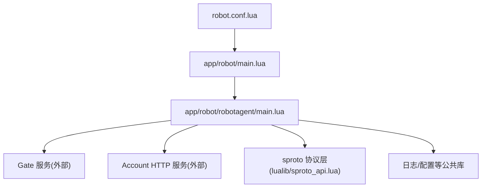
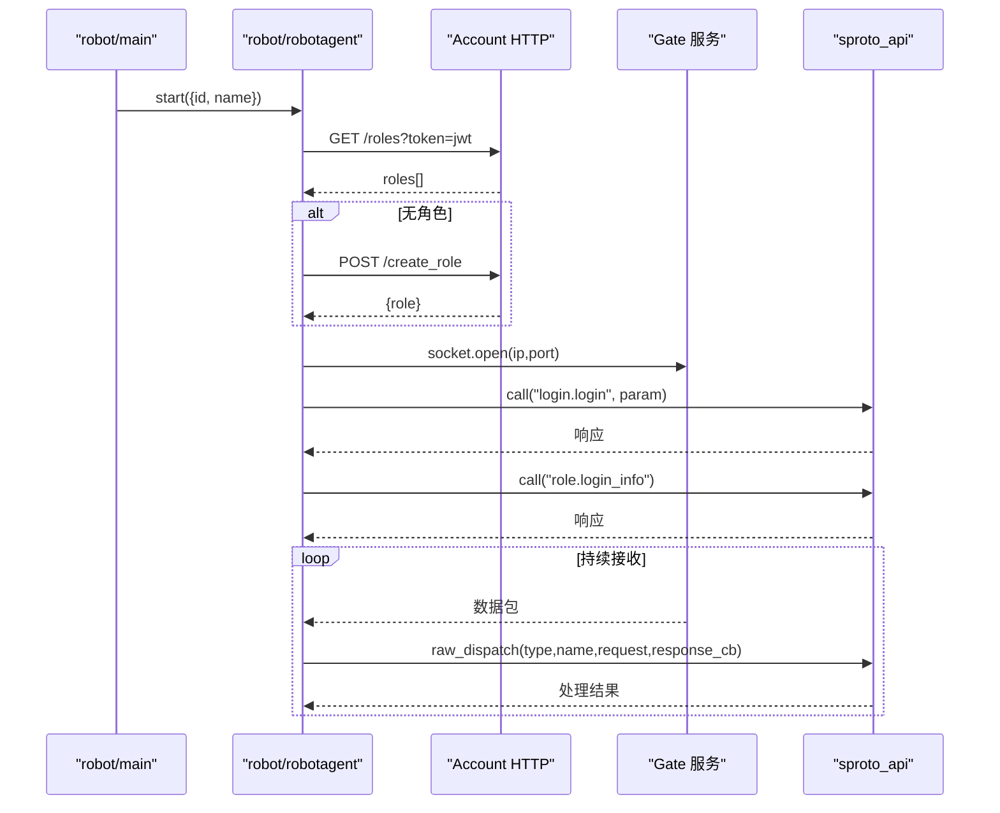
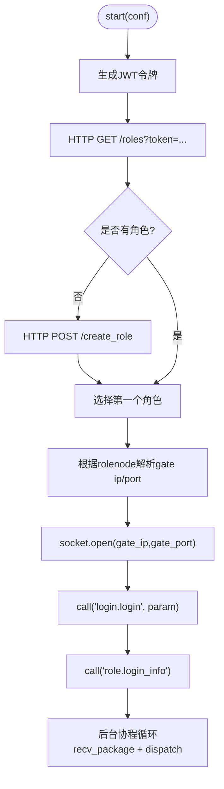
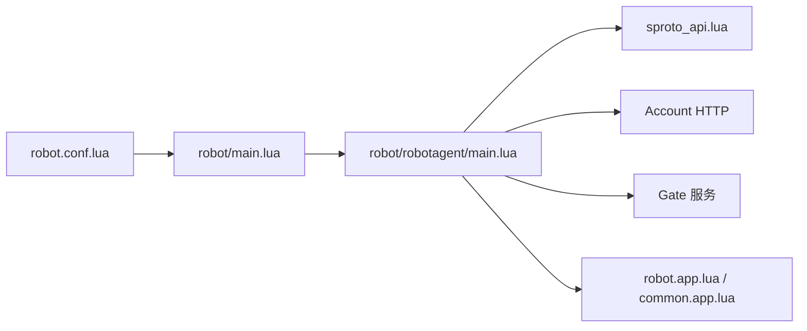

# Robot 服务

<cite>
**本文引用的文件**
- [app/robot/main.lua](file://app/robot/main.lua)
- [app/robot/robotagent/main.lua](file://app/robot/robotagent/main.lua)
- [etc/robot.conf.lua](file://etc/robot.conf.lua)
- [etc/app/robot.app.lua](file://etc/app/robot.app.lua)
- [etc/app/common.app.lua](file://etc/app/common.app.lua)
- [lualib/sproto_api.lua](file://lualib/sproto_api.lua)
- [proto/base.sproto](file://proto/base.sproto)
- [proto/roleagent/role.sproto](file://proto/roleagent/role.sproto)
- [app/role/roleagent/modules/role/request.lua](file://app/role/roleagent/modules/role/request.lua)
</cite>

## 目录
1. [简介](#简介)
2. [项目结构](#项目结构)
3. [核心组件](#核心组件)
4. [架构总览](#架构总览)
5. [详细组件分析](#详细组件分析)
6. [依赖关系分析](#依赖关系分析)
7. [性能与指标](#性能与指标)
8. [故障排查指南](#故障排查指南)
9. [结论](#结论)
10. [附录：测试场景与用例编写指南](#附录测试场景与用例编写指南)

## 简介
Robot 服务是用于对游戏系统进行压力测试、负载测试与性能基准测试的机器人代理集合。它通过模拟真实用户行为（登录、获取角色信息等）与 Gate 服务建立长连接，按配置并发启动多个机器人代理，持续收发协议消息，从而对后端系统施加可控的压力。本文档将详细说明其启动流程、连接管理、配置方式、并发控制、请求模式扩展方法，以及如何在现有基础上收集性能指标并生成报告。

## 项目结构
Robot 服务由入口服务与若干机器人代理组成，配置文件集中管理机器人数量、网关节点、账户服务地址等关键参数。

图表来源
- [etc/robot.conf.lua:1-3](file://etc/robot.conf.lua#L1-L3)
- [app/robot/main.lua:5-21](file://app/robot/main.lua#L5-L21)
- [app/robot/robotagent/main.lua:30-95](file://app/robot/robotagent/main.lua#L30-L95)
- [lualib/sproto_api.lua:136-159](file://lualib/sproto_api.lua#L136-L159)

章节来源
- [etc/robot.conf.lua:1-3](file://etc/robot.conf.lua#L1-L3)
- [etc/app/robot.app.lua:1-29](file://etc/app/robot.app.lua#L1-L29)
- [app/robot/main.lua:5-21](file://app/robot/main.lua#L5-L21)

## 核心组件
- 机器人主进程：负责读取配置、按需启动多个 robotagent 子服务，并在非守护模式下启动控制台。
- 机器人代理：每个代理代表一个“虚拟用户”，完成鉴权、连接 Gate、登录、获取角色信息，并循环处理来自 Gate 的消息。
- 协议与调用封装：基于 sproto 的请求/响应模型，提供 call/notify 与超时控制。
- 配置中心：集中定义机器人数量、Gate 节点、账户服务地址、JWT 密钥、日志策略等。

章节来源
- [app/robot/main.lua:5-21](file://app/robot/main.lua#L5-L21)
- [app/robot/robotagent/main.lua:30-95](file://app/robot/robotagent/main.lua#L30-L95)
- [lualib/sproto_api.lua:136-159](file://lualib/sproto_api.lua#L136-L159)
- [etc/app/robot.app.lua:1-29](file://etc/app/robot.app.lua#L1-L29)
- [etc/app/common.app.lua:1-100](file://etc/app/common.app.lua#L1-L100)

## 架构总览
Robot 服务整体工作流如下：
- 启动阶段：加载配置，创建指定数量的 robotagent，逐个初始化。
- 认证阶段：使用 JWT 向 Account 服务获取或创建角色，拿到角色所在 rolenode 对应的 Gate 地址。
- 连接阶段：通过 socket 连接 Gate，建立长连接；随后发送 login.login 与 role.login_info 完成登录与信息拉取。
- 运行阶段：后台协程不断从 socket 读取数据，解包后交由 sproto 分发到对应处理器，支持请求/响应与通知。

图表来源
- [app/robot/main.lua:11-19](file://app/robot/main.lua#L11-L19)
- [app/robot/robotagent/main.lua:30-95](file://app/robot/robotagent/main.lua#L30-L95)
- [lualib/sproto_api.lua:136-159](file://lualib/sproto_api.lua#L136-L159)

## 详细组件分析

### 机器人主进程（app/robot/main.lua）
- 功能：读取 robot_count，循环启动对应数量的 robotagent，并传入 id/name 标识。
- 关键点：
  - 非守护模式会启动 console 服务便于调试。
  - 启动完成后退出主进程，实际工作由子 agent 承担。

章节来源
- [app/robot/main.lua:5-21](file://app/robot/main.lua#L5-L21)

### 机器人代理（app/robot/robotagent/main.lua）
- 功能：
  - 生成 JWT 并访问 Account 服务获取或创建角色。
  - 根据角色所在的 rolenode 解析 Gate 地址并建立 TCP 连接。
  - 使用 sproto 进行登录与获取角色信息。
  - 后台协程循环读取并分发消息。
- 连接管理：
  - 维护全局 fd，错误时记录日志。
  - 自定义分包器，按长度前缀解析粘包/半包。
  - 使用 sproto 的 host:dispatch 与 raw_dispatch 实现协议路由。
- 会话与超时：
  - 每次 call 分配递增 session，配合 sproto_api 的超时机制避免阻塞。

图表来源
- [app/robot/robotagent/main.lua:30-95](file://app/robot/robotagent/main.lua#L30-L95)
- [app/robot/robotagent/main.lua:97-152](file://app/robot/robotagent/main.lua#L97-L152)

章节来源
- [app/robot/robotagent/main.lua:30-95](file://app/robot/robotagent/main.lua#L30-L95)
- [app/robot/robotagent/main.lua:97-152](file://app/robot/robotagent/main.lua#L97-L152)

### 协议与调用封装（lualib/sproto_api.lua）
- 功能：
  - 注册协议模块与命令映射。
  - 提供 call/notify 接口，内部维护 session 与超时。
  - 注册 client 协议，统一解包与分发。
- 关键点：
  - call 默认超时可配置，未收到响应会返回 nil 并记录错误。
  - raw_dispatch 负责将请求路由到已注册的处理器，并回写响应。

章节来源
- [lualib/sproto_api.lua:19-79](file://lualib/sproto_api.lua#L19-L79)
- [lualib/sproto_api.lua:97-159](file://lualib/sproto_api.lua#L97-L159)
- [lualib/sproto_api.lua:169-196](file://lualib/sproto_api.lua#L169-L196)

### 配置项（etc/app/robot.app.lua 与 etc/app/common.app.lua）
- 机器人相关：
  - robot_count：机器人代理数量，决定并发用户数。
  - account_host：Account 服务 HTTP 地址。
  - gate_nodes：各 rolenode 对应的 Gate 地址表。
- 通用配置：
  - log_config：日志输出目标与轮转策略。
  - etcd_config/mongo_config：集群与存储配置（可选）。
  - sproto_schema_path/proto_checksum_enable：协议加载与校验。
  - login_jwt_secret：登录 JWT 密钥。
  - server2game：服务器到游戏服映射。

章节来源
- [etc/app/robot.app.lua:1-29](file://etc/app/robot.app.lua#L1-L29)
- [etc/app/common.app.lua:1-100](file://etc/app/common.app.lua#L1-L100)

### 协议定义（proto/base.sproto 与 proto/roleagent/role.sproto）
- base.sproto：定义基础包结构（type、session、ud）。
- role.sproto：定义角色信息与登录信息接口。

章节来源
- [proto/base.sproto:1-7](file://proto/base.sproto#L1-L7)
- [proto/roleagent/role.sproto:1-12](file://proto/roleagent/role.sproto#L1-L12)

### 服务端侧角色接口示例（app/role/roleagent/modules/role/request.lua）
- 展示 role.login_info 的实现位置与返回结构，便于理解客户端期望的数据格式。

章节来源
- [app/role/roleagent/modules/role/request.lua:1-31](file://app/role/roleagent/modules/role/request.lua#L1-L31)

## 依赖关系分析
- 启动依赖：robot.conf 指向 app/robot/main.lua，后者再实例化 robotagent。
- 运行时依赖：
  - robotagent 依赖 sproto_api 进行协议编解码与调用。
  - 依赖 httpc 与 cjson 与 Account 服务交互。
  - 依赖 socket 与 Gate 建立长连接。
- 配置依赖：
  - robot.app.lua 覆盖日志与网络拓扑。
  - common.app.lua 提供 JWT、数据库、协议路径等通用配置。

图表来源
- [etc/robot.conf.lua:1-3](file://etc/robot.conf.lua#L1-L3)
- [app/robot/main.lua:5-21](file://app/robot/main.lua#L5-L21)
- [app/robot/robotagent/main.lua:30-95](file://app/robot/robotagent/main.lua#L30-L95)
- [etc/app/robot.app.lua:1-29](file://etc/app/robot.app.lua#L1-L29)
- [etc/app/common.app.lua:1-100](file://etc/app/common.app.lua#L1-L100)

章节来源
- [etc/robot.conf.lua:1-3](file://etc/robot.conf.lua#L1-L3)
- [app/robot/main.lua:5-21](file://app/robot/main.lua#L5-L21)
- [app/robot/robotagent/main.lua:30-95](file://app/robot/robotagent/main.lua#L30-L95)
- [etc/app/robot.app.lua:1-29](file://etc/app/robot.app.lua#L1-L29)
- [etc/app/common.app.lua:1-100](file://etc/app/common.app.lua#L1-L100)

## 性能与指标
- 并发用户数：通过配置 robot_count 直接控制并行运行的机器人代理数量。
- 请求模式：当前代理在登录后执行固定流程（login.login、role.login_info），可扩展为周期性业务动作以模拟真实负载。
- 指标采集建议：
  - 在 robotagent 中统计 call 成功/失败次数、平均耗时、P95/P99 延迟、每秒请求数（QPS）、连接断开重连次数。
  - 在 sproto_api.call 前后埋点，记录超时与异常。
  - 将指标写入日志或上报至监控系统（如 Prometheus 或自研指标服务）。
- 报告生成：
  - 基于日志聚合工具（如 awk/grep 或 ELK）汇总 QPS、错误率、延迟分布。
  - 结合压测脚本定时采集，生成时间序列报表与对比基线。

[本节为通用指导，不直接分析具体代码文件]

## 故障排查指南
- 无法获取角色：
  - 检查 account_host 是否可达、JWT 是否有效、/roles 与 /create_role 接口状态码与返回码。
- 连接 Gate 失败：
  - 确认 gate_nodes 中对应 rolenode 的 ip/port 正确，防火墙与安全组放行。
- 登录失败：
  - 核对 login.login 参数（token、rid、server、proto_checksum）与服务端期望一致。
- 消息分发失败：
  - 检查 sproto 协议版本与 checksum 是否匹配，确保 schema 路径正确且已加载。
- 超时问题：
  - 调整 sproto_timeout 或优化服务端处理逻辑，关注 sproto_api 中的超时日志。

章节来源
- [app/robot/robotagent/main.lua:30-95](file://app/robot/robotagent/main.lua#L30-L95)
- [lualib/sproto_api.lua:136-159](file://lualib/sproto_api.lua#L136-L159)
- [etc/app/common.app.lua:74-100](file://etc/app/common.app.lua#L74-L100)

## 结论
Robot 服务通过多进程/多协程的机器人代理，实现对系统的稳定压力注入。其优势在于：
- 配置简单：通过 robot_count 即可线性扩展并发用户。
- 协议清晰：基于 sproto 的请求/响应模型，易于扩展新业务动作。
- 可观测性：借助日志与可扩展的指标埋点，能够支撑性能基准与回归测试。

[本节为总结性内容，不直接分析具体代码文件]

## 附录：测试场景与用例编写指南

### 如何配置测试场景
- 设置并发用户数：修改 robot_count，启动 N 个机器人代理，每个代理即一个虚拟用户。
- 设置请求模式：在 robotagent 的循环中增加业务动作（如查询、战斗、交易等），形成不同场景。
- 设置流量模型：可通过定时器或随机间隔控制请求频率，模拟突发或平稳流量。

章节来源
- [etc/app/robot.app.lua:1-15](file://etc/app/robot.app.lua#L1-L15)
- [app/robot/robotagent/main.lua:126-152](file://app/robot/robotagent/main.lua#L126-L152)

### 如何编写测试用例
- 最小可用用例：
  - 启动 1 个机器人，完成登录与获取角色信息，验证链路通畅。
- 稳定性用例：
  - 长时间运行，观察连接断开与重连、错误重试、内存增长情况。
- 性能用例：
  - 逐步提升 robot_count，记录 QPS、延迟、错误率，绘制趋势图并与基线对比。

章节来源
- [app/robot/robotagent/main.lua:30-95](file://app/robot/robotagent/main.lua#L30-L95)
- [lualib/sproto_api.lua:136-159](file://lualib/sproto_api.lua#L136-L159)

### 结果分析方法
- 成功率：统计 call 成功次数与总次数，计算成功率。
- 延迟分布：统计 P50/P90/P95/P99，识别尾部延迟问题。
- 资源占用：监控 CPU、内存、网络 I/O，定位瓶颈。
- 错误归因：根据日志关键字（如超时、连接失败、协议错误）分类统计。

[本节为通用指导，不直接分析具体代码文件]