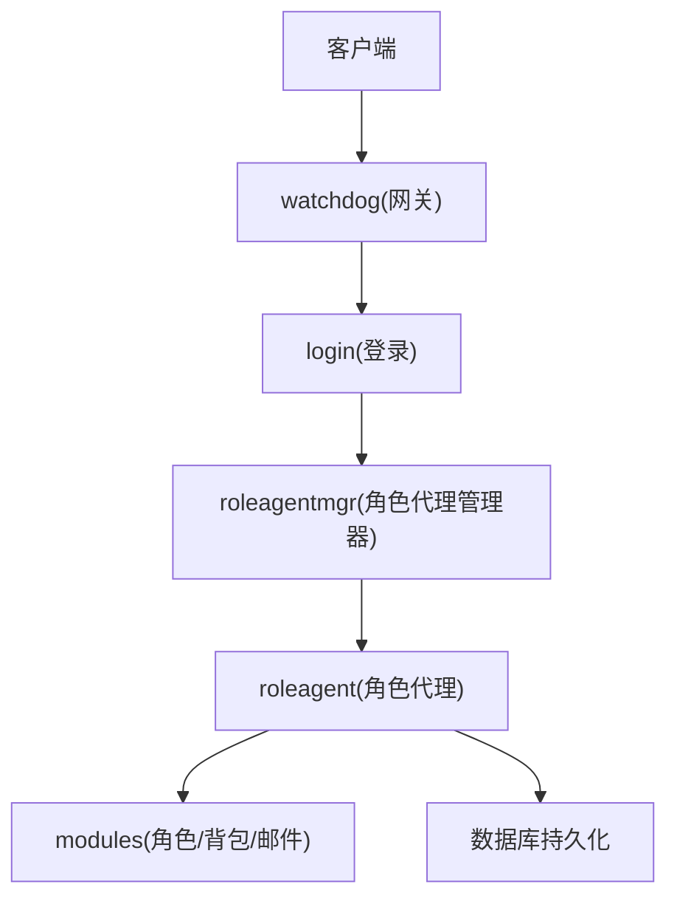
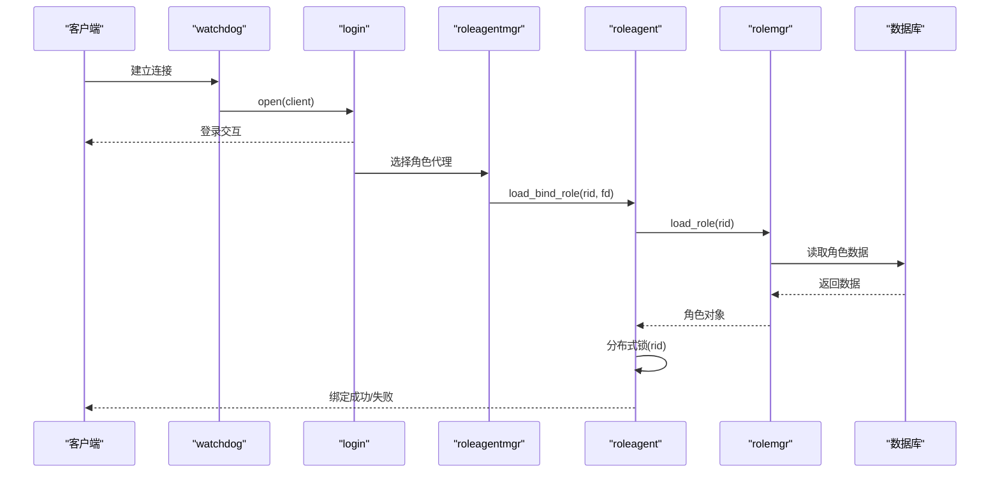
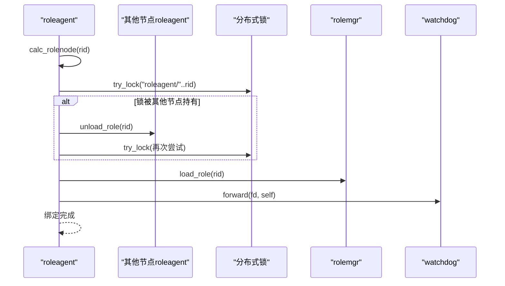
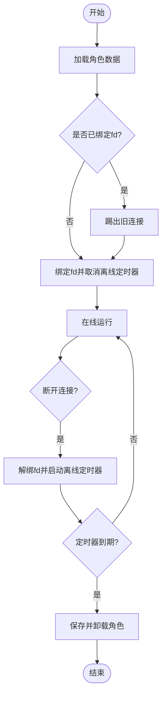
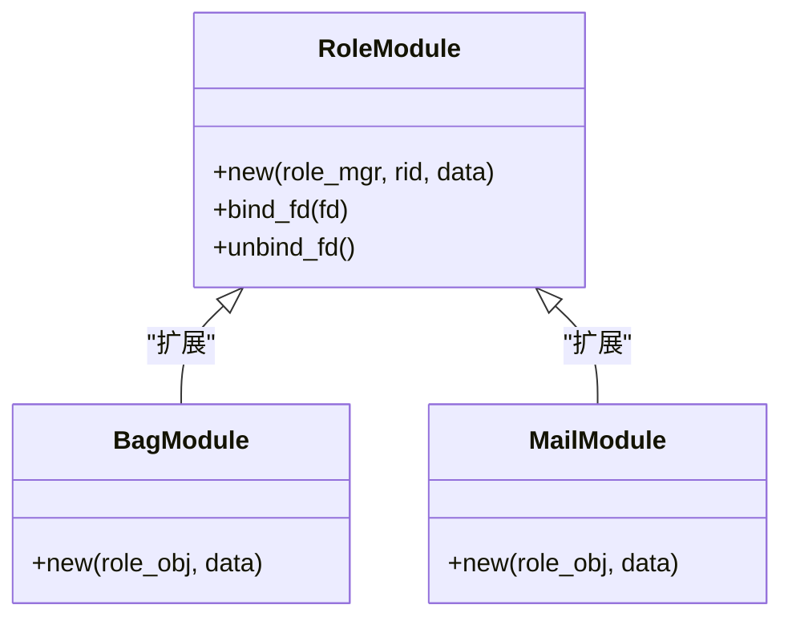
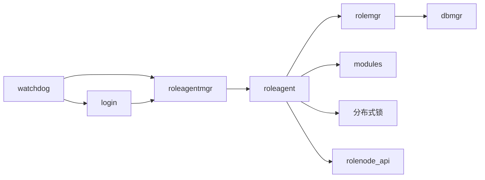

# 角色服务

<cite>
**本文引用的文件**
- [app/role/main.lua](file://app/role/main.lua)
- [app/role/watchdog.lua](file://app/role/watchdog.lua)
- [app/role/login/main.lua](file://app/role/login/main.lua)
- [app/role/roleagentmgr.lua](file://app/role/roleagentmgr.lua)
- [app/role/roleagent/main.lua](file://app/role/roleagent/main.lua)
- [app/role/roleagent/global.lua](file://app/role/roleagent/global.lua)
- [app/role/roleagent/client.lua](file://app/role/roleagent/client.lua)
- [app/role/roleagent/rolemgr.lua](file://app/role/roleagent/rolemgr.lua)
- [app/role/roleagent/modules/init.lua](file://app/role/roleagent/modules/init.lua)
- [app/role/roleagent/modules/role/init.lua](file://app/role/roleagent/modules/role/init.lua)
- [app/role/roleagent/modules/bag/init.lua](file://app/role/roleagent/modules/bag/init.lua)
- [app/role/roleagent/modules/mail/init.lua](file://app/role/roleagent/modules/mail/init.lua)
- [lualib/rolenode_api.lua](file://lualib/rolenode_api.lua)
- [proto/base.sproto](file://proto/base.sproto)
- [proto/roleagent/role.sproto](file://proto/roleagent/role.sproto)
- [schema/role.sproto](file://schema/role.sproto)
- [schema/bag.sproto](file://schema/bag.sproto)
</cite>

## 目录
1. [简介](#简介)
2. [项目结构](#项目结构)
3. [核心组件](#核心组件)
4. [架构总览](#架构总览)
5. [详细组件分析](#详细组件分析)
6. [依赖关系分析](#依赖关系分析)
7. [性能考虑](#性能考虑)
8. [故障恢复与一致性](#故障恢复与一致性)
9. [API 调用示例与最佳实践](#api-调用示例与最佳实践)
10. [结论](#结论)

## 简介
本文件为 Role 服务的全面技术文档，覆盖以下方面：
- 主节点与角色代理的通信机制
- 角色生命周期管理（创建、加载、在线绑定、离线卸载）
- 游戏会话管理与状态同步
- 数据持久化机制
- 角色模块系统（背包、邮件、角色属性等）
- 角色间通信协议与消息格式
- 性能优化策略与故障恢复机制
- API 调用示例与最佳实践

## 项目结构
Role 服务基于 Skynet 微服务架构，主要包含以下进程：
- watchdog：网关入口，负责客户端连接、转发到登录或角色代理
- login：登录阶段处理，完成后将连接转发至角色代理
- roleagentmgr：角色代理管理器，启动并维护多个角色代理实例
- roleagent：具体角色代理，负责角色加载、模块初始化、客户端绑定、锁与卸载协调
- modules：角色模块（角色、背包、邮件），按模块化管理角色数据与行为
- 协议与模式定义：base.sproto、role.sproto、bag.sproto 等

图表来源
- [app/role/watchdog.lua:12-62](file://app/role/watchdog.lua#L12-L62)
- [app/role/login/main.lua:15-35](file://app/role/login/main.lua#L15-L35)
- [app/role/roleagentmgr.lua:17-30](file://app/role/roleagentmgr.lua#L17-L30)
- [app/role/roleagent/main.lua:93-116](file://app/role/roleagent/main.lua#L93-L116)

章节来源
- [app/role/main.lua:6-24](file://app/role/main.lua#L6-L24)
- [app/role/watchdog.lua:58-81](file://app/role/watchdog.lua#L58-L81)
- [app/role/login/main.lua:15-35](file://app/role/login/main.lua#L15-L35)
- [app/role/roleagentmgr.lua:17-30](file://app/role/roleagentmgr.lua#L17-L30)
- [app/role/roleagent/main.lua:93-116](file://app/role/roleagent/main.lua#L93-L116)

## 核心组件
- watchdog：监听端口，接收新连接，转发到登录；登录后转发到角色代理；管理客户端关闭与错误。
- login：注册“login”模块，处理登录请求，完成后将 fd 转发给角色代理。
- roleagentmgr：根据配置启动多个 roleagent 实例，提供 GM 查询在线数量能力。
- roleagent：实现角色加载、绑定、卸载、分布式锁、跨节点卸载协调；初始化模块；注册服务名。
- rolemgr：角色对象缓存、加载/卸载、持久化保存/清理。
- modules：按模块组织角色数据（背包、邮件、角色属性），在加载时初始化。
- 协议与模式：base.sproto 定义包头；role.sproto 定义角色登录信息；schema 定义持久化数据结构。

章节来源
- [app/role/watchdog.lua:12-73](file://app/role/watchdog.lua#L12-L73)
- [app/role/login/main.lua:15-35](file://app/role/login/main.lua#L15-L35)
- [app/role/roleagentmgr.lua:17-48](file://app/role/roleagentmgr.lua#L17-L48)
- [app/role/roleagent/main.lua:23-116](file://app/role/roleagent/main.lua#L23-L116)
- [app/role/roleagent/rolemgr.lua:15-56](file://app/role/roleagent/rolemgr.lua#L15-L56)
- [app/role/roleagent/modules/init.lua:12-34](file://app/role/roleagent/modules/init.lua#L12-L34)
- [proto/base.sproto:1-7](file://proto/base.sproto#L1-L7)
- [proto/roleagent/role.sproto:1-13](file://proto/roleagent/role.sproto#L1-L13)
- [schema/role.sproto:1-24](file://schema/role.sproto#L1-L24)
- [schema/bag.sproto:1-16](file://schema/bag.sproto#L1-L16)

## 架构总览
Role 服务采用分层与分片结合的设计：
- 接入层：watchdog 统一接入，login 处理认证与路由
- 路由层：roleagentmgr 管理角色代理池，按规则分配角色
- 业务层：roleagent 承载角色逻辑，通过 rolemgr 管理角色对象与模块
- 数据层：dbmgr 负责角色数据的加载与卸载（持久化）
- 协议层：sproto 定义消息结构与模块接口

图表来源
- [app/role/watchdog.lua:12-22](file://app/role/watchdog.lua#L12-L22)
- [app/role/login/main.lua:21-25](file://app/role/login/main.lua#L21-L25)
- [app/role/roleagentmgr.lua:17-30](file://app/role/roleagentmgr.lua#L17-L30)
- [app/role/roleagent/main.lua:36-80](file://app/role/roleagent/main.lua#L36-L80)
- [app/role/roleagent/rolemgr.lua:15-25](file://app/role/roleagent/rolemgr.lua#L15-L25)

## 详细组件分析

### 角色代理与主节点通信机制
- 角色代理命名与服务注册：每个 agent 有唯一名称与服务名，启动后注册到集群发现。
- 负载与路由：roleagentmgr 启动多个 roleagent，并通过 cluster 进行跨节点调用。
- 角色绑定流程：load_bind_role 校验角色所在节点、加分布式锁、必要时通知其他节点卸载，再加载角色并绑定 fd，最后通过 watchdog 转发。

图表来源
- [app/role/roleagent/main.lua:36-80](file://app/role/roleagent/main.lua#L36-L80)
- [lualib/rolenode_api.lua:7-13](file://lualib/rolenode_api.lua#L7-L13)

章节来源
- [app/role/roleagent/main.lua:15-116](file://app/role/roleagent/main.lua#L15-L116)
- [app/role/roleagentmgr.lua:17-48](file://app/role/roleagentmgr.lua#L17-L48)
- [lualib/rolenode_api.lua:1-17](file://lualib/rolenode_api.lua#L1-L17)

### 角色生命周期管理
- 创建与加载：rolemgr.load_role 从数据库加载角色数据，构造角色对象，初始化模块。
- 在线绑定：client.bind 将 fd 与角色对象关联，设置角色 fd，取消离线卸载定时器。
- 离线卸载：角色解绑 fd 后启动定时器，超时后触发卸载，保存数据并释放内存。
- 强制卸载：当检测到角色在其他节点时，当前节点会通知对方卸载，确保一致性。

图表来源
- [app/role/roleagent/rolemgr.lua:15-56](file://app/role/roleagent/rolemgr.lua#L15-L56)
- [app/role/roleagent/modules/role/init.lua:21-38](file://app/role/roleagent/modules/role/init.lua#L21-L38)
- [app/role/roleagent/client.lua:20-43](file://app/role/roleagent/client.lua#L20-L43)

章节来源
- [app/role/roleagent/rolemgr.lua:15-56](file://app/role/roleagent/rolemgr.lua#L15-L56)
- [app/role/roleagent/modules/role/init.lua:9-38](file://app/role/roleagent/modules/role/init.lua#L9-L38)
- [app/role/roleagent/client.lua:20-43](file://app/role/roleagent/client.lua#L20-L43)

### 游戏会话管理与状态同步
- 会话管理：watchdog 维护客户端 fd 与转发服务映射；login 与 roleagent 分别在不同阶段接管 fd。
- 状态同步：角色对象在内存中维护 fd 与模块数据；离线时通过定时器触发保存，保证状态一致。
- 跨节点同步：分布式锁确保同一角色在同一时刻仅由一个角色代理持有，避免并发冲突。

章节来源
- [app/role/watchdog.lua:12-73](file://app/role/watchdog.lua#L12-L73)
- [app/role/roleagent/main.lua:25-80](file://app/role/roleagent/main.lua#L25-L80)
- [app/role/roleagent/modules/role/init.lua:21-38](file://app/role/roleagent/modules/role/init.lua#L21-L38)

### 数据持久化机制
- 角色数据模型：role.sproto 定义角色基础字段与模块列表；bag.sproto 定义背包资源结构。
- 加载与卸载：rolemgr 使用 dbmgr 进行角色数据的读取与保存；卸载时先保存再释放。
- 模块数据：modules.init 在加载时初始化各模块数据，支持后续扩展。

章节来源
- [schema/role.sproto:1-24](file://schema/role.sproto#L1-L24)
- [schema/bag.sproto:1-16](file://schema/bag.sproto#L1-L16)
- [app/role/roleagent/rolemgr.lua:15-56](file://app/role/roleagent/rolemgr.lua#L15-L56)
- [app/role/roleagent/modules/init.lua:12-34](file://app/role/roleagent/modules/init.lua#L12-L34)

### 角色模块系统
- 模块初始化：modules.init 注册“role”、“mail”、“bag”模块，并在角色加载时初始化模块数据。
- 角色模块：role.init 管理角色对象的生命周期与 fd 绑定/解绑，以及离线卸载定时器。
- 背包模块：bag.init 初始化背包数据结构，预留资源分类与数量管理。
- 邮件模块：mail.init 预留邮件数据结构，便于后续扩展。

图表来源
- [app/role/roleagent/modules/role/init.lua:9-38](file://app/role/roleagent/modules/role/init.lua#L9-L38)
- [app/role/roleagent/modules/bag/init.lua:6-23](file://app/role/roleagent/modules/bag/init.lua#L6-L23)
- [app/role/roleagent/modules/mail/init.lua:6-13](file://app/role/roleagent/modules/mail/init.lua#L6-L13)

章节来源
- [app/role/roleagent/modules/init.lua:12-34](file://app/role/roleagent/modules/init.lua#L12-L34)
- [app/role/roleagent/modules/role/init.lua:9-38](file://app/role/roleagent/modules/role/init.lua#L9-L38)
- [app/role/roleagent/modules/bag/init.lua:6-23](file://app/role/roleagent/modules/bag/init.lua#L6-L23)
- [app/role/roleagent/modules/mail/init.lua:6-13](file://app/role/roleagent/modules/mail/init.lua#L6-L13)

### 角色间通信协议与消息格式
- 包结构：base.sproto 定义通用包头（类型、会话、用户数据）。
- 角色登录：role.sproto 定义角色信息与登录响应结构。
- 模块协议：通过 sproto_api.register_module 将模块与客户端绑定，实现模块化通信。

章节来源
- [proto/base.sproto:1-7](file://proto/base.sproto#L1-L7)
- [proto/roleagent/role.sproto:1-13](file://proto/roleagent/role.sproto#L1-L13)
- [app/role/roleagent/modules/init.lua:12-16](file://app/role/roleagent/modules/init.lua#L12-L16)

## 依赖关系分析
- watchdog 依赖 login 与 roleagentmgr，负责连接生命周期管理。
- login 依赖 watchdog 与 roleagentmgr，负责登录阶段转发。
- roleagentmgr 依赖 roleagent，负责实例化与管理。
- roleagent 依赖 rolemgr、modules、distributed_lock、rolenode_api，负责角色逻辑与一致性。
- rolemgr 依赖 dbmgr、config，负责数据持久化与配置。
- modules 依赖各自子模块，负责角色数据与行为。

图表来源
- [app/role/watchdog.lua:58-81](file://app/role/watchdog.lua#L58-L81)
- [app/role/login/main.lua:15-35](file://app/role/login/main.lua#L15-L35)
- [app/role/roleagentmgr.lua:17-48](file://app/role/roleagentmgr.lua#L17-L48)
- [app/role/roleagent/main.lua:93-116](file://app/role/roleagent/main.lua#L93-L116)
- [app/role/roleagent/rolemgr.lua:15-56](file://app/role/roleagent/rolemgr.lua#L15-L56)

章节来源
- [app/role/watchdog.lua:58-81](file://app/role/watchdog.lua#L58-L81)
- [app/role/login/main.lua:15-35](file://app/role/login/main.lua#L15-L35)
- [app/role/roleagentmgr.lua:17-48](file://app/role/roleagentmgr.lua#L17-L48)
- [app/role/roleagent/main.lua:93-116](file://app/role/roleagent/main.lua#L93-L116)
- [app/role/roleagent/rolemgr.lua:15-56](file://app/role/roleagent/rolemgr.lua#L15-L56)

## 性能考虑
- 角色对象缓存：rolemgr 维护 g_roles 表，避免重复加载，降低数据库压力。
- 离线卸载延迟：通过定时器延迟卸载，减少频繁切换带来的开销。
- 分布式锁：避免多节点同时操作同一角色，防止竞态条件。
- 模块懒加载：预留 lazy_load 机制，按需加载不常用数据，提升启动速度。
- 连接复用：watchdog 与 login 分离，减少单点瓶颈。

章节来源
- [app/role/roleagent/rolemgr.lua:15-56](file://app/role/roleagent/rolemgr.lua#L15-L56)
- [app/role/roleagent/modules/role/init.lua:21-38](file://app/role/roleagent/modules/role/init.lua#L21-L38)
- [app/role/roleagent/main.lua:25-80](file://app/role/roleagent/main.lua#L25-L80)

## 故障恢复与一致性
- 锁过期回调：分布式锁过期时自动卸载角色，防止僵尸角色占用资源。
- 跨节点卸载：当角色被锁定在其他节点时，主动通知对方卸载，确保一致性。
- 连接异常处理：watchdog 对 socket 错误与关闭进行处理，清理转发关系。
- 回退机制：多次尝试获取锁失败时返回明确错误码，便于上层重试或提示。

章节来源
- [app/role/roleagent/main.lua:25-80](file://app/role/roleagent/main.lua#L25-L80)
- [app/role/watchdog.lua:44-47](file://app/role/watchdog.lua#L44-L47)

## API 调用示例与最佳实践
- 登录流程
  - 客户端连接 watchdog，进入 login 模块进行认证
  - 认证成功后，login 将 fd 转发至 roleagentmgr 选择的 roleagent
  - roleagent 执行 load_bind_role，完成角色加载与绑定
- 角色操作
  - 通过 sproto_api.register_module 注册的模块接口进行通信
  - 使用 role.sproto 中的 login_info 获取角色信息
- 最佳实践
  - 合理设置离线卸载时间，平衡内存与性能
  - 使用分布式锁避免并发冲突
  - 模块设计保持高内聚低耦合，便于扩展与维护

章节来源
- [app/role/login/main.lua:21-25](file://app/role/login/main.lua#L21-L25)
- [app/role/roleagent/main.lua:36-80](file://app/role/roleagent/main.lua#L36-L80)
- [proto/roleagent/role.sproto:7-12](file://proto/roleagent/role.sproto#L7-L12)
- [app/role/roleagent/modules/init.lua:12-16](file://app/role/roleagent/modules/init.lua#L12-L16)

## 结论
Role 服务通过 watchdog、login、roleagentmgr、roleagent 的分层协作，实现了可扩展的角色管理与会话控制。借助分布式锁与定时器机制，保证了角色的一致性与资源回收。模块化的设计使得背包、邮件等功能易于扩展与维护。未来可进一步优化负载均衡与懒加载策略，以提升整体性能与稳定性。