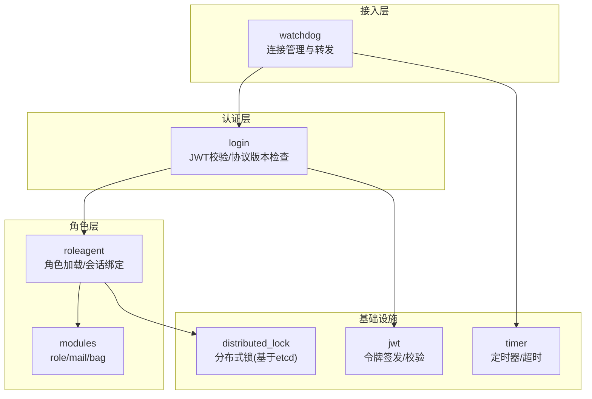
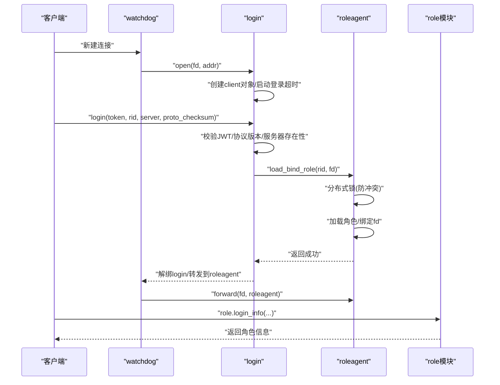
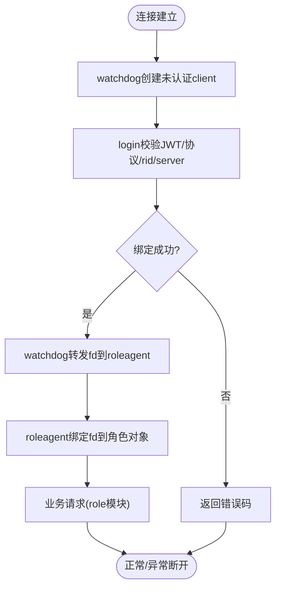
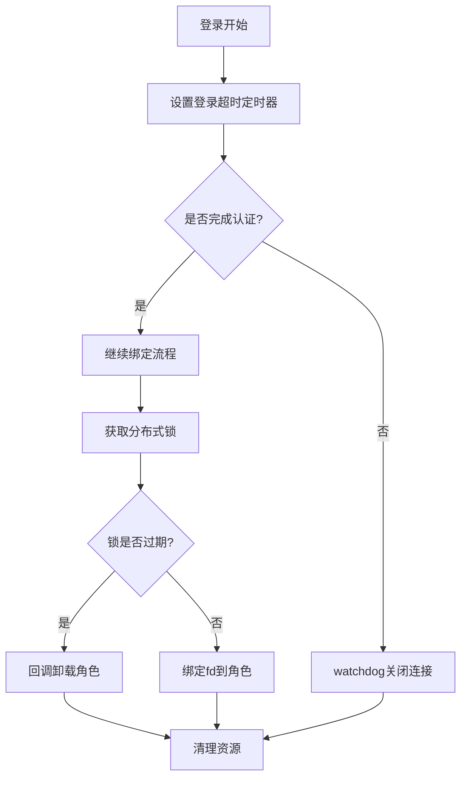
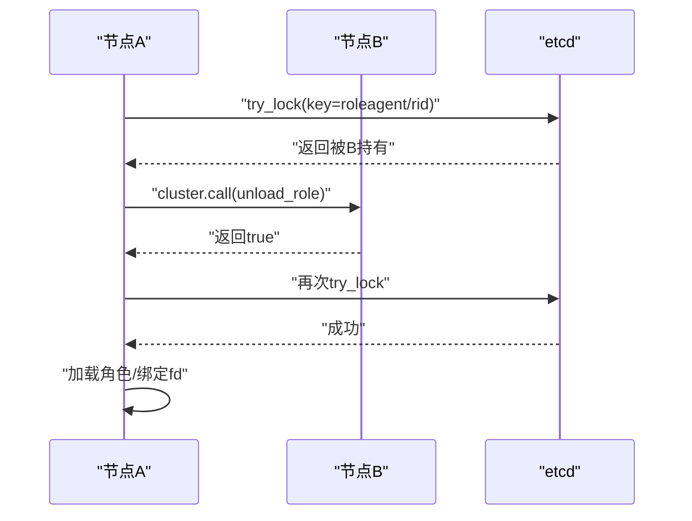
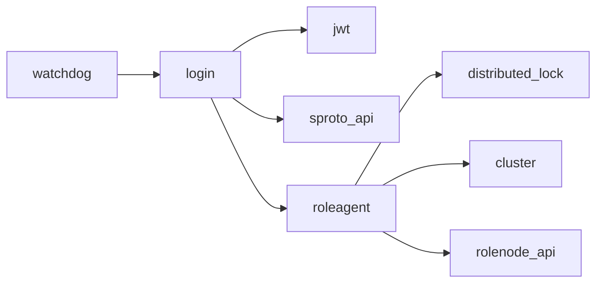

# 会话管理

<cite>
**本文引用的文件**
- [app/role/watchdog.lua](file://app/role/watchdog.lua)
- [app/role/login/main.lua](file://app/role/login/main.lua)
- [app/role/login/client.lua](file://app/role/login/client.lua)
- [app/role/login/login_request.lua](file://app/role/login/login_request.lua)
- [app/role/roleagent/main.lua](file://app/role/roleagent/main.lua)
- [app/role/roleagent/client.lua](file://app/role/roleagent/client.lua)
- [app/role/roleagent/modules/init.lua](file://app/role/roleagent/modules/init.lua)
- [app/role/roleagent/modules/role/request.lua](file://app/role/roleagent/modules/role/request.lua)
- [lualib/jwt.lua](file://lualib/jwt.lua)
- [lualib/distributed_lock.lua](file://lualib/distributed_lock.lua)
- [lualib/timer.lua](file://lualib/timer.lua)
- [lualib/errcode.lua](file://lualib/errcode.lua)
- [lualib/roleagent_api.lua](file://lualib/roleagent_api.lua)
- [service/gm_sys.lua](file://service/gm_sys.lua)
- [proto/base.sproto](file://proto/base.sproto)
</cite>

## 目录
1. [简介](#简介)
2. [项目结构](#项目结构)
3. [核心组件](#核心组件)
4. [架构总览](#架构总览)
5. [详细组件分析](#详细组件分析)
6. [依赖关系分析](#依赖关系分析)
7. [性能与超时处理](#性能与超时处理)
8. [故障排查指南](#故障排查指南)
9. [结论](#结论)
10. [附录：API 接口与使用示例](#附录api-接口与使用示例)

## 简介
本文件面向角色会话管理系统，系统性说明从建立连接到断开的完整生命周期、会话状态维护与数据持久化策略、超时与自动清理机制、多客户端连接与会话冲突处理、安全验证与访问控制、以及监控调试工具的使用方法。文档以代码为依据，提供可视化流程图与时序图，帮助读者快速理解并正确使用该系统。

## 项目结构
围绕“会话管理”的关键路径由网关 Watchdog、登录服务 Login、角色代理 RoleAgent、模块路由与协议层构成。Watchdog 负责接入与转发；Login 负责鉴权与绑定；RoleAgent 负责角色加载、会话绑定与消息分发；模块层按业务划分（如 role/mail/bag）。

图表来源
- [app/role/watchdog.lua:12-82](file://app/role/watchdog.lua#L12-L82)
- [app/role/login/main.lua:15-36](file://app/role/login/main.lua#L15-L36)
- [app/role/roleagent/main.lua:36-116](file://app/role/roleagent/main.lua#L36-L116)
- [lualib/distributed_lock.lua:104-152](file://lualib/distributed_lock.lua#L104-L152)
- [lualib/jwt.lua:18-67](file://lualib/jwt.lua#L18-L67)
- [lualib/timer.lua:211-253](file://lualib/timer.lua#L211-L253)

章节来源
- [app/role/watchdog.lua:12-82](file://app/role/watchdog.lua#L12-L82)
- [app/role/login/main.lua:15-36](file://app/role/login/main.lua#L15-L36)
- [app/role/roleagent/main.lua:36-116](file://app/role/roleagent/main.lua#L36-L116)

## 核心组件
- Watchdog：监听 socket 事件，创建/关闭客户端会话，将 fd 转发到 login 或 roleagent。
- Login：维护未认证的客户端对象，设置登录超时，校验 JWT 与协议版本，完成角色绑定后解绑并转发后续消息。
- RoleAgent：根据 rid 计算目标 agent，加分布式锁避免冲突，加载角色并绑定 fd，注册 sproto 模块路由。
- 分布式锁：基于 etcd 租约与事务实现跨节点互斥，支持过期回调与自动重建。
- JWT：服务端签发与校验 token，支持 HS256/HS512 算法与时间字段校验。
- Timer：统一定时器，用于登录超时、心跳等定时任务。

章节来源
- [app/role/watchdog.lua:12-82](file://app/role/watchdog.lua#L12-L82)
- [app/role/login/client.lua:14-48](file://app/role/login/client.lua#L14-L48)
- [app/role/login/login_request.lua:34-110](file://app/role/login/login_request.lua#L34-L110)
- [app/role/roleagent/main.lua:36-116](file://app/role/roleagent/main.lua#L36-L116)
- [lualib/distributed_lock.lua:104-152](file://lualib/distributed_lock.lua#L104-L152)
- [lualib/jwt.lua:18-67](file://lualib/jwt.lua#L18-L67)
- [lualib/timer.lua:211-253](file://lualib/timer.lua#L211-L253)

## 架构总览
下图展示一次完整的登录与会话建立流程：客户端通过网关进入 watchdog，随后交由 login 进行鉴权与绑定，成功后转发至 roleagent，并由其绑定 fd 到具体角色对象，后续消息直接路由到对应模块。

图表来源
- [app/role/watchdog.lua:12-22](file://app/role/watchdog.lua#L12-L22)
- [app/role/login/main.lua:21-36](file://app/role/login/main.lua#L21-L36)
- [app/role/login/login_request.lua:58-105](file://app/role/login/login_request.lua#L58-L105)
- [app/role/roleagent/main.lua:36-80](file://app/role/roleagent/main.lua#L36-L80)
- [app/role/roleagent/modules/role/request.lua:7-29](file://app/role/roleagent/modules/role/request.lua#L7-L29)

## 详细组件分析

### 会话生命周期管理（建立连接到断开）
- 建立连接
  - watchdog 收到 SOCKET.open，记录 fd，调用 login.open 创建未认证 client，并启动登录超时定时器。
- 认证与绑定
  - 客户端发送 login.login，login 校验 JWT、协议版本、rid/server，调用 roleagent.load_bind_role。
  - roleagent 通过分布式锁确保唯一持有者，加载角色并绑定 fd，然后通知 watchdog 将 fd 转发到 roleagent。
- 业务交互
  - 后续消息经 roleagent 的 sproto 路由到各模块（如 role.login_info），模块可更新角色数据（如 last_login_time）。
- 断开连接
  - logout 或异常时，watchdog 关闭 fd，roleagent 解绑 fd，必要时踢出其他重复连接。

图表来源
- [app/role/watchdog.lua:12-22](file://app/role/watchdog.lua#L12-L22)
- [app/role/login/login_request.lua:58-105](file://app/role/login/login_request.lua#L58-L105)
- [app/role/roleagent/main.lua:36-80](file://app/role/roleagent/main.lua#L36-L80)
- [app/role/roleagent/modules/role/request.lua:7-29](file://app/role/roleagent/modules/role/request.lua#L7-L29)

章节来源
- [app/role/watchdog.lua:12-82](file://app/role/watchdog.lua#L12-L82)
- [app/role/login/login_request.lua:58-110](file://app/role/login/login_request.lua#L58-L110)
- [app/role/roleagent/main.lua:36-116](file://app/role/roleagent/main.lua#L36-L116)

### 会话状态维护与数据持久化策略
- 会话状态
  - 未认证阶段：login.client 维护 g_clients[fd]，包含 auth 标志与可选 remote_addr。
  - 已认证阶段：roleagent.client 维护 g_clients[fd]，关联 role_obj，并通过 role_obj 的 bind_fd/unbind_fd 管理 fd 绑定。
- 数据持久化
  - 角色数据在 role 模块中维护（例如 last_login_time），由 ORM/DB 层负责持久化（本项目含 ORM 与 MongoDB 集成能力）。
  - 分布式锁与租约存储在 etcd，保证跨节点一致性。

章节来源
- [app/role/login/client.lua:14-48](file://app/role/login/client.lua#L14-L48)
- [app/role/roleagent/client.lua:12-43](file://app/role/roleagent/client.lua#L12-L43)
- [app/role/roleagent/modules/role/request.lua:7-29](file://app/role/roleagent/modules/role/request.lua#L7-L29)
- [lualib/distributed_lock.lua:104-152](file://lualib/distributed_lock.lua#L104-L152)

### 会话超时处理、自动清理与资源回收
- 登录超时
  - login.client.new 启动定时器，若指定时间内未完成认证则关闭连接。
- 锁过期回调
  - distributed_lock 在租约过期时触发 expired_cb，调用 rolemgr.unload_role 释放角色资源。
- 资源回收
  - watchdog.close_client 会 kick 网关并通知 forward_service.disconnect，确保 fd 与角色对象解绑。

图表来源
- [app/role/login/client.lua:33-48](file://app/role/login/client.lua#L33-L48)
- [lualib/distributed_lock.lua:29-36](file://lualib/distributed_lock.lua#L29-L36)
- [app/role/roleagent/main.lua:29-34](file://app/role/roleagent/main.lua#L29-L34)
- [app/role/watchdog.lua:24-47](file://app/role/watchdog.lua#L24-L47)

章节来源
- [app/role/login/client.lua:33-48](file://app/role/login/client.lua#L33-L48)
- [lualib/distributed_lock.lua:29-36](file://lualib/distributed_lock.lua#L29-L36)
- [app/role/watchdog.lua:24-47](file://app/role/watchdog.lua#L24-L47)

### 多客户端连接支持与会话冲突处理
- 多连接
  - 同一 fd 在同一时刻只能绑定一个角色对象（assert 防止重复绑定）。
  - 若角色已在其他 fd 绑定，roleagent 会先 unbind_kick 旧连接，再绑定新连接。
- 冲突处理
  - 使用分布式锁 key=roleagent/rid，若被其他节点持有，当前节点会通知对方 unload_role，再尝试重新获取锁。
  - 若仍失败，返回 IN_OTHER_NODE 错误码。

图表来源
- [app/role/roleagent/main.lua:36-80](file://app/role/roleagent/main.lua#L36-L80)
- [lualib/distributed_lock.lua:104-133](file://lualib/distributed_lock.lua#L104-L133)
- [lualib/errcode.lua:3-12](file://lualib/errcode.lua#L3-L12)

章节来源
- [app/role/roleagent/main.lua:36-80](file://app/role/roleagent/main.lua#L36-L80)
- [lualib/distributed_lock.lua:104-133](file://lualib/distributed_lock.lua#L104-L133)
- [lualib/errcode.lua:3-12](file://lualib/errcode.lua#L3-L12)

### 会话安全验证、权限控制与访问控制
- 安全验证
  - login.login 校验 JWT（签名、时间窗口），并可选择校验协议 checksum，防止协议不一致导致的安全风险。
- 中间件鉴权
  - login.client.middleware_cbs 对非白名单请求进行鉴权，未认证请求返回 Unauthorized。
- 访问控制
  - 仅允许特定请求（如 login.login、report_remote_addr）无需鉴权，其余需 check_auth 通过。

章节来源
- [app/role/login/login_request.lua:58-105](file://app/role/login/login_request.lua#L58-L105)
- [app/role/login/client.lua:55-73](file://app/role/login/client.lua#L55-L73)
- [lualib/jwt.lua:18-67](file://lualib/jwt.lua#L18-L67)

### 会话管理的 API 接口与使用示例
- 登录
  - 接口名：login.login
  - 参数：token、rid、server、proto_checksum（可选）
  - 行为：校验 JWT/协议版本/服务器存在性，绑定角色并转发到 roleagent
  - 参考：[login_request.lua:58-105](file://app/role/login/login_request.lua#L58-L105)
- 上报远端地址
  - 接口名：login.report_remote_addr
  - 参数：remote_addr、local_addr
  - 行为：记录客户端远端地址
  - 参考：[login_request.lua:17-32](file://app/role/login/login_request.lua#L17-L32)
- 登出
  - 接口名：login.logout
  - 行为：关闭客户端连接
  - 参考：[login_request.lua:107-110](file://app/role/login/login_request.lua#L107-L110)
- 角色信息
  - 接口名：role.login_info
  - 行为：返回角色基本信息并更新最后登录时间
  - 参考：[role/request.lua:7-29](file://app/role/roleagent/modules/role/request.lua#L7-L29)
- 机器人测试示例
  - 生成 token -> 获取角色列表 -> 连接 gate -> 调用 login.login -> 调用 role.login_info
  - 参考：[robotagent/main.lua:30-95](file://app/robot/robotagent/main.lua#L30-L95)

章节来源
- [app/role/login/login_request.lua:17-110](file://app/role/login/login_request.lua#L17-L110)
- [app/role/roleagent/modules/role/request.lua:7-29](file://app/role/roleagent/modules/role/request.lua#L7-L29)
- [app/robot/robotagent/main.lua:30-95](file://app/robot/robotagent/main.lua#L30-L95)

### 会话监控与调试工具
- GM 命令
  - dbgcmd：执行服务 debug 命令
  - task/uniqtask：查看任务详情
  - killtask：终止线程
  - ping：探测服务延迟
  - trace：开启/关闭协议追踪日志
  - netstat：网络统计
  - dumpheap/profactive：堆转储与内存分析
  - 参考：[gm_sys.lua:226-432](file://service/gm_sys.lua#L226-L432)
- 会话相关调试
  - 通过 watchdog/roleagent 日志观察 fd 绑定与转发情况
  - 使用 distributed_lock 日志观察锁竞争与过期回调
  - 使用 timer 日志观察超时与过载保护

章节来源
- [service/gm_sys.lua:226-432](file://service/gm_sys.lua#L226-L432)
- [app/role/watchdog.lua:12-82](file://app/role/watchdog.lua#L12-L82)
- [lualib/distributed_lock.lua:104-152](file://lualib/distributed_lock.lua#L104-L152)
- [lualib/timer.lua:170-208](file://lualib/timer.lua#L170-L208)

## 依赖关系分析
- 组件耦合
  - watchdog 依赖 login 与 roleagentmgr，负责连接生命周期。
  - login 依赖 jwt、config、sproto_api，负责鉴权与协议校验。
  - roleagent 依赖 distributed_lock、rolenode_api、cluster，负责角色并发控制与路由。
- 外部依赖
  - etcd：分布式锁与服务发现
  - MongoDB：角色数据持久化（通过 ORM）
  - sproto：协议编解码与版本校验

图表来源
- [app/role/watchdog.lua:12-82](file://app/role/watchdog.lua#L12-L82)
- [app/role/login/login_request.lua:58-105](file://app/role/login/login_request.lua#L58-L105)
- [app/role/roleagent/main.lua:36-116](file://app/role/roleagent/main.lua#L36-L116)
- [lualib/distributed_lock.lua:104-152](file://lualib/distributed_lock.lua#L104-L152)

章节来源
- [app/role/watchdog.lua:12-82](file://app/role/watchdog.lua#L12-L82)
- [app/role/login/login_request.lua:58-105](file://app/role/login/login_request.lua#L58-L105)
- [app/role/roleagent/main.lua:36-116](file://app/role/roleagent/main.lua#L36-L116)
- [lualib/distributed_lock.lua:104-152](file://lualib/distributed_lock.lua#L104-L152)

## 性能与超时处理
- 定时器与过载保护
  - timer 使用最小堆调度，支持单次/周期/随机延迟任务，内置过载检测与补偿逻辑，避免阻塞。
- 登录超时
  - login.client.new 默认 60 秒超时，可通过配置调整，超时后主动关闭连接，释放资源。
- 分布式锁心跳
  - distributed_lock 周期性 keepalive，失败时重建租约并尝试重新获取锁，保障高可用。

章节来源
- [lualib/timer.lua:170-208](file://lualib/timer.lua#L170-L208)
- [app/role/login/client.lua:33-48](file://app/role/login/client.lua#L33-L48)
- [lualib/distributed_lock.lua:169-225](file://lualib/distributed_lock.lua#L169-L225)

## 故障排查指南
- 常见问题
  - 登录失败：检查 JWT 是否有效、协议 checksum 是否一致、rid/server 是否正确。
  - 角色冲突：检查分布式锁是否被其他节点持有，确认 unload_role 是否成功。
  - 连接异常：检查 watchdog 日志中的 close/error/warning，确认 fd 是否被正确解绑。
- 定位方法
  - 使用 GM 命令查看服务状态、网络统计与内存使用情况。
  - 启用 TRACELOG 跟踪协议消息，结合日志定位问题。
  - 关注 distributed_lock 与 timer 的告警日志，识别锁竞争与过载场景。

章节来源
- [lualib/errcode.lua:3-12](file://lualib/errcode.lua#L3-L12)
- [service/gm_sys.lua:226-432](file://service/gm_sys.lua#L226-L432)
- [app/role/watchdog.lua:24-56](file://app/role/watchdog.lua#L24-L56)
- [lualib/distributed_lock.lua:104-152](file://lualib/distributed_lock.lua#L104-L152)

## 结论
该会话管理系统以 watchdog-login-roleagent 的分层架构为核心，结合 JWT 鉴权、分布式锁与定时器，实现了健壮的多客户端会话生命周期管理。通过模块化路由与完善的监控调试手段，系统具备良好的可扩展性与可维护性。建议在生产环境中合理配置超时与锁 TTL，并结合日志与 GM 命令持续优化性能与稳定性。

## 附录：API 接口与使用示例
- 登录接口
  - 名称：login.login
  - 参数：token、rid、server、proto_checksum（可选）
  - 行为：校验 JWT/协议版本/服务器存在性，绑定角色并转发到 roleagent
  - 参考：[login_request.lua:58-105](file://app/role/login/login_request.lua#L58-L105)
- 上报远端地址
  - 名称：login.report_remote_addr
  - 参数：remote_addr、local_addr
  - 行为：记录客户端远端地址
  - 参考：[login_request.lua:17-32](file://app/role/login/login_request.lua#L17-L32)
- 登出接口
  - 名称：login.logout
  - 行为：关闭客户端连接
  - 参考：[login_request.lua:107-110](file://app/role/login/login_request.lua#L107-L110)
- 角色信息接口
  - 名称：role.login_info
  - 行为：返回角色基本信息并更新最后登录时间
  - 参考：[role/request.lua:7-29](file://app/role/roleagent/modules/role/request.lua#L7-L29)
- 机器人测试流程
  - 生成 token -> 获取角色列表 -> 连接 gate -> 调用 login.login -> 调用 role.login_info
  - 参考：[robotagent/main.lua:30-95](file://app/robot/robotagent/main.lua#L30-L95)

章节来源
- [app/role/login/login_request.lua:17-110](file://app/role/login/login_request.lua#L17-L110)
- [app/role/roleagent/modules/role/request.lua:7-29](file://app/role/roleagent/modules/role/request.lua#L7-L29)
- [app/robot/robotagent/main.lua:30-95](file://app/robot/robotagent/main.lua#L30-L95)