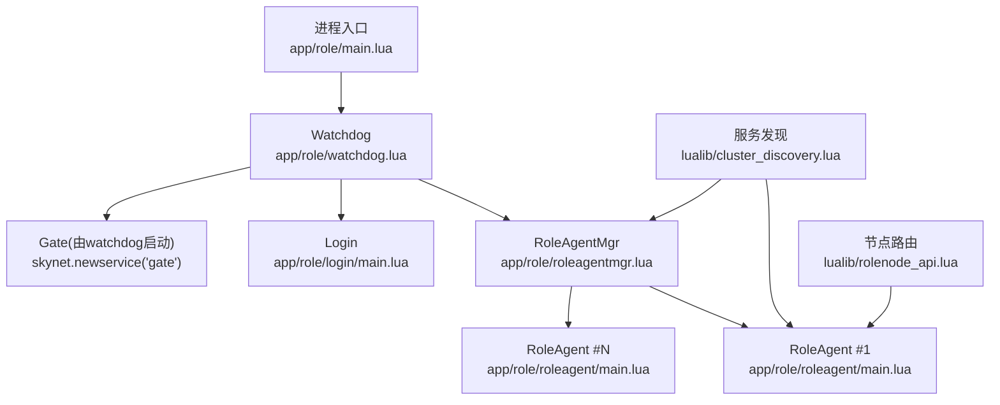
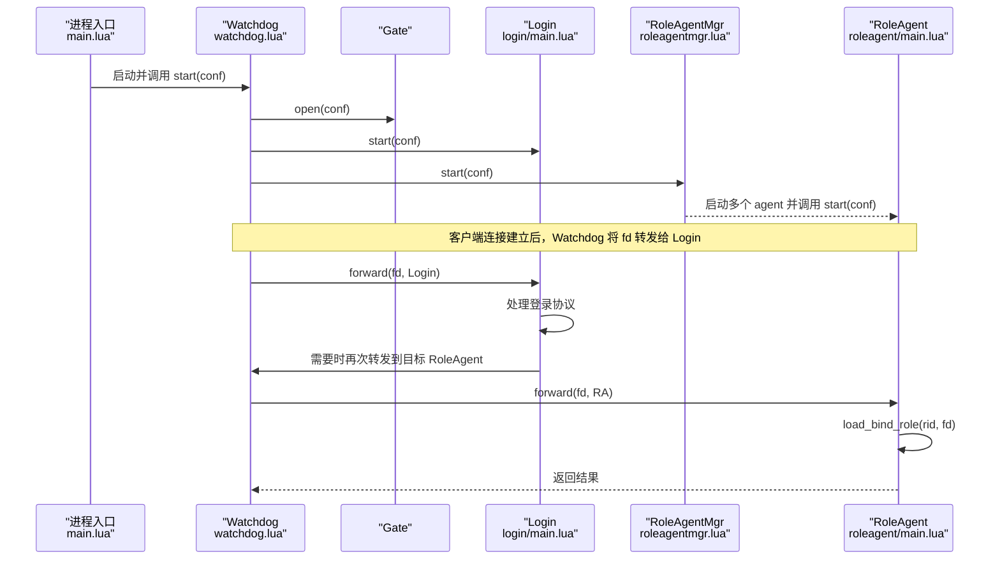
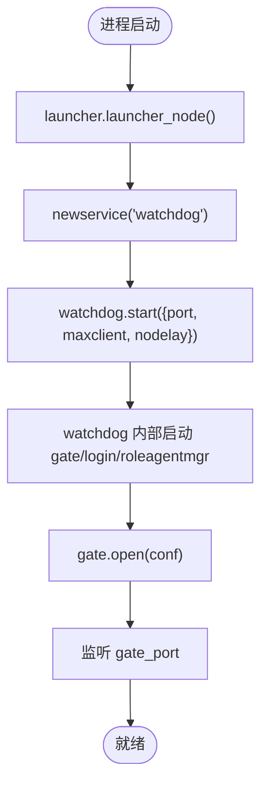
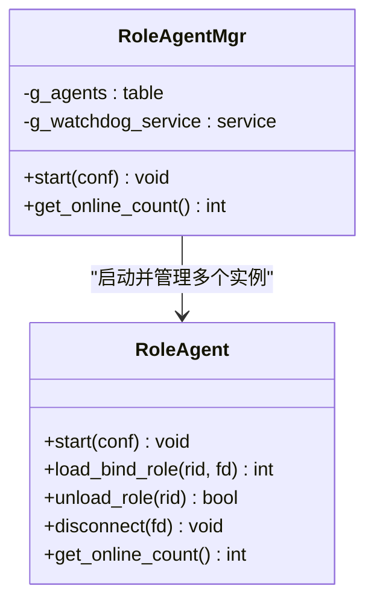
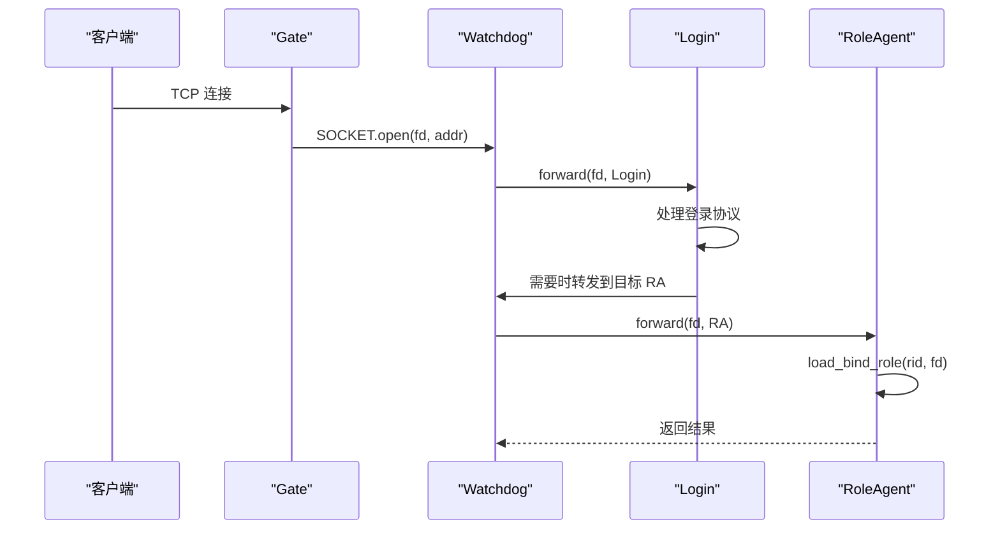
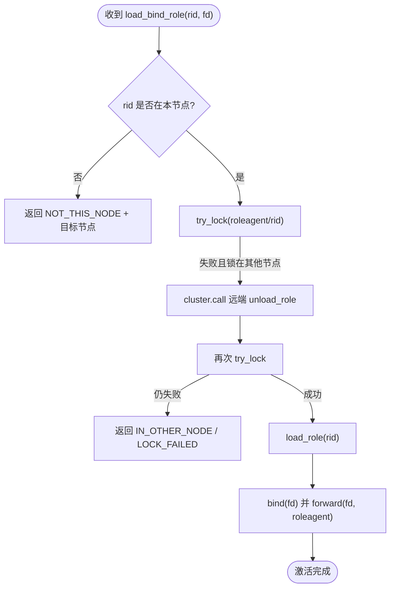
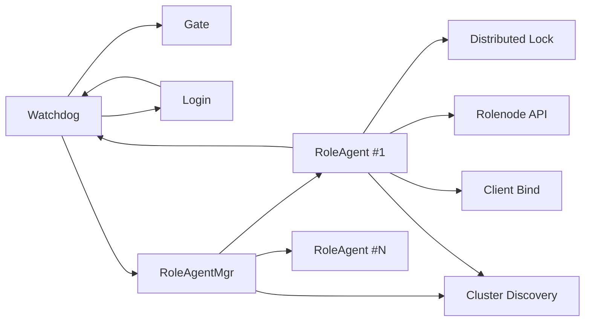

# 服务架构设计

<cite>
**本文引用的文件列表**
- [app/role/main.lua](file://app/role/main.lua)
- [app/role/watchdog.lua](file://app/role/watchdog.lua)
- [app/role/roleagentmgr.lua](file://app/role/roleagentmgr.lua)
- [app/role/roleagent/main.lua](file://app/role/roleagent/main.lua)
- [app/role/login/main.lua](file://app/role/login/main.lua)
- [app/role/roleagent/client.lua](file://app/role/roleagent/client.lua)
- [app/role/roleagent/global.lua](file://app/role/roleagent/global.lua)
- [lualib/rolenode_api.lua](file://lualib/rolenode_api.lua)
- [lualib/cluster_discovery.lua](file://lualib/cluster_discovery.lua)
- [etc/app/role1.app.lua](file://etc/app/role1.app.lua)
</cite>

## 目录
1. [简介](#简介)
2. [项目结构](#项目结构)
3. [核心组件](#核心组件)
4. [架构总览](#架构总览)
5. [详细组件分析](#详细组件分析)
6. [依赖关系分析](#依赖关系分析)
7. [性能考量](#性能考量)
8. [故障排查指南](#故障排查指南)
9. [结论](#结论)
10. [附录](#附录)

## 简介
本文件面向 Role 服务的架构设计与实现，重点解释：
- 主节点启动流程与 watchdog 初始化、gate 端口监听机制
- 角色代理管理器（roleagentmgr）的职责与实现原理
- 服务间通信模式与消息传递机制
- 角色生命周期管理（创建、激活、销毁）
- 服务监控、健康检查与故障恢复机制
- 架构图与组件交互流程图

## 项目结构
Role 服务基于 Skynet 微服务模型组织，关键入口与职责如下：
- app/role/main.lua：进程入口，负责启动 watchdog 并配置 gate 监听
- app/role/watchdog.lua：网关接入层，维护客户端连接，转发到登录或角色代理
- app/role/login/main.lua：登录协议处理，完成鉴权后将连接转发至具体角色代理
- app/role/roleagentmgr.lua：角色代理管理器，按配置启动多个 roleagent 实例并注册发现
- app/role/roleagent/main.lua：单个角色代理，负责角色加载、绑定 fd、模块挂载、在线统计等
- lualib/cluster_discovery.lua：集群服务发现与变更订阅
- lualib/rolenode_api.lua：角色节点路由计算（当前为占位实现）
- etc/app/role1.app.lua：应用级配置（端口、并发、超时、日志等）

图表来源
- [app/role/main.lua:6-16](file://app/role/main.lua#L6-L16)
- [app/role/watchdog.lua:75-81](file://app/role/watchdog.lua#L75-L81)
- [app/role/roleagentmgr.lua:17-30](file://app/role/roleagentmgr.lua#L17-L30)
- [app/role/roleagent/main.lua:110-116](file://app/role/roleagent/main.lua#L110-L116)
- [lualib/cluster_discovery.lua:89-92](file://lualib/cluster_discovery.lua#L89-L92)
- [lualib/rolenode_api.lua:7-14](file://lualib/rolenode_api.lua#L7-L14)

章节来源
- [app/role/main.lua:1-25](file://app/role/main.lua#L1-L25)
- [app/role/watchdog.lua:1-82](file://app/role/watchdog.lua#L1-L82)
- [app/role/roleagentmgr.lua:1-49](file://app/role/roleagentmgr.lua#L1-L49)
- [app/role/roleagent/main.lua:1-117](file://app/role/roleagent/main.lua#L1-L117)
- [app/role/login/main.lua:1-37](file://app/role/login/main.lua#L1-L37)
- [lualib/cluster_discovery.lua:1-95](file://lualib/cluster_discovery.lua#L1-L95)
- [lualib/rolenode_api.lua:1-17](file://lualib/rolenode_api.lua#L1-L17)
- [etc/app/role1.app.lua:1-30](file://etc/app/role1.app.lua#L1-L30)

## 核心组件
- Watchdog（网关接入）
  - 职责：接收客户端 TCP 连接，维护 fd 映射，将新连接转发给 login 或已绑定的角色代理；提供 close_client、forward 等命令。
  - 关键点：在 start 时启动 gate、login、roleagentmgr；通过 cmd_api.dispatch_socket 暴露 SOCKET 回调。
- Login（登录服务）
  - 职责：处理登录协议，建立客户端对象，并将 fd 转发给 watchdog 以交由后续业务处理。
- RoleAgentMgr（角色代理管理器）
  - 职责：根据配置启动 N 个 roleagent 实例，记录其索引与服务名，提供 GM 查询在线数等能力，并注册到集群发现。
- RoleAgent（角色代理）
  - 职责：加载/卸载角色，绑定/解绑 fd，分发模块请求，维护本地在线角色集合，支持跨节点锁与卸载。
- Cluster Discovery（服务发现）
  - 职责：统一管理服务节点列表，支持随机选择、获取全部节点、订阅变更事件。
- Rolenode API（节点路由）
  - 职责：根据 rid 计算所属 rolenode（当前为占位实现），用于跨节点定位与卸载。

章节来源
- [app/role/watchdog.lua:58-81](file://app/role/watchdog.lua#L58-L81)
- [app/role/login/main.lua:15-36](file://app/role/login/main.lua#L15-L36)
- [app/role/roleagentmgr.lua:17-48](file://app/role/roleagentmgr.lua#L17-L48)
- [app/role/roleagent/main.lua:23-116](file://app/role/roleagent/main.lua#L23-L116)
- [lualib/cluster_discovery.lua:11-95](file://lualib/cluster_discovery.lua#L11-L95)
- [lualib/rolenode_api.lua:7-14](file://lualib/rolenode_api.lua#L7-L14)

## 架构总览
下图展示了从进程启动到客户端接入、登录、角色绑定的完整链路，以及 roleagentmgr 对 roleagent 的编排。

图表来源
- [app/role/main.lua:6-16](file://app/role/main.lua#L6-L16)
- [app/role/watchdog.lua:58-81](file://app/role/watchdog.lua#L58-L81)
- [app/role/login/main.lua:15-36](file://app/role/login/main.lua#L15-L36)
- [app/role/roleagentmgr.lua:17-30](file://app/role/roleagentmgr.lua#L17-L30)
- [app/role/roleagent/main.lua:36-80](file://app/role/roleagent/main.lua#L36-L80)

## 详细组件分析

### 主节点启动流程与 Watchdog/Gate 监听
- 进程入口 main.lua 调用 launcher 后，启动 watchdog，并通过 config 读取 maxclient 与 gate_port，调用 watchdog.start 传入配置。
- watchdog 内部启动 gate、login、roleagentmgr，并通过 cmd_api.dispatch_socket 暴露 SOCKET 回调，处理 open/close/error/warning/data。
- watchdog.start 会依次通知 login 和 roleagentmgr 启动，再打开 gate 监听指定端口。

图表来源
- [app/role/main.lua:6-16](file://app/role/main.lua#L6-L16)
- [app/role/watchdog.lua:58-81](file://app/role/watchdog.lua#L58-L81)

章节来源
- [app/role/main.lua:6-16](file://app/role/main.lua#L6-L16)
- [app/role/watchdog.lua:58-81](file://app/role/watchdog.lua#L58-L81)
- [etc/app/role1.app.lua:7-12](file://etc/app/role1.app.lua#L7-L12)

### 角色代理管理器（roleagentmgr）职责与实现
- 启动阶段：从配置读取 agent_count，循环创建对应数量的 roleagent 服务，并调用其 start，注入 watchdog 与自身引用。
- 运行时：维护 g_agents 表，提供 GM 接口 get_online_count，聚合各 roleagent 的在线数。
- 服务发现：启动时注册自身到 cluster_discovery，便于其他服务定位。

图表来源
- [app/role/roleagentmgr.lua:17-48](file://app/role/roleagentmgr.lua#L17-L48)
- [app/role/roleagent/main.lua:93-116](file://app/role/roleagent/main.lua#L93-L116)

章节来源
- [app/role/roleagentmgr.lua:17-48](file://app/role/roleagentmgr.lua#L17-L48)

### 服务间通信模式与消息传递
- 控制面：通过 skynet.call/skynet.send 在各服务间传递命令（如 watchdog.forward、roleagent.load_bind_role）。
- 数据面：客户端 TCP 连接经 gate 进入 watchdog，再由 watchdog 转发到 login 或 roleagent；roleagent 内通过 client.bind/unbind 管理 fd 与角色对象的关联。
- 服务发现：通过 cluster_discovery 注册/查询服务节点，支持随机选择与变更订阅。

图表来源
- [app/role/watchdog.lua:12-22](file://app/role/watchdog.lua#L12-L22)
- [app/role/watchdog.lua:68-73](file://app/role/watchdog.lua#L68-L73)
- [app/role/login/main.lua:21-31](file://app/role/login/main.lua#L21-L31)
- [app/role/roleagent/main.lua:36-80](file://app/role/roleagent/main.lua#L36-L80)

章节来源
- [app/role/watchdog.lua:12-73](file://app/role/watchdog.lua#L12-L73)
- [app/role/login/main.lua:21-31](file://app/role/login/main.lua#L21-L31)
- [app/role/roleagent/main.lua:36-80](file://app/role/roleagent/main.lua#L36-L80)

### 角色生命周期管理（创建、激活、销毁）
- 创建与激活
  - 客户端连接经 watchdog -> login -> roleagent 后，roleagent 执行 load_bind_role：
    - 校验角色是否应位于当前节点（rolenode_api.calc_rolenode）
    - 尝试分布式锁（distributed_lock.try_lock），若被其他节点持有则远程触发 unload_role
    - 加载角色对象，绑定 fd，并通过 watchdog.forward 将 fd 转发到该 roleagent
- 运行期
  - 模块系统（modules.init）注册 sproto 模块，角色对象挂载 mail/bag 等模块
  - 在线计数：roleagent.get_online_count 统计有 fd 的角色数量，roleagentmgr 汇总
- 销毁与卸载
  - 当锁过期或主动卸载时，roleagent.unload_role 清理角色资源
  - 客户端断开时，watchdog.close_client 或 roleagent.disconnect 解绑 fd

图表来源
- [app/role/roleagent/main.lua:25-80](file://app/role/roleagent/main.lua#L25-L80)
- [lualib/rolenode_api.lua:7-14](file://lualib/rolenode_api.lua#L7-L14)

章节来源
- [app/role/roleagent/main.lua:25-80](file://app/role/roleagent/main.lua#L25-L80)
- [app/role/roleagent/client.lua:20-43](file://app/role/roleagent/client.lua#L20-L43)
- [app/role/roleagent/modules/init.lua:12-34](file://app/role/roleagent/modules/init.lua#L12-L34)

### 服务监控、健康检查与故障恢复
- 监控与统计
  - roleagentmgr 提供 GM 接口 get_online_count，聚合所有 roleagent 的在线角色数
  - roleagent 维护本地角色集合，统计带 fd 的数量
- 健康检查
  - 通过 cluster_discovery 注册服务，外部可查询可用节点列表
  - watchdog 维护 g_clients 表，异常关闭时清理并踢出连接
- 故障恢复
  - 分布式锁过期回调中自动卸载角色，避免僵尸角色占用资源
  - 跨节点冲突时，远端卸载后再重试加锁，保证一致性
  - 客户端断开时，watchdog 与 roleagent 协同解绑 fd，确保状态一致

章节来源
- [app/role/roleagentmgr.lua:32-48](file://app/role/roleagentmgr.lua#L32-L48)
- [app/role/roleagent/main.lua:29-34](file://app/role/roleagent/main.lua#L29-L34)
- [app/role/watchdog.lua:24-47](file://app/role/watchdog.lua#L24-L47)
- [lualib/cluster_discovery.lua:61-95](file://lualib/cluster_discovery.lua#L61-L95)

## 依赖关系分析
- 组件耦合
  - watchdog 强依赖 gate、login、roleagentmgr 的生命周期
  - roleagentmgr 依赖配置与 cluster_discovery，管理 roleagent 实例
  - roleagent 依赖 distributed_lock、rolenode_api、modules、client
- 直接/间接依赖
  - login 通过 watchdog.forward 间接与 roleagent 交互
  - roleagent 通过 cluster.call 与远端 roleagent 交互进行卸载
- 外部依赖
  - cluster_discovery 作为唯一服务发现源，集中管理节点列表
  - 配置中心（config）提供端口、并发、超时等参数

图表来源
- [app/role/watchdog.lua:75-81](file://app/role/watchdog.lua#L75-L81)
- [app/role/roleagentmgr.lua:17-48](file://app/role/roleagentmgr.lua#L17-L48)
- [app/role/roleagent/main.lua:110-116](file://app/role/roleagent/main.lua#L110-L116)
- [lualib/cluster_discovery.lua:89-95](file://lualib/cluster_discovery.lua#L89-L95)

章节来源
- [app/role/watchdog.lua:75-81](file://app/role/watchdog.lua#L75-L81)
- [app/role/roleagentmgr.lua:17-48](file://app/role/roleagentmgr.lua#L17-L48)
- [app/role/roleagent/main.lua:110-116](file://app/role/roleagent/main.lua#L110-L116)
- [lualib/cluster_discovery.lua:89-95](file://lualib/cluster_discovery.lua#L89-L95)

## 性能考量
- 连接与转发
  - watchdog 使用 g_clients 表维护 fd 映射，O(1) 查找；频繁转发需关注 call/send 开销
- 角色加载与锁竞争
  - 分布式锁可能成为热点，建议结合 jchash 优化 rolenode 计算以减少跨节点冲突
- 在线统计
  - roleagentmgr 聚合统计为 O(N) 遍历，N 为 roleagent 数量；可通过增量上报降低开销
- 配置调优
  - maxclient、agent_count、login_timeout_sec 等参数直接影响吞吐与延迟，需结合压测调整

[本节为通用指导，不直接分析具体文件]

## 故障排查指南
- 客户端无法绑定角色
  - 检查 watchdog.forward 是否正确转发到目标 roleagent
  - 确认 roleagent.load_bind_role 中的节点校验与锁获取逻辑
- 角色在线数为 0
  - 检查 roleagent.get_online_count 统计逻辑与 modules 初始化
  - 确认 roleagentmgr 的 GM 接口是否被正确注册
- 跨节点冲突导致加载失败
  - 查看远端卸载是否成功，必要时增加重试与告警
- 连接异常断开
  - 检查 watchdog.close_client 与 roleagent.disconnect 的解绑顺序

章节来源
- [app/role/watchdog.lua:24-47](file://app/role/watchdog.lua#L24-L47)
- [app/role/roleagent/main.lua:36-80](file://app/role/roleagent/main.lua#L36-L80)
- [app/role/roleagentmgr.lua:32-48](file://app/role/roleagentmgr.lua#L32-L48)

## 结论
Role 服务采用清晰的微服务分层：watchdog 负责接入与转发，login 处理协议，roleagentmgr 编排角色代理，roleagent 承载角色逻辑。通过分布式锁与服务发现，实现了跨节点的角色管理与高可用。配合合理的配置与监控，可在保证一致性的同时获得良好的扩展性与可运维性。

[本节为总结，不直接分析具体文件]

## 附录
- 关键配置项说明（来自 role1.app.lua）
  - cluster_node_name：节点标识
  - cluster_listen_port / cluster_host：集群通信地址
  - gm_http_port：GM HTTP 端口
  - gate_port / maxclient：网关监听端口与最大连接数
  - agent_count：角色代理实例数
  - login_timeout_sec：登录超时
  - role_offline_unload_sec：离线卸载延迟
  - log_config：日志输出配置

章节来源
- [etc/app/role1.app.lua:1-30](file://etc/app/role1.app.lua#L1-L30)