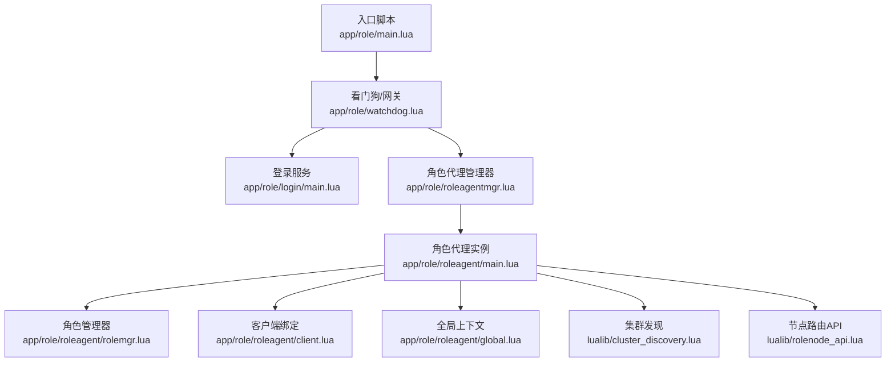
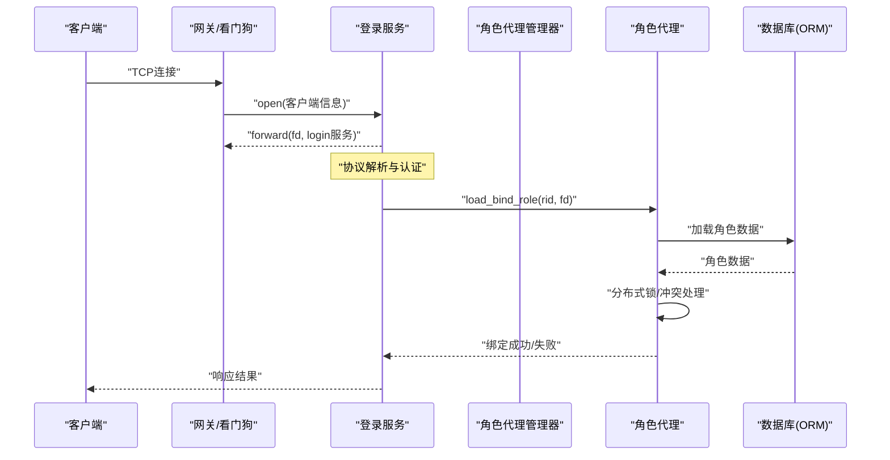
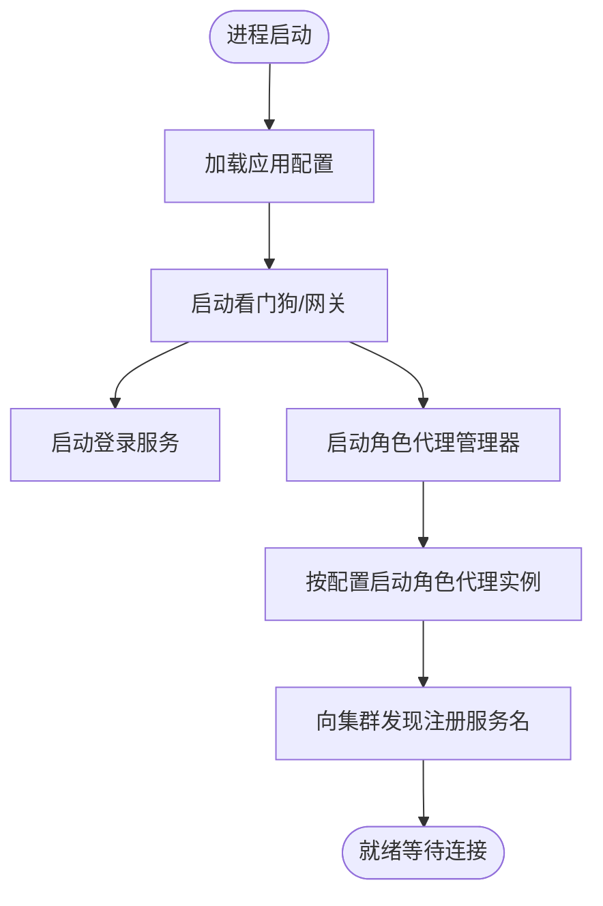
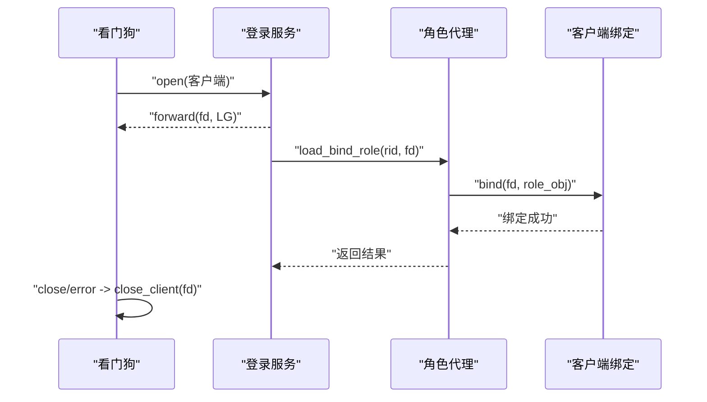
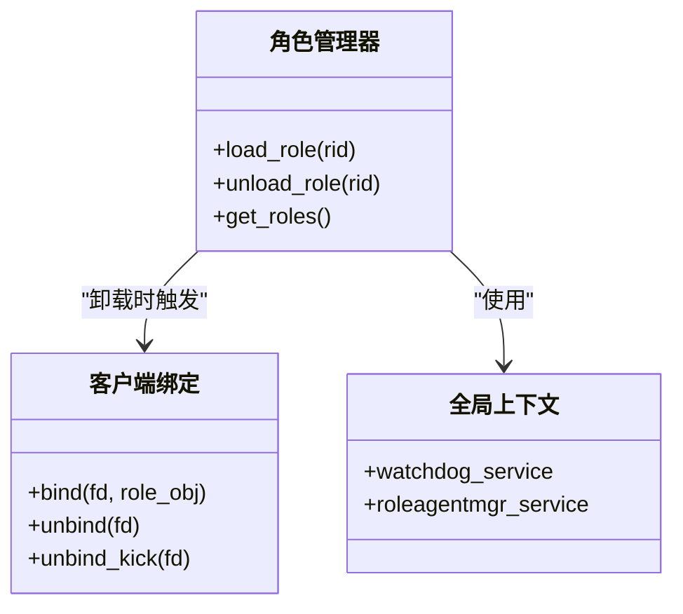
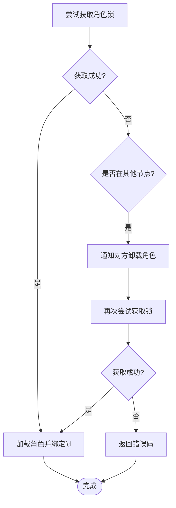
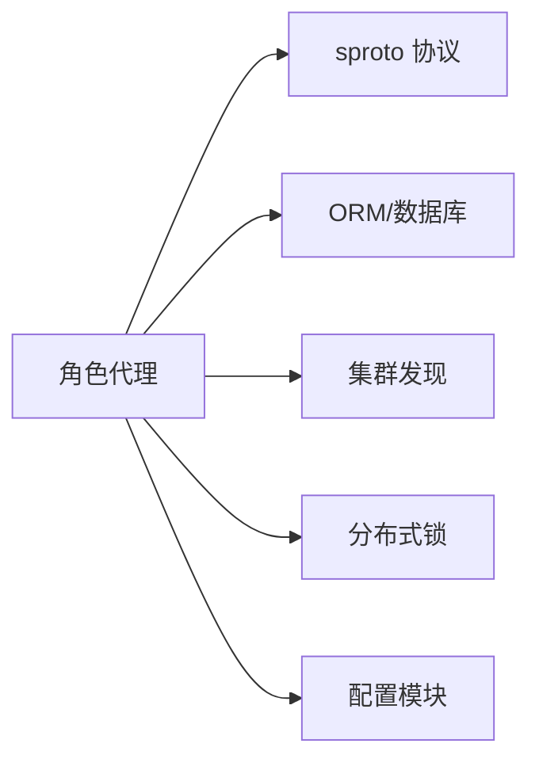

# 角色代理系统

<cite>
**本文引用的文件**
- [app/role/main.lua](file://app/role/main.lua)
- [app/role/watchdog.lua](file://app/role/watchdog.lua)
- [app/role/roleagentmgr.lua](file://app/role/roleagentmgr.lua)
- [app/role/roleagent/main.lua](file://app/role/roleagent/main.lua)
- [app/role/roleagent/client.lua](file://app/role/roleagent/client.lua)
- [app/role/roleagent/global.lua](file://app/role/roleagent/global.lua)
- [app/role/roleagent/rolemgr.lua](file://app/role/roleagent/rolemgr.lua)
- [app/role/login/main.lua](file://app/role/login/main.lua)
- [lualib/rolenode_api.lua](file://lualib/rolenode_api.lua)
- [lualib/cluster_discovery.lua](file://lualib/cluster_discovery.lua)
- [etc/app/role1.app.lua](file://etc/app/role1.app.lua)
- [etc/role1.conf.lua](file://etc/role1.conf.lua)
- [proto/roleagent/role.sproto](file://proto/roleagent/role.sproto)
- [lualib/skyext.lua](file://lualib/skyext.lua)
</cite>

## 目录
1. [简介](#简介)
2. [项目结构](#项目结构)
3. [核心组件](#核心组件)
4. [架构总览](#架构总览)
5. [详细组件分析](#详细组件分析)
6. [依赖关系分析](#依赖关系分析)
7. [性能与调优](#性能与调优)
8. [故障排查指南](#故障排查指南)
9. [结论](#结论)
10. [附录：配置项与协议](#附录：配置项与协议)

## 简介
本文件为“角色代理系统”的全面技术文档，聚焦于角色节点（Role Node）的启动流程、初始化过程、客户端连接管理与会话维护、全局状态与数据同步策略、角色代理与主节点的通信协议与数据格式、连接池管理、负载均衡与故障转移机制，以及配置选项与性能调优参数。同时提供客户端连接示例与错误处理模式说明，帮助读者快速理解并高效运维该系统。

## 项目结构
角色节点由多个 skynet 服务协作完成：入口脚本负责启动网关与登录服务；登录服务负责新连接的接入与转发；角色管理器负责创建与管理角色代理实例；角色代理负责绑定客户端 fd 到具体角色对象，并处理角色生命周期；集群发现模块提供跨节点服务发现与负载均衡能力；配置模块集中管理运行时参数。



图表来源
- [app/role/main.lua:1-25](file://app/role/main.lua#L1-L25)
- [app/role/watchdog.lua:1-82](file://app/role/watchdog.lua#L1-L82)
- [app/role/login/main.lua:1-37](file://app/role/login/main.lua#L1-L37)
- [app/role/roleagentmgr.lua:1-49](file://app/role/roleagentmgr.lua#L1-L49)
- [app/role/roleagent/main.lua:1-117](file://app/role/roleagent/main.lua#L1-L117)
- [app/role/roleagent/rolemgr.lua:1-59](file://app/role/roleagent/rolemgr.lua#L1-L59)
- [app/role/roleagent/client.lua:1-50](file://app/role/roleagent/client.lua#L1-L50)
- [app/role/roleagent/global.lua:1-7](file://app/role/roleagent/global.lua#L1-L7)
- [lualib/cluster_discovery.lua:1-95](file://lualib/cluster_discovery.lua#L1-L95)
- [lualib/rolenode_api.lua:1-17](file://lualib/rolenode_api.lua#L1-L17)

章节来源
- [app/role/main.lua:1-25](file://app/role/main.lua#L1-L25)
- [etc/role1.conf.lua:1-4](file://etc/role1.conf.lua#L1-L4)
- [etc/app/role1.app.lua:1-30](file://etc/app/role1.app.lua#L1-L30)

## 核心组件
- 入口与启动器：负责加载应用配置、启动看门狗与网关、注册 GM 与集群服务。
- 看门狗与网关：监听端口、接收客户端连接、将连接转发给登录服务或目标角色代理。
- 登录服务：为新连接建立会话上下文，校验协议与认证信息，并将连接转发至角色代理进行绑定。
- 角色代理管理器：按配置数量启动多个角色代理实例，提供在线统计等 GM 能力。
- 角色代理：维护客户端 fd 与角色对象的绑定关系，负责角色加载/卸载、锁竞争与故障转移。
- 角色管理器：内存中的角色对象缓存，负责从数据库加载/卸载角色数据，调用 ORM 持久化。
- 集群发现：基于事件通道订阅服务变更，提供随机选择节点的能力，支撑负载均衡。
- 节点路由 API：根据角色 ID 计算所属节点，当前为固定实现，可替换为一致性哈希。

章节来源
- [app/role/watchdog.lua:1-82](file://app/role/watchdog.lua#L1-L82)
- [app/role/login/main.lua:1-37](file://app/role/login/main.lua#L1-L37)
- [app/role/roleagentmgr.lua:1-49](file://app/role/roleagentmgr.lua#L1-L49)
- [app/role/roleagent/main.lua:1-117](file://app/role/roleagent/main.lua#L1-L117)
- [app/role/roleagent/rolemgr.lua:1-59](file://app/role/roleagent/rolemgr.lua#L1-L59)
- [lualib/cluster_discovery.lua:1-95](file://lualib/cluster_discovery.lua#L1-L95)
- [lualib/rolenode_api.lua:1-17](file://lualib/rolenode_api.lua#L1-L17)

## 架构总览
角色节点采用分层服务架构：网关层负责网络接入，登录层负责会话与鉴权，角色代理层负责业务逻辑与状态管理，底层通过 ORM 与数据库交互，并通过集群发现模块实现多实例间的协调与负载均衡。



图表来源
- [app/role/watchdog.lua:12-22](file://app/role/watchdog.lua#L12-L22)
- [app/role/login/main.lua:21-26](file://app/role/login/main.lua#L21-L26)
- [app/role/roleagent/main.lua:36-80](file://app/role/roleagent/main.lua#L36-L80)
- [app/role/roleagent/rolemgr.lua:15-25](file://app/role/roleagent/rolemgr.lua#L15-L25)

## 详细组件分析

### 启动流程与初始化
- 入口脚本读取配置，启动看门狗与网关，随后退出自身以释放资源。
- 看门狗启动登录服务与角色代理管理器，并打开网关监听端口。
- 角色代理管理器按配置启动若干角色代理实例，并向集群注册自身服务名。
- 每个角色代理在启动时初始化模块、注册命令接口、向集群发现注册服务名。



图表来源
- [app/role/main.lua:6-24](file://app/role/main.lua#L6-L24)
- [app/role/watchdog.lua:58-81](file://app/role/watchdog.lua#L58-L81)
- [app/role/roleagentmgr.lua:17-48](file://app/role/roleagentmgr.lua#L17-L48)
- [app/role/roleagent/main.lua:93-116](file://app/role/roleagent/main.lua#L93-L116)

章节来源
- [app/role/main.lua:6-24](file://app/role/main.lua#L6-L24)
- [app/role/watchdog.lua:58-81](file://app/role/watchdog.lua#L58-L81)
- [app/role/roleagentmgr.lua:17-48](file://app/role/roleagentmgr.lua#L17-L48)
- [app/role/roleagent/main.lua:93-116](file://app/role/roleagent/main.lua#L93-L116)

### 客户端连接管理与会话维护
- 新连接进入后，看门狗记录客户端信息并通知登录服务。
- 登录服务创建客户端上下文，并将 fd 转发给自身处理后续协议消息。
- 当需要绑定角色时，登录服务调用角色代理的 load_bind_role，完成角色加载与 fd 绑定。
- 角色代理内部维护 fd 到角色对象的映射，支持解绑与踢出操作。
- 连接关闭或异常时，看门狗清理上下文并通知相关服务断开。



图表来源
- [app/role/watchdog.lua:12-22](file://app/role/watchdog.lua#L12-L22)
- [app/role/watchdog.lua:24-47](file://app/role/watchdog.lua#L24-L47)
- [app/role/login/main.lua:21-31](file://app/role/login/main.lua#L21-L31)
- [app/role/roleagent/client.lua:20-43](file://app/role/roleagent/client.lua#L20-L43)

章节来源
- [app/role/watchdog.lua:12-47](file://app/role/watchdog.lua#L12-L47)
- [app/role/login/main.lua:21-31](file://app/role/login/main.lua#L21-L31)
- [app/role/roleagent/client.lua:20-43](file://app/role/roleagent/client.lua#L20-L43)

### 全局状态管理与数据同步策略
- 全局上下文保存关键服务句柄（如看门狗、角色代理管理器），供各模块访问。
- 角色管理器维护内存中的角色对象表，提供加载、卸载与查询接口。
- 角色数据通过 ORM 模块与数据库交互，加载时构建角色对象并挂载模块，卸载时持久化并清理内存。
- 分布式锁用于保证同一角色在同一时刻仅被一个节点持有，避免并发冲突。



图表来源
- [app/role/roleagent/rolemgr.lua:15-55](file://app/role/roleagent/rolemgr.lua#L15-L55)
- [app/role/roleagent/client.lua:20-43](file://app/role/roleagent/client.lua#L20-L43)
- [app/role/roleagent/global.lua:1-7](file://app/role/roleagent/global.lua#L1-L7)

章节来源
- [app/role/roleagent/rolemgr.lua:15-55](file://app/role/roleagent/rolemgr.lua#L15-L55)
- [app/role/roleagent/client.lua:20-43](file://app/role/roleagent/client.lua#L20-L43)
- [app/role/roleagent/global.lua:1-7](file://app/role/roleagent/global.lua#L1-L7)

### 角色代理与主节点的通信协议与数据格式
- 协议定义位于 sproto 文件中，包含角色信息与登录请求/响应结构。
- 登录服务通过 sproto 模块注册协议模块，处理客户端消息。
- 角色代理与登录服务之间通过 skynet 消息传递进行控制流交互（非 sproto 协议）。

```mermaid
erDiagram
ROLE {
integer rid
string name
}
LOGIN_INFO {
request {}
response {
info ROLE
}
}
```

图表来源
- [proto/roleagent/role.sproto:1-13](file://proto/roleagent/role.sproto#L1-L13)
- [app/role/login/main.lua:33-36](file://app/role/login/main.lua#L33-L36)

章节来源
- [proto/roleagent/role.sproto:1-13](file://proto/roleagent/role.sproto#L1-L13)
- [app/role/login/main.lua:33-36](file://app/role/login/main.lua#L33-L36)

### 连接池管理、负载均衡与故障转移
- 连接池：数据库连接池由 dbmgr 模块统一管理（通过 ORM 间接使用），角色代理在加载/卸载角色时触发持久化。
- 负载均衡：集群发现模块提供随机选择节点的方法，可用于跨节点的消息路由或任务分发。
- 故障转移：角色代理在尝试获取分布式锁失败时，会通知持有锁的节点卸载角色，然后重试获取锁；若仍失败则返回错误码，确保角色不重复运行。



图表来源
- [app/role/roleagent/main.lua:36-80](file://app/role/roleagent/main.lua#L36-L80)
- [lualib/cluster_discovery.lua:61-76](file://lualib/cluster_discovery.lua#L61-L76)

章节来源
- [app/role/roleagent/main.lua:36-80](file://app/role/roleagent/main.lua#L36-L80)
- [lualib/cluster_discovery.lua:61-76](file://lualib/cluster_discovery.lua#L61-L76)

### 配置选项与性能调优参数
- 节点名称与监听端口：用于集群识别与网关监听。
- 最大客户端数：限制单实例并发连接数。
- 角色代理数量：控制角色代理实例数量，影响负载分散程度。
- 登录超时时间：控制登录阶段连接验证超时。
- 离线卸载延迟：控制角色离线后的内存保留时长。
- 日志配置：输出到文件与控制台，支持按大小分割。
- 雪花机器ID：用于分布式 ID 生成。

章节来源
- [etc/app/role1.app.lua:1-30](file://etc/app/role1.app.lua#L1-L30)

## 依赖关系分析
角色代理系统依赖以下核心库与服务：
- skynet 框架：提供进程模型、消息传递与调度。
- sproto 协议：用于客户端与服务器之间的数据序列化。
- ORM 与数据库：通过 dbmgr 管理 MongoDB 连接与数据存取。
- 集群发现：基于事件通道订阅服务变更，提供节点列表与随机选择。
- 分布式锁：用于跨节点的角色独占控制。



图表来源
- [app/role/roleagent/main.lua:1-16](file://app/role/roleagent/main.lua#L1-L16)
- [app/role/roleagent/rolemgr.lua:1-6](file://app/role/roleagent/rolemgr.lua#L1-L6)
- [lualib/cluster_discovery.lua:1-14](file://lualib/cluster_discovery.lua#L1-L14)

章节来源
- [app/role/roleagent/main.lua:1-16](file://app/role/roleagent/main.lua#L1-L16)
- [app/role/roleagent/rolemgr.lua:1-6](file://app/role/roleagent/rolemgr.lua#L1-L6)
- [lualib/cluster_discovery.lua:1-14](file://lualib/cluster_discovery.lua#L1-L14)

## 性能与调优
- 调整 agent_count 以匹配 CPU 核数与角色负载，避免单实例过载。
- 合理设置 maxclient 以限制连接峰值，防止资源耗尽。
- 优化 role_offline_unload_sec 以平衡内存占用与重连速度。
- 使用集群发现的随机选择进行跨节点任务分发，提升吞吐。
- 监控日志文件大小与分割策略，避免磁盘压力过大。
- 在热点角色上考虑懒加载与分片存储，减少初始加载开销。

[本节为通用指导，不直接分析具体文件]

## 故障排查指南
- 连接无法绑定角色：检查角色是否已在其他节点持有锁，查看错误码与日志。
- 角色频繁卸载：确认分布式锁是否过期或被抢占，检查对端卸载逻辑。
- 登录超时：调整 login_timeout_sec，检查登录服务与网关转发是否正常。
- 内存泄漏：关注角色对象未正确卸载的情况，检查 unload_role 路径。
- 服务不可用：确认集群发现是否正确注册与更新节点列表。

章节来源
- [app/role/roleagent/main.lua:36-80](file://app/role/roleagent/main.lua#L36-L80)
- [app/role/roleagent/rolemgr.lua:32-52](file://app/role/roleagent/rolemgr.lua#L32-L52)
- [app/role/watchdog.lua:24-47](file://app/role/watchdog.lua#L24-L47)

## 结论
角色代理系统通过清晰的职责划分与模块化设计，实现了高内聚、低耦合的分布式游戏服务端架构。借助集群发现与分布式锁，系统在多实例环境下具备负载均衡与故障转移能力。合理的配置与调优能够显著提升吞吐与稳定性。建议在生产环境中持续监控关键指标，并根据业务特征优化参数与扩展模块。

[本节为总结性内容，不直接分析具体文件]

## 附录：配置项与协议
- 配置项
  - cluster_node_name：节点标识，用于集群识别。
  - gate_port：网关监听端口。
  - maxclient：最大客户端连接数。
  - agent_count：角色代理实例数量。
  - login_timeout_sec：登录超时时间。
  - role_offline_unload_sec：离线卸载延迟。
  - log_config：日志输出配置。
  - snowflake_machine_id：雪花算法机器ID。
- 协议
  - 角色信息：包含角色ID与名称。
  - 登录请求/响应：携带角色信息用于登录流程。

章节来源
- [etc/app/role1.app.lua:1-30](file://etc/app/role1.app.lua#L1-L30)
- [proto/roleagent/role.sproto:1-13](file://proto/roleagent/role.sproto#L1-L13)