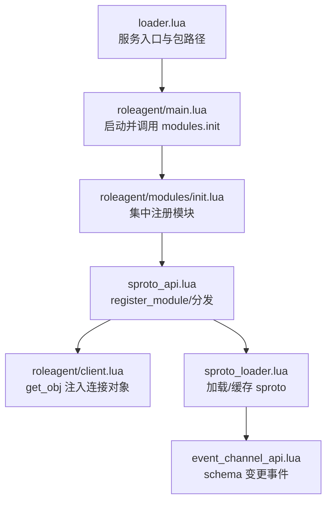
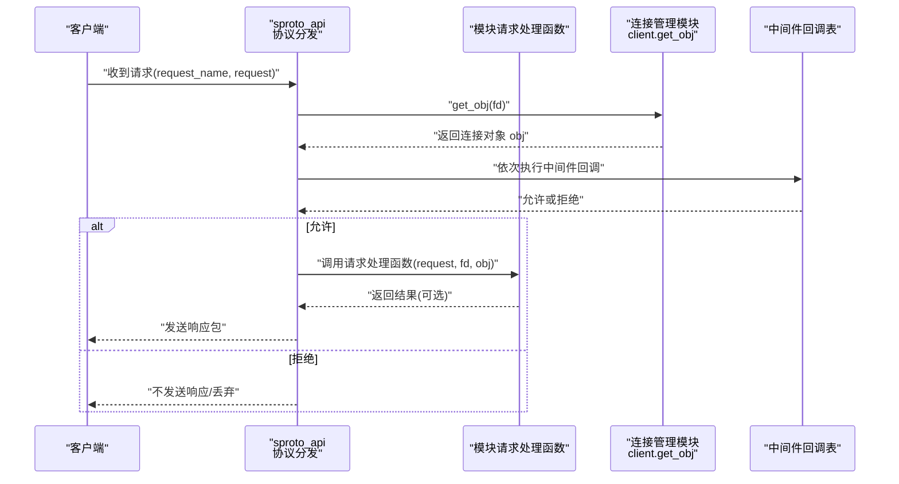
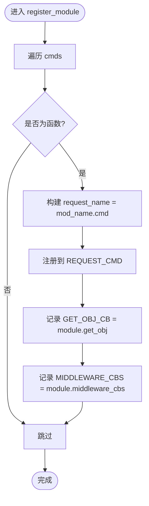
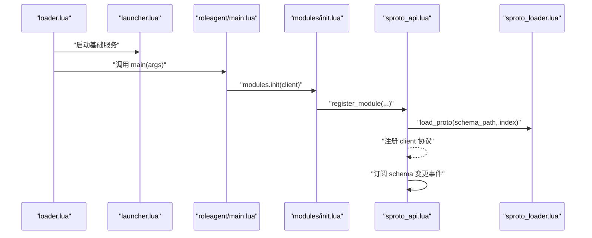
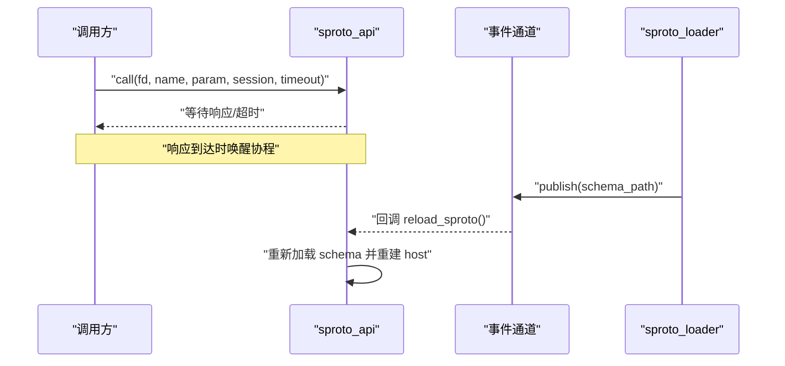
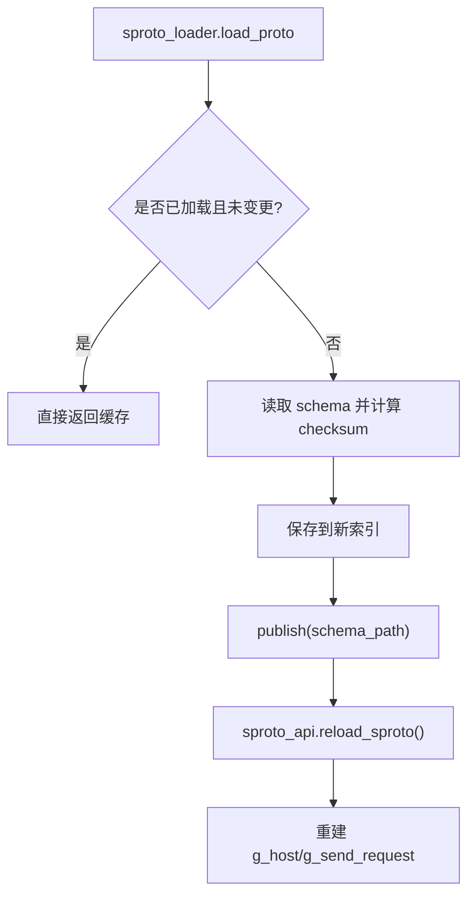
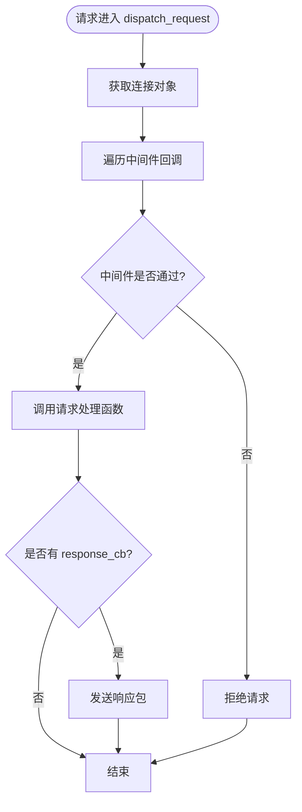
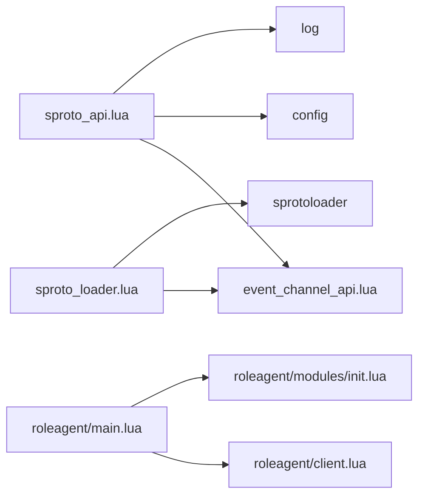

# 模块注册机制

<cite>
**本文引用的文件**
- [sproto_api.lua](file://lualib/sproto_api.lua)
- [loader.lua](file://lualib/loader.lua)
- [launcher.lua](file://lualib/launcher.lua)
- [roleagent/main.lua](file://app/role/roleagent/main.lua)
- [roleagent/client.lua](file://app/role/roleagent/client.lua)
- [roleagent/modules/init.lua](file://app/role/roleagent/modules/init.lua)
- [gen_roleagent_modules.lua](file://tools/gen_roleagent_modules.lua)
- [sproto_loader.lua](file://service/sproto_loader.lua)
- [event_channel_api.lua](file://lualib/event_channel_api.lua)
- [login/client.lua](file://app/role/login/client.lua)
- [errcode.lua](file://lualib/errcode.lua)
</cite>

## 目录
1. [简介](#简介)
2. [项目结构](#项目结构)
3. [核心组件](#核心组件)
4. [架构总览](#架构总览)
5. [详细组件分析](#详细组件分析)
6. [依赖关系分析](#依赖关系分析)
7. [性能考虑](#性能考虑)
8. [故障排查指南](#故障排查指南)
9. [结论](#结论)
10. [附录](#附录)

## 简介
本文件围绕“模块注册机制”进行系统化说明，重点解释 sproto_api.register_module 的工作原理、模块加载顺序与初始化流程、模块间通信接口与数据共享机制、版本管理与依赖处理，以及自定义模块开发指南、扩展点与错误处理模式。该机制基于 Skynet 服务模型，通过协议层（sproto）将请求路由到具体业务模块，并在连接管理模块中提供对象获取与中间件拦截能力。

## 项目结构
- 协议与分发：sproto_api 负责协议装载、协议分发、请求调度、会话超时与通知/调用封装。
- 服务启动：loader 解析服务入口并设置包路径；launcher 启动基础服务（如 gm、hotfix、mongo_index）。
- 角色代理：roleagent 在启动时调用 modules.init(client) 完成模块注册；client 提供 get_obj 用于分发时注入连接上下文。
- 模块组织：modules/init 由代码生成器生成，集中注册各子模块的请求表；每个模块包含 request 与可选 init 实现。
- 协议装载与热更：sproto_loader 负责加载/缓存 sproto schema，并通过事件通道广播变更，触发 sproto_api 重载。
- 事件通道：event_channel_api 提供跨服务订阅/发布能力，用于 sproto schema 热更新等场景。
- 登录模块示例：login/client 展示如何提供 middleware_cbs 做鉴权拦截。

图表来源
- [loader.lua:1-72](file://lualib/loader.lua#L1-L72)
- [roleagent/main.lua:110-116](file://app/role/roleagent/main.lua#L110-L116)
- [roleagent/modules/init.lua:12-16](file://app/role/roleagent/modules/init.lua#L12-L16)
- [sproto_api.lua:31-41](file://lualib/sproto_api.lua#L31-L41)
- [roleagent/client.lua:45-47](file://app/role/roleagent/client.lua#L45-L47)
- [sproto_loader.lua:19-59](file://service/sproto_loader.lua#L19-L59)
- [event_channel_api.lua:29-49](file://lualib/event_channel_api.lua#L29-L49)

章节来源
- [loader.lua:1-72](file://lualib/loader.lua#L1-L72)
- [roleagent/main.lua:110-116](file://app/role/roleagent/main.lua#L110-L116)
- [roleagent/modules/init.lua:12-16](file://app/role/roleagent/modules/init.lua#L12-L16)
- [sproto_api.lua:31-41](file://lualib/sproto_api.lua#L31-L41)
- [roleagent/client.lua:45-47](file://app/role/roleagent/client.lua#L45-L47)
- [sproto_loader.lua:19-59](file://service/sproto_loader.lua#L19-L59)
- [event_channel_api.lua:29-49](file://lualib/event_channel_api.lua#L29-L49)

## 核心组件
- sproto_api：协议分发中心，维护请求命令表、连接对象获取回调、中间件回调表；提供 register_module、raw_dispatch、call/notify、sproto 重载等能力。
- roleagent/client：连接管理模块，维护 fd 到连接对象的映射，并提供 get_obj 供分发阶段注入上下文。
- roleagent/modules/init：集中注册各模块的请求表，统一调用 sproto_api.register_module。
- sproto_loader：加载 sproto schema，按索引去重与校验，变更时通过事件通道广播。
- event_channel_api：跨服务事件通道，支持订阅/发布，用于 schema 热更新。
- login/client：示例模块，提供 middleware_cbs 实现鉴权拦截。

章节来源
- [sproto_api.lua:8-17](file://lualib/sproto_api.lua#L8-L17)
- [roleagent/client.lua:7-47](file://app/role/roleagent/client.lua#L7-L47)
- [roleagent/modules/init.lua:12-16](file://app/role/roleagent/modules/init.lua#L12-L16)
- [sproto_loader.lua:19-59](file://service/sproto_loader.lua#L19-L59)
- [event_channel_api.lua:29-49](file://lualib/event_channel_api.lua#L29-L49)
- [login/client.lua:55-73](file://app/role/login/client.lua#L55-L73)

## 架构总览
下图展示了从客户端请求进入，到模块注册的命令分发、中间件拦截、连接对象注入，再到响应返回的完整链路。

图表来源
- [sproto_api.lua:47-79](file://lualib/sproto_api.lua#L47-L79)
- [roleagent/client.lua:45-47](file://app/role/roleagent/client.lua#L45-L47)
- [login/client.lua:55-73](file://app/role/login/client.lua#L55-L73)

## 详细组件分析

### sproto_api.register_module 工作原理
- 输入参数：
  - mod_name：协议命名空间（通常为模块名），最终形成 request_name = mod_name + "." + cmd。
  - module：连接管理模块，需提供 get_obj 与可选 middleware_cbs。
  - cmds：请求命令表，键为命令名，值为处理函数。
- 内部行为：
  - 遍历 cmds，若值为函数，则注册到全局 REQUEST_CMD，同时记录 GET_OBJ_CB 与 MIDDLEWARE_CBS。
  - 重复注册同一 request_name 会报错，防止覆盖。
- 分发流程：
  - raw_dispatch 根据 type 区分 REQUEST 与响应回传。
  - dispatch_request 先获取连接对象，再执行中间件链，最后调用实际处理函数。
  - 无 response_cb 时不应返回值；有 response_cb 时将结果包装后返回。

图表来源
- [sproto_api.lua:19-41](file://lualib/sproto_api.lua#L19-L41)

章节来源
- [sproto_api.lua:19-41](file://lualib/sproto_api.lua#L19-L41)

### 模块加载顺序与初始化过程
- 服务启动：
  - loader 解析 LUA_SERVICE 与服务名，设置 package.path，加载 skyext，并调用 main。
  - launcher 启动 gm、hotfix、mongo_index 等基础服务。
- 角色代理初始化：
  - roleagent/main 在 skynet.start 中调用 modules.init(client)，随后注册 CMD、集群发现、服务名。
  - modules/init 由工具生成，集中 require 各模块的 request 表，并调用 sproto_api.register_module 完成注册。
- 协议装载：
  - sproto_api 在 skynet.init 中创建 sproto_loader 唯一服务，加载 schema，注册 client 协议，订阅 schema 变更事件以热重载。

图表来源
- [loader.lua:1-72](file://lualib/loader.lua#L1-L72)
- [launcher.lua:6-17](file://lualib/launcher.lua#L6-L17)
- [roleagent/main.lua:110-116](file://app/role/roleagent/main.lua#L110-L116)
- [roleagent/modules/init.lua:12-16](file://app/role/roleagent/modules/init.lua#L12-L16)
- [sproto_api.lua:188-196](file://lualib/sproto_api.lua#L188-L196)
- [sproto_loader.lua:61-66](file://service/sproto_loader.lua#L61-L66)

章节来源
- [loader.lua:1-72](file://lualib/loader.lua#L1-L72)
- [launcher.lua:6-17](file://lualib/launcher.lua#L6-L17)
- [roleagent/main.lua:110-116](file://app/role/roleagent/main.lua#L110-L116)
- [roleagent/modules/init.lua:12-16](file://app/role/roleagent/modules/init.lua#L12-L16)
- [sproto_api.lua:188-196](file://lualib/sproto_api.lua#L188-L196)
- [sproto_loader.lua:61-66](file://service/sproto_loader.lua#L61-L66)

### 模块间通信接口与数据共享机制
- 请求/响应：
  - sproto_api.call(fd, name, param, session, timeout) 发送带 session 的请求，阻塞等待响应或超时。
  - sproto_api.notify(fd, name, param) 发送单向通知。
- 连接对象共享：
  - 连接管理模块 client.get_obj(fd) 返回连接上下文（含 role_obj），在分发阶段注入给请求处理函数。
- 事件通道：
  - event_channel_api.subscribe/publish 用于跨服务事件通信，例如 sproto schema 变更时触发 sproto_api.reload_sproto。

图表来源
- [sproto_api.lua:136-159](file://lualib/sproto_api.lua#L136-L159)
- [sproto_api.lua:169-186](file://lualib/sproto_api.lua#L169-L186)
- [event_channel_api.lua:29-49](file://lualib/event_channel_api.lua#L29-L49)
- [sproto_loader.lua:56-59](file://service/sproto_loader.lua#L56-L59)

章节来源
- [sproto_api.lua:136-159](file://lualib/sproto_api.lua#L136-L159)
- [sproto_api.lua:169-186](file://lualib/sproto_api.lua#L169-L186)
- [event_channel_api.lua:29-49](file://lualib/event_channel_api.lua#L29-L49)
- [sproto_loader.lua:56-59](file://service/sproto_loader.lua#L56-L59)

### 模块版本管理与依赖关系处理
- 版本管理：
  - sproto_loader 读取 schema 文件，计算 MD5，按 sproto_index 缓存；当内容变化时保存新 schema 并广播事件，触发 sproto_api 重载。
  - 支持 GM 命令重载所有已加载的 schema。
- 依赖关系：
  - 模块注册依赖连接管理模块提供的 get_obj 与 middleware_cbs。
  - 模块初始化顺序由 modules/init 决定，可通过生成器调整顺序。
  - 角色模块实例化在 modules.load 中按需创建，避免不必要的初始化开销。

图表来源
- [sproto_loader.lua:19-59](file://service/sproto_loader.lua#L19-L59)
- [sproto_api.lua:182-186](file://lualib/sproto_api.lua#L182-L186)

章节来源
- [sproto_loader.lua:19-59](file://service/sproto_loader.lua#L19-L59)
- [sproto_api.lua:182-186](file://lualib/sproto_api.lua#L182-L186)

### 自定义模块开发指南与扩展点
- 新增模块步骤：
  - 在 app/role/roleagent/modules 下新建模块目录，包含 init.lua 与 request.lua。
  - 在 request.lua 中实现若干处理函数（使用 : 方法定义，self 即为请求体）。
  - 运行 tools/gen_roleagent_modules.lua 生成 modules/init.lua，自动注册模块。
  - 如需连接上下文，确保连接管理模块提供 get_obj；如需鉴权拦截，提供 middleware_cbs。
- 扩展点：
  - middleware_cbs：在请求处理前执行，可返回 true 放行或 nil 拒绝。
  - get_obj：在分发阶段注入连接对象，便于访问角色状态。
  - modules.load：可按需初始化模块实例，持有角色级数据。

章节来源
- [gen_roleagent_modules.lua:64-81](file://tools/gen_roleagent_modules.lua#L64-L81)
- [roleagent/modules/init.lua:12-16](file://app/role/roleagent/modules/init.lua#L12-L16)
- [login/client.lua:55-73](file://app/role/login/client.lua#L55-L73)
- [roleagent/client.lua:45-47](file://app/role/roleagent/client.lua#L45-L47)

### 模块注册示例与错误处理模式
- 注册示例：
  - modules/init 中调用 sproto_api.register_module("module_name", client, request_table)。
  - 每个请求处理函数接收 (request, fd, obj)，可返回响应或直接写入响应。
- 错误处理模式：
  - 重复注册同一 request_name 会抛出错误，避免覆盖。
  - 中间件异常会被捕获并记录警告，请求被拒绝。
  - 调用超时：sproto_api.call 默认超时时间来自配置，超时会记录错误并返回 nil。
  - 错误码：errcode 提供统一错误码常量，便于上层统一处理。

图表来源
- [sproto_api.lua:47-79](file://lualib/sproto_api.lua#L47-L79)
- [errcode.lua:1-29](file://lualib/errcode.lua#L1-L29)

章节来源
- [roleagent/modules/init.lua:12-16](file://app/role/roleagent/modules/init.lua#L12-L16)
- [sproto_api.lua:19-41](file://lualib/sproto_api.lua#L19-L41)
- [sproto_api.lua:47-79](file://lualib/sproto_api.lua#L47-L79)
- [sproto_api.lua:136-159](file://lualib/sproto_api.lua#L136-L159)
- [errcode.lua:1-29](file://lualib/errcode.lua#L1-L29)

## 依赖关系分析
- sproto_api 依赖：
  - skynet、socket、netpack 用于网络收发。
  - event_channel_api 用于 schema 热更新。
  - config 用于超时与 schema 路径配置。
  - log 用于日志输出。
- roleagent 依赖：
  - client 提供连接对象管理。
  - modules 提供模块注册入口。
  - rolemgr/rolenode_api 等用于角色生命周期与路由。
- sproto_loader 依赖：
  - sprotoloader 用于 schema 加载与保存。
  - md5 用于校验。
  - event_channel_api 用于发布变更。
  - cmd_api/gm_api 用于命令暴露。

图表来源
- [sproto_api.lua:1-6](file://lualib/sproto_api.lua#L1-L6)
- [roleagent/main.lua:1-13](file://app/role/roleagent/main.lua#L1-L13)
- [sproto_loader.lua:1-8](file://service/sproto_loader.lua#L1-L8)

章节来源
- [sproto_api.lua:1-6](file://lualib/sproto_api.lua#L1-L6)
- [roleagent/main.lua:1-13](file://app/role/roleagent/main.lua#L1-L13)
- [sproto_loader.lua:1-8](file://service/sproto_loader.lua#L1-L8)

## 性能考虑
- 分发路径短：REQUEST_CMD 查找为 O(1)，中间件链长度可控，避免过长拦截链。
- 连接对象复用：get_obj 仅查表，减少对象创建成本。
- 协议热更：sproto_loader 按索引缓存 schema，变更时才重建 host，降低频繁重载开销。
- 超时控制：call 默认超时来自配置，避免协程长期挂起。
- 资源回收：schema 变更后 collectgarbage("collect") 释放旧对象。

[本节为通用指导，无需特定文件引用]

## 故障排查指南
- 重复注册错误：
  - 现象：注册相同 request_name 时报错。
  - 排查：检查 modules/init 是否重复注册或命名冲突。
- 中间件拒绝请求：
  - 现象：请求被中间件拒绝，无响应。
  - 排查：检查 middleware_cbs 逻辑与返回约定（true 放行，nil 拒绝）。
- 调用超时：
  - 现象：sproto_api.call 返回 nil 并记录超时日志。
  - 排查：确认对端是否正确响应 session，检查超时配置。
- 协议不一致：
  - 现象：客户端与服务端协议版本不一致导致解析失败。
  - 排查：确认 sproto_loader 已正确加载最新 schema，必要时手动触发重载。
- 错误码使用：
  - 建议统一使用 errcode 中的常量，便于前端/网关统一处理。

章节来源
- [sproto_api.lua:19-24](file://lualib/sproto_api.lua#L19-L24)
- [sproto_api.lua:57-69](file://lualib/sproto_api.lua#L57-L69)
- [sproto_api.lua:136-159](file://lualib/sproto_api.lua#L136-L159)
- [sproto_loader.lua:19-59](file://service/sproto_loader.lua#L19-L59)
- [errcode.lua:1-29](file://lualib/errcode.lua#L1-L29)

## 结论
本模块注册机制以 sproto_api 为核心，结合连接管理模块与中间件体系，实现了高内聚、低耦合的请求分发与扩展点。通过 sproto_loader 与事件通道，实现了协议的热更新与版本管理。角色代理通过 modules/init 集中注册模块，保证加载顺序与一致性。开发者只需遵循规范实现 request 与可选中间件，即可快速扩展业务能力。

[本节为总结性内容，无需特定文件引用]

## 附录
- 关键 API 速览：
  - sproto_api.register_module(mod_name, module, cmds)
  - sproto_api.call(fd, name, param, session, timeout)
  - sproto_api.notify(fd, name, param)
  - sproto_api.get_sproto_info()/get_sproto_host()
- 常用配置项：
  - sproto_schema_path：sproto schema 路径
  - sproto_index：schema 索引
  - sproto_timeout：call 默认超时秒数

[本节为补充信息，无需特定文件引用]