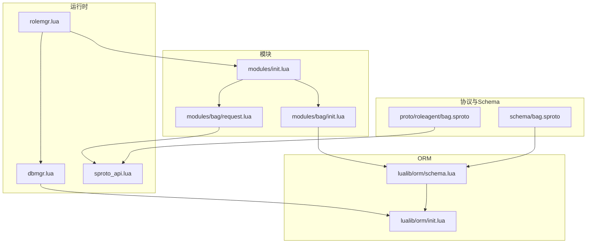
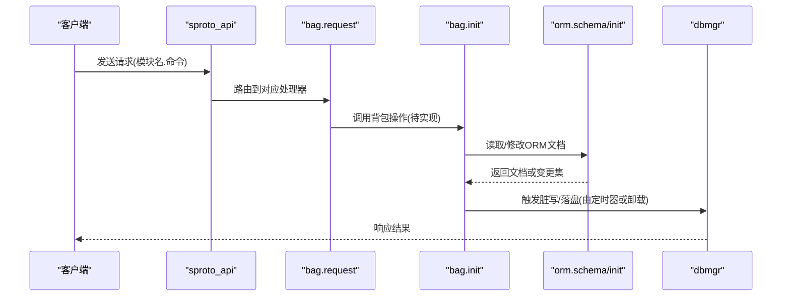
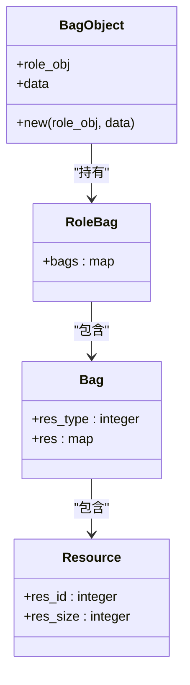
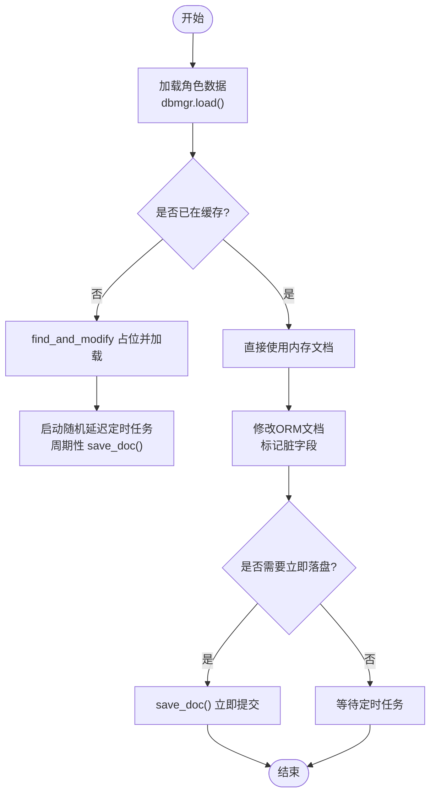
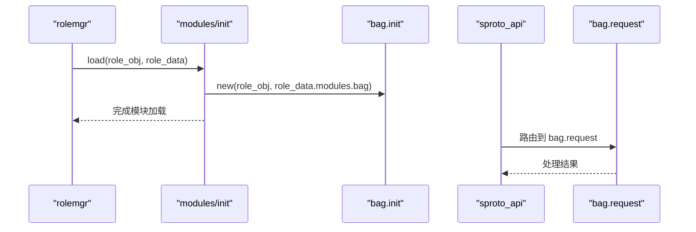
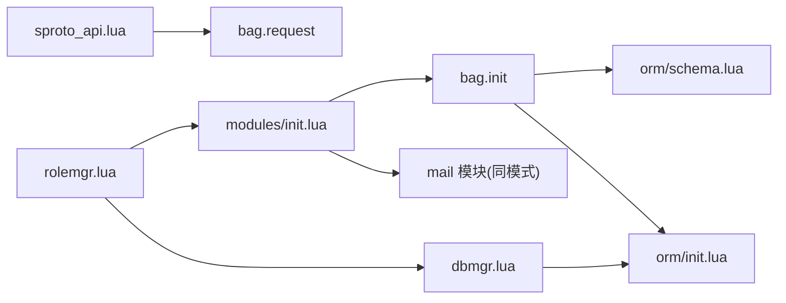

# 背包系统模块

<cite>
**本文引用的文件**
- [app/role/roleagent/modules/bag/init.lua](file://app/role/roleagent/modules/bag/init.lua)
- [app/role/roleagent/modules/bag/request.lua](file://app/role/roleagent/modules/bag/request.lua)
- [app/role/roleagent/modules/init.lua](file://app/role/roleagent/modules/init.lua)
- [app/role/roleagent/rolemgr.lua](file://app/role/roleagent/rolemgr.lua)
- [lualib/dbmgr.lua](file://lualib/dbmgr.lua)
- [lualib/orm/init.lua](file://lualib/orm/init.lua)
- [lualib/orm/schema.lua](file://lualib/orm/schema.lua)
- [schema/bag.sproto](file://schema/bag.sproto)
- [proto/roleagent/bag.sproto](file://proto/roleagent/bag.sproto)
- [lualib/sproto_api.lua](file://lualib/sproto_api.lua)
</cite>

## 目录
1. [简介](#简介)
2. [项目结构](#项目结构)
3. [核心组件](#核心组件)
4. [架构总览](#架构总览)
5. [详细组件分析](#详细组件分析)
6. [依赖关系分析](#依赖关系分析)
7. [性能考虑](#性能考虑)
8. [故障排查指南](#故障排查指南)
9. [结论](#结论)
10. [附录：API与使用示例](#附录api与使用示例)

## 简介
本模块为角色“背包”子系统，负责玩家道具与资源的存储、查询与变更。当前仓库中实现了背包的数据模型定义、ORM 序列化与持久化机制、以及模块加载与注册入口；业务请求处理层（request）已预留接口位置，便于后续扩展获取、使用、删除等具体操作。

## 项目结构
围绕背包的源码主要分布在以下位置：
- 数据协议与 Schema：schema/bag.sproto、proto/roleagent/bag.sproto
- ORM 类型与序列化：lualib/orm/schema.lua、lualib/orm/init.lua
- 模块初始化与加载：app/role/roleagent/modules/init.lua
- 背包对象实现：app/role/roleagent/modules/bag/init.lua
- 请求路由与中间件：app/role/roleagent/modules/bag/request.lua、lualib/sproto_api.lua
- 角色管理器与数据持久化：app/role/roleagent/rolemgr.lua、lualib/dbmgr.lua

图示来源
- [schema/bag.sproto:1-16](file://schema/bag.sproto#L1-L16)
- [lualib/orm/schema.lua:187-229](file://lualib/orm/schema.lua#L187-L229)
- [lualib/orm/init.lua:234-295](file://lualib/orm/init.lua#L234-L295)
- [app/role/roleagent/modules/init.lua:12-34](file://app/role/roleagent/modules/init.lua#L12-L34)
- [app/role/roleagent/modules/bag/init.lua:6-23](file://app/role/roleagent/modules/bag/init.lua#L6-L23)
- [lualib/sproto_api.lua:31-41](file://lualib/sproto_api.lua#L31-L41)
- [app/role/roleagent/rolemgr.lua:15-25](file://app/role/roleagent/rolemgr.lua#L15-L25)
- [lualib/dbmgr.lua:94-148](file://lualib/dbmgr.lua#L94-L148)

章节来源
- [app/role/roleagent/modules/init.lua:12-34](file://app/role/roleagent/modules/init.lua#L12-L34)
- [app/role/roleagent/modules/bag/init.lua:6-23](file://app/role/roleagent/modules/bag/init.lua#L6-L23)
- [schema/bag.sproto:1-16](file://schema/bag.sproto#L1-L16)
- [lualib/orm/schema.lua:187-229](file://lualib/orm/schema.lua#L187-L229)
- [lualib/dbmgr.lua:94-148](file://lualib/dbmgr.lua#L94-L148)

## 核心组件
- 背包数据模型（bag/resource）：通过 sproto 定义并生成 ORM schema，用于描述资源分类与资源项。
- ORM 文档与脏追踪：提供字段级变更追踪、增量提交到 MongoDB 的能力。
- 模块加载器：在角色数据加载时实例化各子模块（含背包）。
- 请求路由：基于 sproto_api 将客户端请求分发至对应模块处理器。
- 持久化：dbmgr 定时增量保存，卸载时落盘，保证一致性。

章节来源
- [schema/bag.sproto:1-16](file://schema/bag.sproto#L1-L16)
- [lualib/orm/schema.lua:187-229](file://lualib/orm/schema.lua#L187-L229)
- [lualib/orm/init.lua:234-295](file://lualib/orm/init.lua#L234-L295)
- [app/role/roleagent/modules/init.lua:18-34](file://app/role/roleagent/modules/init.lua#L18-L34)
- [lualib/sproto_api.lua:31-41](file://lualib/sproto_api.lua#L31-L41)
- [lualib/dbmgr.lua:94-148](file://lualib/dbmgr.lua#L94-L148)

## 架构总览
背包系统采用“协议 -> ORM -> 模块 -> 持久化”的分层架构：
- 协议层：sproto 定义 bag/resource 结构，服务间通信使用 roleagent/bag.sproto。
- ORM 层：根据 sproto 生成 schema，封装文档对象，支持脏标记与增量提交。
- 模块层：角色模块在加载时创建背包对象，持有角色引用与数据。
- 持久化层：dbmgr 维护内存缓存、定时任务与卸载落盘，确保数据一致性与性能。

图示来源
- [lualib/sproto_api.lua:31-41](file://lualib/sproto_api.lua#L31-L41)
- [app/role/roleagent/modules/bag/request.lua:1-4](file://app/role/roleagent/modules/bag/request.lua#L1-L4)
- [app/role/roleagent/modules/bag/init.lua:6-23](file://app/role/roleagent/modules/bag/init.lua#L6-L23)
- [lualib/orm/schema.lua:187-229](file://lualib/orm/schema.lua#L187-L229)
- [lualib/dbmgr.lua:94-148](file://lualib/dbmgr.lua#L94-L148)

## 详细组件分析

### 数据模型与类型定义
- 资源分类 bag：包含资源类型 res_type 与资源映射 res（键为资源ID，值为 resource）。
- 资源 resource：包含资源ID res_id 与数量 res_size。
- 角色背包 role_bag：包含 bags 映射（键为背包槽位ID，值为 bag）。

这些类型由 schema/bag.sproto 定义，并在 lualib/orm/schema.lua 中生成对应的 schema 对象与 new 构造器，供 ORM 文档使用。

章节来源
- [schema/bag.sproto:1-16](file://schema/bag.sproto#L1-L16)
- [lualib/orm/schema.lua:187-229](file://lualib/orm/schema.lua#L187-L229)

### 背包对象与数据结构
- 背包对象由 modules/bag/init.lua 的 new 函数创建，持有角色对象 role_obj 与数据 data。
- 初始化时设置 data.bags 为空表，并预置一个默认背包槽位（例如 101），内含资源映射。
- 该对象作为角色模块之一，随角色数据加载而创建。

图示来源
- [app/role/roleagent/modules/bag/init.lua:6-23](file://app/role/roleagent/modules/bag/init.lua#L6-L23)
- [lualib/orm/schema.lua:187-229](file://lualib/orm/schema.lua#L187-L229)

章节来源
- [app/role/roleagent/modules/bag/init.lua:6-23](file://app/role/roleagent/modules/bag/init.lua#L6-L23)

### 物品管理机制（获取、使用、删除）
- 当前 request.lua 仅暴露空模块，未实现具体业务逻辑。
- 建议后续在 request.lua 中实现：
  - 获取物品：从 data.bags[res_type][res_id] 读取数量。
  - 使用物品：减少数量，若数量为 0 则移除条目。
  - 删除物品：直接移除条目。
- 所有变更将通过 ORM 的脏标记机制自动追踪，并由 dbmgr 定时或卸载时持久化。

章节来源
- [app/role/roleagent/modules/bag/request.lua:1-4](file://app/role/roleagent/modules/bag/request.lua#L1-L4)
- [lualib/orm/init.lua:40-70](file://lualib/orm/init.lua#L40-L70)
- [lualib/dbmgr.lua:53-92](file://lualib/dbmgr.lua#L53-L92)

### 容量管理与空间分配策略
- 当前实现未引入显式容量上限与占用计算；bags 为动态映射，可无限扩展。
- 如需容量限制，可在 bag 对象中添加 capacity 字段，并在增删物品时校验剩余空间。
- 空间分配可采用“按资源聚合”的策略：同一 res_id 合并计数，避免碎片化。

章节来源
- [app/role/roleagent/modules/bag/init.lua:14-22](file://app/role/roleagent/modules/bag/init.lua#L14-L22)

### 并发控制与事务处理
- 单进程内：Skynet 消息模型天然串行化，对同一角色的访问在同一 actor 内顺序执行，无需额外锁。
- 跨进程/多连接：通过 dbmgr 的版本号与 find_and_modify 上锁机制防止覆盖写；卸载前强制落盘，避免丢失。
- 事务语义：当前无分布式事务；可通过“先改内存脏标记，再统一落盘”的方式近似实现原子写入。

图示来源
- [lualib/dbmgr.lua:94-148](file://lualib/dbmgr.lua#L94-L148)
- [lualib/dbmgr.lua:53-92](file://lualib/dbmgr.lua#L53-L92)
- [lualib/orm/init.lua:428-447](file://lualib/orm/init.lua#L428-L447)

章节来源
- [lualib/dbmgr.lua:94-148](file://lualib/dbmgr.lua#L94-L148)
- [lualib/dbmgr.lua:53-92](file://lualib/dbmgr.lua#L53-L92)
- [lualib/orm/init.lua:428-447](file://lualib/orm/init.lua#L428-L447)

### 模块加载与请求路由
- modules/init.lua 在角色数据加载时，为每个模块创建实例（包括 bag）。
- sproto_api.register_module 将“bag.*”命令注册到路由表，客户端请求经 sproto_api 分发到 bag.request。

图示来源
- [app/role/roleagent/modules/init.lua:18-34](file://app/role/roleagent/modules/init.lua#L18-L34)
- [lualib/sproto_api.lua:31-41](file://lualib/sproto_api.lua#L31-L41)

章节来源
- [app/role/roleagent/modules/init.lua:18-34](file://app/role/roleagent/modules/init.lua#L18-L34)
- [lualib/sproto_api.lua:31-41](file://lualib/sproto_api.lua#L31-L41)

## 依赖关系分析
- 背包模块依赖 ORM schema 进行类型校验与序列化。
- 模块加载依赖 modules/init.lua 统一装配。
- 持久化依赖 dbmgr 提供的加载、缓存、定时落盘与卸载落盘能力。
- 请求路由依赖 sproto_api 的命令注册与分发。

图示来源
- [app/role/roleagent/modules/bag/init.lua:6-23](file://app/role/roleagent/modules/bag/init.lua#L6-L23)
- [lualib/orm/schema.lua:187-229](file://lualib/orm/schema.lua#L187-L229)
- [lualib/orm/init.lua:234-295](file://lualib/orm/init.lua#L234-L295)
- [app/role/roleagent/modules/init.lua:18-34](file://app/role/roleagent/modules/init.lua#L18-L34)
- [lualib/sproto_api.lua:31-41](file://lualib/sproto_api.lua#L31-L41)
- [app/role/roleagent/rolemgr.lua:15-25](file://app/role/roleagent/rolemgr.lua#L15-L25)
- [lualib/dbmgr.lua:94-148](file://lualib/dbmgr.lua#L94-L148)

章节来源
- [app/role/roleagent/modules/bag/init.lua:6-23](file://app/role/roleagent/modules/bag/init.lua#L6-L23)
- [lualib/orm/schema.lua:187-229](file://lualib/orm/schema.lua#L187-L229)
- [lualib/orm/init.lua:234-295](file://lualib/orm/init.lua#L234-L295)
- [app/role/roleagent/modules/init.lua:18-34](file://app/role/roleagent/modules/init.lua#L18-L34)
- [lualib/sproto_api.lua:31-41](file://lualib/sproto_api.lua#L31-L41)
- [app/role/roleagent/rolemgr.lua:15-25](file://app/role/roleagent/rolemgr.lua#L15-L25)
- [lualib/dbmgr.lua:94-148](file://lualib/dbmgr.lua#L94-L148)

## 性能考虑
- 增量提交：ORM 仅提交脏字段，减少网络与磁盘开销。
- 定时落盘：dbmgr 使用随机延迟的定时任务降低集中写入压力。
- 内存缓存：dbmgr 对文档进行缓存，避免重复数据库查询。
- 卸载落盘：角色卸载时强制落盘，保障数据一致性。

[本节为通用指导，不直接分析具体文件]

## 故障排查指南
- 加载失败：检查 dbmgr.load 返回值与日志，确认集合配置与数据库连通性。
- 保存失败：查看 save_dirty 日志，核对 _version 冲突与更新结果 nModified。
- 卸载失败：确认 unload 前取消定时器，避免竞态；检查 save_doc 返回。
- ORM 类型错误：检查 schema 定义与赋值类型是否匹配。

章节来源
- [lualib/dbmgr.lua:53-92](file://lualib/dbmgr.lua#L53-L92)
- [lualib/dbmgr.lua:150-198](file://lualib/dbmgr.lua#L150-L198)
- [lualib/orm/schema.lua:89-142](file://lualib/orm/schema.lua#L89-L142)

## 结论
当前仓库提供了背包系统的完整数据模型、ORM 序列化与持久化基础设施，以及模块加载与请求路由框架。业务侧（获取、使用、删除）尚未实现，建议在 request.lua 中基于现有 ORM 与 dbmgr 能力快速扩展，同时可按需增加容量限制与更精细的空间分配策略。

[本节为总结，不直接分析具体文件]

## 附录：API与使用示例

### 协议与数据结构
- 协议定义位于 proto/roleagent/bag.sproto（占位说明）。
- 数据 Schema 位于 schema/bag.sproto，定义了 bag、resource 及 role_bag 的结构。

章节来源
- [proto/roleagent/bag.sproto:1-2](file://proto/roleagent/bag.sproto#L1-L2)
- [schema/bag.sproto:1-16](file://schema/bag.sproto#L1-L16)

### 模块API
- 模块注册：sproto_api.register_module("bag", client, bag_request)
- 模块加载：modules.load(role_obj, role_data) 会创建 bag.new(role_obj, role_data.modules.bag)

章节来源
- [lualib/sproto_api.lua:31-41](file://lualib/sproto_api.lua#L31-L41)
- [app/role/roleagent/modules/init.lua:12-34](file://app/role/roleagent/modules/init.lua#L12-L34)

### 使用示例（概念流程）
- 客户端发送“bag.use_item”请求。
- sproto_api 路由到 bag.request 处理器。
- 处理器读取 data.bags[res_type][res_id]，减少数量或删除条目。
- ORM 自动标记脏字段，dbmgr 定时或卸载时落盘。
- 返回成功或错误码给客户端。

[本节为概念流程，不直接分析具体文件]