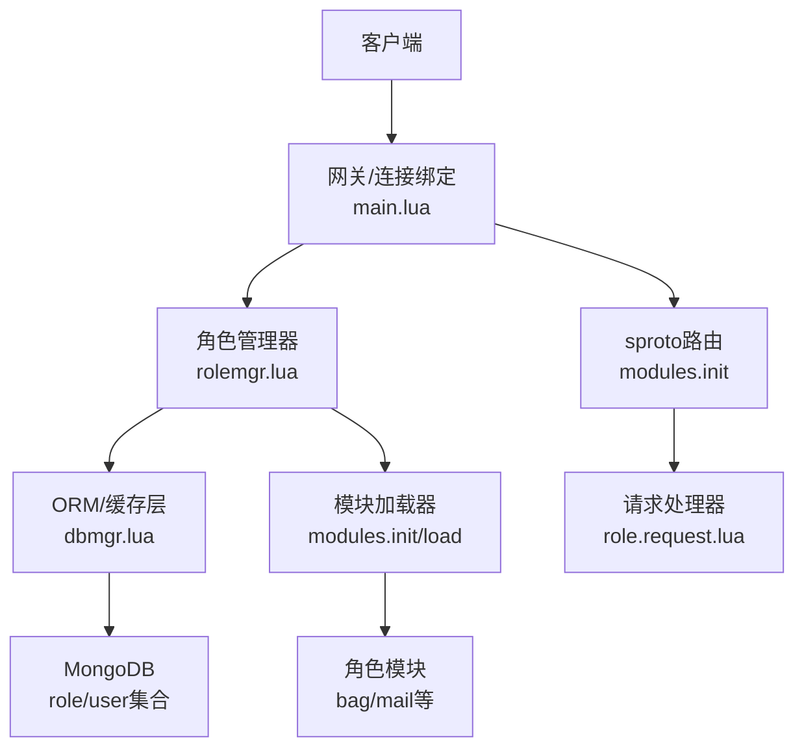
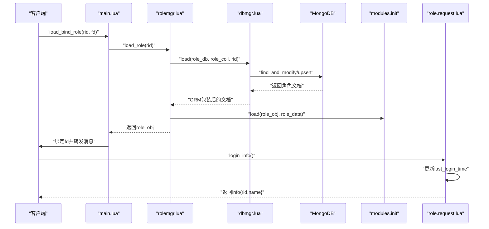
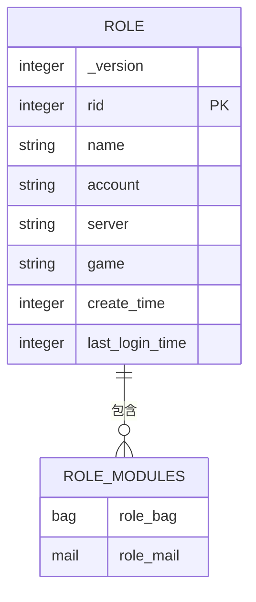
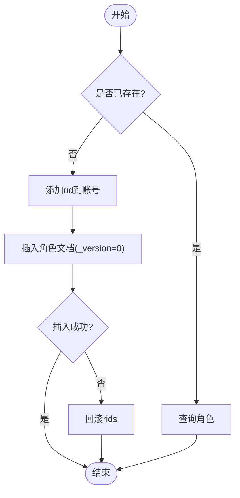
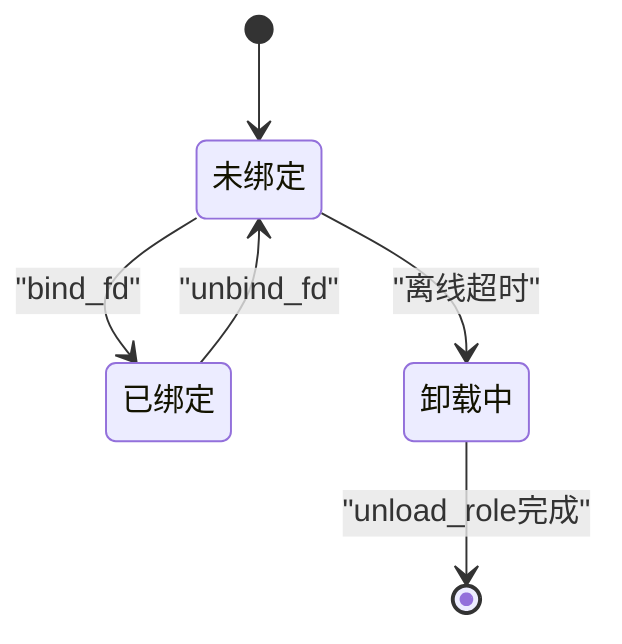
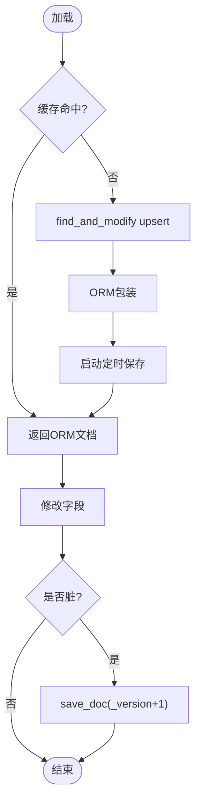
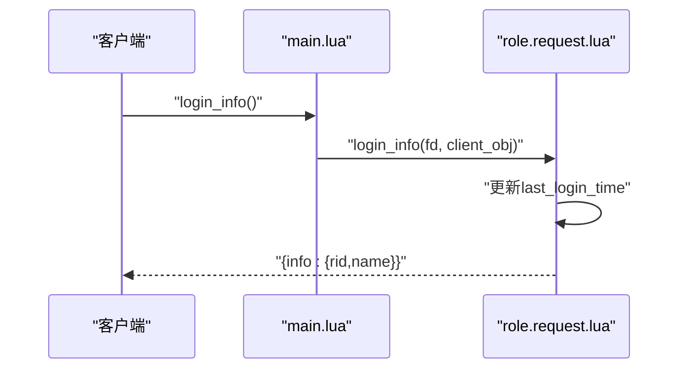
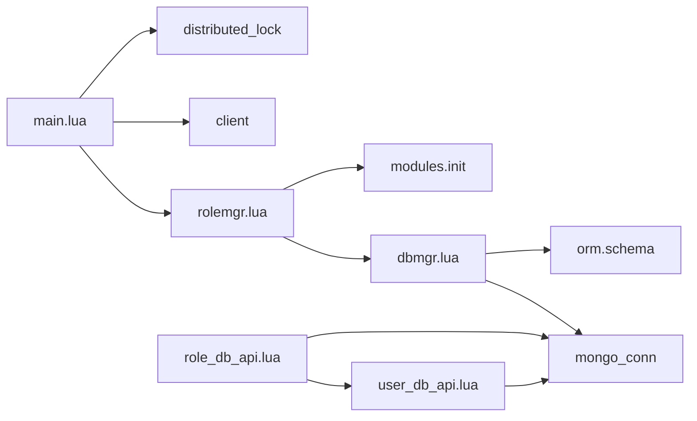

# 角色属性模块

<cite>
**本文引用的文件**
- [app/role/roleagent/modules/role/init.lua](file://app/role/roleagent/modules/role/init.lua)
- [app/role/roleagent/modules/role/request.lua](file://app/role/roleagent/modules/role/request.lua)
- [schema/role.sproto](file://schema/role.sproto)
- [proto/roleagent/role.sproto](file://proto/roleagent/role.sproto)
- [lualib/role_db_api.lua](file://lualib/role_db_api.lua)
- [lualib/user_db_api.lua](file://lualib/user_db_api.lua)
- [app/role/roleagent/rolemgr.lua](file://app/role/roleagent/rolemgr.lua)
- [app/role/roleagent/main.lua](file://app/role/roleagent/main.lua)
- [lualib/dbmgr.lua](file://lualib/dbmgr.lua)
- [etc/app/common.app.lua](file://etc/app/common.app.lua)
- [etc/app/role1.app.lua](file://etc/app/role1.app.lua)
- [res/hero.lua](file://res/hero.lua)
</cite>

## 目录
1. [简介](#简介)
2. [项目结构](#项目结构)
3. [核心组件](#核心组件)
4. [架构总览](#架构总览)
5. [详细组件分析](#详细组件分析)
6. [依赖关系分析](#依赖关系分析)
7. [性能考虑](#性能考虑)
8. [故障排查指南](#故障排查指南)
9. [结论](#结论)
10. [附录](#附录)

## 简介
本模块围绕“角色属性”展开，涵盖角色数据模型设计、字段定义、增删改查实现、状态与生命周期管理、持久化机制与版本控制、验证规则与业务逻辑处理、API参考与调用示例，以及数据结构与序列化格式说明。目标是让读者在不深入代码细节的情况下，也能理解并正确使用该模块。

## 项目结构
角色属性相关代码主要分布在以下位置：
- 协议与Schema定义：schema/role.sproto（持久化结构）、proto/roleagent/role.sproto（网络协议）
- 角色对象与请求处理：app/role/roleagent/modules/role/{init.lua, request.lua}
- 角色管理器与生命周期：app/role/roleagent/rolemgr.lua、app/role/roleagent/main.lua
- 持久化与缓存：lualib/dbmgr.lua、lualib/role_db_api.lua、lualib/user_db_api.lua
- 配置项：etc/app/common.app.lua、etc/app/role1.app.lua
- 资源数据：res/hero.lua（用于演示读取外部资源）

图表来源
- [app/role/roleagent/main.lua:36-80](file://app/role/roleagent/main.lua#L36-L80)
- [app/role/roleagent/rolemgr.lua:15-52](file://app/role/roleagent/rolemgr.lua#L15-L52)
- [lualib/dbmgr.lua:94-148](file://lualib/dbmgr.lua#L94-L148)
- [app/role/roleagent/modules/init.lua:12-34](file://app/role/roleagent/modules/init.lua#L12-L34)

章节来源
- [app/role/roleagent/main.lua:1-117](file://app/role/roleagent/main.lua#L1-L117)
- [app/role/roleagent/rolemgr.lua:1-59](file://app/role/roleagent/rolemgr.lua#L1-L59)
- [lualib/dbmgr.lua:1-219](file://lualib/dbmgr.lua#L1-L219)
- [app/role/roleagent/modules/init.lua:1-36](file://app/role/roleagent/modules/init.lua#L1-L36)

## 核心组件
- 角色对象（Role Object）：封装rid、data、fd及离线卸载定时器，提供绑定/解绑客户端连接的能力。
- 角色管理器（Role Manager）：负责角色的加载、卸载、查询与内存管理，协调数据库存取与模块初始化。
- 持久化与缓存（DB Manager）：基于ORM的文档级缓存，支持增量保存、乐观锁版本控制、定时落盘与卸载时强制落盘。
- 账户与角色索引（User/Role DB API）：维护账号与角色ID的映射，提供角色创建、查询、存在性校验等能力。
- 协议与模块路由（sproto + modules）：将网络请求路由到具体模块处理器，如role.request.login_info。

章节来源
- [app/role/roleagent/modules/role/init.lua:9-38](file://app/role/roleagent/modules/role/init.lua#L9-L38)
- [app/role/roleagent/rolemgr.lua:15-52](file://app/role/roleagent/rolemgr.lua#L15-L52)
- [lualib/dbmgr.lua:94-198](file://lualib/dbmgr.lua#L94-L198)
- [lualib/role_db_api.lua:12-75](file://lualib/role_db_api.lua#L12-L75)
- [lualib/user_db_api.lua:19-44](file://lualib/user_db_api.lua#L19-L44)
- [app/role/roleagent/modules/init.lua:12-34](file://app/role/roleagent/modules/init.lua#L12-L34)

## 架构总览
角色属性模块采用“进程内内存对象 + ORM缓存 + MongoDB”的分层架构。角色对象在首次访问时从MongoDB加载，进入内存后由dbmgr维护脏标记与版本，定时或卸载时落库；网络请求通过sproto路由到对应模块处理器，最终读写角色对象的data与子模块数据。

图表来源
- [app/role/roleagent/main.lua:36-80](file://app/role/roleagent/main.lua#L36-L80)
- [app/role/roleagent/rolemgr.lua:15-25](file://app/role/roleagent/rolemgr.lua#L15-L25)
- [lualib/dbmgr.lua:94-148](file://lualib/dbmgr.lua#L94-L148)
- [app/role/roleagent/modules/init.lua:18-34](file://app/role/roleagent/modules/init.lua#L18-L34)
- [app/role/roleagent/modules/role/request.lua:7-29](file://app/role/roleagent/modules/role/request.lua#L7-L29)

## 详细组件分析

### 角色数据模型与字段定义
- 持久化结构（schema/role.sproto）：包含版本号、rid、name、account、server、game、create_time、last_login_time、modules（子模块列表）。
- 网络协议（proto/roleagent/role.sproto）：定义登录信息接口，返回角色基本信息（rid、name）。
- 模块扩展：modules字段预留bag、mail等子模块，便于横向扩展。

图表来源
- [schema/role.sproto:1-24](file://schema/role.sproto#L1-L24)
- [proto/roleagent/role.sproto:1-13](file://proto/roleagent/role.sproto#L1-L13)

章节来源
- [schema/role.sproto:1-24](file://schema/role.sproto#L1-L24)
- [proto/roleagent/role.sproto:1-13](file://proto/roleagent/role.sproto#L1-L13)

### 角色属性的增删改查实现
- 创建角色（Create）
  - 使用user_db_api.add_rid将rid加入账号的rids集合。
  - 使用role_db_api.create插入角色文档，设置rid、account、_version=0。
  - 失败回滚：若插入失败，移除已添加的rid。
- 查询角色（Read）
  - role_db_api.get_roles根据账号获取rids，再按rid精确查询或批量查询。
  - has_role校验rid是否属于指定account与server。
- 更新角色（Update）
  - 通过dbmgr.load加载为ORM文档，修改字段后由定时任务或unload触发save_doc，自动递增_version并执行条件更新。
- 删除角色（Delete）
  - 当前仓库未直接暴露删除接口；可通过移除账号rids并清理角色文档实现（需结合业务策略）。

图表来源
- [lualib/role_db_api.lua:56-75](file://lualib/role_db_api.lua#L56-L75)
- [lualib/user_db_api.lua:28-44](file://lualib/user_db_api.lua#L28-L44)

章节来源
- [lualib/role_db_api.lua:12-75](file://lualib/role_db_api.lua#L12-L75)
- [lualib/user_db_api.lua:19-44](file://lualib/user_db_api.lua#L19-L44)

### 角色状态管理与生命周期控制
- 在线绑定/解绑
  - bind_fd：记录fd并取消离线卸载定时器。
  - unbind_fd：清空fd并启动定时器，超时后调用rolemgr.unload_role进行卸载。
- 节点内生命周期
  - load_role：从dbmgr加载角色文档，构造role对象，初始化模块。
  - unload_role：断开客户端、触发dbmgr.unload落盘、清理内存引用。
- 分布式锁与迁移
  - main中通过distributed_lock确保同一rid仅在一个节点活跃；若冲突则通知对方卸载并重新尝试加锁。

图表来源
- [app/role/roleagent/modules/role/init.lua:21-38](file://app/role/roleagent/modules/role/init.lua#L21-L38)
- [app/role/roleagent/rolemgr.lua:15-52](file://app/role/roleagent/rolemgr.lua#L15-L52)
- [app/role/roleagent/main.lua:36-80](file://app/role/roleagent/main.lua#L36-L80)

章节来源
- [app/role/roleagent/modules/role/init.lua:9-38](file://app/role/roleagent/modules/role/init.lua#L9-L38)
- [app/role/roleagent/rolemgr.lua:15-52](file://app/role/roleagent/rolemgr.lua#L15-L52)
- [app/role/roleagent/main.lua:36-80](file://app/role/roleagent/main.lua#L36-L80)

### 角色数据的持久化机制与版本管理
- 加载流程
  - dbmgr.load使用find_and_modify upsert，确保并发安全；返回ORM包装文档。
  - 启动随机延迟定时器周期性保存脏数据。
- 保存流程
  - save_doc检查orm.is_dirty，递增_version并使用{_version: old}作为条件更新，避免覆盖。
  - 失败时回滚_version，保证一致性。
- 卸载流程
  - 取消定时器，强制保存一次，清理缓存。

图表来源
- [lualib/dbmgr.lua:94-148](file://lualib/dbmgr.lua#L94-L148)
- [lualib/dbmgr.lua:67-92](file://lualib/dbmgr.lua#L67-L92)
- [lualib/dbmgr.lua:150-198](file://lualib/dbmgr.lua#L150-L198)

章节来源
- [lualib/dbmgr.lua:67-198](file://lualib/dbmgr.lua#L67-L198)

### 角色属性验证规则与业务逻辑处理
- 基本校验
  - has_role：校验rid归属account与server，防止越权。
  - get_roles：投影过滤_id，减少传输开销。
- 业务逻辑
  - login_info：更新last_login_time，返回基础信息；可结合资源数据（如res.hero）进行展示。
  - 模块初始化：modules.load为每个子模块准备初始结构，避免nil访问。
- 配置驱动
  - role_offline_unload_sec：控制离线卸载延迟。
  - db_save_interval：控制定时落盘间隔。

章节来源
- [lualib/role_db_api.lua:44-54](file://lualib/role_db_api.lua#L44-L54)
- [app/role/roleagent/modules/role/request.lua:7-29](file://app/role/roleagent/modules/role/request.lua#L7-L29)
- [app/role/roleagent/modules/init.lua:18-34](file://app/role/roleagent/modules/init.lua#L18-L34)
- [etc/app/role1.app.lua:14](file://etc/app/role1.app.lua#L14)
- [etc/app/common.app.lua:88](file://etc/app/common.app.lua#L88)

### 角色操作API参考与调用示例
- 登录信息查询
  - 协议：login_info（proto/roleagent/role.sproto）
  - 请求：空
  - 响应：info{rid, name}
  - 行为：更新last_login_time，返回角色基本信息
  - 调用路径：sproto路由 -> modules.role.request.login_info
- 角色绑定/解绑
  - 命令：load_bind_role(rid, fd)、disconnect(fd)
  - 行为：加锁、加载角色、绑定fd、转发消息；断开时解绑
- 角色卸载
  - 命令：unload_role(rid)
  - 行为：触发dbmgr.unload，释放内存

图表来源
- [proto/roleagent/role.sproto:7-12](file://proto/roleagent/role.sproto#L7-L12)
- [app/role/roleagent/modules/role/request.lua:7-29](file://app/role/roleagent/modules/role/request.lua#L7-L29)
- [app/role/roleagent/main.lua:36-80](file://app/role/roleagent/main.lua#L36-L80)

章节来源
- [proto/roleagent/role.sproto:1-13](file://proto/roleagent/role.sproto#L1-L13)
- [app/role/roleagent/modules/role/request.lua:7-29](file://app/role/roleagent/modules/role/request.lua#L7-L29)
- [app/role/roleagent/main.lua:36-80](file://app/role/roleagent/main.lua#L36-L80)

### 角色数据结构与序列化格式
- 持久化结构（schema/role.sproto）
  - 字段：_version、rid、name、account、server、game、create_time、last_login_time、modules
  - 用途：MongoDB存储与ORM映射
- 网络结构（proto/roleagent/role.sproto）
  - 字段：rid、name（在login_info.response.info中）
  - 用途：客户端交互的最小集
- 资源数据（res/hero.lua）
  - 用途：示例资源表，供展示或业务逻辑使用

章节来源
- [schema/role.sproto:1-24](file://schema/role.sproto#L1-L24)
- [proto/roleagent/role.sproto:1-13](file://proto/roleagent/role.sproto#L1-L13)
- [res/hero.lua:1-25](file://res/hero.lua#L1-L25)

## 依赖关系分析
- 组件耦合
  - main.lua依赖rolemgr、client、distributed_lock、rolenode_api、cluster_discovery
  - rolemgr依赖dbmgr、modules、config
  - dbmgr依赖mongo_conn、orm、timer、config
  - role_db_api依赖user_db_api、mongo_conn
  - user_db_api依赖mongo_conn、errcode、time
- 外部依赖
  - MongoDB：role与user集合，含唯一索引与复合索引
  - etcd：服务发现（配置中提供）
  - sproto：协议编解码与模块路由

图表来源
- [app/role/roleagent/main.lua:1-16](file://app/role/roleagent/main.lua#L1-L16)
- [app/role/roleagent/rolemgr.lua:1-6](file://app/role/roleagent/rolemgr.lua#L1-L6)
- [lualib/dbmgr.lua:1-8](file://lualib/dbmgr.lua#L1-L8)
- [lualib/role_db_api.lua:1-5](file://lualib/role_db_api.lua#L1-L5)
- [lualib/user_db_api.lua:1-7](file://lualib/user_db_api.lua#L1-L7)

章节来源
- [app/role/roleagent/main.lua:1-16](file://app/role/roleagent/main.lua#L1-L16)
- [app/role/roleagent/rolemgr.lua:1-6](file://app/role/roleagent/rolemgr.lua#L1-L6)
- [lualib/dbmgr.lua:1-8](file://lualib/dbmgr.lua#L1-L8)
- [lualib/role_db_api.lua:1-5](file://lualib/role_db_api.lua#L1-L5)
- [lualib/user_db_api.lua:1-7](file://lualib/user_db_api.lua#L1-L7)

## 性能考虑
- 惰性加载与内存占用
  - 角色对象按需加载，模块按需初始化，减少冷启动开销。
- 定时落盘与随机延迟
  - 降低集中写入压力，避免雪崩；卸载时强制落盘保证数据不丢失。
- 投影与索引
  - 查询使用投影去除_id，减少网络传输；MongoDB索引优化查询性能。
- 分布式锁
  - 避免多节点同时操作同一角色，提升一致性。

[本节为通用指导，无需特定文件引用]

## 故障排查指南
- 角色不存在或归属错误
  - 检查has_role与get_roles返回值，确认rid与account/server匹配。
- 加锁失败或角色在其他节点
  - 查看main中的分布式锁处理逻辑，确认是否收到IN_OTHER_NODE错误码。
- 保存失败或版本冲突
  - 关注dbmgr.save_doc的版本回滚与日志，检查并发修改场景。
- 离线未卸载
  - 检查role_offline_unload_sec配置与unbind_fd是否被正确调用。

章节来源
- [lualib/role_db_api.lua:44-54](file://lualib/role_db_api.lua#L44-L54)
- [app/role/roleagent/main.lua:45-71](file://app/role/roleagent/main.lua#L45-L71)
- [lualib/dbmgr.lua:67-92](file://lualib/dbmgr.lua#L67-L92)
- [app/role/roleagent/modules/role/init.lua:21-38](file://app/role/roleagent/modules/role/init.lua#L21-L38)

## 结论
角色属性模块通过清晰的职责划分与分层架构，实现了高效、可靠的角色数据管理。ORM缓存与乐观锁版本控制保障了数据一致性与性能；分布式锁与生命周期管理确保了多节点环境下的正确性。建议在生产环境中结合监控与告警，持续优化查询与落盘策略。

[本节为总结，无需特定文件引用]

## 附录
- 配置项速览
  - role_offline_unload_sec：角色离线卸载延迟（秒）
  - db_save_interval：定时落盘间隔（秒）
  - max_role_count：最大角色数量
  - server2game：客户端服务器到游戏服的映射
- 资源示例
  - res/hero.lua：英雄资源表，可用于展示或业务逻辑

章节来源
- [etc/app/role1.app.lua:14](file://etc/app/role1.app.lua#L14)
- [etc/app/common.app.lua:79-97](file://etc/app/common.app.lua#L79-L97)
- [res/hero.lua:1-25](file://res/hero.lua#L1-L25)