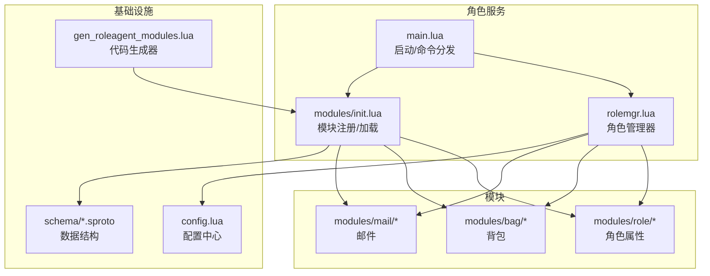
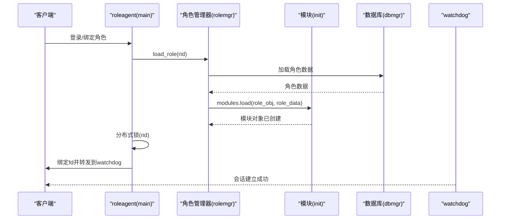
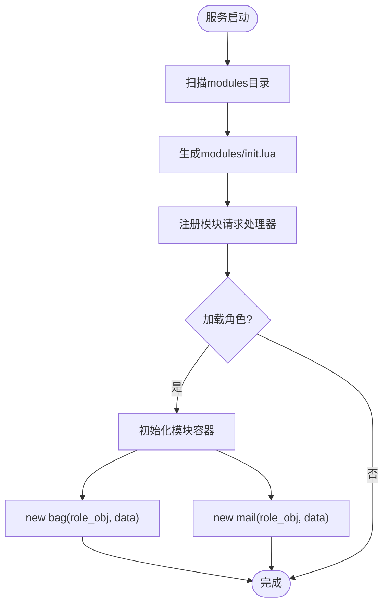
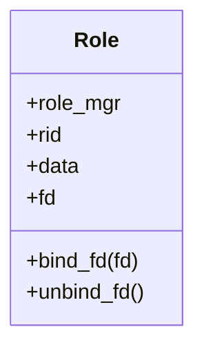
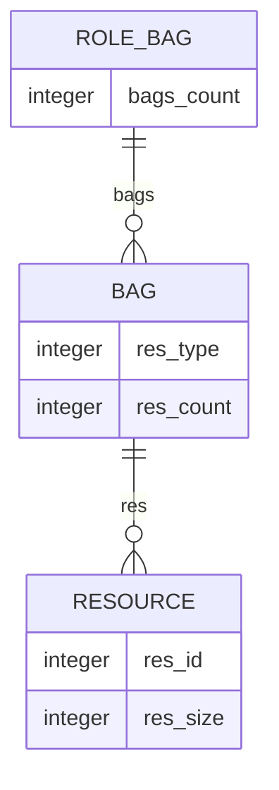
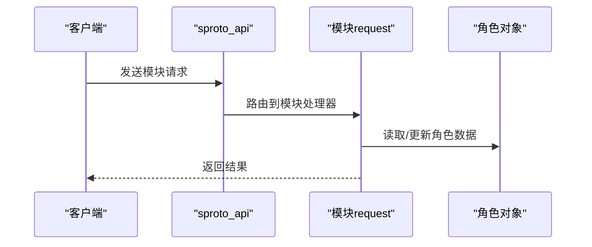
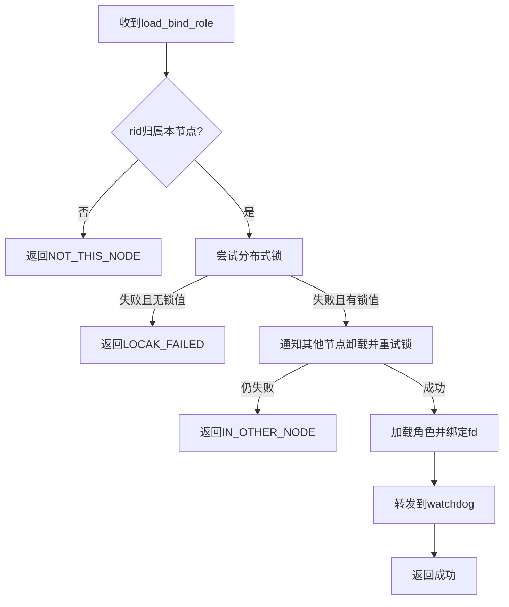
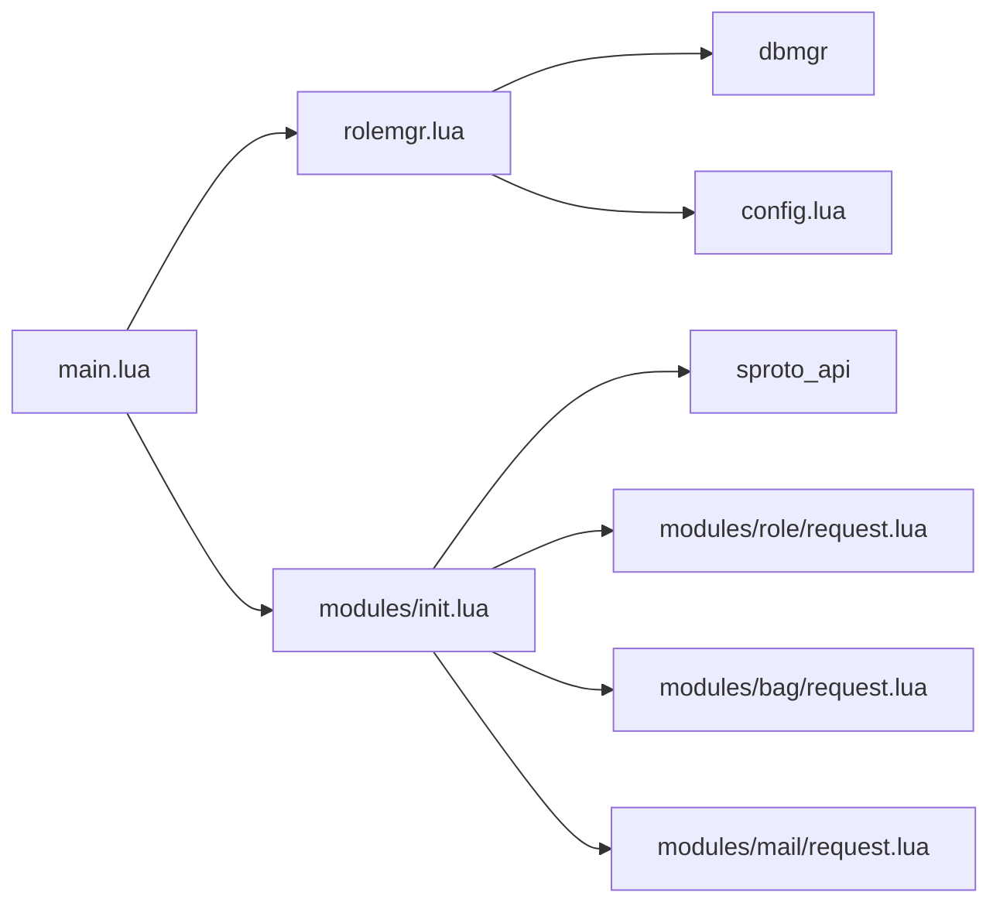

# 角色模块系统

<cite>
**本文引用的文件**
- [app/role/roleagent/main.lua](file://app/role/roleagent/main.lua)
- [app/role/roleagent/modules/init.lua](file://app/role/roleagent/modules/init.lua)
- [tools/gen_roleagent_modules.lua](file://tools/gen_roleagent_modules.lua)
- [app/role/roleagent/rolemgr.lua](file://app/role/roleagent/rolemgr.lua)
- [app/role/roleagent/modules/role/init.lua](file://app/role/roleagent/modules/role/init.lua)
- [app/role/roleagent/modules/role/request.lua](file://app/role/roleagent/modules/role/request.lua)
- [app/role/roleagent/modules/bag/init.lua](file://app/role/roleagent/modules/bag/init.lua)
- [app/role/roleagent/modules/bag/request.lua](file://app/role/roleagent/modules/bag/request.lua)
- [app/role/roleagent/modules/mail/init.lua](file://app/role/roleagent/modules/mail/init.lua)
- [app/role/roleagent/modules/mail/request.lua](file://app/role/roleagent/modules/mail/request.lua)
- [lualib/config.lua](file://lualib/config.lua)
- [etc/role1.conf.lua](file://etc/role1.conf.lua)
- [schema/role.sproto](file://schema/role.sproto)
- [schema/bag.sproto](file://schema/bag.sproto)
- [lualib/skyext.lua](file://lualib/skyext.lua)
</cite>

## 目录
1. [简介](#简介)
2. [项目结构](#项目结构)
3. [核心组件](#核心组件)
4. [架构总览](#架构总览)
5. [详细组件分析](#详细组件分析)
6. [依赖关系分析](#依赖关系分析)
7. [性能考虑](#性能考虑)
8. [故障排查指南](#故障排查指南)
9. [结论](#结论)
10. [附录](#附录)

## 简介
本文件面向“角色模块系统”，系统性说明角色模块的注册机制与加载顺序，详解角色属性管理、背包系统、邮件系统的实现原理，阐述模块间通信接口与数据共享机制，提供扩展点与自定义模块开发指南，并覆盖配置管理、版本控制与依赖关系管理。同时给出最佳实践、性能优化建议、调用示例与错误处理模式，帮助开发者快速理解与扩展该系统。

## 项目结构
角色模块系统位于 app/role/roleagent 下，采用“服务 + 模块”的分层组织：
- roleagent 主服务负责角色生命周期、连接绑定、分布式锁与会话转发。
- modules 子目录按功能划分模块（role、bag、mail），每个模块包含 init.lua（对象构造）与 request.lua（请求处理）。
- rolemgr.lua 管理角色对象的加载、卸载与持久化。
- tools/gen_roleagent_modules.lua 自动生成模块注册与加载代码，保证新增模块无需手动维护注册表。
- schema/*.sproto 定义角色及模块的数据结构，支撑序列化与版本演进。
- lualib/config.lua 提供统一配置读取与注入。

图表来源
- [app/role/roleagent/main.lua:1-117](file://app/role/roleagent/main.lua#L1-L117)
- [app/role/roleagent/modules/init.lua:1-36](file://app/role/roleagent/modules/init.lua#L1-L36)
- [tools/gen_roleagent_modules.lua:1-130](file://tools/gen_roleagent_modules.lua#L1-L130)
- [app/role/roleagent/rolemgr.lua:1-59](file://app/role/roleagent/rolemgr.lua#L1-L59)

章节来源
- [app/role/roleagent/main.lua:1-117](file://app/role/roleagent/main.lua#L1-L117)
- [app/role/roleagent/modules/init.lua:1-36](file://app/role/roleagent/modules/init.lua#L1-L36)
- [tools/gen_roleagent_modules.lua:1-130](file://tools/gen_roleagent_modules.lua#L1-L130)
- [app/role/roleagent/rolemgr.lua:1-59](file://app/role/roleagent/rolemgr.lua#L1-L59)

## 核心组件
- 角色管理器（rolemgr）：负责从数据库加载角色数据、创建角色对象、初始化模块、卸载时保存与清理。
- 模块注册与加载（modules/init）：通过代码生成器扫描模块目录，自动注册请求处理器并在角色加载时实例化各模块对象。
- 角色属性管理（modules/role）：维护角色在线状态、fd绑定、离线超时卸载等。
- 背包系统（modules/bag）：以资源分类与资源项为基本单位，支持多背包槽位与资源计数。
- 邮件系统（modules/mail）：预留模块骨架，便于后续扩展邮件收发与附件能力。
- 配置管理（config）：统一读取环境变量与应用配置文件，提供类型化访问接口。
- 数据结构（schema）：使用 sproto 定义角色与模块数据模型，支持版本字段与向后兼容。

章节来源
- [app/role/roleagent/rolemgr.lua:1-59](file://app/role/roleagent/rolemgr.lua#L1-L59)
- [app/role/roleagent/modules/init.lua:1-36](file://app/role/roleagent/modules/init.lua#L1-L36)
- [app/role/roleagent/modules/role/init.lua:1-41](file://app/role/roleagent/modules/role/init.lua#L1-L41)
- [app/role/roleagent/modules/bag/init.lua:1-27](file://app/role/roleagent/modules/bag/init.lua#L1-L27)
- [app/role/roleagent/modules/mail/init.lua:1-17](file://app/role/roleagent/modules/mail/init.lua#L1-L17)
- [lualib/config.lua:1-145](file://lualib/config.lua#L1-L145)
- [schema/role.sproto:1-24](file://schema/role.sproto#L1-L24)
- [schema/bag.sproto:1-16](file://schema/bag.sproto#L1-L16)

## 架构总览
角色服务启动后，完成日志与全局配置初始化，随后执行模块注册与命令分发；客户端连接后，角色管理器根据角色ID计算归属节点，加锁避免并发冲突，加载角色并绑定 fd，将会话转发至 watchdog 进行路由。模块通过 sproto_api 暴露的请求处理器响应客户端消息。

图表来源
- [app/role/roleagent/main.lua:36-80](file://app/role/roleagent/main.lua#L36-L80)
- [app/role/roleagent/rolemgr.lua:15-25](file://app/role/roleagent/rolemgr.lua#L15-L25)
- [app/role/roleagent/modules/init.lua:18-34](file://app/role/roleagent/modules/init.lua#L18-L34)

## 详细组件分析

### 模块注册机制与加载顺序
- 代码生成器扫描 modules 目录下所有包含 request.lua 的子目录，生成 require 语句与 register_module 调用，确保新增模块零侵入式接入。
- 运行时由 modules.init 调用 sproto_api.register_module 将各模块的请求处理器注册到协议层。
- 角色加载时，modules.load 会先初始化 role_data.modules 容器，再依次实例化非 role 模块（如 bag、mail），role 模块由角色管理器直接创建。

图表来源
- [tools/gen_roleagent_modules.lua:5-20](file://tools/gen_roleagent_modules.lua#L5-L20)
- [tools/gen_roleagent_modules.lua:64-81](file://tools/gen_roleagent_modules.lua#L64-L81)
- [tools/gen_roleagent_modules.lua:97-121](file://tools/gen_roleagent_modules.lua#L97-L121)
- [app/role/roleagent/modules/init.lua:12-34](file://app/role/roleagent/modules/init.lua#L12-L34)

章节来源
- [tools/gen_roleagent_modules.lua:1-130](file://tools/gen_roleagent_modules.lua#L1-L130)
- [app/role/roleagent/modules/init.lua:1-36](file://app/role/roleagent/modules/init.lua#L1-L36)

### 角色属性管理（modules/role）
- 角色对象维护 rid、data、fd 以及离线卸载定时器。
- bind_fd 用于绑定客户端 fd 并取消可能的离线卸载定时器。
- unbind_fd 设置 fd 为空并启动定时器，在超时且仍无 fd 时触发卸载流程，释放内存与持久化。

图表来源
- [app/role/roleagent/modules/role/init.lua:9-38](file://app/role/roleagent/modules/role/init.lua#L9-L38)

章节来源
- [app/role/roleagent/modules/role/init.lua:1-41](file://app/role/roleagent/modules/role/init.lua#L1-L41)

### 背包系统（modules/bag）
- 数据结构基于 sproto 的 role_bag，包含多个 bag 槽位，每个槽位对应 res_type，内部维护资源列表 resource（res_id, res_size）。
- 初始化时预置默认背包槽位与资源，便于测试与演示。
- 可通过 request.lua 扩展增删改查接口，结合 sproto 协议进行序列化传输。

图表来源
- [schema/bag.sproto:1-16](file://schema/bag.sproto#L1-L16)
- [app/role/roleagent/modules/bag/init.lua:6-23](file://app/role/roleagent/modules/bag/init.lua#L6-L23)

章节来源
- [app/role/roleagent/modules/bag/init.lua:1-27](file://app/role/roleagent/modules/bag/init.lua#L1-L27)
- [schema/bag.sproto:1-16](file://schema/bag.sproto#L1-L16)

### 邮件系统（modules/mail）
- 当前提供模块骨架与日志记录，便于后续扩展邮件收发、附件与过期策略。
- 可参照 bag 模块的模式，在 request.lua 中实现具体业务接口。

章节来源
- [app/role/roleagent/modules/mail/init.lua:1-17](file://app/role/roleagent/modules/mail/init.lua#L1-L17)
- [app/role/roleagent/modules/mail/request.lua:1-4](file://app/role/roleagent/modules/mail/request.lua#L1-L4)

### 模块间通信接口与数据共享
- 模块通过 sproto_api.register_module 暴露请求处理器，客户端消息经协议层路由到对应模块的 request 方法。
- 数据共享通过角色对象 role_obj 与 role_data 传递，模块持有 role_obj 引用，可访问同一份角色数据，保证一致性。
- 角色管理器在加载阶段统一初始化模块，确保模块可见性与生命周期一致。

图表来源
- [app/role/roleagent/modules/init.lua:12-16](file://app/role/roleagent/modules/init.lua#L12-L16)
- [app/role/roleagent/modules/role/request.lua:7-29](file://app/role/roleagent/modules/role/request.lua#L7-L29)

章节来源
- [app/role/roleagent/modules/init.lua:1-36](file://app/role/roleagent/modules/init.lua#L1-L36)
- [app/role/roleagent/modules/role/request.lua:1-32](file://app/role/roleagent/modules/role/request.lua#L1-L32)

### 模块扩展点与自定义模块开发指南
- 扩展点：在 modules 下新建目录，包含 init.lua（模块对象构造）与 request.lua（请求处理器）。
- 代码生成器会自动发现新模块并生成注册与加载代码，无需手动修改 modules/init.lua。
- 建议在 init.lua 中初始化模块数据，在 request.lua 中实现对外接口；如需持久化，遵循角色数据模型约定。

章节来源
- [tools/gen_roleagent_modules.lua:5-20](file://tools/gen_roleagent_modules.lua#L5-L20)
- [tools/gen_roleagent_modules.lua:64-81](file://tools/gen_roleagent_modules.lua#L64-L81)
- [tools/gen_roleagent_modules.lua:97-121](file://tools/gen_roleagent_modules.lua#L97-L121)

### 模块配置管理、版本控制与依赖关系管理
- 配置管理：通过 config.get/get_number/get_boolean/get_table 读取环境变量与应用配置；应用配置路径由 etc/role1.conf.lua 指定。
- 版本控制：schema 中使用 _version 字段标识数据结构版本；注释提示不允许删除字段、修改类型或字段名，保障向后兼容。
- 依赖关系：模块依赖角色对象与配置，角色管理器依赖数据库与模块；通过代码生成器解耦模块注册与实现。

章节来源
- [lualib/config.lua:6-72](file://lualib/config.lua#L6-L72)
- [lualib/config.lua:88-142](file://lualib/config.lua#L88-L142)
- [etc/role1.conf.lua:1-4](file://etc/role1.conf.lua#L1-L4)
- [schema/role.sproto:1-24](file://schema/role.sproto#L1-L24)

### 模块调用示例与错误处理模式
- 调用示例：客户端通过 sproto 协议调用模块请求处理器（如 role.login_info），处理器更新角色数据并返回信息。
- 错误处理模式：
  - 分布式锁失败：若锁定失败且未获取锁值，返回锁定失败；若锁定在其他节点，通知对方卸载角色并重试。
  - 角色不在本节点：计算归属节点不匹配时返回错误码与目标节点。
  - 重复绑定：若角色已绑定 fd，则踢出旧连接并重新绑定。
  - 离线卸载：角色断开后启动定时器，超时且无 fd 则卸载角色。

图表来源
- [app/role/roleagent/main.lua:36-80](file://app/role/roleagent/main.lua#L36-L80)

章节来源
- [app/role/roleagent/main.lua:25-80](file://app/role/roleagent/main.lua#L25-L80)
- [app/role/roleagent/modules/role/init.lua:21-38](file://app/role/roleagent/modules/role/init.lua#L21-L38)

## 依赖关系分析
- 角色服务依赖：skynet、cmd_api、client、modules、rolemgr、global、distributed_lock、rolenode_api、errcode、roleagent_api、cluster_discovery、log。
- 模块依赖：timer、config、log、sproto_api、dbmgr。
- 配置依赖：skynet.getenv、应用配置文件路径。
- 数据结构依赖：sproto schema 定义角色与模块数据。

图表来源
- [app/role/roleagent/main.lua:1-16](file://app/role/roleagent/main.lua#L1-L16)
- [app/role/roleagent/modules/init.lua:4-16](file://app/role/roleagent/modules/init.lua#L4-L16)
- [app/role/roleagent/rolemgr.lua:1-7](file://app/role/roleagent/rolemgr.lua#L1-L7)

章节来源
- [app/role/roleagent/main.lua:1-16](file://app/role/roleagent/main.lua#L1-L16)
- [app/role/roleagent/modules/init.lua:4-16](file://app/role/roleagent/modules/init.lua#L4-L16)
- [app/role/roleagent/rolemgr.lua:1-7](file://app/role/roleagent/rolemgr.lua#L1-L7)

## 性能考虑
- 延迟加载：角色管理器注释指出未来支持 lazy_load 数据，减少初始加载开销，适用于低频访问模块。
- 定时器卸载：离线超时卸载避免长期占用内存，提高资源利用率。
- 配置缓存：config 模块对读取的配置进行缓存，减少重复解析与 IO。
- 序列化效率：使用 sproto 进行高效序列化，降低网络与存储开销。
- 分布式锁：使用分布式锁避免并发冲突，必要时重试与回退，提升稳定性。

[本节为通用指导，不直接分析具体文件]

## 故障排查指南
- 锁定失败：检查分布式锁服务可用性；确认 lock_expired_cb 是否正确触发卸载逻辑。
- 角色跨节点：核对 rolenode 计算逻辑与服务部署；确认 cluster.call 是否可达。
- 重复绑定：检查 client.unbind_kick 与 watchdog 转发是否正常；确认 fd 生命周期管理。
- 模块未生效：确认 modules/init.lua 是否被正确生成；检查 sproto_api.register_module 是否调用。
- 配置异常：验证 app_config_path 与环境变量；检查 config.init 是否成功执行。

章节来源
- [app/role/roleagent/main.lua:25-80](file://app/role/roleagent/main.lua#L25-L80)
- [lualib/skyext.lua:61-80](file://lualib/skyext.lua#L61-L80)
- [lualib/config.lua:120-142](file://lualib/config.lua#L120-L142)

## 结论
角色模块系统通过代码生成器实现了模块的自动化注册与加载，结合角色管理器与分布式锁保障了高可用与一致性。角色属性、背包与邮件模块提供了清晰的扩展点与数据模型，配合配置管理与 sproto 版本控制，具备良好的可维护性与演进能力。建议在生产环境中启用延迟加载与监控告警，持续优化性能与稳定性。

[本节为总结性内容，不直接分析具体文件]

## 附录
- 模块开发最佳实践
  - 保持模块职责单一，仅关注自身领域逻辑。
  - 通过 request.lua 暴露最小必要接口，避免耦合。
  - 使用 sproto 定义数据结构，遵循版本兼容原则。
  - 合理设计离线卸载与定时器，避免资源泄漏。
- 性能优化建议
  - 对高频操作进行批处理与缓存。
  - 使用惰性加载减少初始开销。
  - 监控与日志完善，便于定位瓶颈。
- 版本控制与依赖管理
  - 在 schema 中维护 _version，禁止破坏性变更。
  - 通过代码生成器管理模块依赖，减少手工维护成本。
  - 使用配置中心统一管理环境差异。

[本节为通用指导，不直接分析具体文件]