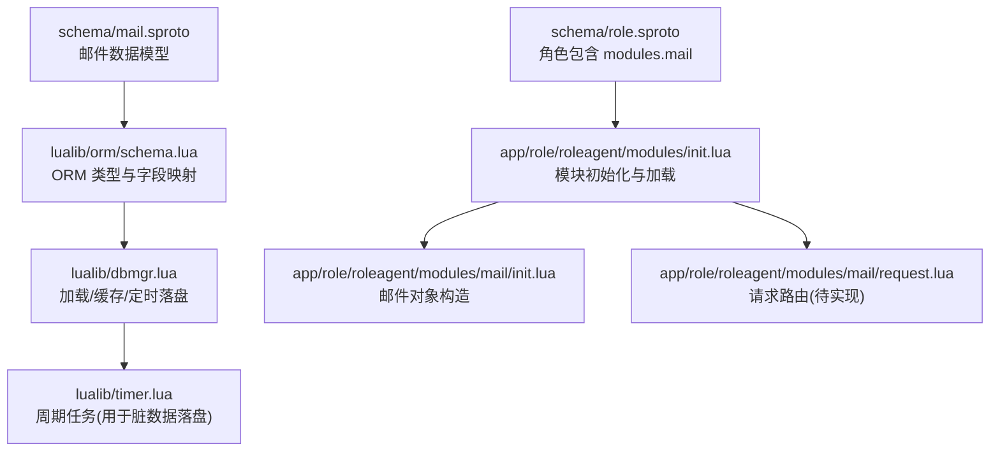
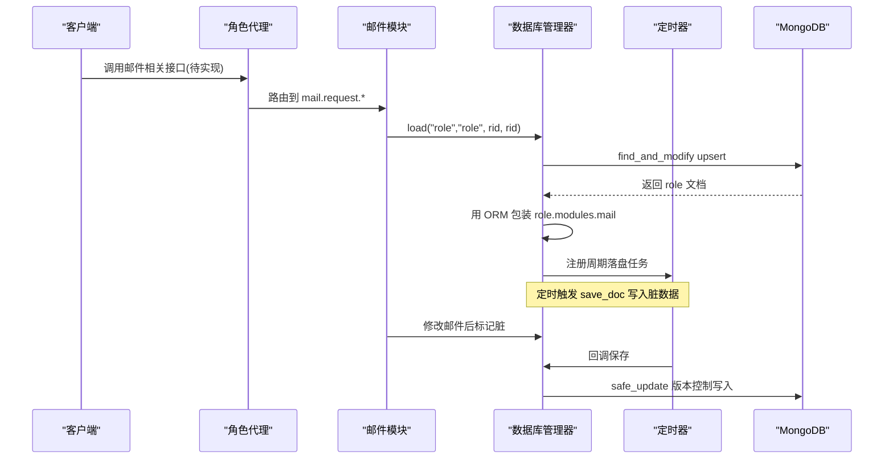
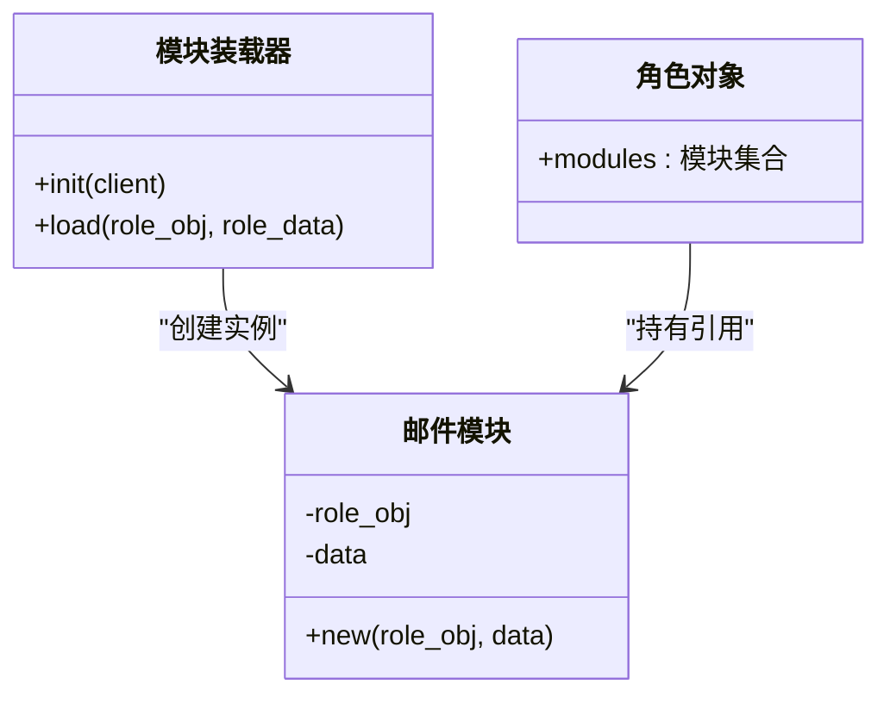
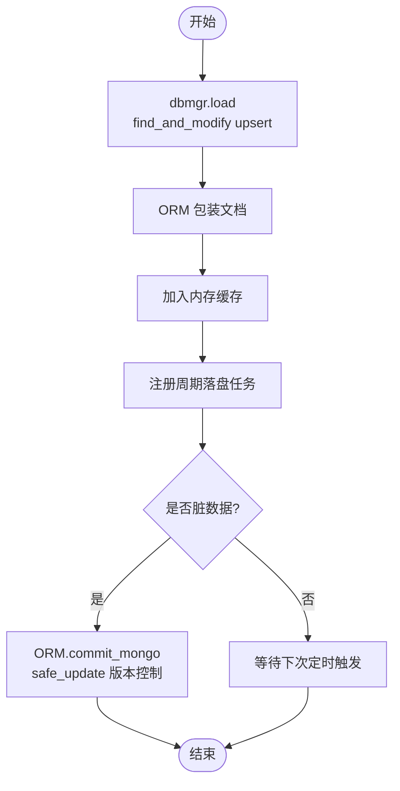
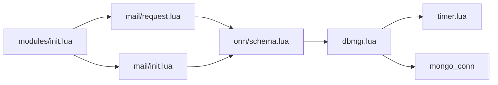

# 邮件系统模块

<cite>
**本文引用的文件**
- [schema/mail.sproto](file://schema/mail.sproto)
- [app/role/roleagent/modules/init.lua](file://app/role/roleagent/modules/init.lua)
- [app/role/roleagent/modules/mail/init.lua](file://app/role/roleagent/modules/mail/init.lua)
- [app/role/roleagent/modules/mail/request.lua](file://app/role/roleagent/modules/mail/request.lua)
- [lualib/orm/schema.lua](file://lualib/orm/schema.lua)
- [lualib/orm/schema_define.lua](file://lualib/orm/schema_define.lua)
- [lualib/dbmgr.lua](file://lualib/dbmgr.lua)
- [lualib/timer.lua](file://lualib/timer.lua)
- [schema/role.sproto](file://schema/role.sproto)
</cite>

## 目录
1. [简介](#简介)
2. [项目结构](#项目结构)
3. [核心组件](#核心组件)
4. [架构总览](#架构总览)
5. [详细组件分析](#详细组件分析)
6. [依赖关系分析](#依赖关系分析)
7. [性能考量](#性能考量)
8. [故障排查指南](#故障排查指南)
9. [结论](#结论)
10. [附录：API参考与示例](#附录api参考与示例)

## 简介
本模块为游戏角色系统中的“邮件”子系统，负责玩家邮件的数据模型、持久化、以及后续可扩展的发送、接收、读取、删除、附件处理、过期清理与通知等能力。当前仓库已提供数据模型定义、ORM 映射、角色模块加载机制与数据库缓存/落盘基础设施，但邮件的具体业务接口（request）尚未实现。本文基于现有代码进行系统化梳理，并给出扩展建议与调用路径说明。

## 项目结构
邮件相关代码主要分布在以下位置：
- 数据模型定义：schema/mail.sproto
- 角色模块装配：app/role/roleagent/modules/init.lua
- 邮件模块骨架：app/role/roleagent/modules/mail/init.lua
- 邮件请求路由占位：app/role/roleagent/modules/mail/request.lua
- ORM 类型生成与字段映射：lualib/orm/schema.lua、lualib/orm/schema_define.lua
- 数据加载与定时落盘：lualib/dbmgr.lua
- 定时器基础设施：lualib/timer.lua
- 角色数据结构中嵌入邮件模块：schema/role.sproto

图表来源
- [schema/mail.sproto:1-36](file://schema/mail.sproto#L1-L36)
- [lualib/orm/schema.lua:250-417](file://lualib/orm/schema.lua#L250-L417)
- [lualib/dbmgr.lua:94-148](file://lualib/dbmgr.lua#L94-L148)
- [schema/role.sproto:1-24](file://schema/role.sproto#L1-L24)
- [app/role/roleagent/modules/init.lua:1-35](file://app/role/roleagent/modules/init.lua#L1-L35)
- [app/role/roleagent/modules/mail/init.lua:1-16](file://app/role/roleagent/modules/mail/init.lua#L1-L16)
- [app/role/roleagent/modules/mail/request.lua:1-4](file://app/role/roleagent/modules/mail/request.lua#L1-L4)
- [lualib/timer.lua:136-140](file://lualib/timer.lua#L136-L140)

章节来源
- [schema/mail.sproto:1-36](file://schema/mail.sproto#L1-L36)
- [schema/role.sproto:1-24](file://schema/role.sproto#L1-L24)
- [app/role/roleagent/modules/init.lua:1-35](file://app/role/roleagent/modules/init.lua#L1-L35)
- [app/role/roleagent/modules/mail/init.lua:1-16](file://app/role/roleagent/modules/mail/init.lua#L1-L16)
- [app/role/roleagent/modules/mail/request.lua:1-4](file://app/role/roleagent/modules/mail/request.lua#L1-L4)
- [lualib/orm/schema.lua:250-417](file://lualib/orm/schema.lua#L250-L417)
- [lualib/dbmgr.lua:94-148](file://lualib/dbmgr.lua#L94-L148)
- [lualib/timer.lua:136-140](file://lualib/timer.lua#L136-L140)

## 核心组件
- 数据模型层
  - role_mail：按角色维度存储邮件集合，使用 map<integer, mail> 索引，键为 mail_id。
  - mail：单封邮件，包含标题、内容、发送时间、发送者、附件等。
  - mail_attach：附件资源描述（类型、ID、数量）。
  - mail_role：发送者信息（rid、name）。
- ORM 映射层
  - 由 schema 自动生成类型与校验逻辑，支持字段级变更追踪与提交。
- 模块装配层
  - 在角色对象加载时，将 modules.mail 实例化并挂载到角色对象上。
- 数据存取层
  - dbmgr 负责从 MongoDB 加载/卸载文档，维护内存缓存，并通过定时器周期性将脏数据落盘。
- 定时器层
  - timer 提供周期任务能力，dbmgr 利用其实现随机延迟的批量落盘，降低写放大与热点。

章节来源
- [schema/mail.sproto:1-36](file://schema/mail.sproto#L1-L36)
- [lualib/orm/schema.lua:250-417](file://lualib/orm/schema.lua#L250-L417)
- [lualib/orm/schema_define.lua:1-68](file://lualib/orm/schema_define.lua#L1-L68)
- [app/role/roleagent/modules/init.lua:1-35](file://app/role/roleagent/modules/init.lua#L1-L35)
- [lualib/dbmgr.lua:94-148](file://lualib/dbmgr.lua#L94-L148)
- [lualib/timer.lua:136-140](file://lualib/timer.lua#L136-L140)

## 架构总览
邮件系统采用“模型-ORM-模块-存储”的分层架构：
- 模型层：以 sproto 定义稳定契约，便于前后端与多服务共享。
- ORM 层：自动生成的类型与校验，提供 dirty tracking 与 commit。
- 模块层：角色 agent 内按模块组织，mail 模块负责业务编排。
- 存储层：MongoDB 通过 dbmgr 管理文档生命周期，结合定时器做异步落盘。

图表来源
- [app/role/roleagent/modules/init.lua:12-16](file://app/role/roleagent/modules/init.lua#L12-L16)
- [app/role/roleagent/modules/mail/request.lua:1-4](file://app/role/roleagent/modules/mail/request.lua#L1-L4)
- [lualib/dbmgr.lua:94-148](file://lualib/dbmgr.lua#L94-L148)
- [lualib/dbmgr.lua:67-92](file://lualib/dbmgr.lua#L67-L92)
- [lualib/timer.lua:136-140](file://lualib/timer.lua#L136-L140)

## 详细组件分析

### 数据模型与消息结构
- role_mail
  - _version：乐观锁版本号
  - mails：map<integer, mail>，以 mail_id 为键
- mail
  - mail_id：唯一标识
  - cfg_id：邮件配置项 ID（用于模板/文案/规则）
  - title/detail：多语言或结构化文本（key-value 列表）
  - send_time：发送时间戳
  - send_role：发送者信息（rid、name）
  - attach：附件资源（res_type、res_id、res_size）
- mail_attach
  - res_type：资源分类
  - res_id：资源 ID
  - res_size：数量
- mail_role
  - rid：角色 ID
  - name：角色名

这些字段在 ORM 层被转换为可序列化的结构，并提供字段级变更追踪。

章节来源
- [schema/mail.sproto:1-36](file://schema/mail.sproto#L1-L36)
- [lualib/orm/schema.lua:250-417](file://lualib/orm/schema.lua#L250-L417)
- [lualib/orm/schema_define.lua:1-68](file://lualib/orm/schema_define.lua#L1-L68)

### 角色模块加载与邮件对象
- 角色模块初始化时，会注册各模块的请求处理器（包括 mail），并在角色数据加载时创建 modules.mail 实例。
- 邮件模块目前仅实现了对象构造与日志记录，具体业务方法待补充。

图表来源
- [app/role/roleagent/modules/init.lua:12-34](file://app/role/roleagent/modules/init.lua#L12-L34)
- [app/role/roleagent/modules/mail/init.lua:6-14](file://app/role/roleagent/modules/mail/init.lua#L6-L14)

章节来源
- [app/role/roleagent/modules/init.lua:1-35](file://app/role/roleagent/modules/init.lua#L1-L35)
- [app/role/roleagent/modules/mail/init.lua:1-16](file://app/role/roleagent/modules/mail/init.lua#L1-L16)

### 数据存取与持久化流程
- 加载：dbmgr.load 通过 find_and_modify upsert 获取或创建文档，并用 ORM 包装返回。
- 缓存：内存中维护 doc 与定时器对象，避免重复加载。
- 落盘：timer.repeat_random_delayed 定期触发 save_doc，内部使用 ORM.commit_mongo 收集脏字段，并以版本控制安全更新。
- 卸载：取消定时器，强制落盘一次后清理缓存。

图表来源
- [lualib/dbmgr.lua:94-148](file://lualib/dbmgr.lua#L94-L148)
- [lualib/dbmgr.lua:67-92](file://lualib/dbmgr.lua#L67-L92)
- [lualib/timer.lua:136-140](file://lualib/timer.lua#L136-L140)

章节来源
- [lualib/dbmgr.lua:94-148](file://lualib/dbmgr.lua#L94-L148)
- [lualib/dbmgr.lua:67-92](file://lualib/dbmgr.lua#L67-L92)
- [lualib/timer.lua:136-140](file://lualib/timer.lua#L136-L140)

### 邮件操作（发送、接收、读取、删除）现状与建议
- 现状
  - request.lua 为空占位，未暴露任何 API。
  - 邮件模块 init.lua 仅提供构造，无业务方法。
- 建议实现路径
  - 在 mail.request 中注册如下接口（命名仅为示例）：
    - send_mail：创建 mail 并追加到 role.modules.mail.mails
    - read_mail：根据 mail_id 读取邮件详情
    - delete_mail：移除指定 mail_id
    - list_mails：分页或排序返回邮件列表
  - 所有写操作需确保 ORM 标记脏字段，由 dbmgr 定时器统一落盘。
  - 读操作可直接从内存中的 ORM 对象读取，减少 IO。

章节来源
- [app/role/roleagent/modules/mail/request.lua:1-4](file://app/role/roleagent/modules/mail/request.lua#L1-L4)
- [app/role/roleagent/modules/mail/init.lua:1-16](file://app/role/roleagent/modules/mail/init.lua#L1-L16)
- [lualib/dbmgr.lua:67-92](file://lualib/dbmgr.lua#L67-L92)

### 附件处理与存储机制
- 当前模型中附件为轻量资源描述（类型、ID、数量），不包含二进制内容。
- 建议策略
  - 小附件：直接以 base64 或 URL 形式随邮件下发，客户端自行下载。
  - 大附件：独立对象存储（如 OSS），邮件中仅存引用地址与元数据。
  - 发放逻辑：读取附件时校验权限与有效期，发放至背包或账户资产。
- 与 ORM 集成：attach 字段作为子结构参与脏检查与提交，无需额外处理。

章节来源
- [schema/mail.sproto:29-34](file://schema/mail.sproto#L29-L34)
- [lualib/orm/schema.lua:273-290](file://lualib/orm/schema.lua#L273-L290)

### 邮件过期策略与自动清理
- 现状：模型未包含过期时间字段；dbmgr 未实现过期清理。
- 建议方案
  - 在 mail 中增加 expire_time 字段。
  - 新增后台任务（可利用 timer）扫描过期邮件，执行软删除或归档。
  - 对高频场景可采用惰性清理：读取时过滤过期项，并异步回收。

[本节为概念性设计，不直接分析具体文件]

### 通知系统与状态同步
- 现状：未发现邮件通知或事件广播的实现。
- 建议方案
  - 在 write 成功后，向客户端推送增量事件（如新增、删除、已读）。
  - 可使用现有的事件通道或自定义消息总线，保证客户端与服务器状态一致。
  - 对于离线用户，可在登录时拉取增量差异。

[本节为概念性设计，不直接分析具体文件]

## 依赖关系分析
- 模块装配依赖 sproto_api 注册模块路由。
- 邮件模块依赖 ORM 类型与 dbmgr 提供的文档访问能力。
- dbmgr 依赖 mongo_conn、timer、config 等基础设施。
- 整体耦合度低，职责清晰，易于扩展。

图表来源
- [app/role/roleagent/modules/init.lua:12-16](file://app/role/roleagent/modules/init.lua#L12-L16)
- [app/role/roleagent/modules/mail/request.lua:1-4](file://app/role/roleagent/modules/mail/request.lua#L1-L4)
- [app/role/roleagent/modules/mail/init.lua:1-16](file://app/role/roleagent/modules/mail/init.lua#L1-L16)
- [lualib/orm/schema.lua:250-417](file://lualib/orm/schema.lua#L250-L417)
- [lualib/dbmgr.lua:94-148](file://lualib/dbmgr.lua#L94-L148)
- [lualib/timer.lua:136-140](file://lualib/timer.lua#L136-L140)

章节来源
- [app/role/roleagent/modules/init.lua:1-35](file://app/role/roleagent/modules/init.lua#L1-L35)
- [lualib/dbmgr.lua:94-148](file://lualib/dbmgr.lua#L94-L148)

## 性能考量
- 写放大控制：dbmgr 使用定时器批量落盘，降低频繁写入开销。
- 并发安全：通过 _version 乐观锁防止覆盖写。
- 内存占用：邮件列表以 map 索引，查询 O(1)，适合大量邮件场景。
- 网络传输：title/detail 使用 key-value 结构，可按客户端语言动态下发，减少冗余。

[本节为通用性能讨论，不直接分析具体文件]

## 故障排查指南
- 加载失败：检查 dbmgr.load 返回值与错误日志，确认 collection 配置正确。
- 落盘失败：查看 save_dirty 日志，核对 _version 冲突与更新结果。
- 定时器异常：确认 timer 任务是否被取消或过载，必要时调整间隔。
- 模块未生效：确认 modules/init.lua 是否正确注册 mail 模块与路由。

章节来源
- [lualib/dbmgr.lua:53-92](file://lualib/dbmgr.lua#L53-L92)
- [lualib/dbmgr.lua:150-198](file://lualib/dbmgr.lua#L150-L198)
- [lualib/timer.lua:170-208](file://lualib/timer.lua#L170-L208)

## 结论
当前仓库已具备邮件系统的完整数据模型、ORM 映射、角色模块装配与数据库缓存/落盘基础设施。邮件的业务接口（发送、读取、删除等）尚未实现，建议在 mail/request.lua 中补齐，并复用现有 ORM 与 dbmgr 能力。对于附件、过期清理与通知等高级特性，可按本文建议逐步扩展。

[本节为总结性内容，不直接分析具体文件]

## 附录：API参考与示例
- 当前状态
  - 邮件模块请求路由文件存在但未实现任何接口。
- 建议接口清单（示例）
  - send_mail：参数包含 cfg_id、title、detail、send_role、attach；返回 mail_id
  - read_mail：参数 mail_id；返回邮件详情
  - delete_mail：参数 mail_id；返回成功标志
  - list_mails：参数分页/排序；返回邮件列表
- 调用示例（伪代码）
  - 发送：调用 send_mail -> 修改 role.modules.mail.mails -> ORM 标记脏 -> 定时器落盘
  - 读取：根据 mail_id 从内存中读取 -> 返回给客户端
  - 删除：移除对应条目 -> ORM 标记脏 -> 定时器落盘

章节来源
- [app/role/roleagent/modules/mail/request.lua:1-4](file://app/role/roleagent/modules/mail/request.lua#L1-L4)
- [lualib/dbmgr.lua:67-92](file://lualib/dbmgr.lua#L67-L92)