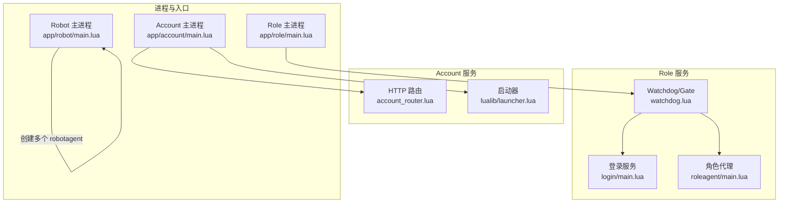
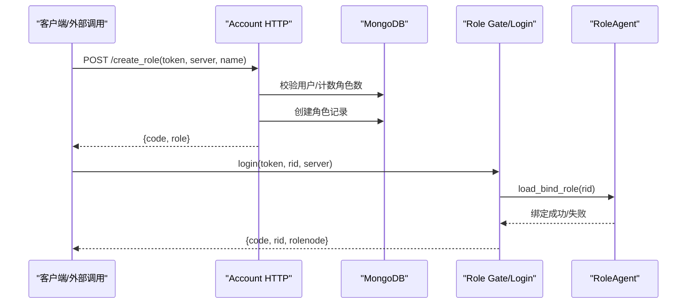
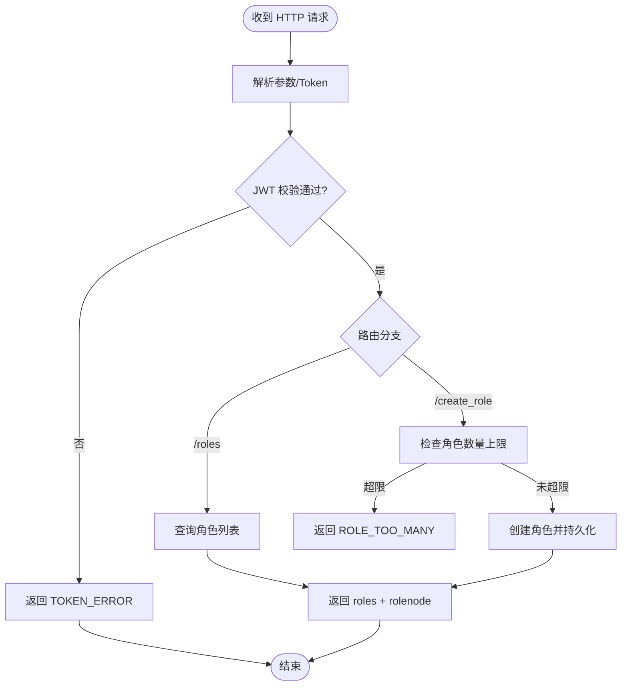
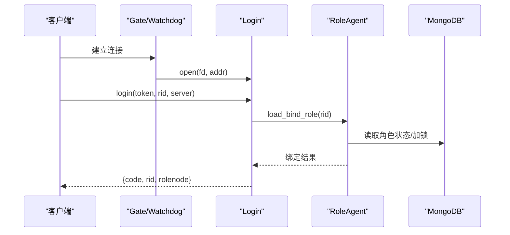
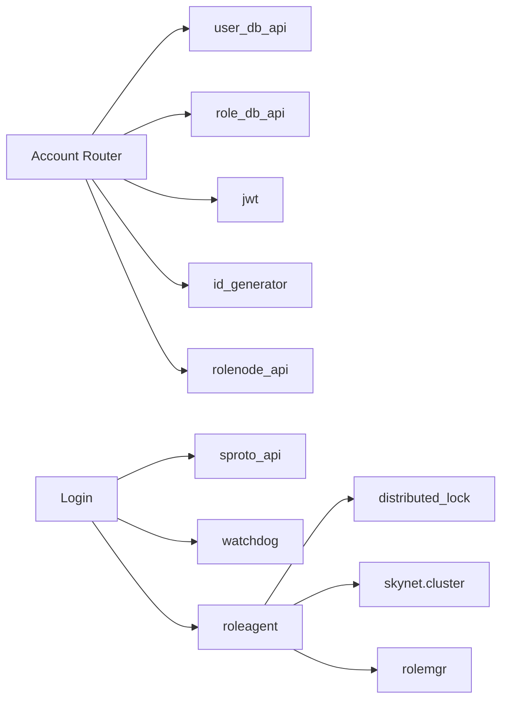

# 服务模块

<cite>
**本文引用的文件**
- [README.md](file://README.md)
- [app/account/main.lua](file://app/account/main.lua)
- [app/account/lualib/account_router.lua](file://app/account/lualib/account_router.lua)
- [app/role/main.lua](file://app/role/main.lua)
- [app/role/watchdog.lua](file://app/role/watchdog.lua)
- [app/role/login/main.lua](file://app/role/login/main.lua)
- [app/role/roleagent/main.lua](file://app/role/roleagent/main.lua)
- [app/robot/main.lua](file://app/robot/main.lua)
- [etc/core.conf.lua](file://etc/core.conf.lua)
- [etc/app/common.app.lua](file://etc/app/common.app.lua)
- [etc/app/account1.app.lua](file://etc/app/account1.app.lua)
- [etc/app/role1.app.lua](file://etc/app/role1.app.lua)
- [lualib/launcher.lua](file://lualib/launcher.lua)
- [proto/base.sproto](file://proto/base.sproto)
- [proto/login.sproto](file://proto/login.sproto)
</cite>

## 目录
1. [简介](#简介)
2. [项目结构](#项目结构)
3. [核心组件](#核心组件)
4. [架构总览](#架构总览)
5. [详细组件分析](#详细组件分析)
6. [依赖分析](#依赖分析)
7. [性能考虑](#性能考虑)
8. [故障处理与监控告警](#故障处理与监控告警)
9. [结论](#结论)
10. [附录：配置说明、API 接口与集成示例](#附录：配置说明api-接口与集成示例)

## 简介
本文件为 SkyExt 框架的服务模块文档，聚焦三大服务：Account（账号管理）、Role（角色管理与游戏逻辑）、Robot（压力测试机器人）。内容涵盖各服务的启动流程、核心业务逻辑、对外接口、配置说明、通信协议与数据格式、以及故障处理与监控告警方案。

## 项目结构
SkyExt 采用分层与模块化设计：
- app：应用入口与业务服务（account、role、robot）
- etc：节点与应用配置（core.conf 与各节点 .app.lua）
- lualib：通用库（配置、日志、ORM、HTTP、sproto、分布式锁等）
- proto/schema：协议与数据模式定义
- service：系统级服务（gm、hotfix、mongo_index、sproto_loader 等）

图表来源
- [app/account/main.lua:1-25](file://app/account/main.lua#L1-L25)
- [app/role/main.lua:1-25](file://app/role/main.lua#L1-L25)
- [app/robot/main.lua:1-23](file://app/robot/main.lua#L1-L23)
- [app/account/lualib/account_router.lua:1-143](file://app/account/lualib/account_router.lua#L1-L143)
- [app/role/watchdog.lua:1-82](file://app/role/watchdog.lua#L1-L82)
- [app/role/login/main.lua:1-37](file://app/role/login/main.lua#L1-L37)
- [app/role/roleagent/main.lua:1-117](file://app/role/roleagent/main.lua#L1-L117)
- [lualib/launcher.lua:1-20](file://lualib/launcher.lua#L1-L20)

章节来源
- [README.md:22-38](file://README.md#L22-L38)
- [etc/core.conf.lua:1-30](file://etc/core.conf.lua#L1-L30)

## 核心组件
- Account 服务：提供 HTTP 接口进行账号相关操作（如获取角色列表、创建角色），基于 JWT 鉴权，使用 MongoDB 持久化用户与角色信息，并通过 rolenode_api 计算角色所在的游戏节点。
- Role 服务：负责客户端连接接入（gate/watchdog）、登录流程（login）、角色生命周期管理（roleagent），通过 sproto 协议与客户端交互，使用分布式锁保证角色唯一性。
- Robot 服务：按配置启动多个 robotagent，模拟客户端对 Role 服务发起请求，用于压测。

章节来源
- [app/account/main.lua:1-25](file://app/account/main.lua#L1-L25)
- [app/account/lualib/account_router.lua:1-143](file://app/account/lualib/account_router.lua#L1-L143)
- [app/role/main.lua:1-25](file://app/role/main.lua#L1-L25)
- [app/role/watchdog.lua:1-82](file://app/role/watchdog.lua#L1-L82)
- [app/role/login/main.lua:1-37](file://app/role/login/main.lua#L1-L37)
- [app/role/roleagent/main.lua:1-117](file://app/role/roleagent/main.lua#L1-L117)
- [app/robot/main.lua:1-23](file://app/robot/main.lua#L1-L23)

## 架构总览
整体采用微服务拆分：Account 暴露 HTTP API；Role 暴露 TCP/WebSocket 网关并承载游戏逻辑；Robot 作为压测客户端。服务间通过 skynet cluster 与 etcd 发现机制协作，数据落盘至 MongoDB。

图表来源
- [app/account/lualib/account_router.lua:61-140](file://app/account/lualib/account_router.lua#L61-L140)
- [proto/login.sproto:9-22](file://proto/login.sproto#L9-L22)
- [app/role/roleagent/main.lua:36-81](file://app/role/roleagent/main.lua#L36-L81)

## 详细组件分析

### Account 服务（账号管理）
- 启动流程
  - 加载配置，启动 HTTP 服务器，注册 account_router 路由。
  - 通过 launcher 初始化 GM、热更、Mongo 索引等基础能力。
- 核心业务
  - GET /roles：校验 JWT，查询账号角色列表，附加角色所在 rolenode。
  - POST /create_role：校验 JWT，检查角色数量上限，创建角色并返回。
- 对外接口
  - HTTP JSON 接口，统一返回 code 与 data。
- 关键依赖
  - jwt 鉴权、user_db_api/role_db_api 数据访问、rolenode_api 计算角色节点、id_generator 生成角色 ID。

图表来源
- [app/account/lualib/account_router.lua:20-59](file://app/account/lualib/account_router.lua#L20-L59)
- [app/account/lualib/account_router.lua:61-140](file://app/account/lualib/account_router.lua#L61-L140)

章节来源
- [app/account/main.lua:1-25](file://app/account/main.lua#L1-L25)
- [app/account/lualib/account_router.lua:1-143](file://app/account/lualib/account_router.lua#L1-L143)
- [lualib/launcher.lua:1-20](file://lualib/launcher.lua#L1-L20)

### Role 服务（角色管理与游戏逻辑）
- 启动流程
  - 主进程启动 watchdog，监听 gate_port，转发新连接到 login 服务。
  - login 服务注册 sproto 模块，维护客户端上下文。
  - roleagent 负责角色加载、绑定、卸载与在线统计。
- 核心业务
  - 登录流程：校验 token、根据 rid 计算 rolenode、在目标 node 上加载并绑定角色。
  - 角色生命周期：load/unload、断线清理、离线超时卸载。
  - 分布式锁：确保同一角色在同一时刻仅被一个节点持有。
- 对外接口
  - 基于 sproto 的登录/登出消息，响应包含 code、rid、rolenode。

图表来源
- [app/role/watchdog.lua:12-22](file://app/role/watchdog.lua#L12-L22)
- [app/role/login/main.lua:15-36](file://app/role/login/main.lua#L15-L36)
- [app/role/roleagent/main.lua:36-81](file://app/role/roleagent/main.lua#L36-L81)
- [proto/login.sproto:9-22](file://proto/login.sproto#L9-L22)

章节来源
- [app/role/main.lua:1-25](file://app/role/main.lua#L1-L25)
- [app/role/watchdog.lua:1-82](file://app/role/watchdog.lua#L1-L82)
- [app/role/login/main.lua:1-37](file://app/role/login/main.lua#L1-L37)
- [app/role/roleagent/main.lua:1-117](file://app/role/roleagent/main.lua#L1-L117)

### Robot 服务（压力测试）
- 启动流程
  - 读取 robot_count，循环启动 robotagent，逐个调用 start(id, name)。
- 功能说明
  - 模拟多客户端并发登录/操作，验证 Role 服务吞吐与稳定性。
- 可观测性
  - 可通过日志观察每个 robot 启动与运行状态。

章节来源
- [app/robot/main.lua:1-23](file://app/robot/main.lua#L1-L23)

## 依赖分析
- 服务发现与集群
  - Role 节点通过 cluster_discovery 注册自身 agent，跨节点通过 skynet.cluster.call 通信。
- 数据层
  - MongoDB 中心库存储用户与全局信息，角色库存储角色数据；通过 dbmgr 管理连接池。
- 协议
  - base.sproto 定义包头；login.sproto 定义登录/登出消息。
- 配置
  - core.conf 定义搜索路径、线程、bootstrap 等；common.app 提供日志、etcd、mongo、sproto 等通用配置；各节点 .app.lua 覆盖端口、机器ID等。

图表来源
- [app/account/lualib/account_router.lua:1-143](file://app/account/lualib/account_router.lua#L1-L143)
- [app/role/login/main.lua:1-37](file://app/role/login/main.lua#L1-L37)
- [app/role/roleagent/main.lua:1-117](file://app/role/roleagent/main.lua#L1-L117)
- [proto/base.sproto:1-7](file://proto/base.sproto#L1-L7)
- [proto/login.sproto:1-26](file://proto/login.sproto#L1-L26)

章节来源
- [etc/app/common.app.lua:1-100](file://etc/app/common.app.lua#L1-L100)
- [etc/app/account1.app.lua:1-21](file://etc/app/account1.app.lua#L1-L21)
- [etc/app/role1.app.lua:1-30](file://etc/app/role1.app.lua#L1-L30)

## 性能考虑
- 连接与线程
  - Role 侧通过 maxclient 限制最大客户端数；Account 侧通过 agent_count 控制 HTTP 工作协程数。
- 数据库
  - MongoDB 连接池大小可调；建议为高频集合建立合适索引（已内置 user/role 索引）。
- 协议与序列化
  - 启用 sproto 协议校验，避免版本不一致导致的兼容问题。
- 分布式锁
  - 角色加载使用分布式锁，避免重复加载；注意锁超时与重试策略。
- 日志与监控
  - 合理设置日志等级与轮转策略，避免 IO 瓶颈；结合 GM 与日志聚合进行观测。

[本节为通用指导，不直接分析具体文件]

## 故障处理与监控告警
- 错误码与日志
  - Account 路由统一返回 code 字段，常见包括 OK、TOKEN_ERROR、SERVER_NOT_EXIST、ROLE_TOO_MANY、DB_ERROR 等；所有异常均记录日志以便排查。
- 分布式锁失效处理
  - RoleAgent 在锁竞争失败时尝试通知对方卸载角色，并二次尝试获取锁；若仍失败则返回 IN_OTHER_NODE。
- 连接异常
  - Watchdog 对 socket error/close/warning 进行处理，清理客户端上下文并断开转发。
- 监控与告警
  - 通过日志输出关键事件（启动、登录、错误、锁过期等），可对接集中式日志系统进行告警。
  - 可结合 GM 服务与 HTTP 接口收集在线人数、角色数量等指标。

章节来源
- [app/account/lualib/account_router.lua:24-59](file://app/account/lualib/account_router.lua#L24-L59)
- [app/account/lualib/account_router.lua:61-140](file://app/account/lualib/account_router.lua#L61-L140)
- [app/role/roleagent/main.lua:25-81](file://app/role/roleagent/main.lua#L25-L81)
- [app/role/watchdog.lua:24-56](file://app/role/watchdog.lua#L24-L56)

## 结论
SkyExt 的服务模块以 Account/Role/Robot 三端解耦为核心，配合 sproto 协议、etcd 服务发现与 MongoDB 持久化，形成可扩展、可观测、易运维的游戏服务器基座。Account 提供便捷 HTTP 接口，Role 承载高并发游戏逻辑，Robot 支撑持续压测。通过合理的配置与监控策略，可在生产环境稳定运行。

## 附录：配置说明、API 接口与集成示例

### 配置说明
- 节点配置
  - core.conf：定义 Lua 搜索路径、线程数、bootstrap 等。
  - 各节点 conf 指定 start 脚本与应用配置文件路径。
- 应用配置
  - common.app：日志、etcd、MongoDB、sproto、JWT 密钥、server2game 映射等。
  - account1.app：Account HTTP 端口、agent 数、GM 端口、雪花机器 ID。
  - role1.app：集群名、监听端口、最大客户端、登录超时、离线卸载时间、日志、雪花机器 ID。

章节来源
- [etc/core.conf.lua:1-30](file://etc/core.conf.lua#L1-L30)
- [etc/app/common.app.lua:1-100](file://etc/app/common.app.lua#L1-L100)
- [etc/app/account1.app.lua:1-21](file://etc/app/account1.app.lua#L1-L21)
- [etc/app/role1.app.lua:1-30](file://etc/app/role1.app.lua#L1-L30)

### API 接口文档（Account HTTP）
- GET /roles
  - 查询账号角色列表，支持按 server 过滤。
  - 请求参数：token（JWT）、server（可选）。
  - 响应：{ code, roles }，roles 中附带 rolenode。
- POST /create_role
  - 创建角色，需满足角色数量上限。
  - 请求体：token、server、name。
  - 响应：{ code, role }，role 中附带 rolenode。

章节来源
- [app/account/lualib/account_router.lua:20-59](file://app/account/lualib/account_router.lua#L20-L59)
- [app/account/lualib/account_router.lua:61-140](file://app/account/lualib/account_router.lua#L61-L140)

### 协议与数据格式（Role）
- 登录消息
  - 请求：token（JWT）、rid、proto_checksum、server。
  - 响应：code、rid、rolenode。
- 包头
  - base.sproto 定义 type、session、ud。

章节来源
- [proto/login.sproto:9-22](file://proto/login.sproto#L9-L22)
- [proto/base.sproto:1-7](file://proto/base.sproto#L1-L7)

### 集成示例
- 启动顺序
  - 启动 etcd、MongoDB。
  - 启动 Account 节点（account1.conf、account2.conf）。
  - 启动 Role 节点（role1.conf、role2.conf）。
  - 启动 Robot 进行压测（robot.conf）。
- 典型流程
  - 客户端先调用 Account HTTP 创建角色或获取角色列表。
  - 客户端通过 Role 网关发送登录消息，服务端返回 rolenode 后直连对应游戏节点。

章节来源
- [README.md:48-110](file://README.md#L48-L110)
- [app/account/main.lua:1-25](file://app/account/main.lua#L1-L25)
- [app/role/main.lua:1-25](file://app/role/main.lua#L1-L25)
- [app/robot/main.lua:1-23](file://app/robot/main.lua#L1-L23)