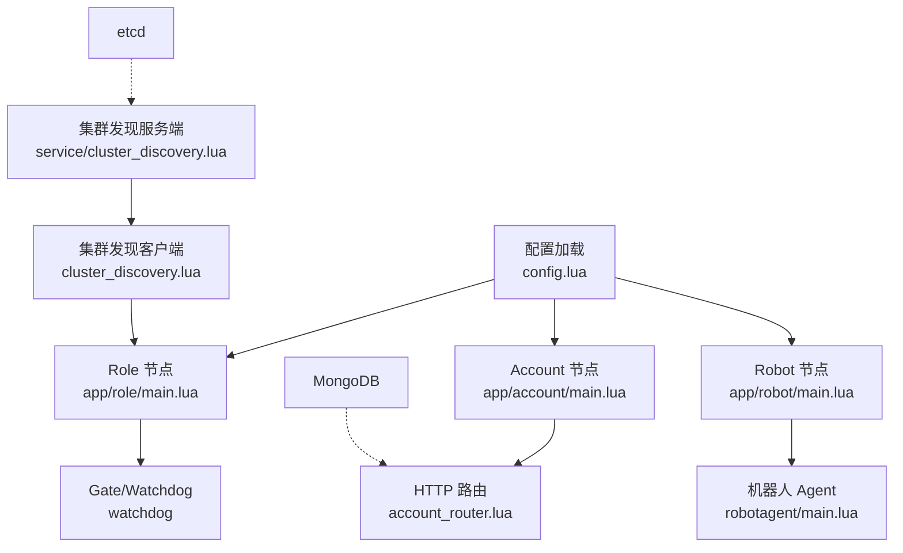
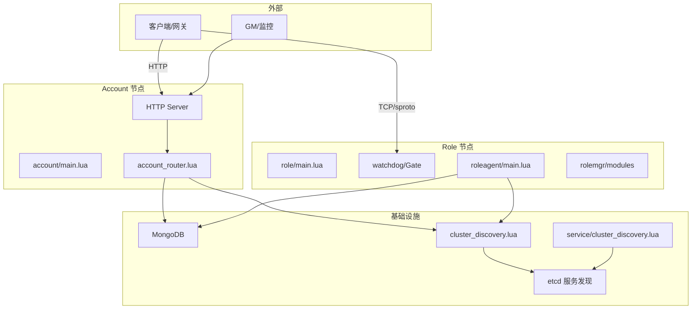
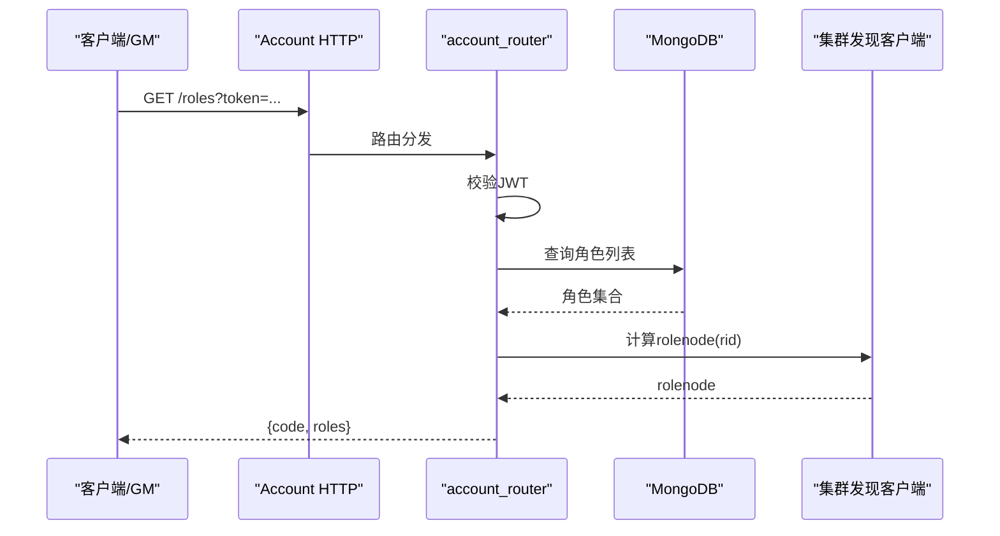
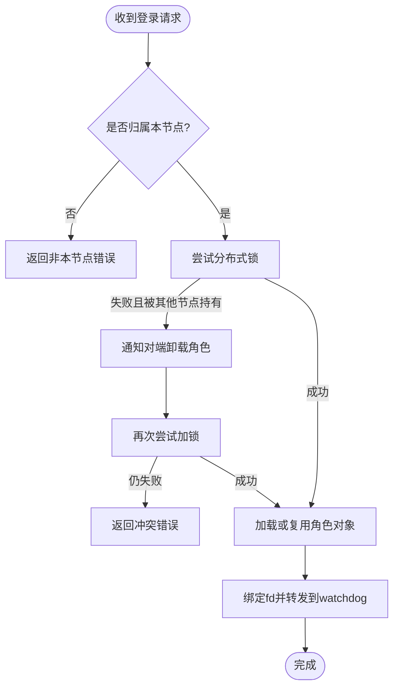
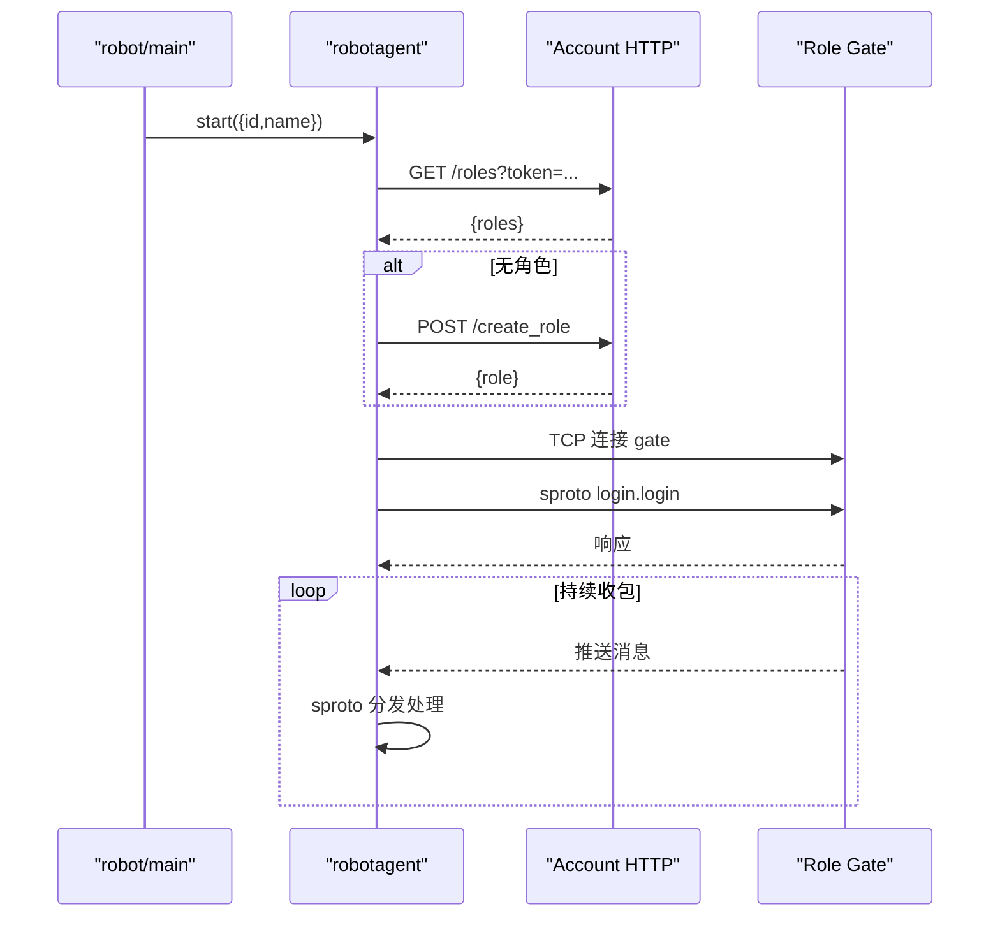
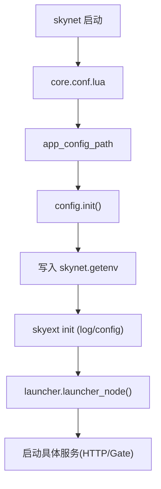
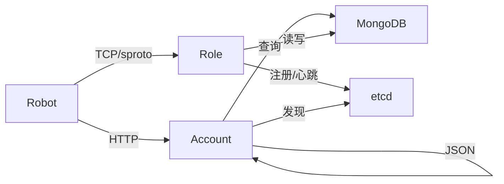

# 微服务架构设计

<cite>
**本文引用的文件**
- [README.md](file://README.md)
- [app/account/main.lua](file://app/account/main.lua)
- [app/role/main.lua](file://app/role/main.lua)
- [app/robot/main.lua](file://app/robot/main.lua)
- [etc/core.conf.lua](file://etc/core.conf.lua)
- [etc/app/common.app.lua](file://etc/app/common.app.lua)
- [etc/app/account1.app.lua](file://etc/app/account1.app.lua)
- [etc/app/role1.app.lua](file://etc/app/role1.app.lua)
- [lualib/config.lua](file://lualib/config.lua)
- [lualib/skyext.lua](file://lualib/skyext.lua)
- [lualib/launcher.lua](file://lualib/launcher.lua)
- [lualib/cluster_discovery.lua](file://lualib/cluster_discovery.lua)
- [service/cluster_discovery.lua](file://service/cluster_discovery.lua)
- [app/account/lualib/account_router.lua](file://app/account/lualib/account_router.lua)
- [app/role/roleagent/main.lua](file://app/role/roleagent/main.lua)
- [app/robot/robotagent/main.lua](file://app/robot/robotagent/main.lua)
</cite>

## 目录
1. [简介](#简介)
2. [项目结构](#项目结构)
3. [核心组件](#核心组件)
4. [架构总览](#架构总览)
5. [详细组件分析](#详细组件分析)
6. [依赖关系分析](#依赖关系分析)
7. [性能与扩展性](#性能与扩展性)
8. [故障排查指南](#故障排查指南)
9. [结论](#结论)
10. [附录](#附录)

## 简介
本文件面向 SkyExt 框架的微服务架构，聚焦 Account、Role、Robot 三个核心服务的职责边界、启动流程、配置管理、生命周期管理、解耦设计与通信协议选择，并给出部署拓扑与扩展策略。同时提供架构图、数据流图与关键流程图，帮助读者快速理解系统全貌与实现细节。

## 项目结构
SkyExt 采用基于 skynet 的进程内微服务模型：每个“节点”是一个独立进程，内部通过 skynet 消息机制组织多个服务（service）。应用入口位于 app 目录，配置文件位于 etc，通用库在 lualib，服务模块在 service。

图表来源
- [app/account/main.lua:1-25](file://app/account/main.lua#L1-L25)
- [app/role/main.lua:1-25](file://app/role/main.lua#L1-L25)
- [app/robot/main.lua:1-23](file://app/robot/main.lua#L1-L23)
- [lualib/config.lua:1-145](file://lualib/config.lua#L1-L145)
- [lualib/cluster_discovery.lua:1-95](file://lualib/cluster_discovery.lua#L1-L95)
- [service/cluster_discovery.lua:178-275](file://service/cluster_discovery.lua#L178-L275)

章节来源
- [README.md:22-47](file://README.md#L22-L47)
- [etc/core.conf.lua:1-30](file://etc/core.conf.lua#L1-L30)

## 核心组件
- Account 服务：对外暴露 HTTP API，负责账号认证（JWT）、角色查询与创建、角色所在 Role 节点的计算与返回。
- Role 服务：承载游戏逻辑，维护角色实例（roleagent），通过 Gate 接入客户端连接，使用分布式锁保证角色单活与跨节点迁移。
- Robot 服务：模拟客户端，通过 HTTP 获取角色信息并建立 TCP 连接到 Gate，完成登录与后续交互。
- 公共能力：配置加载、日志初始化、服务发现（etcd）、数据库连接池、sproto 协议编解码、分布式锁等。

章节来源
- [app/account/lualib/account_router.lua:1-143](file://app/account/lualib/account_router.lua#L1-L143)
- [app/role/roleagent/main.lua:1-117](file://app/role/roleagent/main.lua#L1-L117)
- [app/robot/robotagent/main.lua:1-153](file://app/robot/robotagent/main.lua#L1-L153)
- [lualib/config.lua:1-145](file://lualib/config.lua#L1-L145)
- [lualib/cluster_discovery.lua:1-95](file://lualib/cluster_discovery.lua#L1-L95)

## 架构总览
SkyExt 将业务按领域拆分为独立节点：Account 专注认证与元数据；Role 专注运行时角色状态；Robot 用于压测与联调。节点间通过 HTTP（Account）与 sproto/TCP（Role）进行解耦通信，服务注册与发现基于 etcd，保障动态扩缩容与故障自愈。

图表来源
- [app/account/main.lua:1-25](file://app/account/main.lua#L1-L25)
- [app/role/main.lua:1-25](file://app/role/main.lua#L1-L25)
- [app/account/lualib/account_router.lua:1-143](file://app/account/lualib/account_router.lua#L1-L143)
- [app/role/roleagent/main.lua:1-117](file://app/role/roleagent/main.lua#L1-L117)
- [lualib/cluster_discovery.lua:1-95](file://lualib/cluster_discovery.lua#L1-L95)
- [service/cluster_discovery.lua:178-275](file://service/cluster_discovery.lua#L178-L275)

## 详细组件分析

### Account 服务
- 职责边界
  - 提供 HTTP 接口：获取角色列表、创建角色。
  - 校验 JWT token，访问用户与角色元数据（MongoDB）。
  - 根据规则计算角色所在的 Role 节点，返回给调用方。
- 启动流程
  - 读取配置端口与 agent 数量，启动 HTTP 服务并注册路由。
  - 通过 launcher 初始化 GM、热更、Mongo 索引等基础能力。
- 生命周期
  - 启动完成后退出主进程，由 HTTP server 常驻处理请求。
- 关键路径
  - 登录鉴权：验证 JWT，解析 account。
  - 角色创建：检查配额、生成唯一 ID、写入角色表、计算 rolenode。
  - 角色查询：按条件查询角色，并附加 rolenode 信息。

图表来源
- [app/account/main.lua:1-25](file://app/account/main.lua#L1-L25)
- [app/account/lualib/account_router.lua:1-143](file://app/account/lualib/account_router.lua#L1-L143)
- [lualib/cluster_discovery.lua:1-95](file://lualib/cluster_discovery.lua#L1-L95)

章节来源
- [app/account/main.lua:1-25](file://app/account/main.lua#L1-L25)
- [app/account/lualib/account_router.lua:1-143](file://app/account/lualib/account_router.lua#L1-L143)
- [etc/app/account1.app.lua:1-21](file://etc/app/account1.app.lua#L1-L21)

### Role 服务
- 职责边界
  - 接收客户端 TCP 连接，转发到对应 roleagent。
  - 维护角色实例的生命周期（加载/卸载/绑定/解绑）。
  - 使用分布式锁确保角色在同一时刻仅在一个节点活跃。
- 启动流程
  - 启动 watchdog/Gate，监听 gate_port，限制最大连接数。
  - 通过 launcher 初始化 GM、热更、Mongo 索引。
- 生命周期
  - roleagent 作为 per-agent 服务，按 rid 分配与调度。
  - 角色离线后按配置延迟卸载，减少频繁 IO。
- 关键路径
  - 登录绑定：校验归属节点、尝试加锁、必要时通知对端卸载、绑定 fd。
  - 断开处理：解绑 fd，清理资源。

图表来源
- [app/role/roleagent/main.lua:1-117](file://app/role/roleagent/main.lua#L1-L117)

章节来源
- [app/role/main.lua:1-25](file://app/role/main.lua#L1-L25)
- [app/role/roleagent/main.lua:1-117](file://app/role/roleagent/main.lua#L1-L117)
- [etc/app/role1.app.lua:1-30](file://etc/app/role1.app.lua#L1-L30)

### Robot 服务
- 职责边界
  - 模拟真实客户端，自动获取/创建角色，连接 Gate 并完成登录流程。
  - 循环读取服务器推送消息，交由 sproto 分发处理。
- 启动流程
  - 可选启动控制台；按配置数量启动 robotagent。
  - 每个 agent 生成 JWT，调用 Account HTTP 接口获取或创建角色，再连接 Gate。
- 关键路径
  - 登录序列：获取 token -> 查询/创建角色 -> 连接 Gate -> 发送 login.login -> 获取角色信息。

图表来源
- [app/robot/main.lua:1-23](file://app/robot/main.lua#L1-L23)
- [app/robot/robotagent/main.lua:1-153](file://app/robot/robotagent/main.lua#L1-L153)
- [app/account/lualib/account_router.lua:1-143](file://app/account/lualib/account_router.lua#L1-L143)

章节来源
- [app/robot/main.lua:1-23](file://app/robot/main.lua#L1-L23)
- [app/robot/robotagent/main.lua:1-153](file://app/robot/robotagent/main.lua#L1-L153)

### 配置管理与生命周期
- 配置加载
  - 节点配置文件指定 app_config_path 与 start 脚本。
  - config 模块加载应用配置，支持 include、环境变量替换、类型转换与缓存。
  - skyext 在 init 阶段统一初始化配置与日志。
- 生命周期
  - launcher 启动 GM、热更、Mongo 索引等基础服务。
  - 各节点主进程在完成必要初始化后退出，由各自的服务（HTTP/Gate）常驻。

图表来源
- [etc/core.conf.lua:1-30](file://etc/core.conf.lua#L1-L30)
- [lualib/config.lua:1-145](file://lualib/config.lua#L1-L145)
- [lualib/skyext.lua:1-81](file://lualib/skyext.lua#L1-L81)
- [lualib/launcher.lua:1-20](file://lualib/launcher.lua#L1-L20)

章节来源
- [etc/app/common.app.lua:1-100](file://etc/app/common.app.lua#L1-L100)
- [etc/app/account1.app.lua:1-21](file://etc/app/account1.app.lua#L1-L21)
- [etc/app/role1.app.lua:1-30](file://etc/app/role1.app.lua#L1-L30)
- [lualib/config.lua:1-145](file://lualib/config.lua#L1-L145)
- [lualib/skyext.lua:1-81](file://lualib/skyext.lua#L1-L81)
- [lualib/launcher.lua:1-20](file://lualib/launcher.lua#L1-L20)

### 服务间解耦与通信协议
- 解耦设计
  - Account 与 Role 通过 HTTP + sproto 解耦：Account 不感知 Role 内部实现，只返回目标节点信息。
  - Role 内部通过 skynet.cluster 与分布式锁协调角色迁移与并发控制。
  - 服务发现基于 etcd，节点可动态上下线，客户端/上游无需硬编码地址。
- 通信协议
  - Account 对外提供 JSON over HTTP。
  - Role 对外使用 sproto over TCP，具备版本校验与高效序列化。
  - 内部服务间使用 skynet 消息与 cluster.call。

章节来源
- [app/account/lualib/account_router.lua:1-143](file://app/account/lualib/account_router.lua#L1-L143)
- [app/role/roleagent/main.lua:1-117](file://app/role/roleagent/main.lua#L1-L117)
- [lualib/cluster_discovery.lua:1-95](file://lualib/cluster_discovery.lua#L1-L95)
- [service/cluster_discovery.lua:178-275](file://service/cluster_discovery.lua#L178-L275)

## 依赖关系分析
- 节点内依赖
  - Account：HTTP Server -> Router -> 配置/日志/JWT/Mongo/集群发现。
  - Role：Gate/Watchdog -> roleagent -> rolemgr/modules -> 分布式锁/Mongo/集群发现。
  - Robot：robotagent -> HTTP 调用 Account -> TCP 连接 Role Gate -> sproto 收发。
- 跨节点依赖
  - Account 依赖 etcd（间接通过集群发现）与 MongoDB。
  - Role 依赖 etcd（服务注册/心跳）与 MongoDB。
  - Robot 依赖 Account HTTP 与 Role Gate。

图表来源
- [app/robot/robotagent/main.lua:1-153](file://app/robot/robotagent/main.lua#L1-L153)
- [app/account/lualib/account_router.lua:1-143](file://app/account/lualib/account_router.lua#L1-L143)
- [app/role/roleagent/main.lua:1-117](file://app/role/roleagent/main.lua#L1-L117)
- [service/cluster_discovery.lua:178-275](file://service/cluster_discovery.lua#L178-L275)

章节来源
- [lualib/cluster_discovery.lua:1-95](file://lualib/cluster_discovery.lua#L1-L95)
- [service/cluster_discovery.lua:178-275](file://service/cluster_discovery.lua#L178-L275)

## 性能与扩展性
- 水平扩展
  - Account：多实例部署，HTTP 无状态，可通过负载均衡横向扩展。
  - Role：多实例部署，角色按规则分布到不同节点，结合分布式锁实现迁移与高可用。
- 资源隔离
  - 进程级隔离：每个节点独立进程，崩溃不影响其他节点。
  - 连接隔离：Gate 限制 maxclient，避免单节点过载。
- 存储与缓存
  - MongoDB 连接池配置化，区分 center/role 库，降低热点竞争。
  - 角色离线延迟卸载，减少频繁 IO。
- 协议与序列化
  - sproto 高效二进制协议，支持版本校验，降低带宽与 CPU 开销。
- 弹性与自愈
  - etcd 租约与心跳，节点失效自动剔除，客户端/上游重选节点。

[本节为通用指导，不直接分析具体文件]

## 故障排查指南
- 启动失败
  - 检查 app_config_path 是否正确，config 模块是否能加载配置。
  - 确认 core.conf 中 luaservice/luaservice 路径包含所需脚本。
- 服务不可发现
  - 检查 etcd 连通性与租约续期，查看集群发现服务日志。
  - 确认服务已正确 register/unregister。
- 角色无法登录
  - 检查分布式锁是否被其他节点持有，必要时触发卸载并重试。
  - 核对角色归属节点计算结果与实际运行节点一致。
- 数据库异常
  - 检查 MongoDB 连接池配置与集合索引是否创建成功。
  - 关注 launcher 中索引创建步骤的返回值。

章节来源
- [lualib/config.lua:1-145](file://lualib/config.lua#L1-L145)
- [etc/core.conf.lua:1-30](file://etc/core.conf.lua#L1-L30)
- [lualib/launcher.lua:1-20](file://lualib/launcher.lua#L1-L20)
- [service/cluster_discovery.lua:178-275](file://service/cluster_discovery.lua#L178-L275)
- [app/role/roleagent/main.lua:1-117](file://app/role/roleagent/main.lua#L1-L117)

## 结论
SkyExt 以 skynet 为基础，将 Account、Role、Robot 解耦为独立节点，通过 HTTP 与 sproto/TCP 进行通信，借助 etcd 实现服务发现与高可用，配合 MongoDB 持久化与分布式锁保证一致性。该架构具备良好的可扩展性、隔离性与可运维性，适合游戏服务器的多服多节点场景。

[本节为总结，不直接分析具体文件]

## 附录
- 部署拓扑建议
  - Account：至少双实例，置于负载均衡之后。
  - Role：按玩家规模分片部署，每实例限定 maxclient，结合角色分布算法均衡负载。
  - 基础设施：etcd 三/五节点集群，MongoDB 副本集。
- 扩展策略
  - 新增 Role 节点：配置 cluster 参数，启动后自动注册至 etcd，新角色按规则路由。
  - 扩容 Account：增加实例即可，无状态特性便于弹性伸缩。
  - 灰度发布：利用热更新与配置热加载，逐步切换流量。

[本节为概念性内容，不直接分析具体文件]