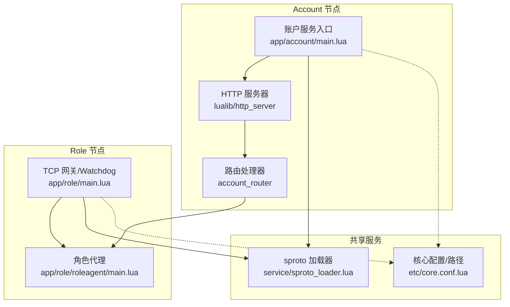
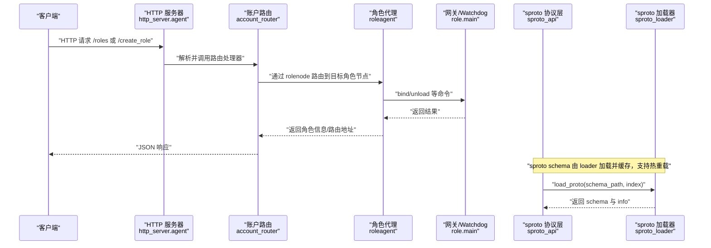
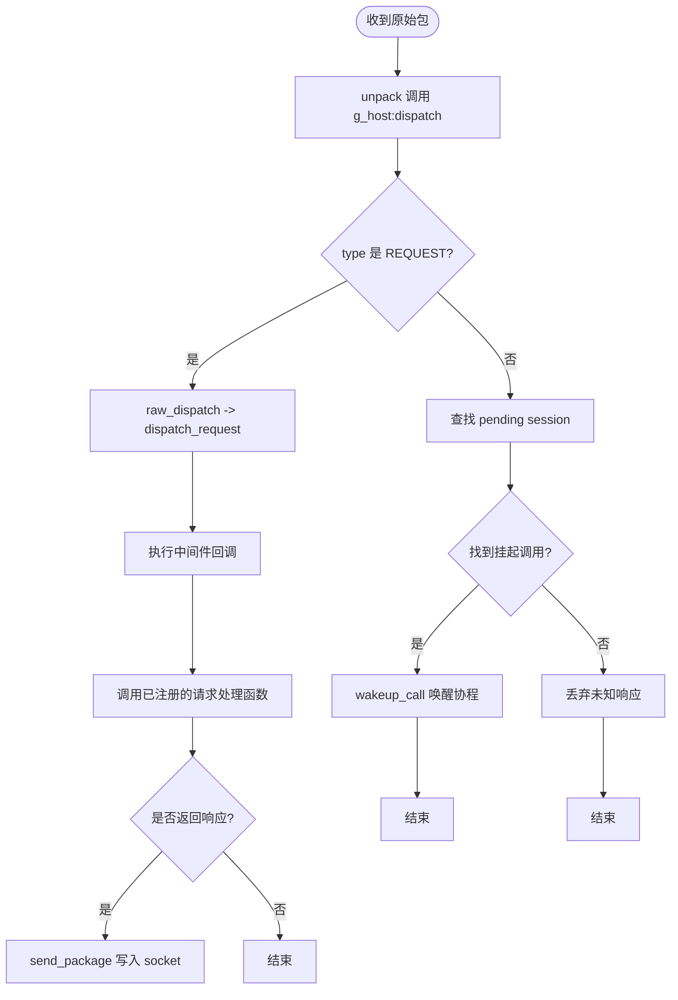
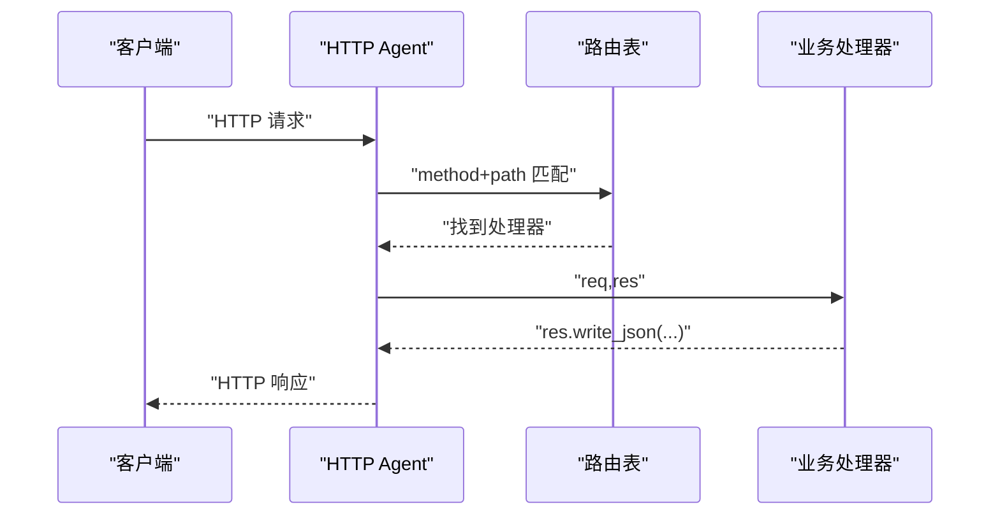
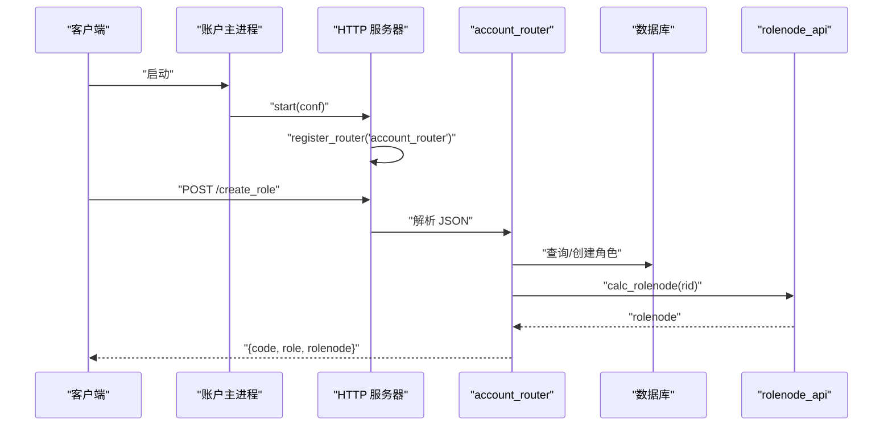
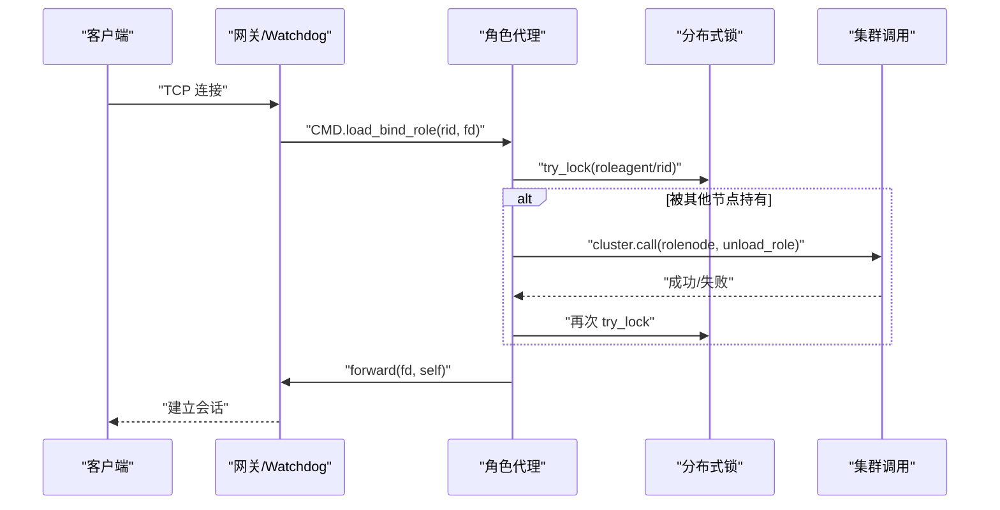
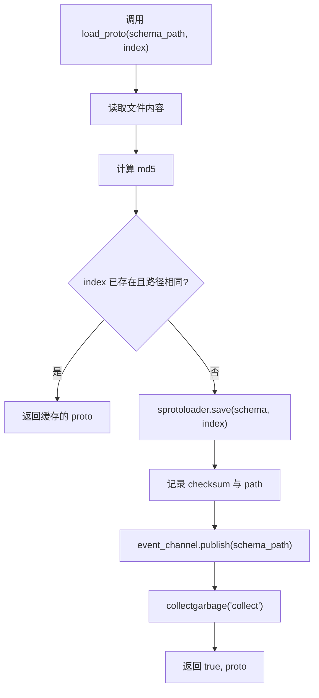
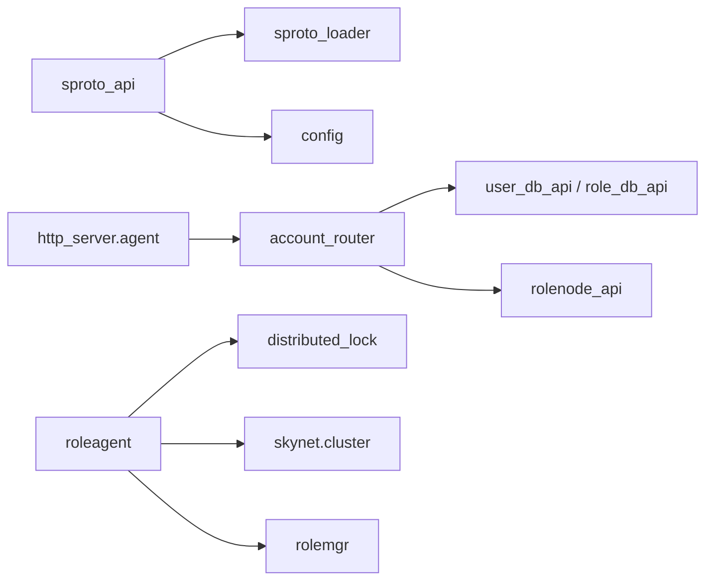

# 数据流与通信机制

<cite>
**本文引用的文件**
- [lualib/sproto_api.lua](file://lualib/sproto_api.lua)
- [service/sproto_loader.lua](file://service/sproto_loader.lua)
- [lualib/http_server/init.lua](file://lualib/http_server/init.lua)
- [lualib/http_server/agent.lua](file://lualib/http_server/agent.lua)
- [app/account/main.lua](file://app/account/main.lua)
- [app/account/lualib/account_router.lua](file://app/account/lualib/account_router.lua)
- [app/role/main.lua](file://app/role/main.lua)
- [app/role/roleagent/main.lua](file://app/role/roleagent/main.lua)
- [etc/core.conf.lua](file://etc/core.conf.lua)
- [etc/app/common.app.lua](file://etc/app/common.app.lua)
- [proto/base.sproto](file://proto/base.sproto)
- [proto/login.sproto](file://proto/login.sproto)
- [proto/roleagent/role.sproto](file://proto/roleagent/role.sproto)
- [tools/proto2spb.lua](file://tools/proto2spb.lua)
</cite>

## 目录
1. [简介](#简介)
2. [项目结构](#项目结构)
3. [核心组件](#核心组件)
4. [架构总览](#架构总览)
5. [详细组件分析](#详细组件分析)
6. [依赖关系分析](#依赖关系分析)
7. [性能考虑](#性能考虑)
8. [故障排查指南](#故障排查指南)
9. [结论](#结论)
10. [附录：消息格式定义](#附录消息格式定义)

## 简介
本文件系统性说明 SkyExt 框架的数据流与通信机制，覆盖从 HTTP/TCP 入口到业务逻辑处理的完整链路；解释 sproto 协议的序列化/反序列化过程；文档化服务间通信的消息传递与路由策略；描述数据在不同组件间的流转与状态变化；并提供请求响应时序图、消息格式定义、常见场景示例与性能优化建议。

## 项目结构
SkyExt 采用基于 skynet 的分布式微服务架构，主要节点类型包括：
- Account 节点：提供 HTTP API（账号、角色管理），负责登录鉴权与角色路由。
- Role 节点：提供 TCP 网关与角色会话管理，承载游戏逻辑模块。
- Robot 节点：用于压测的客户端模拟。

关键目录职责：
- app：各节点主脚本与业务入口。
- lualib：通用库（HTTP 服务器、sproto 协议处理、配置、日志等）。
- service：系统级服务（如 sproto_loader）。
- proto/schema：协议与 ORM 模式定义。
- etc：启动与应用配置。

图表来源
- [app/account/main.lua:7-16](file://app/account/main.lua#L7-L16)
- [lualib/http_server/init.lua:8-20](file://lualib/http_server/init.lua#L8-L20)
- [app/role/main.lua:6-16](file://app/role/main.lua#L6-L16)
- [service/sproto_loader.lua:19-66](file://service/sproto_loader.lua#L19-L66)
- [etc/core.conf.lua:1-29](file://etc/core.conf.lua#L1-L29)

章节来源
- [app/account/main.lua:7-16](file://app/account/main.lua#L7-L16)
- [lualib/http_server/init.lua:8-20](file://lualib/http_server/init.lua#L8-L20)
- [app/role/main.lua:6-16](file://app/role/main.lua#L6-L16)
- [service/sproto_loader.lua:19-66](file://service/sproto_loader.lua#L19-L66)
- [etc/core.conf.lua:1-29](file://etc/core.conf.lua#L1-L29)

## 核心组件
- sproto 协议层：负责协议 schema 加载、编解码、请求分发、调用/通知封装、超时控制与中间件拦截。
- HTTP 服务器：监听端口、解析请求、路由匹配、JSON 响应。
- 配置与启动：分层配置加载、服务发现、进程初始化。
- 角色代理：绑定 fd、加锁、跨节点卸载、转发至 watchdog。
- sproto 加载器：读取 .sproto 文件、生成 spb、校验 checksum、事件广播重载。

章节来源
- [lualib/sproto_api.lua:19-199](file://lualib/sproto_api.lua#L19-L199)
- [lualib/http_server/agent.lua:23-168](file://lualib/http_server/agent.lua#L23-L168)
- [service/sproto_loader.lua:19-86](file://service/sproto_loader.lua#L19-L86)
- [app/role/roleagent/main.lua:36-116](file://app/role/roleagent/main.lua#L36-L116)

## 架构总览
下图展示从 HTTP/TCP 接入到业务处理的端到端流程，以及 sproto 协议在其中的作用。

图表来源
- [lualib/http_server/agent.lua:31-118](file://lualib/http_server/agent.lua#L31-L118)
- [app/account/lualib/account_router.lua:24-140](file://app/account/lualib/account_router.lua#L24-L140)
- [app/role/roleagent/main.lua:36-86](file://app/role/roleagent/main.lua#L36-L86)
- [lualib/sproto_api.lua:118-199](file://lualib/sproto_api.lua#L118-L199)
- [service/sproto_loader.lua:19-66](file://service/sproto_loader.lua#L19-L66)

## 详细组件分析

### sproto 协议层（序列化和反序列化）
- 协议注册：将 client 协议 ID 映射到自定义 unpack/dispatch，实现按包名分发。
- 加载 schema：通过 sproto_loader 读取 .sproto，生成 spb 并缓存；支持 checksum 比对与事件触发重载。
- 编解码：使用 host("base.package") 统一打包/解包，attach 生成发送函数。
- 请求分发：raw_dispatch 根据 type 区分 REQUEST/RESPONSE，REQUEST 走中间件链后调用具体 handler。
- 调用模型：call(fd, name, param, session, timeout) 封装发送与等待响应，sleep + wakeup 实现协程阻塞等待。
- 通知模型：notify(fd, name, param) 单向推送。

图表来源
- [lualib/sproto_api.lua:97-159](file://lualib/sproto_api.lua#L97-L159)
- [lualib/sproto_api.lua:118-199](file://lualib/sproto_api.lua#L118-L199)

章节来源
- [lualib/sproto_api.lua:19-199](file://lualib/sproto_api.lua#L19-L199)
- [service/sproto_loader.lua:19-86](file://service/sproto_loader.lua#L19-L86)

### HTTP 服务器与路由
- 启动：http_server.start 创建 watchdog 服务并传入端口与 agent 数量。
- 路由注册：register_router 动态加载路由模块，按 method/path 注册处理器。
- 请求处理：读取请求体、解析 URL/Query/Header，构造 req/res 对象，调用对应 handler。
- 响应：write/write_json/write_file 统一封装头部与写入。

图表来源
- [lualib/http_server/init.lua:8-20](file://lualib/http_server/init.lua#L8-L20)
- [lualib/http_server/agent.lua:31-168](file://lualib/http_server/agent.lua#L31-L168)
- [app/account/lualib/account_router.lua:24-140](file://app/account/lualib/account_router.lua#L24-L140)

章节来源
- [lualib/http_server/init.lua:8-20](file://lualib/http_server/init.lua#L8-L20)
- [lualib/http_server/agent.lua:31-168](file://lualib/http_server/agent.lua#L31-L168)
- [app/account/lualib/account_router.lua:24-140](file://app/account/lualib/account_router.lua#L24-L140)

### 账户服务入口与角色路由
- 启动：account main 启动 HTTP 服务并注册 account_router。
- 路由逻辑：/roles 获取角色列表并计算 rolenode；/create_role 创建角色并返回 rolenode。
- 外部依赖：JWT 验证、数据库访问、ID 生成、错误码、时间工具、rolenode_api 计算角色所在节点。

图表来源
- [app/account/main.lua:7-16](file://app/account/main.lua#L7-L16)
- [app/account/lualib/account_router.lua:61-140](file://app/account/lualib/account_router.lua#L61-L140)

章节来源
- [app/account/main.lua:7-16](file://app/account/main.lua#L7-L16)
- [app/account/lualib/account_router.lua:24-140](file://app/account/lualib/account_router.lua#L24-L140)

### 角色节点与角色代理
- 启动：role main 启动 watchdog（gate），监听 gate_port，设置 maxclient。
- 角色代理：load_bind_role 进行节点归属检查、分布式锁、跨节点卸载、绑定 fd、转发至 watchdog。
- 生命周期：unload_role、disconnect、get_online_count 等。

图表来源
- [app/role/main.lua:6-16](file://app/role/main.lua#L6-L16)
- [app/role/roleagent/main.lua:36-86](file://app/role/roleagent/main.lua#L36-L86)

章节来源
- [app/role/main.lua:6-16](file://app/role/main.lua#L6-L16)
- [app/role/roleagent/main.lua:36-116](file://app/role/roleagent/main.lua#L36-L116)

### sproto 加载器与热重载
- 加载流程：读取 .sproto 文本，计算 md5，保存为 spb，记录 checksum 与 schema_path。
- 冲突检测：同一 index 不得重复指向不同 schema_path。
- 热重载：通过 event_channel 广播 schema_path，订阅者 reload_sproto。
- GM 命令：reload_sproto_schema 可一次性重载所有已加载 schema。

图表来源
- [service/sproto_loader.lua:19-66](file://service/sproto_loader.lua#L19-L66)
- [tools/proto2spb.lua:1-30](file://tools/proto2spb.lua#L1-L30)

章节来源
- [service/sproto_loader.lua:19-86](file://service/sproto_loader.lua#L19-L86)
- [tools/proto2spb.lua:1-30](file://tools/proto2spb.lua#L1-L30)

## 依赖关系分析
- 组件耦合：
  - sproto_api 依赖 sproto_loader 获取 schema，依赖 config 获取超时与 schema 路径。
  - http_server 依赖 agent 与 watchdog，router 依赖业务库（jwt、db、id_generator、rolenode_api）。
  - roleagent 依赖 distributed_lock、cluster、rolemgr、global/watchdog。
- 外部依赖：
  - etcd：服务发现与分布式锁（通过 cluster_discovery/distributed_lock）。
  - MongoDB：用户与角色数据持久化。
  - sprotoloader：二进制 schema 加载。

图表来源
- [lualib/sproto_api.lua:118-199](file://lualib/sproto_api.lua#L118-L199)
- [app/account/lualib/account_router.lua:1-140](file://app/account/lualib/account_router.lua#L1-L140)
- [app/role/roleagent/main.lua:1-116](file://app/role/roleagent/main.lua#L1-L116)

章节来源
- [lualib/sproto_api.lua:118-199](file://lualib/sproto_api.lua#L118-L199)
- [app/account/lualib/account_router.lua:1-140](file://app/account/lualib/account_router.lua#L1-L140)
- [app/role/roleagent/main.lua:1-116](file://app/role/roleagent/main.lua#L1-L116)

## 性能考虑
- sproto 协议层
  - 使用 base.package 统一打包，减少协议头开销。
  - call 默认超时来自配置 sproto_timeout，避免长时阻塞。
  - 中间件链应在早期拒绝无效请求，降低后续处理成本。
- HTTP 服务器
  - 合理设置 http_request_body_size，防止过大请求占用内存。
  - 路由匹配为 O(1) 哈希查找，注意避免过多路由导致内存增长。
- 角色代理
  - 分布式锁避免重复加载角色，减少竞争与资源浪费。
  - 跨节点卸载使用 cluster.call，需关注网络延迟与重试策略。
- 配置与启动
  - core.conf 中 thread 数影响并发处理能力，需结合 CPU 核数调优。
  - 多实例部署时，etcd 服务发现应保证低延迟与高可用。

[本节为通用性能建议，不直接分析具体文件]

## 故障排查指南
- sproto 协议相关
  - 若出现“协议索引冲突”，检查 sproto_index 与 schema_path 的唯一性。
  - 若 schema 未生效，确认 event_channel 订阅与 publish 是否正常，必要时使用 GM 命令 reload_sproto_schema。
- HTTP 请求
  - 404/405：检查路由注册与方法匹配；确认 router 模块是否正确导出方法映射。
  - 请求体过大：调整 http_request_body_size。
- 角色绑定
  - 锁失败或角色在其他节点：检查分布式锁与 cluster.call 返回值；确认 rolenode 计算一致。
  - 连接断开：确保 watchdog 正确 forward(fd, roleagent)，并在 disconnect 时清理绑定。

章节来源
- [service/sproto_loader.lua:19-86](file://service/sproto_loader.lua#L19-L86)
- [lualib/http_server/agent.lua:31-168](file://lualib/http_server/agent.lua#L31-L168)
- [app/role/roleagent/main.lua:36-116](file://app/role/roleagent/main.lua#L36-L116)

## 结论
SkyExt 通过 sproto 协议层统一编解码与分发，配合 HTTP 服务器与角色代理，实现了从 Web 到游戏逻辑的完整数据通路。sproto_loader 提供 schema 管理与热重载能力，保障协议演进与在线升级。角色代理通过分布式锁与集群调用确保角色唯一性与一致性。整体架构清晰、可扩展性强，适合分布式游戏服务器的持续迭代。

## 附录：消息格式定义
- base.package
  - 字段：type（整数）、session（整数）、ud（整数）
  - 用途：统一包头，标识消息类型与会话。
- login.sproto
  - report_remote_addr：网关上报远端/本地地址。
  - login：角色登录请求/响应，包含 token、rid、proto_checksum、server 及返回 code、rid、rolenode。
  - logout：登出消息（空体）。
- role.sproto（roleagent）
  - role：角色基本信息（rid、name）。
  - login_info：角色登录信息查询，返回 info 字段。

章节来源
- [proto/base.sproto:1-7](file://proto/base.sproto#L1-L7)
- [proto/login.sproto:1-26](file://proto/login.sproto#L1-L26)
- [proto/roleagent/role.sproto:1-13](file://proto/roleagent/role.sproto#L1-L13)