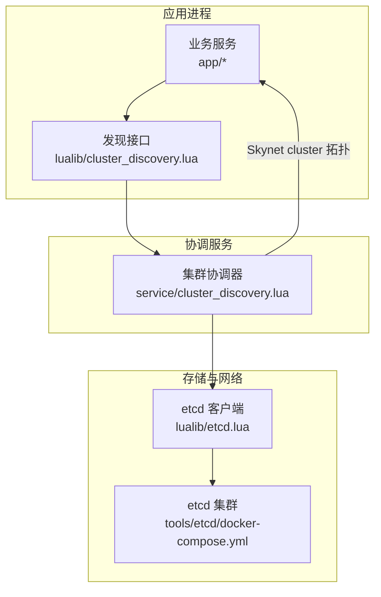
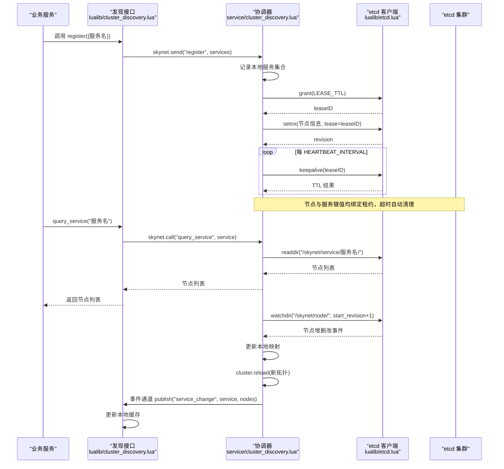
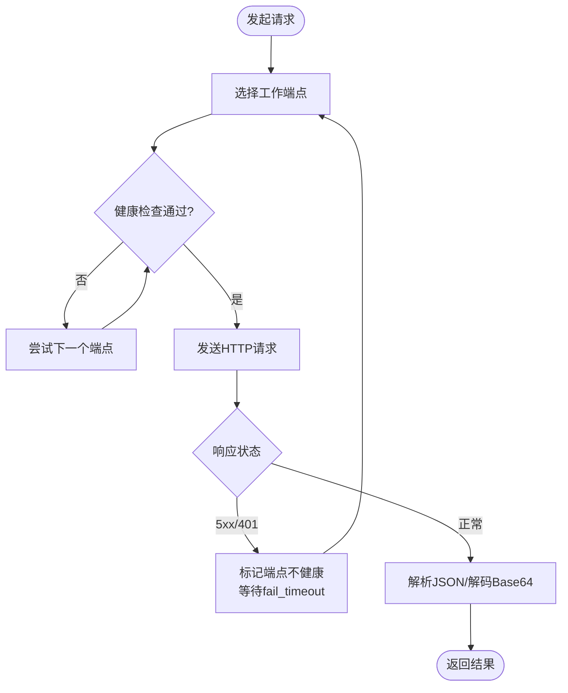
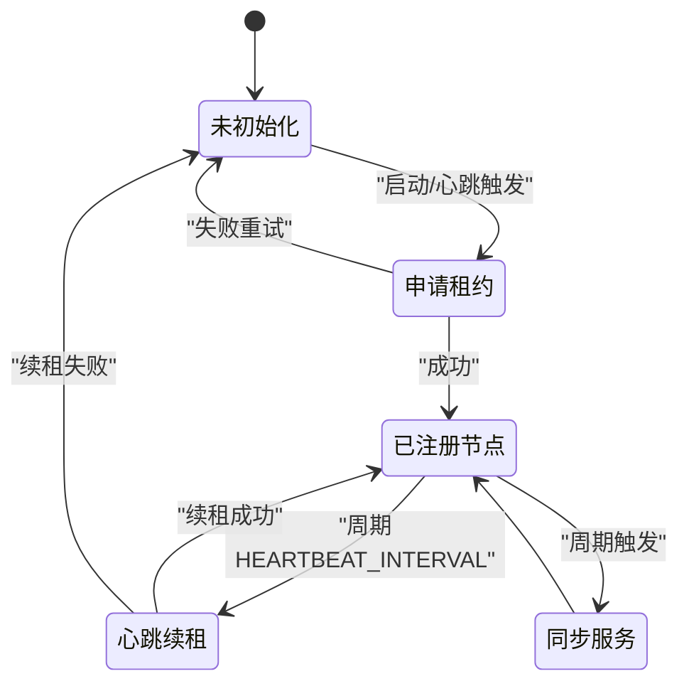
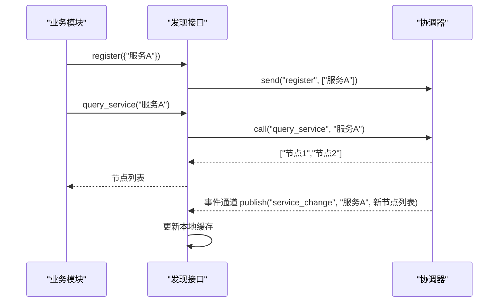
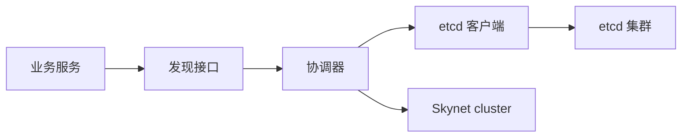

# 服务发现与治理

<cite>
**本文引用的文件**
- [lualib/etcd.lua](file://lualib/etcd.lua)
- [service/cluster_discovery.lua](file://service/cluster_discovery.lua)
- [lualib/cluster_discovery.lua](file://lualib/cluster_discovery.lua)
- [tools/etcd/docker-compose.yml](file://tools/etcd/docker-compose.yml)
- [etc/core.conf.lua](file://etc/core.conf.lua)
- [etc/role1.conf.lua](file://etc/role1.conf.lua)
- [test/test_etcd/main.lua](file://test/test_etcd/main.lua)
</cite>

## 目录
1. [简介](#简介)
2. [项目结构](#项目结构)
3. [核心组件](#核心组件)
4. [架构总览](#架构总览)
5. [详细组件分析](#详细组件分析)
6. [依赖关系分析](#依赖关系分析)
7. [性能考量](#性能考量)
8. [故障排查指南](#故障排查指南)
9. [结论](#结论)
10. [附录：配置示例与最佳实践](#附录配置示例与最佳实践)

## 简介
本章节概述 SkyExt 框架的服务发现与治理系统。该系统基于 etcd 实现服务的注册、发现、健康检查、故障转移与动态更新，并通过心跳机制保障节点与服务信息的时效性。整体设计将“客户端侧的轻量发现接口”与“服务端侧的 etcd 协调器”解耦，便于在 Skynet 多进程环境下进行横向扩展与高可用部署。

## 项目结构
- lualib/etcd.lua：etcd HTTP API 客户端封装，提供 KV 读写、租约管理、流式 watch、鉴权、负载均衡与健康检查等能力。
- service/cluster_discovery.lua：集群协调服务，负责节点与服务在 etcd 中的注册、续租、监听变更、向 Skynet cluster 同步拓扑，以及通过事件通道广播服务变更。
- lualib/cluster_discovery.lua：面向业务模块的轻量发现接口，缓存并订阅服务节点列表，提供随机选择与全量查询。
- tools/etcd/docker-compose.yml：本地三节点 etcd 集群编排，用于开发与测试。
- etc/*.conf.lua：应用与核心配置入口，包含路径、线程数、启动脚本等。
- test/test_etcd/main.lua：etcd 客户端功能验证用例。

图表来源
- [service/cluster_discovery.lua:646-667](file://service/cluster_discovery.lua#L646-L667)
- [lualib/cluster_discovery.lua:89-92](file://lualib/cluster_discovery.lua#L89-L92)
- [lualib/etcd.lua:253-295](file://lualib/etcd.lua#L253-L295)
- [tools/etcd/docker-compose.yml:10-85](file://tools/etcd/docker-compose.yml#L10-L85)

章节来源
- [etc/core.conf.lua:1-30](file://etc/core.conf.lua#L1-L30)
- [etc/role1.conf.lua:1-4](file://etc/role1.conf.lua#L1-L4)

## 核心组件
- etcd 客户端（lualib/etcd.lua）
  - 支持单实例与多端点集群模式；内置环形负载均衡与健康检查，失败自动切换工作端点。
  - 提供 KV 操作、事务、租约（grant/keepalive/revoke）、范围查询、目录级 watch 等。
  - 支持 JWT 鉴权与 token 刷新。
- 集群协调器（service/cluster_discovery.lua）
  - 维护节点与服务在 etcd 中的键空间，使用租约保证存活。
  - 周期性心跳续租，异常时重置并重新申请租约。
  - 监听节点与服务变更，更新本地映射并调用 Skynet cluster.reload 同步拓扑。
  - 通过事件通道发布服务变更事件，供上层订阅。
- 发现接口（lualib/cluster_discovery.lua）
  - 为业务模块提供 register/unregister/query_service 等接口。
  - 内部缓存每个服务的节点列表，支持随机选取与全量获取。
  - 订阅服务变更事件，实时更新本地缓存。

章节来源
- [lualib/etcd.lua:154-209](file://lualib/etcd.lua#L154-L209)
- [lualib/etcd.lua:253-295](file://lualib/etcd.lua#L253-L295)
- [lualib/etcd.lua:775-842](file://lualib/etcd.lua#L775-L842)
- [lualib/etcd.lua:990-1000](file://lualib/etcd.lua#L990-L1000)
- [service/cluster_discovery.lua:46-73](file://service/cluster_discovery.lua#L46-L73)
- [service/cluster_discovery.lua:196-237](file://service/cluster_discovery.lua#L196-L237)
- [service/cluster_discovery.lua:268-295](file://service/cluster_discovery.lua#L268-L295)
- [service/cluster_discovery.lua:319-427](file://service/cluster_discovery.lua#L319-L427)
- [service/cluster_discovery.lua:488-620](file://service/cluster_discovery.lua#L488-L620)
- [lualib/cluster_discovery.lua:11-20](file://lualib/cluster_discovery.lua#L11-L20)
- [lualib/cluster_discovery.lua:26-76](file://lualib/cluster_discovery.lua#L26-L76)
- [lualib/cluster_discovery.lua:79-92](file://lualib/cluster_discovery.lua#L79-L92)

## 架构总览
下图展示了从业务服务到 etcd 的完整数据与控制流，包括注册、心跳、发现与变更通知。

图表来源
- [service/cluster_discovery.lua:248-266](file://service/cluster_discovery.lua#L248-L266)
- [service/cluster_discovery.lua:319-427](file://service/cluster_discovery.lua#L319-L427)
- [service/cluster_discovery.lua:488-620](file://service/cluster_discovery.lua#L488-L620)
- [lualib/cluster_discovery.lua:11-20](file://lualib/cluster_discovery.lua#L11-L20)
- [lualib/cluster_discovery.lua:79-92](file://lualib/cluster_discovery.lua#L79-L92)
- [lualib/etcd.lua:775-842](file://lualib/etcd.lua#L775-L842)
- [lualib/etcd.lua:990-1000](file://lualib/etcd.lua#L990-L1000)

## 详细组件分析

### etcd 客户端（lualib/etcd.lua）
- 连接与端点选择
  - 支持单端点或多端点；多端点时使用环形轮询选择工作端点，结合健康检查与失败退避，提升可用性。
- 鉴权与会话
  - 支持用户名/密码登录，JWT token 缓存与定时刷新，避免频繁认证开销。
- 数据模型与操作
  - KV 读写、范围查询、删除、事务（compare/success/failure）。
  - 租约：grant/keepalive/revoke/timetolive/leases。
  - 流式监听：watch/watchdir，支持按 revision 增量订阅。
- 错误处理
  - 请求失败或 5xx/401 时记录日志并标记端点不健康，后续请求自动切换到其他端点。

图表来源
- [lualib/etcd.lua:154-209](file://lualib/etcd.lua#L154-L209)
- [lualib/etcd.lua:211-241](file://lualib/etcd.lua#L211-L241)
- [lualib/etcd.lua:87-138](file://lualib/etcd.lua#L87-L138)

章节来源
- [lualib/etcd.lua:87-138](file://lualib/etcd.lua#L87-L138)
- [lualib/etcd.lua:154-209](file://lualib/etcd.lua#L154-L209)
- [lualib/etcd.lua:253-295](file://lualib/etcd.lua#L253-L295)
- [lualib/etcd.lua:775-842](file://lualib/etcd.lua#L775-L842)
- [lualib/etcd.lua:990-1000](file://lualib/etcd.lua#L990-L1000)

### 集群协调器（service/cluster_discovery.lua）
- 节点生命周期
  - 首次启动申请租约，写入节点信息（含地址），并开启心跳定时器定期续租。
  - 心跳失败则重置并重新申请租约，确保节点信息最终一致。
- 服务生命周期
  - 接收业务模块的 register/unregister 指令，维护本地服务集合。
  - 周期性同步：将本地服务集合与 etcd 中已同步集合对比，新增/更新或删除对应键值。
- 节点与服务发现
  - 初始拉取所有节点，随后通过 watchdir 监听节点变化，更新本地映射并调用 cluster.reload 同步拓扑。
  - 对每个服务独立维护 map_node，首次查询后持续 watch 该服务前缀下的键变化，推送事件。
- 事件通道
  - 每次修订号更新后，通过 event_channel_api 发布 service_change 事件，携带服务名与当前节点列表。

图表来源
- [service/cluster_discovery.lua:248-266](file://service/cluster_discovery.lua#L248-L266)
- [service/cluster_discovery.lua:297-309](file://service/cluster_discovery.lua#L297-L309)
- [service/cluster_discovery.lua:646-667](file://service/cluster_discovery.lua#L646-L667)

章节来源
- [service/cluster_discovery.lua:46-73](file://service/cluster_discovery.lua#L46-L73)
- [service/cluster_discovery.lua:98-176](file://service/cluster_discovery.lua#L98-L176)
- [service/cluster_discovery.lua:196-237](file://service/cluster_discovery.lua#L196-L237)
- [service/cluster_discovery.lua:268-295](file://service/cluster_discovery.lua#L268-L295)
- [service/cluster_discovery.lua:319-427](file://service/cluster_discovery.lua#L319-L427)
- [service/cluster_discovery.lua:488-620](file://service/cluster_discovery.lua#L488-L620)
- [service/cluster_discovery.lua:622-644](file://service/cluster_discovery.lua#L622-L644)

### 发现接口（lualib/cluster_discovery.lua）
- 对外接口
  - register/unregister：向协调器注册/注销服务。
  - random/nodes：随机选择一个节点或返回全部节点。
- 内部机制
  - 懒初始化：首次访问某服务时，向协调器查询并缓存节点列表。
  - 事件订阅：订阅 service_change 事件，收到变更后更新本地缓存。

图表来源
- [lualib/cluster_discovery.lua:11-20](file://lualib/cluster_discovery.lua#L11-L20)
- [lualib/cluster_discovery.lua:26-76](file://lualib/cluster_discovery.lua#L26-L76)
- [lualib/cluster_discovery.lua:79-92](file://lualib/cluster_discovery.lua#L79-L92)
- [service/cluster_discovery.lua:622-644](file://service/cluster_discovery.lua#L622-L644)

章节来源
- [lualib/cluster_discovery.lua:11-20](file://lualib/cluster_discovery.lua#L11-L20)
- [lualib/cluster_discovery.lua:26-76](file://lualib/cluster_discovery.lua#L26-L76)
- [lualib/cluster_discovery.lua:79-92](file://lualib/cluster_discovery.lua#L79-L92)

## 依赖关系分析
- 组件耦合
  - 发现接口依赖协调器提供的消息接口；协调器依赖 etcd 客户端进行持久化与监听。
  - 协调器通过 Skynet cluster 模块暴露拓扑给业务进程，形成松耦合的运行时路由。
- 外部依赖
  - etcd 集群：通过 docker-compose 提供三节点高可用环境。
  - Skynet 事件通道：用于跨服务的事件分发。
- 潜在循环依赖
  - 未发现直接循环依赖；各层职责清晰，单向依赖。

图表来源
- [service/cluster_discovery.lua:646-667](file://service/cluster_discovery.lua#L646-L667)
- [lualib/cluster_discovery.lua:89-92](file://lualib/cluster_discovery.lua#L89-L92)
- [tools/etcd/docker-compose.yml:10-85](file://tools/etcd/docker-compose.yml#L10-L85)

章节来源
- [service/cluster_discovery.lua:646-667](file://service/cluster_discovery.lua#L646-L667)
- [lualib/cluster_discovery.lua:89-92](file://lualib/cluster_discovery.lua#L89-L92)
- [tools/etcd/docker-compose.yml:10-85](file://tools/etcd/docker-compose.yml#L10-L85)

## 性能考量
- 心跳与续租
  - 租约 TTL 与心跳间隔比例合理（TTL 约为心跳间隔的 3 倍），降低网络开销同时保证快速失效检测。
- 端点选择与健康检查
  - 环形负载均衡 + 失败退避，减少雪崩风险；工作端点缓存降低选择成本。
- 监听与增量同步
  - 使用 watchdir 与 revision 增量订阅，避免全量轮询，降低 etcd 压力。
- 并发与锁
  - 服务对象初始化采用队列锁，避免重复初始化；事件通道异步广播，非阻塞。
- 建议优化
  - 根据负载调整 HEARTBEAT_INTERVAL 与 WATCH_SLEEP。
  - 大集群下可考虑分片服务键空间，减少单个 watch 的压力。
  - 监控 etcd 客户端的失败次数与重连频率，及时扩容或调优。

[本节为通用性能讨论，无需特定文件引用]

## 故障排查指南
- etcd 连接失败
  - 检查 etcd 集群是否可用，确认客户端配置的 http_host 列表正确。
  - 关注健康检查与失败退避日志，确认是否因 5xx/401 导致端点被标记不健康。
- 租约过期或服务下线
  - 若心跳失败，协调器会重置并重新申请租约；检查 keepalive 返回值与日志。
  - 节点或服务键值由租约控制，租约到期会自动删除，观察 watch 事件是否符合预期。
- 服务发现不一致
  - 核对本地缓存与 etcd 中的 revision 是否一致；必要时重启协调器以重建 watch。
  - 检查事件通道是否正常发布 service_change 事件。
- 鉴权问题
  - 确认用户/密码配置正确，JWT token 刷新逻辑正常；关注 refresh_jwt_token 相关日志。

章节来源
- [lualib/etcd.lua:87-138](file://lualib/etcd.lua#L87-L138)
- [lualib/etcd.lua:154-209](file://lualib/etcd.lua#L154-L209)
- [service/cluster_discovery.lua:248-266](file://service/cluster_discovery.lua#L248-L266)
- [service/cluster_discovery.lua:374-427](file://service/cluster_discovery.lua#L374-L427)
- [service/cluster_discovery.lua:587-620](file://service/cluster_discovery.lua#L587-L620)

## 结论
SkyExt 的服务发现与治理系统通过 etcd 实现了高可用的服务注册与发现，结合心跳与租约机制保障节点与服务信息的时效性。协调器负责与 etcd 交互并同步 Skynet 拓扑，发现接口为业务提供简洁易用的查询与订阅能力。整体架构清晰、可扩展性强，适合在多进程分布式环境中稳定运行。

[本节为总结性内容，无需特定文件引用]

## 附录：配置示例与最佳实践

- etcd 集群配置
  - 使用 tools/etcd/docker-compose.yml 启动三节点 etcd 集群，便于开发与测试。
  - 注意端口映射与初始集群参数，确保节点间通信正常。

- 应用配置
  - 在 etc/core.conf.lua 中设置路径、线程数、bootstrap 等基础参数。
  - 在各应用的 conf 文件中指定 app_config_path 与 start 入口，例如 role1.conf.lua。

- 服务注册与发现
  - 业务服务启动时调用 cluster_discovery.register({服务名}) 完成注册。
  - 需要查找服务时调用 cluster_discovery.query_service("服务名") 获取节点列表。
  - 服务停止时调用 unregister 注销，避免残留条目。

- 健康检查与故障转移
  - 利用 etcd 客户端内置的健康检查与失败退避，自动切换工作端点。
  - 协调器心跳失败会重置并重新申请租约，确保节点信息最终一致。

- 动态更新
  - 通过 watchdir 监听节点与服务变更，协调器实时同步 Skynet cluster 拓扑。
  - 业务模块可通过事件通道订阅 service_change，实现无感知的服务上下线。

- 最佳实践
  - 合理设置 TTL 与心跳间隔，平衡时效性与网络开销。
  - 监控 etcd 客户端与协调器日志，及时发现异常。
  - 在大规模场景下，考虑服务键空间分片与批量操作，降低 etcd 压力。

章节来源
- [tools/etcd/docker-compose.yml:10-85](file://tools/etcd/docker-compose.yml#L10-L85)
- [etc/core.conf.lua:1-30](file://etc/core.conf.lua#L1-L30)
- [etc/role1.conf.lua:1-4](file://etc/role1.conf.lua#L1-L4)
- [lualib/cluster_discovery.lua:11-20](file://lualib/cluster_discovery.lua#L11-L20)
- [lualib/cluster_discovery.lua:79-92](file://lualib/cluster_discovery.lua#L79-L92)
- [service/cluster_discovery.lua:248-266](file://service/cluster_discovery.lua#L248-L266)
- [service/cluster_discovery.lua:374-427](file://service/cluster_discovery.lua#L374-L427)
- [test/test_etcd/main.lua:1-53](file://test/test_etcd/main.lua#L1-L53)