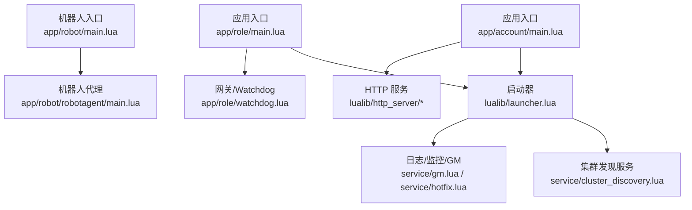
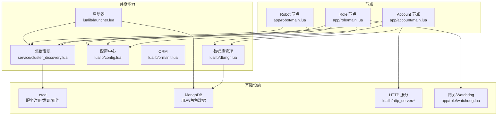
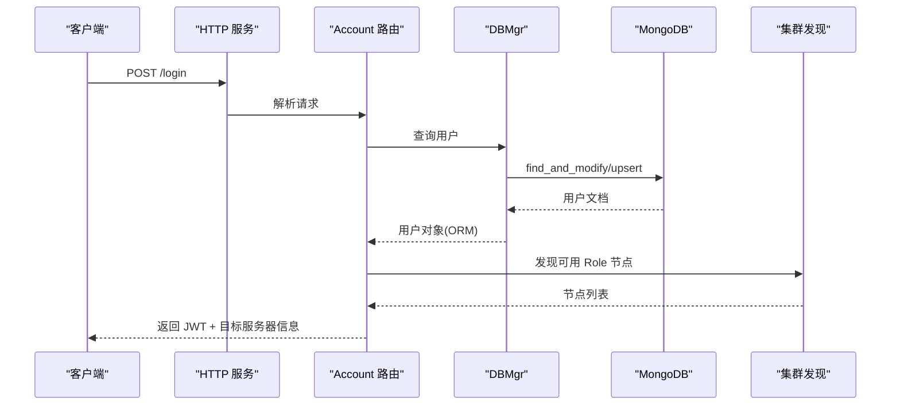
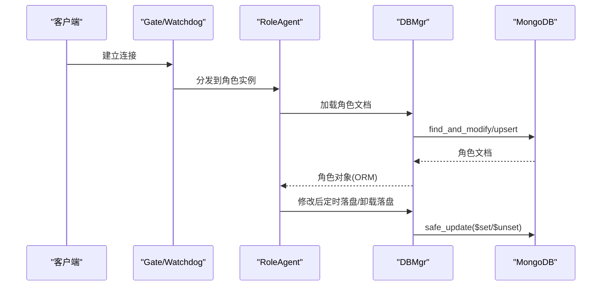
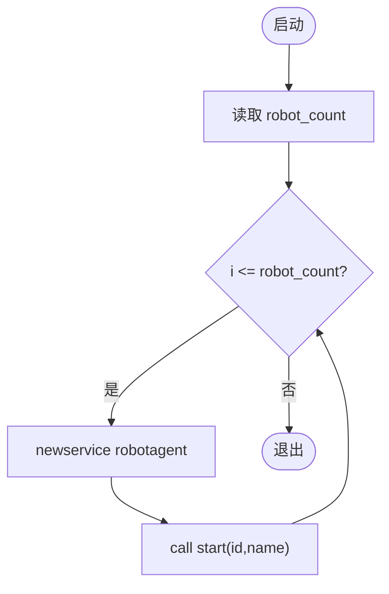
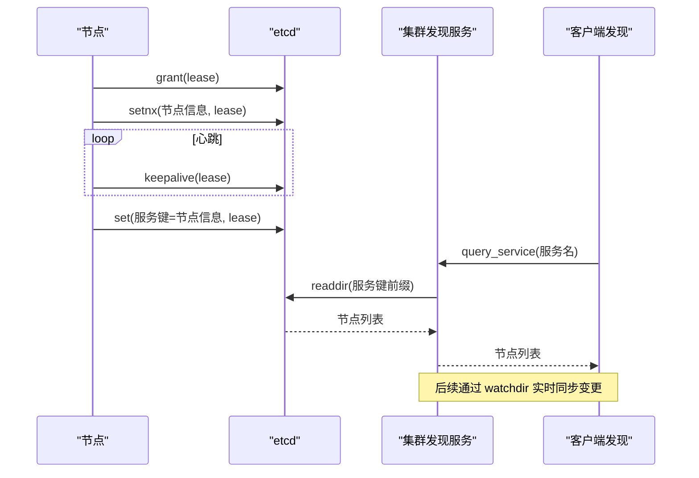
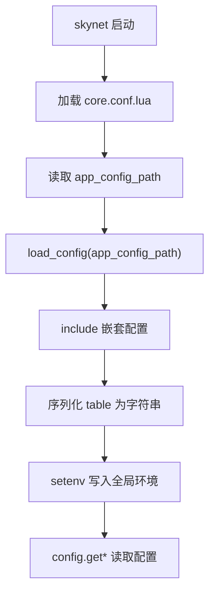
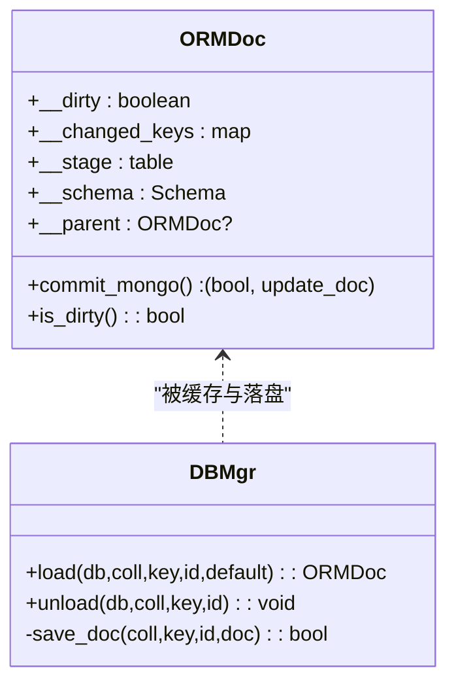
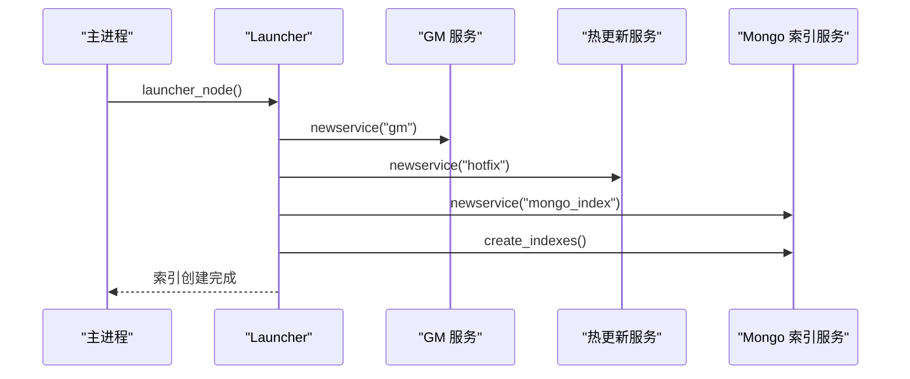
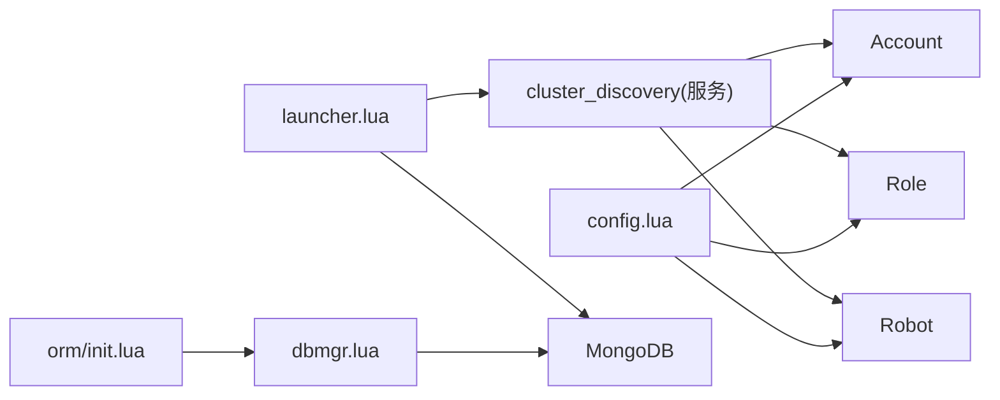

# 架构设计

<cite>
**本文引用的文件**
- [README.md](file://README.md)
- [skyext.lua](file://lualib/skyext.lua)
- [launcher.lua](file://lualib/launcher.lua)
- [config.lua](file://lualib/config.lua)
- [cluster_discovery.lua（客户端）](file://lualib/cluster_discovery.lua)
- [cluster_discovery.lua（服务）](file://service/cluster_discovery.lua)
- [orm/init.lua](file://lualib/orm/init.lua)
- [dbmgr.lua](file://lualib/dbmgr.lua)
- [app/account/main.lua](file://app/account/main.lua)
- [app/role/main.lua](file://app/role/main.lua)
- [app/robot/main.lua](file://app/robot/main.lua)
- [core.conf.lua](file://etc/core.conf.lua)
- [common.app.lua](file://etc/app/common.app.lua)
- [account1.conf.lua](file://etc/account1.conf.lua)
- [role1.conf.lua](file://etc/role1.conf.lua)
</cite>

## 目录
1. [简介](#简介)
2. [项目结构](#项目结构)
3. [核心组件](#核心组件)
4. [架构总览](#架构总览)
5. [详细组件分析](#详细组件分析)
6. [依赖关系分析](#依赖关系分析)
7. [性能考量](#性能考量)
8. [故障排查指南](#故障排查指南)
9. [结论](#结论)
10. [附录](#附录)

## 简介
SkyExt 是基于 skynet 的分布式游戏服务器框架，采用微服务化设计，将 Account、Role、Robot 三类节点解耦部署。系统通过 etcd 实现服务注册与发现，使用 MongoDB 进行数据持久化，并内置 ORM、HTTP 服务、日志、JWT 认证等能力。Account 节点负责账号管理与登录验证；Role 节点负责角色数据与游戏逻辑；Robot 节点用于压测与模拟客户端。

## 项目结构
- 应用入口：app/account、app/role、app/robot
- 公共库：lualib（配置、ORM、集群发现、数据库管理、协议、HTTP 等）
- 服务：service（集群发现、GM、热更新、MongoDB 索引等）
- 配置：etc（节点级与业务级分层配置）
- 协议与模式：proto、schema
- 工具与测试：tools、test

图表来源
- [app/account/main.lua:7-16](file://app/account/main.lua#L7-L16)
- [app/role/main.lua:6-16](file://app/role/main.lua#L6-L16)
- [app/robot/main.lua:5-19](file://app/robot/main.lua#L5-L19)
- [launcher.lua:6-17](file://lualib/launcher.lua#L6-L17)
- [service/cluster_discovery.lua:646-667](file://service/cluster_discovery.lua#L646-L667)

章节来源
- [README.md:22-38](file://README.md#L22-L38)
- [core.conf.lua:1-29](file://etc/core.conf.lua#L1-L29)

## 核心组件
- Launcher：统一启动 GM、热更新、MongoDB 索引创建等基础服务
- Config：加载应用配置，提供类型安全的读取接口
- ClusterDiscovery：基于 etcd 的服务注册、心跳、发现与变更通知
- ORM：对象关系映射，支持脏标记、增量提交、版本控制
- DBMgr：MongoDB 连接池、文档缓存、定时落盘与卸载清理
- HTTP Server：Account 节点的 HTTP 接入点，路由到 account_router
- Role Watchdog/Gate：Role 节点的 TCP 网关与客户端接入管理

章节来源
- [launcher.lua:6-17](file://lualib/launcher.lua#L6-L17)
- [config.lua:6-72](file://lualib/config.lua#L6-L72)
- [cluster_discovery.lua（服务）:46-237](file://service/cluster_discovery.lua#L46-L237)
- [orm/init.lua:234-295](file://lualib/orm/init.lua#L234-L295)
- [dbmgr.lua:94-148](file://lualib/dbmgr.lua#L94-L148)
- [app/account/main.lua:7-16](file://app/account/main.lua#L7-L16)
- [app/role/main.lua:6-16](file://app/role/main.lua#L6-L16)

## 架构总览
SkyExt 采用“节点即服务”的微服务模式：
- Account 节点对外暴露 HTTP API，处理账号注册、登录、JWT 签发与校验
- Role 节点通过网关接收客户端连接，承载角色数据与游戏逻辑
- Robot 节点批量启动机器人代理，模拟客户端行为进行压测
- 所有节点通过 etcd 完成服务注册与发现，动态感知对端节点变化
- 数据层以 MongoDB 为中心，ORM 封装文档模型，DBMgr 负责缓存与落盘

图表来源
- [app/account/main.lua:7-16](file://app/account/main.lua#L7-L16)
- [app/role/main.lua:6-16](file://app/role/main.lua#L6-L16)
- [app/robot/main.lua:5-19](file://app/robot/main.lua#L5-L19)
- [service/cluster_discovery.lua:646-667](file://service/cluster_discovery.lua#L646-L667)
- [dbmgr.lua:94-148](file://lualib/dbmgr.lua#L94-L148)
- [config.lua:120-142](file://lualib/config.lua#L120-L142)
- [launcher.lua:6-17](file://lualib/launcher.lua#L6-L17)

## 详细组件分析

### Account 节点
- 职责：提供 HTTP 接口，处理账号注册、登录、JWT 认证；通过集群发现定位 Role 节点；读写用户数据
- 启动流程：初始化 HTTP 服务、注册路由、调用启动器拉起基础服务
- 关键交互：HTTP -> Account Router -> DBMgr(用户表) -> MongoDB；登录成功后返回 JWT

图表来源
- [app/account/main.lua:7-16](file://app/account/main.lua#L7-L16)
- [dbmgr.lua:94-148](file://lualib/dbmgr.lua#L94-L148)
- [cluster_discovery.lua（客户端）:11-20](file://lualib/cluster_discovery.lua#L11-L20)

章节来源
- [app/account/main.lua:7-16](file://app/account/main.lua#L7-L16)
- [dbmgr.lua:94-148](file://lualib/dbmgr.lua#L94-L148)
- [cluster_discovery.lua（客户端）:11-20](file://lualib/cluster_discovery.lua#L11-L20)

### Role 节点
- 职责：承载角色数据与游戏逻辑；通过网关接入客户端；按角色维度加载/保存数据
- 启动流程：启动 Watchdog 监听端口，接受客户端连接；通过集群发现定位 Account 节点
- 数据流：客户端 -> Gate -> Role Agent -> DBMgr -> MongoDB；定时落盘与卸载时落盘

图表来源
- [app/role/main.lua:6-16](file://app/role/main.lua#L6-L16)
- [dbmgr.lua:53-92](file://lualib/dbmgr.lua#L53-L92)
- [dbmgr.lua:94-148](file://lualib/dbmgr.lua#L94-L148)

章节来源
- [app/role/main.lua:6-16](file://app/role/main.lua#L6-L16)
- [dbmgr.lua:53-92](file://lualib/dbmgr.lua#L53-L92)
- [dbmgr.lua:94-148](file://lualib/dbmgr.lua#L94-L148)

### Robot 节点
- 职责：批量启动机器人代理，模拟客户端行为进行压力测试
- 启动流程：根据配置数量循环创建 robotagent，并传入 id/name 参数

图表来源
- [app/robot/main.lua:5-19](file://app/robot/main.lua#L5-L19)

章节来源
- [app/robot/main.lua:5-19](file://app/robot/main.lua#L5-L19)

### 基于 etcd 的服务发现与治理
- 节点注册：每个节点在 etcd 中以租约方式写入自身信息，周期性续租；冲突时撤销旧租约
- 服务注册：节点将自身提供的服务名与节点名映射写入 etcd，带 node_revision 保证一致性
- 服务发现：客户端订阅服务键前缀，首次全量拉取后持续 watch 变更，发布 service_change 事件
- 节点发现：watch 节点键前缀，维护节点地址表，并通过 cluster.reload 刷新内部路由

图表来源
- [service/cluster_discovery.lua:46-73](file://service/cluster_discovery.lua#L46-L73)
- [service/cluster_discovery.lua:98-155](file://service/cluster_discovery.lua#L98-L155)
- [service/cluster_discovery.lua:178-237](file://service/cluster_discovery.lua#L178-L237)
- [service/cluster_discovery.lua:320-417](file://service/cluster_discovery.lua#L320-L417)
- [service/cluster_discovery.lua:488-619](file://service/cluster_discovery.lua#L488-L619)
- [cluster_discovery.lua（客户端）:11-20](file://lualib/cluster_discovery.lua#L11-L20)

章节来源
- [service/cluster_discovery.lua:46-237](file://service/cluster_discovery.lua#L46-L237)
- [service/cluster_discovery.lua:320-417](file://service/cluster_discovery.lua#L320-L417)
- [service/cluster_discovery.lua:488-619](file://service/cluster_discovery.lua#L488-L619)
- [cluster_discovery.lua（客户端）:11-20](file://lualib/cluster_discovery.lua#L11-L20)

### 配置系统
- 分层配置：节点配置文件指定 app_config_path，包含 core.conf.lua；应用配置文件定义业务参数
- 加载机制：Config.init 读取 app_config_path，执行 include，序列化 table 并写入环境变量，供全局获取
- 读取接口：get/get_boolean/get_number/get_table，支持缓存与类型转换

图表来源
- [core.conf.lua:1-29](file://etc/core.conf.lua#L1-L29)
- [config.lua:88-142](file://lualib/config.lua#L88-L142)

章节来源
- [core.conf.lua:1-29](file://etc/core.conf.lua#L1-L29)
- [config.lua:88-142](file://lualib/config.lua#L88-L142)
- [common.app.lua:21-100](file://etc/app/common.app.lua#L21-L100)

### ORM 与数据持久化
- ORM 模型：基于 schema 构造文档对象，拦截赋值与迭代，维护脏标记与变更键集合
- 增量提交：commit_mongo 生成 $set/$unset 操作，仅提交变更字段，减少网络与存储开销
- 版本控制：文档携带 _version，落盘时使用乐观锁避免并发覆盖
- DBMgr 缓存：按唯一键缓存文档对象，定时器随机延迟落盘，卸载时强制落盘并清理

图表来源
- [orm/init.lua:234-295](file://lualib/orm/init.lua#L234-L295)
- [orm/init.lua:348-447](file://lualib/orm/init.lua#L348-L447)
- [dbmgr.lua:53-92](file://lualib/dbmgr.lua#L53-L92)
- [dbmgr.lua:94-148](file://lualib/dbmgr.lua#L94-L148)

章节来源
- [orm/init.lua:234-295](file://lualib/orm/init.lua#L234-L295)
- [orm/init.lua:348-447](file://lualib/orm/init.lua#L348-L447)
- [dbmgr.lua:53-92](file://lualib/dbmgr.lua#L53-L92)
- [dbmgr.lua:94-148](file://lualib/dbmgr.lua#L94-L148)

### 启动器与基础服务
- Launcher：启动 GM、热更新、MongoDB 索引创建；确保索引存在后再提供服务
- 进程内初始化：skyext.lua 在 init 阶段加载并初始化 config 与 log，覆盖部分 table 方法以适配 ORM

图表来源
- [launcher.lua:6-17](file://lualib/launcher.lua#L6-L17)
- [skyext.lua:61-80](file://lualib/skyext.lua#L61-L80)

章节来源
- [launcher.lua:6-17](file://lualib/launcher.lua#L6-L17)
- [skyext.lua:61-80](file://lualib/skyext.lua#L61-L80)

## 依赖关系分析
- 节点间通信：通过集群发现模块获取对端节点地址，再使用 skynet.cluster 或 HTTP 调用
- 数据依赖：ORM 依赖 schema 定义；DBMgr 依赖 mongo_conn 与 timer；ClusterDiscovery 依赖 etcd 与 event_channel_api
- 配置依赖：所有模块通过 config.get* 读取运行时参数

图表来源
- [config.lua:120-142](file://lualib/config.lua#L120-L142)
- [service/cluster_discovery.lua:646-667](file://service/cluster_discovery.lua#L646-L667)
- [dbmgr.lua:94-148](file://lualib/dbmgr.lua#L94-L148)
- [launcher.lua:6-17](file://lualib/launcher.lua#L6-L17)

章节来源
- [config.lua:120-142](file://lualib/config.lua#L120-L142)
- [service/cluster_discovery.lua:646-667](file://service/cluster_discovery.lua#L646-L667)
- [dbmgr.lua:94-148](file://lualib/dbmgr.lua#L94-L148)
- [launcher.lua:6-17](file://lualib/launcher.lua#L6-L17)

## 性能考量
- 服务发现：基于 etcd watch 的增量同步，避免频繁轮询；客户端侧使用队列与单例对象保证并发安全
- 数据落盘：ORM 增量提交与 DBMgr 定时随机延迟落盘，降低写放大与抖动
- 连接池：MongoDB 连接数可配置，避免资源耗尽
- 日志：分级与异步输出，避免阻塞主流程

[本节为通用指导，不直接分析具体文件]

## 故障排查指南
- 服务发现异常：检查 etcd 连通性与租约续期；查看集群发现服务的日志与 revision 更新
- 配置加载失败：确认 app_config_path 正确且可 include；检查 table 序列化是否成功
- 数据落盘失败：检查 DBMgr 的 save_dirty 返回值与 MongoDB 响应；关注版本冲突导致的回滚
- 启动失败：查看 skyext.lua 初始化阶段的错误；确认日志模块已正常初始化

章节来源
- [service/cluster_discovery.lua:46-73](file://service/cluster_discovery.lua#L46-L73)
- [config.lua:88-142](file://lualib/config.lua#L88-L142)
- [dbmgr.lua:53-92](file://lualib/dbmgr.lua#L53-L92)
- [skyext.lua:61-80](file://lualib/skyext.lua#L61-L80)

## 结论
SkyExt 通过微服务化的节点划分与 etcd 驱动的服务发现，实现了高内聚、低耦合的分布式架构。ORM 与 DBMgr 的组合提供了高效的数据访问与持久化能力。Account、Role、Robot 的职责清晰，便于扩展与维护。建议在生产环境中完善监控告警与自动化运维，进一步提升稳定性与可观测性。

## 附录
- 部署拓扑建议：多实例 Account 与 Role 横向扩展；etcd 集群三节点以上；MongoDB 副本集
- 配置示例路径：
  - 节点配置：[account1.conf.lua](file://etc/account1.conf.lua)、[role1.conf.lua](file://etc/role1.conf.lua)
  - 应用配置：[common.app.lua](file://etc/app/common.app.lua)
- 快速开始参考：[README.md](file://README.md)