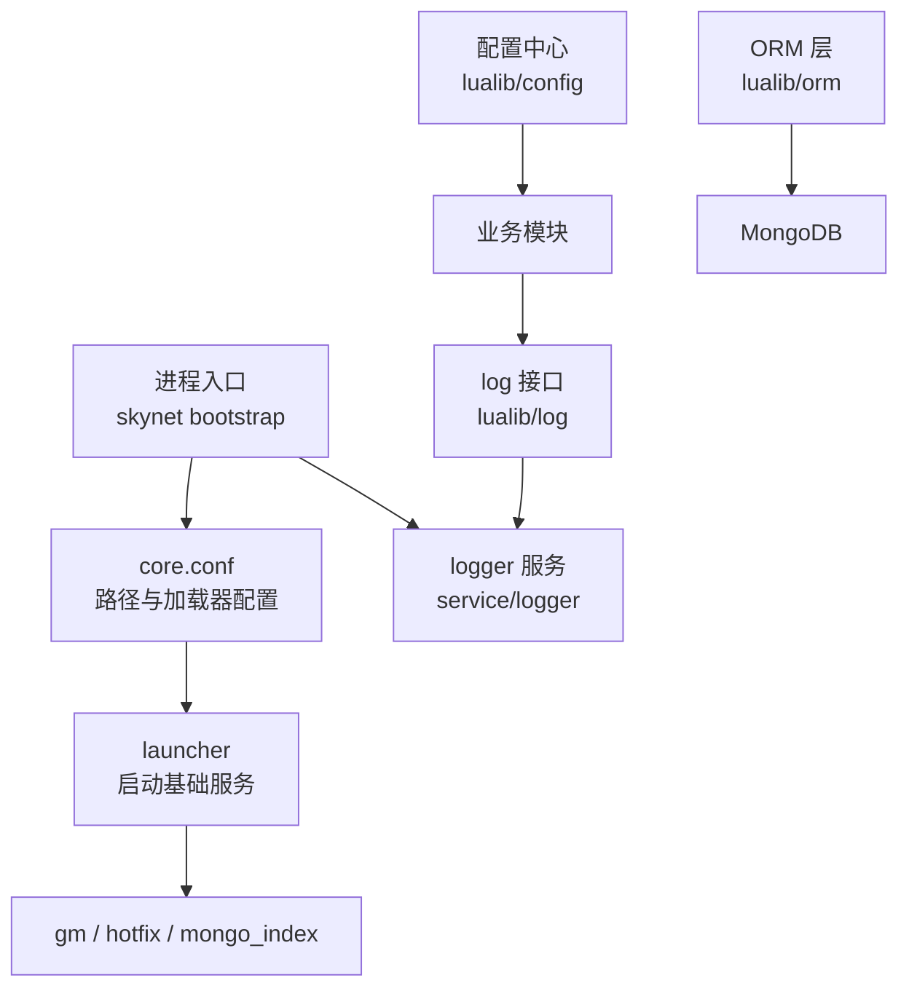
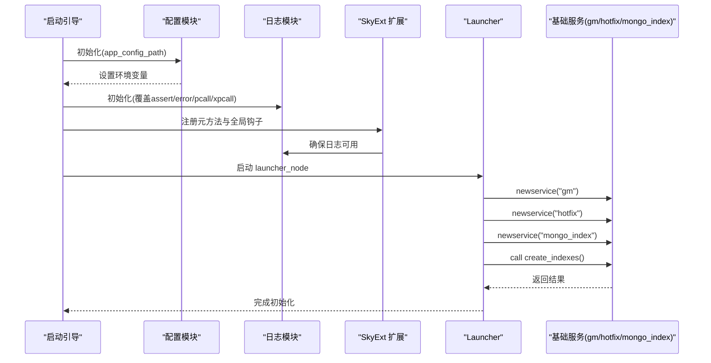
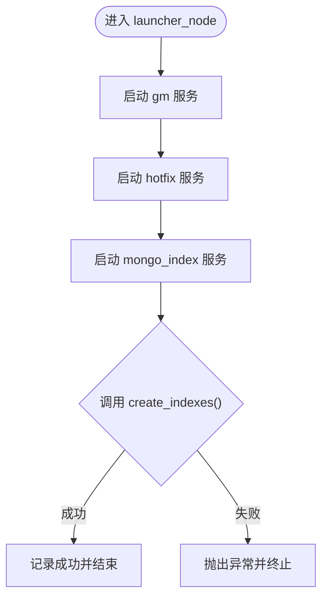
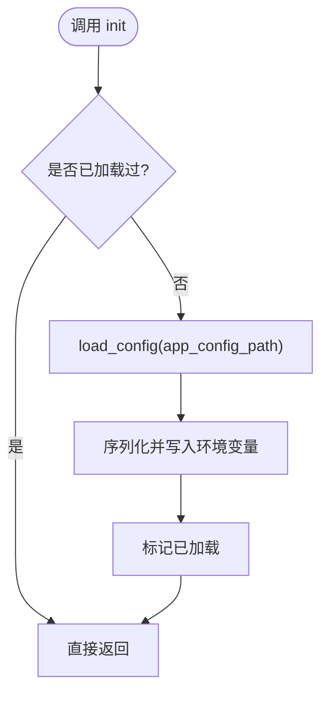
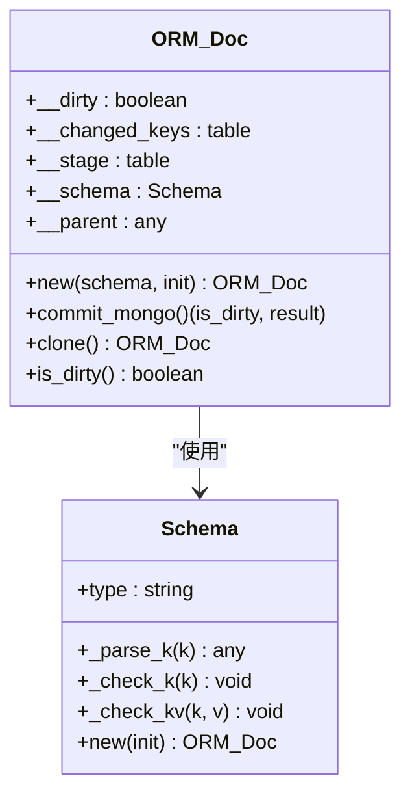
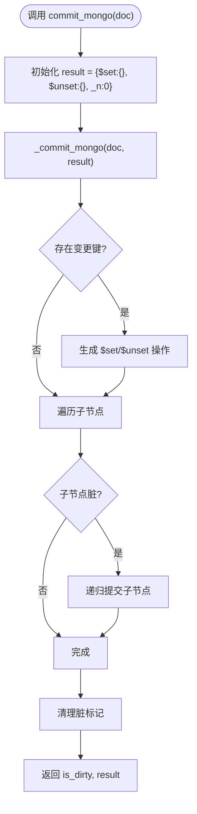
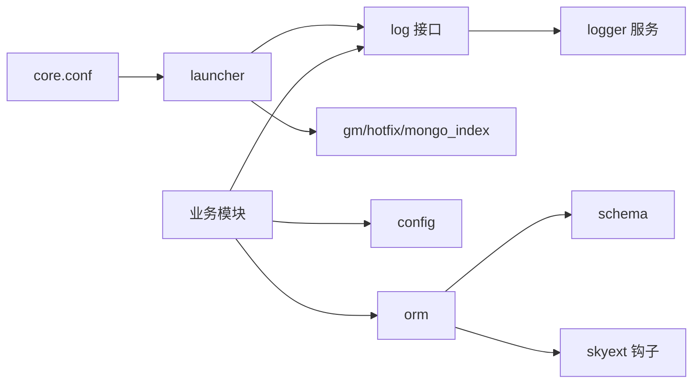

# 核心组件架构

<cite>
**本文引用的文件**
- [skyext.lua](file://lualib/skyext.lua)
- [launcher.lua](file://lualib/launcher.lua)
- [config.lua](file://lualib/config.lua)
- [init.lua](file://lualib/log/init.lua)
- [logger.lua](file://lualib/log/logger.lua)
- [start.lua](file://service/logger/start.lua)
- [main.lua](file://service/logger/main.lua)
- [core.conf.lua](file://etc/core.conf.lua)
- [role1.conf.lua](file://etc/role1.conf.lua)
- [init.lua](file://lualib/orm/init.lua)
- [schema.lua](file://lualib/orm/schema.lua)
</cite>

## 目录
1. [简介](#简介)
2. [项目结构](#项目结构)
3. [核心组件](#核心组件)
4. [架构总览](#架构总览)
5. [详细组件分析](#详细组件分析)
6. [依赖关系分析](#依赖关系分析)
7. [性能考量](#性能考量)
8. [故障排查指南](#故障排查指南)
9. [结论](#结论)
10. [附录](#附录)

## 简介
本文件面向 SkyExt 框架的核心组件架构，围绕 Launcher、Config、ORM、Logger 四大组件进行系统化说明。内容涵盖设计理念、职责边界、生命周期与资源管理、组件间依赖与调用顺序、扩展点与自定义开发指南、交互图与架构图，以及性能特性与使用注意事项。目标是帮助读者快速理解并高效使用这些组件，同时为二次开发与问题定位提供清晰指引。

## 项目结构
SkyExt 基于 skynet 服务模型构建，核心库位于 lualib，服务实现位于 service，配置位于 etc，应用逻辑位于 app。启动时通过 core.conf 指定路径与加载器，并通过 launcher 初始化关键服务（如 gm、hotfix、mongo_index）。日志子系统由独立的 logger 服务承载，业务模块通过 log 接口统一输出结构化日志。ORM 层基于 schema 定义生成类型化文档对象，支持脏标记与增量提交到 MongoDB。



图表来源
- [core.conf.lua:1-30](file://etc/core.conf.lua#L1-L30)
- [launcher.lua:1-20](file://lualib/launcher.lua#L1-L20)
- [start.lua:1-84](file://service/logger/start.lua#L1-L84)
- [init.lua:1-58](file://lualib/log/init.lua#L1-L58)

章节来源
- [core.conf.lua:1-30](file://etc/core.conf.lua#L1-L30)
- [role1.conf.lua:1-4](file://etc/role1.conf.lua#L1-L4)
- [launcher.lua:1-20](file://lualib/launcher.lua#L1-L20)

## 核心组件
- Launcher：负责在进程启动阶段创建必要的基础服务，并执行一次性初始化任务（例如自动创建数据库索引）。
- Config：集中管理运行时配置，支持从环境变量读取、解析复杂表结构，并提供类型安全的访问方法。
- ORM：提供类型化的数据模型与变更追踪，支持嵌套结构与数组，生成最小化的更新指令并提交至 MongoDB。
- Logger：统一的日志基础设施，支持结构化日志、错误堆栈捕获、过载保护与外部服务化存储。

章节来源
- [launcher.lua:1-20](file://lualib/launcher.lua#L1-L20)
- [config.lua:1-145](file://lualib/config.lua#L1-L145)
- [init.lua:1-491](file://lualib/orm/init.lua#L1-L491)
- [logger.lua:1-291](file://lualib/log/logger.lua#L1-L291)
- [init.lua:1-58](file://lualib/log/init.lua#L1-L58)

## 架构总览
SkyExt 的启动流程以 skynet 为核心，先加载 core.conf 中的路径与加载器，再由 launcher 拉起 gm、hotfix、mongo_index 等服务；日志子系统作为独立服务运行，业务模块通过 log 接口写入日志，最终由 logger 服务持久化或转发。ORM 层在业务代码中构造类型化文档对象，并在提交时生成 $set/$unset 等增量操作。



图表来源
- [config.lua:120-142](file://lualib/config.lua#L120-L142)
- [init.lua:1-58](file://lualib/log/init.lua#L1-L58)
- [skyext.lua:61-80](file://lualib/skyext.lua#L61-L80)
- [launcher.lua:6-17](file://lualib/launcher.lua#L6-L17)

## 详细组件分析

### Launcher 组件
- 职责边界
  - 进程级初始化：创建 gm、hotfix、mongo_index 服务。
  - 一次性任务：调用 mongo_index 创建索引，完成后终止临时服务。
- 生命周期与资源管理
  - 在 launcher_node 中按序创建服务，等待索引创建成功后再退出该阶段。
  - 通过 kill 释放临时服务资源，避免长期占用。
- 扩展点
  - 可在 launcher_node 中追加其他基础服务的启动逻辑。
- 调用顺序
  - 先启动 gm、hotfix，再启动 mongo_index 并等待其完成索引创建。



图表来源
- [launcher.lua:6-17](file://lualib/launcher.lua#L6-L17)

章节来源
- [launcher.lua:6-17](file://lualib/launcher.lua#L6-L17)

### Config 组件
- 设计理念
  - 单一配置源：通过 app_config_path 加载应用配置，将结果序列化后写入环境变量，供各模块统一读取。
  - 类型安全：提供 get/get_boolean/get_number/get_table 等方法，减少类型转换错误。
- 生命周期与资源管理
  - init 仅在首次调用时加载配置，后续直接返回缓存值。
  - 使用 load 动态执行配置脚本，注意安全性与性能。
- 扩展点
  - 可自定义 include 行为或增加新的配置类型解析。
- 使用注意事项
  - 配置文件中应避免敏感信息硬编码；必要时结合环境变量注入。



图表来源
- [config.lua:88-142](file://lualib/config.lua#L88-L142)

章节来源
- [config.lua:6-72](file://lualib/config.lua#L6-L72)
- [config.lua:88-142](file://lualib/config.lua#L88-L142)

### ORM 组件
- 设计理念
  - 类型化文档：基于 schema 定义创建文档对象，字段访问与赋值均受类型约束。
  - 变更追踪：维护 __dirty、__changed_keys、__stage 等状态，支持增量提交。
  - 嵌套与数组：支持嵌套结构与数组元素，自动处理父子关系与脏标记传播。
- 数据结构与复杂度
  - 变更收集：O(k) 遍历 changed_keys，k 为变更字段数。
  - 提交生成：递归遍历嵌套结构，时间复杂度 O(n)，n 为节点总数。
- 依赖关系
  - 与 skyext 的全局元方法钩子协作，使 ORM 文档对象兼容 table 操作。
  - 与 schema 模块配合，提供类型校验与键解析。
- 提交流程
  - commit_mongo 生成 { "$set": {}, "$unset": {} } 形式的增量指令，仅包含实际变更。



图表来源
- [init.lua:234-295](file://lualib/orm/init.lua#L234-L295)
- [schema.lua:163-185](file://lualib/orm/schema.lua#L163-L185)



图表来源
- [init.lua:348-447](file://lualib/orm/init.lua#L348-L447)

章节来源
- [init.lua:1-491](file://lualib/orm/init.lua#L1-L491)
- [schema.lua:1-471](file://lualib/orm/schema.lua#L1-L471)
- [skyext.lua:9-59](file://lualib/skyext.lua#L9-L59)

### Logger 组件
- 设计理念
  - 结构化日志：以 key-value 形式记录事件，便于检索与分析。
  - 错误增强：error 级别自动附加堆栈信息；sys_assert/sys_error 提供系统级断言与错误上报。
  - 安全封装：safe_pcall/safe_xpcall 在错误上下文中计数，避免重复堆栈抓取。
- 生命周期与资源管理
  - 初始化时读取配置并覆盖全局 assert/error/pcall/xpcall，确保异常路径也能被正确记录。
  - 日志服务通过 bucket 缓冲批量写入，支持过载丢弃策略。
- 扩展点
  - 可通过 config 调整 level、log_src、log_table、stack_level 等参数。
  - 可替换 traceback 函数以定制堆栈格式。
- 使用注意事项
  - 避免在高频路径中打印大对象；合理设置 log_table 与最大长度限制。

```mermaid
sequenceDiagram
participant App as "业务模块"
participant Log as "log 接口"
participant L as "logger 实例"
participant B as "bucket"
participant LS as "logger 服务"
App->>Log : info/debug/warn/error(...)
Log->>L : _pack_events(...), 过滤级别
L->>B : put(record)
B->>LS : 异步写入/持久化
Note over L,B : error 级别附加堆栈; safe_pcall/xpcall 计数
```

图表来源
- [init.lua:1-58](file://lualib/log/init.lua#L1-L58)
- [logger.lua:70-129](file://lualib/log/logger.lua#L70-L129)
- [start.lua:52-75](file://service/logger/start.lua#L52-L75)

章节来源
- [init.lua:1-58](file://lualib/log/init.lua#L1-L58)
- [logger.lua:1-291](file://lualib/log/logger.lua#L1-L291)
- [start.lua:1-84](file://service/logger/start.lua#L1-L84)
- [main.lua:1-18](file://service/logger/main.lua#L1-L18)

## 依赖关系分析
- 启动依赖
  - core.conf 指定 lua_path、luaservice、lualoader、preload 等，决定模块加载顺序。
  - launcher 依赖 log 与 skynet 服务管理。
- 运行时依赖
  - 业务模块依赖 config 获取配置；依赖 log 输出日志；依赖 orm 进行数据建模与提交。
  - ORM 依赖 skyext 的全局元方法钩子以兼容 table 操作；依赖 schema 进行类型校验。
  - Logger 依赖 bucket 与 logger 服务进行异步持久化。



图表来源
- [core.conf.lua:1-30](file://etc/core.conf.lua#L1-L30)
- [launcher.lua:1-20](file://lualib/launcher.lua#L1-L20)
- [init.lua:1-58](file://lualib/log/init.lua#L1-L58)
- [init.lua:1-491](file://lualib/orm/init.lua#L1-L491)
- [schema.lua:1-471](file://lualib/orm/schema.lua#L1-L471)
- [skyext.lua:1-81](file://lualib/skyext.lua#L1-L81)

章节来源
- [core.conf.lua:1-30](file://etc/core.conf.lua#L1-L30)
- [launcher.lua:1-20](file://lualib/launcher.lua#L1-L20)
- [init.lua:1-58](file://lualib/log/init.lua#L1-L58)
- [init.lua:1-491](file://lualib/orm/init.lua#L1-L491)
- [schema.lua:1-471](file://lualib/orm/schema.lua#L1-L471)
- [skyext.lua:1-81](file://lualib/skyext.lua#L1-L81)

## 性能考量
- Config
  - 配置加载仅一次，后续读取为常量时间；但 load 动态执行配置脚本可能带来开销，建议避免复杂计算。
- ORM
  - 变更追踪采用增量方式，commit_mongo 仅提交实际变化；嵌套结构递归遍历，注意控制层级深度与对象大小。
  - 序列化期间切换 pairs 实现以减少默认值与 BSON 兼容性问题。
- Logger
  - 结构化日志减少字符串拼接成本；错误级别自动堆栈抓取，建议在高频路径谨慎使用 error。
  - 日志服务支持过载丢弃，避免阻塞业务线程。

[本节为通用性能指导，不直接分析具体文件]

## 故障排查指南
- 启动失败
  - logger 服务启动失败会写入 bootfail.log 并中止进程；检查日志服务配置与依赖服务是否正常。
- 配置加载失败
  - 若 app_config_path 未设置或加载失败，会抛出错误；确认环境变量与配置文件路径正确。
- ORM 提交异常
  - 循环引用会导致 totable 报错；确保数据模型无环。
  - 类型不匹配会在 schema 校验时报错；检查字段类型与赋值。
- 日志丢失或延迟
  - 检查 logger 服务是否正常运行；确认 bucket 配置与日志级别；在高负载下可能触发丢弃策略。

章节来源
- [main.lua:1-18](file://service/logger/main.lua#L1-L18)
- [config.lua:120-142](file://lualib/config.lua#L120-L142)
- [init.lua:100-118](file://lualib/orm/init.lua#L100-L118)
- [schema.lua:163-185](file://lualib/orm/schema.lua#L163-L185)
- [start.lua:52-75](file://service/logger/start.lua#L52-L75)

## 结论
SkyExt 的核心组件围绕“稳定启动、统一配置、类型化数据、可靠日志”展开。Launcher 保障基础服务就绪；Config 提供一致的配置访问；ORM 实现类型安全与增量提交；Logger 提供结构化与增强的错误处理能力。四者协同工作，形成高内聚、低耦合的服务化架构。遵循本文的使用建议与扩展点，可有效提升系统的可维护性与可扩展性。

[本节为总结性内容，不直接分析具体文件]

## 附录
- 扩展点清单
  - Launcher：在 launcher_node 中追加服务启动逻辑。
  - Config：自定义 include 行为或新增配置类型解析。
  - ORM：扩展 schema 定义与类型校验规则；利用 with_bson_encode_context 控制序列化上下文。
  - Logger：通过 config 调整日志行为；替换 traceback 函数；在 logger 服务中扩展 bucket 写入策略。
- 最佳实践
  - 在高频路径避免大对象日志；合理使用 ORM 的 clone 与 dirty 检查；配置项集中管理并版本化。

[本节为补充信息，不直接分析具体文件]