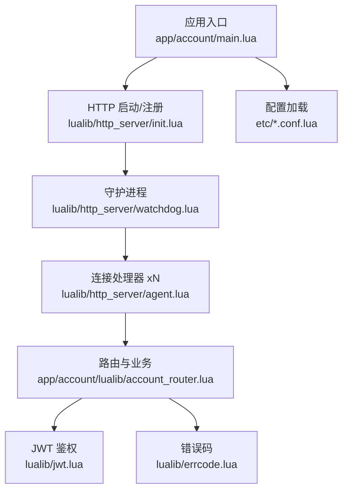
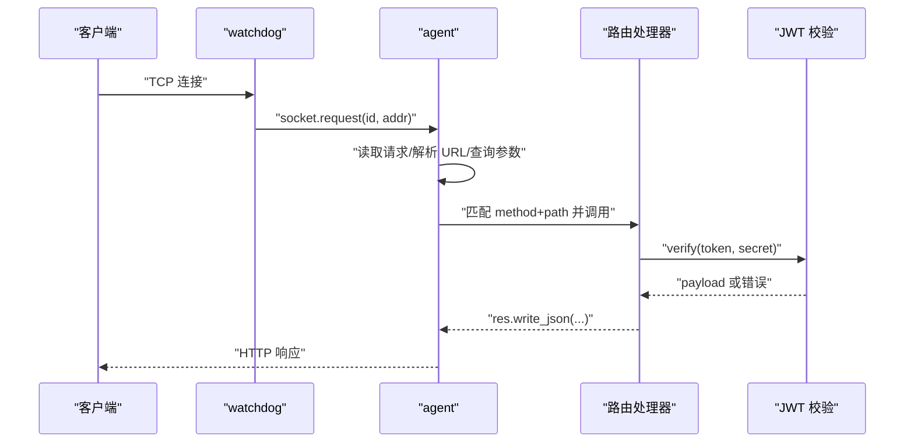
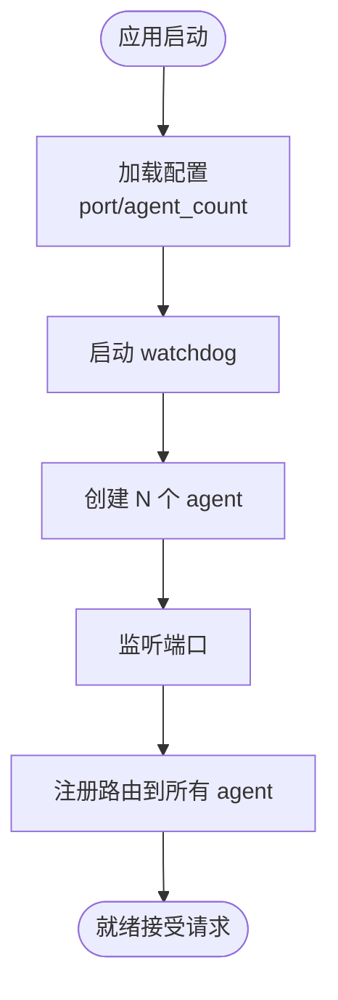
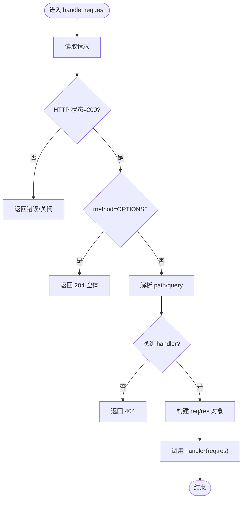
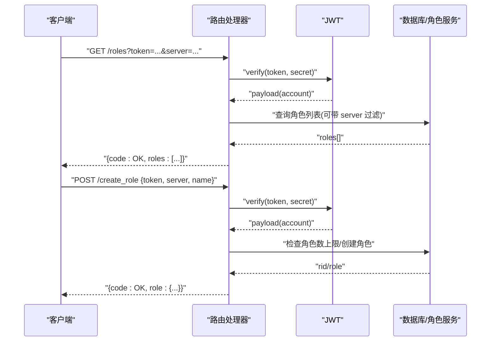
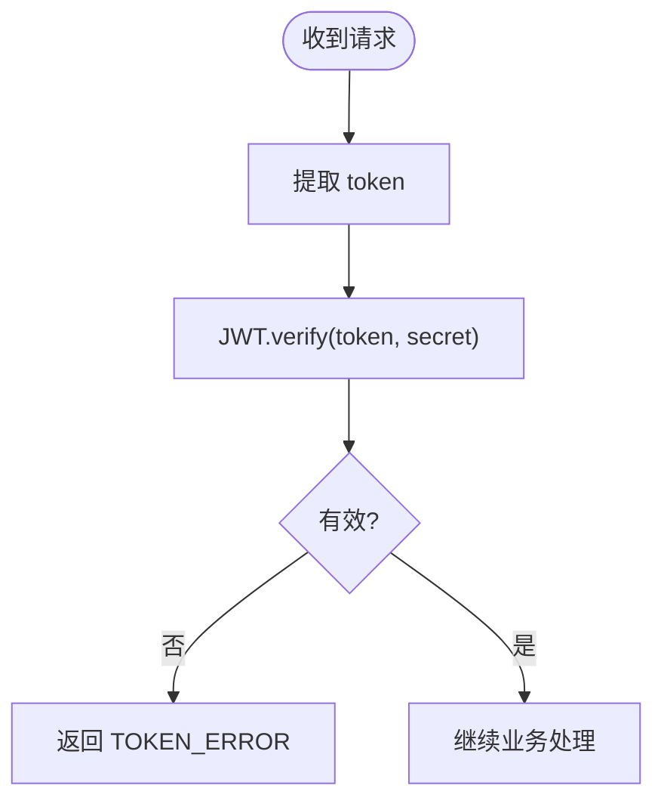
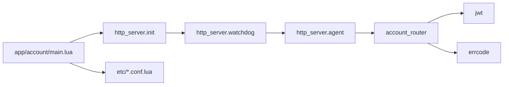

# HTTP 服务器

<cite>
**本文引用的文件**
- [lualib/http_server/init.lua](file://lualib/http_server/init.lua)
- [lualib/http_server/agent.lua](file://lualib/http_server/agent.lua)
- [lualib/http_server/watchdog.lua](file://lualib/http_server/watchdog.lua)
- [app/account/main.lua](file://app/account/main.lua)
- [app/account/lualib/account_router.lua](file://app/account/lualib/account_router.lua)
- [etc/core.conf.lua](file://etc/core.conf.lua)
- [etc/account1.conf.lua](file://etc/account1.conf.lua)
- [etc/app/account1.app.lua](file://etc/app/account1.app.lua)
- [etc/app/common.app.lua](file://etc/app/common.app.lua)
- [lualib/jwt.lua](file://lualib/jwt.lua)
- [lualib/errcode.lua](file://lualib/errcode.lua)
</cite>

## 目录
1. [简介](#简介)
2. [项目结构](#项目结构)
3. [核心组件](#核心组件)
4. [架构总览](#架构总览)
5. [详细组件分析](#详细组件分析)
6. [依赖关系分析](#依赖关系分析)
7. [性能与并发](#性能与并发)
8. [故障排查指南](#故障排查指南)
9. [结论](#结论)
10. [附录：配置与安全、监控指标](#附录：配置与安全监控指标)

## 简介
本技术文档围绕 SkyExt 框架的 HTTP 服务器模块，系统性阐述其架构设计、请求处理流程、路由系统、中间件机制（以 JWT 鉴权为例）、错误与异常处理、RESTful API 示例、文件读取能力、性能优化、并发模型、连接池管理、安全考量、监控指标与部署配置。目标是帮助开发者快速理解并高效使用该 HTTP 服务子系统。

## 项目结构
HTTP 服务器由三个核心 Lua 模块组成，配合应用入口与路由实现完整的 HTTP 处理能力：
- 启动与注册入口：http_server.init
- 守护进程与负载均衡：http_server.watchdog
- 单连接处理器：http_server.agent
- 应用启动：app/account/main.lua
- 路由与业务：app/account/lualib/account_router.lua
- 配置：etc/core.conf.lua、etc/account1.conf.lua、etc/app/account1.app.lua、etc/app/common.app.lua
- 鉴权：lualib/jwt.lua
- 错误码：lualib/errcode.lua

图表来源
- [lualib/http_server/init.lua:8-20](file://lualib/http_server/init.lua#L8-L20)
- [lualib/http_server/watchdog.lua:13-39](file://lualib/http_server/watchdog.lua#L13-L39)
- [lualib/http_server/agent.lua:31-118](file://lualib/http_server/agent.lua#L31-L118)
- [app/account/main.lua:7-16](file://app/account/main.lua#L7-L16)
- [app/account/lualib/account_router.lua:15-18](file://app/account/lualib/account_router.lua#L15-L18)

章节来源
- [lualib/http_server/init.lua:8-20](file://lualib/http_server/init.lua#L8-L20)
- [lualib/http_server/watchdog.lua:13-39](file://lualib/http_server/watchdog.lua#L13-L39)
- [lualib/http_server/agent.lua:31-118](file://lualib/http_server/agent.lua#L31-L118)
- [app/account/main.lua:7-16](file://app/account/main.lua#L7-L16)
- [etc/core.conf.lua:1-30](file://etc/core.conf.lua#L1-L30)
- [etc/account1.conf.lua:1-4](file://etc/account1.conf.lua#L1-L4)
- [etc/app/account1.app.lua:1-21](file://etc/app/account1.app.lua#L1-L21)

## 核心组件
- http_server.init：对外暴露 start(conf) 与 register_router(router_name)，负责创建 watchdog 并转发注册命令。
- http_server.watchdog：根据配置创建多个 agent 子服务，监听端口并将新连接轮询分发给 agent；同时广播路由注册到所有 agent。
- http_server.agent：维护每个连接的请求生命周期，解析 HTTP 请求、匹配路由、调用处理器、写回响应；提供 req/res 辅助方法（parse_query、read_json、write_json、write_file）。
- app/account/main.lua：应用启动时读取配置，启动 HTTP 服务并注册路由。
- app/account/lualib/account_router.lua：定义 GET/POST 路由及业务逻辑，包含 JWT 校验、角色查询与创建等。
- lualib/jwt.lua：实现 JWT 签发与验证（HS256/HS512），支持 nbf/iat/exp 时间校验。
- lualib/errcode.lua：统一错误码常量，便于接口返回标准化。

章节来源
- [lualib/http_server/init.lua:8-20](file://lualib/http_server/init.lua#L8-L20)
- [lualib/http_server/watchdog.lua:13-39](file://lualib/http_server/watchdog.lua#L13-L39)
- [lualib/http_server/agent.lua:20-118](file://lualib/http_server/agent.lua#L20-L118)
- [app/account/main.lua:7-16](file://app/account/main.lua#L7-L16)
- [app/account/lualib/account_router.lua:15-143](file://app/account/lualib/account_router.lua#L15-L143)
- [lualib/jwt.lua:17-100](file://lualib/jwt.lua#L17-L100)
- [lualib/errcode.lua:1-29](file://lualib/errcode.lua#L1-L29)

## 架构总览
HTTP 服务器采用“守护进程 + 多 Agent”的并发模型：
- watchdog 监听 TCP 端口，使用简单轮询将连接分发到 N 个 agent。
- 每个 agent 独立处理一个连接上的完整 HTTP 请求/响应循环。
- 路由表按 method -> path -> handler 组织，支持动态注册。
- 请求体大小限制通过配置注入，避免过大请求占用资源。
- 响应统一携带跨域头，简化前端集成。

图表来源
- [lualib/http_server/watchdog.lua:22-33](file://lualib/http_server/watchdog.lua#L22-L33)
- [lualib/http_server/agent.lua:31-118](file://lualib/http_server/agent.lua#L31-L118)
- [app/account/lualib/account_router.lua:24-59](file://app/account/lualib/account_router.lua#L24-L59)
- [lualib/jwt.lua:17-67](file://lualib/jwt.lua#L17-L67)

## 详细组件分析

### 启动与路由注册流程
- 应用启动时读取配置，构造 conf{port, agent_count}，调用 http_server.start 启动守护进程。
- 随后调用 http_server.register_router("account_router")，将路由模块名广播至所有 agent。
- watchdog 内部为每个 agent 发送 register_router 指令，agent 内 require 路由模块并合并到内存路由表。

图表来源
- [app/account/main.lua:7-16](file://app/account/main.lua#L7-L16)
- [lualib/http_server/init.lua:8-20](file://lualib/http_server/init.lua#L8-L20)
- [lualib/http_server/watchdog.lua:13-39](file://lualib/http_server/watchdog.lua#L13-L39)
- [lualib/http_server/agent.lua:156-168](file://lualib/http_server/agent.lua#L156-L168)

章节来源
- [app/account/main.lua:7-16](file://app/account/main.lua#L7-L16)
- [lualib/http_server/init.lua:8-20](file://lualib/http_server/init.lua#L8-L20)
- [lualib/http_server/watchdog.lua:13-39](file://lualib/http_server/watchdog.lua#L13-L39)
- [lualib/http_server/agent.lua:156-168](file://lualib/http_server/agent.lua#L156-L168)

### 请求处理与路由匹配
- 每个 agent 在 SOCKET.request 中启动 socket，封装 read/write 接口，调用 handle_request。
- handle_request 读取请求，若状态非 200 直接返回；OPTIONS 预检请求直接返回 204。
- 解析 URL 得到 path 与 query，查找 method_routers[path] 对应的 handler。
- 未找到路由返回 404，未支持的方法返回 405。
- 构建 req 对象，提供 parse_query/read_json 辅助；构建 res 对象，提供 write/write_json/write_file。
- 调用 handler(req, res) 完成业务处理并写回响应。

图表来源
- [lualib/http_server/agent.lua:31-118](file://lualib/http_server/agent.lua#L31-L118)

章节来源
- [lualib/http_server/agent.lua:31-118](file://lualib/http_server/agent.lua#L31-L118)

### 路由与业务示例（RESTful API）
- GET /roles：从查询参数获取 token，校验 JWT，按 server 过滤角色列表，补充 rolenode 信息后返回。
- POST /create_role：从 JSON Body 读取 token、server、name，校验 JWT，检查角色数量上限，创建角色并返回。

图表来源
- [app/account/lualib/account_router.lua:24-59](file://app/account/lualib/account_router.lua#L24-L59)
- [app/account/lualib/account_router.lua:61-140](file://app/account/lualib/account_router.lua#L61-L140)
- [lualib/jwt.lua:17-67](file://lualib/jwt.lua#L17-L67)

章节来源
- [app/account/lualib/account_router.lua:24-59](file://app/account/lualib/account_router.lua#L24-L59)
- [app/account/lualib/account_router.lua:61-140](file://app/account/lualib/account_router.lua#L61-L140)
- [lualib/jwt.lua:17-67](file://lualib/jwt.lua#L17-L67)
- [lualib/errcode.lua:1-29](file://lualib/errcode.lua#L1-L29)

### 认证中间件（基于 JWT）
- 在路由处理器中统一校验 token，失败返回 TOKEN_ERROR。
- 支持 HS256/HS512 算法，校验 header.typ、alg，解码 payload，验证签名与时间字段（nbf/iat/exp）。
- 建议将 JWT 校验抽取为公共中间件，减少重复代码。

图表来源
- [app/account/lualib/account_router.lua:24-34](file://app/account/lualib/account_router.lua#L24-L34)
- [app/account/lualib/account_router.lua:61-71](file://app/account/lualib/account_router.lua#L61-L71)
- [lualib/jwt.lua:17-67](file://lualib/jwt.lua#L17-L67)

章节来源
- [app/account/lualib/account_router.lua:24-34](file://app/account/lualib/account_router.lua#L24-L34)
- [app/account/lualib/account_router.lua:61-71](file://app/account/lualib/account_router.lua#L61-L71)
- [lualib/jwt.lua:17-67](file://lualib/jwt.lua#L17-L67)

### 请求参数与响应数据
- 查询参数：req.parse_query() 返回键值对。
- JSON 请求体：req.read_json() 解析 body。
- 响应：
  - res.write(statuscode, bodyfunc, header)
  - res.write_json(data, header) 自动设置 content-type 为 application/json
  - res.write_file(filename, header) 读取静态文件内容并返回
- 默认响应头包含跨域相关字段，便于浏览器直调。

章节来源
- [lualib/http_server/agent.lua:77-116](file://lualib/http_server/agent.lua#L77-L116)

### 错误与异常处理
- 读取请求失败：区分 socket 关闭与解析错误，记录日志并终止处理。
- 未匹配路由：返回 404；不支持方法：返回 405。
- 业务错误：统一通过 errcode 常量返回结构化错误码。
- 异常捕获：handle_request 使用 xpcall 包裹，确保异常不导致进程崩溃，并记录堆栈。

章节来源
- [lualib/http_server/agent.lua:31-46](file://lualib/http_server/agent.lua#L31-L46)
- [lualib/http_server/agent.lua:63-75](file://lualib/http_server/agent.lua#L63-L75)
- [lualib/http_server/agent.lua:139-142](file://lualib/http_server/agent.lua#L139-L142)
- [lualib/errcode.lua:1-29](file://lualib/errcode.lua#L1-L29)

### 文件上传与静态文件
- 当前实现提供 res.write_file 用于返回静态文件内容。
- 文件上传需自行解析 multipart/form-data 并写入磁盘或对象存储，可在路由处理器中扩展。
- 建议增加缓存策略（如基于文件修改时间的 ETag/Last-Modified）以提升性能。

章节来源
- [lualib/http_server/agent.lua:108-116](file://lualib/http_server/agent.lua#L108-L116)

## 依赖关系分析
- 启动依赖：应用入口依赖 http_server.init；init 依赖 watchdog；watchdog 依赖 agent。
- 运行时依赖：agent 依赖 httpd、sockethelper、config、cjson、urllib、util.io。
- 业务依赖：路由处理器依赖 jwt、errcode、配置与数据库/角色服务。
- 配置依赖：core.conf 定义路径与服务发现；account1.conf 指定启动脚本；common.app 提供通用配置（Mongo、etcd、JWT 密钥等）。

图表来源
- [app/account/main.lua:7-16](file://app/account/main.lua#L7-L16)
- [lualib/http_server/init.lua:8-20](file://lualib/http_server/init.lua#L8-L20)
- [lualib/http_server/watchdog.lua:13-39](file://lualib/http_server/watchdog.lua#L13-L39)
- [lualib/http_server/agent.lua:31-118](file://lualib/http_server/agent.lua#L31-L118)
- [app/account/lualib/account_router.lua:15-143](file://app/account/lualib/account_router.lua#L15-L143)
- [etc/account1.conf.lua:1-4](file://etc/account1.conf.lua#L1-L4)
- [etc/app/common.app.lua:21-100](file://etc/app/common.app.lua#L21-L100)

章节来源
- [app/account/main.lua:7-16](file://app/account/main.lua#L7-L16)
- [lualib/http_server/init.lua:8-20](file://lualib/http_server/init.lua#L8-L20)
- [lualib/http_server/watchdog.lua:13-39](file://lualib/http_server/watchdog.lua#L13-L39)
- [lualib/http_server/agent.lua:31-118](file://lualib/http_server/agent.lua#L31-L118)
- [app/account/lualib/account_router.lua:15-143](file://app/account/lualib/account_router.lua#L15-L143)
- [etc/account1.conf.lua:1-4](file://etc/account1.conf.lua#L1-L4)
- [etc/app/common.app.lua:21-100](file://etc/app/common.app.lua#L21-L100)

## 性能与并发
- 并发模型：watchdog 使用轮询将连接分发到 N 个 agent，每个 agent 处理单个连接的完整请求/响应循环，适合高并发短连接场景。
- 连接池：HTTP 层无持久连接复用；数据库连接池在 common.app 中通过 mongo_config.connections 配置，建议根据 QPS 与延迟目标调整。
- 请求体限制：通过 http_request_body_size 控制最大请求体大小，防止大请求拖垮服务。
- 路由匹配：内存哈希表 O(1) 查找，路径粒度精确匹配，可扩展前缀匹配或正则匹配。
- 响应头：默认添加跨域头，减少前端 CORS 配置成本。
- 静态文件：当前为同步读取，建议引入缓存（内存/本地）与条件请求（ETag/Last-Modified）。
- 线程与进程：core.conf 中 thread 控制 Skynet 工作线程数，结合 agent_count 调节整体吞吐。

章节来源
- [lualib/http_server/watchdog.lua:22-33](file://lualib/http_server/watchdog.lua#L22-L33)
- [lualib/http_server/agent.lua:20-21](file://lualib/http_server/agent.lua#L20-L21)
- [etc/app/common.app.lua:31-72](file://etc/app/common.app.lua#L31-L72)
- [etc/app/common.app.lua:99-100](file://etc/app/common.app.lua#L99-L100)
- [etc/core.conf.lua:24-29](file://etc/core.conf.lua#L24-L29)

## 故障排查指南
- 无法启动 HTTP：检查端口是否被占用、agent_count 配置是否正确、luaservice 路径是否包含 app 目录。
- 路由未生效：确认已调用 register_router，且 router_name 指向的路由模块存在并导出 GET/POST 表。
- 404/405：检查请求方法与路径是否与路由一致；注意大小写与尾斜杠。
- JWT 校验失败：核对 login_jwt_secret 配置、token 格式、算法与时间字段。
- 数据库错误：检查 Mongo 连接配置、集合索引、网络连通性与权限。
- 日志定位：开启 log_level=DEBUG，查看 logs/skyext.log 与 logs/account.log 中的错误堆栈。

章节来源
- [lualib/http_server/agent.lua:31-46](file://lualib/http_server/agent.lua#L31-L46)
- [lualib/http_server/agent.lua:63-75](file://lualib/http_server/agent.lua#L63-L75)
- [app/account/lualib/account_router.lua:24-34](file://app/account/lualib/account_router.lua#L24-L34)
- [etc/app/common.app.lua:1-19](file://etc/app/common.app.lua#L1-L19)

## 结论
SkyExt 的 HTTP 服务器模块以简洁清晰的架构提供了高并发、易扩展的 Web 服务能力。通过 watchdog+agent 的并发模型、内存路由表、统一的响应封装与 JWT 鉴权，能够快速构建 RESTful API。结合合理的配置与监控，可满足游戏账号、角色管理等场景的 HTTP 需求。建议在后续迭代中增强中间件体系、静态文件缓存、限流与指标上报，进一步提升稳定性与可观测性。

## 附录：配置与安全、监控指标

### 关键配置项
- 端口与并发
  - port：HTTP 监听端口（默认 8080）
  - agent_count：HTTP 处理器数量（默认 8）
- 请求限制
  - http_request_body_size：最大请求体大小（默认 1MB）
- 数据库连接池
  - mongo_config.*.connections：各库连接数
- 日志
  - log_level：日志等级（DEBUG/INFO/WARN/ERROR/FATAL）
  - log_config：输出到文件与控制台
- 其他
  - login_jwt_secret：JWT 签名密钥
  - server2game：客户端可见的服务器映射

章节来源
- [etc/app/account1.app.lua:13-14](file://etc/app/account1.app.lua#L13-L14)
- [etc/app/common.app.lua:31-72](file://etc/app/common.app.lua#L31-L72)
- [etc/app/common.app.lua:90-100](file://etc/app/common.app.lua#L90-L100)
- [etc/core.conf.lua:24-29](file://etc/core.conf.lua#L24-L29)

### 安全建议
- 强制 HTTPS：在生产环境启用 TLS 终止（反向代理或网关）。
- 最小权限：JWT 仅包含必要字段，设置合理过期时间。
- 输入校验：严格校验 query/body/header，防止注入与越权。
- 速率限制：在网关或代理层实施限流与 IP 白名单。
- 敏感信息：密钥与证书通过环境变量或密钥管理服务注入。

### 监控指标（建议）
- 请求级：QPS、平均/分位耗时、错误率（4xx/5xx）
- 连接级：活跃连接数、新建/关闭连接速率
- 资源级：CPU、内存、GC 次数与耗时
- 业务级：JWT 校验失败率、数据库慢查询、角色创建成功率
- 采集方式：通过日志聚合与 Prometheus 指标导出（可扩展）