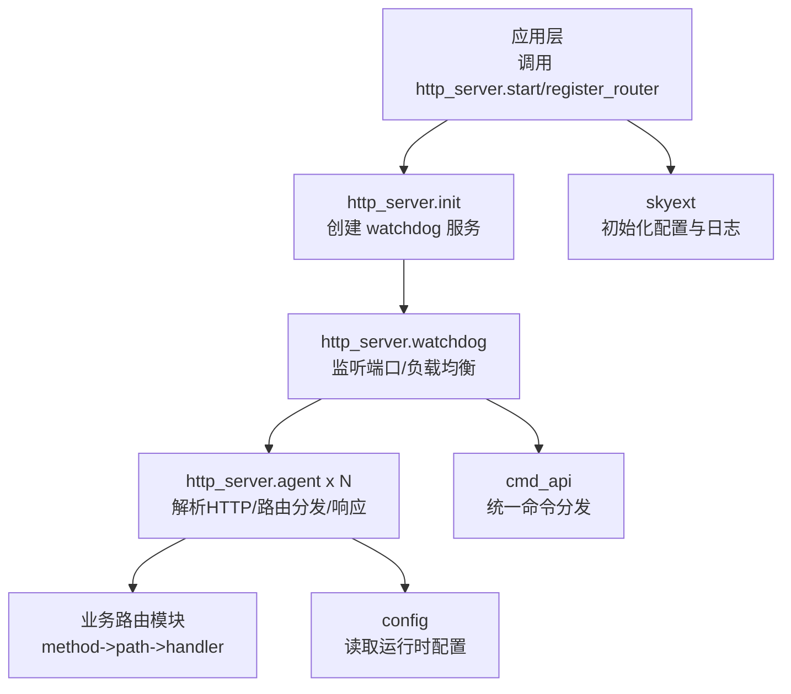
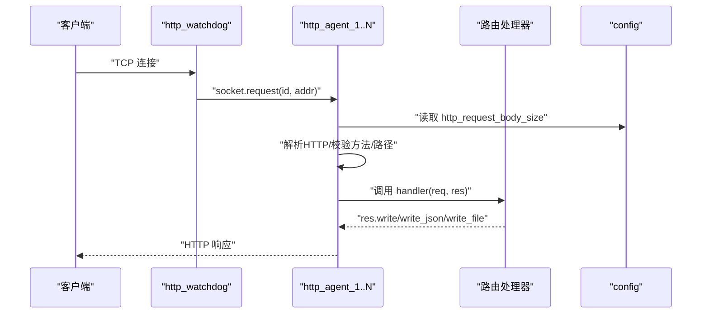
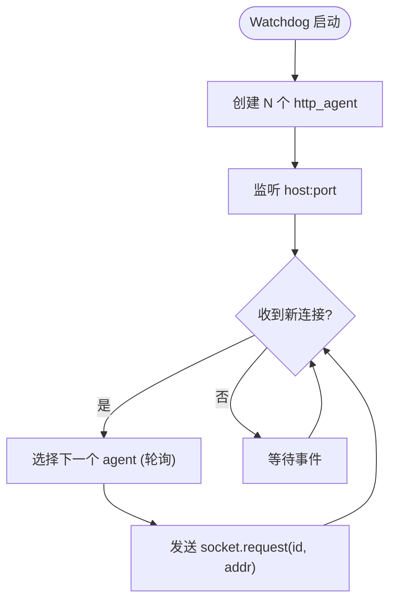
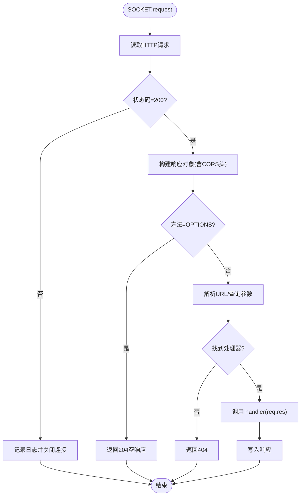
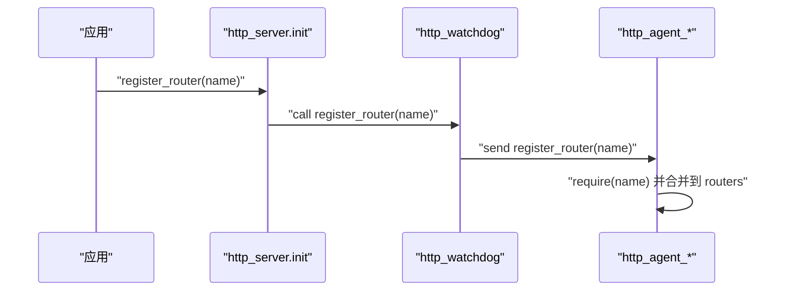
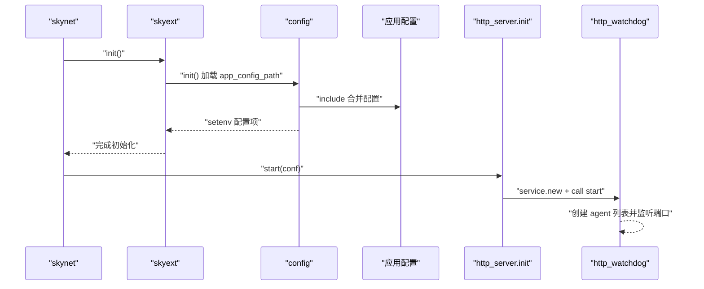
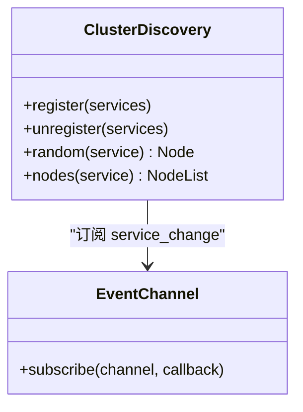
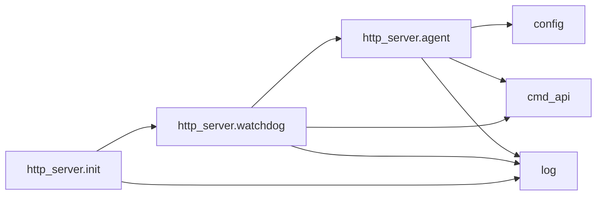

# HTTP 服务器架构

<cite>
**本文引用的文件**
- [lualib/http_server/init.lua](file://lualib/http_server/init.lua)
- [lualib/http_server/watchdog.lua](file://lualib/http_server/watchdog.lua)
- [lualib/http_server/agent.lua](file://lualib/http_server/agent.lua)
- [lualib/cmd_api.lua](file://lualib/cmd_api.lua)
- [lualib/config.lua](file://lualib/config.lua)
- [etc/core.conf.lua](file://etc/core.conf.lua)
- [etc/app/common.app.lua](file://etc/app/common.app.lua)
- [etc/app/role1.app.lua](file://etc/app/role1.app.lua)
- [lualib/skyext.lua](file://lualib/skyext.lua)
- [lualib/cluster_discovery.lua](file://lualib/cluster_discovery.lua)
</cite>

## 目录
1. [简介](#简介)
2. [项目结构](#项目结构)
3. [核心组件](#核心组件)
4. [架构总览](#架构总览)
5. [详细组件分析](#详细组件分析)
6. [依赖关系分析](#依赖关系分析)
7. [性能考虑](#性能考虑)
8. [故障排查指南](#故障排查指南)
9. [结论](#结论)
10. [附录](#附录)

## 简介
本技术文档围绕 SkyExt 框架的 HTTP 服务器架构，系统性阐述其设计模式、服务发现机制、Watchdog 守护进程职责、请求处理生命周期、启动流程、配置管理、服务注册与发现、错误处理与监控。文档包含架构图与交互流程图，说明模块间依赖与数据流向，并提供性能优化建议与故障排查指南，帮助读者快速理解并高效运维该 HTTP 子系统。

## 项目结构
HTTP 服务器由三个核心 Lua 模块组成：入口初始化、Watchdog 守护进程、Agent 工作进程；配合统一的命令分发与配置加载模块，形成高内聚、低耦合的服务模型。

图表来源
- [lualib/http_server/init.lua:8-20](file://lualib/http_server/init.lua#L8-L20)
- [lualib/http_server/watchdog.lua:13-43](file://lualib/http_server/watchdog.lua#L13-L43)
- [lualib/http_server/agent.lua:31-118](file://lualib/http_server/agent.lua#L31-L118)
- [lualib/cmd_api.lua:13-43](file://lualib/cmd_api.lua#L13-L43)
- [lualib/config.lua:6-72](file://lualib/config.lua#L6-L72)
- [lualib/skyext.lua:61-80](file://lualib/skyext.lua#L61-L80)

章节来源
- [lualib/http_server/init.lua:1-22](file://lualib/http_server/init.lua#L1-L22)
- [lualib/http_server/watchdog.lua:1-45](file://lualib/http_server/watchdog.lua#L1-L45)
- [lualib/http_server/agent.lua:1-170](file://lualib/http_server/agent.lua#L1-L170)
- [lualib/cmd_api.lua:1-46](file://lualib/cmd_api.lua#L1-L46)
- [lualib/config.lua:1-145](file://lualib/config.lua#L1-L145)
- [etc/core.conf.lua:1-30](file://etc/core.conf.lua#L1-L30)
- [etc/app/common.app.lua:1-100](file://etc/app/common.app.lua#L1-L100)
- [etc/app/role1.app.lua:1-30](file://etc/app/role1.app.lua#L1-L30)
- [lualib/skyext.lua:1-81](file://lualib/skyext.lua#L1-L81)

## 核心组件
- http_server.init：对外暴露 start 与 register_router 两个接口，负责创建 watchdog 服务并通知其启动，以及将路由表广播到所有 agent。
- http_server.watchdog：守护进程，负责创建多个 http_agent 工作进程，监听 TCP 端口，使用轮询方式将连接分发给 agent。
- http_server.agent：HTTP 协议解析、路由匹配、请求体大小限制、CORS 头设置、JSON 读写、静态文件返回、异常捕获与日志记录。
- cmd_api：统一命令分发器，支持普通命令与 socket 子命令分发。
- config：从环境变量或配置文件加载配置，提供 get/get_number/get_boolean/get_table 等访问方法。
- skyext：在 skynet init 阶段加载配置与日志，确保全局可用。

章节来源
- [lualib/http_server/init.lua:8-20](file://lualib/http_server/init.lua#L8-L20)
- [lualib/http_server/watchdog.lua:13-43](file://lualib/http_server/watchdog.lua#L13-L43)
- [lualib/http_server/agent.lua:20-118](file://lualib/http_server/agent.lua#L20-L118)
- [lualib/cmd_api.lua:13-43](file://lualib/cmd_api.lua#L13-L43)
- [lualib/config.lua:6-72](file://lualib/config.lua#L6-L72)
- [lualib/skyext.lua:61-80](file://lualib/skyext.lua#L61-L80)

## 架构总览
HTTP 服务器采用“单监听多工作进程”的并发模型：watchdog 作为唯一监听端点，接收新连接后通过轮询分配给多个 agent；每个 agent 独立维护路由表，解析 HTTP 请求并执行对应处理器。

图表来源
- [lualib/http_server/watchdog.lua:13-33](file://lualib/http_server/watchdog.lua#L13-L33)
- [lualib/http_server/agent.lua:31-118](file://lualib/http_server/agent.lua#L31-L118)
- [lualib/config.lua:40-53](file://lualib/config.lua#L40-L53)

## 详细组件分析

### Watchdog 守护进程
- 职责：创建固定数量的 http_agent 实例；监听指定 host:port；以轮询方式将新连接分发给 agent；向所有 agent 广播路由注册。
- 关键行为：
  - 启动时根据配置创建 agent 列表，保存引用。
  - 监听 socket 后，为每个新连接选择下一个 agent（balance 计数器循环）。
  - 提供 register_router 命令，遍历 agents 发送路由注册消息。

图表来源
- [lualib/http_server/watchdog.lua:13-33](file://lualib/http_server/watchdog.lua#L13-L33)

章节来源
- [lualib/http_server/watchdog.lua:13-43](file://lualib/http_server/watchdog.lua#L13-L43)

### Agent 工作进程
- 职责：实现 HTTP 协议解析、请求体大小限制、CORS 头注入、OPTIONS 预检处理、路由匹配、JSON 编解码、静态文件返回、异常捕获与日志。
- 关键行为：
  - 通过 http.httpd.read_request 读取请求，若失败则区分 socket_error 与一般错误并记录日志。
  - 构造响应对象 res，内置 write/write_json/write_file 方法，自动合并 CORS 头。
  - 路由表 routers 按 method->path->handler 组织，未命中返回 404，不支持的方法返回 405。
  - 使用 xpcall 包裹请求处理，保证异常不导致进程崩溃，并记录堆栈信息。

图表来源
- [lualib/http_server/agent.lua:31-118](file://lualib/http_server/agent.lua#L31-L118)

章节来源
- [lualib/http_server/agent.lua:31-118](file://lualib/http_server/agent.lua#L31-L118)

### 路由注册与发现
- 入口：应用侧调用 http_server.register_router(router_name)。
- 传播：init 模块查询 watchdog 服务地址，调用其 register_router 命令。
- 分发：watchdog 遍历所有 agent，发送 register_router 命令，各 agent 动态 require 路由模块并合并到本地 routers 表。

图表来源
- [lualib/http_server/init.lua:13-20](file://lualib/http_server/init.lua#L13-L20)
- [lualib/http_server/watchdog.lua:35-39](file://lualib/http_server/watchdog.lua#L35-L39)
- [lualib/http_server/agent.lua:156-168](file://lualib/http_server/agent.lua#L156-L168)

章节来源
- [lualib/http_server/init.lua:13-20](file://lualib/http_server/init.lua#L13-L20)
- [lualib/http_server/watchdog.lua:35-39](file://lualib/http_server/watchdog.lua#L35-L39)
- [lualib/http_server/agent.lua:156-168](file://lualib/http_server/agent.lua#L156-L168)

### 配置管理与启动流程
- 启动阶段：
  - skyext 在 skynet.init 中加载 config 并调用 init，将 app_config_path 指向的应用配置解析并写入环境变量。
  - core.conf 定义 lua_path、luaservice、bootstrap 等基础运行环境。
  - 应用配置 role1.app.lua 与 common.app.lua 组合出完整配置，包括 etcd、mongo、日志、JWT、HTTP 请求体大小等。
- 运行时：
  - http_server.init.start 创建 watchdog 并传入 conf（如 port、agent_count、host）。
  - agent 通过 config.get_number("http_request_body_size") 获取请求体大小限制。

图表来源
- [lualib/skyext.lua:61-80](file://lualib/skyext.lua#L61-L80)
- [lualib/config.lua:88-142](file://lualib/config.lua#L88-L142)
- [etc/core.conf.lua:1-30](file://etc/core.conf.lua#L1-L30)
- [etc/app/role1.app.lua:1-30](file://etc/app/role1.app.lua#L1-L30)
- [etc/app/common.app.lua:1-100](file://etc/app/common.app.lua#L1-L100)
- [lualib/http_server/init.lua:8-11](file://lualib/http_server/init.lua#L8-L11)

章节来源
- [lualib/skyext.lua:61-80](file://lualib/skyext.lua#L61-L80)
- [lualib/config.lua:88-142](file://lualib/config.lua#L88-L142)
- [etc/core.conf.lua:1-30](file://etc/core.conf.lua#L1-L30)
- [etc/app/role1.app.lua:1-30](file://etc/app/role1.app.lua#L1-L30)
- [etc/app/common.app.lua:1-100](file://etc/app/common.app.lua#L1-L100)
- [lualib/http_server/init.lua:8-11](file://lualib/http_server/init.lua#L8-L11)

### 服务发现机制（集群）
- cluster_discovery 提供服务的注册、注销、查询与变更订阅能力。
- 通过 event_channel_api 订阅 service_change 事件，更新节点列表，供上层按需随机选取节点。
- 虽然 HTTP 服务器本身不直接依赖它，但可与 GM、角色服务等结合，实现跨服务发现与负载均衡。

图表来源
- [lualib/cluster_discovery.lua:11-20](file://lualib/cluster_discovery.lua#L11-L20)
- [lualib/cluster_discovery.lua:62-76](file://lualib/cluster_discovery.lua#L62-L76)
- [lualib/cluster_discovery.lua:79-92](file://lualib/cluster_discovery.lua#L79-L92)

章节来源
- [lualib/cluster_discovery.lua:11-20](file://lualib/cluster_discovery.lua#L11-L20)
- [lualib/cluster_discovery.lua:62-76](file://lualib/cluster_discovery.lua#L62-L76)
- [lualib/cluster_discovery.lua:79-92](file://lualib/cluster_discovery.lua#L79-L92)

## 依赖关系分析
- 模块耦合：
  - http_server.init 仅依赖 watchdog 与日志，保持轻量。
  - watchdog 依赖 socket、cmd_api、agent，承担调度职责。
  - agent 依赖 http.httpd、http.url、cjson、util.io、config，专注协议与路由。
  - cmd_api 被 watchdog 与 agent 共用，解耦命令分发。
  - config 被 agent 与 skyext 使用，集中管理配置。
- 外部依赖：
  - skynet 服务模型与 socket 抽象。
  - etcd/mongo 等通过配置驱动，非 HTTP 核心链路。

图表来源
- [lualib/http_server/init.lua:8-20](file://lualib/http_server/init.lua#L8-L20)
- [lualib/http_server/watchdog.lua:13-43](file://lualib/http_server/watchdog.lua#L13-L43)
- [lualib/http_server/agent.lua:31-118](file://lualib/http_server/agent.lua#L31-L118)
- [lualib/cmd_api.lua:13-43](file://lualib/cmd_api.lua#L13-L43)
- [lualib/config.lua:6-72](file://lualib/config.lua#L6-L72)

章节来源
- [lualib/http_server/init.lua:8-20](file://lualib/http_server/init.lua#L8-L20)
- [lualib/http_server/watchdog.lua:13-43](file://lualib/http_server/watchdog.lua#L13-L43)
- [lualib/http_server/agent.lua:31-118](file://lualib/http_server/agent.lua#L31-L118)
- [lualib/cmd_api.lua:13-43](file://lualib/cmd_api.lua#L13-L43)
- [lualib/config.lua:6-72](file://lualib/config.lua#L6-L72)

## 性能考虑
- 并发模型：
  - 通过 watchdog 创建多个 agent，利用 Skynet 协程与事件循环提升吞吐。建议根据 CPU 核数与请求复杂度调整 agent_count。
- I/O 与内存：
  - 请求体大小限制通过 http_request_body_size 控制，避免大请求占用过多内存。
  - 静态文件返回当前为每次读取文件内容，可考虑基于时间戳的文件缓存以减少 IO 压力。
- 路由查找：
  - 路由表为 method->path->handler 的哈希表，查找复杂度 O(1)，适合高频访问。
- 网络层：
  - 使用 sockethelper 进行读写，减少阻塞风险。合理设置超时与重试策略可降低长尾延迟。
- 扩展性：
  - 可通过水平扩展多个进程（多实例部署）与集群发现（cluster_discovery）实现横向扩展。

[本节为通用性能指导，不直接分析具体代码]

## 故障排查指南
- 常见问题定位：
  - 路由未注册：检查是否调用 http_server.register_router，且 watchdog 已启动。确认 router_name 模块存在并可 require。
  - 404/405 错误：确认请求方法与路径是否在路由表中；检查 OPTIONS 预检是否被正确处理。
  - 请求体过大：调整 http_request_body_size；关注 read_request 失败日志。
  - 连接异常：查看 handle_request 中的 socket_error 日志，确认对端是否提前断开。
  - 配置加载失败：检查 app_config_path 是否正确，common.app.lua 与业务 app 配置是否包含必要项。
- 日志与监控：
  - 使用 log 模块输出调试信息，关注 request、handle_request、response 相关日志。
  - 结合 etcd 健康检查与集群发现，观察节点存活与切换情况。
- 恢复策略：
  - 重启 watchdog 会重建 agent 列表；必要时重新广播路由注册。
  - 对于长时间无响应的连接，可在网关层增加超时与熔断保护。

章节来源
- [lualib/http_server/agent.lua:31-118](file://lualib/http_server/agent.lua#L31-L118)
- [lualib/http_server/watchdog.lua:13-43](file://lualib/http_server/watchdog.lua#L13-L43)
- [etc/app/common.app.lua:1-100](file://etc/app/common.app.lua#L1-L100)

## 结论
SkyExt 的 HTTP 服务器采用清晰的分层与职责分离：init 负责编排，watchdog 负责监听与调度，agent 负责协议与路由。配合统一的命令分发与配置加载，实现了可扩展、易维护的 HTTP 服务能力。通过合理的并发配置、请求体限制与缓存策略，可在生产环境中获得稳定高效的性能表现。结合集群发现与健康检查，可进一步支撑横向扩展与高可用部署。

[本节为总结性内容，不直接分析具体代码]

## 附录
- 关键配置项参考：
  - http_request_body_size：最大请求体大小（字节），默认 1MB。
  - agent_count：HTTP Agent 数量，影响并发处理能力。
  - etcd_config：服务发现与配置中心接入。
  - mongo_config：数据库连接池与集合索引配置。
  - log_config：日志输出目标与滚动策略。

章节来源
- [etc/app/common.app.lua:1-100](file://etc/app/common.app.lua#L1-L100)
- [lualib/config.lua:40-53](file://lualib/config.lua#L40-L53)