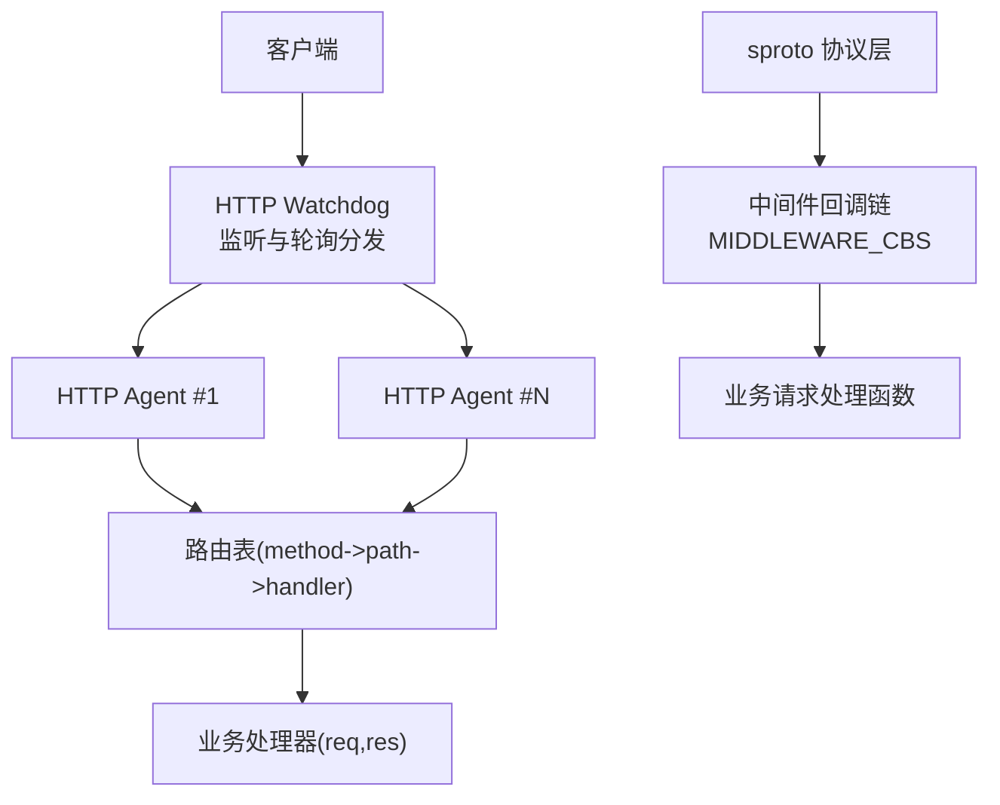
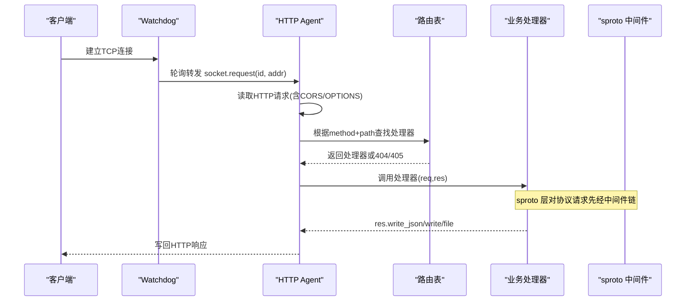
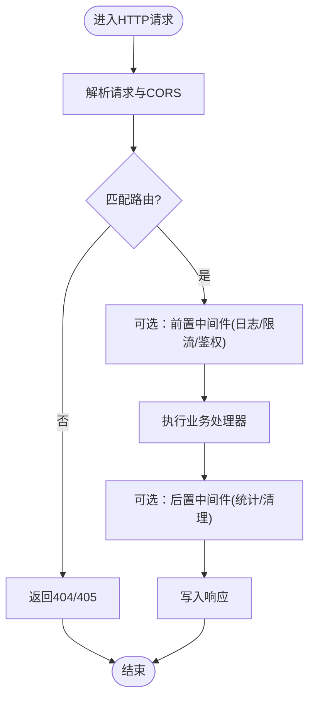
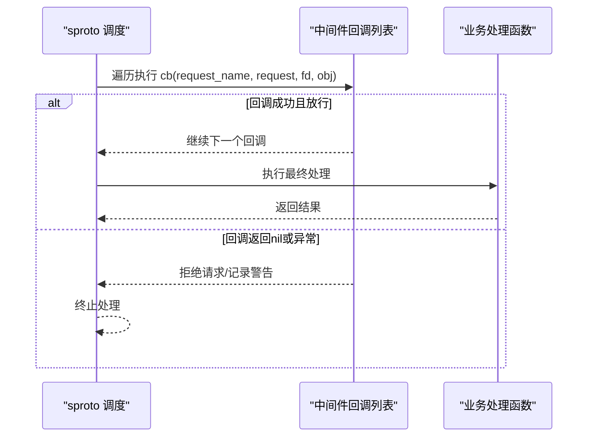
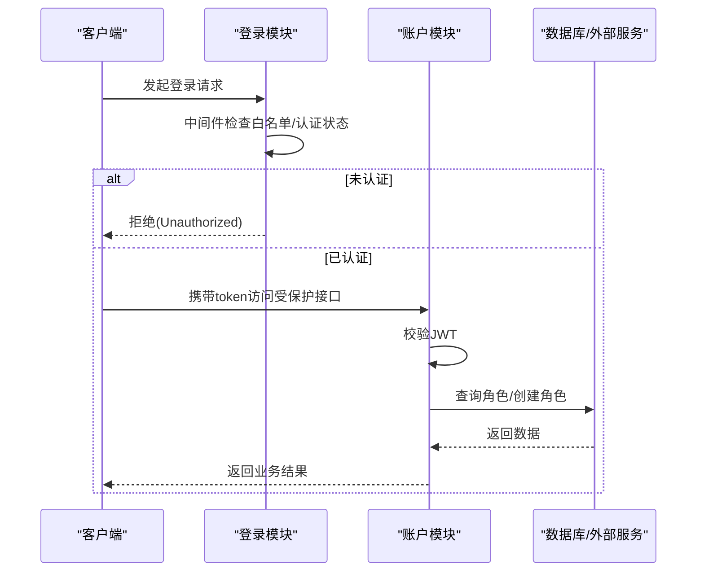
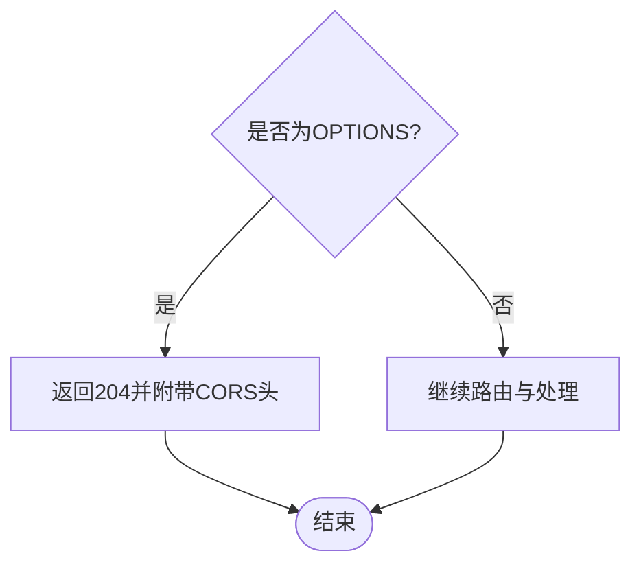
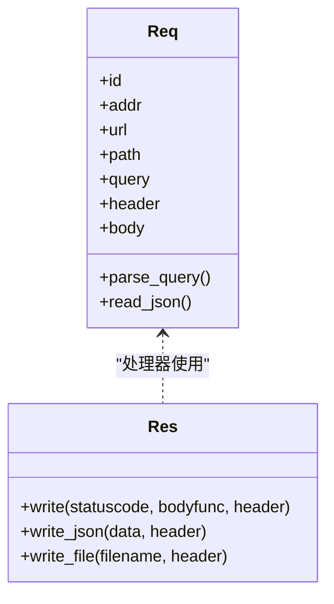
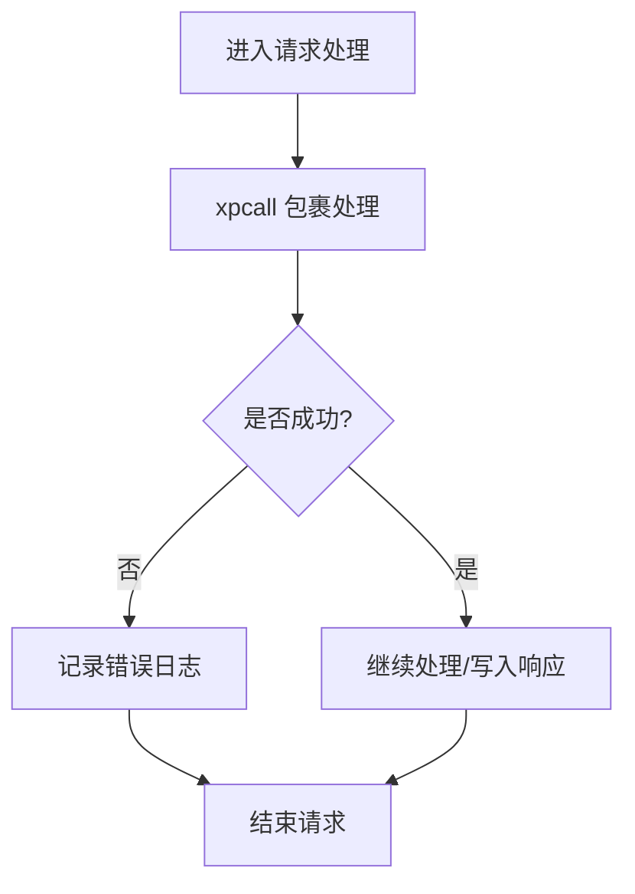
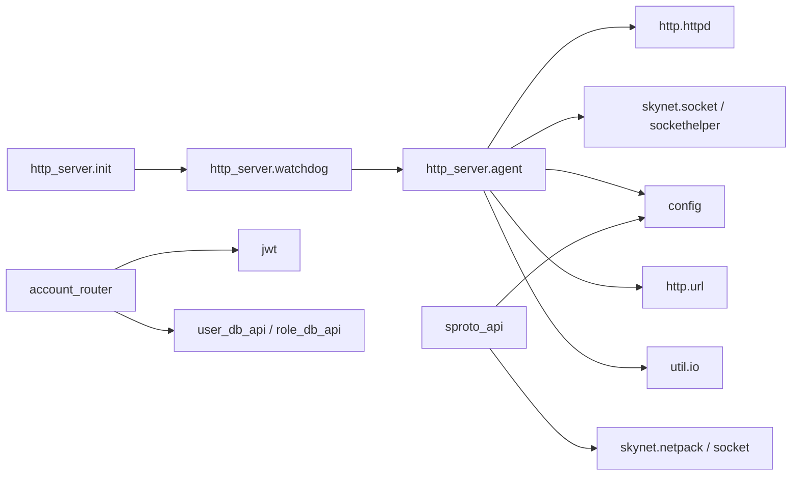

# 中间件机制

<cite>
**本文引用的文件**
- [lualib/http_server/init.lua](file://lualib/http_server/init.lua)
- [lualib/http_server/watchdog.lua](file://lualib/http_server/watchdog.lua)
- [lualib/http_server/agent.lua](file://lualib/http_server/agent.lua)
- [lualib/sproto_api.lua](file://lualib/sproto_api.lua)
- [app/account/lualib/account_router.lua](file://app/account/lualib/account_router.lua)
- [app/role/login/client.lua](file://app/role/login/client.lua)
</cite>

## 目录
1. [简介](#简介)
2. [项目结构](#项目结构)
3. [核心组件](#核心组件)
4. [架构总览](#架构总览)
5. [详细组件分析](#详细组件分析)
6. [依赖关系分析](#依赖关系分析)
7. [性能考量](#性能考量)
8. [故障排查指南](#故障排查指南)
9. [结论](#结论)
10. [附录：实践示例与最佳实践](#附录实践示例与最佳实践)

## 简介
本技术文档聚焦 SkyExt 框架的 HTTP 中间件机制，系统阐述请求从接入到处理的完整链路、上下文传递方式、错误传播策略，并给出如何扩展自定义中间件的实践方法。同时覆盖认证授权、日志记录、请求限流、CORS 处理等常见场景的实现思路与注意事项，并提供组合多个中间件、异步中间件、条件中间件以及性能优化与调试技巧。

## 项目结构
HTTP 服务由 watchdog 进程负责监听端口与负载均衡，将连接分发给多个 agent 进程；每个 agent 解析 HTTP 请求、构建请求/响应上下文、路由到具体处理器。协议层（sproto）通过 sproto_api 提供统一的中间件拦截能力，用于在业务处理前进行鉴权、审计、限流等横切逻辑。

图表来源
- [lualib/http_server/watchdog.lua:13-39](file://lualib/http_server/watchdog.lua#L13-L39)
- [lualib/http_server/agent.lua:31-118](file://lualib/http_server/agent.lua#L31-L118)
- [lualib/sproto_api.lua:31-79](file://lualib/sproto_api.lua#L31-L79)

章节来源
- [lualib/http_server/init.lua:8-20](file://lualib/http_server/init.lua#L8-L20)
- [lualib/http_server/watchdog.lua:13-39](file://lualib/http_server/watchdog.lua#L13-L39)
- [lualib/http_server/agent.lua:31-118](file://lualib/http_server/agent.lua#L31-L118)
- [lualib/sproto_api.lua:31-79](file://lualib/sproto_api.lua#L31-L79)

## 核心组件
- HTTP 启动与注册入口：提供 start 与 register_router，用于启动 watchdog 并广播路由注册。
- Watchdog：创建固定数量的 agent，监听端口并以轮询方式将新连接分发给 agent。
- Agent：解析 HTTP 请求，构造 req/res 上下文，查找路由并调用处理器；内置 CORS 默认头与 OPTIONS 预检处理。
- sproto 中间件：为协议层请求提供统一的中间件回调链，支持按请求名注册多个中间件回调，实现鉴权、审计、限流等横切逻辑。
- 路由模块：以 method -> path -> handler 的形式注册处理器，处理器接收 req/res 上下文并返回响应。

章节来源
- [lualib/http_server/init.lua:8-20](file://lualib/http_server/init.lua#L8-L20)
- [lualib/http_server/watchdog.lua:13-39](file://lualib/http_server/watchdog.lua#L13-L39)
- [lualib/http_server/agent.lua:31-118](file://lualib/http_server/agent.lua#L31-L118)
- [lualib/sproto_api.lua:31-79](file://lualib/sproto_api.lua#L31-L79)
- [app/account/lualib/account_router.lua:15-18](file://app/account/lualib/account_router.lua#L15-L18)

## 架构总览
下图展示了 HTTP 请求从接入到处理的完整流程，包括 Watchdog 负载均衡、Agent 解析与路由、处理器执行与响应写入，以及 sproto 层的中间件拦截。

图表来源
- [lualib/http_server/watchdog.lua:22-32](file://lualib/http_server/watchdog.lua#L22-L32)
- [lualib/http_server/agent.lua:31-118](file://lualib/http_server/agent.lua#L31-L118)
- [lualib/sproto_api.lua:47-79](file://lualib/sproto_api.lua#L47-L79)

## 详细组件分析

### HTTP 中间件机制现状与扩展点
当前 HTTP 层未内置“中间件链”抽象，但具备清晰的扩展点：
- 在 Watchdog/Agent 入口处统一注入横切逻辑（如全局日志、限流、安全头）。
- 在路由层封装处理器，形成“前置校验 + 业务处理 + 后置处理”的组合模式。
- 在 sproto 协议层已提供成熟的中间件回调链，适合做跨协议的统一鉴权、审计、限流。

图表来源
- [lualib/http_server/agent.lua:31-118](file://lualib/http_server/agent.lua#L31-L118)

章节来源
- [lualib/http_server/agent.lua:31-118](file://lualib/http_server/agent.lua#L31-L118)

### sproto 中间件链（认证、授权、审计）
sproto 层通过 MIDDLEWARE_CBS 维护每个请求名的中间件回调列表，按顺序执行。任一回调返回 nil 即拒绝请求；发生异常则记录警告并终止后续处理。

图表来源
- [lualib/sproto_api.lua:47-79](file://lualib/sproto_api.lua#L47-L79)

章节来源
- [lualib/sproto_api.lua:31-79](file://lualib/sproto_api.lua#L31-L79)
- [app/role/login/client.lua:55-73](file://app/role/login/client.lua#L55-L73)

### 认证授权示例（登录与令牌校验）
- 登录模块通过 middleware_cbs 注册认证回调，允许白名单请求免鉴权，其他请求需检查连接对象是否已认证。
- 账户模块在处理器内基于 JWT 校验 token，结合配置与服务发现完成角色查询与创建。

图表来源
- [app/role/login/client.lua:55-73](file://app/role/login/client.lua#L55-L73)
- [app/account/lualib/account_router.lua:24-59](file://app/account/lualib/account_router.lua#L24-L59)
- [app/account/lualib/account_router.lua:61-139](file://app/account/lualib/account_router.lua#L61-L139)

章节来源
- [app/role/login/client.lua:55-73](file://app/role/login/client.lua#L55-L73)
- [app/account/lualib/account_router.lua:24-59](file://app/account/lualib/account_router.lua#L24-L59)
- [app/account/lualib/account_router.lua:61-139](file://app/account/lualib/account_router.lua#L61-L139)

### CORS 处理
Agent 在响应中默认设置跨域相关头，并对 OPTIONS 预检请求直接返回 204，简化浏览器跨域流程。

图表来源
- [lualib/http_server/agent.lua:48-61](file://lualib/http_server/agent.lua#L48-L61)

章节来源
- [lualib/http_server/agent.lua:48-61](file://lualib/http_server/agent.lua#L48-L61)

### 上下文传递（req/res）
Agent 为每个请求构造统一的 req 与 res 上下文：
- req：包含 id、addr、url、path、query、header、body，以及 parse_query、read_json 等便捷方法。
- res：提供 write、write_json、write_file 等方法，自动合并默认响应头（含 CORS），简化响应写入。

图表来源
- [lualib/http_server/agent.lua:77-117](file://lualib/http_server/agent.lua#L77-L117)

章节来源
- [lualib/http_server/agent.lua:77-117](file://lualib/http_server/agent.lua#L77-L117)

### 错误传播与异常处理
- HTTP 层：使用 xpcall 包裹请求处理，捕获异常并记录日志，避免进程崩溃。
- sproto 层：中间件回调使用 pcall 包裹，异常时记录警告并拒绝请求；回调返回 nil 表示拒绝。
- 响应失败：write_response 失败时记录调试日志，确保可观测性。

图表来源
- [lualib/http_server/agent.lua:129-149](file://lualib/http_server/agent.lua#L129-L149)
- [lualib/sproto_api.lua:57-69](file://lualib/sproto_api.lua#L57-L69)

章节来源
- [lualib/http_server/agent.lua:129-149](file://lualib/http_server/agent.lua#L129-L149)
- [lualib/sproto_api.lua:57-69](file://lualib/sproto_api.lua#L57-L69)

## 依赖关系分析
- init.lua 依赖 watchdog 与 log，提供对外 API 启动与路由注册。
- watchdog 依赖 agent 与 socket，负责多进程负载均衡。
- agent 依赖 httpd、sockethelper、config、urllib、util_io 等，负责请求解析与响应写入。
- sproto_api 依赖 netpack、socket、event_channel_api、config、log，提供协议层中间件与调度。
- 业务路由模块依赖 jwt、db、time、errcode 等，实现具体业务逻辑。

图表来源
- [lualib/http_server/init.lua:1-20](file://lualib/http_server/init.lua#L1-L20)
- [lualib/http_server/watchdog.lua:1-39](file://lualib/http_server/watchdog.lua#L1-L39)
- [lualib/http_server/agent.lua:1-21](file://lualib/http_server/agent.lua#L1-L21)
- [lualib/sproto_api.lua:1-7](file://lualib/sproto_api.lua#L1-L7)
- [app/account/lualib/account_router.lua:1-12](file://app/account/lualib/account_router.lua#L1-L12)

章节来源
- [lualib/http_server/init.lua:1-20](file://lualib/http_server/init.lua#L1-L20)
- [lualib/http_server/watchdog.lua:1-39](file://lualib/http_server/watchdog.lua#L1-L39)
- [lualib/http_server/agent.lua:1-21](file://lualib/http_server/agent.lua#L1-L21)
- [lualib/sproto_api.lua:1-7](file://lualib/sproto_api.lua#L1-L7)
- [app/account/lualib/account_router.lua:1-12](file://app/account/lualib/account_router.lua#L1-L12)

## 性能考量
- 请求体大小限制：通过配置控制最大请求体大小，避免过大负载影响内存与带宽。
- 并发模型：Watchdog 使用固定数量 agent 轮询分发，提升吞吐与隔离性。
- 响应头合并：res 方法自动合并默认头，减少重复逻辑。
- 文件响应：write_file 可直接读取静态文件，建议后续增加基于时间戳的缓存以提升性能。
- 中间件开销：sproto 中间件按顺序执行，应尽量减少昂贵操作，必要时引入缓存或批量处理。

[本节为通用指导，不直接分析具体文件]

## 故障排查指南
- 请求读取失败：当 read_request 返回非 200 或 socket 错误时，记录相应日志并提前返回。
- 路由未命中：路径不存在返回 404，方法不支持返回 405，便于前端快速定位问题。
- 中间件异常：sproto 中间件回调异常会记录警告并拒绝请求，检查回调实现与依赖。
- 响应写入失败：write_response 失败时记录调试日志，检查网络与客户端状态。
- 超时与资源释放：Socket 关闭与接口 close 钩子确保资源释放，避免泄漏。

章节来源
- [lualib/http_server/agent.lua:31-46](file://lualib/http_server/agent.lua#L31-L46)
- [lualib/http_server/agent.lua:63-75](file://lualib/http_server/agent.lua#L63-L75)
- [lualib/sproto_api.lua:57-69](file://lualib/sproto_api.lua#L57-L69)
- [lualib/http_server/agent.lua:129-149](file://lualib/http_server/agent.lua#L129-L149)

## 结论
SkyExt 的 HTTP 层提供了清晰的请求解析、路由与响应写入机制，并通过 sproto 层实现了成熟的中间件回调链。尽管 HTTP 层尚未内置中间件抽象，但可通过 Watchdog/Agent 入口封装、路由处理器组合以及 sproto 中间件链实现统一的横切逻辑。结合 JWT 鉴权、CORS 默认头、错误捕获与日志记录，可满足大多数生产场景需求。建议在后续版本中引入 HTTP 中间件抽象，进一步提升可扩展性与可维护性。

[本节为总结，不直接分析具体文件]

## 附录：实践示例与最佳实践

### 如何创建自定义中间件
- sproto 层：在模块中定义 middleware_cbs 表，按顺序注册回调；回调签名通常为 (request_name, request, fd, obj)。若返回 nil 表示拒绝请求；抛出异常会被捕获并记录。
- HTTP 层：可在 Watchdog/Agent 入口封装统一的前置/后置逻辑，或在路由处理器内部组合“前置校验 + 业务处理 + 后置处理”。

章节来源
- [lualib/sproto_api.lua:31-79](file://lualib/sproto_api.lua#L31-L79)
- [app/role/login/client.lua:55-73](file://app/role/login/client.lua#L55-L73)

### 实现认证授权
- 登录模块：通过 middleware_cbs 实现白名单与认证状态检查，未认证返回 Unauthorized。
- 账户模块：在处理器中校验 JWT，结合配置与服务发现完成角色查询与创建。

章节来源
- [app/role/login/client.lua:55-73](file://app/role/login/client.lua#L55-L73)
- [app/account/lualib/account_router.lua:24-59](file://app/account/lualib/account_router.lua#L24-L59)
- [app/account/lualib/account_router.lua:61-139](file://app/account/lualib/account_router.lua#L61-L139)

### 日志记录
- 使用 log 模块在关键路径记录调试与告警信息，便于追踪请求生命周期。
- 在中间件中统一记录请求元数据（方法、路径、客户端地址、耗时等）。

章节来源
- [lualib/http_server/agent.lua:31-46](file://lualib/http_server/agent.lua#L31-L46)
- [lualib/sproto_api.lua:57-69](file://lualib/sproto_api.lua#L57-L69)

### 请求限流
- 在 sproto 中间件中加入计数与阈值判断，超出限制直接拒绝。
- 在 HTTP 层可对特定路径或用户维度进行限流，结合缓存或分布式锁实现。

[本节为通用指导，不直接分析具体文件]

### CORS 处理
- 使用 Agent 默认 CORS 头与 OPTIONS 预检处理，满足跨域需求。
- 如需更精细控制，可在响应写入前动态调整 Access-Control-* 头。

章节来源
- [lualib/http_server/agent.lua:48-61](file://lualib/http_server/agent.lua#L48-L61)

### 组合多个中间件
- sproto 层：middleware_cbs 为数组，按顺序执行，适合串联鉴权、审计、限流。
- HTTP 层：可在处理器内部组合多个步骤，或使用包装器模式实现类似中间件链的效果。

章节来源
- [lualib/sproto_api.lua:57-69](file://lualib/sproto_api.lua#L57-L69)
- [app/account/lualib/account_router.lua:24-59](file://app/account/lualib/account_router.lua#L24-L59)

### 处理异步中间件
- sproto 中间件回调建议使用同步逻辑；如需异步，应在回调中尽快返回并保证后续处理通过事件通道或回调通知。
- HTTP 处理器应避免阻塞，使用 skynet 提供的异步能力（如 sleep、call）处理耗时任务。

[本节为通用指导，不直接分析具体文件]

### 实现条件中间件
- 根据请求名、路径、头部或客户端属性决定是否执行某段逻辑。
- 例如登录模块对白名单请求跳过鉴权，其他请求执行认证检查。

章节来源
- [app/role/login/client.lua:55-69](file://app/role/login/client.lua#L55-L69)

### 性能优化与调试技巧
- 合理设置请求体大小限制，避免大请求导致内存压力。
- 使用 Watchdog 的多 agent 模型提升并发处理能力。
- 在中间件中减少昂贵操作，必要时引入缓存或批处理。
- 利用日志与错误捕获快速定位问题，关注 read_request、write_response 与中间件回调的异常与拒绝情况。

章节来源
- [lualib/http_server/agent.lua:20-21](file://lualib/http_server/agent.lua#L20-L21)
- [lualib/http_server/watchdog.lua:13-32](file://lualib/http_server/watchdog.lua#L13-L32)
- [lualib/sproto_api.lua:57-69](file://lualib/sproto_api.lua#L57-L69)