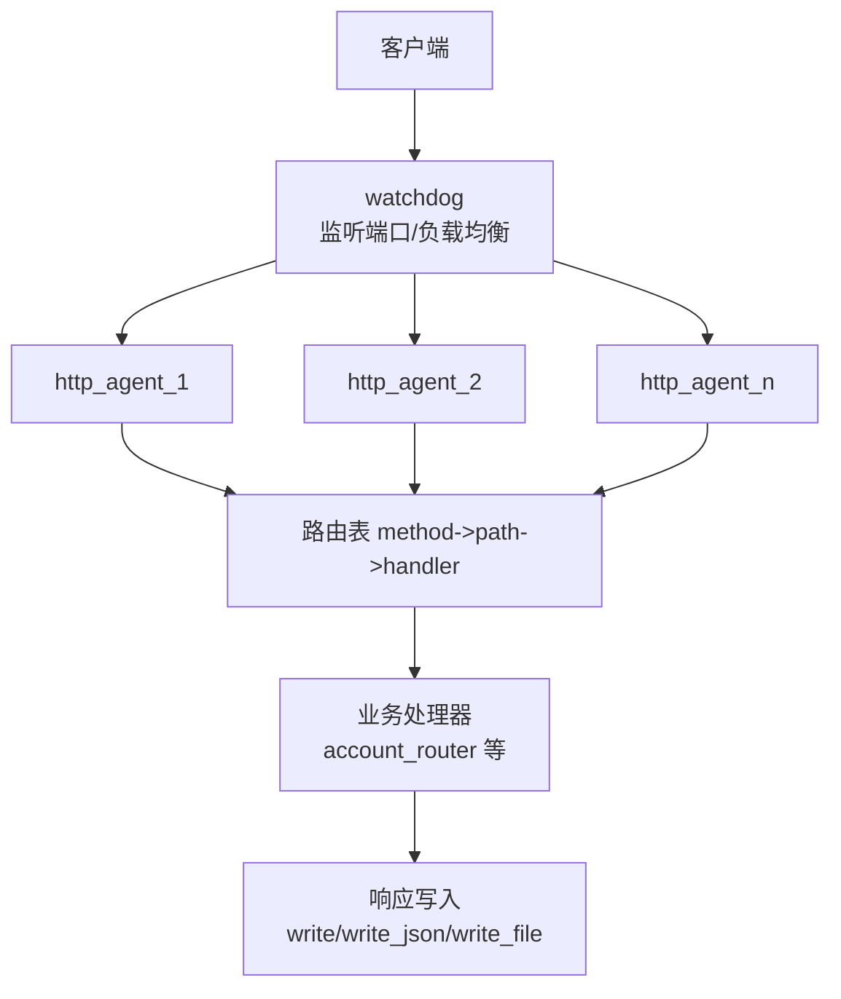
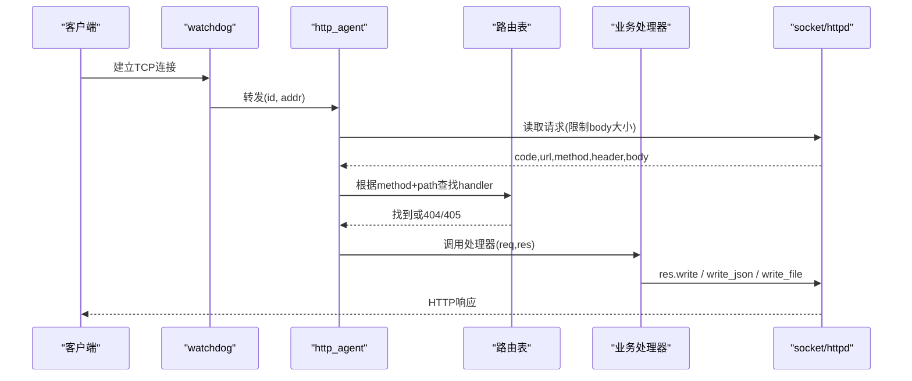
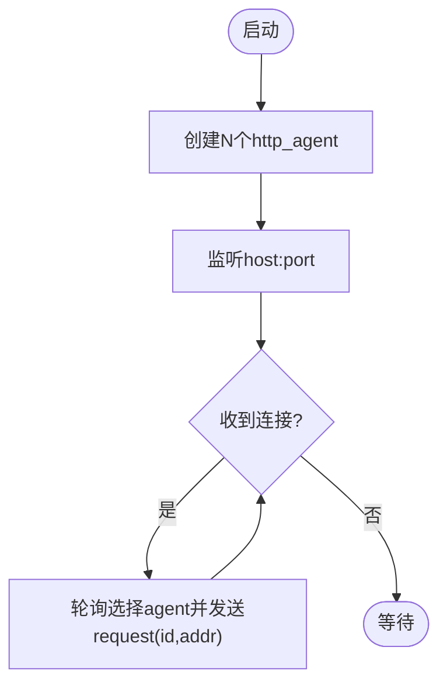
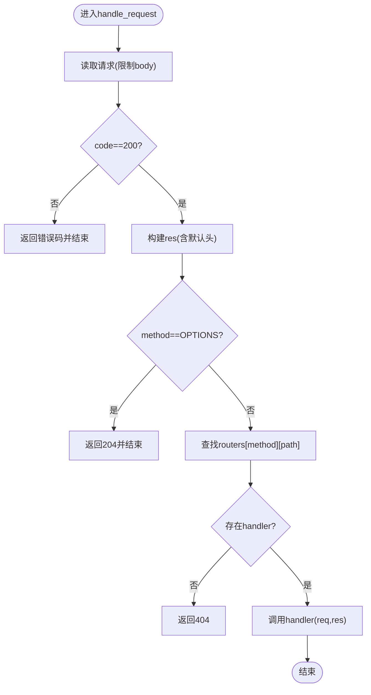
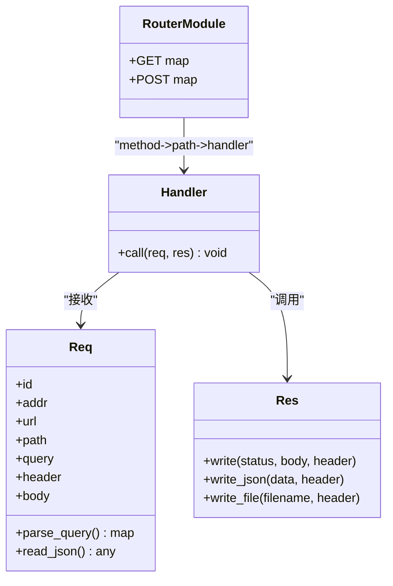
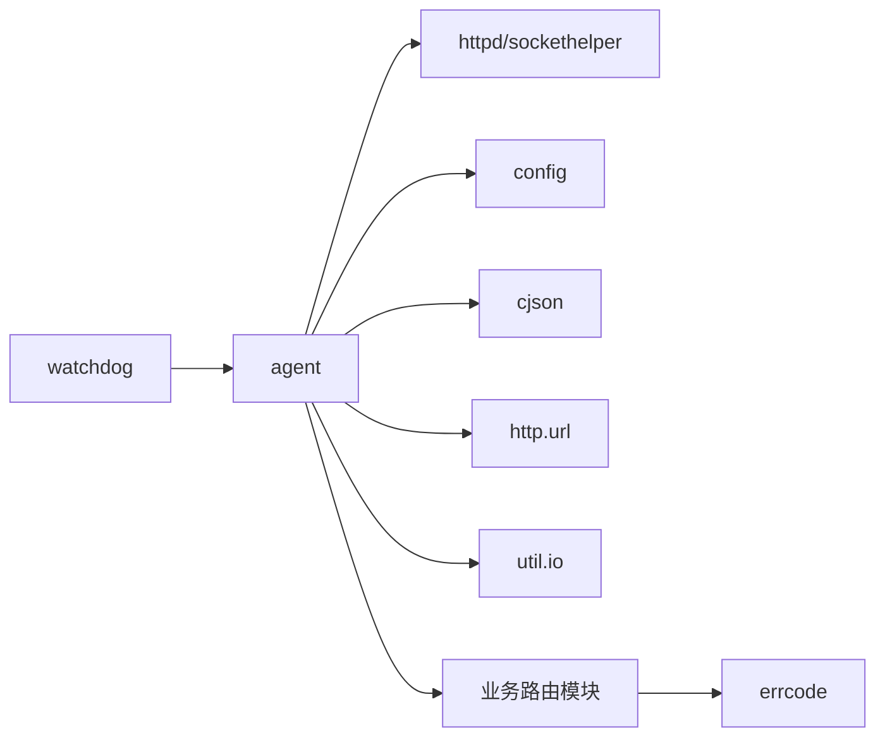

# 请求处理机制

<cite>
**本文引用的文件**
- [lualib/http_server/agent.lua](file://lualib/http_server/agent.lua)
- [lualib/http_server/watchdog.lua](file://lualib/http_server/watchdog.lua)
- [lualib/http_server/init.lua](file://lualib/http_server/init.lua)
- [app/account/lualib/account_router.lua](file://app/account/lualib/account_router.lua)
- [lualib/httpc.lua](file://lualib/httpc.lua)
- [lualib/util/io.lua](file://lualib/util/io.lua)
- [lualib/errcode.lua](file://lualib/errcode.lua)
</cite>

## 目录
1. [简介](#简介)
2. [项目结构](#项目结构)
3. [核心组件](#核心组件)
4. [架构总览](#架构总览)
5. [详细组件分析](#详细组件分析)
6. [依赖关系分析](#依赖关系分析)
7. [性能与并发优化](#性能与并发优化)
8. [故障排查指南](#故障排查指南)
9. [结论](#结论)
10. [附录：示例与最佳实践](#附录示例与最佳实践)

## 简介
本技术文档聚焦 SkyExt 框架的 HTTP 请求处理机制，围绕 Agent 代理模式、请求路由分发、参数解析、响应生成等核心能力展开。文档同时覆盖 GET/POST/PUT/DELETE 等常见方法的处理方式、文件上传下载、流式数据处理思路，以及自定义处理器、请求拦截、验证与格式化输出的实现要点。最后给出错误处理策略、超时控制与并发优化的建议。

## 项目结构
HTTP 服务由 watchdog 启动并监听端口，将连接轮询分发给多个 http_agent 实例；每个 agent 负责读取请求、解析 URL/Query/Header/Body、匹配路由并调用业务处理器，最终通过统一接口写回响应。

**图表来源**
- [lualib/http_server/watchdog.lua:13-33](file://lualib/http_server/watchdog.lua#L13-L33)
- [lualib/http_server/agent.lua:20-118](file://lualib/http_server/agent.lua#L20-L118)

**章节来源**
- [lualib/http_server/watchdog.lua:13-33](file://lualib/http_server/watchdog.lua#L13-L33)
- [lualib/http_server/agent.lua:20-118](file://lualib/http_server/agent.lua#L20-L118)

## 核心组件
- watchdog：创建固定数量的 http_agent 进程，监听端口并以轮询方式分配新连接。
- agent：单连接生命周期管理、请求读取、路由匹配、参数封装、响应输出。
- 路由注册：通过 register_router 动态加载模块，按 method->path 映射到 handler。
- 响应封装：提供 write、write_json、write_file 等便捷方法，自动注入通用响应头。
- HTTP 客户端：封装 JSON POST 请求，便于服务间调用。

**章节来源**
- [lualib/http_server/watchdog.lua:13-39](file://lualib/http_server/watchdog.lua#L13-L39)
- [lualib/http_server/agent.lua:20-168](file://lualib/http_server/agent.lua#L20-L168)
- [lualib/httpc.lua:4-13](file://lualib/httpc.lua#L4-L13)

## 架构总览
下图展示从客户端发起请求到响应返回的完整流程，包括 watchdog 的连接分发、agent 的请求解析与路由、业务处理器执行与响应写出。

**图表来源**
- [lualib/http_server/watchdog.lua:22-33](file://lualib/http_server/watchdog.lua#L22-L33)
- [lualib/http_server/agent.lua:31-118](file://lualib/http_server/agent.lua#L31-L118)

## 详细组件分析

### watchdog 组件
- 职责：启动 N 个 http_agent；监听 host:port；新连接以轮询方式分发给 agent。
- 配置项：port、agent_count、host。
- 扩展点：register_router 会向所有 agent 广播路由注册消息，保证多 agent 一致性。

**图表来源**
- [lualib/http_server/watchdog.lua:13-33](file://lualib/http_server/watchdog.lua#L13-L33)

**章节来源**
- [lualib/http_server/watchdog.lua:13-39](file://lualib/http_server/watchdog.lua#L13-L39)

### agent 组件（请求处理核心）
- 请求读取：使用 httpd.read_request，支持 body 大小限制（可配置）。
- 请求封装：构造 req 对象，包含 id、addr、url、path、query、header、body，并提供 parse_query、read_json 辅助方法。
- 响应封装：res 提供 write、write_json、write_file，自动合并全局响应头（含 CORS 相关）。
- 路由匹配：routers[method][path] -> handler；未匹配返回 404，不支持的方法返回 405。
- 异常保护：xpcall 包裹 handle_request，确保单个请求异常不影响其他请求。

**图表来源**
- [lualib/http_server/agent.lua:31-118](file://lualib/http_server/agent.lua#L31-L118)

**章节来源**
- [lualib/http_server/agent.lua:20-168](file://lualib/http_server/agent.lua#L20-L168)

### 路由与处理器
- 路由注册：通过 http_server.register_router("模块名") 动态加载模块，模块需导出 {GET={}, POST={...}} 形式的映射。
- 处理器签名：function(req, res)，req 提供 query/body/header 访问，res 提供多种写回方式。
- 示例处理器：账户模块中的 GET /roles、POST /create_role，演示了 JWT 校验、查询参数解析、JSON 响应与错误码使用。

**图表来源**
- [app/account/lualib/account_router.lua:15-140](file://app/account/lualib/account_router.lua#L15-L140)
- [lualib/http_server/agent.lua:77-117](file://lualib/http_server/agent.lua#L77-L117)

**章节来源**
- [app/account/lualib/account_router.lua:15-140](file://app/account/lualib/account_router.lua#L15-L140)
- [lualib/http_server/agent.lua:77-117](file://lualib/http_server/agent.lua#L77-L117)

### HTTP 客户端
- 提供 post_json 便捷方法，设置 content-type 为 application/json，并对 200 状态进行 JSON 解码。
- 适用于服务间调用或外部系统交互。

**章节来源**
- [lualib/httpc.lua:4-13](file://lualib/httpc.lua#L4-L13)

### 文件读写与下载
- 响应侧：res.write_file 读取本地文件并返回，适合静态资源下载。
- 工具侧：util.io 提供 readfile/writefile，用于二进制读写。
- 注意：当前实现为一次性读取文件内容，大文件场景建议结合流式传输或分块策略。

**章节来源**
- [lualib/http_server/agent.lua:108-116](file://lualib/http_server/agent.lua#L108-L116)
- [lualib/util/io.lua:3-29](file://lualib/util/io.lua#L3-L29)

## 依赖关系分析
- watchdog 依赖 skynet.socket 监听与调度，依赖 agent 工厂函数。
- agent 依赖 httpd、sockethelper、config、cjson、urllib、util.io 等。
- 业务处理器依赖 errcode、jwt、数据库 API 等。

**图表来源**
- [lualib/http_server/watchdog.lua:1-44](file://lualib/http_server/watchdog.lua#L1-L44)
- [lualib/http_server/agent.lua:1-168](file://lualib/http_server/agent.lua#L1-L168)
- [app/account/lualib/account_router.lua:1-140](file://app/account/lualib/account_router.lua#L1-L140)
- [lualib/errcode.lua:1-29](file://lualib/errcode.lua#L1-L29)

**章节来源**
- [lualib/http_server/watchdog.lua:1-44](file://lualib/http_server/watchdog.lua#L1-L44)
- [lualib/http_server/agent.lua:1-168](file://lualib/http_server/agent.lua#L1-L168)
- [app/account/lualib/account_router.lua:1-140](file://app/account/lualib/account_router.lua#L1-L140)
- [lualib/errcode.lua:1-29](file://lualib/errcode.lua#L1-L29)

## 性能与并发优化
- 连接级并发：watchdog 创建多个 http_agent，每个 agent 独立处理一个连接的生命周期，避免阻塞。
- 请求体限制：通过配置限制 request_body_size，防止恶意大包导致内存压力。
- 路由查找：基于 method->path 的字典查找，时间复杂度 O(1)。
- 响应头复用：统一注入 CORS 等头部，减少重复逻辑。
- 文件下载：当前为一次性读取，若需优化大文件下载，可在 agent 层引入流式写入（分块），或在处理器中自行实现流式响应。
- 超时控制：当前未在 HTTP 层显式设置 socket 超时；建议在 watchdog 监听回调或 agent 内对 socket.start/read/write 增加超时控制，避免僵尸连接。
- 限流与背压：可根据业务在 watchdog 层或 agent 层加入队列/令牌桶，控制峰值流量。

[本节为通用指导，不直接分析具体文件]

## 故障排查指南
- 读取失败/连接关闭：当 read_request 返回非 200 或 socket_error 时，记录日志并结束连接。
- 路由未命中：method 不存在返回 405；path 不存在返回 404，均记录警告日志。
- 处理器异常：xpcall 捕获异常并记录，避免影响其他请求。
- 响应失败：write_response 失败时记录调试日志。
- 认证失败：业务处理器中使用 JWT 校验，失败返回对应错误码。

**章节来源**
- [lualib/http_server/agent.lua:31-75](file://lualib/http_server/agent.lua#L31-L75)
- [lualib/http_server/agent.lua:139-142](file://lualib/http_server/agent.lua#L139-L142)
- [app/account/lualib/account_router.lua:24-59](file://app/account/lualib/account_router.lua#L24-L59)
- [lualib/errcode.lua:1-29](file://lualib/errcode.lua#L1-L29)

## 结论
SkyExt 的 HTTP 请求处理采用 watchdog+agent 的代理模式，具备清晰的连接分发、路由匹配与响应封装机制。通过模块化路由与统一的 req/res 抽象，开发者可以专注于业务逻辑。针对大文件、超时与限流等生产关注点，可在现有基础上进行增强。

[本节为总结性内容，不直接分析具体文件]

## 附录：示例与最佳实践

### 如何创建自定义处理器
- 新建路由模块，导出 {GET={}, POST={...}} 结构，键为路径，值为 function(req, res)。
- 在应用启动后调用 http_server.register_router("模块路径") 完成注册。
- 处理器内部通过 req.parse_query() 获取查询参数，req.read_json() 解析 JSON 请求体。
- 使用 res.write_json 返回标准 JSON 响应，配合 errcode 定义错误码。

**章节来源**
- [app/account/lualib/account_router.lua:15-140](file://app/account/lualib/account_router.lua#L15-L140)
- [lualib/http_server/init.lua:13-20](file://lualib/http_server/init.lua#L13-L20)
- [lualib/errcode.lua:1-29](file://lualib/errcode.lua#L1-L29)

### 如何处理不同类型的 HTTP 请求
- GET：常用于查询，使用 req.parse_query() 解析参数，返回 JSON。
- POST：常用于提交数据，使用 req.read_json() 解析请求体，执行业务逻辑后返回 JSON。
- PUT/DELETE：如需支持，需在路由模块中添加对应方法映射，并在 agent 的路由表中注册。
- OPTIONS：框架已内置处理，返回 204 空响应以满足跨域预检。

**章节来源**
- [lualib/http_server/agent.lua:58-75](file://lualib/http_server/agent.lua#L58-L75)
- [app/account/lualib/account_router.lua:24-140](file://app/account/lualib/account_router.lua#L24-L140)

### 如何实现请求拦截与验证
- 在处理器内部进行鉴权与参数校验，例如 JWT 校验、角色数量限制、服务器存在性检查。
- 对于复杂拦截逻辑，可在 watchdog 或 agent 层增加中间件钩子（当前版本未内置，可扩展）。
- 使用 errcode 统一错误码，便于前端/客户端识别。

**章节来源**
- [app/account/lualib/account_router.lua:24-140](file://app/account/lualib/account_router.lua#L24-L140)
- [lualib/errcode.lua:1-29](file://lualib/errcode.lua#L1-L29)

### 如何实现请求格式化输出
- 使用 res.write_json 返回 JSON，自动设置 content-type。
- 使用 res.write 返回自定义格式（如文本、HTML）。
- 使用 res.write_file 返回静态文件，适合下载场景。

**章节来源**
- [lualib/http_server/agent.lua:93-116](file://lualib/http_server/agent.lua#L93-L116)

### 文件上传与下载
- 下载：res.write_file 可直接返回本地文件内容。
- 上传：当前未内置 multipart/form-data 解析；可在处理器中自行解析请求体或使用第三方库，并将结果持久化。

**章节来源**
- [lualib/http_server/agent.lua:108-116](file://lualib/http_server/agent.lua#L108-L116)
- [lualib/util/io.lua:3-29](file://lualib/util/io.lua#L3-L29)

### 流式数据处理
- 当前响应写入为一次性写入；如需流式（如大文件分块、SSE），可在处理器中自行实现分块写入，并通过 res.write 多次调用。
- 建议在 watchdog 或 agent 层增加超时与背压控制，避免慢客户端拖垮资源。

[本节为通用指导，不直接分析具体文件]

### 错误处理策略
- 网络层：read_request 失败或 socket 关闭时记录日志并结束连接。
- 路由层：未匹配方法返回 405，未匹配路径返回 404。
- 业务层：使用 errcode 统一错误码，JWT 校验失败返回 TOKEN_ERROR。
- 异常保护：xpcall 包裹请求处理，记录堆栈信息。

**章节来源**
- [lualib/http_server/agent.lua:31-75](file://lualib/http_server/agent.lua#L31-L75)
- [lualib/http_server/agent.lua:139-142](file://lualib/http_server/agent.lua#L139-L142)
- [app/account/lualib/account_router.lua:24-59](file://app/account/lualib/account_router.lua#L24-L59)
- [lualib/errcode.lua:1-29](file://lualib/errcode.lua#L1-L29)

### 超时控制与并发优化建议
- 超时控制：在 watchdog 监听回调或 agent 内为 socket 操作设置超时，避免长连接占用。
- 并发优化：合理配置 agent_count，平衡 CPU 与内存；对热点路由可考虑缓存或异步化。
- 资源限制：限制 request_body_size，防止内存溢出；对文件下载可引入分块与断点续传。

[本节为通用指导，不直接分析具体文件]