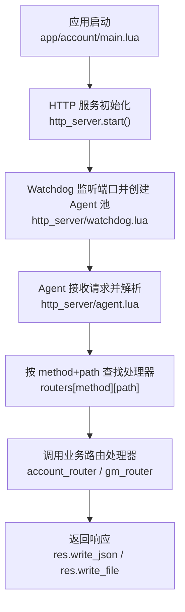
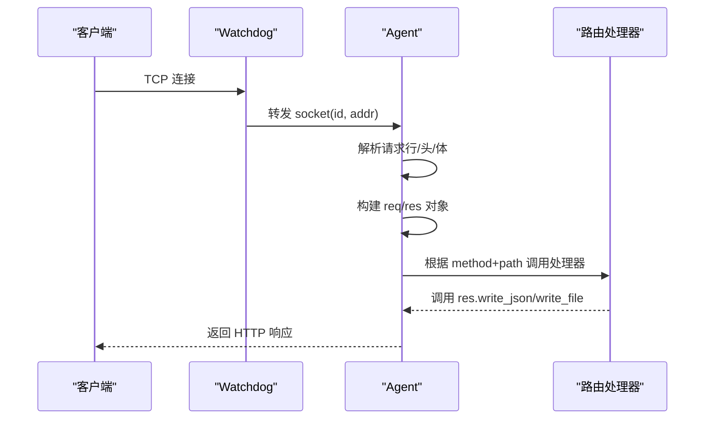
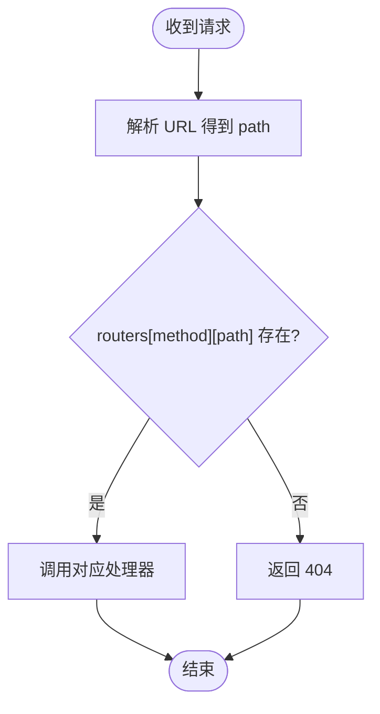
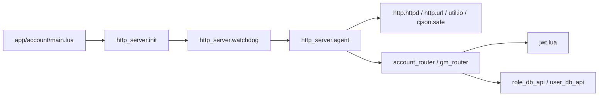

# 路由系统

<cite>
**本文引用的文件**
- [lualib/http_server/init.lua](file://lualib/http_server/init.lua)
- [lualib/http_server/watchdog.lua](file://lualib/http_server/watchdog.lua)
- [lualib/http_server/agent.lua](file://lualib/http_server/agent.lua)
- [app/account/main.lua](file://app/account/main.lua)
- [app/account/lualib/account_router.lua](file://app/account/lualib/account_router.lua)
- [lualib/gm_router.lua](file://lualib/gm_router.lua)
- [etc/app/common.app.lua](file://etc/app/common.app.lua)
- [etc/app/account1.app.lua](file://etc/app/account1.app.lua)
- [lualib/jwt.lua](file://lualib/jwt.lua)
</cite>

## 目录
1. [简介](#简介)
2. [项目结构](#项目结构)
3. [核心组件](#核心组件)
4. [架构总览](#架构总览)
5. [详细组件分析](#详细组件分析)
6. [依赖关系分析](#依赖关系分析)
7. [性能与优化](#性能与优化)
8. [故障排查指南](#故障排查指南)
9. [结论](#结论)
10. [附录：使用示例与最佳实践](#附录使用示例与最佳实践)

## 简介
本技术文档聚焦 SkyExt 框架的 HTTP 路由子系统，系统性说明其路由注册机制、请求处理流程、路径匹配策略、动态路由支持现状、路由优先级行为，以及如何基于现有能力定义 RESTful API、提取 URL 查询参数与请求体数据。同时给出模块化路由组织、路由分组（通过模块划分）、中间件扩展思路、性能优化建议、缓存策略与调试方法。

## 项目结构
HTTP 路由相关代码主要分布在以下位置：
- HTTP 服务入口与进程管理：lualib/http_server/init.lua、lualib/http_server/watchdog.lua
- 请求处理与路由分发：lualib/http_server/agent.lua
- 业务路由实现：app/account/lualib/account_router.lua、lualib/gm_router.lua
- 应用启动与配置：app/account/main.lua、etc/app/*.app.lua
- 认证与工具：lualib/jwt.lua

图表来源
- [app/account/main.lua:7-16](file://app/account/main.lua#L7-L16)
- [lualib/http_server/init.lua:8-20](file://lualib/http_server/init.lua#L8-L20)
- [lualib/http_server/watchdog.lua:13-39](file://lualib/http_server/watchdog.lua#L13-L39)
- [lualib/http_server/agent.lua:31-118](file://lualib/http_server/agent.lua#L31-L118)
- [app/account/lualib/account_router.lua:15-143](file://app/account/lualib/account_router.lua#L15-L143)
- [lualib/gm_router.lua:5-152](file://lualib/gm_router.lua#L5-L152)

章节来源
- [app/account/main.lua:7-16](file://app/account/main.lua#L7-L16)
- [lualib/http_server/init.lua:8-20](file://lualib/http_server/init.lua#L8-L20)
- [lualib/http_server/watchdog.lua:13-39](file://lualib/http_server/watchdog.lua#L13-L39)
- [lualib/http_server/agent.lua:31-118](file://lualib/http_server/agent.lua#L31-L118)

## 核心组件
- HTTP 服务初始化：提供 start(conf) 与 register_router(router_name) 两个对外接口，用于启动 Watchdog 并广播路由注册。
- Watchdog：负责监听 TCP 端口、创建固定数量的 Agent 实例，并将新连接轮询分发给 Agent。
- Agent：每个 Agent 维护独立的 routers 表（method -> path -> handler），解析请求、构造 req/res 对象、执行处理器并写回响应。
- 路由模块：以 Lua 模块形式暴露 GET/POST 等键名下的路径到处理器的映射，供 Watchdog 广播给所有 Agent 加载。

章节来源
- [lualib/http_server/init.lua:8-20](file://lualib/http_server/init.lua#L8-L20)
- [lualib/http_server/watchdog.lua:13-39](file://lualib/http_server/watchdog.lua#L13-L39)
- [lualib/http_server/agent.lua:20-22](file://lualib/http_server/agent.lua#L20-L22)
- [lualib/http_server/agent.lua:156-168](file://lualib/http_server/agent.lua#L156-L168)

## 架构总览
HTTP 请求从客户端进入后，由 Watchdog 监听端口并以轮询方式将连接交给多个 Agent；每个 Agent 独立维护路由表，按 HTTP Method + 精确路径匹配处理器；处理器中可读取查询参数、JSON 请求体、Header，并通过 res 对象写回响应。

图表来源
- [lualib/http_server/watchdog.lua:22-33](file://lualib/http_server/watchdog.lua#L22-L33)
- [lualib/http_server/agent.lua:31-118](file://lualib/http_server/agent.lua#L31-L118)

## 详细组件分析

### 路由注册机制
- 应用启动时调用 http_server.start(conf) 启动 Watchdog，并按需调用 http_server.register_router("xxx") 向 Watchdog 广播路由模块名。
- Watchdog 收到广播后，向所有已创建的 Agent 发送 register_router 消息。
- 每个 Agent 在 CMD.register_router 中 require 该模块，遍历其顶层键（如 GET、POST）下的路径映射，写入本地 routers[method][path] = handler。

要点
- 路由表是 per-agent 的，每个 Agent 各自维护一份。
- 路由模块必须遵循约定：顶层为 HTTP 方法名（如 GET、POST），值为 {"/path": handler}。
- 重复注册会覆盖同名路径的处理器。

章节来源
- [app/account/main.lua:7-16](file://app/account/main.lua#L7-L16)
- [lualib/http_server/init.lua:8-20](file://lualib/http_server/init.lua#L8-L20)
- [lualib/http_server/watchdog.lua:35-39](file://lualib/http_server/watchdog.lua#L35-L39)
- [lualib/http_server/agent.lua:156-168](file://lualib/http_server/agent.lua#L156-L168)

### 路径匹配算法与优先级
- 当前实现采用“精确匹配”：将完整 URL 的路径部分作为 key 在 routers[method] 中查找。
- 不支持路径片段参数（如 /users/:id）或通配符匹配。
- 若未找到处理器，返回 404；若 Method 未注册，返回 405。
- 由于是字典查找，时间复杂度 O(1)，无优先级概念。

图表来源
- [lualib/http_server/agent.lua:63-75](file://lualib/http_server/agent.lua#L63-L75)

章节来源
- [lualib/http_server/agent.lua:63-75](file://lualib/http_server/agent.lua#L63-L75)

### 动态路由支持
- 当前版本未内置动态段（如 :id）或正则匹配。
- 如需动态路由，可在处理器内部自行解析 path 字符串进行模式匹配，但需注意性能与冲突问题。
- 建议在业务层封装统一的路径解析函数，集中处理动态规则。

章节来源
- [lualib/http_server/agent.lua:69-75](file://lualib/http_server/agent.lua#L69-L75)

### RESTful API 定义与参数提取
- 定义方式：在路由模块中按 HTTP 方法组织路径映射，例如 GET["/roles"]、POST["/create_role"]。
- 查询参数：req.parse_query() 返回键值表，适合 GET 参数。
- JSON 请求体：req.read_json() 解析 body 为 table。
- Header：req.header 可直接访问。
- 示例参考：
  - 账号服务路由：[app/account/lualib/account_router.lua:15-143](file://app/account/lualib/account_router.lua#L15-L143)
  - GM 路由：[lualib/gm_router.lua:20-149](file://lualib/gm_router.lua#L20-L149)

章节来源
- [app/account/lualib/account_router.lua:15-143](file://app/account/lualib/account_router.lua#L15-L143)
- [lualib/gm_router.lua:20-149](file://lualib/gm_router.lua#L20-L149)

### 路由分组与模块化
- 通过按功能划分的模块（如 account_router、gm_router）实现逻辑分组。
- 每个模块内再按 HTTP 方法分组（GET/POST），便于维护。
- 启动时通过 http_server.register_router("模块名") 完成注册。

章节来源
- [app/account/main.lua:7-16](file://app/account/main.lua#L7-L16)
- [lualib/gm_router.lua:5-152](file://lualib/gm_router.lua#L5-L152)

### 中间件机制与扩展点
- 当前 HTTP 层未内置通用中间件管线。
- 可在处理器内部组合鉴权、限流、日志等逻辑，或通过包装处理器形成“伪中间件”。
- 参考 SPROTO 层的中间件模式（非 HTTP），可用于理解中间件思想：[lualib/sproto_api.lua:47-69](file://lualib/sproto_api.lua#L47-L69)
- 建议扩展方向：在 agent 层增加统一的中间件链，对每个请求执行一组回调。

章节来源
- [lualib/sproto_api.lua:47-69](file://lualib/sproto_api.lua#L47-L69)

### 错误处理与状态码
- 未注册 Method：返回 405。
- 未匹配路径：返回 404。
- 请求体过大：受 http_request_body_size 限制，超出则读取失败。
- 其他异常：通过 xpcall 捕获并记录日志。

章节来源
- [lualib/http_server/agent.lua:31-75](file://lualib/http_server/agent.lua#L31-L75)
- [etc/app/common.app.lua:99-100](file://etc/app/common.app.lua#L99-L100)

## 依赖关系分析
- 应用层依赖 http_server 提供的 start/register_router。
- Watchdog 依赖 skynet.socket 监听与调度。
- Agent 依赖 http.httpd、http.url、util.io、cjson.safe 等库。
- 业务路由依赖 jwt、role_db_api、user_db_api、errcode 等。

图表来源
- [app/account/main.lua:7-16](file://app/account/main.lua#L7-L16)
- [lualib/http_server/init.lua:8-20](file://lualib/http_server/init.lua#L8-L20)
- [lualib/http_server/watchdog.lua:13-39](file://lualib/http_server/watchdog.lua#L13-L39)
- [lualib/http_server/agent.lua:1-12](file://lualib/http_server/agent.lua#L1-L12)
- [app/account/lualib/account_router.lua:1-10](file://app/account/lualib/account_router.lua#L1-L10)
- [lualib/gm_router.lua:1-8](file://lualib/gm_router.lua#L1-L8)
- [lualib/jwt.lua:1-102](file://lualib/jwt.lua#L1-L102)

章节来源
- [app/account/main.lua:7-16](file://app/account/main.lua#L7-L16)
- [lualib/http_server/init.lua:8-20](file://lualib/http_server/init.lua#L8-L20)
- [lualib/http_server/watchdog.lua:13-39](file://lualib/http_server/watchdog.lua#L13-L39)
- [lualib/http_server/agent.lua:1-12](file://lualib/http_server/agent.lua#L1-L12)
- [app/account/lualib/account_router.lua:1-10](file://app/account/lualib/account_router.lua#L1-L10)
- [lualib/gm_router.lua:1-8](file://lualib/gm_router.lua#L1-L8)
- [lualib/jwt.lua:1-102](file://lualib/jwt.lua#L1-L102)

## 性能与优化
- 路由查找：基于哈希表精确匹配，O(1) 查找，无复杂匹配开销。
- 并发模型：多 Agent 轮询分配连接，提升吞吐。
- 请求体大小：可通过配置 http_request_body_size 控制，避免大请求拖慢处理。
- 静态文件：write_file 直接读取文件内容返回，建议后续引入基于时间戳的文件缓存以减少 IO。
- 跨域与头部：默认设置 CORS 头，减少浏览器预检成本。

章节来源
- [lualib/http_server/watchdog.lua:22-33](file://lualib/http_server/watchdog.lua#L22-L33)
- [lualib/http_server/agent.lua:20-21](file://lualib/http_server/agent.lua#L20-L21)
- [lualib/http_server/agent.lua:108-116](file://lualib/http_server/agent.lua#L108-L116)
- [etc/app/common.app.lua:99-100](file://etc/app/common.app.lua#L99-L100)

## 故障排查指南
- 404 未找到：检查路由模块是否正确 require 且路径与方法是否一致。
- 405 方法不允许：确认是否在路由模块中定义了该 Method。
- 请求体过大：调整 http_request_body_size。
- 跨域问题：检查默认 CORS 头是否符合预期。
- 认证失败：核对 JWT 密钥与 token 有效性。

章节来源
- [lualib/http_server/agent.lua:63-75](file://lualib/http_server/agent.lua#L63-L75)
- [etc/app/common.app.lua:99-100](file://etc/app/common.app.lua#L99-L100)
- [app/account/lualib/account_router.lua:24-59](file://app/account/lualib/account_router.lua#L24-L59)
- [lualib/jwt.lua:17-67](file://lualib/jwt.lua#L17-L67)

## 结论
SkyExt 的 HTTP 路由系统采用简洁高效的精确匹配策略，配合多 Agent 并发模型，满足常见 RESTful API 场景。当前版本未内置动态路由与中间件管线，但可通过业务层封装与后续扩展逐步完善。建议优先关注：
- 动态路由与优先级规则的实现
- 中间件链的统一抽象
- 静态资源缓存与性能监控
- 更丰富的参数校验与错误码体系

## 附录：使用示例与最佳实践

### 如何定义 RESTful API 路由
- 在业务模块中按 HTTP 方法组织路径映射，例如：
  - GET["/roles"]：获取角色列表，查询参数通过 req.parse_query() 获取。
  - POST["/create_role"]：创建角色，请求体通过 req.read_json() 获取。
- 参考：
  - [app/account/lualib/account_router.lua:24-59](file://app/account/lualib/account_router.lua#L24-L59)
  - [app/account/lualib/account_router.lua:61-140](file://app/account/lualib/account_router.lua#L61-L140)

章节来源
- [app/account/lualib/account_router.lua:24-59](file://app/account/lualib/account_router.lua#L24-L59)
- [app/account/lualib/account_router.lua:61-140](file://app/account/lualib/account_router.lua#L61-L140)

### 如何处理 URL 参数、查询参数与路径参数
- 查询参数：req.parse_query() 返回表，适合 GET 参数。
- JSON 请求体：req.read_json() 解析 body。
- 路径参数：当前不支持动态段，需在处理器内自行解析 path 字符串。

章节来源
- [lualib/http_server/agent.lua:77-91](file://lualib/http_server/agent.lua#L77-L91)
- [lualib/http_server/agent.lua:69-75](file://lualib/http_server/agent.lua#L69-L75)

### 如何创建模块化路由与路由分组
- 将不同功能的 API 拆分为独立模块（如 account_router、gm_router）。
- 在每个模块内按 HTTP 方法分组（GET/POST）。
- 启动时通过 http_server.register_router("模块名") 注册。

章节来源
- [app/account/main.lua:7-16](file://app/account/main.lua#L7-L16)
- [lualib/gm_router.lua:5-152](file://lualib/gm_router.lua#L5-L152)

### 如何实现路由中间件
- 当前 HTTP 层未内置中间件，可在处理器内部组合鉴权、日志、限流等逻辑。
- 参考 SPROTO 中间件模式设计思路，未来可在 agent 层增加统一中间件链。

章节来源
- [lualib/sproto_api.lua:47-69](file://lualib/sproto_api.lua#L47-L69)

### 性能优化与缓存策略
- 路由查找为 O(1)，无需额外优化。
- 静态文件返回可引入基于时间戳的缓存，减少 IO。
- 合理设置 http_request_body_size，避免大请求阻塞。

章节来源
- [lualib/http_server/agent.lua:108-116](file://lualib/http_server/agent.lua#L108-L116)
- [etc/app/common.app.lua:99-100](file://etc/app/common.app.lua#L99-L100)

### 调试工具使用方法
- 启用日志：查看服务启动、请求处理、错误信息。
- 检查路由：确认模块名与路径是否正确注册。
- 验证 JWT：核对密钥与 token 有效期。

章节来源
- [app/account/main.lua:18-24](file://app/account/main.lua#L18-L24)
- [lualib/http_server/agent.lua:31-46](file://lualib/http_server/agent.lua#L31-L46)
- [lualib/jwt.lua:17-67](file://lualib/jwt.lua#L17-L67)