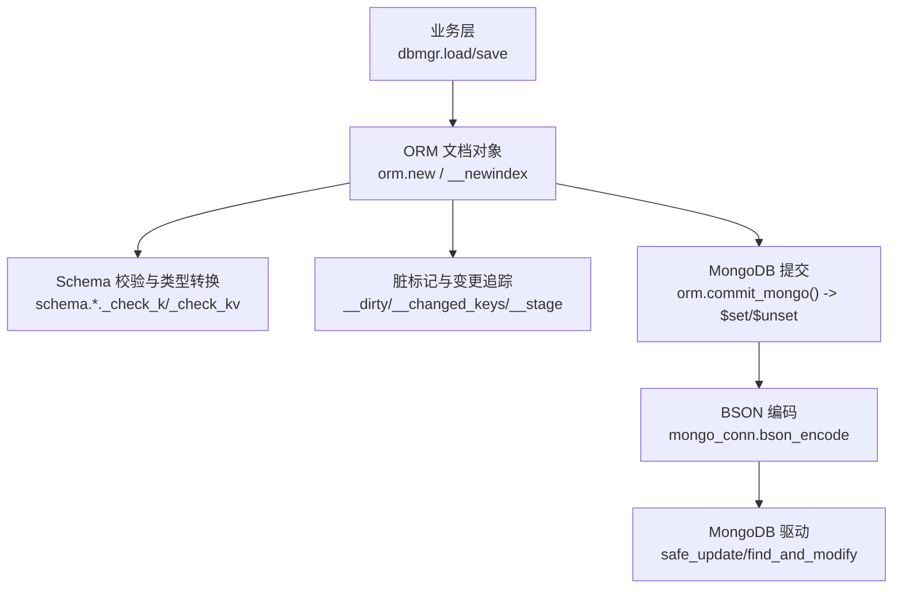
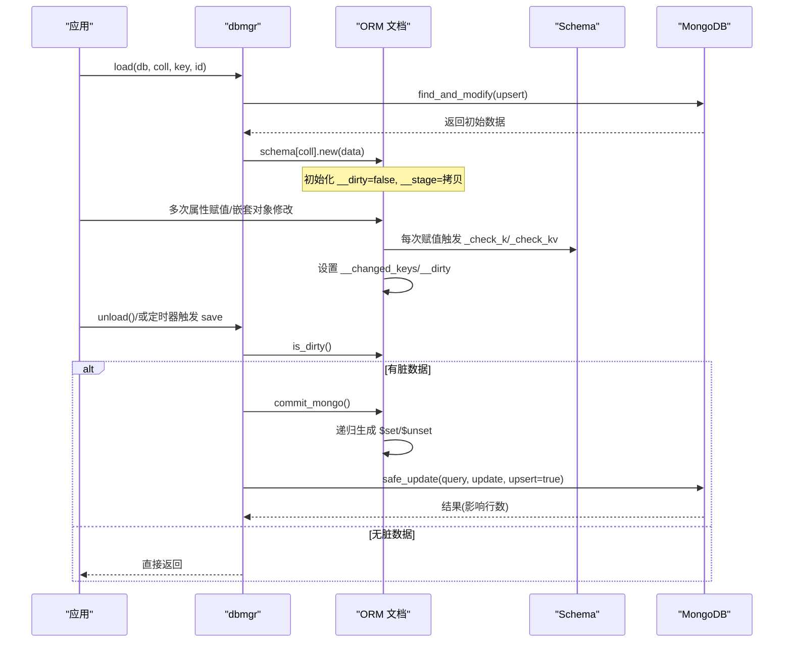
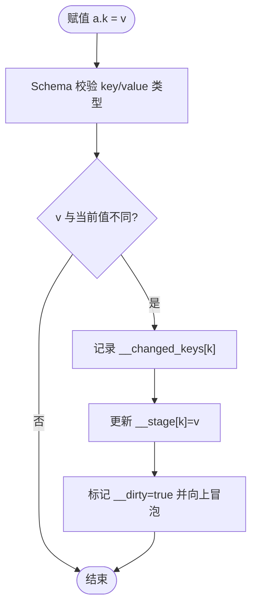
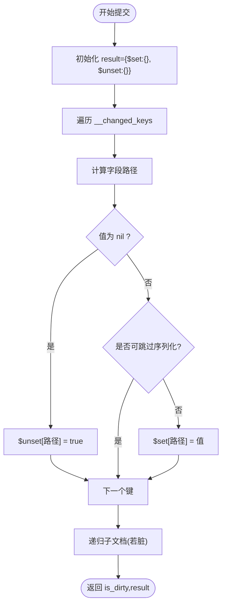
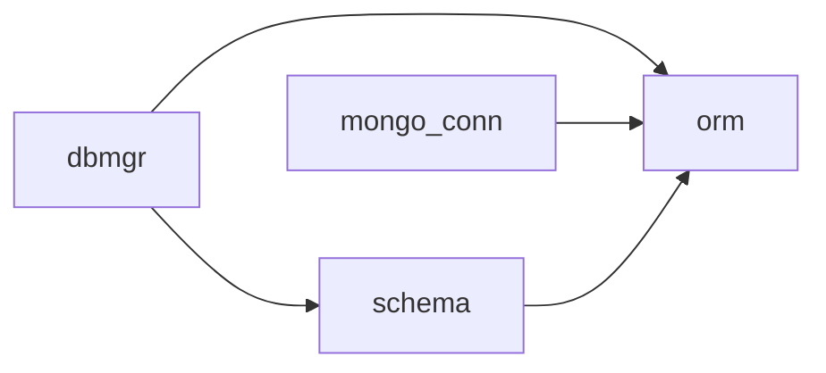

# CRUD 操作 API

<cite>
**本文引用的文件**
- [lualib/orm/init.lua](file://lualib/orm/init.lua)
- [lualib/orm/schema.lua](file://lualib/orm/schema.lua)
- [lualib/orm/schema_define.lua](file://lualib/orm/schema_define.lua)
- [lualib/dbmgr.lua](file://lualib/dbmgr.lua)
- [lualib/mongo_conn.lua](file://lualib/mongo_conn.lua)
</cite>

## 目录
1. [简介](#简介)
2. [项目结构](#项目结构)
3. [核心组件](#核心组件)
4. [架构总览](#架构总览)
5. [详细组件分析](#详细组件分析)
6. [依赖关系分析](#依赖关系分析)
7. [性能考量](#性能考量)
8. [故障排查指南](#故障排查指南)
9. [结论](#结论)
10. [附录：完整 CRUD 示例与模式](#附录完整-crud-示例与模式)

## 简介
本文件面向使用本仓库 ORM 的开发者，系统化说明基于 schema 的 CRUD 能力：对象创建、属性赋值、批量更新、脏数据检测与变更追踪、提交优化；并解释 MongoDB 更新语句生成（$set/$unset）以及辅助方法 orm.clone()、orm.totable()、orm.is_dirty() 的使用方式。文档同时给出单条记录与批量操作的实现模式，帮助快速集成到业务中。

## 项目结构
ORM 相关代码集中在 lualib/orm 下，配合 dbmgr 完成“加载-缓存-定时/显式落库”的完整流程，mongo_conn 负责 BSON 编码与底层 MongoDB 调用。

图表来源
- [lualib/orm/init.lua:234-295](file://lualib/orm/init.lua#L234-L295)
- [lualib/orm/init.lua:348-447](file://lualib/orm/init.lua#L348-L447)
- [lualib/dbmgr.lua:67-92](file://lualib/dbmgr.lua#L67-L92)
- [lualib/mongo_conn.lua:14-19](file://lualib/mongo_conn.lua#L14-L19)
- [lualib/mongo_conn.lua:67-77](file://lualib/mongo_conn.lua#L67-L77)

章节来源
- [lualib/orm/init.lua:1-490](file://lualib/orm/init.lua#L1-L490)
- [lualib/orm/schema.lua:1-471](file://lualib/orm/schema.lua#L1-L471)
- [lualib/dbmgr.lua:1-219](file://lualib/dbmgr.lua#L1-L219)
- [lualib/mongo_conn.lua:1-152](file://lualib/mongo_conn.lua#L1-L152)

## 核心组件
- ORM 文档对象与元表：通过 _new_doc 构造，拦截读写以追踪变更，维护 __stage（当前值）、__changed_keys（变更键集合）、__dirty（是否脏）、__all_dirty（子树整体脏）。
- Schema 校验：每个字段定义类型与 key/value 约束，读写时进行类型检查与 key 解析。
- 提交器：_commit_mongo 递归遍历文档，将变更转换为 MongoDB 的 $set/$unset 操作符，并合并嵌套对象的增量更新。
- 持久化编排：dbmgr 负责加载、缓存、定时/显式保存，结合版本控制避免并发冲突。
- BSON 编码桥接：mongo_conn 在调用底层驱动前，通过 orm.with_bson_encode_context 启用 ORM 的 bson 迭代上下文，确保只序列化非默认值。

章节来源
- [lualib/orm/init.lua:40-97](file://lualib/orm/init.lua#L40-L97)
- [lualib/orm/init.lua:234-295](file://lualib/orm/init.lua#L234-L295)
- [lualib/orm/init.lua:348-447](file://lualib/orm/init.lua#L348-L447)
- [lualib/orm/schema.lua:163-185](file://lualib/orm/schema.lua#L163-L185)
- [lualib/dbmgr.lua:67-92](file://lualib/dbmgr.lua#L67-L92)
- [lualib/mongo_conn.lua:14-19](file://lualib/mongo_conn.lua#L14-L19)

## 架构总览
下图展示从业务侧对 ORM 文档的修改到最终写入 MongoDB 的完整链路，包括脏标记传播、增量提交与版本控制。

图表来源
- [lualib/dbmgr.lua:94-148](file://lualib/dbmgr.lua#L94-L148)
- [lualib/dbmgr.lua:67-92](file://lualib/dbmgr.lua#L67-L92)
- [lualib/orm/init.lua:348-447](file://lualib/orm/init.lua#L348-L447)
- [lualib/mongo_conn.lua:67-77](file://lualib/mongo_conn.lua#L67-L77)

## 详细组件分析

### ORM 文档创建与属性赋值
- 创建对象：orm.new(schema, init) 会复制 init 并构建 ORM 文档，内部建立 __stage、__changed_keys、__dirty 等状态，并对嵌套 table 递归包装为 ORM 文档。
- 属性赋值：通过 __newindex 拦截赋值，执行 schema 的类型校验，若值变化则记录到 __changed_keys，并标记自身及父链为脏。
- 嵌套对象：当赋值为 table 时，会自动包装为 ORM 文档并建立父子关系，便于后续递归提交。

图表来源
- [lualib/orm/init.lua:54-97](file://lualib/orm/init.lua#L54-L97)
- [lualib/orm/init.lua:234-295](file://lualib/orm/init.lua#L234-L295)

章节来源
- [lualib/orm/init.lua:54-97](file://lualib/orm/init.lua#L54-L97)
- [lualib/orm/init.lua:234-295](file://lualib/orm/init.lua#L234-L295)

### 脏数据检测与变更追踪
- 脏标记：mark_dirty 将当前节点及其祖先链标记为脏，直到遇到已脏节点为止，避免重复工作。
- 变更键集合：__changed_keys 精确记录本次会话中被修改过的字段，用于高效生成更新语句。
- 子树整体脏：__all_dirty 用于标识整个子树是否需要整体覆盖（例如整段数组替换），在提交时决定是否使用路径级 $set 覆盖。

章节来源
- [lualib/orm/init.lua:40-52](file://lualib/orm/init.lua#L40-L52)
- [lualib/orm/init.lua:253-258](file://lualib/orm/init.lua#L253-L258)
- [lualib/orm/init.lua:329-346](file://lualib/orm/init.lua#L329-L346)

### 提交优化与 MongoDB 操作生成
- 增量提交：_commit_mongo 仅遍历 __changed_keys 和子文档中的脏节点，生成最小化的 $set/$unset 路径。
- 路径生成：根据 schema.type 区分数组与结构体，拼接点号路径（如 a.b.c），数组索引按 0-based 计算。
- 空值处理：若新值为 nil，生成 $unset；否则生成 $set。对于可跳过序列化的值（原子类型或可被 BSON 迭代的对象）不会进入 $set。
- 清理状态：提交后清除 __dirty、__all_dirty、__changed_keys，避免重复提交。

图表来源
- [lualib/orm/init.lua:348-447](file://lualib/orm/init.lua#L348-L447)

章节来源
- [lualib/orm/init.lua:348-447](file://lualib/orm/init.lua#L348-L447)

### 辅助方法
- orm.clone(doc)：深拷贝 ORM 文档，先转为普通表再重建 ORM 文档，适用于快照或回滚场景。
- orm.totable(doc)：将 ORM 文档转为纯 Lua table，支持循环引用检测，便于调试或外部存储。
- orm.is_dirty(doc)：判断文档是否包含未提交的变更。
- orm.next/unpack/concat/insert/remove：提供对 __stage 的访问与数组式操作，便于遍历与插入删除。

章节来源
- [lualib/orm/init.lua:100-124](file://lualib/orm/init.lua#L100-L124)
- [lualib/orm/init.lua:428-455](file://lualib/orm/init.lua#L428-L455)
- [lualib/orm/init.lua:483-488](file://lualib/orm/init.lua#L483-L488)

### Schema 与类型系统
- 类型定义：number、integer、string、boolean 等基础类型，以及 struct/map/array 等复合类型。
- 键解析与校验：_parse_k 负责 key 类型归一化（如 integer/string），_check_k/_check_kv 负责运行时类型检查。
- 自动生成：schema.lua 由 schema_define.lua 生成，集中管理各业务实体的字段与类型。

章节来源
- [lualib/orm/schema_define.lua:1-131](file://lualib/orm/schema_define.lua#L1-L131)
- [lualib/orm/schema.lua:8-185](file://lualib/orm/schema.lua#L8-L185)

### 持久化编排与版本控制
- 加载：dbmgr.load 通过 find_and_modify 获取或创建文档，并用 schema[coll].new 包装为 ORM 文档。
- 缓存与定时保存：每个文档绑定一个随机延迟的定时器，周期性调用 save_doc。
- 保存：save_doc 先检查 orm.is_dirty，若无脏则跳过；若有脏则递增 _version，调用 orm.commit_mongo 生成更新语句，再通过 mongo_conn.safe_update 提交。
- 卸载：dbmgr.unload 取消定时器并强制保存一次，保证内存数据与数据库一致。

章节来源
- [lualib/dbmgr.lua:94-148](file://lualib/dbmgr.lua#L94-L148)
- [lualib/dbmgr.lua:67-92](file://lualib/dbmgr.lua#L67-L92)
- [lualib/dbmgr.lua:150-198](file://lualib/dbmgr.lua#L150-L198)

## 依赖关系分析
- dbmgr 依赖 orm 与 schema：使用 schema[coll].new 创建 ORM 文档，使用 orm.is_dirty/commit_mongo 进行变更检测与提交。
- mongo_conn 依赖 orm：通过 orm.with_bson_encode_context 在 BSON 编码期间启用 ORM 的 bson 迭代上下文，确保只序列化有效字段。
- schema 依赖 orm：每个 schema 暴露 .new 工厂方法，内部调用 orm.new。

图表来源
- [lualib/dbmgr.lua:1-219](file://lualib/dbmgr.lua#L1-L219)
- [lualib/mongo_conn.lua:1-152](file://lualib/mongo_conn.lua#L1-L152)
- [lualib/orm/schema.lua:1-471](file://lualib/orm/schema.lua#L1-L471)

章节来源
- [lualib/dbmgr.lua:1-219](file://lualib/dbmgr.lua#L1-L219)
- [lualib/mongo_conn.lua:1-152](file://lualib/mongo_conn.lua#L1-L152)
- [lualib/orm/schema.lua:1-471](file://lualib/orm/schema.lua#L1-L471)

## 性能考量
- 增量提交：仅对变更字段生成 $set/$unset，减少网络与存储开销。
- 脏标记冒泡：父链标记避免重复扫描，提升大规模嵌套结构的提交效率。
- 跳过默认值：bson_next/is_skip_next 过滤原子类型与可序列化对象，避免冗余写入。
- 批量提交：通过单次 safe_update 携带多个路径更新，降低 RPC 次数。
- 版本控制：_version 乐观锁避免并发覆盖写，提高一致性。

[本节为通用性能建议，不直接分析具体文件]

## 故障排查指南
- 无更新生效：确认 orm.is_dirty 是否为真；检查 __changed_keys 是否被清空；确认 schema 字段名与类型正确。
- 更新失败 nModified!=1：可能并发冲突导致 _version 不一致，需重试或回退版本。
- 字段未写入：检查 is_skip_next 是否将该字段视为可跳过；确认字段值非 nil。
- 嵌套对象未提交：确保嵌套对象已被包装为 ORM 文档且其 __dirty 被正确设置。
- BSON 编码异常：确保在 mongo_conn 的 bson_encode 中使用 orm.with_bson_encode_context 包裹。

章节来源
- [lualib/dbmgr.lua:53-92](file://lualib/dbmgr.lua#L53-L92)
- [lualib/orm/init.lua:170-232](file://lualib/orm/init.lua#L170-L232)
- [lualib/mongo_conn.lua:14-19](file://lualib/mongo_conn.lua#L14-L19)

## 结论
该 ORM 通过严格的 schema 校验、细粒度的脏标记与变更追踪、以及高效的增量提交机制，实现了高性能、低开销的 MongoDB 持久化。配合 dbmgr 的缓存与版本控制，既保证了数据一致性，又显著降低了数据库压力。推荐在业务中遵循“加载-修改-自动/显式保存”的模式，充分利用 orm.clone/totable/is_dirty 等辅助方法进行调试与扩展。

[本节为总结性内容，不直接分析具体文件]

## 附录：完整 CRUD 示例与模式

### 单条记录：创建与更新
- 创建：使用 schema[coll].new(init) 创建 ORM 文档，随后进行属性赋值。
- 更新：继续对同一文档进行属性赋值，ORM 自动记录变更。
- 保存：调用 dbmgr.unload 或在定时器触发时保存；内部会调用 orm.commit_mongo 生成 $set/$unset 并执行 safe_update。

参考路径
- [lualib/dbmgr.lua:94-148](file://lualib/dbmgr.lua#L94-L148)
- [lualib/dbmgr.lua:67-92](file://lualib/dbmgr.lua#L67-L92)

### 单条记录：查询与读取
- 查询：dbmgr.load 通过 find_and_modify 获取或创建文档，返回 ORM 文档供业务读取与修改。
- 投影：默认排除 _id，可通过 projection 控制返回字段。

参考路径
- [lualib/dbmgr.lua:94-148](file://lualib/dbmgr.lua#L94-L148)

### 批量操作：数组/Map 的增删改
- 数组插入/删除：使用 orm.insert/orm.remove 对数组型 ORM 文档进行操作，ORM 会调整元素索引并标记变更。
- Map 更新：对 map 型 ORM 文档进行键值赋值，ORM 会记录新增/修改/删除的键。
- 提交：orm.commit_mongo 会为每个变更生成对应的 $set/$unset 路径，支持嵌套路径更新。

参考路径
- [lualib/orm/init.lua:126-156](file://lualib/orm/init.lua#L126-L156)
- [lualib/orm/init.lua:348-447](file://lualib/orm/init.lua#L348-L447)

### 批量提交：多字段/多路径一次性写入
- 在一次 orm.commit_mongo 调用中，所有变更会被汇总为多条 $set/$unset 路径，并通过一次 safe_update 提交，减少网络往返。
- 建议在业务中尽量聚合修改，减少频繁的小粒度提交。

参考路径
- [lualib/dbmgr.lua:67-92](file://lualib/dbmgr.lua#L67-L92)
- [lualib/mongo_conn.lua:67-77](file://lualib/mongo_conn.lua#L67-L77)

### 辅助方法使用要点
- orm.clone：用于创建文档快照，便于回滚或对比差异。
- orm.totable：用于导出为普通表，便于日志记录或外部工具分析。
- orm.is_dirty：在保存前快速判断是否需要落库，避免无效 IO。

参考路径
- [lualib/orm/init.lua:100-124](file://lualib/orm/init.lua#L100-L124)
- [lualib/orm/init.lua:428-455](file://lualib/orm/init.lua#L428-L455)