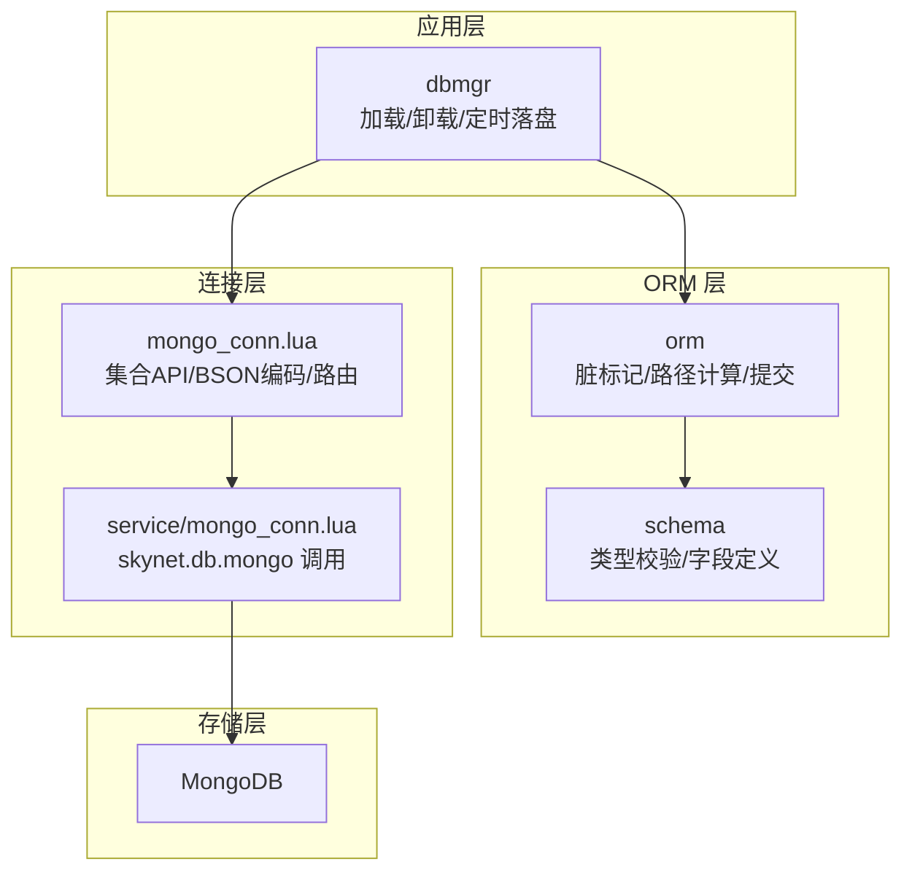
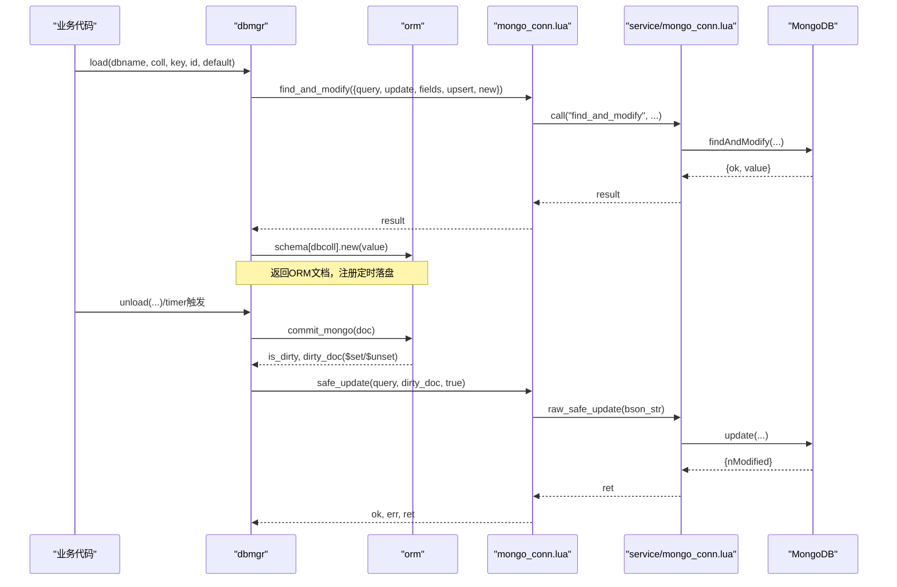
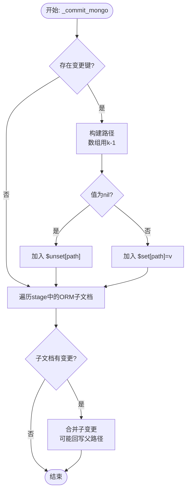
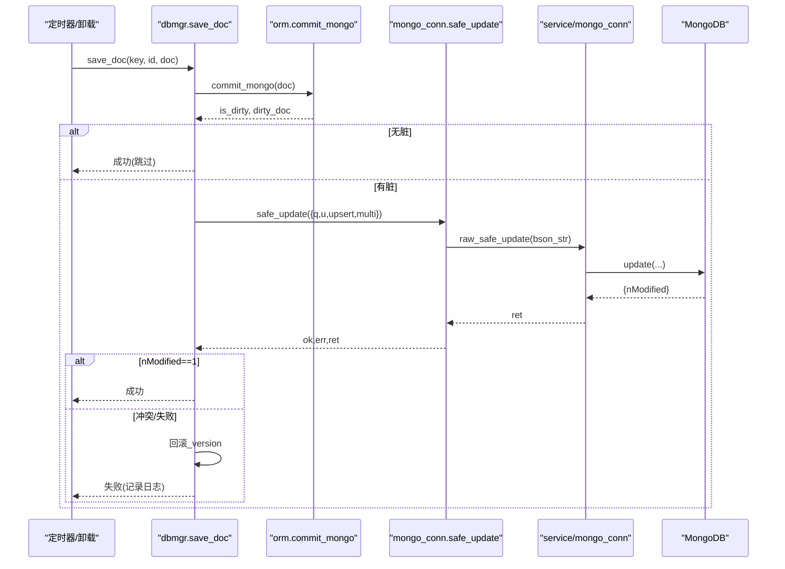
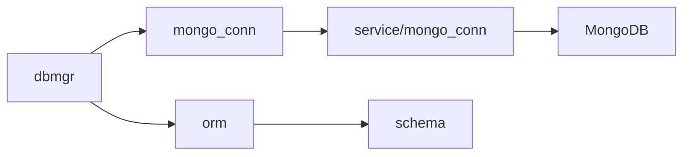

# MongoDB 集成

<cite>
**本文引用的文件**
- [lualib/orm/init.lua](file://lualib/orm/init.lua)
- [lualib/mongo_conn.lua](file://lualib/mongo_conn.lua)
- [service/mongo_conn.lua](file://service/mongo_conn.lua)
- [lualib/dbmgr.lua](file://lualib/dbmgr.lua)
- [service/mongo_index.lua](file://service/mongo_index.lua)
- [lualib/orm/schema.lua](file://lualib/orm/schema.lua)
- [etc/core.conf.lua](file://etc/core.conf.lua)
- [tools/mongodb/docker-compose.yml](file://tools/mongodb/docker-compose.yml)
</cite>

## 目录
1. [简介](#简介)
2. [项目结构](#项目结构)
3. [核心组件](#核心组件)
4. [架构总览](#架构总览)
5. [详细组件分析](#详细组件分析)
6. [依赖关系分析](#依赖关系分析)
7. [性能考量](#性能考量)
8. [故障排查指南](#故障排查指南)
9. [结论](#结论)
10. [附录：完整示例与最佳实践](#附录完整示例与最佳实践)

## 简介
本文件面向 ORM 与 MongoDB 的集成，重点说明脏数据到 MongoDB 操作的转换机制、$set/$unset 生成逻辑、嵌套对象更新策略与路径计算算法、批量提交与事务处理、错误恢复策略，以及 with_bson_encode_context 的作用和使用场景。同时提供连接配置、查询优化、索引设计等最佳实践示例。

## 项目结构
本项目采用分层与模块化组织：
- ORM 层：负责文档建模、变更追踪、脏标记、序列化上下文、提交生成 $set/$unset
- 数据库访问层：封装集合操作、路由、BSON 编码、与服务端通信
- 业务持久化层：加载/卸载文档、定时落盘、版本控制、错误恢复
- 服务进程：MongoDB 连接服务、索引管理

图表来源
- [lualib/dbmgr.lua:94-148](file://lualib/dbmgr.lua#L94-L148)
- [lualib/orm/init.lua:348-447](file://lualib/orm/init.lua#L348-L447)
- [lualib/mongo_conn.lua:44-77](file://lualib/mongo_conn.lua#L44-L77)
- [service/mongo_conn.lua:29-65](file://service/mongo_conn.lua#L29-L65)

章节来源
- [lualib/dbmgr.lua:1-219](file://lualib/dbmgr.lua#L1-L219)
- [lualib/orm/init.lua:1-491](file://lualib/orm/init.lua#L1-L491)
- [lualib/mongo_conn.lua:1-151](file://lualib/mongo_conn.lua#L1-L151)
- [service/mongo_conn.lua:1-71](file://service/mongo_conn.lua#L1-L71)

## 核心组件
- ORM 文档模型与脏追踪：通过元表拦截赋值，记录变更键、传播脏标记至父节点，支持数组与嵌套对象。
- 提交器：将脏数据转换为 $set/$unset 操作符，并计算点号路径（含数组下标）。
- BSON 编码上下文：在 bson.encode 期间启用特殊迭代行为，确保 map key 转为字符串。
- 连接与集合 API：封装 find/find_one/find_and_modify/safe_insert/safe_update，随机路由多连接。
- 业务持久化：加载时 upsert 占位，定时任务落盘，卸载时强制落盘；使用 _version 乐观锁。
- 索引管理：启动或运维时按配置创建索引。

章节来源
- [lualib/orm/init.lua:40-97](file://lualib/orm/init.lua#L40-L97)
- [lualib/orm/init.lua:170-232](file://lualib/orm/init.lua#L170-L232)
- [lualib/orm/init.lua:348-447](file://lualib/orm/init.lua#L348-L447)
- [lualib/mongo_conn.lua:44-77](file://lualib/mongo_conn.lua#L44-L77)
- [lualib/dbmgr.lua:67-92](file://lualib/dbmgr.lua#L67-L92)
- [service/mongo_index.lua:11-35](file://service/mongo_index.lua#L11-L35)

## 架构总览
从业务到存储的完整链路如下：

图表来源
- [lualib/dbmgr.lua:94-148](file://lualib/dbmgr.lua#L94-L148)
- [lualib/dbmgr.lua:67-92](file://lualib/dbmgr.lua#L67-L92)
- [lualib/mongo_conn.lua:44-77](file://lualib/mongo_conn.lua#L44-L77)
- [service/mongo_conn.lua:29-65](file://service/mongo_conn.lua#L29-L65)

## 详细组件分析

### ORM 脏数据到 MongoDB 操作转换
- 脏标记与传播：赋值时记录变更键，并向上传播 __dirty，避免重复保存。
- 路径计算：使用 path_array 累积层级，数组元素使用 k-1 作为下标，最终拼接为点号路径（如 a.b.c）。
- $set/$unset 生成：
  - 若值为 nil，生成 $unset 对应路径
  - 否则生成 $set 对应路径（跳过默认值/空容器）
- 嵌套对象更新：
  - 子文档若整体全脏（__all_dirty），优先以整段 $set 写入，减少碎片更新
  - 否则递归合并子变更，并在必要时回写父路径
- 提交接口：commit_mongo 返回 is_dirty 与包含 $set/$unset 的操作体，供上层安全更新。

图表来源
- [lualib/orm/init.lua:348-426](file://lualib/orm/init.lua#L348-L426)

章节来源
- [lualib/orm/init.lua:40-97](file://lualib/orm/init.lua#L40-L97)
- [lualib/orm/init.lua:170-232](file://lualib/orm/init.lua#L170-L232)
- [lualib/orm/init.lua:348-447](file://lualib/orm/init.lua#L348-L447)

### with_bson_encode_context 的作用与使用场景
- 作用：在 bson.encode 期间切换 table 迭代行为，使 map 的 key 统一转为字符串，避免非字符串 key 导致 BSON 序列化异常。
- 使用方式：由 mongo_conn 在 safe_insert/safe_update 前包装 bson.encode，确保 ORM 文档正确序列化。
- 典型场景：ORM 文档中包含 map 结构（如资源映射、详情映射）时，必须在此上下文中编码。

章节来源
- [lualib/orm/init.lua:213-232](file://lualib/orm/init.lua#L213-L232)
- [lualib/mongo_conn.lua:14-19](file://lualib/mongo_conn.lua#L14-L19)
- [lualib/mongo_conn.lua:59-77](file://lualib/mongo_conn.lua#L59-L77)

### 嵌套对象更新策略与路径计算算法
- 路径计算：
  - 普通字段：path_array[depth] = k
  - 数组元素：path_array[depth] = k - 1（适配 MongoDB 数组下标）
  - 最终 key = table.concat(path_array, ".", 1, depth)
- 更新策略：
  - 子文档全脏：直接 $set 整个子文档，减少多次点路径更新
  - 子文档部分脏：递归合并，仅在必要时回写父路径
- 复杂度：时间 O(N) 遍历变更键与子文档；空间 O(D) 路径栈深度 D

章节来源
- [lualib/orm/init.lua:348-426](file://lualib/orm/init.lua#L348-L426)

### 批量提交机制、事务处理与错误恢复
- 批量提交：当前实现为逐条 safe_update，未使用 bulkWrite；可通过扩展 service 层接入批量接口以提升吞吐。
- 事务处理：未显式使用 MongoDB 事务；通过 _version 乐观锁保证并发一致性。
- 错误恢复：
  - nModified != 1：视为冲突或失败，回滚版本号，记录日志
  - 网络/编码错误：上层捕获并记录，建议重试或告警
  - 卸载流程：取消定时器后强制落盘，防止内存数据丢失

图表来源
- [lualib/dbmgr.lua:67-92](file://lualib/dbmgr.lua#L67-L92)
- [lualib/mongo_conn.lua:67-77](file://lualib/mongo_conn.lua#L67-L77)
- [service/mongo_conn.lua:61-65](file://service/mongo_conn.lua#L61-L65)

章节来源
- [lualib/dbmgr.lua:67-92](file://lualib/dbmgr.lua#L67-L92)
- [lualib/mongo_conn.lua:67-77](file://lualib/mongo_conn.lua#L67-L77)
- [service/mongo_conn.lua:61-65](file://service/mongo_conn.lua#L61-L65)

### 连接配置与路由
- 连接池：每个 db name 维护多个连接，请求时随机选择，提升并发能力。
- 服务化：每个连接由独立 skynet 服务承载，隔离错误与日志。
- 配置来源：从配置表读取 mongo_config，包含 connections 数量与客户端参数 cfg。

章节来源
- [lualib/mongo_conn.lua:94-105](file://lualib/mongo_conn.lua#L94-L105)
- [lualib/mongo_conn.lua:119-144](file://lualib/mongo_conn.lua#L119-L144)
- [service/mongo_conn.lua:22-27](file://service/mongo_conn.lua#L22-L27)

### 查询优化与投影
- 默认投影：加载时排除 _id，减少传输体积。
- 只读查询：find/find_one 支持 projection，按需取字段。
- 原子加载：find_and_modify + setOnInsert 实现“首次加载即插入”的幂等语义。

章节来源
- [lualib/dbmgr.lua:13-15](file://lualib/dbmgr.lua#L13-L15)
- [lualib/dbmgr.lua:111-119](file://lualib/dbmgr.lua#L111-L119)
- [lualib/mongo_conn.lua:44-57](file://lualib/mongo_conn.lua#L44-L57)
- [service/mongo_conn.lua:29-54](file://service/mongo_conn.lua#L29-L54)

### 索引设计与创建
- 索引来源：配置中 collections.indexes 列表，启动或运维命令创建。
- 覆盖范围：按 dbname/collection 遍历，逐个 createIndex，失败记录日志。
- 建议：对查询条件字段建立复合索引；对排序字段考虑覆盖索引；定期评估慢查询。

章节来源
- [service/mongo_index.lua:11-35](file://service/mongo_index.lua#L11-L35)

## 依赖关系分析
- dbmgr 依赖 orm 进行脏提交，依赖 mongo_conn 执行集合操作。
- mongo_conn 依赖 orm.with_bson_encode_context 完成 BSON 编码，依赖 service/mongo_conn 实际调用底层驱动。
- schema 提供类型校验与字段定义，支撑 ORM 文档创建与变更检查。

图表来源
- [lualib/dbmgr.lua:1-219](file://lualib/dbmgr.lua#L1-L219)
- [lualib/mongo_conn.lua:1-151](file://lualib/mongo_conn.lua#L1-L151)
- [service/mongo_conn.lua:1-71](file://service/mongo_conn.lua#L1-L71)
- [lualib/orm/schema.lua:1-471](file://lualib/orm/schema.lua#L1-L471)

章节来源
- [lualib/dbmgr.lua:1-219](file://lualib/dbmgr.lua#L1-L219)
- [lualib/mongo_conn.lua:1-151](file://lualib/mongo_conn.lua#L1-L151)
- [service/mongo_conn.lua:1-71](file://service/mongo_conn.lua#L1-L71)
- [lualib/orm/schema.lua:1-471](file://lualib/orm/schema.lua#L1-L471)

## 性能考量
- 最小化更新：仅提交变更键，避免全量覆盖；嵌套对象全脏时使用整段 $set 减少碎片。
- 合理投影：查询时指定 fields，减少网络与内存占用。
- 连接复用：多连接随机路由，提高并发度。
- 定时落盘：随机延迟避免集中写入；卸载时强制落盘保障一致性。
- 索引优化：基于查询模式设计复合索引，降低扫描成本。
- 批量化：当前为单条更新，可考虑在服务层引入 bulkWrite 进一步提升吞吐（需结合业务一致性要求）。

## 故障排查指南
- 保存失败且 nModified != 1：
  - 检查 _version 是否被其他会话修改
  - 确认查询条件是否正确匹配唯一标识
  - 查看日志中的 query 与 dirty_doc
- BSON 编码错误：
  - 确认是否在 with_bson_encode_context 中执行编码
  - 检查 map key 是否为字符串
- 连接或服务异常：
  - 检查 service/mongo_conn 日志与 traceback
  - 验证 mongo_config.cfg 与网络连接
- 索引缺失导致慢查询：
  - 运行索引创建命令，观察失败日志
  - 根据查询条件补充复合索引

章节来源
- [lualib/dbmgr.lua:53-92](file://lualib/dbmgr.lua#L53-L92)
- [service/mongo_conn.lua:13-18](file://service/mongo_conn.lua#L13-L18)
- [service/mongo_index.lua:11-35](file://service/mongo_index.lua#L11-L35)

## 结论
该集成通过 ORM 脏追踪与路径计算，将复杂数据结构高效转换为 $set/$unset 操作；借助连接服务化与随机路由提升并发；通过 _version 乐观锁保障一致性；配合投影与索引优化查询性能。建议在高频写入场景引入批量更新，并结合监控持续优化索引与查询。

## 附录：完整示例与最佳实践

### 连接配置
- 服务启动参数与路径：参考 core 配置加载 service 与 lualib 路径。
- MongoDB 本地开发：可使用提供的 docker-compose 快速拉起实例。

章节来源
- [etc/core.conf.lua:1-30](file://etc/core.conf.lua#L1-L30)
- [tools/mongodb/docker-compose.yml:1-10](file://tools/mongodb/docker-compose.yml#L1-L10)

### 查询优化
- 使用 find_one 与 projection 限制返回字段
- 使用 find_and_modify 做幂等加载（首次插入默认值）
- 避免全表扫描，确保查询条件命中索引

章节来源
- [lualib/dbmgr.lua:111-119](file://lualib/dbmgr.lua#L111-L119)
- [lualib/mongo_conn.lua:44-57](file://lualib/mongo_conn.lua#L44-L57)
- [service/mongo_conn.lua:29-54](file://service/mongo_conn.lua#L29-L54)

### 索引设计
- 依据查询条件建立复合索引（如 {key: 1, _version: 1}）
- 对频繁排序字段添加索引
- 使用 explain 分析查询计划，调整索引策略

章节来源
- [service/mongo_index.lua:11-35](file://service/mongo_index.lua#L11-L35)

### ORM 使用要点
- 通过 schema 定义文档结构，自动类型校验
- 修改字段后由 ORM 自动标记脏，无需手动跟踪
- 提交前确保在 with_bson_encode_context 内编码（由 mongo_conn 自动处理）

章节来源
- [lualib/orm/schema.lua:187-471](file://lualib/orm/schema.lua#L187-L471)
- [lualib/orm/init.lua:213-232](file://lualib/orm/init.lua#L213-L232)
- [lualib/mongo_conn.lua:14-19](file://lualib/mongo_conn.lua#L14-L19)