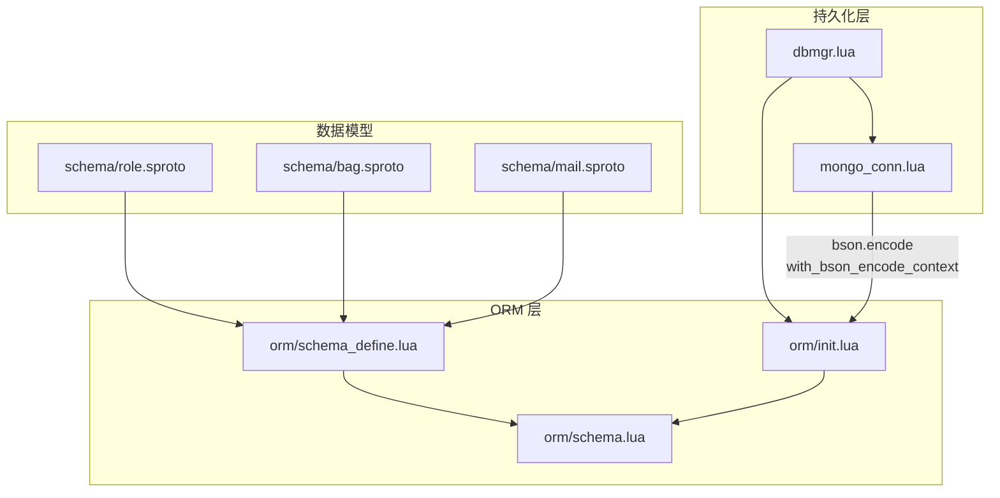
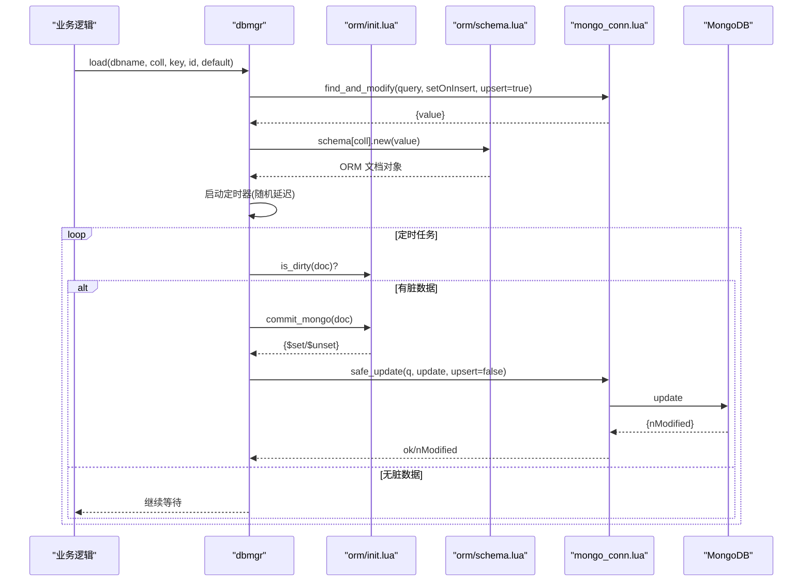
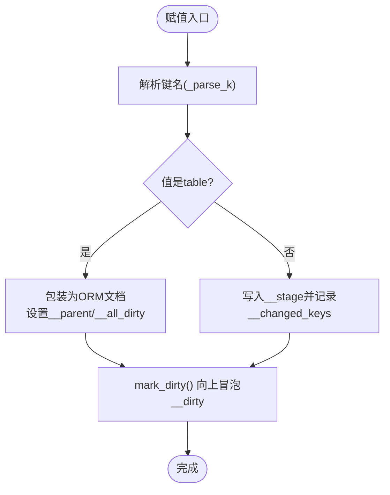
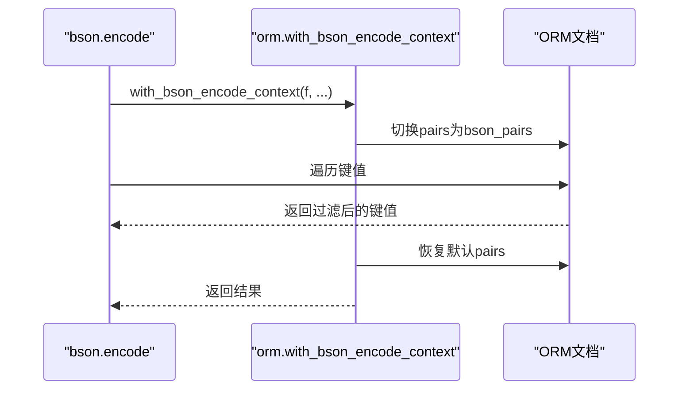
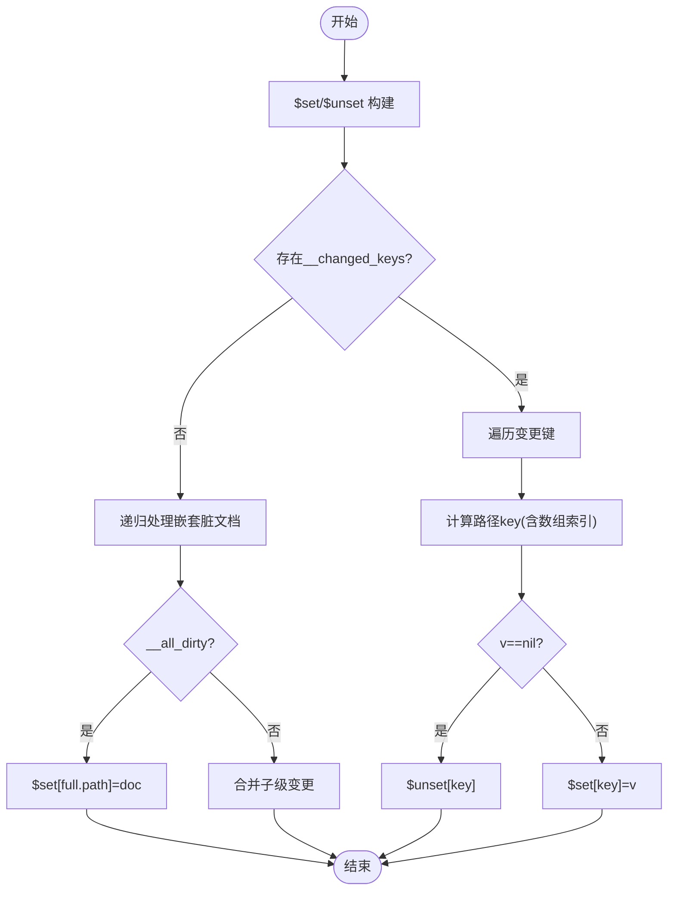
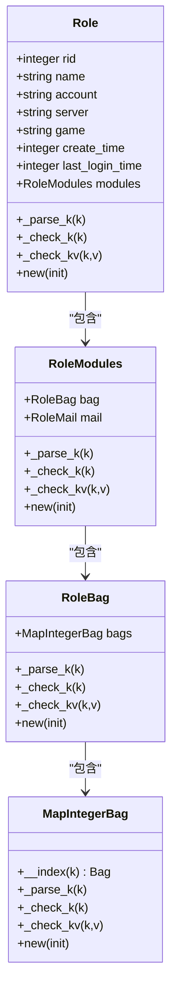
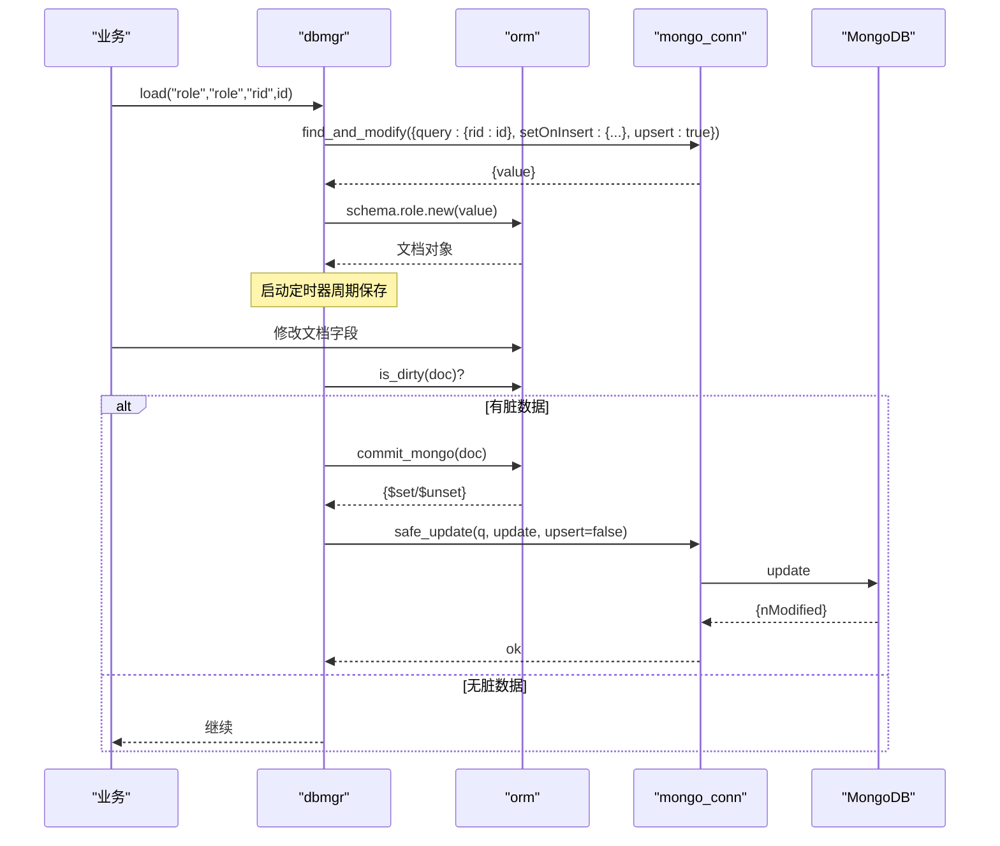
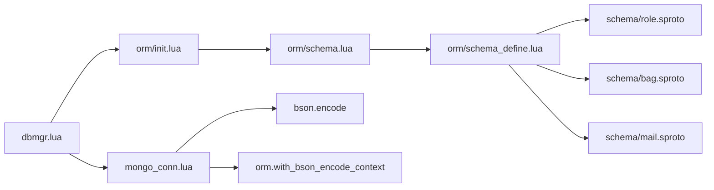

# ORM 框架

<cite>
**本文引用的文件**
- [lualib/orm/init.lua](file://lualib/orm/init.lua)
- [lualib/orm/schema.lua](file://lualib/orm/schema.lua)
- [lualib/orm/schema_define.lua](file://lualib/orm/schema_define.lua)
- [lualib/mongo_conn.lua](file://lualib/mongo_conn.lua)
- [lualib/dbmgr.lua](file://lualib/dbmgr.lua)
- [schema/bag.sproto](file://schema/bag.sproto)
- [schema/mail.sproto](file://schema/mail.sproto)
- [schema/role.sproto](file://schema/role.sproto)
</cite>

## 目录
1. [简介](#简介)
2. [项目结构](#项目结构)
3. [核心组件](#核心组件)
4. [架构总览](#架构总览)
5. [详细组件分析](#详细组件分析)
6. [依赖关系分析](#依赖关系分析)
7. [性能考量](#性能考量)
8. [故障排查指南](#故障排查指南)
9. [结论](#结论)
10. [附录：使用示例与最佳实践](#附录使用示例与最佳实践)

## 简介
本技术文档围绕 SkyExt 框架的 ORM 模块，系统性阐述其设计原理与实现细节，重点覆盖以下方面：
- 脏数据追踪机制与对象状态管理
- 嵌套对象处理与类型校验
- MongoDB 操作优化（增量更新、批量提交）
- Schema 定义方式、数据模型创建与 CRUD API
- 事务管理与错误处理策略
- 与 MongoDB 的集成方式及性能优化技巧
- 最佳实践指导

ORM 通过元表拦截字段赋值，自动记录变更并生成最小化的 MongoDB 更新指令；配合 dbmgr 提供缓存、定时落盘、版本控制与并发安全加载能力。

## 项目结构
ORM 相关代码主要分布在 lualib/orm 与 lualib/dbmgr、lualib/mongo_conn 中，Schema 由 sproto 描述并通过代码生成器产出 schema.lua。

**图表来源**
- [lualib/orm/init.lua:213-232](file://lualib/orm/init.lua#L213-L232)
- [lualib/orm/schema.lua:187-471](file://lualib/orm/schema.lua#L187-L471)
- [lualib/orm/schema_define.lua:1-131](file://lualib/orm/schema_define.lua#L1-L131)
- [lualib/mongo_conn.lua:14-19](file://lualib/mongo_conn.lua#L14-L19)
- [lualib/dbmgr.lua:94-148](file://lualib/dbmgr.lua#L94-L148)

**章节来源**
- [lualib/orm/init.lua:1-491](file://lualib/orm/init.lua#L1-L491)
- [lualib/orm/schema.lua:1-471](file://lualib/orm/schema.lua#L1-L471)
- [lualib/orm/schema_define.lua:1-131](file://lualib/orm/schema_define.lua#L1-L131)
- [lualib/mongo_conn.lua:1-152](file://lualib/mongo_conn.lua#L1-L152)
- [lualib/dbmgr.lua:1-219](file://lualib/dbmgr.lua#L1-L219)
- [schema/role.sproto:1-24](file://schema/role.sproto#L1-L24)
- [schema/bag.sproto:1-16](file://schema/bag.sproto#L1-L16)
- [schema/mail.sproto:1-37](file://schema/mail.sproto#L1-L37)

## 核心组件
- ORM 文档对象与脏标记
  - 通过元表 __newindex 拦截赋值，记录变更键集合 __changed_keys，并向上冒泡 __dirty 标记。
  - 支持嵌套对象与数组索引路径，序列化时跳过默认值，减少网络负载。
- Schema 类型系统
  - 基于 sproto 生成的 schema.lua，为每个结构体提供 _parse_k/_check_k/_check_kv 方法，严格校验键名与值类型。
  - 支持 map/array/struct 等复合类型，并提供 .new(init) 构造器。
- 持久化与缓存
  - dbmgr 负责按唯一键加载/卸载文档，维护进程内缓存，周期性触发保存。
  - mongo_conn 封装连接池与 BSON 编码，提供 find/find_one/safe_insert/safe_update 等接口。

**章节来源**
- [lualib/orm/init.lua:40-97](file://lualib/orm/init.lua#L40-L97)
- [lualib/orm/schema.lua:163-185](file://lualib/orm/schema.lua#L163-L185)
- [lualib/dbmgr.lua:53-92](file://lualib/dbmgr.lua#L53-L92)
- [lualib/mongo_conn.lua:44-77](file://lualib/mongo_conn.lua#L44-L77)

## 架构总览
ORM 在应用层以“文档对象”形式工作，所有修改均被追踪；dbmgr 作为门面提供 load/unload/save 流程；mongo_conn 负责与 MongoDB 交互，并在 BSON 编码阶段启用 ORM 的 bson 上下文，使迭代器行为适配 MongoDB 的 key 序列化规则。

**图表来源**
- [lualib/dbmgr.lua:94-148](file://lualib/dbmgr.lua#L94-L148)
- [lualib/dbmgr.lua:53-92](file://lualib/dbmgr.lua#L53-L92)
- [lualib/orm/init.lua:428-447](file://lualib/orm/init.lua#L428-L447)
- [lualib/mongo_conn.lua:44-77](file://lualib/mongo_conn.lua#L44-L77)

## 详细组件分析

### 脏数据追踪与对象状态管理
- 赋值拦截与变更收集
  - 通过 __newindex 将新值写入 __stage，并记录到 __changed_keys；若值为 ORM 文档，则建立父子关系 __parent。
  - mark_dirty 自底向上设置 __dirty，确保父节点感知子节点变更。
- 嵌套对象处理
  - doc_change_recursively 对 table 值进行递归包装为 ORM 文档，并设置 __all_dirty 标志，便于后续整体替换。
- 清理与克隆
  - _clear_dirty 用于初始化后清除脏标记；_clone_doc 通过 totable 深拷贝后再重建 ORM 文档，避免共享引用问题。

**图表来源**
- [lualib/orm/init.lua:54-97](file://lualib/orm/init.lua#L54-L97)
- [lualib/orm/init.lua:40-52](file://lualib/orm/init.lua#L40-L52)

**章节来源**
- [lualib/orm/init.lua:40-97](file://lualib/orm/init.lua#L40-L97)
- [lualib/orm/init.lua:120-124](file://lualib/orm/init.lua#L120-L124)
- [lualib/orm/init.lua:297-313](file://lualib/orm/init.lua#L297-L313)

### 序列化与 BSON 上下文
- 在 BSON 编码期间，切换 pairs 为 bson_pairs，跳过默认值并将非字符串键转为字符串，满足 MongoDB 的 key 要求。
- with_bson_encode_context 确保仅在编码阶段生效，避免影响常规遍历。

**图表来源**
- [lualib/orm/init.lua:213-232](file://lualib/orm/init.lua#L213-L232)
- [lualib/orm/init.lua:170-209](file://lualib/orm/init.lua#L170-L209)
- [lualib/mongo_conn.lua:14-19](file://lualib/mongo_conn.lua#L14-L19)

**章节来源**
- [lualib/orm/init.lua:170-232](file://lualib/orm/init.lua#L170-L232)
- [lualib/mongo_conn.lua:14-19](file://lualib/mongo_conn.lua#L14-L19)

### MongoDB 增量更新与批量提交
- commit_mongo 遍历 __changed_keys 与嵌套脏文档，生成 $set/$unset 指令，并计算路径 key（支持数组索引）。
- 当子文档 __all_dirty 为真时，直接对整个路径执行 $set，避免逐字段更新。
- dbmgr.save_doc 结合版本号 _version 实现乐观锁，保证并发安全。

**图表来源**
- [lualib/orm/init.lua:348-447](file://lualib/orm/init.lua#L348-L447)
- [lualib/dbmgr.lua:67-92](file://lualib/dbmgr.lua#L67-L92)

**章节来源**
- [lualib/orm/init.lua:348-447](file://lualib/orm/init.lua#L348-L447)
- [lualib/dbmgr.lua:67-92](file://lualib/dbmgr.lua#L67-L92)

### Schema 定义与类型校验
- sproto 定义数据结构，生成 schema_define.lua，再由 schema.lua 转换为带类型检查能力的 schema 对象。
- 每个 schema 提供 _parse_k/_check_k/_check_kv，确保键名合法且值类型正确。
- 复合类型（map/array/struct）通过元表 __index 动态返回元素 schema，简化访问。

**图表来源**
- [lualib/orm/schema.lua:328-435](file://lualib/orm/schema.lua#L328-L435)
- [lualib/orm/schema_define.lua:68-121](file://lualib/orm/schema_define.lua#L68-L121)

**章节来源**
- [lualib/orm/schema.lua:163-185](file://lualib/orm/schema.lua#L163-L185)
- [lualib/orm/schema.lua:187-471](file://lualib/orm/schema.lua#L187-L471)
- [lualib/orm/schema_define.lua:1-131](file://lualib/orm/schema_define.lua#L1-L131)

### 数据模型与 CRUD 操作
- 数据模型创建
  - 通过 schema[collection].new(data) 创建 ORM 文档，自动进行类型校验与嵌套包装。
- 查询与加载
  - dbmgr.load 使用 find_and_modify 进行 upsert，返回 ORM 文档并启动定时保存。
- 更新与提交
  - 业务侧直接修改文档字段；dbmgr.save_doc 调用 orm.commit_mongo 生成增量更新，再通过 mongo_conn.safe_update 提交。
- 删除与卸载
  - dbmgr.unload 取消定时器并强制保存一次，然后从缓存移除。

**图表来源**
- [lualib/dbmgr.lua:94-148](file://lualib/dbmgr.lua#L94-L148)
- [lualib/dbmgr.lua:67-92](file://lualib/dbmgr.lua#L67-L92)
- [lualib/orm/init.lua:428-447](file://lualib/orm/init.lua#L428-L447)
- [lualib/mongo_conn.lua:44-77](file://lualib/mongo_conn.lua#L44-L77)

**章节来源**
- [lualib/dbmgr.lua:94-148](file://lualib/dbmgr.lua#L94-L148)
- [lualib/dbmgr.lua:67-92](file://lualib/dbmgr.lua#L67-L92)
- [lualib/orm/init.lua:428-447](file://lualib/orm/init.lua#L428-L447)
- [lualib/mongo_conn.lua:44-77](file://lualib/mongo_conn.lua#L44-L77)

### 嵌套对象处理
- 嵌套 table 会被递归包装为 ORM 文档，并建立父子关系；当父文档迭代或序列化时，可正确处理嵌套结构。
- 对于数组型 schema，路径计算使用 k-1 作为 MongoDB 索引偏移，确保与 BSON 数组下标一致。

**章节来源**
- [lualib/orm/init.lua:73-86](file://lualib/orm/init.lua#L73-L86)
- [lualib/orm/init.lua:348-426](file://lualib/orm/init.lua#L348-L426)

### 错误处理与事务管理
- 类型校验错误
  - schema._check_kv 在类型不匹配时抛出错误，阻止非法数据进入 ORM 文档。
- 保存失败处理
  - save_dirty 检查 nModified 是否为 1，否则记录错误并回滚版本号，保证一致性。
- 并发与版本控制
  - 使用 _version 字段与 find_and_modify 的 upsert+update 组合，实现乐观锁；重复加载通过 loading 标志防重入。
- 循环引用检测
  - totable 与 _clear_dirty 中检测循环引用，防止无限递归。

**章节来源**
- [lualib/orm/schema.lua:163-185](file://lualib/orm/schema.lua#L163-L185)
- [lualib/dbmgr.lua:53-92](file://lualib/dbmgr.lua#L53-L92)
- [lualib/dbmgr.lua:102-131](file://lualib/dbmgr.lua#L102-L131)
- [lualib/orm/init.lua:100-118](file://lualib/orm/init.lua#L100-L118)
- [lualib/orm/init.lua:297-313](file://lualib/orm/init.lua#L297-L313)

## 依赖关系分析
- orm/init.lua 依赖 orm/schema.lua 的类型校验与构造器。
- dbmgr 依赖 orm 与 mongo_conn，协调缓存、定时保存与版本控制。
- mongo_conn 依赖 bson 与 orm.with_bson_encode_context，确保 BSON 编码兼容 ORM 文档。
- schema.lua 由 schema/*.sproto 生成，形成强类型约束。

**图表来源**
- [lualib/orm/init.lua:213-232](file://lualib/orm/init.lua#L213-L232)
- [lualib/mongo_conn.lua:14-19](file://lualib/mongo_conn.lua#L14-L19)
- [lualib/orm/schema.lua:187-471](file://lualib/orm/schema.lua#L187-L471)
- [lualib/orm/schema_define.lua:1-131](file://lualib/orm/schema_define.lua#L1-L131)

**章节来源**
- [lualib/orm/init.lua:213-232](file://lualib/orm/init.lua#L213-L232)
- [lualib/mongo_conn.lua:14-19](file://lualib/mongo_conn.lua#L14-L19)
- [lualib/orm/schema.lua:187-471](file://lualib/orm/schema.lua#L187-L471)
- [lualib/orm/schema_define.lua:1-131](file://lualib/orm/schema_define.lua#L1-L131)

## 性能考量
- 增量更新
  - 仅提交变更字段，显著减少网络与存储开销。
- 跳过默认值
  - 序列化时跳过默认值，降低 BSON 体积。
- 批量提交
  - 通过单次 safe_update 提交多个字段变更，减少数据库往返。
- 随机延迟保存
  - 定时任务采用随机延迟，避免多实例同时写库造成热点。
- 连接池与路由
  - mongo_conn 维护多连接并按需路由，提升吞吐。

[本节为通用性能建议，无需特定文件引用]

## 故障排查指南
- 类型不匹配
  - 现象：赋值时报错“not equal v type”。
  - 排查：确认 schema 定义与传入值类型一致。
- 保存未生效
  - 现象：nModified != 1。
  - 排查：检查 _version 是否被其他请求修改；确认查询条件正确。
- 循环引用
  - 现象：to_table 报错“not support circular reference”。
  - 排查：避免 ORM 文档之间形成环状引用。
- 重载 Schema
  - 使用 GM 命令 reload_orm_schema 热更新 schema，注意保持向后兼容。

**章节来源**
- [lualib/orm/schema.lua:163-185](file://lualib/orm/schema.lua#L163-L185)
- [lualib/dbmgr.lua:53-92](file://lualib/dbmgr.lua#L53-L92)
- [lualib/orm/init.lua:100-118](file://lualib/orm/init.lua#L100-L118)
- [lualib/dbmgr.lua:202-211](file://lualib/dbmgr.lua#L202-L211)

## 结论
SkyExt ORM 通过严格的类型校验、细粒度的脏数据追踪与高效的 MongoDB 增量更新，提供了高性能、易用的数据建模与持久化方案。配合 dbmgr 的缓存与版本控制，能够在高并发场景下保证数据一致性与可靠性。建议在业务中充分利用 ORM 的嵌套对象支持与 BSON 上下文，以获得最佳性能与可维护性。

[本节为总结性内容，无需特定文件引用]

## 附录：使用示例与最佳实践
- 数据建模
  - 使用 schema[collection].new(data) 创建 ORM 文档，遵循 sproto 定义的字段类型。
  - 参考路径：[lualib/dbmgr.lua:133-134](file://lualib/dbmgr.lua#L133-L134)
- 查询与加载
  - 通过 dbmgr.load 获取文档，内部自动 upsert 并启动定时保存。
  - 参考路径：[lualib/dbmgr.lua:94-148](file://lualib/dbmgr.lua#L94-L148)
- 更新与提交
  - 直接修改文档字段，dbmgr 会在定时任务中提交增量更新。
  - 参考路径：[lualib/dbmgr.lua:67-92](file://lualib/dbmgr.lua#L67-L92)
- 批量提交
  - 利用 commit_mongo 一次性生成 $set/$unset，减少数据库调用次数。
  - 参考路径：[lualib/orm/init.lua:428-447](file://lualib/orm/init.lua#L428-L447)
- 与 MongoDB 集成
  - 使用 mongo_conn.get_collection 获取集合，调用 safe_update 提交更新。
  - 参考路径：[lualib/mongo_conn.lua:44-77](file://lualib/mongo_conn.lua#L44-L77)
- 性能优化技巧
  - 合理设计 schema，避免过深的嵌套；尽量使用 map 结构以减少数组移动成本。
  - 利用 with_bson_encode_context 确保序列化效率。
  - 参考路径：[lualib/orm/init.lua:213-232](file://lualib/orm/init.lua#L213-L232)
- 错误处理与事务
  - 捕获类型校验错误，确保数据合法性；使用 _version 实现乐观锁。
  - 参考路径：[lualib/orm/schema.lua:163-185](file://lualib/orm/schema.lua#L163-L185)
  - 参考路径：[lualib/dbmgr.lua:67-92](file://lualib/dbmgr.lua#L67-L92)
- 最佳实践
  - 避免循环引用；及时 unload 释放资源；定期监控 nModified 与日志。
  - 参考路径：[lualib/orm/init.lua:100-118](file://lualib/orm/init.lua#L100-L118)
  - 参考路径：[lualib/dbmgr.lua:150-198](file://lualib/dbmgr.lua#L150-L198)