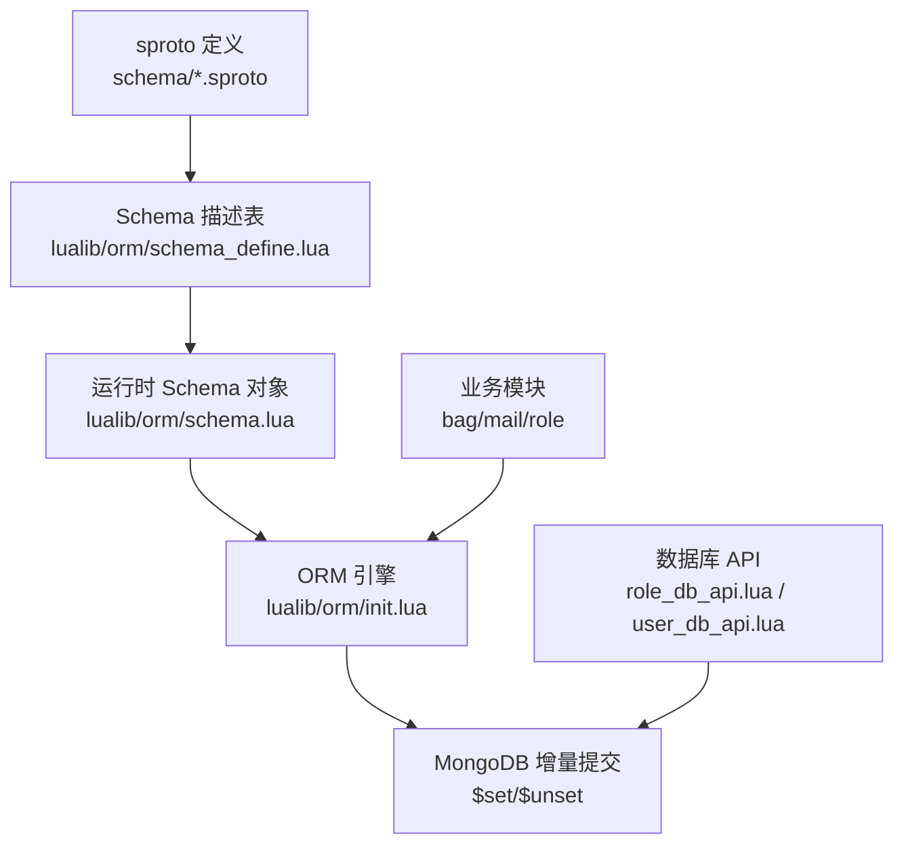
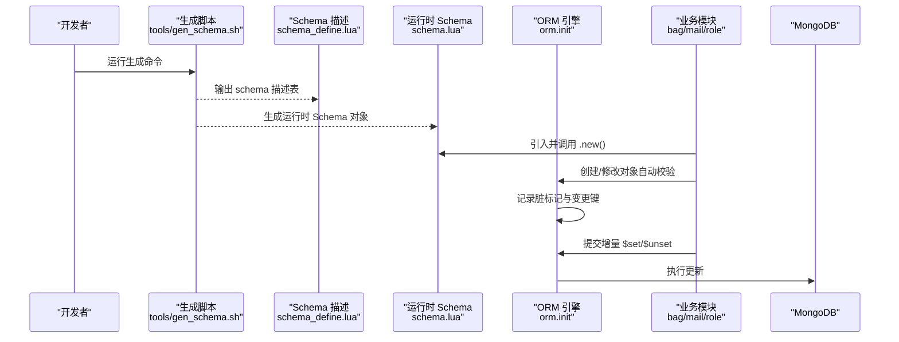
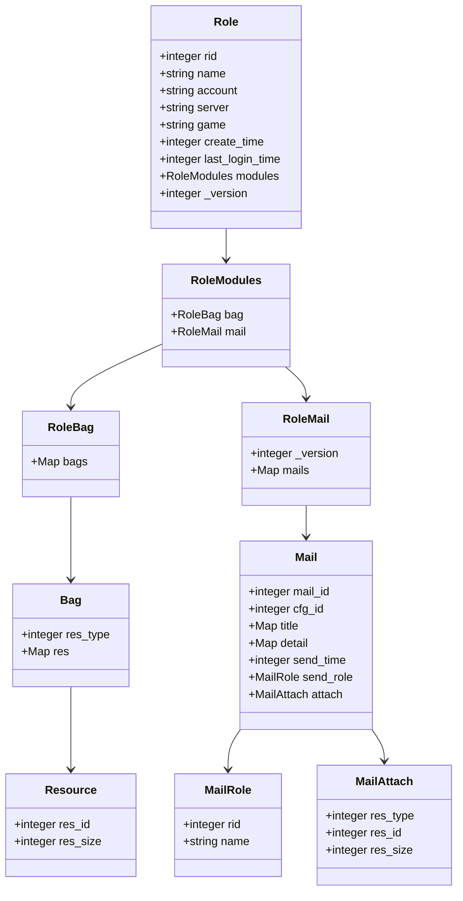
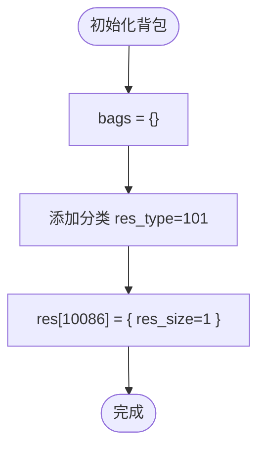
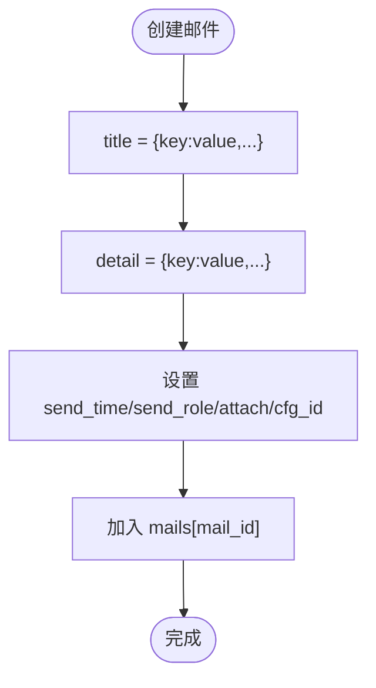
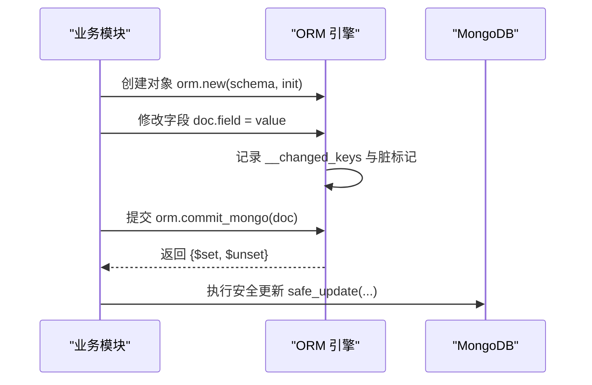
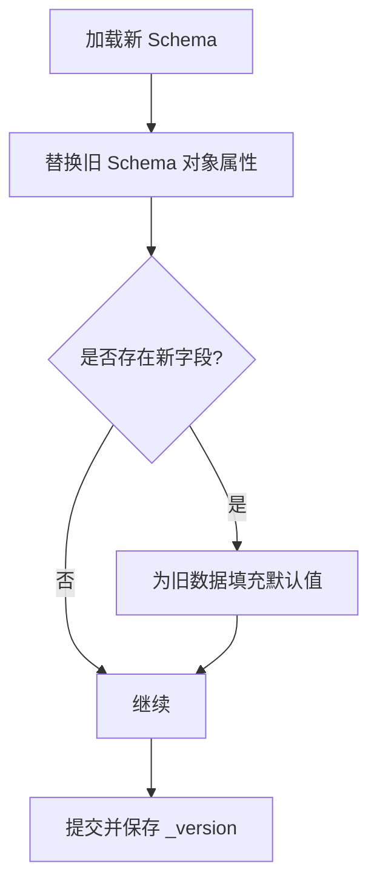
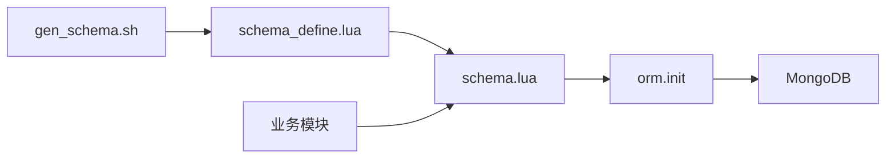

# Schema 使用示例

<cite>
**本文引用的文件**
- [schema/role.sproto](file://schema/role.sproto)
- [schema/bag.sproto](file://schema/bag.sproto)
- [schema/mail.sproto](file://schema/mail.sproto)
- [lualib/orm/schema_define.lua](file://lualib/orm/schema_define.lua)
- [lualib/orm/schema.lua](file://lualib/orm/schema.lua)
- [lualib/orm/init.lua](file://lualib/orm/init.lua)
- [tools/gen_schema.sh](file://tools/gen_schema.sh)
- [app/role/roleagent/modules/bag/init.lua](file://app/role/roleagent/modules/bag/init.lua)
- [app/role/roleagent/modules/mail/init.lua](file://app/role/roleagent/modules/mail/init.lua)
- [lualib/role_db_api.lua](file://lualib/role_db_api.lua)
- [lualib/user_db_api.lua](file://lualib/user_db_api.lua)
</cite>

## 目录
1. [简介](#简介)
2. [项目结构](#项目结构)
3. [核心组件](#核心组件)
4. [架构总览](#架构总览)
5. [详细组件分析](#详细组件分析)
6. [依赖关系分析](#依赖关系分析)
7. [性能考虑](#性能考虑)
8. [故障排查指南](#故障排查指南)
9. [结论](#结论)
10. [附录](#附录)

## 简介
本文件围绕项目中基于 sproto 的 Schema 与 ORM 的使用，提供从简单到复杂的完整示例与实践指南。内容涵盖：
- 用户模型、角色模型、背包系统、邮件系统等实际业务数据模型的 Schema 定义
- 嵌套结构、数组类型、可选字段、默认值等高级特性的使用方式
- 与 ORM 框架集成的创建、查询、更新操作实践
- Schema 版本管理与向后兼容性处理策略

## 项目结构
本项目将数据模型以 sproto 文件集中管理，并通过工具链生成 Lua 侧的 Schema 描述与运行时校验代码；ORM 层负责对象生命周期、脏标记追踪与 MongoDB 增量提交。

图表来源
- [schema/role.sproto:1-24](file://schema/role.sproto#L1-L24)
- [schema/bag.sproto:1-16](file://schema/bag.sproto#L1-L16)
- [schema/mail.sproto:1-37](file://schema/mail.sproto#L1-L37)
- [lualib/orm/schema_define.lua:1-131](file://lualib/orm/schema_define.lua#L1-L131)
- [lualib/orm/schema.lua:187-470](file://lualib/orm/schema.lua#L187-L470)
- [lualib/orm/init.lua:234-447](file://lualib/orm/init.lua#L234-L447)
- [lualib/role_db_api.lua:56-75](file://lualib/role_db_api.lua#L56-L75)
- [lualib/user_db_api.lua:28-35](file://lualib/user_db_api.lua#L28-L35)

章节来源
- [schema/role.sproto:1-24](file://schema/role.sproto#L1-L24)
- [schema/bag.sproto:1-16](file://schema/bag.sproto#L1-L16)
- [schema/mail.sproto:1-37](file://schema/mail.sproto#L1-L37)
- [lualib/orm/schema_define.lua:1-131](file://lualib/orm/schema_define.lua#L1-L131)
- [lualib/orm/schema.lua:187-470](file://lualib/orm/schema.lua#L187-L470)
- [lualib/orm/init.lua:234-447](file://lualib/orm/init.lua#L234-L447)
- [lualib/role_db_api.lua:56-75](file://lualib/role_db_api.lua#L56-L75)
- [lualib/user_db_api.lua:28-35](file://lualib/user_db_api.lua#L28-L35)

## 核心组件
- sproto 模型定义：角色、背包、邮件等数据结构
- Schema 描述与运行时对象：由工具生成的 schema_define.lua 与 schema.lua
- ORM 引擎：对象创建、字段校验、脏标记、增量提交
- 数据库 API：账号与角色的增删改查封装

章节来源
- [schema/role.sproto:1-24](file://schema/role.sproto#L1-L24)
- [schema/bag.sproto:1-16](file://schema/bag.sproto#L1-L16)
- [schema/mail.sproto:1-37](file://schema/mail.sproto#L1-L37)
- [lualib/orm/schema_define.lua:1-131](file://lualib/orm/schema_define.lua#L1-L131)
- [lualib/orm/schema.lua:187-470](file://lualib/orm/schema.lua#L187-L470)
- [lualib/orm/init.lua:234-447](file://lualib/orm/init.lua#L234-L447)
- [lualib/role_db_api.lua:56-75](file://lualib/role_db_api.lua#L56-L75)
- [lualib/user_db_api.lua:28-35](file://lualib/user_db_api.lua#L28-L35)

## 架构总览
下图展示了从 sproto 定义到 ORM 使用再到持久化的整体流程。

图表来源
- [tools/gen_schema.sh:1-10](file://tools/gen_schema.sh#L1-L10)
- [lualib/orm/schema_define.lua:1-131](file://lualib/orm/schema_define.lua#L1-L131)
- [lualib/orm/schema.lua:187-470](file://lualib/orm/schema.lua#L187-L470)
- [lualib/orm/init.lua:234-447](file://lualib/orm/init.lua#L234-L447)

## 详细组件分析

### 角色模型（用户/角色）
- 字段说明
  - rid: 角色唯一标识
  - name: 角色名
  - account: 所属账号
  - server/game: 服务器与玩法范围
  - create_time/last_login_time: 时间戳
  - modules: 模块聚合（背包、邮件）
  - _version: 用于版本控制
- 嵌套结构
  - role_modules 包含 bag 与 mail 两个子模块

图表来源
- [schema/role.sproto:1-24](file://schema/role.sproto#L1-L24)
- [schema/bag.sproto:1-16](file://schema/bag.sproto#L1-L16)
- [schema/mail.sproto:1-37](file://schema/mail.sproto#L1-L37)
- [lualib/orm/schema.lua:328-435](file://lualib/orm/schema.lua#L328-L435)

章节来源
- [schema/role.sproto:1-24](file://schema/role.sproto#L1-L24)
- [lualib/orm/schema.lua:328-435](file://lualib/orm/schema.lua#L328-L435)

### 背包系统
- 设计要点
  - 按资源分类（res_type）组织多个背包条目
  - 每个条目内以资源 id 为键的资源数量映射
- 使用示例路径
  - 初始化时预设一个分类与一条资源项，便于快速验证

图表来源
- [app/role/roleagent/modules/bag/init.lua:6-23](file://app/role/roleagent/modules/bag/init.lua#L6-L23)

章节来源
- [schema/bag.sproto:1-16](file://schema/bag.sproto#L1-L16)
- [app/role/roleagent/modules/bag/init.lua:6-23](file://app/role/roleagent/modules/bag/init.lua#L6-L23)

### 邮件系统
- 设计要点
  - 每封邮件包含标题与内容的多语言映射（str2str map）
  - 发送人信息、附件资源、发送时间等
  - 通过 mail_id 索引存储
- 使用示例路径
  - 模块初始化占位，后续可扩展创建/读取/删除逻辑

图表来源
- [schema/mail.sproto:1-37](file://schema/mail.sproto#L1-L37)
- [lualib/orm/schema.lua:250-271](file://lualib/orm/schema.lua#L250-L271)

章节来源
- [schema/mail.sproto:1-37](file://schema/mail.sproto#L1-L37)
- [lualib/orm/schema.lua:250-271](file://lualib/orm/schema.lua#L250-L271)

### ORM 集成：创建、查询、更新
- 创建
  - 使用 schema 对象的 .new(init) 构造 ORM 文档
  - 支持嵌套表自动包装为 ORM 对象并进行类型校验
- 查询
  - 通过数据库 API 获取原始数据后，传入 .new() 构建 ORM 对象
- 更新
  - 直接赋值字段或嵌套字段，ORM 自动记录变更键
  - 调用提交接口生成 $set/$unset 增量语句，减少网络与存储开销

图表来源
- [lualib/orm/init.lua:234-447](file://lualib/orm/init.lua#L234-L447)
- [lualib/role_db_api.lua:56-75](file://lualib/role_db_api.lua#L56-L75)
- [lualib/user_db_api.lua:28-35](file://lualib/user_db_api.lua#L28-L35)

章节来源
- [lualib/orm/init.lua:234-447](file://lualib/orm/init.lua#L234-L447)
- [lualib/role_db_api.lua:56-75](file://lualib/role_db_api.lua#L56-L75)
- [lualib/user_db_api.lua:28-35](file://lualib/user_db_api.lua#L28-L35)

### 版本管理与向后兼容
- 在角色与邮件模块中维护 _version 字段，配合服务端升级策略进行迁移
- 建议规则
  - 不允许删除已有字段
  - 不允许修改字段类型
  - 不允许修改字段名
  - 新增字段应设置合理默认值，保证旧客户端可正常解析
- 运行时 Schema 热替换
  - 提供重载机制，可在不重启服务的情况下将旧 Schema 对象属性替换为新定义，保持内存对象稳定

图表来源
- [lualib/orm/init.lua:461-481](file://lualib/orm/init.lua#L461-L481)
- [schema/role.sproto:1-24](file://schema/role.sproto#L1-L24)
- [schema/mail.sproto:1-37](file://schema/mail.sproto#L1-L37)

章节来源
- [lualib/orm/init.lua:461-481](file://lualib/orm/init.lua#L461-L481)
- [schema/role.sproto:1-24](file://schema/role.sproto#L1-L24)
- [schema/mail.sproto:1-37](file://schema/mail.sproto#L1-L37)

## 依赖关系分析
- sproto 到 Lua 的生成链路
  - tools/gen_schema.sh 调用生成器产出 schema_define.lua 与 schema.lua
- 运行时依赖
  - schema.lua 依赖 orm.init 提供的 new、commit_mongo 等能力
  - 业务模块依赖 schema.lua 暴露的类型对象进行建模
  - 数据库 API 封装 MongoDB 连接与集合操作

图表来源
- [tools/gen_schema.sh:1-10](file://tools/gen_schema.sh#L1-L10)
- [lualib/orm/schema_define.lua:1-131](file://lualib/orm/schema_define.lua#L1-L131)
- [lualib/orm/schema.lua:187-470](file://lualib/orm/schema.lua#L187-L470)
- [lualib/orm/init.lua:234-447](file://lualib/orm/init.lua#L234-L447)

章节来源
- [tools/gen_schema.sh:1-10](file://tools/gen_schema.sh#L1-L10)
- [lualib/orm/schema_define.lua:1-131](file://lualib/orm/schema_define.lua#L1-L131)
- [lualib/orm/schema.lua:187-470](file://lualib/orm/schema.lua#L187-L470)
- [lualib/orm/init.lua:234-447](file://lualib/orm/init.lua#L234-L447)

## 性能考虑
- 增量提交：ORM 仅提交变更字段，显著降低网络与存储压力
- 序列化优化：在 BSON 编码期间对 key 做类型转换，避免额外开销
- 脏标记传播：父级脏标记向上冒泡，减少重复扫描
- 批量更新：尽量合并多次字段修改后再提交，减少数据库往返

## 故障排查指南
- 类型错误
  - 当字段类型不匹配时会抛出错误，检查输入数据的类型是否符合 schema 定义
- 循环引用
  - ORM 不支持循环引用，若出现相关错误需调整数据结构
- 并发冲突
  - 创建账号/角色时可能遇到并发写入冲突，API 已内置重试与回滚逻辑
- 版本不一致
  - 升级 Schema 后需确保客户端与服务端兼容，必要时进行数据迁移

章节来源
- [lualib/orm/init.lua:321-327](file://lualib/orm/init.lua#L321-L327)
- [lualib/orm/init.lua:120-124](file://lualib/orm/init.lua#L120-L124)
- [lualib/user_db_api.lua:60-80](file://lualib/user_db_api.lua#L60-L80)
- [lualib/role_db_api.lua:56-75](file://lualib/role_db_api.lua#L56-L75)

## 结论
通过 sproto + ORM 的组合，本项目实现了强类型的数据建模、安全的运行时校验与高效的增量持久化。借助统一的 Schema 生成管线与版本管理机制，可以在保证向后兼容的前提下持续演进数据结构，满足复杂业务场景下的扩展与维护需求。

## 附录
- 常用操作参考
  - 创建对象：使用 schema 对象的 .new(init)
  - 修改字段：直接赋值，ORM 自动记录变更
  - 提交更新：调用 orm.commit_mongo(doc) 获取 $set/$unset
  - 数据库交互：通过 role_db_api 与 user_db_api 进行读写
- 生成命令
  - 运行 tools/gen_schema.sh 重新生成 schema 描述与运行时对象

章节来源
- [lualib/orm/schema.lua:187-470](file://lualib/orm/schema.lua#L187-L470)
- [lualib/orm/init.lua:234-447](file://lualib/orm/init.lua#L234-L447)
- [lualib/role_db_api.lua:56-75](file://lualib/role_db_api.lua#L56-L75)
- [lualib/user_db_api.lua:28-35](file://lualib/user_db_api.lua#L28-L35)
- [tools/gen_schema.sh:1-10](file://tools/gen_schema.sh#L1-L10)